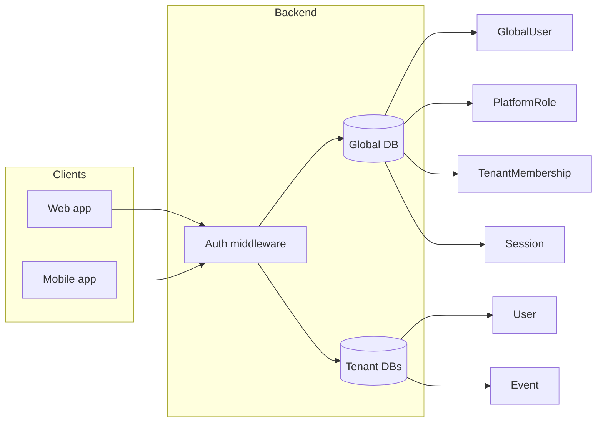

<Info>
  **Audience**: Developers and operators working on Meridian's backend, frontend, or deployment. This doc describes the multi-tenant identity system added to support platform admins, cross-tenant event registration, and SSO across subdomains (e.g. rpi.meridian.study, tvcog.meridian.study).
</Info>

## Overview

The multi-tenant identity implementation provides:

| Goal | Description |
|------|-------------|
| **Platform admins** | A small set of users with admin access on every tenant (school) without needing a local User in each tenant DB. |
| **Multi-tenant users (light)** | A user with a global identity can register for an event at another school as a "global guest" without a full account there. |
| **Multi-tenant users (full)** | A user can be a member of multiple schools with one identity; profile can be linked across tenants. |
| **Single sign-on (SSO)** | One login works across all subdomains (e.g. rpi.meridian.study, tvcog.meridian.study) via a shared cookie domain. |
| **Strict per-tenant data** | Tenant-specific data (users, events, orgs) stays in each tenant's database; cross-tenant data lives only in the global DB where needed. |

---

## Architecture

### High-level flow



### Per-request data flow

1. **Subdomain** sets `req.school` and `req.db` (unchanged): derived from `Host` (e.g. `rpi` from `rpi.meridian.study`). In development, `localhost` defaults to `rpi`.
2. **JWT** is verified; payload may include `globalUserId`, `tenantUserId`, `platformRoles`, `roles`.
3. **Middleware** resolves `req.user.tenantUserId` from the global DB via `TenantMembership(globalUserId, req.school)`. For backward compatibility, `req.user.userId = req.user.tenantUserId` so existing code using `req.user.userId` and `getModels(req, 'User')` keeps working. When there is no membership, `userId` is null (guest on that tenant).
4. **Admin routes** use `requireAdmin`: platform admin (from global DB or token) first, then tenant `User.roles` (admin/root).

---

## Tenant derivation (subdomain)

- **Production**: Tenant is the first segment of the host. Examples: `rpi.meridian.study` → `req.school = 'rpi'`, `tvcog.meridian.study` → `req.school = 'tvcog'`.
- **Development**: If the host is `localhost` or an IP address, the backend defaults to `req.school = 'rpi'` so local testing works without subdomains.

Implemented in `Meridian/backend/app.js`: the middleware that sets `req.db` and `req.school` reads `req.headers.host`, splits on `.`, and applies the localhost default when appropriate.

---

## Global database

### Purpose

A dedicated MongoDB database holds **cross-tenant** data only:

- **GlobalUser** – one identity per person (email, name, picture, provider ids).
- **PlatformRole** – which global users are platform admins (or root).
- **TenantMembership** – which global user is linked to which tenant and which tenant User id.
- **Session** – refresh sessions keyed by `globalUserId` so token refresh works across tenants (SSO).

Tenant-specific data (User, Event, Org, etc.) remains in each tenant DB.

### Connection

- **File**: `Meridian/backend/connectionsManager.js`
- **Function**: `connectToGlobalDatabase()` 
- **Config**: Reads `MONGO_URI_PLATFORM` or `MONGO_URI_GLOBAL`. If unset, derives a DB from the default tenant URI (e.g. same cluster, database name `meridian_platform`).
- **Attach**: In `app.js`, the same middleware that sets `req.db` sets `req.globalDb = await connectToGlobalDatabase()` so every request has access.

### Global schemas

Located under `Meridian/backend/schemas/`:

| Schema | Collection | Purpose |
|--------|------------|---------|
| **GlobalUser** | `global_users` | One document per person. Fields: `email` (unique), `name`, `picture`, `googleId`, `appleId`, `samlId`, `samlProvider`, timestamps. Indexes on email, googleId, appleId, (samlId, samlProvider). |
| **PlatformRole** | `platform_roles` | One document per global user for platform-wide roles. Fields: `globalUserId`, `roles` (e.g. `['platform_admin']`). Unique index on `globalUserId`. |
| **TenantMembership** | `tenant_memberships` | Links global user to a tenant and its User. Fields: `globalUserId`, `tenantKey` (e.g. `'rpi'`, `'tvcog'`), `tenantUserId` (ObjectId, no ref to avoid cross-DB refs), `status` (`'active'|'invited'|'left'`). Compound unique on `(globalUserId, tenantKey)`. |
| **Session** (global) | `sessions` | Refresh sessions for SSO. Fields: `globalUserId`, `refreshToken`, `deviceInfo`, `userAgent`, `ipAddress`, `expiresAt`, etc. Keyed by `globalUserId` so refresh works on any tenant. |

### getGlobalModelService

- **File**: `Meridian/backend/services/getGlobalModelService.js`
- **Usage**: `const { GlobalUser, PlatformRole, TenantMembership, Session } = getGlobalModels(req, 'GlobalUser', 'PlatformRole', 'TenantMembership', 'Session');`
- **Rule**: Use only in auth flows, session handling, and platform-admin resolution. Tenant routes continue to use `getModelService(req, ...)` with `req.db`.

<Warning>
  **Never** use the default `mongoose` connection or `mongoose.model()` for app data. Use `getModels(req, ...)` for tenant data and `getGlobalModels(req, ...)` for global data.
</Warning>

---

## JWT shape and auth

### New token payload

- `globalUserId` – always present for authenticated users.
- `tenantUserId` – present when the user has a TenantMembership for the tenant they logged in on; for other tenants, resolved in middleware from TenantMembership.
- `platformRoles` – optional array from PlatformRole (e.g. `['platform_admin']`) to avoid a DB hit on every request.
- `roles` – tenant User roles (for backward compatibility and existing `authorizeRoles` when not using platform admin).

### Backward compatibility

Legacy tokens that only have `userId` and `roles` are still accepted. Middleware sets `req.user.userId = decoded.userId` and `req.user.roles = decoded.roles`. `globalUserId` is not set for legacy tokens unless a separate backfill runs.

### Login/register flow (create-or-find GlobalUser + TenantMembership)

After validating credentials (or OAuth/SAML):

1. **Get or create GlobalUser** by email (and optionally by `googleId` / `appleId` / SAML id). New GlobalUser: copy `email`, `name`, `picture`, provider ids from the tenant User or OAuth profile.
2. **Get or create TenantMembership** for `(globalUserId, req.school)`. If creating, create or find the **tenant User** in `req.db`, then set `TenantMembership.tenantUserId` to that User's `_id`.
3. **Load PlatformRole** for this `globalUserId` (if any).
4. **Issue JWT** with `globalUserId`, `tenantUserId` (for current school), `platformRoles`, `roles` (from tenant User).
5. **Create Session** in the global DB keyed by `globalUserId` so refresh works across tenants.

This pattern is applied to: password login, register, Google/Apple OAuth, SAML callback. A shared helper (e.g. `issueTokens(req, res, globalUser, tenantUser, platformRoles)`) in `authGlobalService.js` is used so every code path that issues tokens is consistent.

### Sessions and refresh (global)

- Session storage lives in the **global DB**. The `Session` collection has `globalUserId`, `refreshToken`, device/userAgent/ip, `expiresAt`. Refresh token payload: `{ globalUserId, type: 'refresh' }`.
- On refresh: verify JWT, validate session in global DB, resolve `tenantUserId` for `req.school` via TenantMembership, then issue new access (and optionally refresh) token with the same shape.

### Cookie domain for SSO

- In **production**, when setting `accessToken` / `refreshToken` cookies, set `domain: '.meridian.study'` so the cookie is sent to all subdomains.
- In **development**, omit `domain` (defaults to current host).
- **CORS**: Production `corsOptions.origin` in `app.js` must allow all intended subdomains (e.g. `rpi.meridian.study`, `tvcog.meridian.study`) so the frontend on any subdomain can send credentials and receive cookies.

---

## Auth middleware (verifyToken)

- **File**: `Meridian/backend/middlewares/verifyToken.js`
- After verifying the JWT, if the payload has `globalUserId`, the middleware **resolves** `tenantUserId` from TenantMembership for `(decoded.globalUserId, req.school)` and sets:
  - `req.user.globalUserId`
  - `req.user.tenantUserId`
  - `req.user.userId = tenantUserId` (so existing code using `req.user.userId` works)
  - `req.user.roles` (from tenant User if found, else from token)
  - `req.user.platformRoles`
- If the token is **legacy** (no `globalUserId`), behavior is unchanged: `req.user.userId = decoded.userId`, `req.user.roles = decoded.roles`.
- **verifyTokenOptional**: Same resolution when the token is valid; when the token is expired, the refresh path uses the global Session and TenantMembership, then sets `req.user` with the new shape.

---

## Platform admins (requireAdmin)

### Resolve admin status

- **File**: `Meridian/backend/middlewares/requireAdmin.js`
- **Middleware**: `requireAdmin` (or “require platform or tenant admin”):
  1. If `req.user.platformRoles` includes `platform_admin` or `root` → allow.
  2. Else if `req.user.globalUserId` exists, load PlatformRole from the global DB; if roles include `platform_admin` or `root` → allow.
  3. Else if `req.user.userId` exists, load User from `req.db`; if `user.roles` includes `admin` or `root` → allow.
  4. Else return 403.

Admin routes use `requireAdmin` instead of `authorizeRoles('admin', 'root')` so platform admins have access on every tenant. Routes that should allow only tenant admins for certain actions can still use `requireAdmin` for the route and enforce tenant-specific rules in the handler if needed.

### Platform admins API

Under `Meridian/backend/routes/adminRoutes.js`:

| Method | Path | Description |
|--------|------|-------------|
| **GET** | `/admin/platform-admins` | List GlobalUsers that have a PlatformRole with `platform_admin`. Returns `{ success: true, data: [{ globalUserId, email, name, picture }] }`. Protected by `requireAdmin`. |
| **POST** | `/admin/platform-admins` | Add platform admin. Body: `{ email? }` or `{ globalUserId? }`. Look up GlobalUser by email or id; create or update PlatformRole with `roles: ['platform_admin']`. Protected by `requireAdmin`. |
| **DELETE** | `/admin/platform-admins/:globalUserId` | Remove `platform_admin` from that user's PlatformRole. Protected by `requireAdmin`. |

### Platform admins UI

- **Frontend**: `Meridian/frontend/src/pages/Admin/PlatformAdminsPage/PlatformAdminsPage.jsx` – lists platform admins, “Add” by email, “Remove”. Wired under the Admin area (e.g. “Platform Admins” tab).
- Visibility should be restricted to users who pass the backend `requireAdmin` check (platform or tenant admin).

### Seeding the first platform admin(s)

- **Env**: `PLATFORM_ADMIN_EMAILS=admin@example.com` (comma-separated if multiple).
- **Script**: From `Meridian/backend/`, run `node scripts/seedPlatformAdmins.js`. It creates or finds GlobalUser by email and adds PlatformRole with `platform_admin`.
- Alternatively, create a migration that inserts GlobalUser + PlatformRole for a fixed email. Document in backend docs how to add the first platform admin.

---

## Cross-tenant event registration

### Event schema: global attendees

- **File**: `Meridian/backend/events/schemas/event.js` (or Events-Backend equivalent)
- **Field**: `globalAttendees` – array of `{ globalUserId, email, name, picture?, sourceTenant?, registeredAt, guestCount, checkedIn, checkedInAt, checkedInBy }`. No ref to User in tenant DB.
- **Index**: Ensure queries for “is this user already registered?” consider both `attendees.userId` and `globalAttendees.globalUserId`.

### RSVP route: global guest

- In **POST** RSVP (e.g. `POST /rsvp/:event_id`): If `req.user.userId` exists, keep current behavior (add/update in `event.attendees`). Else if `req.user.globalUserId` exists, treat as **global guest**: check `event.globalAttendees` by `globalUserId`, then append to `globalAttendees` with data from GlobalUser and apply the same validation (capacity, deadline, form if any). FormResponse may store `globalSubmittedBy` (ObjectId) for global guests.
- In **DELETE** RSVP (withdraw): Allow withdrawal if either `attendees.userId === req.user.userId` or `globalAttendees.globalUserId === req.user.globalUserId`.
- **GET** event/list: Include both `attendees` and `globalAttendees` (or a merged view with a flag like `isGuest: true`) so organizers see “Name (guest)” or “Name (from RPI)” as needed.

### Join school (create tenant user + membership)

- **Endpoint**: `POST /auth/join-tenant` (or `/join-tenant`). Protected by `verifyToken`. Expects `req.user.globalUserId` (user must be logged in with global identity). Body can be empty; tenant comes from `req.school`.
- **Logic**: Look up TenantMembership for `(req.user.globalUserId, req.school)`. If already active, return success. Else: load GlobalUser; create a new User in `req.db` with email, name, picture, provider ids from GlobalUser and default tenant fields (`roles: ['user']`, etc.); create TenantMembership with `globalUserId`, `tenantKey: req.school`, `tenantUserId: newUser._id`, `status: 'active'`. Optionally issue a new token with `tenantUserId` set.
- **Frontend**: When validate-token returns `user: null` but `communities` (or similar), show a “Join [School name]” CTA that calls this endpoint and then refreshes auth state.

---

## Migration and backward compatibility

### Legacy tokens

- Keep accepting the old JWT shape (`userId`, `roles` only) in `verifyToken.js`; set `req.user.userId`, `req.user.roles`. Optional: lazy backfill (on first request with legacy token, resolve or create GlobalUser + TenantMembership and set `req.user.globalUserId` for that request only; optionally refresh token with new shape).

### Existing users (one-time migration)

- **Script**: `Meridian/backend/scripts/migrateUsersToGlobalIdentity.js`
- **Behavior**: For each tenant key (e.g. `rpi`, `tvcog`), load all Users from that tenant’s DB; for each User, get or create GlobalUser by email (and provider ids), then get or create TenantMembership for `(globalUserId, tenantKey)` with `tenantUserId = User._id`. Existing User documents are not changed.
- **Config**: Edit `tenantKeys` in the script to match your tenants; ensure `MONGO_URI_PLATFORM` (or `MONGO_URI_GLOBAL`) and tenant DB URIs are set. Run from `Meridian/backend/`: `node scripts/migrateUsersToGlobalIdentity.js`.

---

## Security and SOC2 notes

- **Global DB**: Restrict access (network and credentials); only the main app should connect. Use least privilege for platform admin management (only platform admins can add/remove).
- **Audit**: Log platform admin add/remove (who, when, by whom) in your existing audit or logging pipeline.
- **Cookie**: `httpOnly`, `secure` in production, `sameSite: 'strict'` (or `lax` if cross-site links must preserve login). Domain `.meridian.study` only in production.

---

## Setting up in staging / production

Use this checklist when enabling multi-tenant identity on a staging or production environment.

### 1. Environment variables

Set these in your staging/production environment (e.g. in your host’s env or `.env`):

| Variable | Required | Description |
|----------|----------|-------------|
| `NODE_ENV` | Yes | Set to `production` (or ensure it’s set for staging) so CORS and cookie domain use production behavior. |
| `MONGO_URI_PLATFORM` or `MONGO_URI_GLOBAL` | Yes* | MongoDB URI for the **global** database (GlobalUser, PlatformRole, TenantMembership, Session). *If unset, the app derives a DB from `MONGO_URI_RPI` or `DEFAULT_MONGO_URI` by replacing the DB name with `meridian_platform`. For staging/prod, prefer setting an explicit URI. |
| `MONGO_URI_RPI` | Yes (if using rpi) | MongoDB URI for the RPI tenant database. |
| `MONGO_URI_TVCOG` | If using tvcog | MongoDB URI for the tvcog tenant database. |
| `JWT_SECRET` | Yes | Same secret used for access tokens across all tenants. |
| `JWT_REFRESH_SECRET` | Optional | Defaults to `JWT_SECRET` if unset. |

Existing tenant DB vars (`MONGODB_URI`, `DEFAULT_MONGO_URI`, etc.) stay as you already use them. The global DB can be a **new database on the same cluster** (e.g. `meridian_platform`) or a separate cluster.

### 2. CORS and cookie domain

- **Production** (`NODE_ENV=production`): The app allows origins `https://www.meridian.study`, `https://meridian.study`, `https://rpi.meridian.study`, `https://tvcog.meridian.study` and sets auth cookies with `domain: '.meridian.study'` so SSO works across subdomains.
- **Staging**: If your staging site uses the **same parent domain** (e.g. `rpi.staging.meridian.study`), add those origins in `Meridian/backend/app.js` in the `corsOrigin` / `corsOptions.origin` arrays, and set cookie `domain` to `.staging.meridian.study` in:
  - `Meridian/backend/routes/authRoutes.js` (cookieOptions / clearOpts)
  - `Meridian/backend/middlewares/verifyToken.js` (cookieOptions on refresh)
  - `Meridian/backend/services/authGlobalService.js` (cookieOptions in issueTokens)
  - `Meridian/backend/routes/adminRoutes.js` (impersonate cookieOpts)
  If staging uses a different domain entirely, use the same pattern (one parent domain for CORS and cookie domain).

### 3. Add new tenants (if needed)

In `Meridian/backend/connectionsManager.js`, extend `getDbUriForSchool()` so each subdomain has a URI:

```javascript
const schoolDbMap = {
  rpi: process.env.MONGO_URI_RPI,
  tvcog: process.env.MONGO_URI_TVCOG,
  // staging: process.env.MONGO_URI_STAGING,
};
```

Add the corresponding env var (e.g. `MONGO_URI_STAGING`) in your environment. Ensure CORS (and cookie domain if SSO is used) includes the new subdomain.

### 4. (Optional) Migrate existing users

If you already have Users in tenant DBs and want them to have global identity and SSO:

1. Set `MONGO_URI_PLATFORM` (or `MONGO_URI_GLOBAL`) and all tenant URIs (`MONGO_URI_RPI`, `MONGO_URI_TVCOG`, etc.) in the environment.
2. In `Meridian/backend/scripts/migrateUsersToGlobalIdentity.js`, set `tenantKeys` to the list of tenant keys you use (e.g. `['rpi', 'tvcog']`).
3. From the backend directory, run:
   ```bash
   node scripts/migrateUsersToGlobalIdentity.js
   ```
4. The script creates GlobalUser (by email) and TenantMembership per tenant User. Existing User documents are not modified. New logins will attach to these GlobalUsers.

### 5. Seed the first platform admins

Before or after deploy, create at least one platform admin:

1. Set `PLATFORM_ADMIN_EMAILS` to a comma-separated list of emails (e.g. `admin@meridian.study`). These must be emails that exist (or will exist) as GlobalUser—e.g. after migration, or after the first login with that email.
2. From the backend directory, run:
   ```bash
   MONGO_URI_PLATFORM=<your-global-db-uri> PLATFORM_ADMIN_EMAILS=admin@example.com node scripts/seedPlatformAdmins.js
   ```
   Or ensure `MONGO_URI_PLATFORM` is already in the environment and run:
   ```bash
   PLATFORM_ADMIN_EMAILS=admin@example.com node scripts/seedPlatformAdmins.js
   ```
3. Those users can then log in on any tenant and access admin routes (e.g. Platform Admins UI). You can also add/remove platform admins later via the Admin → Platform Admins UI (if you have at least one tenant or platform admin).

### 6. Deploy and verify

1. Deploy the backend (with the env vars above). Ensure the app starts and can connect to both tenant DBs and the global DB.
2. Open a tenant subdomain (e.g. `https://rpi.meridian.study`), log in, and confirm auth works.
3. If SSO is configured, open another tenant (e.g. `https://tvcog.meridian.study`) in the same browser and confirm you are still logged in (same user or no prompt to log in again, depending on membership).
4. As a platform admin, open Admin → Platform Admins and confirm you can list/add/remove platform admins.
5. (Optional) Test global-guest event RSVP: log in on tenant A, open an event on tenant B (where you have no tenant User), and confirm you can register as a guest or use “Join school” if implemented.

### 7. Security checklist

- Use **HTTPS** in staging/production so cookies are sent with `secure: true`.
- Restrict **global DB** network and credentials to the app only; do not expose it to other services unless required.
- **Audit**: Ensure platform admin add/remove is logged (who, when, by whom) for SOC2 or compliance.
- Keep **JWT_SECRET** and **JWT_REFRESH_SECRET** strong and not committed to the repo.

---

## Quick reference: key files

| Purpose | File(s) |
|---------|--------|
| App entry, CORS, DB middleware, route mounting | `Meridian/backend/app.js` |
| Per-tenant and global DB connections | `Meridian/backend/connectionsManager.js` |
| Request-scoped tenant models | `Meridian/backend/services/getModelService.js` |
| Global (cross-tenant) models | `Meridian/backend/services/getGlobalModelService.js` |
| Auth flows (get/create GlobalUser, TenantMembership, issueTokens) | `Meridian/backend/services/authGlobalService.js` |
| Session create/validate (global and legacy) | `Meridian/backend/utilities/sessionUtils.js` |
| JWT auth and tenant user resolution | `Meridian/backend/middlewares/verifyToken.js` |
| Platform or tenant admin check | `Meridian/backend/middlewares/requireAdmin.js` |
| Auth routes (login, register, refresh, join-tenant, validate-token) | `Meridian/backend/routes/authRoutes.js` |
| Platform admins API | `Meridian/backend/routes/adminRoutes.js` |
| SAML (then issue tokens via authGlobalService) | `Meridian/backend/routes/samlRoutes.js` |
| Event RSVP (global guest, globalAttendees) | `Meridian/backend/events/routes/eventRoutes.js` |
| Global schemas | `Meridian/backend/schemas/globalUser.js`, `platformRole.js`, `tenantMembership.js`, `globalSession.js` |
| Seed platform admins | `Meridian/backend/scripts/seedPlatformAdmins.js` |
| Migrate existing users to global identity | `Meridian/backend/scripts/migrateUsersToGlobalIdentity.js` |
| Platform Admins UI | `Meridian/frontend/src/pages/Admin/PlatformAdminsPage/` |

---

## Related pages

<CardGroup cols={2}>
  <Card title="Authentication overview" icon="shield" href="/backend/auth/overview">
    Password, Google, Apple, JWTs, cookies vs mobile, and how they tie to `GlobalUser`.
  </Card>
  <Card title="Session management" icon="rotate" href="/backend/auth/sessions">
    Refresh tokens, multi-device sessions, and global session storage for SSO.
  </Card>
  <Card title="Backend best practices" icon="server" href="/backend/best-practices">
    `req.db`, `getGlobalModelService`, `verifyToken`, and route conventions.
  </Card>
  <Card title="SAML" icon="key" href="/backend/auth/SAML">
    Per-tenant SAML; after IdP callback, provisioning uses the same global identity path.
  </Card>
  <Card title="Multi-tenant test scenarios" icon="list" href="/backend/multi-tenant-test-scenarios">
    Route tests and isolation checks for cross-tenant and membership edge cases.
  </Card>
  <Card title="Testing" icon="flask" href="/testing">
    Where auth and tenant tests live and how CI runs them.
  </Card>
  <Card title="Atlas backend" icon="route" href="/atlas/backend">
    Org and event APIs; `requireAdmin` respects platform admins from the global DB.
  </Card>
  <Card title="API reference" icon="book" href="/api-reference/introduction">
    HTTP API scope and how callers authenticate.
  </Card>
</CardGroup>
