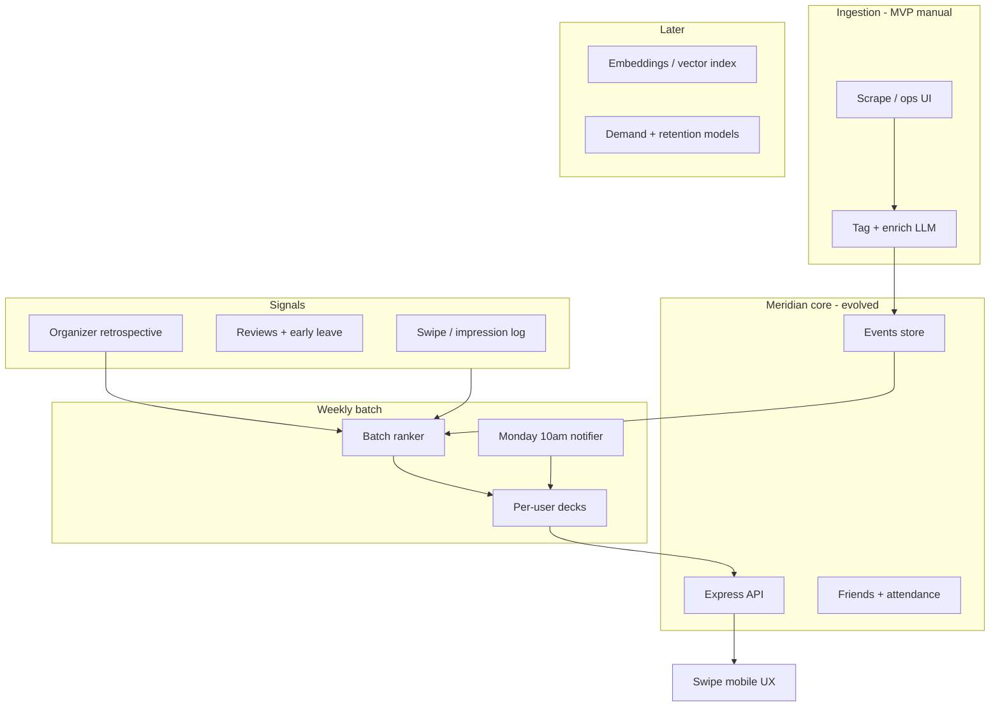

## Summary

The proposed pivot reframes Meridian from a **campus engagement platform** (orgs, approvals, study rooms, calendars) into a **weekly, city-scoped discovery marketplace** (algorithmic feed, performance feedback, organizer coaching).

This document maps that product vision to **architectural consequences** against the current monorepo: what stays, what shrinks, and what must be built net-new.

<Note>
Source: internal pivot proposal (*Potential Meridian Pivot*). A rebrand is explicitly called out in that document.
</Note>

---

## Current architecture (baseline)

Meridian-Mono is effectively three products sharing patterns:

| Layer | Today |
| --- | --- |
| **Meridian** (`backend/` + `frontend/`) | Multi-tenant campus app: study rooms, schedules, orgs, friendships, ratings, universal feedback |
| **Events-Backend** (`Events-Backend/`, symlinked into backend) | Event CRUD, org hosting, approval workflows, domains/space governance, funnel analytics |
| **Meridian-Mobile** | Discovery-oriented home, horizontal “recommended events,” RSVP — still calendar/list UX underneath |

### Recommendation today

Recommendation is a **lightweight Mongo aggregation**, not a marketplace ranker. The `/event-recommendation` endpoint sorts by friend attendance, “is today,” registration count, and start time (14-day window).

```javascript
// Events-Backend/routes/eventRoutes.js (simplified)
{ $sort: { friendGoing: -1, isToday: -1, registrationCount: -1, start_time: 1 } },
{ $limit: parseInt(limit) }
```

### Post-mortem today

Organizer post-mortem is **rule-based marketing insights** (conversion, traffic sources, expected vs actual attendance). It is not retention prediction or “swap next week’s event type” coaching.

### Event schema today

The event model is built for **campus orgs**: `hostingId` / `hostingType`, visibility enums (`campus`, `members_only`, …), `classroom_id`, `reservation`, collaborator orgs, approval domains. It is not structured for “music played,” floorplans, catering outcomes, or city-level pools.

---

## Architectural consequences

### 1. Tenancy model: school → city pool

**Today:** `req.school` routes to per-campus Mongo DBs (`rpi`, etc.), subdomains like `rpi.meridian.study`, and domain governance scoped to **buildings/spaces**.

**Pivot:** Primary partition is **city** (1–3 cities in MVP), with a **weekly batch** of events competing inside that pool.

**Consequences:**

- Replace or wrap **school-based routing** with `cityId` (or geo region) on users, events, batches, and notification campaigns.
- **Domain / approval / classroom reservation** stacks become optional or campus-only legacy — they conflict with a “pure marketplace” model unless you maintain a separate campus SKU.
- Multi-tenant config (`eventSystemConfig`, stakeholder roles, OIE) is heavy for scraped third-party events. Use **catalog events** on the existing `Event` model with `customFields.pivot`—not a separate collection (see [Catalog host model](#catalog-host-model-display-vs-technical) below).

**Decision fork:** One global DB with city namespaces vs per-city DBs. MVP scraping favors **one DB + `city` + `batchWeek` indexes**.

---

### 2. Time model: continuous calendar → weekly anchor window

**Today:** Events are discoverable any time; recommendations look 14 days ahead sorted by friends / today / popularity.

**Pivot:** Monday 10am notification; UI ordered from **tomorrow** through the week; “same slot next week” competition is explicit.

**Consequences:**

- New concepts: **`EventBatch`** / `WeeklyDrop` (`city`, `weekStart`, `freezeTime`, `publishTime`).
- **Notification orchestration** becomes a first-class service (scheduled jobs, timezone per city, deduped push).
- Event `start_time` alone is insufficient; you need **`batchId`**, **`rankInFeed`**, **`swipeImpressions`**, **`dismissed`**, **`matched`**.
- Mobile home stops being “browse + featured orgs” and becomes **session-based swipe** with no persistent calendar parity for attendees.

Existing cron/notification infrastructure in the Meridian backend would need extension; this is not a frontend-only change.

---

### 3. Discovery UX: lists/cards → swipe feed + implicit feedback

**Today:** `RecommendedEvents` is a horizontal list of cards; web is org dashboards and event management lists.

**Pivot:** Tinder-style stack; swipe right is **Interested** (intent), not off-platform ticket confirmation—see [Intent vs registration](#intent-vs-registration-external-creators).

**Consequences:**

- New API surface: `GET /pivot/feed`, `POST /pivot/feed/action` (`interested` \| `pass`), `GET /pivot/week-recap`, optional `POST /pivot/intent/:eventId/registered`.
- **Week recap** after the deck: **Get tickets** on Partiful/Luma (not on swipe—avoids breaking the feed).
- Client state: deck per user per batch; optimistic intent updates.
- **Impression logging** at swipe granularity (not only `eventAnalytics.views`).

`eventAnalytics` today tracks views and registrations. You need **engagement events** (impression, swipe, interested, external_open, registered, review) as a separate stream or `PivotEventIntent` collection.

---

### 4. Recommendation system: heuristic → ranker + feedback loop

**Today:** Friend graph + registration count + “is today.”

**Pivot:** Classic features plus **LLM/contextual understanding** of event content, past performance, and user taste; negative reviews reshape next week’s deck; organizer listing changes feed targeting.

**Consequences — largest new subsystem:**

| Component | Role |
| --- | --- |
| **Feature store** | User taste vector, event embedding, host reputation, city demand signals |
| **Batch ranker** | Runs before Monday drop; produces ordered deck per user |
| **Online adjustments** | Mid-week re-rank (optional); post-attendance updates |
| **Ingestion enrichment** | Scrape → normalize → extract agenda/music/venue tags (LLM) |
| **Organizer forecaster** | Retention prediction, demand gaps — new analytics product |

**Implementation phases:**

1. **MVP:** Rules + weighted scores (friends attending, category match, past negative review on similar tags). No new infra.
2. **Phase 2:** Embeddings (description + enriched fields) in a vector index; nightly batch jobs.
3. **Phase 3:** LLM retrospective for organizers (extends post-mortem patterns with new outcome data).

The proposal’s **spatial dataset** (video, floorplan, host-submitted maps) implies **blob storage + geospatial index + media pipeline** — not in the current stack.

---

### 5. Event ontology: thin campus events → rich catalog

**Today:** `name`, `type`, `location` string, `description`, org metadata, custom fields — not structured agenda facets (“fencing”), music genre, catering outcomes.

**Pivot:** Deep structured capture **at creation**; backfill is called out as painful.

**Consequences:**

- **Schema migration** or parallel `EventEnrichment` document keyed by `eventId`.
- **Ingestion pipeline** for scraped events: human or LLM tagger, confidence scores, `source: scrape | host`.
- Validation: hosts cannot publish without minimum facets (or they rank lower).
- Search/filter indexes on facets, not only full-text search.

Campus-specific fields (`classroom_id`, `reservation`, `visibility: campus`) become **legacy** or map to `venueId` in a city-agnostic venue table.

---

### Catalog host model (display vs technical)

Pivot catalog events stay on the **existing `Event` schema**. Do **not** create a new event type or a new `Org` per imported venue for MVP.

| Concern | Approach |
| --- | --- |
| **What attendees see** | Real organizer from import: `customFields.pivot.host.name` (and optional `imageUrl`, `profileUrl`) |
| **What the DB requires** | `hostingId` + `hostingType: 'Org'` pointing at one **internal Pivot Catalog org per city**—not shown in Pivot UI |
| **What not to do** | Public-facing “Meridian [city]” as the host label; one org per Partiful/Luma host |
| **Pivot APIs** | Return resolved **`displayHost`** on `/pivot/feed` so clients never use `hostingId.org_name` |
| **Tickets** | `externalLink` to Partiful/Luma |

**Metadata vs schema change:** Prefer `customFields.pivot.host` for the pilot. Promote to a top-level `catalogHost` sub-schema later only if you need indexes or venue dedupe—not required for MVP.

Implementation detail: [Pivot MVP implementation plan](/strategy/pivot-mvp-implementation-plan) (Tasks 0.1, 0.2, 3.1, 4.1, 5.4–5.5). Metadata contract: [Pivot metadata contract](/strategy/pivot-metadata-contract).

---

### Intent vs registration (external creators)

For MVP, **creators live on Partiful/Luma**; Meridian is discovery and intent, not the ticket system of record.

| Approach | MVP |
| --- | --- |
| Open external URL on swipe right | **No** — breaks the feed |
| Fake in-app RSVP only | **No** — misleading “friends going” |
| **Swipe = Interested**; recap + detail = **Get tickets** | **Yes** |
| Optional **I got a ticket** → `registered` | **Yes** — honest “going” for friends |

Social copy: **interested** vs **going** (registered). Feedback and quality signals should prefer **registered** users. Full task breakdown: [Intent vs registration](/strategy/pivot-mvp-implementation-plan#intent-vs-registration-external-catalog) in the implementation plan.

---

### 6. Supply side: org self-serve → scraped catalog (MVP)

**Today:** Events created by orgs/users through workflows, RSS, approvals.

**Pivot MVP:** Manual scrape per week; paid city operator; friend groups only; “see everyone going” within a group.

**Consequences:**

- New **admin/ops tooling** (not ClubDash): scrape queue, dedupe, assign to city/batch, QA tags, **organizer name** from import into `customFields.pivot.host`.
- **Technical hosting** only: Pivot Catalog org per city satisfies `hostingId`; venue identity lives in metadata.
- Attendance: MVP may be **“going” intent** only, but the full vision assumes payouts and “20% left early” → you still need **check-in or post-event survey** eventually.
- **Payments/payouts** are net-new (e.g. Stripe Connect–class subsystem); current stack is not commerce-first.
- Org permissions, collaborator orgs, approval flows — **deprioritized** for MVP; keep code paths but do not expand.

`Events-Backend` remains useful for event storage/API, but **creation UX and governance shrink** while **ingestion + ranker grow**.

---

### 7. Feedback & organizer loop: marketing analytics → quality marketplace

**Today:** Post-mortem covers registration vs expected, check-in rate, referrer sources, strategic copy.

**Pivot:** Low scores, early departure %, **retention prediction**, AI recommendations (“run card tournament next week”), algorithm reacts to organizer’s next listing.

**Consequences:**

- Extend analytics beyond funnel to **outcome metrics**: review score, `leftEarly`, `wouldReturn`, cohort retention.
- **Closed loop API:** organizer retrospective → features for next batch ranker + demand heatmap by city.
- Universal feedback may partially reuse, but needs **event–attendee linkage** and **weekly aggregation** jobs.
- Surge pricing (deferred in proposal) needs **pricing engine + inventory** — separate from recs.

---

### 8. Social graph: supporting feature → core retention mechanic

**Today:** Friendships exist; recommendations boost `friendGoing`.

**Pivot:** Meet at an event → add on Meridian → see **next week** plans; friend visibility in batch.

**Consequences:**

- **Social attendance feed** per batch is product-critical, not only a sort key.
- Privacy shifts: campus `members_only` visibility → **friend-group / batch-scoped** sharing.
- MVP may need **invite-only batches** for friend groups.

Friendship schema can stay; **visibility rules and APIs** need redesign.

---

### 9. What shrinks, stalls, or splits

Likely **de-emphasized** or split into **“Campus Meridian”**:

- Study rooms, schedules, classroom ratings
- Shuttle tracker (separate repo; no pivot alignment)
- Org discovery, org messages, equipment, SAML campus onboarding
- Event approval workflows, domain space governance
- Web ClubDash as primary organizer surface → **mobile-first organizer retro + payout**

Likely **reused with modification**:

- Events-Backend event CRUD, attendees, friendships
- Mobile app shell, auth, push notifications
- `eventAnalytics` + analytics events (extend schema)
- Feedback/ratings patterns
- Mongo + Express + Socket.IO monolith (short term); ranker may later extract

**Rebrand** implies new app IDs, domains, tenant config keys, and phasing out `*.meridian.study` campus positioning unless dual-brand.

---

### 10. Target topology (logical)



For MVP, **ingest + batch + feed APIs + swipe client + simple ranker** can live in the monolith. AI/spatial ambitions push toward **async workers** and eventually a **separate recs service** at scale.

---

### 11. MVP test — minimal architecture

The proposal’s 2–4 week test maps to a **thin vertical slice**:

1. **Ops pipeline:** scrape → DB, no host app
2. **`city` + `batchWeek`** on events
3. **Friend-group visibility** (hard-coded groups or invite codes)
4. **Simple deck** (random or tag match), not full ML
5. **Retention metric:** % users opening week-2 notification / swiping
6. **Interviews** — no new infra

**Defer early:** payouts, surge pricing, floorplan/video, organizer AI retro, full facet schema.

---

### 12. Risk register (architecture)

| Risk | Why it matters |
| --- | --- |
| **Backfill debt** | Enriched fields are hard to add later; scrape-first without schema locks you in |
| **Two products in one repo** | Campus + city marketplace doubles surface unless you branch or feature-flag hard |
| **Events-Backend mismatch** | Governance/reservation assumptions permeate routes; retrofit cost is high |
| **Cold start** | Ranker needs density per city; MVP uses friend groups to fake liquidity |
| **Trust & safety** | Marketplace needs reporting/moderation not central in campus model |
| **Legal/commerce** | Payouts + dynamic pricing imply payments compliance |

---

## Practical sequencing

1. **Introduce** `city`, `batchWeek`, feed + swipe APIs, Monday notification job — keep existing event model.
2. **MVP ingest** path (manual scrape admin) — `customFields.pivot.host` + internal Pivot Catalog `hostingId`; bypass per-venue org creation.
3. **Instrument** swipes, attends, reviews → feature tables.
4. **Replace** `/event-recommendation` sort with batch ranker; ship swipe UX on mobile.
5. **Grow** enrichment schema + embedding index + organizer retro service.
6. **Decide** campus fork: maintain tenant stack for existing schools vs greenfield city app.

---

## Bottom line

The pivot is not a feature add-on. It is a **new core loop**:

> weekly batch → personalized deck → swipe signals → attendance outcomes → next week’s ranker

**City** replaces **campus** as the primary isolation boundary.

The monolith already has **events, friends, analytics, and light recommendations**, but the **calendar / org / governance / study-room center of gravity** conflicts with the **marketplace feed + ops ingestion + ML ranker + commerce** center of gravity.

The MVP wisely avoids building the heavy pieces; architecturally you should still **name and stub** batch, city, feed, and signal pipelines on day one so campus-specific code does not become accidental permanent structure.

---

## Related documentation

- [Pivot MVP implementation plan](/strategy/pivot-mvp-implementation-plan) — task-by-task build plan including catalog host rules
- [Pivot metadata contract](/strategy/pivot-metadata-contract) — `customFields.pivot`, `displayHost`, and intent statuses
- [Pivot referral codes](/strategy/pivot-referral-codes) — invite codes gating the Pivot mobile edition
- [Beacon overview](/beacon/overview) — current campus events and approvals model
- [Beacon events](/beacon/events) — event lifecycle as implemented today
- [Atlas event analytics](/atlas/event-analytics) — organizer funnel reporting today
- [Backend multi-tenant identity](/backend/multi-tenant-identity) — school-based routing today
