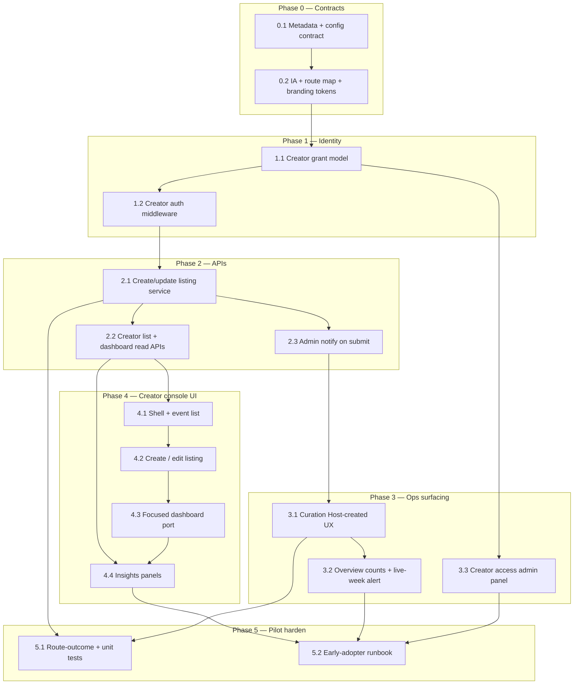

## How to use this document

Work through tasks **in order within each phase**. Soft dependencies are in [Execution order](#execution-order).

This plan is **Phase 1 only** of Just Go self-serve hosting. It is **separate from** campus Meridian ClubDash / Atlas org event management, and **orthogonal to** scrape/ops supply ([Pivot tenant ops dashboard](/strategy/pivot-tenant-ops-dashboard-plan)). Phase 2 (consumer differentiation: native ticketing, in-event tech, special CTAs) lives in a sibling plan: [Just Go creator console — Phase 2](/strategy/just-go-creator-console-phase2-plan).

For every task:

1. Read **Context** and **Instructions**.
2. Follow [Engineering conventions](#engineering-conventions-required) ([backend](/backend/best-practices) + [frontend](/frontend/best-practices)) — do not invent parallel API/DB patterns.
3. Implement only what that task describes (avoid scope creep into Phase 2 consumer branching).
4. Run **Evaluation criteria** as a checklist before marking done.
5. Record blockers or deviations in the PR.
6. **Update this file** when the task is complete (see [Agent completion](#agent-completion)).

### Agent completion

<Warning>
**Required for agents:** When you finish a task (code merged or explicitly accepted), edit this markdown file in the same PR — do not leave the plan out of date.
</Warning>

For the task you completed:

1. In the [Task status ledger](#task-status-ledger), change that row from `pending` to **`done`** (add `doneAt` or PR link in Notes if helpful).
2. Under the task heading, change **`Status:`** from `` `pending` `` to **`done`**.
3. Check every item in that task’s **Evaluation criteria** (`- [ ]` → `- [x]`).

If work is partial or blocked, set **`Status:`** to `blocked` and note why — do not mark `done`.

### Related docs

- [Just Go creator console — Phase 2](/strategy/just-go-creator-console-phase2-plan) — native RSVP, check-in, paid tickets; app branching on `platformManaged`
- [Just Go organizer identity](/strategy/just-go-organizer-identity-plan) — crawl-time host entities, backfill, Catalog panel; claim attaches scraped listings to a grant
- [Events marketplace pivot](/strategy/events-marketplace-pivot) — supply-side vision; organizer loop deferred from MVP scrape model
- [Pivot metadata contract](/strategy/pivot-metadata-contract) — `customFields.pivot`, `ingestStatus`, `batchWeek`, feed eligibility
- [Pivot MVP implementation plan](/strategy/pivot-mvp-implementation-plan) — Just Go brand, design language, catalog host model
- [Pivot tenant ops dashboard plan](/strategy/pivot-tenant-ops-dashboard-plan) — Curation / release gate this plan feeds into
- [Pivot weekly drop runbook](/strategy/pivot-weekly-drop-runbook) — drop timing vs catalog publish
- [Backend best practices](/backend/best-practices) — `getModels` / global models, auth, response shape, services, tests
- [Web client best practices](/frontend/best-practices) — `useFetch` / `postRequest` / `authenticatedRequest`, routing, SCSS
- Atlas event dashboard (product reference) — `Meridian/frontend/src/pages/ClubDash/EventsManagement/` + Mintlify Atlas event-dashboard docs (structure to port; **not** the mount point)

---

## Overall context

### Problem

Just Go supply today is **ops scrape/import** into a city catalog. There is **no self-serve creator surface**. Meridian already has a strong org event workspace (`EventsManagement` + phase-aware `EventDashboardFocused`), but it is coupled to Atlas orgs, campus approvals, classroom reservations, and ClubDash.

We want early Just Go hosts to create and manage events on-platform, with ops still controlling what lands in the weekly drop — **without** yet changing the consumer app experience for those events vs scraped listings.

| Gap | Today | Needed (Phase 1) |
| --- | --- | --- |
| Who creates | Platform Admin Lab / Tenant Curation | **Just Go creators** (early adopters / admins) via a dedicated console |
| Host identity | Display host from scrape; technical Pivot Catalog org | Creator-owned listing + `customFields.pivot.host` + provenance |
| Publish path | Ops ingest → `draft`/`staged` → release | Host submit → **always curation `draft`** for event’s ISO week → ops stage/release |
| Consumer UX | External ticket link, intents | **Unchanged** — same cards, CTAs, explore/feed rules |
| Creator value | None | Management UI + **insights** (intents, views) — not native ticketing yet |
| Surfacing | Scrape providers only in curation filters | **Host-created** clearly marked, filterable, countable; admins notified on submit |

### What we are building

A **Just Go Creator Console** (web) — product-separate from Meridian ClubDash — that ports the Meridian event management *workspace* (list + create/edit + focused dashboard) with a light Just Go admin reskin, and wires create/update into the existing Pivot catalog lifecycle as **curation drafts**.

```text
Creator Console (web)
  → create/update Event + customFields.pivot.*
  → ingestStatus: draft (configurable default)
  → batchWeek: ISO week of event start (configurable)
  → notify platform admins
  → Tenant Curation surfaces “Host-created” for review
  → ops stage → release → feed/explore (same as scraped)
Consumer app
  → no special CTAs / ticketing / in-event branching (Phase 1)
```

### Product / architecture decisions (stable for this plan)

| Decision | Choice | Why |
| --- | --- | --- |
| Phasing | **Two product phases.** This plan = Phase 1 groundwork only | Native attendee differentiation needs provenance + real host supply first; avoid boiling the ocean |
| Consumer app | **Mostly untouched** — no massive client refactor | Feed/explore already key off `ingestStatus === 'published'`; host events become catalog peers once released |
| Provenance | Stamp host-created events in metadata **even if the app ignores it** | Prevents Phase 2 backfill; enables curation filters and analytics splits now |
| Mount point | **Not** ClubDash / Atlas org tabs | Fully separate Just Go creator product surface |
| Event storage | Reuse `Event` + `customFields.pivot` | Same as scrape catalog; no parallel event type |
| Technical host | Keep Pivot Catalog org as `hostingId` / `hostingType: 'Org'` | Satisfies Events-Backend required hosting fields; display host stays in `customFields.pivot.host` |
| Display host | Creator’s public host profile (`host.name`, optional image/profile) | Matches catalog contract; consumers already show `displayHost` |
| Default ingest | Host create → **`ingestStatus: 'draft'`** | Admins always review; differs from Lab scrape default (`staged` when tags/host valid) |
| Week assignment | **`batchWeek` = ISO week of event `start_time`** (or first time slot) | Same default as ingest contract; week of the *event*, not “week created” |
| Already-released week | Still **`draft`** for that `batchWeek`; **notify admins** | Never auto-publish into a live deck; ops decide stage/publish or move week |
| Final publish | Ops only (`draft → staged → published` / release week) | Creators do not flip feed eligibility |
| Configurability | Tenant/platform knobs for defaults (see [Creator publish config](#creator-publish-config)) | Trusted hosts / pilot tuning without code changes |
| Creator incentive (P1) | Console + insights only | Honest scope: Phase 1 is groundwork + early-adopter ops, not marketplace lock-in |
| Dashboard UX | Port the Meridian `EventDashboard` skeleton (header, phase rail, tabs, most original components); white-canvas reskin + consumer flare on Just Go–specific flows | Creators already like this workspace; layout redesign would slow the port and the learning curve |
| Campus features | **Do not port** rooms, OIE, collab orgs, equipment, Atlas approval | Just Go city marketplace, not campus governance |
| Attendance (P1) | Reuse intents / external link; optional registration list read from existing Pivot signals | No native Just Go ticketing in this plan |

### Creator publish config

Store under pivot tenant config (extend existing tenant pivot settings — do not invent a one-off env-only path). Suggested keys:

| Key | Type | Default | Meaning |
| --- | --- | --- | --- |
| `creatorPublish.defaultIngestStatus` | `'draft' \| 'staged'` | `'draft'` | Status on host create/submit. **Pilot default must remain `draft`.** |
| `creatorPublish.weekAssignment` | `'event_start' \| 'force'` | `'event_start'` | How `batchWeek` is chosen |
| `creatorPublish.forceBatchWeek` | `string?` | unset | Only when `weekAssignment === 'force'` |
| `creatorPublish.requireTagsToSubmit` | `boolean` | `false` for early pilot | If true, block submit until catalog tags present (still lands as draft unless status override) |
| `creatorPublish.notifyAdminsOnCreate` | `boolean` | `true` | Email / in-app / ops notification on new host draft |
| `creatorPublish.notifyAdminsOnLiveWeekSubmit` | `boolean` | `true` | Extra emphasis when target week already has published events / is released |

Services must read config via the same tenant-resolution patterns as other Pivot admin services (`resolvePivotTenant` → city connection), not hardcoded literals in routes.

### Provenance contract (metadata amendment)

Extend [Pivot metadata contract](/strategy/pivot-metadata-contract) `customFields.pivot.source`:

| Value | Meaning |
| --- | --- |
| `luma` / `partiful` / `manual` | Existing scrape / ops import |
| **`justgo`** | Created in Just Go Creator Console (this plan) |

Also stamp (recommended fields — add to contract in Task 0.1):

| Field | Type | Notes |
| --- | --- | --- |
| `platformManaged` | `boolean` | **Always `false` in Phase 1.** Reserved for Phase 2 native ticketing / in-event |
| `createdByUserId` | `string` | Global or tenant user id of creator |
| `creatorSubmittedAt` | ISO datetime | When host submitted into curation |

Curation and analytics filter on `source === 'justgo'` (and/or `createdByUserId` present). Do **not** overload `manual` for host self-serve.

### Branding — Just Go (admin console)

**Product name (user-facing):** Just Go Creator (or “Creator” inside Just Go ops language). Internal code may keep `pivot` / `creator` path prefixes.

**Admin visual direction (Phase 1):** Preserve the Meridian event dashboard composition people already like — phase-aware workspace rail, condensed header, hero numbers. **Skeleton stays Meridian; the skin is Just Go, and Just Go–specific flows get the full consumer voice.** Two registers, explicitly:

- **Reskin register** — anything ported from Meridian (dashboard header/rail/tabs, lists, forms, tables): same skeleton and components, Just Go colors/type swapped in via `--jg-*` tokens on a **white** canvas. No layout churn.
- **Flare register** — net-new Just Go–specific flows (invite-only gate, submit → curation confirmation, drop-week/status banners, insights zero states, empty states): opinionated consumer scrapbook language — Les Flos titles, tilted title strips, burst stickers, `pop`/`tickerBar`/`sage` chips, lowercase display type.

| Element | Guidance |
| --- | --- |
| Wordmark | Just Go (`just go*`) assets from `Meridian/frontend/src/assets/pivot/` / mobile branding — replace Atlas gradients/logos |
| Palette accents | **White `#FFFFFF` canvas** (replaces cream), ink `#1A1714`, accent `#FF4F1F`, plus consumer pops reserved for flare surfaces — ticker `#4AB5FF`, pop `#FFD23F`, burst `#FF2A2A` (from `PIVOT_COLORS_LIGHT`) as CSS variables on the creator shell. Cream survives only inside photo fades/washes if needed |
| Typography | Keep dashboard hierarchy; Instrument Sans headings + Space Mono eyebrows/body as today. Les Flos now welcome on the wordmark, panel/section titles, and flare moments — still not required on dense admin labels |
| Motifs | Reskin register: white surfaces, ink borders/type, orange pill CTAs, sharp status pills — no scrapbook clutter in dense tables/forms. Flare register: tilted scrapbook title strips, burst-sticker accents, colored chips — concentrated on gate/confirm/empty/zero-state moments, never as card chrome in data-dense views |
| Copy | Just Go voice in creator-facing strings (“your listing”, “this week’s drop”, “interested”); avoid Atlas/Meridian/ClubDash copy |
| Ops curation badges | Clear **Host-created** / **Just Go** chip distinct from Partiful/Luma provider chips |

Consumer mobile brand tokens (`pivotTheme.ts`, `PIVOT_COLORS_LIGHT`, Les Flos, scrapbook strips) remain the source of truth for the **app**; the console borrows the same tokens — reskin everywhere, flare where the flow is ours.

### Engineering conventions (required)

All work in this plan **must** follow platform best practices. Do not invent parallel HTTP/DB patterns.

#### Backend — [best practices](/backend/best-practices)

| Concern | Rule for this plan |
| --- | --- |
| Tenant models (`Event`, intents, …) | Resolve via `getModels(req, …)` on the **city** connection. Never `mongoose.model()` / default connection. |
| Creator requests on city host | Normal `req.db` / `req.school` from app middleware when the creator session is already on the pivot tenant. |
| Cross-tenant / platform-admin tooling | Same as Lab/ops: `resolvePivotTenant` → `connectToDatabase(tenantKey)` → `getModels({ db }, …)`. |
| Global identity | `getGlobalModelService(req, …)` + `req.globalDb` for GlobalUser / platform roles / any new global creator-grant records. |
| New tenant-scoped models | Schema under `schemas/` (or `events/schemas/`), register in `getModelService.js` with explicit collection name. |
| Auth order | `verifyToken` first; then creator-gate middleware (not `requireOrgPermission` / ClubDash org perms). |
| Permissions | Prefer new constants (e.g. creator capability flags) in `constants/` — do **not** reuse `ORG_PERMISSIONS.MANAGE_EVENTS` as the Just Go gate. |
| Routes | Thin handlers; mount a dedicated router (e.g. `/pivot/creator` or `/creator`) in `app.js` / pivot route index. Delegate to services. |
| Responses | `{ success: true, data?, message? }` / `{ success: false, message, code? }` with stable `code` values. |
| Events submodule | Create/update may call shared Events-Backend helpers, but **host create must go through a Pivot creator service** that stamps metadata + config defaults — do not expose raw campus `/create-event` to Just Go creators. |
| Services | Pass `req` (or `{ db, school, user }`) into services; no global mongoose for app data. |
| Tests | Unit for week/status helpers; route-outcomes with `req.db` / `req.school` / `req.globalDb` as in best practices; cover draft-default + live-week notify behavior. |

#### Frontend (web) — [best practices](/frontend/best-practices)

| Concern | Rule for this plan |
| --- | --- |
| API reads | `useFetch` only — no ad-hoc axios |
| Mutations | `postRequest` / `authenticatedRequest` |
| Module home | New tree e.g. `Meridian/frontend/src/pages/JustGoCreator/` (name locked in Task 0.2) — **do not** mount under `ClubDash/` |
| Dashboard port | Port `EventsManagement/components/EventDashboard` with skeleton preserved; strip campus-only tabs; reskin to `--jg-*` white-canvas tokens |
| Styling | Page SCSS + CSS variables for Just Go admin tokens; no dependency on Atlas `useGradient()` / AtlasMain |
| Routing | Dedicated routes under a Just Go creator prefix; gate on creator auth |

#### Mobile consumer

| Concern | Rule for this plan |
| --- | --- |
| Scope | **No feature work** except unavoidable bugfixes if feed rejects valid published host events |
| Branching | Do **not** add `source === 'justgo'` CTA / ticketing branches here |

### Repositories touched

| Area | Path |
| --- | --- |
| Backend | `Meridian/backend/` — creator routes/services, metadata helpers, notify, tenant config; tests |
| Frontend (creator) | `Meridian/frontend/src/pages/JustGoCreator/` (or Task 0.2 name) — console UI |
| Frontend (ops) | `Meridian/frontend/src/pages/PlatformAdmin/PivotTenantDashboard/` — Host-created surfacing |
| Docs | `Meridian-Mintlify/strategy/` (+ metadata contract amendment) |
| Mobile | None required for Phase 1 |
| Design reference | `Meridian/frontend/src/pages/ClubDash/EventsManagement/` (read/port only) |

### Out of scope (this plan)

- Consumer app special handling for Just Go–made vs scraped events
- Native Just Go ticketing, payouts, Stripe Connect
- In-event live ops UX in the mobile app (beyond existing generic flows)
- Setting `platformManaged: true`
- Porting campus reservation / OIE / collaborator orgs / equipment
- Replacing scrape/Lab supply (ops curation remains primary for non-host listings)
- Full Meridian post-mortem PDF / Atlas branding
- AI organizer coaching (marketplace Phase 3)

---

## Phase 2 (sibling plan)

Full stepped plan: [Just Go creator console — Phase 2](/strategy/just-go-creator-console-phase2-plan).

Phase 1 must not block it — provenance + `platformManaged: false` are the forward-compat hooks. Summary of what Phase 2 adds:

1. Client branches on **`capabilities` / `platformManaged`** (not source alone).
2. Sub-phase **A** free native RSVP → **B** check-in / in-event → **C** paid tickets (optional).
3. Creator console unlocks guest list + live check-in; scrapes stay external.

---

## Execution order



---

## Task status ledger

| ID | Status | Notes |
| --- | --- | --- |
| 0.1 | done | Metadata + creator publish config |
| 0.2 | done | IA, routes, branding tokens |
| 1.1 | done | Creator grant / eligibility — global `PivotCreatorGrant` |
| 1.2 | done | `requirePivotCreator` — grant + pivot tenant gate |
| 2.1 | done | `pivotCreatorListingService` create/update → draft + week |
| 2.2 | done | List + detail reads (`GET /pivot/creator/events`) |
| 2.3 | done | Admin notify on create (email + ops inbox stub) |
| 3.1 | done | Host-created chip, badge, drawer provenance |
| 3.2 | done | hostDraft/Staged/Published + live-week alert |
| 3.3 | pending | Creator access admin panel (grant/revoke UI) |
| 4.1 | done | Console shell + list on white canvas; flare invite gate + empty state; `useFetch` now surfaces `errorCode`/`errorStatus` |
| 4.2 | done | Shared create/edit form; flare submit confirmation names the drop week; `postRequest` now surfaces `errorCode` |
| 4.3 | done | Workspace port of `EventDashboardFocused` — condensed header, phase rail, phase-filtered nav, six v0 tabs |
| 4.4 | done | `stats.daily` (best-effort 14-day UTC series) + Insights funnel and hand-rolled dual-series trend |
| 5.1 | pending | Tests |
| 5.2 | pending | Early-adopter runbook |

---

## Phase 0 — Contracts

### Task 0.1 — Metadata + creator publish config

**Status:** done

**Context:** Feed and curation already understand `draft | staged | published` and `batchWeek`. Host self-serve needs an explicit provenance value and tenant-level knobs so create behavior is not hardcoded. Amend the metadata contract before APIs land.

**Instructions:**

1. Update [pivot-metadata-contract](/strategy/pivot-metadata-contract):
   - Extend `source` with `'justgo'`.
   - Document `platformManaged`, `createdByUserId`, `creatorSubmittedAt`.
   - Document host-create default: `ingestStatus: 'draft'` (unless config overrides to `staged`).
   - Document week rule: ISO week of event start; never auto-`published`.
2. Define `creatorPublish` config shape on pivot tenant settings (schema + defaults as in [Creator publish config](#creator-publish-config)).
3. Add a small service helper: `resolveCreatorPublishConfig(tenant)` + `computeCreatorBatchWeek(eventStart, config)`.
4. Do **not** change feed eligibility rules.

**Evaluation criteria:**

- [x] Metadata contract merged with `justgo` source + Phase 1 `platformManaged: false`
- [x] Config defaults load for a pivot tenant without migrations breaking existing cities
- [x] Helper unit tests: week from `start_time`; force-week override; default status `draft`

---

### Task 0.2 — Information architecture, routes, branding tokens

**Status:** done

**Context:** Creators need a dedicated web surface; ops keep Tenant Curation. Lock names so implementation does not drift into ClubDash.

**Instructions:**

1. Lock route map (adjust only with plan amendment):

| Surface | Route (locked) |
| --- | --- |
| Sign in | `/justgo/creator/login` (public; branded, added post-4.4 — see below) |
| Creator home / list | `/justgo/creator` |
| Create listing | `/justgo/creator/new` |
| Event workspace | `/justgo/creator/events/:eventId` (event dashboard shell — Task 4.3 port) |
| Ops (existing) | `/platform-admin/pivot/:tenantKey` Curation — Host-created filter |

2. Lock frontend module path: `Meridian/frontend/src/pages/JustGoCreator/`.
3. Lock API prefix: `/pivot/creator/*` (city-scoped, creator JWT) vs existing `/admin/pivot/*` (platform admin).
4. Add creator-shell CSS variables (cream, ink, accent, burst optional) and wordmark usage notes under the module; document “motif pass, not scrapbook recreation.”
5. Copy bank: creator-facing strings file (e.g. `justGoCreatorCopy.js`) — no Atlas/Meridian org language.

**Evaluation criteria:**

- [x] Routes registered behind auth gate stub (can 401 until Task 1.2)
- [x] No new ClubDash tabs for Just Go creators
- [x] Branding tokens documented and applied to an empty shell page

**As built (sign-in, added after 4.4):** the console has its own front door at `/justgo/creator/login` — flare register, ported from mobile `PivotAuthScreen`. The hero photo runs full-bleed under the lo-fi wash and the whole composition (wordmark, tilted cream card, footnotes) is one centred stack on top of it. It is public and renders outside `JustGoCreatorShell`; see the sign-in section of `BRANDING.md` before touching it.

The web wordmark was also refreshed off the mobile source while building this: `assets/pivot/just-go-wordmark.svg` now mirrors `just-go-wordmark-1.svg`, the mark `PivotWordmark` actually renders, run through svgo (46% lighter than the mark it replaced). It is cream-on-dark, so it serves the sign-in hero and `/invite`; white surfaces still use `just-go-wordmark-dark.svg`, which remains the older drawing.

This also closed a real gap: `JustGoCreatorProtectedRoute` previously bounced to Meridian's `/login` with no return path, and that form defaults to `/events-dashboard`, so every interrupted creator landed in ClubDash. The gate now carries `state.from` and the page honours it (`safeReturnPath` rejects protocol-relative and absolute URLs). Sign-out returns here rather than to Meridian.

Two flows deliberately hand back to `/login` instead of being rebuilt: admin MFA (passkey / TOTP), and the Google code exchange, whose `redirect_uri` is registered against that path — the destination rides `sessionStorage.login_redirect` across the round trip. Apple sign-in is not wired up here yet.

---

## Phase 1 — Identity

### Task 1.1 — Creator grant model

**Status:** done

**Context:** Just Go must not use campus `OrgMember` + `manage_events`. Early adopters need an explicit allowlist/grant that is easy to revoke.

**Choice:** Global DB `PivotCreatorGrant` via `getGlobalModelService` (`pivot_creator_grants`). Plan `userId` → `globalUserId` (GlobalUser). Soft revoke (`status: active|revoked`). Unique `(globalUserId, tenantKey)`. API shipped under `/admin/pivot/tenants/:tenantKey/creators` — the admin UI lands in Task 3.3. Helper `getActiveCreatorGrant` ready for Task 1.2 gate.

**Instructions:**

1. Choose and implement one grant store (document choice in PR):
   - **Preferred:** global or tenant record `PivotCreatorGrant` `{ userId, tenantKey, status, grantedBy, grantedAt }` via appropriate model service, **or**
   - Pivot tenant allowlist of user ids on tenant config for v0 if faster — must still be queryable/revocable without deploy.
2. Platform Admin ability to grant/revoke (minimal UI or API-only acceptable for v0; API required).
3. Creators are scoped to **one city tenant** per grant (multi-city later).

**Evaluation criteria:**

- [x] Grant/revoke API with `verifyToken` + `requirePlatformAdmin`
- [x] Models via `getModels` / `getGlobalModelService` correctly
- [x] Non-granted user cannot pass creator gate (Task 1.2) — `getActiveCreatorGrant` returns null when missing/revoked; middleware mounts in Task 1.2

---

### Task 1.2 — Creator auth middleware

**Status:** done

**Context:** All `/pivot/creator/*` routes need a consistent gate after `verifyToken`.

**Choice:** `middlewares/requirePivotCreator.js` — after `verifyToken`, resolve pivot tenant from `req.school`, require active `PivotCreatorGrant`, set `req.pivotCreator` (`grant`, `tenantKey`, `tenant`, `globalUserId`). Stable codes: `CREATOR_FORBIDDEN`, `NOT_PIVOT_TENANT`, `CREATOR_TENANT_REQUIRED`. No org perms.

**Instructions:**

1. Add `requirePivotCreator` (name flexible) middleware:
   - Requires `verifyToken` upstream
   - Resolves grant for `req.user` + current pivot tenant
   - Sets `req.pivotCreator` (grant + tenantKey)
   - `403` with stable `code` when missing/revoked
2. Ensure pivot `tenantType` (or equivalent) — reject campus tenants.
3. Do **not** call `requireOrgPermission`.

**Evaluation criteria:**

- [x] Middleware unit/integration coverage for allow/deny
- [x] Mounted on creator router before handlers
- [x] Response shape matches best-practices error codes pattern

---

## Phase 2 — Creator APIs

### Task 2.1 — Create / update listing service

**Status:** done

**Context:** Core write path. Must stamp provenance, apply config, and never feed-publish.

**Choice:** `services/pivotCreatorListingService.js` + thin `POST/PATCH /pivot/creator/events`. Create stamps `source: 'justgo'`, `platformManaged: false`, config default `ingestStatus` (`draft`), `batchWeek` via `computeCreatorBatchWeek`. Creators cannot set `published` / change `ingestStatus` or `batchWeek`; post-publish content edits allowed. Ownership via `createdByUserId` = grant `globalUserId`.

**Instructions:**

1. Service `pivotCreatorListingService` (name flexible) with `createListing(req, payload)` and `updateListing(req, eventId, payload)`.
2. On create:
   - Upsert normal `Event` with technical Pivot Catalog hosting
   - Set `customFields.pivot`: `source: 'justgo'`, `platformManaged: false`, `host`, `tags?`, `createdByUserId`, `creatorSubmittedAt`, `batchWeek`, `ingestStatus` from config (default `draft`)
   - Set `externalLink` when provided (Phase 1 ticket path)
   - Compute `batchWeek` from event start unless force config
3. On update by creator:
   - Allowed while `draft` or `staged` (product: allow edit of own listings until published; after `published`, limit fields or require ops — **default locked:** creator may edit content fields after publish but **cannot** change `ingestStatus` / `batchWeek` without ops; document in code)
   - Never let creator set `ingestStatus: 'published'`
4. Ownership: only `createdByUserId === req.user.userId` (or grant admin override later).
5. Thin routes under `/pivot/creator/events`.

**Evaluation criteria:**

- [x] Created event invisible to `GET /pivot/feed` until ops publish
- [x] `batchWeek` matches ISO week of `start_time` under default config
- [x] Live/released week submit still yields `draft` (no auto-publish)
- [x] Route-outcome tests for create + forbidden publish flip

---

### Task 2.2 — Creator list + dashboard read APIs

**Status:** done

**Context:** Console needs list + per-event aggregate without org-event-management org scope.

**Choice:** `listListings` / `getListing` on `pivotCreatorListingService`. Own-only query (`source: justgo` + `createdByUserId`). Detail returns `stats.intents` via `loadIntentStatsByEventId` and sparse `stats.analytics` from `EventAnalytics` (zeros when missing). Optional `?ingestStatus=` filter. No ClubDash dashboard payload parity. **Task 4.4 added a third key, `stats.daily`** — see its As-built for the series shape and its best-effort guarantee.

**Instructions:**

1. `GET /pivot/creator/events` — list current user’s host-created events for tenant (filter by ingestStatus optional).
2. `GET /pivot/creator/events/:eventId` — detail + safe stats: intent counts, view/analytics summaries already available for catalog events.
3. Reuse analytics read patterns where possible; do not require ClubDash dashboard payload parity in v0 (full port can compose client-side from smaller endpoints).
4. Strip campus-only fields from responses.

**Evaluation criteria:**

- [x] Creator only sees own listings
- [x] Stats endpoint works for draft (pre-publish) with zeros / partial data
- [x] `{ success, data }` shapes consistent

---

### Task 2.3 — Admin notify on submit

**Status:** done

**Context:** Edge case + baseline: every host create should ping ops; submits into an already-live week need emphasis.

**Choice:** `pivotCreatorAdminNotifyService` fire-and-forget from `createListing`. Live week = published count > 0 **or** `PivotBatch.status === 'released'`. Channels: Resend to `listPlatformAdmins` + in-memory ops inbox stub + structured `logPivot`. `notifyAdminsOnCreate: false` suppresses; `notifyAdminsOnLiveWeekSubmit` toggles high-priority / “Live week:” subject. Curation deep link includes `filter=draft&source=justgo&eventId=…` (Host-created chip lands in 3.1).

**Instructions:**

1. On successful create (and optionally first submit from local draft → curation draft), enqueue notification when `notifyAdminsOnCreate`.
2. Detect “live week” = target `batchWeek` already has `published` count > 0 **or** batch status released (use existing batch helpers if present).
3. Notification content (Just Go voice): city, event name, start time, `batchWeek`, creator identity, deep link to Tenant Curation filtered to that event / Host-created.
4. Channel: reuse existing platform-admin notify path if one exists; otherwise email + durable ops inbox stub — **do not** block create on notify failure (log + best-effort).
5. Honor `notifyAdminsOnLiveWeekSubmit` for subject/priority variant.

**Evaluation criteria:**

- [x] Create still succeeds if notify fails
- [x] Live-week path distinguishable in notify payload/logs
- [x] Config `false` suppresses notify

---

## Phase 3 — Ops surfacing

### Task 3.1 — Curation “Host-created” UX

**Status:** done

**Context:** If host drafts bury into scrape noise, early-adopter loop fails. Curation already filters Partiful/Luma — extend for Just Go.

**Choice:** Curation `Host-created` chip syncs `source=justgo` (combinable with status `filter`). Catalog rows use orange **Host-created** badge via `serializeLabEvent` provenance. Newest host drafts sort first when chip is active; soft-boost in default list. Edit drawer shows creator / submitted / `platformManaged` / external link. Notify deep links open the event.

**Instructions:**

1. In `PivotTenantCurationPage` (and catalog table APIs if needed):
   - Filter chip: **Host-created** (`source === 'justgo'`)
   - Row badge distinct from provider pills
   - Sort/boost: newest host drafts near top when filter active / optional “Needs review” bucket
2. Detail drawer: show creator user, `creatorSubmittedAt`, `platformManaged: false`, external link.
3. Ensure stage/release QA still requires `host.name` + `batchWeek` + tags per existing contract.

**Evaluation criteria:**

- [x] Ops can filter to only Just Go host listings for a week
- [x] Badge visible in default week list without filter
- [x] No consumer UI changes

---

### Task 3.2 — Overview counts + live-week alert

**Status:** done

**Context:** Week readiness should show host-draft pressure, especially mid-release.

**Choice:** `getTenantOverview` KPIs add `hostDraft` / `hostStaged` / `hostPublished` (justgo aggregate) plus `hostLiveWeekAlert` via `isLiveCreatorBatchWeek`. Active only when week is live/released **and** `hostDraft > 0`. Overview + Curation banner show counts; callout links to Curation `filter=draft&source=justgo`.

**Instructions:**

1. Add to tenant overview / curation batch banner: counts `hostDraft` / `hostStaged` / `hostPublished` for selected `batchWeek`.
2. Alert callout when new host drafts target a week that is already released/live.
3. Link callout → Curation with Host-created filter.

**Evaluation criteria:**

- [x] Counts match DB for a fixture week
- [x] Callout only when live/released condition holds

**Fix (post-4.4):** this task's import of `isLiveCreatorBatchWeek` / `buildCreatorListingCurationHref` closed a `require` cycle — `pivotAdminOverviewService` → `pivotCreatorAdminNotifyService` → `pivotTenantInsightsService` → back to overview. When `pivotCreatorAdminNotifyService` loaded first (via `pivotCreatorListingService`), overview destructured a still-empty `module.exports` and captured both as `undefined`, so the live-week check and the alert href threw `is not a function` at request time. The pure href builders `curationHref` / `journeysHref` now live in `utilities/pivotAdminHrefs.js`; `pivotTenantInsightsService` re-exports them so its public API and `pivotBatchReadinessService` are unchanged. Unit tests missed this because `pivotAdminOverviewService.test.js` mocks the notify module, so the real load order never ran — treat these three services as a boundary and import shared helpers from `utilities/`, not across them.

---

### Task 3.3 — Creator access admin panel

**Status:** `pending`

**Context:** Task 1.1 shipped grant/revoke API-only. The full pilot flow needs ops to gate creator access without API tools — inviting a host, seeing who has access, and revoking are part of the product loop, not an ops afterthought.

**Choice:** A **Creators** section in the existing Platform Admin Pivot tenant dashboard (`Meridian/frontend/src/pages/PlatformAdmin/PivotTenantDashboard/`, route `/platform-admin/pivot/:tenantKey`) backed by the shipped `/admin/pivot/tenants/:tenantKey/creators` endpoints (extend with a list endpoint if missing). Grant by user email (resolved to `GlobalUser` server-side) with confirm; revoke with inline confirm; list shows status, `grantedBy`, `grantedAt`. Ops-facing, so **reskin register only** — match the tenant dashboard's existing styling; Just Go ops voice in copy ("who can host", "invite a creator").

**Instructions:**

1. List grants for the tenant (active + revoked history) via a `requirePlatformAdmin` route; add the read endpoint if Task 1.1 didn't ship one.
2. Grant flow: email lookup → confirm → POST grant; clear error states (unknown user, already granted, already revoked).
3. Revoke flow with inline confirm; revoked grants stay visible in history.
4. No new auth model — panel sits under the existing platform-admin gate. Frontend follows `useFetch` / `postRequest`.

**Evaluation criteria:**

- [ ] Platform admin can grant and revoke a creator without API tools
- [ ] Revoked creator immediately hits the console invite-only gate (Task 4.1)
- [ ] Grant list matches `pivot_creator_grants` for the tenant

---

## Phase 4 — Creator console UI

<Note>
**Reopened after the design-direction change** (white canvas, two-register reskin/flare model, `EventDashboard`-skeleton port, admin Creators panel): the earlier motif-pass implementation of Tasks 4.1–4.4 was reverted and these tasks went back to `pending`.

All of Phase 4 has since landed. These are the **shared foundations** — reuse them rather than re-deriving:

- White-canvas `--jg-*` tokens and the two-register rules (`justGoCreatorTokens.scss`, `BRANDING.md`). Task 0.2's cream tokens are gone.
- Shell page primitives: `justgo-creator__page-title` (Les Flos), `__page-subtitle`, `__panel`, `__cta` (orange pill), `__page-heading`, `__back`.
- Shared controls in `justGoCreatorControls.scss`, imported once by the shell: `.jg-chip` (filters + tag picker), `.jg-status--{draft,staged,published}` (ingest pill), `.jg-field` / `.jg-input`. **Do not restyle fields or re-declare the status pill.**
- Status vocabulary: `describeIngestStatus` / `CREATOR_LIST_FILTERS` in `justGoCreatorListings.js`.
- Flare primitives: `PivotScrapbookTitle` at `components/PivotBranding/` (shared with the ops dashboard), `JustGoCreatorGate`, `JustGoCreatorSubmitConfirm`, and `workspace/WorkspaceComingSoon` for anything Phase 1 genuinely cannot show.
- Write path: `JustGoCreatorListingForm` (`mode="create" | "edit"`) plus the payload/validation helpers in `justGoCreatorFormUtils.js`. The workspace hosts the form in its Details tab rather than rebuilding it.
- Error branching: `useFetch` returns `errorCode` / `errorStatus`, and `postRequest` returns `errorCode`, so callers can branch on creator codes without parsing messages.
- Workspace shell from 4.3: `workspace/workspaceUtils.js` owns the phase model and the tab/section registry, and `.jg-tally` / `.jg-workspace-tab__{title,subtitle,note}` in `workspace/workspace.scss` are the tab-body primitives.
- Design pass (post-4.4): the console reads as a **submission docket**, not a dashboard — see the house rules and masthead section in `BRANDING.md` before styling anything. The stat-card grid is gone (`.jg-stat-card` / `.jg-stat-grid` were removed in favour of `.jg-tally`), Space Mono is restricted to machine values, icons only appear on controls, and `--jg-radius` is 2px. `.jg-masthead` + `.jg-stamp` are the one signature surface; don't add a second.
- Insights maths from 4.4: `workspace/insightsUtils.js` owns the funnel, the chart geometry, and `totalViewCount` — **use `totalViewCount` for any view number**, since `analytics.views` excludes anonymous views. Every workspace number comes from the single `GET /pivot/creator/events/:eventId` read; no tab adds a fetch of its own.
- Local-dev demo mode: `pages/JustGoCreator/demo/` renders the console against generated fixtures — a small chip in the shell's header bar (quiet when off, yellow when on) is both the readout and the toggle, and `/justgo/creator/events/demo-*` opens a populated workspace. That chip is the *only* demo marker: the earlier full-width banner and the per-page watermark were removed because they dominated every screenshot the mode exists to produce. Reads short-circuit before `useFetch`, so it needs no grant, no seeded data, and issues no requests. Import from `./demo` only: the barrel `require`s the fixtures inside a branch webpack folds away, keeping the sample copy out of production bundles (verified against `build/static`). Fixtures are clock-derived and cover all four phases, and aggregates are summed from the generated daily series so the funnel and trend chart agree.

<Tip>
Naming trap: a helper module must not differ from a component file by case alone (`justGoCreatorListingForm.js` vs `JustGoCreatorListingForm.jsx` resolved to the same file on macOS and made the component import itself). Helpers are `justGoCreator<Thing>Utils.js`.
</Tip>
</Note>

### Task 4.1 — Shell + event list

**Status:** done

**Choice:** `JustGoCreatorHome` reads own listings via `useFetch('/pivot/creator/events')`; ingest `draft|staged|published` → status pills (Draft / In curation / Live) with client-side filter chips + counts; rows deep-link to `justGoCreatorEventPath`. Shell (wordmark / city / sign-out / nav) from Task 0.2 kept, migrated to the **white canvas** token set. Two surfaces in this task are Just Go–specific and get the **flare register**: the 403 invite-only gate from `requirePivotCreator` (Les Flos title, burst sticker, pilot copy + city context) and the empty state (tilted title strip + orange pill CTA → `/justgo/creator/new`). The list itself stays reskin register — calm, white, ink-outlined rows.

**As built:**

| Concern | Landed |
| --- | --- |
| Tokens | `justGoCreatorTokens.scss` migrated cream → `--jg-canvas: #FFFFFF`; added flare-only `--jg-ticker` / `--jg-pop` / `--jg-burst` / `--jg-sage`, `--jg-font-flos`, `--jg-radius-pill` / `--jg-radius-sharp`. `--jg-cream` survives for flare strip fills and photo washes only. `BRANDING.md` rewritten around the two registers. |
| Shell | White canvas (radial cream gradient removed), sticky bar, orange **pill** primary CTA. Page primitives (`__page-title` now Les Flos lowercase, `__panel`, `__cta`) shared with 4.2 / 4.3. |
| List | `JustGoCreatorHome` + `JustGoCreatorHome.scss`. Rows show name, status pill, start time, location, drop week, interested count; whole row is the workspace deep link. Shimmer skeleton while loading, retryable panel on non-gate failure, calm "nothing in this bucket" panel when a filter empties. Primary CTA is **not** duplicated on the page — the sticky shell nav owns it. |
| Status mapping | `justGoCreatorListings.js` — `describeIngestStatus` / `countListingsByStatus` / `formatListingWhen` + `CREATOR_LIST_FILTERS`. Pill tones stay ink + accent; pops never reach a row. |
| Flare | `JustGoCreatorGate` (403) and the first-run empty state render `PivotScrapbookTitle` (scrapbook strips + burst). Gate distinguishes `CREATOR_FORBIDDEN` from `NOT_PIVOT_TENANT` / `CREATOR_TENANT_REQUIRED` and echoes the signed-in identity on a tilted `--jg-pop` sticker. |
| Shared brand primitive | `PivotScrapbookTitle` promoted from `PlatformAdmin/PivotTenantDashboard/` to `components/PivotBranding/` (with `pivotBrandFonts.scss` owning the Les Flos `@font-face`) so ops and creator surfaces share one implementation. Ops dashboard imports updated; no visual change there. |
| `useFetch` | **Additive** change: now returns `errorCode` (backend's stable body `code`) and `errorStatus` (HTTP status) alongside the existing `{ data, loading, error, refetch }`. Needed so the console can render the gate for a 403 instead of parsing `error` strings. Frontend best-practices updated. |
| Tests | `justGoCreatorListings.test.js` (status mapping, bucket counts, date fallbacks) and `JustGoCreatorHome.test.jsx` (endpoint, rows, deep links, drop week, gate vs error panel, empty state, chip counts) — 18 cases, full suite green. |

**Deviation:** revoked-creator behavior is verified by component test, not against a live tenant — local dev has no pivot tenant in the selector and the console requires an authenticated granted creator. Confirm on a real pilot tenant alongside Task 3.3's grant/revoke UI.

**Context:** First visible creator surface. White canvas + reskin for chrome/list; flare for the gate and empty state.

**Instructions:**

1. Migrate `justGoCreatorTokens.scss` / `BRANDING.md` from cream to the white canvas (`#FFFFFF` shell; ink/accent unchanged; add `--jg-ticker` / `--jg-pop` / `--jg-burst` for flare surfaces). Task 0.2 tokens predate the white decision — update the variables and docs, not just usages.
2. Implement `JustGoCreator` shell: wordmark, city context, sign-out, nav — white canvas, ink type, orange pill primary CTA.
3. Events list adapted from `EventsManagementList` patterns — status chips mapped to Pivot ingest (`Draft`, `In curation`/`Staged`, `Live`); filter chips + counts.
4. Invite-only gate (403) and empty state in the flare register per the Branding section — full consumer voice, no Atlas/Meridian wording.
5. Use `useFetch` / `postRequest` only.

**Evaluation criteria:**

- [x] Granted creator can list events; revoked user lands on the flare-register invite gate
- [x] Visual: white/ink/accent tokens + Just Go wordmark; pops (ticker/pop/burst) confined to flare surfaces; no AtlasMain gradient dependency
- [x] Mobile-responsive enough for laptop/tablet admin use

---

### Task 4.2 — Create / edit listing

**Status:** `done`

**Choice:** Shared `JustGoCreatorListingForm` (`mode="create"` at `/justgo/creator/new`; `mode="edit"` hosted on the workspace route until 4.3’s dashboard port). Fields: title/description/start `datetime-local`/end/location/host name (defaults from auth profile)/external ticket link/tags (`GET /pivot/tags` chip picker)/cover image. Mutations via `postRequest` → `POST`/`PATCH /pivot/creator/events`; cover file uploads after save through the existing `/upload-event-image` FormData pattern. Client validation mirrors server requireds (name, location, hostName, start); the form never sends `ingestStatus`/`batchWeek`. The **submit confirmation is a flare-register moment**: burst sticker + tilted title strip naming the target `batchWeek`, carrying the locked submit copy. All strings via `justGoCreatorCopy.js`.

**Context:** Minimal fields for catalog parity — not full CreateEventV3 campus flow. Form chrome is reskin register; the confirmation is Just Go’s own.

**Instructions:**

1. Form fields: title, description, start/end, location, cover image, external ticket URL, display host name (default from profile), tags (catalog picker), optional hook/short copy if catalog uses it.
2. Submit → Task 2.1 API; confirmation panel (flare register): **“Submitted for this week’s curation (`batchWeek`). It won’t appear in the app until Just Go publishes the drop.”**
3. No campus approval preview, classroom preflight, or collaborator orgs.
4. Image upload via existing upload patterns used by web (reuse helpers; tenant-safe).

**Evaluation criteria:**

- [x] Happy path create appears in Curation as Host-created draft — verified against the service contract (payload keys, `source: 'justgo'` / `platformManaged: false` stamped server-side, tenant-default `ingestStatus`); the live-tenant walkthrough belongs to Task 5.2's runbook
- [x] Validation blocks missing required catalog fields for submit
- [x] Confirmation names the target `batchWeek` and sets the no-special-treatment expectation
- [x] Copy has no Meridian/Atlas org wording

**As built:**

- **`JustGoCreatorListingForm`** — one component, `mode="create" | "edit"`. Create posts `/pivot/creator/events`, edit patches `/pivot/creator/events/:eventId`. Fields: name, description, start/end (`datetime-local`), location, host name, cover image, ticket link, tags. No `timeSlots` picker — the service accepts them, but multi-session is not a Phase 1 creator need.
- **Payload discipline** lives in `justGoCreatorFormUtils.js`, not the component: `buildListingPayload` emits only the service's canonical keys (`name`, `description`, `location`, `hostName`, `start_time`, `end_time`, `externalLink`, `tags`) and structurally cannot emit `ingestStatus` / `batchWeek` / `source` / `platformManaged`. Tests assert their absence.
- **Cover images** upload after the save, not with it: the creator service only accepts an image **URL**, and `/upload-event-image` needs an event id. A failed upload does not fail the save — the creator gets `coverUploadFailed` and the listing survives.
- **Validation** mirrors the server's four requireds (`name`, `location`, `hostName`, `start_time`) so submit is blocked before a round trip. End-time is a **hard client error** when it is not after the start, because the service would otherwise silently rewrite it to `start + 2h`.
- **Server errors land on the field they belong to.** `postRequest` now returns `errorCode` (the backend's stable body `code`) alongside `code` (HTTP status), and `fieldForServerErrorCode` maps `TAGS_REQUIRED` / `INVALID_TAG` → tag picker, `INVALID_START_TIME` → start, `HOST_NAME_REQUIRED` → host, etc. Ownership and lifecycle failures (`CREATOR_NOT_OWNER`, `CREATOR_EDIT_LOCKED`) stay form-level.
- **Confirmation** (`JustGoCreatorSubmitConfirm`) is the flare moment: scrapbook title, tilted `--jg-ticker` sticker naming the drop week from `data.batchWeek`, the locked submit copy, and an explicit no-special-treatment line.
- **Shared controls extracted.** `.jg-chip`, `.jg-status`, and `.jg-field` / `.jg-input` moved out of `JustGoCreatorHome.scss` into `justGoCreatorControls.scss`, imported once by the shell. **Task 4.3 should use these rather than restyle fields or re-declare the status pill.**
- **`JustGoCreatorEventWorkspace`** is an interim host for the edit form (title + status pill + form + back link), with gate / not-found / retry states. Task 4.3 replaces the chrome and moves the form into the Details tab — the form itself should not need changes.

<Warning>
**Follow-up, not fixed here:** `POST /upload-event-image` has no ownership check — `verifyToken` plus any `eventId` in the caller's tenant DB is enough to overwrite that event's cover. This is pre-existing (it is also how `EventEditorTab` uploads) and tenant-scoped, so it is not a cross-tenant hole, but the creator flow now depends on it. Worth a guard that requires `customFields.pivot.createdByUserId === req.user.userId` for `source: 'justgo'` listings.
</Warning>

---

### Task 4.3 — Event dashboard port (skeleton preserved, reskin + flare)

**Status:** `done`

**Choice:** Port `Meridian/frontend/src/pages/ClubDash/EventsManagement/components/EventDashboard` into `JustGoCreatorEventWorkspace` with the **skeleton unchanged** — same composition (condensed header, phase-aware rail, tab bar) and as many of the original tab components as the creator APIs can feed. All data comes from `GET /pivot/creator/events/:eventId` + creator stats (Task 2.2) — never `/org-event-management/...`. Ported components get the **reskin register** only: white surfaces, ink borders/type, orange pill CTAs, `--jg-*` tokens in place of Atlas gradients — no layout redesign. The **flare register** applies to the Just Go–specific overlays: ingest status pill (Draft / In curation / Live), post-submit “what happens next” explainer, drop-week banner. Phase mapping: draft → Drafting; staged / published-future → Planning; published inside start..end → Run of Show; past end → Post Mortem. Tabs v0: Overview (hero numbers + listing summary), Details (4.2 form, edit mode), Insights (4.4), Interests (aggregate counts; per-person lists deferred to Phase 2), Communications (stub — no pivot-safe sender yet), Promo QR (client-side against the public `/event/:id` URL). Check-in omitted in Phase 1; header carries status pill + “Update listing” CTA; no publish actions, no cancel/delete danger zone (no creator delete API).

**Context:** The dashboard creators already liked in Meridian, wearing Just Go colors. The real work is data rewiring (creator APIs instead of org-event-management), not visual redesign.

**Instructions:**

1. Port the component tree from `EventDashboard` (header, phase rail, tabs) into `JustGoCreatorEventWorkspace`; keep layout/composition; swap styling to `--jg-*` white-canvas tokens.
2. Rewire every ported component to creator endpoints (`/pivot/creator/events/:eventId`, stats); compose client-side or extend Task 2.2 where payloads differ; stub what has no pivot-safe equivalent.
3. Phase rail: Drafting / Planning / Run of Show / Post Mortem per the mapping above.
4. **Include v0 tabs:** Overview, Details, Insights, Interests, Communications (stub), Promo QR.
5. **Exclude / Coming soon:** Equipment, volunteer Jobs, Agenda (unless trivially reused), campus reservation, collab banners, Atlas post-mortem PDF, check-in (hidden so it doesn’t imply native door tools).
6. Header CTAs: “Update listing” + ingest status pill — no “Publish” actions.
7. Flare-register overlays for ingest states per the Branding section; ported components stay calm.

**Evaluation criteria:**

- [x] Skeleton parity: workspace visibly matches EventDashboard composition (header/rail/tabs) across phases
- [x] Phase rail works for draft → published → past
- [x] No calls to `/org-event-management/:orgId/...` without a creator API equivalent
- [x] Reskin on white `--jg-*` tokens; flare confined to status/explainer overlays — no layout churn in ported components

<Note>
**As built.** Everything lives under `Meridian/frontend/src/pages/JustGoCreator/`, with the ported pieces in `workspace/`.

**The port target was `EventDashboardFocused`, not `EventDashboard.jsx`.** This matters and the task text was written before it was checked: `EventsManagement` opens `EventDashboardFocused` via `useDashboardOverlay`, and the legacy `EventDashboard.jsx` sitting in the same folder is an older horizontal-`TabbedContainer` variant. So "phase-aware rail, tab bar" is really one thing in production — a left sidebar of nav sections that the current phase filters. The port keeps that: condensed header, `13.5rem` sidebar grid, keep-alive tab panels toggled with `display` inside one scrolling main region (`jg-workspace__content`), which is also what makes the scroll-driven header condense work.

**Phase logic** (`workspace/workspaceUtils.js`): `inferCreatorPhase` replaces the original's `inferWorkflowPhase`, reading `ingestStatus` where the original read campus `status` + `stats.operationalStatus` — ops own the creator lifecycle, so a listing has no approval state of its own. Draft is checked **before** the clock, deliberately: a draft whose date has passed never went live, and calling that a Post Mortem would be a lie. Staged inside its own start..end stays in Planning for the same reason — it never got published.

**The rail is visible, unlike the original.** `EventDashboardFocused` derives a phase and only uses it to filter nav. A creator has far less context than an org admin about where their listing sits in curation, so `WorkspacePhaseRail` renders all four steps with complete/current/upcoming states. It is read-only — the phase follows curation state and the clock, so there is nothing to click.

**Tabs are genuinely phase-gated**, which is what gives the rail meaning:

| Phase | Nav sections → tabs |
| --- | --- |
| Drafting | Drafting → Overview, Details · Audience → Interests, Insights |
| Planning | Planning → Overview, Details · Audience → Interests, Promo QR, Communications · Insights → Insights |
| Run of Show | Live → Overview, Interests · Audience → Promo QR, Communications · Monitoring → Insights, Details |
| Post Mortem | Retrospective → Insights, Overview · Records → Interests, Details |

Promo QR and Communications are absent while Drafting: a listing nobody has curated has no audience to reach and no drop to promote. Promo QR also leaves at Post Mortem. When the phase changes under an active tab, `effectiveTab` falls back to the first visible tab exactly like the original does.

**Data** is one read — `GET /pivot/creator/events/:eventId` — and nothing else. Header stats, Overview hero numbers, and the Interests counts all come from that response's `stats.intents` (`PivotEventIntent` aggregates) and `stats.analytics` (`EventAnalytics`), which are the same aggregates the ops dashboard reads, so they cannot drift from ops by construction. No `/org-event-management/...` call survives the port.

**Tabs as shipped:**

- **Overview** — flare curation explainer (keyed to draft/staged/published, carrying the drop week and the parity label), four stat cards, then a read-only summary of what was submitted. It has **no** "Update listing" button: the header CTA is always on screen and duplicating it produced two identical buttons.
- **Details** — hosts the 4.2 `JustGoCreatorListingForm` in `mode="edit"` and refetches silently on save. Not rebuilt.
- **Interests** — aggregate counts only (interested / got a ticket / passed / ticket-link taps / people who tapped), with an empty state before any signal and an explicit note that per-person lists are not part of this phase.
- **Promo QR** — `qrcode.react`'s `QRCodeCanvas` (already a dependency) against `${origin}/event/${_id}`, plus copy-link and PNG download. Entirely client-side. The campus promo-QR flow was **not** ported: it is backed by org short-link and scan-analytics endpoints a creator cannot call, and faking tracked short links would be a Phase 2 promise.
- **Communications** — stub, permanently for Phase 1, via `WorkspaceComingSoon` (scrapbook title + one honest sentence), the Just Go answer to the original's `ComingSoon.jsx`.
- **Insights** — shipped as a stub here and filled by Task 4.4.

**Excluded as planned:** check-in, equipment, volunteer jobs, agenda, tasks, registrations-as-a-table, collaborator orgs, campus reservation, Atlas post-mortem PDF. No publish, cancel, or delete action exists anywhere in the workspace, because no creator API grants one.

**Tests:** `workspace/workspaceUtils.test.js` (23) covers the phase mapping including the draft-precedence and staged-during-window cases, rail states, phase gating, and no-empty/no-duplicate-section invariants. `JustGoCreatorEventWorkspace.test.jsx` (16) covers the assembled skeleton, phase rail per state, tab switching, the header CTA reaching the form, absence of publish/delete, the QR target URL, and the gate/not-owner/retry branches. 114 frontend tests pass; lint and `npm run build` are clean.

<Tip>
Testing trap: tab panels are keep-alive, so **every** tab is in the DOM at once and `screen.getByText` happily matches a hidden one. Scope assertions to `.jg-workspace__tab-panel.is-active` or a tab-switch test proves nothing. Wrap `within(...)` at the call site too — `testing-library/prefer-screen-queries` flags a helper that returns an already-wrapped query object.
</Tip>
</Note>

---

### Task 4.4 — Insights panels

**Status:** `done`

**Choice:** Extend `GET /pivot/creator/events/:eventId` with `stats.daily` — a zero-filled 14-day UTC series (`PivotEventIntent.createdAt` buckets for new interested/registered + `EventAnalytics.viewHistory` buckets for views; aggregation-pipeline based, best-effort so it can never break the detail read). The Insights tab is built around it: intent funnel (Views → Interested → Ticket link taps → Got a ticket, with %-of-previous-step conversions) + a hand-rolled dual-series SVG chart (views area + new-interested line, no chart dependency) drawn in accent/ticker. All numbers read the same `PivotEventIntent`/`EventAnalytics` aggregates the ops dashboard uses, so they match ops event performance by construction; no native commerce metrics invented. Zero states are flare-register (Les Flos + burst, keyed to draft vs published) and the panel carries the parity label verbatim: "App experience matches other Just Go listings until native tools ship."

**Context:** Phase 1 creator incentive is data, not special attendee actions.

**Instructions:**

1. Show intent funnel: interested / registered (I got a ticket) counts; 14-day `stats.daily` series for views + new interested.
2. For draft/unpublished: flare-register zero states with explanation.
3. After publish: same metrics scrapes would get from consumer intents — no fake “ticket sold” native metrics.
4. Label clearly: **App experience matches other Just Go listings until native tools ship.**

**Evaluation criteria:**

- [x] Numbers match ops/event performance for a published fixture
- [x] Zero states keyed to draft vs published, in Just Go voice
- [x] No Phase 2 native commerce metrics invented

<Note>
**As built.**

**Backend — `stats.daily`.** `getListing` now returns a third key alongside `intents` and `analytics`: a zero-filled 14-day UTC series of `{ date, views, interested, registered }`. Window and zero-fill are pure helpers in `Meridian/backend/utilities/pivotCreatorDailySeries.js`; the two aggregation pipelines live in `loadDailyStats` in the creator service. Day keys are `$dateToString` with `%Y-%m-%d` and **no** `timezone`, matching the house pattern in the analytics routes. Best-effort as specified: both pipelines run in one `Promise.all` inside a `try`, and any failure — including a tenant whose models have no `aggregate` at all — yields the zero-filled window rather than failing the detail read. Two tests pin that guarantee directly.

**Two data caveats found while wiring it, both surfaced in the UI rather than hidden:**

1. **The daily intent series is first-touch, not transition.** `PivotEventIntent` has no status-transition timestamp, and `updatedAt` is bumped by ticket-link taps as well as status changes, so it cannot stand in for "the day they got a ticket". The series therefore buckets `createdAt` and splits by *current* status, which keeps `interested` + `registered` a partition of the same population the ops intent aggregate counts. The panel says so in one line.
2. **`EventAnalytics.views` excludes anonymous views** — those land in `anonymousViews`. The daily series counts every `viewHistory` entry, so anything user-facing has to add the two counters or the funnel and the chart disagree. `totalViewCount` does that, and **Task 4.3's Overview "Page views" card was corrected to use it** — it was showing logged-in views only.

**Frontend.** `workspace/insightsUtils.js` holds all the arithmetic and geometry with no copy and no React, so it is asserted directly (26 tests); `WorkspaceInsightsTab.jsx` renders it (14 tests).

- **Funnel:** Views → Interested → Tapped the ticket link → Got a ticket, each with *% of previous*. Values map onto the ops event-performance row field for field — `interested` is ops' `interestedTotal` (interested + registered). The tap step counts **`externalOpenUsers`, people, not `externalOpens`, taps**, which is the same numerator ops uses for `ticketOpenRate` and the only version where a conversion cannot exceed 100% because someone tapped twice.
- **It is not a strict funnel, and the panel admits it.** Page views come from the listing's *web* page while interest comes from swipes in the *app feed*, so interest can exceed views and the first conversion can read over 100%. Bars are scaled against the widest step (the ops div-bar approach) so a non-monotonic funnel still renders, and a note explains the two steps are not the same crowd. Inventing a shared denominator to force a tidy shape would have been the dishonest option.
- **Trend:** hand-rolled SVG, views area in `--jg-ticker` behind a new-interest line in `--jg-accent`. No chart dependency, as specified — the campus dashboard's visx stack was not pulled in for two static series with no axes or tooltips. **The series are scaled independently**, because views outrun interest by an order of magnitude and a shared axis flattens the interest line onto the floor; each series is therefore labelled with its own total and peak, and a note says the scales are separate. An unlabelled dual axis would invite comparing heights that are not comparable.
- **Zero states** are flare register (`PivotScrapbookTitle` + burst) and keyed as required: not-yet-published gets "nothing to count yet" and an explanation that the listing is not in the app; published-with-no-signal gets "no signal yet". A draft holds its zero state even if stray numbers exist. Both carry the parity label verbatim.
- **Nothing native invented:** no tickets sold, revenue, payouts, or attendance. A test asserts those words never render.

**Known, deliberate difference from ops:** creator intent stats call `loadIntentStatsByEventId` **without** `{ batchWeek }`, while the ops curation monitor always scopes to a drop week. For a listing dropped once — every pilot fixture — the numbers are identical, which is what the criterion asks. For a listing re-dropped in a later week the creator sees the event's lifetime total while an ops week row sees that week only. That is the right default for a creator ("how did my event do") and was left as 4.3 shipped it rather than silently changing already-visible Overview and Interests numbers.

**Tests:** backend `tests/unit/pivotCreatorDailySeries.test.js` (12: UTC bucketing, month/year rollover, malformed rows, empty windows) and five new `getListing` cases (window shape, bucket merge, pipeline scoping, and the two best-effort guarantees). Frontend 26 + 14 as above. 130 creator frontend tests and 42 creator backend tests pass; lint and `npm run build` are clean.

<Warning>
Pre-existing and **not** caused by this task: `tests/unit/pivotWeeklyDropService`, `pivotTenantInsightsService`, and `pivotCrewPushCopy` fail on unrelated push-copy and insight-card expectations (a `"— locks soon"` suffix drifted from its test). None of the three imports the creator service. Also note `npm run test:unit` for the whole directory appears to hang in this repo; scope jest to specific files.
</Warning>
</Note>

---

## Phase 5 — Pilot harden

### Task 5.1 — Tests

**Status:** `pending`

**Context:** Multi-tenant safety and publish invariants are the regression surface.

**Instructions:**

1. Unit: batch week + config resolution + live-week detection.
2. Route-outcomes: create as creator, forbid publish, list isolation, admin grant/revoke, feed exclusion while draft.
3. Follow [backend testing](/backend/best-practices#testing) memory-mongo + `req.db` / `req.school` patterns.

**Evaluation criteria:**

- [ ] `npm --prefix Meridian/backend run test:routes` (or CI-equivalent) includes new cases
- [ ] Feed exclusion assertion locked in

---

### Task 5.2 — Early-adopter runbook

**Status:** `pending`

**Context:** Ops + creators need a short path to pilot without reading the whole plan.

**Instructions:**

1. Add a short runbook section (this file or `pivot-weekly-drop-runbook` link):
   - Grant creator (Platform Admin → tenant → Creators panel, Task 3.3)
   - Creator submits listing
   - Ops finds Host-created in Curation
   - Stage → release with weekly drop
   - Creator reads insights
2. Explicit expectations: **no special in-app treatment yet**; external tickets still used.
3. Live-week submit: ops gets notify; still draft until they act.

**Evaluation criteria:**

- [ ] Runbook linked from Related docs / drop runbook
- [ ] Pilot owners sign off on messaging

---

## Decision log (conversation → plan)

| Topic | Decision |
| --- | --- |
| App client in Phase 1 | No massive changes; schema provenance yes |
| Publish authority | Admins/ops final; creators submit to curation |
| Ingest default | `draft` for host-created (configurable) |
| Week assignment | ISO week of event timestamp/start (configurable) |
| Live/released week edge | Stay `draft`; notify admins |
| Dashboard design | Port `EventDashboard` skeleton unchanged (header/rail/tabs + most original components); white-canvas reskin; consumer flare reserved for Just Go–specific flows |
| Canvas color | White `#FFFFFF` shell replaces cream; consumer pops (`tickerBar` / `pop` / `burst`) confined to flare surfaces |
| Separation | Own routes/module/API prefix; not ClubDash |
| Phase 2 | Native differentiation later; `platformManaged` reserved false |
| Creator grant store | Global `PivotCreatorGrant` (`globalUserId` + `tenantKey`); not tenant-config allowlist |
| Grant UI | API shipped (Task 1.1); minimal Platform Admin Creators panel (Task 3.3) — full gating loop clickable by ops |
| Creator gate | `requirePivotCreator` on `/pivot/creator/*` after `verifyToken` |
| Listing writes | `pivotCreatorListingService`; catalog Org hosting; never creator-published |

---

## Open questions (resolve in Task 0.x / 1.x PRs if needed)

1. **Grant UI:** ~~API-only for first pilot week, or minimal Platform Admin panel?~~ → **Minimal Platform Admin panel** (Task 3.3) — supersedes the earlier API-only v0 call (the Task 1.1 API still backs it).
2. **Post-publish creator edits:** Locked default above — confirm with ops if content edits should freeze after release.
3. **Communications:** Ship email compose in 4.3 or stub until a pivot-safe sender exists?
4. **Multi-city creators:** Single tenant grant for v0 — when to allow multiple grants per user?

Resolve in PR notes and update this decision log when closed.
