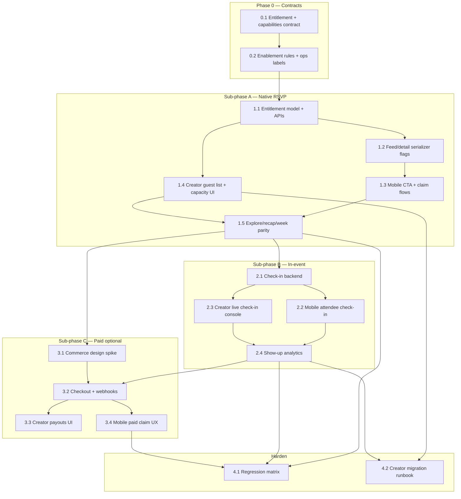

## How to use this document

Work through tasks **in order within each phase**. Soft dependencies are in [Execution order](#execution-order).

This plan is **Phase 2** of Just Go self-serve hosting. It **depends on** [Phase 1 — Creator console groundwork](/strategy/just-go-creator-console-phase1-plan) (provenance, creator APIs, curation drafts, console shell). Do **not** start consumer branching until Phase 1 Tasks **0.1**, **2.1**, and **3.1** are done (metadata + create path + ops Host-created surfacing).

For every task:

1. Read **Context** and **Instructions**.
2. Follow [Engineering conventions](#engineering-conventions-required) ([backend](/backend/best-practices) + mobile Pivot patterns + [frontend](/frontend/best-practices) for console).
3. Implement only what that task describes — especially do not pull paid payouts forward without completing free native RSVP first.
4. Run **Evaluation criteria** as a checklist before marking done.
5. Record blockers or deviations in the PR.
6. **Update this file** when the task is complete (see [Agent completion](#agent-completion)).

### Agent completion

<Warning>
**Required for agents:** When you finish a task (code merged or explicitly accepted), edit this markdown file in the same PR — do not leave the plan out of date.
</Warning>

For the task you completed:

1. In the [Task status ledger](#task-status-ledger), change that row from `pending` to **`done`** (add `doneAt` or PR link in Notes if helpful).
2. Under the task heading, change **`Status:`** from `` `pending` `` to **`done`**.
3. Check every item in that task’s **Evaluation criteria** (`- [ ]` → `- [x]`).

If work is partial or blocked, set **`Status:`** to `blocked` and note why — do not mark `done`.

### Related docs

- [Just Go creator console — Phase 1](/strategy/just-go-creator-console-phase1-plan) — groundwork; `source: 'justgo'`, `platformManaged: false`, console port
- [Events marketplace pivot](/strategy/events-marketplace-pivot) — organizer loop, quality marketplace, deferred payouts
- [Pivot metadata contract](/strategy/pivot-metadata-contract) — extend for platform-managed fields
- [Pivot MVP implementation plan](/strategy/pivot-mvp-implementation-plan) — Just Go brand, intent model (`interested` / `registered`), design language
- [Pivot tenant ops dashboard plan](/strategy/pivot-tenant-ops-dashboard-plan) — ops release gate still applies
- [Backend best practices](/backend/best-practices)
- [Web client best practices](/frontend/best-practices)
- Atlas check-in / registrations (reference only) — Meridian web `EventCheckInTab`, Events-Backend check-in routes

---

## Overall context

### Problem

Phase 1 lets hosts create listings that enter curation and, once released, appear in the weekly drop **indistinguishable from scrapes** in the consumer app. That validates supply and the management surface, but it does **not** incentivize hosts to leave Partiful/Luma: attendees still leave the app for tickets, and Just Go has no extra control or door-time tools.

Phase 2 makes **platform-hosted** events first-class: the app treats them differently, Just Go owns RSVP/ticketing (starting free), and creators get real in-event + registration tooling in the console.

| Gap | After Phase 1 | Needed (Phase 2) |
| --- | --- | --- |
| Consumer CTA | Always external `get tickets` + `i got a ticket` | Branch: native claim / tickets for platform-managed; external unchanged for scrapes |
| Attendance truth | Intent + honor-system external confirm | Server-backed native registration / ticket entitlement |
| Door / live | No Just Go–specific tools | Check-in QR/list, creator live ops |
| Creator console | Insights on scrape-parity metrics | Unlock Registrations, Check-in, richer Run of Show / Post Mortem |
| Incentive | “Listing + analytics” | Distribution **plus** control, guest list, door tools (± paid later) |
| Ranker / quality | Same signals as scrapes | Stronger outcome signals (show-up, feedback linkage) for host events |

### What we are building

```text
Phase 1 event (source=justgo, platformManaged=false)
  → same consumer path as scrape (external link)

Phase 2 enablement (per event or creator default)
  → platformManaged=true
  → Feed/detail serializer exposes capability flags
  → App branches CTAs + flows
  → Native RSVP / ticket entitlement APIs
  → Check-in + creator live dashboard
  → Optional paid ticketing (later sub-phase)
```

**Product name:** Just Go–hosted / “hosted on Just Go” (user-facing). Internal: `platformManaged` + `source: 'justgo'`.

### Preconditions (from Phase 1)

| Prerequisite | Why |
| --- | --- |
| `customFields.pivot.source === 'justgo'` | Stable provenance |
| `platformManaged` field exists (default `false`) | Explicit enablement bit — not inferred only from source |
| Creator console + APIs | Surface to flip capabilities and operate door/guest list |
| Curation Host-created filter | Ops can still gate which host events go live |
| Feed eligibility unchanged | Still `ingestStatus === 'published'` (+ week/host rules) |

### Product / architecture decisions (stable for this plan)

| Decision | Choice | Why |
| --- | --- | --- |
| Branch key | Prefer **`platformManaged === true`** for consumer behavior; `source === 'justgo'` for analytics/ops | Lets a Just Go listing stay external (`platformManaged: false`) during transition; scrapes never set managed true |
| Enablement | Creator (or ops) opts event into platform-managed when ready; not automatic on all `source: justgo` | Phase 1 early adopters keep scrape-parity until they opt in |
| Ops release | **Unchanged** — still draft → staged → published for drop | Native tools do not bypass curation |
| Scrapes | Never gain native ticketing via this plan | External catalog stays external |
| Free before paid | **Sub-phase A:** free native RSVP / claim · **Sub-phase B:** check-in / in-event · **Sub-phase C:** paid tickets + payouts | Matches marketplace doc deferral of Stripe; ships incentive earlier |
| Intent model | Keep `interested` / `registered` / `passed`; redefine how `registered` is earned for managed events | Avoid a third parallel attendance system |
| `registered` (managed) | Set only via native claim / ticket entitlement (not “i got a ticket” after Safari) | Honest going signal |
| `registered` (scrape) | Unchanged external confirm flow | |
| Capacity | Optional `capacity` / waitlist on managed events | Real control hosts lack on scrapes |
| Guest list visibility | Creator sees PII/contact per privacy policy; friends still see friend-intent graphs as today | |
| Check-in | Reuse Events-Backend check-in patterns adapted to Pivot entitlements + creator auth | Do not require campus OrgMember |
| Mobile design | Full Just Go scrapbook language for **attendee** flows; creator **mobile** companion optional/thin | Web console remains primary creator workstation |
| Console design | Same Phase 1 admin motif pass; unlock tabs rather than redesign | Continuity for hosts trained on Phase 1 |
| Ranker | Prefer managed show-up / feedback features when present; no hard requirement to ship ML in this plan | Quality loop from marketplace doc — start with better labels |
| Payouts / Connect | Sub-phase C only; separate compliance review | Do not block A/B |

### Capability flags (API contract)

Serializer (feed, explore, detail, creator APIs) should expose an explicit capabilities object so clients do not re-derive policy:

```json
{
  "source": "justgo",
  "platformManaged": true,
  "capabilities": {
    "externalTickets": false,
    "nativeRsvp": true,
    "nativePaidTickets": false,
    "checkIn": true,
    "capacity": { "limit": 40, "remaining": 12 }
  }
}
```

| Flag | Scrape | Just Go unmanaged | Just Go managed (A) | Managed + paid (C) |
| --- | --- | --- | --- | --- |
| `externalTickets` | true if link | true if link | false (or soft-fallback) | false |
| `nativeRsvp` | false | false | true | true (or ticket replaces) |
| `nativePaidTickets` | false | false | false | true |
| `checkIn` | false | false | true after B | true |

Client rule: **branch on `capabilities`**, not only on `source`.

### Branding — Just Go (Phase 2 surfaces)

| Surface | Guidance |
| --- | --- |
| Consumer | Existing scrapbook system (`PIVOT_COLORS`, Les Flos titles, Instrument Sans, Space Mono, `PIVOT_COPY`) — new copy keys for hosted CTAs (“claim spot”, “your spot is saved”, “hosted on just go”) |
| Hosted badge | Small ink/cream chip on detail (and optional card) — not a noisy sticker pile |
| Creator web | Phase 1 console tokens; live Check-in uses clear status greens/oranges consistent with admin calm UI |
| Notifications | Just Go voice; never Atlas/Meridian org copy |

### Engineering conventions (required)

#### Backend — [best practices](/backend/best-practices)

| Concern | Rule |
| --- | --- |
| Models | `getModels(req, …)` on city tenant; global identity via `getGlobalModelService` |
| Entitlements | New tenant-scoped model(s) (e.g. `PivotTicket` / `PivotRegistration`) registered in `getModelService.js` with explicit collection name — or carefully extend `PivotEventIntent` with entitlement fields; **document choice in Task 0.1** |
| Auth | Consumer: `verifyToken`; creator ops: Phase 1 `requirePivotCreator`; door staff later may use short-lived check-in tokens |
| Responses | `{ success, data?, message?, code? }` |
| Services | Thin routes; entitlement + check-in logic in services with `req` passed in |
| Tests | Route-outcomes for claim, capacity, check-in, serializer capabilities; scrapes unaffected |
| Payments (C) | Isolate Connect/webhook code in dedicated services; never mix into ingest scrape paths |

#### Mobile (`Meridian-Mobile`)

| Concern | Rule |
| --- | --- |
| Branching | Central helper e.g. `getEventCapabilities(event)` — screens must not scatter `source === 'justgo'` checks |
| Module | Prefer `src/pivot/` components/hooks (`usePivotNativeRsvp`, check-in screens under `src/pivot/…`) |
| API | Extend `src/services/api/` pivot queries — no ad-hoc fetch |
| Copy | All user-facing strings in `pivotCopy.ts` |
| Theme | `usePivotColors` / fonts / existing card primitives |
| Safety | Scrapes must keep Safari external ticket path; regression tests for unmanaged events |

#### Creator web

| Concern | Rule |
| --- | --- |
| API | `useFetch` / `postRequest` only |
| Unlock | Feature tabs gated on `platformManaged` / capabilities from creator API |
| No ClubDash | Stay under `JustGoCreator/` |

### Repositories touched

| Area | Path |
| --- | --- |
| Mobile | `Meridian-Mobile/src/pivot/**`, pivot API queries, copy, event detail / week / explore / recap |
| Backend | Creator + pivot consumer routes/services, entitlement/check-in schemas, serializer, tests |
| Frontend creator | `Meridian/frontend/src/pages/JustGoCreator/` — unlock tabs, live check-in |
| Docs | Metadata contract, this plan, Phase 1 cross-links |
| Ops web | Light badges only if needed (“Managed” vs “External host listing”) |

### Out of scope (this plan)

- Forcing all historical `source: justgo` events to `platformManaged: true`
- Changing scrape ingest or requiring Partiful/Luma hosts to move on-platform
- Campus ClubDash / org permissions as the creator gate
- Surge pricing, floorplans/video spatial dataset
- Full AI organizer coaching (may consume Phase 2 outcome metrics later)
- Second App Store binary

---

## Sub-phase map

| Sub-phase | Name | Ships | Blocked on |
| --- | --- | --- | --- |
| **A** | Native RSVP | Capabilities serializer, claim/cancel, app CTA branch, guest list in console | Phase 1 create + provenance |
| **B** | In-event | Check-in enable, QR/list, creator Run of Show, show-up metrics | A entitlements |
| **C** | Paid tickets | Price, inventory, checkout, payouts/Connect, refunds policy | A (+ legal/finance); B recommended |

A and B are the core “real event management” port. C is explicitly optional/later inside Phase 2.

---

## Execution order



---

## Task status ledger

| ID | Status | Notes |
| --- | --- | --- |
| 0.1 | pending | Entitlement + capabilities contract |
| 0.2 | pending | Enablement + ops labels |
| 1.1 | pending | Entitlement APIs |
| 1.2 | pending | Serializer flags |
| 1.3 | pending | Mobile claim UX |
| 1.4 | pending | Creator guest list / capacity |
| 1.5 | pending | Week / explore / recap parity |
| 2.1 | pending | Check-in backend |
| 2.2 | pending | Mobile check-in |
| 2.3 | pending | Creator live check-in |
| 2.4 | pending | Show-up analytics |
| 3.1 | pending | Commerce spike |
| 3.2 | pending | Checkout + webhooks |
| 3.3 | pending | Payouts UI |
| 3.4 | pending | Mobile paid UX |
| 4.1 | pending | Regression matrix |
| 4.2 | pending | Migration runbook |

---

## Phase 0 — Contracts

### Task 0.1 — Entitlement + capabilities contract

**Status:** `pending`

**Context:** Phase 1 reserved `platformManaged`. Phase 2 needs a concrete attendance entitlement model and a client-facing capabilities object so scrapes and managed events never share ambiguous CTAs.

**Instructions:**

1. Amend [pivot-metadata-contract](/strategy/pivot-metadata-contract):
   - Document when `platformManaged` may flip to `true` (creator opt-in; requires `source: 'justgo'`; ops may force off).
   - Add optional `capacity`, `rsvpClosesAt`, `checkIn` settings stubs.
2. Decision record in this file: **extend `PivotEventIntent`** vs **new `PivotRegistration` / `PivotTicket` collection**.  
   - Guidance: if free RSVP is “intent with stronger semantics,” extending intent with `entitlementStatus`, `claimedAt`, `checkedInAt` may suffice for A/B. Paid tickets almost certainly need a ticket/payment object in C — design A so C can attach `ticketId` later.
3. Specify API capability payload (see [Capability flags](#capability-flags-api-contract)).
4. Define state machine for managed free RSVP:

```text
none → interested (swipe/save)
interested → registered (native claim, if capacity)
registered → cancelled (release capacity)
registered → checked_in (Phase B)
```

5. Scrapes: capabilities always external; no claim endpoint.

**Evaluation criteria:**

- [ ] Metadata + this decision log updated
- [ ] Sequence diagram or state table for managed vs scrape `registered`
- [ ] Team agreement on intent-extend vs new collection

---

### Task 0.2 — Enablement rules + ops labels

**Status:** `pending`

**Context:** Not every Just Go listing should suddenly change consumer behavior. Ops need visibility into managed vs external host listings.

**Instructions:**

1. Creator API: `POST/PATCH` to set `platformManaged` with validation (must be `source: justgo'`, published-or-draft rules documented).
2. Tenant config knobs (optional): `creatorPublish.allowPlatformManaged`, `creatorPublish.defaultPlatformManaged` (default **false**).
3. Curation/Overview: badge **Managed** vs **Host · external** for `source: justgo`.
4. Audit log field: who flipped managed and when.

**Evaluation criteria:**

- [ ] Cannot set `platformManaged` on scrape-sourced events
- [ ] Ops badge visible in Host-created filter
- [ ] Default remains unmanaged for new creates until creator opts in

---

## Sub-phase A — Native RSVP

### Task 1.1 — Entitlement model + APIs

**Status:** `pending`

**Context:** Server is source of truth for “has a spot.”

**Instructions:**

1. Implement claim / cancel endpoints under `/pivot/` (consumer) and guest-list reads under `/pivot/creator/…`.
2. Enforce capacity atomically (avoid overbook races).
3. On successful claim: set user intent `registered` + entitlement fields; emit analytics.
4. On cancel: release capacity; intent returns to `interested` or `none` (lock product choice — **default:** back to `interested`).
5. Idempotent claim; stable error `codes`: `AT_CAPACITY`, `NOT_PLATFORM_MANAGED`, `RSVP_CLOSED`.
6. `getModels(req, …)` only; route-outcome tests.

**Evaluation criteria:**

- [ ] Concurrent claim test does not exceed capacity
- [ ] Scrape event claim returns `NOT_PLATFORM_MANAGED`
- [ ] Creator guest list shows claimants

---

### Task 1.2 — Feed / detail serializer flags

**Status:** `pending`

**Context:** Mobile must receive capabilities without ad-hoc field guessing.

**Instructions:**

1. Extend feed, explore, detail, and crew/recap serializers with `source`, `platformManaged`, `capabilities`.
2. When managed + native RSVP: omit or null out driving external ticket CTA (`externalTickets: false`); keep `externalLink` in admin-only payloads if needed for ops, not consumer.
3. Backwards compatible: old clients without branching should still not break — if old clients only look at `externalLink`, either keep a harmless link off or ship app update gated. **Locked:** ship app changes with API; managed events require app build that understands capabilities (min build flag optional).

**Evaluation criteria:**

- [ ] Fixture managed event JSON matches contract
- [ ] Scrape payload unchanged in CTA-relevant fields

---

### Task 1.3 — Mobile CTA + claim flows

**Status:** `pending`

**Context:** Primary attendee incentive surface. Must feel like Just Go, not a campus RSVP form.

**Instructions:**

1. Add `getEventCapabilities()` helper; use in `PivotEventDetailScreen`, week deck actions, recap cards.
2. Managed free RSVP UX:
   - Primary: **claim spot** / **you're going** (copy in `pivotCopy`)
   - Secondary: interested-only still available via swipe semantics
   - No Safari ticket open as primary
3. Unmanaged / scrape: existing `get tickets` + `i got a ticket`.
4. Success/error toasts; capacity full state; optional waitlist stub (**defer waitlist fulfillment** unless trivial).
5. Optional detail chip: **hosted on just go**.

**Evaluation criteria:**

- [ ] Side-by-side QA: scrape vs managed detail CTAs
- [ ] Claim updates UI intent to `registered` without app restart
- [ ] Copy passes Just Go voice review (no “RSVP to organization”)

---

### Task 1.4 — Creator guest list + capacity UI

**Status:** `pending`

**Context:** Unlock console value beyond Phase 1 insights.

**Instructions:**

1. Creator dashboard **Registrations / Guests** tab live for `platformManaged` events.
2. Set capacity; see list (name, status, claimedAt); export CSV.
3. Enable platform-managed toggle + explanation of consumer CTA change.
4. Unmanaged Just Go events: keep Phase 1 external-link fields + intent-only insights.

**Evaluation criteria:**

- [ ] Toggle managed ↔ unmanaged updates capabilities on next fetch
- [ ] Guest list matches claim API
- [ ] Unmanaged path still edits `externalLink`

---

### Task 1.5 — Explore / recap / week parity

**Status:** `pending`

**Context:** Detail is not enough — week plans, explore, crew recap also open tickets today.

**Instructions:**

1. Audit all `externalLink` / `getTickets` call sites under `src/pivot/`; route through capabilities helper.
2. Recap “get tickets” becomes claim / open spot status for managed events.
3. Friend “going” counts use `registered` consistently for managed claims.

**Evaluation criteria:**

- [ ] Grep-level audit checklist attached to PR (no stray Safari opens for managed)
- [ ] Crew/recap QA pass

---

## Sub-phase B — In-event

### Task 2.1 — Check-in backend

**Status:** `pending`

**Context:** Platform control at the door. Adapt Events-Backend ideas without org membership.

**Instructions:**

1. Enable check-in settings on managed events (creator-auth).
2. Endpoints: issue attendee check-in token/QR payload; creator manual check-in by user id; list checked-in vs expected.
3. Only `registered` (valid entitlement) can check in — unless creator allows walk-up (config default **false** for v0).
4. Socket or poll-friendly list updates for live console.
5. Tests for unauthorized check-in and double check-in idempotency.

**Evaluation criteria:**

- [ ] Scrape events cannot enable Just Go check-in via creator API
- [ ] Manual + self check-in paths covered in route-outcomes

---

### Task 2.2 — Mobile attendee check-in

**Status:** `pending`

**Context:** Attendees present QR or use link; keep scrapbook UI.

**Instructions:**

1. “Your spot” / ticket surface for registered managed events (QR or deep link).
2. Day-of entry from week plans / detail.
3. Do not expose campus check-in routes to scrapes.

**Evaluation criteria:**

- [ ] Registered user can show scannable credential
- [ ] Unregistered user cannot

---

### Task 2.3 — Creator live check-in console

**Status:** `pending`

**Context:** Phase 1 hid check-in — unlock Run of Show.

**Instructions:**

1. Enable Check-in tab in Just Go Creator focused dashboard for managed events in live/planning window.
2. QR scanner (web) or manual search; live counts; recent check-ins feed.
3. Motif pass only — prioritize readability at the door (large numbers, ink/cream contrast).

**Evaluation criteria:**

- [ ] Creator can check in a guest end-to-end in staging city
- [ ] Tab hidden for unmanaged events

---

### Task 2.4 — Show-up analytics

**Status:** `pending`

**Context:** Feeds organizer loop and future ranker features.

**Instructions:**

1. Creator insights: claimed vs checked-in rate; no-show estimate.
2. Persist enough history for post-mortem week view.
3. Optional: expose anonymized features for ranking jobs later (no ML required now).

**Evaluation criteria:**

- [ ] Numbers reconcile with check-in list
- [ ] Phase 1 intent-only charts still work for unmanaged

---

## Sub-phase C — Paid tickets (optional)

### Task 3.1 — Commerce design spike

**Status:** `pending`

**Context:** Marketplace doc deferred payouts. Spike before build.

**Instructions:**

1. Decide processor (e.g. Stripe Connect), fee model, refund policy, tax posture.
2. Ticket types (GA vs tiers), inventory vs capacity relationship.
3. Write ADR-style section in this plan or sibling doc; **gate 3.2 on human approval**.

**Evaluation criteria:**

- [ ] Written decision approved
- [ ] Explicit non-goals (surge, secondary market)

---

### Task 3.2 — Checkout + webhooks

**Status:** `pending`

**Context:** Paid entitlement issuance.

**Instructions:**

1. Create checkout session; webhook marks ticket paid → `registered` + ticket record.
2. Idempotent webhooks; never trust client payment success alone.
3. Capabilities: `nativePaidTickets: true`; claim CTA becomes purchase.

**Evaluation criteria:**

- [ ] Webhook replay safe
- [ ] Failed payment does not grant entitlement

---

### Task 3.3 — Creator payouts UI

**Status:** `pending`

**Instructions:**

1. Onboarding Connect (or equivalent) in creator console.
2. Payout status, fee breakdown, export.
3. Just Go admin motif; compliance copy reviewed.

**Evaluation criteria:**

- [ ] Creator can complete onboarding in staging
- [ ] No campus billing systems reused incorrectly

---

### Task 3.4 — Mobile paid claim UX

**Status:** `pending`

**Instructions:**

1. Purchase sheet / web checkout handoff consistent with Just Go design.
2. Post-purchase “your ticket” state shared with B check-in credential.

**Evaluation criteria:**

- [ ] Paid path QA on iOS + Android
- [ ] Scrape path still external-only

---

## Harden

### Task 4.1 — Regression matrix

**Status:** `pending`

**Instructions:**

1. Matrix doc in PR: scrape interested/register/external; justgo unmanaged; justgo managed free; (optional) paid.
2. Automated tests where stable; manual checklist for UI.
3. Verify ops release still required for feed visibility.

**Evaluation criteria:**

- [ ] Matrix signed off
- [ ] No scrape regressions filed open

---

### Task 4.2 — Creator migration runbook

**Status:** `pending`

**Context:** Phase 1 hosts need a path to opt into managed.

**Instructions:**

1. Runbook: enable managed → set capacity → test claim → enable check-in → door rehearsal.
2. Messaging for attendees when an event flips from external to native mid-funnel (lock: **disallow flip after first external open analytics?** or warn — **default:** allow pre-publish freely; after `published`, warn + confirm in console).
3. Link from Phase 1 early-adopter runbook.

**Evaluation criteria:**

- [ ] Runbook published in Mintlify strategy nav / cross-link
- [ ] At least one pilot host dry-run completed

---

## Decision log

| Topic | Decision |
| --- | --- |
| Branch key | `capabilities` derived from `platformManaged` (+ paid flags); not source alone |
| Phase 1 events | Stay unmanaged until opt-in |
| Free before paid | A → B → C |
| Ops curation | Still required for drop |
| Scrapes | Unchanged external flow |
| Check-in auth | Creator grant (Phase 1), not OrgMember |
| `registered` meaning | Native entitlement for managed; external confirm for scrapes |

---

## Open questions

1. **Waitlist:** real queue in A, or capacity-full only?
2. **Guest +1 / plus-ones:** support in free RSVP or only paid tiers?
3. **Flip after publish:** confirm default warn+confirm vs freeze CTA mode.
4. **Staff check-in roles:** creator-only vs allowlisted door staff accounts.
5. **Sub-phase C timing:** same quarter as B or separate initiative after pilot metrics?

Resolve in PR notes; update this decision log when closed.

---

## Relationship to Phase 1

| Phase 1 delivered | Phase 2 consumes |
| --- | --- |
| `source: 'justgo'` | Ops filters + analytics splits |
| `platformManaged: false` default | Opt-in enablement |
| Creator console shell | Unlock Registrations / Check-in |
| Curation draft pipeline | Unchanged publish authority |
| Intent insights | Baseline before show-up metrics |
| Untouched consumer app | Intentional; this plan is the client refactor |
