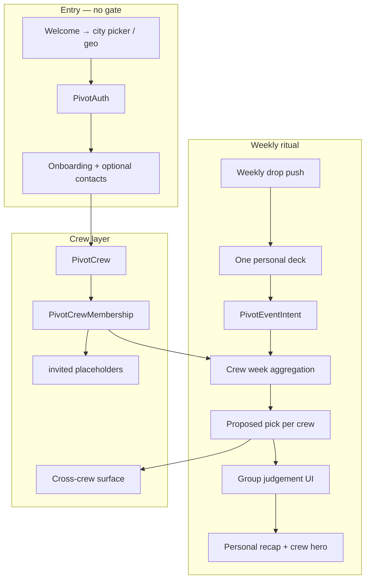

## How to use this document

Work through tasks **in order within each phase**. Later phases assume earlier schemas and APIs exist.

This plan **extends** the [Pivot MVP implementation plan](/strategy/pivot-mvp-implementation-plan). It does **not** replace the weekly drop, swipe deck, Explore, or embeddings groundwork — it layers **crew coordination** on top.

Architecture rationale: [Events marketplace pivot](/strategy/events-marketplace-pivot) (social graph as retention), [Just Go — embeddings recommendations](/strategy/just-go-embeddings-recommendations) (ranker + interaction log), [Explore + embeddings groundwork](/strategy/just-go-explore-embeddings-plan) (surface/retrieval logging).

For every task:

1. Read **Context** and **Instructions**.
2. Implement only what that task describes.
3. Run **Evaluation criteria** before marking done.
4. Update the [Task status ledger](#task-status-ledger) in the same PR.

### Agent completion

<Warning>
**Required for agents:** When you finish a task (code merged or explicitly accepted by the user), you **must edit this markdown file** in the same PR or follow-up commit—do not leave the plan out of date.
</Warning>

For the task you completed:

1. In the [Task status ledger](#task-status-ledger), change that row from `pending` to **`done`** (add `doneAt: YYYY-MM-DD` in Notes if helpful).
2. Under the task heading, change **`Status:`** from `` `pending` `` to **`done`**.
3. Check every item in that task’s **Evaluation criteria** (`- [ ]` → `- [x]`).

If work is partial or blocked, set **`Status:`** to `blocked` and note why — do not mark `done`.

---

## Locked product decisions

These are **fixed** for this plan. Do not re-litigate in individual tasks unless the user explicitly changes direction.

| # | Decision | Choice |
| --- | --- | --- |
| 1 | Crews per user | **Unlimited** |
| 2 | Identity | Crew is **secondary** to individual taste / profile |
| 3 | Deck + pick model | **One personal deck** per user per week; swipes **feed every crew** the user belongs to; **one pick surfaced per user** (aggregated view across crews — see [Pick model](#pick-model-one-user-one-surface)) |
| 4 | Group outcome | **System proposes** → short **group judgement** phase (frictionless confirm / swap) — not silent auto-pick |
| 5–8 | Algorithm, quorum, splits, deadline | Defined in [Tunable defaults](#tunable-defaults-server-backed-client-resilient) — adjustable via config, not hard-coded |
| 9 | Personal vs crew intent | Crew pick **sits on top** of personal interested/going; personal recap unchanged |
| 10 | Invited placeholders | **Do not** count toward quorum or votes |
| 11 | Solo users | **Same as today** (individual deck + recap) + soft nudges to start a crew |
| 12 | Contacts | **Optional, highly encouraged** at onboarding |
| 13 | Referral gating | **Remove gated access** — open city entry (referral attribution optional, not required) |
| 14 | Invited UX | Generic **“invited”** label until signup (no contact name leak) |
| 15–16 | Feed + interest bleed | **Server-configurable weights** with documented defaults; client ships matching fallbacks |
| 17–18 | Cross-crew overlap | **Surface only** — no chat, merge, or meetup infra in this plan |
| 19 | User-facing name | **`crew` / `crews`** in `PIVOT_COPY` (internal code: `PivotCrew`, routes `/pivot/crews/*`) |
| 20 | Outward message | **“Stop planning.”** — weekly ritual with your people |

### Naming: why **crew**

Alternate names considered: *circle*, *table*, *pod*, *squad*.

**Ship `crew`** in user-facing copy because:

- Already present in `PIVOT_COPY.cohortOnboarding.loadError` (“could not load your crew”)
- Matches Just Go voice — lowercase, informal, movement-friendly
- Distinct from campus “friends” and generic “group”
- Internal code stays **`pivot` / `PivotCrew`** per repo convention; only strings live in `pivotCopy.ts`

Copy module shape (add alongside existing keys — do not rename `cohortOnboarding` until Phase 1 migration):

```typescript
// Meridian-Mobile/src/pivot/copy/pivotCopy.ts (sketch)
crew: {
  singular: 'crew',
  plural: 'crews',
  invited: 'invited',
  ticker: 'stop planning — just go',
  // ...
}
```

---

## Overall context

### What we are building

Just Go evolves from a **personal weekly swipe app** into a **coordination layer for people you already know**:

```text
open app (no invite code gate)
  → onboarding (interests + optional contacts + start a crew)
  → weekly drop push
  → one personal deck (same as today)
  → each swipe feeds every crew you're in
  → system proposes crew pick(s) + quick group judgement
  → personal recap + crew pick on top
  → tickets on Partiful/Luma (unchanged)
  → cross-crew overlap surfaced when another crew is going too
```

**Primary message:** *Stop planning. Start going.*

Partiful/Luma remain ticket surfaces. Meridian remains discovery + intent + **group commitment**.

### What stays the same

| Layer | Unchanged |
| --- | --- |
| Weekly drop + push → Week tab | Yes |
| `PivotEventIntent` per user × event | Yes — source of truth for swipes |
| Partiful/Luma ingest + external tickets | Yes |
| Explore tab + `surface` / `retrieval` logging | Yes — extend rails, don’t fork |
| 1:1 `Friendship` graph | Yes — crews layer on top |
| Embeddings data plane + shadow eval path | Yes — crew signals become ranker features |

### New primitives

| Primitive | Role |
| --- | --- |
| **`PivotCrew`** | Named crew in a city tenant |
| **`PivotCrewMembership`** | Member, owner, or **invited** placeholder |
| **`PivotCrewWeekState`** | Per crew × `batchWeek`: swipe progress, proposed pick, judgement status |
| **`PivotCrewJudgement`** | Lightweight confirm / swap / split resolution |
| **`pivotCrewConfig`** | Tenant-scoped tunables (weights, quorum, deadlines) |

### Pick model (one user, one surface)

User belongs to **unlimited crews**, but the product surfaces **one primary crew outcome per user per week**:

1. User completes **one personal deck** (existing feed).
2. For each crew, compute a **proposed event** from member swipes (active members only).
3. User sees a **personal judgement sheet** ordered by crew priority:
   - Default: crew with highest participation quorum first
   - User can confirm/swap per crew in a **single frictionless pass** (not N separate flows)
4. **Personal recap** lists all personal `interested` events; **hero card** shows confirmed crew pick(s) when applicable.

If user is in zero crews, behaviour matches **today’s MVP** (+ nudge to invite).

### Group judgement phase (UX contract)

After personal deck completion (or when quorum hits — whichever comes first for a crew):

| Step | Behaviour |
| --- | --- |
| **Propose** | Server returns top 1–3 events with vote breakdown (avatars on interested) |
| **Judgement window** | Short, configurable window before event start (default **24h before earliest candidate start**, min **6h after user finishes deck**) |
| **Confirm** | One tap **“we’re going”** locks crew pick for that week |
| **Swap** | Pick runner-up if within judgement window |
| **Split** | If no majority, show top two + **“split — pick one”** (user resolves in judgement UI; no silent tie-break) |

Invited members appear as **“invited”** on roster and vote breakdown but **never** affect quorum.

---

## Tunable defaults (server-backed, client-resilient)

<Footnote>
**Principle:** Ship sensible **defaults in mobile + backend**. Tenant config **overrides** when present. Client **must not block** if config fetch fails — use bundled defaults and log a warning.
</Footnote>

### Config delivery

Extend **`GET /pivot/config`** (existing) with a `crew` object. Optional **`PUT /admin/platform/tenants/:tenantKey/pivot-crew-config`** for Platform Admin (Phase 6).

```json
{
  "tenantKey": "brooklyn",
  "liveBatchWeek": "2026-W30",
  "dropSchedule": { "...": "unchanged" },
  "crew": {
    "version": 1,
    "feedMix": {
      "personalInterestWeight": 0.70,
      "crewSignalWeight": 0.20,
      "friendSignalWeight": 0.05,
      "explorationWeight": 0.05
    },
    "interestBleed": {
      "enabled": true,
      "maxWeight": 0.15,
      "requiresCrewMemberSwipe": false
    },
    "quorum": {
      "minSwipeParticipation": 0.60,
      "minActiveMembers": 2
    },
    "judgement": {
      "windowHoursBeforeEvent": 24,
      "minHoursAfterDeckComplete": 6
    },
    "pick": {
      "algorithm": "weighted_majority",
      "interestedWeight": 1.0,
      "registeredWeight": 1.5,
      "tieBreak": "most_registered_then_earliest_start"
    },
    "crossCrew": {
      "enabled": true,
      "minSharedFriends": 1,
      "surfaceCopyKey": "another_crew_going"
    },
    "nudges": {
      "soloCreateCrewAfterWeeks": 2,
      "unfinishedSwipeReminderHours": 12
    }
  }
}
```

### Default rationale

| Knob | Default | Why |
| --- | --- | --- |
| `feedMix.personalInterestWeight` | 0.70 | Deck still feels like *your* taste |
| `feedMix.crewSignalWeight` | 0.20 | Crew influence without hijack |
| `interestBleed.maxWeight` | 0.15 | Friends’ tags nudge order slightly |
| `quorum.minSwipeParticipation` | 0.60 | 60% of **active** members swiped |
| `quorum.minActiveMembers` | 2 | Solo crew = personal mode |
| `pick.algorithm` | `weighted_majority` | `registered` > `interested`; transparent |
| `crossCrew.minSharedFriends` | 1 | Surface overlap only when graphs touch |

### Ranker integration (embeddings-aware)

Per [embeddings recommendations](/strategy/just-go-embeddings-recommendations):

- **v0 (`rules_v0`):** extend `compareByFeedRank` with crew counts (same pattern as friend boosts) using weights from `crew.feedMix`.
- **Future (`emb_v1`):** crew features as side inputs to hybrid ranker — log `rankerVersion` + crew weights on `PivotInteraction` for offline eval.
- **Do not** block deck on config — if `crew` missing from config response, use mobile `PIVOT_CREW_DEFAULTS` mirror of table above.

---

## Architecture diagram



---

## Execution order

```text
Phase 0 — Open access + config contract (remove referral gate, extend GET /pivot/config)
Phase 1 — Crew foundation (schema, invites, onboarding, PIVOT_COPY.crew)
Phase 2 — Aggregation + judgement (proposed pick, quorum, nudges)
Phase 3 — Ranker + feed mix (rules_v0 crew boosts, interest bleed)
Phase 4 — Cross-crew surfacing + explore rail
Phase 5 — Contacts match (optional accelerator)
Phase 6 — Ops admin + analytics + movement polish
```

**Parallel safe:** Phase 5 can slip after Phase 2. Embeddings Phase A ([interaction log](/strategy/just-go-embeddings-recommendations#1-unified-interaction-log-highest-leverage)) should stay ahead of Phase 3 ranker changes.

---

## Task status ledger

| Task | Status | Notes |
| --- | --- | --- |
| 0.1 | done | Open city entry — removed referral gate; doneAt: 2026-07-21 |
| 0.2 | done | `crew` config on GET /pivot/config + defaults module; doneAt: 2026-07-21 |
| 0.3 | done | Mobile usePivotCrewConfig + offline defaults; doneAt: 2026-07-21 |
| 1.1 | done | `PivotCrew` + `PivotCrewMembership` schemas; doneAt: 2026-07-21 |
| 1.2 | done | Crew CRUD + invite link APIs; doneAt: 2026-07-21 |
| 1.3 | done | Invited placeholder members; doneAt: 2026-07-21 |
| 1.4 | done | Onboarding start-a-crew step; doneAt: 2026-07-21 |
| 1.5 | done | `PIVOT_COPY.crew` + migrate cohort step copy; doneAt: 2026-07-21 |
| 1.6 | done | Profile: crews section (secondary to you); doneAt: 2026-07-21 |
| 2.1 | done | `PivotCrewWeekState` aggregation job; doneAt: 2026-07-21 |
| 2.2 | done | `GET /pivot/crews/week` progress + proposed picks; doneAt: 2026-07-21 |
| 2.3 | done | Group judgement APIs (confirm / swap / judgement); doneAt: 2026-07-21 |
| 2.4 | done | Week UI: post-deck crew progress + judgement sheet |
| 2.5 | done | Nudges: unfinished swipes + solo crew CTA |
| 2.6 | done | Recap hero: crew pick on top of personal list |
| 3.1 | pending | Ranker: crew signal boosts from config weights |
| 3.2 | pending | Ranker: interest bleed from crew members’ tags |
| 3.3 | pending | Deck card copy: crew social proof |
| 3.4 | pending | Log crew context on `PivotInteraction` |
| 4.1 | pending | Cross-crew overlap detection |
| 4.2 | pending | Surface on recap + event detail (copy only) |
| 4.3 | pending | Explore rail: “crews going” |
| 5.1 | pending | Contacts permission + hash match pipeline |
| 5.2 | pending | Onboarding contacts accelerator UI |
| 6.1 | pending | Platform Admin crew config editor |
| 6.2 | pending | Tenant dashboard: crew funnel metrics |
| 6.3 | pending | Push copy: “stop planning” crew ritual |
| 6.4 | pending | End-to-end crew dry run |

---

## Phase 0 — Open access + config contract

### Task 0.1 — Remove referral gate (open city entry)

**Status:** `done`

**Context:** Product direction removes invite-code gating. Users pick or auto-detect city and enter Just Go directly. Referral **attribution** (`ref`, deep links) remains for analytics but does not block signup.

**Instructions:**

1. **Welcome flow:** Replace “got an invite code?” primary path with city selection (existing tenant list or geo). Keep deep link `meridian://invite?code=` as **optional** attribution only — invalid/missing code does not block.
2. **`AppEditionContext`:** Allow `edition = pivot` without prior `POST /pivot/referral/validate` success. Store `tenantKey` from city pick.
3. **Backend:** New or relaxed `POST /pivot/entry` (or extend config) to bind user to tenant without redemption record. Keep `PivotReferralRedemption` for attribution when code present.
4. **Copy:** Update `PIVOT_COPY.referral` → deprecate gate strings; add `PIVOT_COPY.entry` (“pick your city”, “stop planning — just go”).
5. **Do not delete** referral admin tooling yet — ops may still use codes for cohort tracking until Phase 6 metrics exist.

**Evaluation criteria:**

- [x] New user can complete auth + onboarding without a referral code
- [x] Deep link with valid code still records attribution
- [x] Campus edition unchanged for non-pivot users
- [x] `PIVOT_COPY` updated; no user-facing “invite code required” dead ends

---

### Task 0.2 — Crew config on `GET /pivot/config`

**Status:** `done`

**Context:** All fuzzy constants live in tenant config with versioned defaults (see [Tunable defaults](#tunable-defaults-server-backed-client-resilient)).

**Instructions:**

1. Add `pivotCrewConfig` fields on tenant document (global DB) with schema validation.
2. Extend `pivotConfigService.getPivotConfig` to merge stored config + **documented defaults**.
3. Return `crew.version` so clients can detect stale bundles.
4. Unit tests: missing tenant overrides → defaults; partial overrides → deep merge.

**Evaluation criteria:**

- [x] `GET /pivot/config` includes `crew` object matching contract
- [x] Defaults match table in this doc
- [x] Tests cover merge + invalid value rejection

---

### Task 0.3 — Mobile config hook with offline fallbacks

**Status:** `done`

**Instructions:**

1. Add `usePivotCrewConfig()` — fetches from existing pivot config query; falls back to `PIVOT_CREW_DEFAULTS` in `Meridian-Mobile/src/pivot/constants/pivotCrewDefaults.ts`.
2. Feed ranker client **does not** re-sort — only UI that needs thresholds (judgement countdown, nudge timing) reads config.
3. Log analytics when fallback used (`pivot_crew_config_fallback`).

**Evaluation criteria:**

- [x] App renders Week flow offline with defaults
- [x] When config loads, UI updates without restart
- [x] Defaults mirror backend defaults exactly

---

## Phase 1 — Crew foundation

### Task 1.1 — `PivotCrew` + `PivotCrewMembership` schemas

**Status:** `done`

**Instructions:**

1. **Tenant DB** collections:
   - `PivotCrew`: `{ name, createdBy, tenantKey, createdAt, archivedAt? }`
   - `PivotCrewMembership`: `{ crewId, userId?, inviteToken, status: active|invited|left, role: owner|member, invitedAt, joinedAt? }`
2. Indexes: `{ crewId, userId }` unique for active members; `{ inviteToken }` unique.
3. Unlimited crews per user — no artificial cap in schema.

**Evaluation criteria:**

- [x] Schemas registered in getModels
- [x] Migrations/seed script for dev tenants
- [x] User can belong to multiple crews

---

### Task 1.2 — Crew CRUD + invite link APIs

**Status:** `done`

**Routes (consumer, `/pivot/crews`):**

| Method | Path | Role |
| --- | --- | --- |
| `POST` | `/` | Create crew |
| `GET` | `/` | List user’s crews |
| `GET` | `/:crewId` | Detail + roster |
| `POST` | `/:crewId/invite-link` | Rotate share URL |
| `POST` | `/join` | Accept invite token |

Deep link: `meridian://pivot/crew/join?token=…` (parallel to existing invite infra).

**Evaluation criteria:**

- [x] Create/list/join flows covered by route outcome tests
- [x] Invite link opens app to crew join screen
- [x] Owner can invite; members can invite (configurable later — default **all members**)

---

### Task 1.3 — Invited placeholder members

**Status:** `done`

**Instructions:**

1. `POST /pivot/crews/:crewId/invite` accepts `{ count: N }` or share-sheet flow — creates **N** `status: invited` rows **without** PII (display as generic **“invited”** per decision #14).
2. When invitee joins via token, replace placeholder or merge into their userId membership.
3. Roster API returns `{ status, displayLabel: 'invited' | user.name }`.

**Evaluation criteria:**

- [x] Invited rows visible on roster before signup
- [x] Invited never counted in quorum (server-enforced)
- [x] Generic label only in API + UI

---

### Task 1.4 — Onboarding: start a crew step

**Status:** `done`

**Instructions:**

1. Replace or follow **cohort** step with **“start a crew”** — name crew + share invite link; **skip** allowed.
2. Optional **contacts** CTA (highly encouraged) — Phase 5 wires match; Phase 1 ships share link only.
3. Order: name → interests → **crew** → theme → age → calendar (adjust if calendar already shipped).

**Evaluation criteria:**

- [x] Onboarding completes without crew (solo path)
- [x] Creating crew during onboarding lands user on Week with crew roster visible
- [x] Skip does not block deck

---

### Task 1.5 — `PIVOT_COPY.crew` + copy migration

**Status:** `done`

**Instructions:**

1. Add `PIVOT_COPY.crew` section — lowercase, stop-planning voice:

| Key | Example string |
| --- | --- |
| `ticker` | `stop planning — just go` |
| `createTitle` | `start a crew` |
| `createSubtitle` | `swipe together — we\'ll pick where you\'re going` |
| `invited` | `invited` |
| `judgementTitle` | `where\'s your crew going?` |
| `confirmCta` | `we\'re going` |
| `swapCta` | `pick another` |
| `nudgeUnfinished` | (count) => `${count} haven\'t swiped yet` |

2. Repoint cohort strings to crew where user-facing.
3. **No** user-facing word “circle” or “cohort”.

**Evaluation criteria:**

- [x] All new UI strings in `pivotCopy.ts` only
- [x] Voice matches existing Just Go patterns

---

### Task 1.6 — Profile: crews section

**Status:** `done`

**Instructions:**

1. Profile tab: **You** first (interests, settings); **Crews** section below friends entry.
2. List crews with member counts + invited count.
3. Secondary identity — no crew-first profile layout.

**Evaluation criteria:**

- [x] Unlimited crews list without perf issues (paginate if >20)
- [x] Tap crew → roster + invite CTA

---

## Phase 2 — Aggregation + judgement

### Task 2.1 — `PivotCrewWeekState` aggregation

**Status:** `done`

**Instructions:**

1. Collection keyed `{ crewId, batchWeek }` with `{ swipeProgress, proposedEventId, proposedScore, voteBreakdown[], judgementStatus }`.
2. Recompute on: member swipe (`POST /pivot/feed/action`), member join/leave, scheduled job every 15m.
3. Algorithm: **`weighted_majority`** from config — count `interested` + weighted `registered`; ignore invited; require `quorum.minSwipeParticipation` of **active** members.

**Evaluation criteria:**

- [x] Aggregation matches hand-calculated fixtures in unit tests
- [x] Invited excluded from quorum
- [x] Split votes produce top-2 candidates, not auto-resolution

---

### Task 2.2 — `GET /pivot/crews/week`

**Status:** `done`

**Returns:** For each crew user belongs to: `{ crewId, name, swipedCount, activeCount, invitedCount, quorumMet, proposedEvent, runnerUp, judgementWindowEndsAt }`.

**Evaluation criteria:**

- [x] Week screen can poll progress after each swipe
- [x] Response cached ≤30s or invalidated on intent write

---

### Task 2.3 — Group judgement APIs

**Status:** `done`

| Method | Path | Role |
| --- | --- | --- |
| `POST` | `/pivot/crews/:crewId/week/confirm` | Lock pick (`eventId`) |
| `POST` | `/pivot/crews/:crewId/week/swap` | Choose runner-up |
| `GET` | `/pivot/crews/:crewId/week/judgement` | Proposed + breakdown |

Judgement window enforced server-side from config.

**Evaluation criteria:**

- [x] Confirm after window → 409 with clear error
- [x] Swap only among top candidates for split resolution
- [x] Locked pick visible in recap API

---

### Task 2.4 — Week UI: crew progress + judgement sheet

**Status:** `done`

**Instructions:**

1. After deck complete (or inline banner during deck): crew progress chips (“2/5 swiped”).
2. Bottom sheet judgement: proposed event, avatar votes, confirm/swap — **one sheet per crew**, dismissible in sequence.
3. Push permission prompt unchanged.

**Evaluation criteria:**

- [x] Solo user sees no judgement sheet
- [x] Invited shown as “invited” in breakdown
- [x] Analytics: `pivot_crew_judgement_confirm`, `_swap`

---

### Task 2.5 — Nudges

**Status:** `done`

**Instructions:**

1. Local + push nudge when crew quorum not met — config `nudges.unfinishedSwipeReminderHours`.
2. Solo users: after `soloCreateCrewAfterWeeks`, soft banner on Week tab.
3. Do not spam — max 1 push per crew per batchWeek.

**Evaluation criteria:**

- [x] Nudge respects config thresholds
- [x] Solo path identical to current MVP deck behaviour

---

### Task 2.6 — Recap hero: crew on top

**Status:** `done`

**Instructions:**

1. Extend `GET /pivot/week-recap` with `crewPicks[]` — confirmed picks per crew.
2. UI: hero card(s) above personal interested list; personal list unchanged.
3. Ticket CTA on crew pick same as today (external open tracking).

**Evaluation criteria:**

- [x] Personal interested events still fully listed
- [x] Crew pick visually primary when present
- [x] Multiple crews → stacked hero cards (user resolves each)

---

## Phase 3 — Ranker + feed mix

### Task 3.1 — Crew signal boosts in `rules_v0`

**Status:** `pending`

**Instructions:**

1. Extend `pivotFeedService.compareByFeedRank` — after friend boosts, add crew member interested/registered counts × `crew.feedMix.crewSignalWeight`.
2. Read weights from `getPivotConfig` per request (cached in service memory ≤60s).
3. Document in [metadata contract](/strategy/pivot-metadata-contract).

**Evaluation criteria:**

- [ ] With config weights = 0, behaviour matches pre-change ranker
- [ ] Unit tests for crew boost ordering
- [ ] `rankerVersion` remains `rules_v0` until embeddings ship

---

### Task 3.2 — Interest bleed

**Status:** `pending`

**Instructions:**

1. When `interestBleed.enabled`, union crew members’ `pivotInterestTags` with dampening `maxWeight`.
2. Optional gate: `requiresCrewMemberSwipe` — if true, only tags from members who swiped this week count (default **false** per config table).
3. Card subtitle optional: “your crew digs jazz” — behind feature flag in copy.

**Evaluation criteria:**

- [ ] Bleed never exceeds `maxWeight` impact on sort key
- [ ] Disabled via config → zero bleed

---

### Task 3.3 — Deck card crew social proof

**Status:** `pending`

**Instructions:**

1. Feed serializer adds `crewInterestedCount`, `crewRegisteredCount` per event (per user’s crews).
2. Display on card when &gt;0 — reuse scrapbook chip pattern.

**Evaluation criteria:**

- [ ] Counts accurate for multi-crew overlap (dedupe members)
- [ ] Zero crews → fields omitted

---

### Task 3.4 — Interaction logging

**Status:** `pending`

Per [embeddings doc](/strategy/just-go-embeddings-recommendations#1-unified-interaction-log-highest-leverage):

1. Add optional `crewIds[]`, `crewConfigVersion` on `PivotInteraction` rows.
2. Enables future eval: “did crew boost change interested rate?”

**Evaluation criteria:**

- [ ] Deck impressions include crew context when user has crews
- [ ] No breaking change to existing log consumers

---

## Phase 4 — Cross-crew surfacing

### Task 4.1 — Overlap detection

**Status:** `pending`

**Rules (locked):**

- Event E is surfaced when **another crew** (user not in) has **confirmed pick** on E **and** user shares ≥ `crossCrew.minSharedFriends` with a member of that crew.
- No PII from other crew — only “another crew is going too”.

**Evaluation criteria:**

- [ ] No surface when `crossCrew.enabled = false`
- [ ] User in only one crew still sees overlap when friend graph connects

---

### Task 4.2 — Surface on recap + detail

**Status:** `pending`

**Instructions:**

1. Copy-only callout on crew hero + event detail — **no** chat, map pin, or merge UI.
2. Strings from `PIVOT_COPY.crew.crossCrewGoing`.

**Evaluation criteria:**

- [ ] Surface disappears if overlap crew unconfirms
- [ ] Analytics: `pivot_cross_crew_surface_view`

---

### Task 4.3 — Explore rail: “crews going”

**Status:** `pending`

**Instructions:**

1. Add explore section `retrieval: crews_rail` — events with crew picks / high crew interest.
2. Log `surface=explore`, `retrieval=crews_rail` per [Explore plan](/strategy/just-go-explore-embeddings-plan).

**Evaluation criteria:**

- [ ] Rail hidden when user has zero crews
- [ ] Same week catalog scope as existing explore

---

## Phase 5 — Contacts accelerator (optional timing)

### Task 5.1 — Contacts hash match pipeline

**Status:** `pending`

**Instructions:**

1. `expo-contacts` — optional permission; hash phones/emails server-side; match existing users.
2. **Never** store raw contacts; **never** auto-message contacts.
3. Match results → suggest friend requests or crew invites.

**Evaluation criteria:**

- [ ] Permission denial does not block onboarding
- [ ] Privacy review note in PR
- [ ] Hashes only in transit + match table

---

### Task 5.2 — Onboarding contacts UI

**Status:** `pending`

**Instructions:**

1. “Find people you know” step — highly encouraged, skippable.
2. Suggested users → add to crew or send friend request.

**Evaluation criteria:**

- [ ] Copy explains we don’t message contacts
- [ ] Skip rate tracked in analytics

---

## Phase 6 — Ops, analytics, movement polish

### Task 6.1 — Platform Admin crew config editor

**Status:** `pending`

**Instructions:**

1. UI on tenant management — edit `pivotCrewConfig` with validation + reset to defaults.
2. Preview JSON diff before save.

**Evaluation criteria:**

- [ ] Changes reflect in `GET /pivot/config` within 60s
- [ ] Invalid weights rejected

---

### Task 6.2 — Tenant dashboard crew metrics

**Status:** `pending`

**Metrics:**

| Metric | Definition |
| --- | --- |
| Crew creation rate | Users with ≥1 crew / WAU |
| Quorum hit rate | Crews meeting swipe quorum / active crews |
| Judgement confirm rate | Confirmed / proposed |
| Invited → joined | Placeholder resolved / invites sent |
| Cross-crew surfaces | Views / clicks |

**Evaluation criteria:**

- [ ] Overview tab widgets in Pivot tenant dashboard
- [ ] Filters by `batchWeek`

---

### Task 6.3 — Push copy: stop planning ritual

**Status:** `pending`

**Instructions:**

1. Weekly drop push variants: “your crew hasn’t swiped yet”, “where’s your crew going this week?”
2. A/B via tenant config later — ship one default first.

**Evaluation criteria:**

- [ ] Push still opens Week tab only
- [ ] Solo users get existing drop copy

---

### Task 6.4 — End-to-end crew dry run

**Status:** `pending`

**Script:** Two test users, one crew, full week: drop → swipe → quorum → judgement → recap → external open.

**Evaluation criteria:**

- [ ] Runbook section added to [weekly drop runbook](/strategy/pivot-weekly-drop-runbook)
- [ ] All Phase 0–4 tasks `done` or explicitly waived

---

## Embeddings + Explore alignment

| This plan | Embeddings / Explore doc | Action |
| --- | --- | --- |
| Crew ranker boosts | `rules_v0` baseline + future `emb_v1` side features | Phase 3.1; shadow log alternate order later |
| `PivotInteraction` | Requires `surface` + `retrieval` | Phase 3.4; explore rail Phase 4.3 |
| Deck snapshot | Frozen order for eval | Unchanged — crew weights logged at snapshot time |
| Explore | Separate eval from deck | Cross-crew rail uses `crews_rail` retrieval |
| Go-live gates | 200–500 swipers etc. | Crew metrics are **additional** gates for Phase 3 tuning, not blockers for Phase 1–2 |

**Do not** delay crew Phase 1–2 on vector infra. **Do** complete interaction logging (already in Explore plan Phase 1) before tuning feed mix in production.

---

## Risk register

| Risk | Mitigation |
| --- | --- |
| Referral removal floods wrong city | City picker + confirm; geo hint only |
| Unlimited crews → notification spam | Cap push nudges per batchWeek; batch judgement sheets |
| Group judgement feels heavy | Single sequential sheet; skippable until window end |
| Config drift mobile vs server | Version field + mirrored defaults file |
| Cross-crew privacy | Shared-friend threshold; no other crew names in v1 |
| Contacts sensitivity | Hash-only; optional; clear copy |

---

## Related documentation

- [Pivot MVP implementation plan](/strategy/pivot-mvp-implementation-plan) — shipped baseline
- [Just Go — embeddings recommendations](/strategy/just-go-embeddings-recommendations) — ranker eval + data plane
- [Just Go — Explore + embeddings groundwork](/strategy/just-go-explore-embeddings-plan) — Explore rails + logging
- [Pivot metadata contract](/strategy/pivot-metadata-contract) — intent + feed fields
- [Events marketplace pivot](/strategy/events-marketplace-pivot) — strategic north star
- [Pivot weekly drop runbook](/strategy/pivot-weekly-drop-runbook) — ops sequence

---

## Bottom line

Just Go’s next loop:

> **Stop planning.** Start a crew. Swipe once. Confirm together. Just go.

Ship **open access** and **crew primitives** first, then **aggregation + judgement**, then **ranker + cross-crew**. Keep fuzzy constants in **`GET /pivot/config`** with client fallbacks so ops can tune the movement without app releases.
