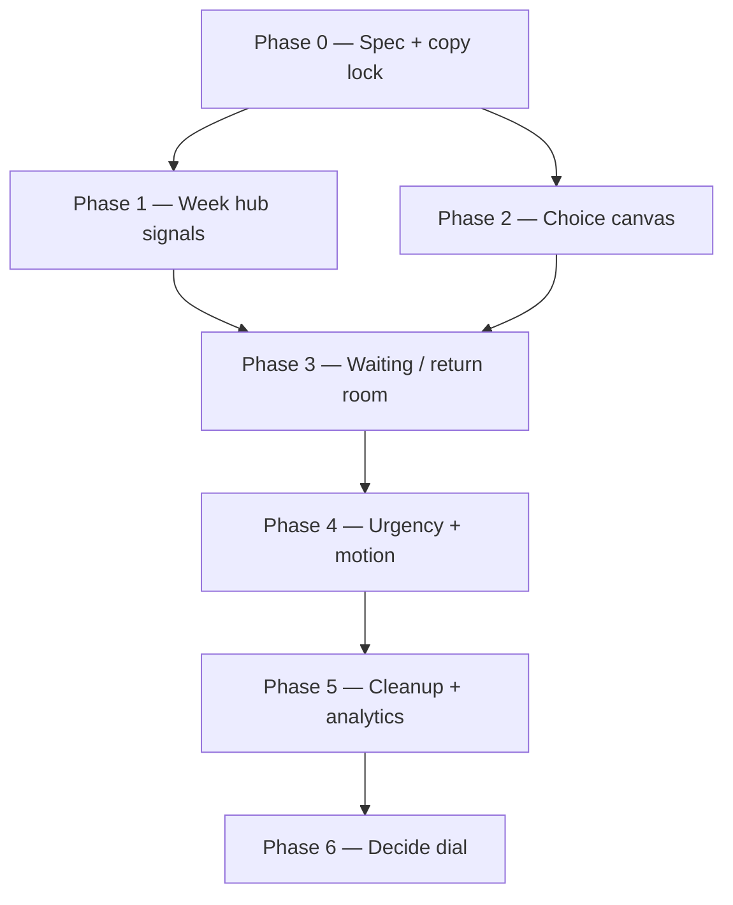
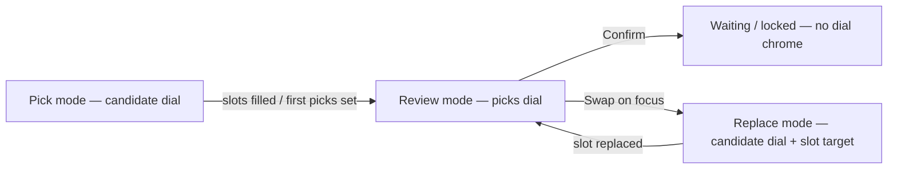

## How to use this document

This plan **extends** the [crew social plan](/strategy/just-go-crew-social-plan) group-judgement contract and **revises** the decide UX locked in the [crew Week experience plan](/strategy/just-go-crew-mobile-experience-plan) (Phase 9 pager).

Backend mechanics (updated): swipes → quorum → top-3 shortlist → Borda rank → tally auto-locks. Decide UX surfaces balloting urgency, peer progress, ballot deadline, and lock celebration — not confirm/swap.

Work phases **in order**. Steps within a phase may parallelize when noted. For agents: when a step is complete, update the [Task status ledger](#task-status-ledger) in the same PR.

### Related docs

- [Just Go — crew social plan](/strategy/just-go-crew-social-plan) — judgement UX contract (quorum, Borda ballot, auto-lock)
- [Just Go — crew Week experience (mobile)](/strategy/just-go-crew-mobile-experience-plan) — ritual shell; decide pager marked done (superseded for primary UX by this plan)
- [Pivot ritual deprecation ticket](/strategy/pivot-ritual-deprecation-ticket) — legacy judgement sheet cleanup

---

## What we’re fixing

Decide previously was a quiet chat-like panel with soft presence copy and meta chips. Users could not tell when a decision was waiting, that a timer was ticking, or what other events the crew could consider. The horizontal pager was built but unwired; live path is crew detail (`PivotCrewDecidePanel`). This rewrite lands hub signals, room choice canvas, waiting/return states, urgency + haptics + motion, and cleanup.

**North star:** decide is a **multi-open crew loop**, not a one-shot weekly pass.

```text
Week hub     → scannable per-crew return reasons (swipe debt / your move / waiting / ballot timer / locked)
Crew room    → rank shortlist (Borda) + loud people/time state (only after quorum)
Return visits → waiting for peers, ballot crunch, lock celebration
```

---

## Locked decisions

These override conflicting rows in the [crew Week experience plan](/strategy/just-go-crew-mobile-experience-plan) **for decide UX only**.

| # | Decision | Choice |
| --- | --- | --- |
| 1 | Primary decide surface | **Per-crew room** (`PivotCrewDecidePanel` / crew detail `focus: 'decide'`) — not a Week-owned horizontal pager |
| 2 | Week’s role during decide | **Hub / triage** — equal crew cards with distinct return-reason states that deep-link into the room |
| 3 | Quorum gate | **No ballot until all active members have swiped** — room shows swipe/waiting affordances before action |
| 4 | Multi-open intent | Crew decide is a **reason to reopen the app many times** (your move to rank, peer ballot progress, timer crunch, locked) — not one frictionless queue burn |
| 5 | Alternatives | Shortlist of top 3; room is a **rank composer** (reorder candidates), not confirm/swap on a single proposal |
| 6 | Timer | Visible, live countdown once `ballotEndsAt` exists; urgency intensifies near expiry; auto-tally on deadline |
| 7 | Post-ballot | Waiting room **keeps shortlist + who has ranked**; composer may hide after viewer ballots |
| 8 | Orphan pager / sheet | **Deleted** in Phase 5 — `PivotWeekCrewDecide*` + `PivotCrewJudgementSheet`; do not resurrect |
| 9 | APIs | Ritual + judgement + **`POST …/week/ballot`**; confirm/swap retired |

---

## Product model

### Quorum before action

| Crew state | Week hub | Crew room |
| --- | --- | --- |
| Awaiting quorum | Swipe debt / “waiting on X to swipe” | Progress + swipe CTA; no rank action |
| Balloting, viewer hasn’t ranked | **Your move** | Rank shortlist (Borda) |
| Viewer ranked, peers pending | Waiting on names + tally | Waiting room |
| Ballot timer active | Countdown on card | Large countdown in room |
| Locked | Locked badge + event | Celebration / locked pick |

Crews unlock decide **asynchronously**. A Week “decide all crews now” pass is wrong because quorum and ballot windows are per-crew and staggered.

### Multi-open loop (intended visits)

| Visit | Trigger | Hub signal | Room job |
| --- | --- | --- | --- |
| 1 | Drop / unfinished swipes | Swipe debt | Swipe or wait on quorum |
| 2 | Quorum → balloting | Your move | Rank top 3 |
| 3 | You ranked; peers haven’t | Waiting on … | Keep shortlist; see who’s left |
| 4 | Timer crunch or lock | Loud countdown / locked | Final urgency or celebration |

---

## Current code anchors

| Area | Path |
| --- | --- |
| Live decide room | `Meridian-Mobile/src/pivot/components/PivotCrewDecidePanel.tsx` |
| Week crew card | `Meridian-Mobile/src/pivot/components/PivotCrewWeekSection.tsx` |
| Hub state model | `Meridian-Mobile/src/pivot/utils/pivotCrewHubState.ts` |
| Week shell | `Meridian-Mobile/src/pivot/screens/PivotWeekScreen.tsx` |
| Stage resolver | `Meridian-Mobile/src/pivot/utils/pivotWeekDecideSheet.ts` |
| Countdown | `Meridian-Mobile/src/pivot/utils/pivotWeekDecide.ts` + `hooks/usePivotConsensusCountdown.ts` |
| Presence copy | `Meridian-Mobile/src/pivot/utils/pivotCrewPresence.ts` |
| Copy | `Meridian-Mobile/src/pivot/copy/pivotCopy.ts` |
| Quorum / queue | `Meridian/backend/utilities/pivotCrewDecideQueue.js` |
| Consensus timer | `Meridian/backend/utilities/pivotCrewConsensus.js` |

---

## Execution order



Phases 1 and 2 may run in parallel after Phase 0. Phase 3 needs both hub states and room choice layout. Phase 4 needs stable layout. Phase 5 last. Phase 6 revamps the actionable room (supersedes Phase 2 peer-card picking).

---

## Phase 0 — Spec, copy, and state taxonomy

**Status:** `done`

**Goal:** Lock the hub/room state machine and copy so implementation doesn’t reintroduce “lock in” / “locks in” collisions or pager assumptions.

### Step 0.1 — Hub state taxonomy

**Ship:** Document the exhaustive Week card states and priority when multiple apply (e.g. new pick > your move > waiting > timer-only).

**Status:** `done`

#### Primary hub states

Each Week crew card resolves to **exactly one** primary `hubState`. `timer_active` is an **overlay** (not a primary) except the rare `timer_only` fallback below.

| `hubState` | Meaning | Hub job |
| --- | --- | --- |
| `locked` | Crew pick settled (`confirmed` / legacy `swapped`) | Badge + event; no decide CTA |
| `your_move` | Quorum met; `balloting`; window open; viewer has not ranked | Primary actionable card; rank CTA |
| `waiting_on_crew` | Viewer has balloted; peers still pending | Waiting on names + tally; countdown if timer overlay |
| `quorum_waiting` | Swipe quorum not met | Swipe debt / “waiting on X to swipe”; no ballot CTA |
| `timer_only` | Consensus `endsAt` present but none of the above primaries match | Show countdown only (edge / degraded); prefer fixing derivation gaps over relying on this |

**Flavors (not separate primaries):**

| Flavor | Attaches to | Signal |
| --- | --- | --- |
| `split` | `your_move` / `new_pick` / `waiting_on_crew` | `judgementStatus === 'split'` — room shows two peer options; hub may note split in secondary line |
| Viewer swipe debt | `quorum_waiting` | Viewer’s ritual member row `swiped === false` → “keep swiping” / debt |
| Peer swipe wait | `quorum_waiting` | Viewer done; `swipedCount < activeCount` → “waiting on {names} to swipe” |
| Window closed | otherwise would be `your_move` / `new_pick` | `judgementWindowOpen === false` → no CTA; treat as non-actionable soft state (still not quorum/locked) until lock or reopen logic elsewhere |

#### Priority rules

Evaluate **top-down**; first match wins as primary. Overlay is computed independently.

```text
1. locked
2. new_pick          // specialized your-move after swap / cleared confirms
3. your_move         // needsUserAction + open consensus + not confirmed on current
4. waiting_on_crew   // viewerHasConfirmedCurrent
5. quorum_waiting    // awaiting_quorum / !quorumMet
6. timer_only        // endsAt present, nothing else matched
```

**Overlay:** `timer_active = !locked && Boolean(consensus.effectiveEndsAt ?? consensus.endsAt)`.

- Overlay may combine with `new_pick`, `your_move`, and `waiting_on_crew`.
- Do **not** promote overlay over an actionable primary.
- Near-expiry intensifies presentation in later phases; it does not change priority order.

**Multi-crew Week header / blob (for Step 1.3):** among crews, prefer the most urgent **actionable** primary: `new_pick` > `your_move` > `quorum_waiting` (viewer debt) > `waiting_on_crew` / peer quorum wait > `locked`. Use shortest live countdown as a tie-break only among equal primaries.

#### Field mapping (`judgementStatus` + `consensus`)

Sources: ritual crew card (`PivotRitualCrew.judgement` + `swipeProgress`) and optional judgements-poll `consensus` override (`PivotCrewConsensusSummary`). Open consensus statuses = `proposed` \| `split` \| `deciding`. Locked statuses = `confirmed` \| `swapped`.

| `hubState` | Match conditions (all required unless noted) |
| --- | --- |
| `locked` | `judgementStatus ∈ {confirmed, swapped}` **or** `locked === true` |
| `new_pick` | Open consensus; not locked; `viewerHasConfirmedCurrent !== true`; `needsUserAction === true` (or window open + can act); **and** new-pick heuristic (below) |
| `your_move` | Open consensus; not locked; not `new_pick`; `viewerHasConfirmedCurrent !== true`; `needsUserAction === true` **or** (`judgementWindowOpen && consensus.canConfirm !== false`) |
| `waiting_on_crew` | Open consensus; not locked; `viewerHasConfirmedCurrent === true` |
| `quorum_waiting` | `judgementStatus === 'awaiting_quorum'` **or** `quorumMet === false` / `swipeProgress.quorumMet === false` |
| `timer_only` | `timer_active` overlay true; no other primary matched |

**New-pick heuristic (today’s client pattern — no first-class flag):**

```text
viewerAction == null
&& judgementStatus === 'deciding'
&& confirms.members.some(m => m.action === 'swapped')
```

Swapper themselves lands in `waiting_on_crew` (`viewerHasConfirmedCurrent` after swap onto the new pick). Peers who had confirmed the old pick see confirms cleared → `viewerAction == null` + peer `swapped` row → `new_pick`.

**Useful fields by concern:**

| Concern | Fields |
| --- | --- |
| Quorum / swipe debt | `judgementStatus`, `quorumMet`, `swipedCount`, `activeCount`, `swipeProgress.members[].swiped` |
| Actionability | `needsUserAction`, `judgementWindowOpen`, `consensus.canConfirm`, `consensus.canSwap`, `consensus.swapsRemaining` |
| Viewer posture | `consensus.viewerHasConfirmedCurrent`, `consensus.viewerAction` |
| Tally / waiting names | `consensus.confirms.{confirmedCount,activeCount,members}`, ritual active members not in confirms |
| Timer overlay | `consensus.effectiveEndsAt` ?? `consensus.endsAt` (hard cap also in `judgementWindowEndsAt`) |
| Proposal preview | `proposed` / `proposedEvent`, `runnerUp` |
| Terminal | `locked`, `lockReason`, `judgementStatus` ∈ locked set, `event` / `eventId` |

**Room stage vs hub state:** `resolveDecideSheetStage` collapses to `propose` \| `waiting` \| `locked`. Hub needs the finer `hubState` above; room can keep stage + read `hubState` / new-pick for banners.

#### Gaps

| Gap | Impact | Suggested follow-up |
| --- | --- | --- |
| No API `hubState` (or `consensus.newPick`) | Client re-derives; easy to drift from room banner | Prefer pure client helper in Phase 1; add server field only if heuristic proves flaky |
| New-pick needs `confirms.members` | Ritual payload sometimes omits rich confirms without judgements poll | Ensure Week hub always has confirms members (poll or ritual enrich) before shipping 1.1 accents |
| `needsUserAction` alone cannot distinguish `your_move` vs `new_pick` | Accent / copy wrong if heuristic skipped | Keep heuristic or add `newPick: boolean` on consensus |
| Window-closed open consensus | Not in minimum state list | Soft non-CTA presentation; don’t show Lock in |
| `timer_only` should be rare | If common, derivation bug | Log / assert in tests when primary falls through to timer-only |
| Split not a hub primary | OK — flavor on your-move / new-pick | Secondary line / room canvas handles split |

**Done when:**

- [x] Taxonomy written in this plan (or linked design note) with priority rules
- [x] Mapped to existing `judgementStatus` + `consensus` fields; gaps listed

### Step 0.2 — Copy lock

**Ship:** Distinct verbs for user action vs auto-timeout vs waiting.

**Status:** `done`

| Concept | Locked string | Key |
| --- | --- | --- |
| User confirm CTA | **we're going** | `crew.confirmCta` (canonical); `crew.week.lockInCta` deprecated alias of same string |
| Auto-timeout | **auto-picks in {time}** | `crew.consensusAutoPicksIn(label)` — `consensusLocksIn` deprecated alias |
| Timer not started | **timer starts when someone chooses** | `crew.consensusTimerPending` |
| Swap CTA | **pick {runner-up name}** (+ `· N left`) | `crew.swapCtaNamed` / `swapCtaNamedWithBudget`; blind `swapCta*` only as fallback |
| Swap exhausted | **no swaps left** | `crew.swapBudgetEmpty` |
| Waiting (named) | **waiting on {who}…** (≤3 names) | `crew.profile.presenceWaitingOn` |
| Waiting (fallback) | **waiting on your {crew}…** | `crew.consensusWaitingOnCrew` / `crew.week.waitingOnCrew` |
| Waiting room (viewer acted) | **you're in — waiting on {who}…** | `crew.consensusYoureIn` / `consensusYoureInCrew` |
| New pick | **new pick — your move** | `crew.consensusNewPick` / `crew.profile.presenceNewPick` |
| Locked outcome | **locked in** | `crew.week.lockedBadge` / `crew.consensusLocked` (settled badge only — not a CTA/countdown verb) |
| Peer confirm beat | **{name} is going** / **you're going** | `crew.profile.threadLockedIn` / `threadYouLockedIn` |

**Verb rule:** confirm CTA uses **going**; countdown uses **auto-picks**; never share **lock** between those two surfaces. Settled badge may still say “locked in”.

#### Hub keys (`PivotCrewWeekSection` / Week blob)

| Concern | Keys |
| --- | --- |
| Your-move CTA | `crew.confirmCta` |
| Primary status | `crew.profile.presenceYourMove`, `presenceKeepSwiping`, `presenceWaitingOn`, `presenceNewPick` |
| Quorum progress | `crew.week.progressLabel` |
| Tally | `crew.week.consensusTallyLabel` / `crew.consensusWaiting` |
| Countdown | `crew.consensusAutoPicksIn` |
| Locked | `crew.week.lockedBadge` |
| Header / blob | `crew.week.ritualHeader.*` (honesty pass in 1.3 may retarget body to actionable hub copy) |

#### Room keys (`PivotCrewDecidePanel`)

| Concern | Keys |
| --- | --- |
| Confirm / swap | `crew.confirmCta`, `swapCtaNamed*`, `swapBudgetEmpty` |
| Status / new pick | `crew.consensusNewPick`, presence + waiting keys above |
| Countdown | `crew.consensusAutoPicksIn`, `consensusTimerPending` |
| Waiting room | `crew.consensusYoureIn*`, `presenceWaitingOn` |
| Split | `crew.splitSubtitle` |
| Locked | `crew.week.lockedBadge` |

**Done when:**

- [x] `PIVOT_COPY` keys listed for hub + room
- [x] No shared verb between CTA and countdown

### Step 0.3 — Doc delta

**Ship:** Note in [crew Week experience plan](/strategy/just-go-crew-mobile-experience-plan) that Phase 9 pager is **not** the primary decide UX; point here.

**Status:** `done`

**Upstream deltas:**

- Week experience plan locked decision **#4** and Phase 9 note: pager shipped but **not** primary; points here for hub + room
- Social plan ownership note: mechanics stay there; decide **surfaces** owned here; ritual shell stays on Week experience plan
- Mintlify nav includes this plan

**Done when:**

- [x] Cross-link + locked-decision delta added
- [x] Social plan still owns judgement mechanics; this plan owns mobile surfaces

---

## Phase 1 — Week hub signals

**Status:** `done`

**Goal:** Opening Week makes return reasons obvious without entering a crew. Deep-link still opens the room for the actual decision.

### Step 1.1 — Card state presentation

**Ship:** Rework `PivotCrewWeekSection` so each state has a distinct visual treatment (not only muted presence text):

- Primary status line (your move / waiting on X / …)
- Secondary: event name and/or countdown
- CTA only when `your_move` / `new_pick` (and window open + `needsUserAction`)
- Optional accent treatment for `new_pick` and final-window timer

**Status:** `done`

**Implementation:** `resolvePivotCrewHubState` / `resolvePivotCrewHubCardModel` in `pivotCrewHubState.ts`; `PivotCrewWeekSection` renders status + secondary + accent border + confirm CTA from that model.

**Done when:**

- [x] Squint test: pending your-move crew is obvious among N cards
- [x] Quorum-waiting never shows Lock in / confirm CTA
- [x] Accessibility label includes state + event/countdown

### Step 1.2 — Live hub countdown

**Ship:** Hub countdown ticks at a useful cadence (≤1s when &lt;15m remaining; ≤30s otherwise is OK for long windows). Prefer shared hook with the room.

**Status:** `done`

**Implementation:** `usePivotConsensusCountdown` + `resolveConsensusCountdownTickMs` (`adaptive` hub/blob, `live` room). Hub card secondary/status already surface `auto-picks in {time}` via hub model when `endsAt` exists.

**Done when:**

- [x] Countdown visible on card when `endsAt` exists and not locked
- [x] Near-expiry cards don’t sit stale for half a minute

### Step 1.3 — Week header / blob honesty

**Ship:** Ritual header/blob distinguishes “crews need swipes” vs “crews need your decide” vs mixed. Avoid a single vague “where’s your crew going?” when a concrete your-move exists.

**Status:** `done`

**Implementation:** `resolveMostUrgentWeekHubSignal` ranks crews (`new_pick` > `your_move` > viewer swipe debt > waiting > peer quorum wait > timer > locked; shortest `endsAt` tie-break). `resolvePrimaryWeekBlobBody` consumes that signal so Week blob copy stays concrete.

**Done when:**

- [x] Blob/header copy matrix covered by unit tests in `pivotWeekDropDashboard` (or successor)
- [x] Multi-crew: prefer most urgent actionable state

### Step 1.4 — Deep-link entry

**Ship:** Hub CTA and card press open crew detail with `focus: 'decide'` when state is decide-related; quorum-waiting may focus swipe / people as appropriate.

**Status:** `done`

**Implementation:** `resolvePivotHubCrewEntry` maps hub state → `focus: 'decide' | 'people'`. Week card press + confirm CTA navigate via that map; `decide_open` funnel events include `crewId` + `hubState` (deduped per crew).

**Done when:**

- [x] Your-move → decide room
- [x] Analytics `decide_open` still fires with useful props (crewId, state)

---

## Phase 2 — Crew room choice canvas

**Status:** `done`

**Goal:** Inside the room, the choice set is visible and swap is informed. Composer only when quorum allows action.

### Step 2.1 — Information hierarchy

**Ship:** Rebuild `PivotCrewDecidePanel` above-the-fold order:

1. Crew identity + **one** primary status
2. People progress (confirmed vs pending on faces or explicit row)
3. Countdown (when active)
4. Choice canvas (proposed ± runner-up / split pair)
5. Sticky primary / secondary actions

Demote chat-like thread beats; keep only if they add info not in the progress row.

**Status:** `done`

**Implementation:** Room header is crew name + single `resolvePivotCrewPresenceLine` (new pick / you’re-in / split / your-move — no chip soup). `resolvePivotCrewDecideProgress` + `PivotCrewDecideProgressRow` show done vs pending faces with tally caption. Live countdown is its own line when `endsAt` exists. Proposed pick stays the choice canvas slot (peer cards in 2.2). Thread beats and meta chips removed; sticky confirm/swap / swipe CTAs unchanged.

**Done when:**

- [x] “What do I do now?” answered without scrolling on a standard phone
- [x] Chip soup removed or reduced to ≤1 non-essential chip

### Step 2.2 — Proposed + runner-up peer cards

**Ship:** Render `proposedEvent` and `runnerUp` as peer cards. On `split`, show top two from breakdown / candidates as peers with “split — pick one” framing.

**Status:** `done`

**Implementation:** `resolvePivotCrewDecideChoiceOptions` builds the canvas set (proposed + runner-up; on split, top two `voteBreakdown` events as equal `split` peers). `PivotCrewDecidePeerCard` renders equal side-by-side peers (image, name, when/where) or a full locked/solo card. Primary status already carries `splitSubtitle`; taps open event detail.

**Done when:**

- [x] Runner-up name, image, and key meta visible before swap
- [x] Split shows two equal options (not one hero + chip)
- [x] Tapping a card opens event detail

### Step 2.3 — Informed swap + confirm CTAs

**Ship:**

- Primary: confirm current proposal (copy from 0.2)
- Secondary: swap targeting runner-up by name; show remaining shared budget
- Hide both when `awaiting_quorum` or viewer already confirmed on current pick
- Empty swap budget: show disabled/exhausted state (don’t silently omit)

**Status:** `done`

**Implementation:** `resolvePivotCrewDecideActions` drives the sticky bar — `we're going` + `pick {runner-up} · N left` (never blind `pick another`). Hidden on quorum / waiting / locked. Window-closed and `canConfirm === false` keep CTAs visible but disabled. `swapsRemaining <= 0` shows disabled `no swaps left`. Confirm/swap still POST via existing helpers.

**Done when:**

- [x] Blind “pick another · N left” gone
- [x] Confirm/swap still use existing POSTs
- [x] `canConfirm` / window-closed disabled states clear

### Step 2.4 — Vote breakdown on options

**Ship:** Attach voter avatars to each option card (from `voteBreakdown`), not a separate list that disappears after confirm.

**Status:** `done`

**Implementation:** `resolvePivotCrewDecideChoiceOptions` attaches per-option `voters` from `voteBreakdown.memberVotes`. `PivotCrewDecidePeerCard` renders an avatar pile on each option. Shown in propose **and** waiting (hidden on locked). Invited roster members render in a labeled row under the canvas via `resolvePivotCrewDecideInvitedMembers` — not on option tallies.

**Done when:**

- [x] Breakdown visible in propose **and** waiting stages
- [x] Invited members labeled invited; don’t affect tallies

---

## Phase 3 — Waiting / return room

**Status:** `done`

**Goal:** After the viewer acts, the room still explains the world — and swap/new-pick invites the next open.

### Step 3.1 — Waiting room persistence

**Ship:** On `waiting` stage, keep proposal (and runner-up context), people pending/confirmed, and countdown. Hide or replace composer with non-destructive status (“you’re in — waiting on …”).

**Status:** `done`

**Implementation:** `resolvePivotCrewDecideWaitingStatus` / pending-name helpers in `pivotCrewDecideWaiting.ts`. Room keeps peer choice canvas + vote breakdown + progress + countdown on `waiting`; sticky composer is replaced with non-destructive “you’re in — waiting on {names}…” (≤3 names). Presence line shares the same naming. Ritual members fall back when roster is empty so people context doesn’t drop.

**Done when:**

- [x] Waiting never feels like an empty / ended screen
- [x] Pending members named when possible

### Step 3.2 — New pick / re-decide

**Ship:** When proposal changes or viewer’s confirm was cleared by swap, hub + room show **new pick** and re-arm actions.

**Status:** `done`

**Implementation:** Shared `isPivotCrewNewPick` / `resolvePivotCrewDecideNewPick` in `pivotCrewNewPick.ts` (hub + room). Room renders burst scrapbook banner for `consensusNewPick`; confirm/swap re-arm with `actions.newPick` after peer swap clears viewer confirm. Hub still accents `new_pick` via shared heuristic.

**Done when:**

- [x] Existing `consensusNewPick` (or successor) is unmistakable
- [x] Re-confirm / re-swap path tested

### Step 3.3 — Locked outcome

**Ship:** Locked stage is a clear celebration/settled state: significant pick treatment, who’s going, no stale CTAs.

**Status:** `done`

**Implementation:** `resolvePivotCrewDecideLockedOutcome` + progress `going` mode. Room shows accent “locked in” badge (≠ waiting sticky / new-pick burst), significant solo pick card (scrapbook title), all active faces done with who’s-going caption, no confirm/swap or countdown. Event detail remains via card tap (fallback when choice options empty).

**Done when:**

- [x] Locked ≠ waiting visually
- [x] Path to event detail still works

---

## Phase 4 — Urgency, motion, and haptics

**Status:** `done`

**Goal:** Decide has ritual weight comparable to the deck — without turning Week into a decide takeover.

### Step 4.1 — Countdown urgency

**Ship:** Room countdown is large and live (1s tick). Visual intensity steps (e.g. &gt;1h calm, &lt;15m attention, &lt;5m critical). Copy uses auto-pick language from 0.2.

**Status:** `done`

**Implementation:** `resolveConsensusCountdownUrgency` (`calm` &gt;15m / `attention` ≤15m / `critical` ≤5m) + `resolvePivotCrewDecideCountdown` for room presentation. Room uses live 1s cadence; heading scales by tier (critical scrapbook chip). Missing `endsAt` shows `consensusTimerPending` — no fake clock.

**Done when:**

- [x] Timer readable at a glance in the room
- [x] Missing `endsAt` (pre-first-action) doesn’t fake a clock — show “timer starts when someone locks/chooses” or equivalent

### Step 4.2 — Haptics

**Ship:** Light impact on confirm; success/notification pattern on lock; distinct feedback on swap; optional warning tick in final window (rate-limited).

**Status:** `done`

**Implementation:** `pivotCrewDecideHaptics` — Light confirm, Medium swap, Success on propose/waiting → locked, Warning once per `endsAt` in final window. Wired in `PivotCrewDecidePanel`; gates block cold-open and poll re-fires.

**Done when:**

- [x] Confirm/swap/lock produce haptics on supported devices
- [x] No haptics spam on poll refreshes

### Step 4.3 — Motion

**Ship:** Short, intentional transitions:

- Confirm → waiting room (progress advance on avatars)
- Swap → crossfade/replace proposal cards + confirm reset
- Lock → settled/celebration beat

Prefer existing motion primitives if the app has them; don’t add a heavy animation system.

**Status:** `done`

**Implementation:** `pivotCrewDecideMotion` + room `motionBeat`/`motionNonce`. Confirm pops done rings + fades waiting status; swap remount-fades choice canvas; lock Zooms badge + fades significant pick. Keys stay stable on polls; Reanimated respects system reduce-motion.

**Done when:**

- [x] At least confirm, swap, and lock have a visible transition
- [x] Reduced-motion / busy states don’t jank the poll loop

---

## Phase 5 — Cleanup, analytics, and docs

**Status:** `done`

**Goal:** One canonical path; docs and metrics match hub + room.

### Step 5.1 — Remove or quarantine orphans

**Ship:** Delete or clearly `@deprecated` and unexport:

- `PivotWeekCrewDecide` / `PivotWeekCrewDecidePage`
- `PivotCrewJudgementSheet` (if not already covered by deprecation ticket)

Keep shared helpers (`formatConsensusCountdown`, merge helpers) if still used.

**Status:** `done`

**Implementation:** Deleted `PivotWeekCrewDecide`, `PivotWeekCrewDecidePage`, and `PivotCrewJudgementSheet`. Removed pager-only helpers from `pivotWeekDecide.ts`; kept countdown/urgency helpers. Deprecation ticket notes the delete; `fetchPivotCrewWeekJudgement` stays for the live room.

**Done when:**

- [x] No dead decide UI mounted or imported from Week
- [x] Deprecation ticket updated

### Step 5.2 — Analytics

**Ship:**

- Fire `decide_complete` (or successor) when viewer finishes their action or crew locks — today funnel step exists but isn’t fired from live screens
- Hub/room events carry `hubState` / `judgementStatus`
- Confirm/swap events unchanged in name where possible; enrich props

**Status:** `done`

**Implementation:** Room fires `decide_open` (deduped with hub) + `decide_complete` on confirm or propose/waiting→locked (`completeReason`). Confirm/swap carry `hubState` + `judgementStatus`. Funnel decide steps are per-`crewId`.

**Done when:**

- [x] Funnel can distinguish hub open → room open → confirm/swap → lock
- [x] Tests or analytics fixtures updated

### Step 5.3 — Doc + experience-plan alignment

**Ship:** Update Week experience plan locked decision #4 and Phase 9 notes; keep social plan mechanics as source of truth.

**Status:** `done`

**Implementation:** Experience plan #4 + Phase 9 mark pager deleted; runbook funnel/manual steps use hub + room; social plan still owns mechanics.

**Done when:**

- [x] No doc claims pager is primary decide UX
- [x] This plan’s locked decisions reflected upstream

---

## Phase 6 — Decide dial (actionable room revamp)

**Status:** `done`

**Goal:** Make the **your-move / new-pick** room visually and interactionally distinct from waiting and locked. Center attention on candidate events via a horizontal dial; support multi-slot picks with a clear pick → confirm/swap → replace loop.

Phases 2–3 peer-card canvas and named “pick {runner-up}” secondary CTA are **superseded for the actionable room** by this phase. Hub signals, quorum gate, timer, waiting/locked persistence, and confirm/swap POSTs stay unless a field gap blocks multi-slot UI.

### North star layout (actionable only)

```text
┌─────────────────────────────────────┐
│  Slots (small)  [·] [·] …           │  ← empties until picks exist
├─────────────────────────────────────┤
│         ◀  dial carousel  ▶         │  ← focused = middle card
│      [rec]  FOCUSED  [alt] …        │  ← recommended flagged top-right
├─────────────────────────────────────┤
│     [ Pick / Swap focused ]         │  ← verb depends on mode
│     [ Confirm all picks ]           │  ← subsequent users only
└─────────────────────────────────────┘
```

Waiting and locked keep their quieter settled treatment (Phase 3). They must **not** reuse the dial’s “action required” chrome.

### Locked decisions (Phase 6)

| # | Decision | Choice |
| --- | --- | --- |
| D1 | Actionable visual mode | Distinct surface from waiting/locked — louder chrome, dial-forward hierarchy, clear “your move” posture |
| D2 | Primary picker | Horizontal **dial** (carousel): one focused middle event; snap on turn; action applies to focus |
| D3 | Dial contents (first pick) | Recommended candidate centered by default + other high-vote candidates; recommended gets a **flag** (top-right) |
| D4 | First actor verb | Sticky action on focus = **Pick** (fills next empty slot / establishes picks) |
| D5 | Subsequent actor | Dial shows **current picks only**; primary crew action = **Confirm**; focus action = **Swap** |
| D6 | Swap path | Enter same candidate dial as first pick, but slots are occupied; user turns dial, then chooses **which slot to replace** |
| D7 | Slots strip | Small top strip of all pick slots; populates as picks land; enables multi-pick at a glance |
| D8 | Focus rule | CTAs always bind to the **currently focused** middle dial item (never a side peek) |

### Modes

| Mode | Who / when | Dial items | Slots | Actions |
| --- | --- | --- | --- | --- |
| **Pick** | First actor after quorum (no picks yet, or establishing set) | Recommended + high-vote candidates | Empty → fill on Pick | **Pick** focused → slot |
| **Review** | Later actors; picks already exist | **Picked events only** | Filled | **Confirm** (all) · **Swap** (focused) |
| **Replace** | After Swap from Review | Same candidate set as Pick | Occupied; user selects target slot | Confirm replace of chosen slot with focused candidate |



### Information hierarchy (actionable room)

1. **Slots strip** (compact) — capacity + filled picks  
2. **Dial** — hero; recommended flag on the system suggestion; vote/people meta on cards as needed  
3. **People / timer** — secondary to the dial (keep, but don’t compete)  
4. **Sticky actions** — Pick *or* Confirm + Swap, always scoped to focus / mode above  

Demote side-by-side peer cards and blind “pick another” from the actionable path.

### Step 6.1 — Dial / slots spec + copy lock

**Ship:** Lock slot capacity, candidate ranking, empty/partial rules, and dial-mode copy so 6.2–6.4 don’t invent conflicting behavior.

**Status:** `done`

#### Slot capacity

| Knob | Value | Notes |
| --- | --- | --- |
| `maxPickSlots` | **1–2** (crew / tenant) | Group-configurable; default `judgement.maxPickSlots = 1`; crew override via `PATCH …/settings` |
| `apiSupportedSlots` | **= maxPickSlots** | Judgement returns `proposedEvents[]` + confirm/swap accept multi-slot writes |
| `visibleSlotCount` | `maxPickSlots` | Strip always shows full capacity (empties included) |
| `actionableSlotCount` | `maxPickSlots` | All visible slots are fillable for the open week’s frozen capacity |

**Ship:** dial + strip capacity follows judgement `maxPickSlots`. Owners set 1 vs 2 in the people sheet. See **Step 6.7**.

#### Candidate ranking (Pick / Replace dial)

Build an ordered candidate list for the dial. **Recommended** is always the default center focus and gets the top-right flag.

| Priority | Source | Role |
| --- | --- | --- |
| 1 | `proposedEvent` if set, else `voteBreakdown[0].event` | **Recommended** (`recommended: true`) |
| 2 | Remaining `voteBreakdown` entries sorted by `score` desc, then `(registeredCount + interestedCount)` desc | High-vote peers |
| 3 | `runnerUp` if present and not already in the list | Ensure swap target is dialable |

**Caps / filters:**

| Rule | Choice |
| --- | --- |
| Max dial items | **5** |
| Min dial items | **1** (recommended only — thin breakdown) |
| Dedupe | By `eventId`; first wins |
| Already slotted | **Exclude** from Pick / Replace dial (no no-op self-pick) |
| Recommended excluded | If recommended is slotted/missing, flag the **first remaining** dial peer as `recommended` |
| Split | Top two from breakdown are both on the dial; flag still on score leader (recommended); keep `splitSubtitle` in status line |
| Locked / waiting | No candidate dial (Phase 3 surfaces) |

Helper target for 6.2+: `resolvePivotCrewDecideDialCandidates` in `pivotCrewDecideDial.ts` (constants + pure ranking).

#### Empty / partial slot rules

| Situation | Rule |
| --- | --- |
| Initial Pick mode | All slots empty; dial = candidates; recommended centered |
| Pick action | Fills **next empty actionable** slot left → right with focused event |
| Duplicate | Cannot Pick an event already in a slot (excluded from dial) |
| Partial fill | **≥1** filled slot is enough to leave Pick; trailing empties allowed |
| Leave Pick early | Sticky **done** appears once ≥1 slot filled; advances first actor into the confirm posture / peers into Review |
| All actionable slots full | Auto-leave Pick (same as done) |
| Review dial | **Filled slots only** (empties omitted from dial; still visible as empties in strip) |
| Replace entry | From Review **Swap** on focused pick; enter Replace with that slot pre-selected as replace target (user may change target by tapping another filled slot) |
| Replace commit | Focused candidate overwrites the selected filled slot; then return to Review |
| Replace cancel | Back to Review; slots unchanged |
| Disabled extra slots (v1) | Visible, non-interactive, not selectable as replace targets |
| Waiting / locked | Slots strip may show settled pick(s); no dial chrome |

#### Mode entry (actionable room)

| Mode | Enter when |
| --- | --- |
| **Pick** | Quorum met; window open; viewer must act; **no filled slots yet** (or first actor still establishing before done) |
| **Review** | ≥1 slot filled; viewer has not confirmed current set **or** is re-deciding after new pick with picks present |
| **Replace** | Viewer chose Swap on a focused Review pick |
| *(non-dial)* | `waiting` / `locked` / `quorum_waiting` — unchanged |

When today’s API only has a system `proposedEvent` and no viewer action yet: treat proposed as **recommended on the dial**, slots still **empty** until the viewer Picks (explicit action — no auto-fill). After Pick of recommended (or another candidate), slot 0 fills and the existing confirm/swap POSTs apply per 6.5 mapping.

#### Copy lock (dial modes)

Verb rule from 0.2 still holds: confirm = **going**; countdown = **auto-picks**. Dial adds **pick** / **swap** / **use** without reusing lock verbs.

| Concept | Locked string | Key |
| --- | --- | --- |
| Pick focused (fallback) | **pick** | `crew.dial.pickCta` |
| Pick focused (named) | **pick {name}** (legacy; dial uses plain **pick**) | `crew.dial.pickCtaNamed` |
| Done picking (partial OK) | **done** | `crew.dial.donePickingCta` |
| Confirm set (Review) | **we're going** | `crew.confirmCta` (reuse) |
| Swap focused (fallback) | **swap this** | `crew.dial.swapCta` |
| Swap focused (named) | **swap {name}** | `crew.dial.swapCtaNamed` |
| Swap + budget | **swap {name} · N left** | `crew.dial.swapCtaNamedWithBudget` |
| Swap exhausted | **no swaps left** | `crew.swapBudgetEmpty` (reuse) |
| Replace commit (fallback) | **use this** | `crew.dial.replaceCta` |
| Replace commit (named) | **use {name}** | `crew.dial.replaceCtaNamed` |
| Replace choose slot | **replace which?** | `crew.dial.replaceChooseSlot` |
| Recommended flag | **top pick** | `crew.dial.recommendedFlag` |
| Slots a11y | **picks** | `crew.dial.slotsLabel` |
| Empty slot a11y | **empty slot** | `crew.dial.emptySlotLabel` |

**Deprecate on dial path:** `crew.swapCtaNamed` / “pick {runner-up}” as the secondary CTA — Replace + focus replaces informed runner-up naming. Keep old keys for hub/fallback until 6.4 deletes the peer-card actions.

**Done when:**

- [x] Slot capacity + v1 `apiSupportedSlots` gap written
- [x] Candidate ranking + caps/filters written
- [x] Empty / partial / Replace target rules written
- [x] Dial copy keys locked; added to `PIVOT_COPY.crew.dial`

### Step 6.2 — Dial carousel component

**Ship:** Horizontal snap dial with center focus, recommended top-right flag, and snap haptics. Not yet wired into `PivotCrewDecidePanel` (6.4).

**Status:** `done`

**Implementation:**

| Piece | Path |
| --- | --- |
| Dial UI | `PivotCrewDecideDial` — center-padded `FlatList`, `snapToInterval`, peek scale/opacity, tap-peek to recenter |
| Recommended flag | Top-right scrapbook chip — `PIVOT_COPY.crew.dial.recommendedFlag` (“top pick”) |
| Snap haptic | `playPivotCrewDecideDialSnapHaptic` (`selectionAsync`) on user snap / peek-tap recenter; skipped on programmatic jumps |
| Focus helpers | `resolvePivotCrewDecideDialFocusIndex`, `resolvePivotCrewDecideDialIndexFromOffset`, card/item/side-padding sizing in `pivotCrewDecideDial.ts` |

**Props contract:** `candidates` + optional controlled `focusedEventId` / `onFocusedChange` / `onPressEvent` (detail only when already focused).

**Done when:**

- [x] Dial snaps one event to center; side peers peek
- [x] Recommended defaults to center with top-right flag
- [x] Snap produces haptic; list identity / controlled focus jumps do not spam haptics
- [x] Focus index helpers covered by unit tests

### Step 6.3 — Slots strip

**Ship:** Compact top strip of all pick slots (empty → filled), plus Replace-mode target selection. Not yet wired into `PivotCrewDecidePanel` (6.4).

**Status:** `done`

**Implementation:**

| Piece | Path |
| --- | --- |
| Slot model | `pivotCrewDecideSlots.ts` — `resolvePivotCrewDecideSlots`, `fillNextPivotCrewDecideSlot`, `replacePivotCrewDecideSlot`, replace-target + Review dial helpers |
| Strip UI | `PivotCrewDecideSlotsStrip` — thumbs for filled, dashed empties, muted disabled (v1 slot 1), accent selected replace target |
| Replace hint | `PIVOT_COPY.crew.dial.replaceChooseSlot` (“replace which?”) when `replaceMode` |

**Capacity:** strip length = judgement `maxPickSlots` (1 or 2); all slots actionable.

**Done when:**

- [x] Strip always shows full capacity; empties until picks land
- [x] Multi-pick fill left → right; duplicates rejected
- [x] Replace mode selects among filled actionable slots only
- [x] Slot helpers covered by unit tests

### Step 6.4 — Wire Pick / Review / Replace in the room

**Ship:** `PivotCrewDecidePanel` uses dial + slots for actionable propose; waiting / locked keep non-dial peer/solo treatment.

**Status:** `done`

**Implementation:**

| Piece | Path |
| --- | --- |
| Mode resolver | `pivotCrewDecideMode.ts` — Pick / Review / Replace / null; seed established picks from `proposedEvent` |
| Dial CTAs | `pivotCrewDecideDialActions.ts` — Pick / Done / Confirm / Swap / Use / Back |
| Room wiring | `PivotCrewDecidePanel` — local fill state, Replace target, dial chrome above progress/timer |
| Non-dial stages | Waiting / locked: slots strip (settled) + peer/solo cards; no dial CTAs |

**API mapping (see 6.5 / 6.7):**

- Confirm focused candidate → `confirm` POST `{ eventId, eventIds? }` (establishes filled set)
- Replace commit → `swap` POST `{ eventId?, slotIndex? }`
- Seed / Review hydrates from `proposedEvents[]`

**Done when:**

- [x] First actor: empty slots + candidate dial + Pick (auto-Review when actionable slots full)
- [x] Subsequent actor: seeded Review dial of picks + Confirm / Swap
- [x] Swap enters Replace (candidate dial + slot target); Back cancels
- [x] Waiting / locked never show dial chrome

### Step 6.5 — Dial → judgement API mapping + gaps

**Ship:** Pure client map from dial CTAs onto confirm/swap contracts.

**Status:** `done` (multi-slot writes closed in **6.7**)

| Dial action | Focus | Network |
| --- | --- | --- |
| Pick / Done / Back / Swap (enter Replace) | * | Local only — no POST |
| Confirm (“we're going”) | any dial focus | `POST …/week/confirm` `{ eventId, eventIds? }` |
| Replace (“use”) | any dial focus | `POST …/week/swap` `{ eventId?, slotIndex? }` |

**Code:** `pivotCrewDecideApi.ts` — `resolvePivotCrewDecideDialNetworkIntent`; panel + `pivotCrewDecideDialActions` consume it for enablement and writes.

**Done when:**

- [x] Confirm / Replace resolve through one pure mapper
- [x] Multi-slot capacity documented (tenant/crew + week freeze) — see 6.7

### Implementation sketch

| Step | Ship | Status |
| --- | --- | --- |
| 6.1 | Spec: slot count, candidate ranking (recommended + high-vote), empty/partial slot rules, copy for Pick / Swap / Confirm / Replace | `done` |
| 6.2 | Dial component — horizontal snap carousel, center focus, recommended flag, haptics on snap | `done` |
| 6.3 | Slots strip — empty → filled; multi-pick visible; replace-target selection in Replace mode | `done` |
| 6.4 | Wire modes in `PivotCrewDecidePanel` — Pick / Review / Replace; waiting & locked stay non-dial | `done` |
| 6.5 | Map Pick / Confirm / Swap(+slot) onto judgement APIs | `done` |
| 6.6 | Motion + distinct actionable chrome vs waiting/locked; QA matrix below | `done` |
| 6.7 | Group-configurable multi-slot picks (1–2) end-to-end | `done` |
| 6.8 | Split decide room vs circle overview into distinct components | `done` |

### Step 6.7 — Group-configurable multi-slot picks

**Ship:** Crews choose 1 or 2 events per week; judgement persists `proposedEventIds[]`; dial capacity matches.

**Status:** `done`

| Layer | Behavior |
| --- | --- |
| Tenant default | `crewConfig.judgement.maxPickSlots` (1–2, default **1**) |
| Crew override | `crew.maxPickSlots` null = inherit; owner sets via `PATCH /pivot/crews/:id/settings` |
| Week freeze | `weekState.maxPickSlots` locked when judgement opens |
| Judgement GET | `maxPickSlots`, `proposedEvents[]` (+ legacy `proposedEvent` = `[0]`) |
| Confirm | `{ eventId, eventIds? }` establishes set before consensus |
| Swap | `{ eventId?, slotIndex? }` replaces a slot (omit `eventId` → next runner-up) |
| Mobile | People sheet chips (owner); panel seeds from `proposedEvents`; mapper uses judgement capacity |

**Code:** `pivotCrewPickSlots.js`, judgement/weekState services, `updatePivotCrewSettings`, `PivotCrewPeopleSheet` / detail screen, `pivotCrewDecideApi` / mode / panel.

### Step 6.6 — Actionable chrome vs waiting/locked + motion

**Ship:** Squint-test postures so actionable ≠ waiting ≠ locked; dial mode transitions animate without poll flicker.

**Status:** `done`

| Posture | When | Chrome |
| --- | --- | --- |
| **actionable** | Dial mode Pick / Review / Replace | Accent top rail; mode chip (`your move · pick/confirm`, `replace which?`); accent composer border; dial-forward |
| **waiting** | Viewer confirmed current proposal | Soft ink rail; muted sticky status on creamDeep; settled strip/peers quiet; **no** dial / mode chip |
| **locked** | Outcome settled | Pop rail; celebration badge + significant pick; settled quiet; **no** dial / CTAs |
| **quorum** | Awaiting swipe quorum | No loud rail / chip; no confirm/swap |

**Motion beats** (`pivotCrewDecideMotion`): `pick` / `confirm` / `swap` / `lock` — dial + mode chip + composer enter on intentional beats only (poll-stable keys).

**Code:** `pivotCrewDecideChrome.ts` → `testID=decide-chrome-{posture}`; copy under `crew.dial.chrome*`.

**Component split (follow-on):** actionable vs settled are separate surfaces, not posture flags in one panel:

| Surface | Component | When |
| --- | --- | --- |
| Decide room | `PivotCrewDecideRoom` | `dialMode != null` — cream shell, accent rail, dial + composer |
| Circle overview | `PivotCrewCircleOverview` | waiting / locked / quorum / idle — creamDeep wash, roster-forward, no dial |
| Switchboard | `PivotCrewDetailScreen` + `usePivotCrewJudgementRoom` | `resolvePivotCrewRoomSurface(dialMode)` |

**Done when:**

- [x] Squint test: actionable room ≠ waiting ≠ locked
- [x] Pick / Swap / Confirm / Lock beats drive dial & chrome enters
- [x] Waiting / locked never show dial “action required” chrome
- [x] Overview and decide are distinct components with differentiated styling

### Done when

- [x] Squint test: actionable room ≠ waiting ≠ locked (6.6 chrome)
- [x] First user can dial to a candidate and **Pick** the focused event into a slot
- [x] Next user sees picks on the dial, can **Confirm** or **Swap** the focused pick
- [x] Swap reopens the candidate dial with slots occupied and a clear replace target
- [x] Recommended event is default-centered with a top-right flag
- [x] Action never applies to a non-focused dial item

### Phase 6 QA

| Scenario | Expect |
| --- | --- |
| Quorum met, no picks yet | Pick mode; candidate dial; recommended centered + flagged; slots empty; actionable chrome |
| First user picks one (or N) | Slots populate; peers enter Review; pick motion |
| Second user opens room | Dial = picks only; Confirm + Swap on focus; `your move · confirm` chip |
| Second user swaps | Replace mode; candidate dial; choose slot to overwrite; swap motion |
| Waiting after confirm | Dial chrome gone; quiet sticky status; soft rail |
| Locked | Settled pick(s); celebration badge; pop rail; no dial / CTAs |
| Split / high-vote set | Dial includes the competitive candidates; no blind swap |

---

## Out of scope

| Item | Why |
| --- | --- |
| Changing quorum rules (e.g. allow decide before all swipe) | Product constraint; this plan designs around it |
| New judgement POSTs | Existing confirm/swap stay unless a field gap blocks UI (revisit only if Phase 6.5 proves multi-slot needs it) |
| Week horizontal decide pager as primary | Conflicts with multi-open + async quorum |
| Deck / recap redesign | Separate surfaces |
| Push copy rewrite beyond what’s needed for deep-link → room | Nudge infrastructure already phase-aware; tighten only if hub states need matching push |
| Dial on waiting / locked stages | Those stay quiet/settled; dial is actionable-only |

---

## QA matrix (manual)

| Scenario | Expect |
| --- | --- |
| 1 crew, awaiting quorum | Hub: swipe debt; room: no confirm/swap |
| Quorum just met, viewer hasn’t acted | Hub: your move; room: dual cards + CTAs; maybe no timer yet |
| Viewer confirms first | Timer starts; hub/room show waiting + countdown |
| Second member still pending | Named waiting; proposal still visible |
| Swap with budget | Runner-up preview; confirms clear; new pick for others |
| Swap budget 0 | Exhausted state visible |
| Split | Two peer options |
| 2+ crews, only one your-move | That card obvious; others not fake-urgent |
| Locked | Settled UI; no confirm CTA |
| Deep link `focus: 'decide'` | Lands in room with correct stage |

---

## Task status ledger

| ID | Status | Note |
| --- | --- | --- |
| 0.1 | done | Hub state taxonomy + field map + gaps |
| 0.2 | done | Copy lock — going vs auto-picks |
| 0.3 | done | Doc delta — Phase 9 pager not primary; ownership split |
| 1.1 | done | Hub card states via pivotCrewHubState |
| 1.2 | done | Shared usePivotConsensusCountdown (adaptive hub / live room) |
| 1.3 | done | Blob honesty via resolveMostUrgentWeekHubSignal |
| 1.4 | done | Hub → crew detail focus + decide_open props |
| 2.1 | done | Room hierarchy — status + progress row + countdown; chip soup / thread demoted |
| 2.2 | done | Peer choice cards — proposed + runner-up; split top-two from breakdown |
| 2.3 | done | Informed confirm/swap CTAs — named swap, exhausted state, clear disabled |
| 2.4 | done | Vote avatars on option cards; invited labeled off-tally |
| 3.1 | done | Waiting room persistence — sticky you’re-in status; keep proposal/progress/countdown |
| 3.2 | done | New pick / re-decide — shared heuristic, room banner, re-armed CTAs |
| 3.3 | done | Locked outcome — celebration badge, who’s going, significant pick |
| 4.1 | done | Countdown urgency — live tiers + pending timer copy |
| 4.2 | done | Haptics — confirm/swap/lock + once-per-endsAt final-window warn |
| 4.3 | done | Motion — confirm/swap/lock beats; poll-stable keys |
| 5.1 | done | Orphan cleanup — pager + judgement sheet deleted |
| 5.2 | done | Analytics — decide_complete + hubState/judgementStatus |
| 5.3 | done | Doc alignment — experience plan + runbook + deprecation ticket |
| 6.1 | done | Dial/slots spec + copy + ranking helper (`pivotCrewDecideDial`) |
| 6.2 | done | Dial carousel — `PivotCrewDecideDial` + snap haptic + focus helpers |
| 6.3 | done | Slots strip — `PivotCrewDecideSlotsStrip` + `pivotCrewDecideSlots` |
| 6.4 | done | Wire Pick / Review / Replace in decide panel |
| 6.5 | done | API mapping (`pivotCrewDecideApi`) |
| 6.6 | done | Actionable chrome vs waiting/locked (`pivotCrewDecideChrome`) |
| 6.7 | done | Group-configurable multi-slot picks (1–2) |
| 6.8 | done | Decide room vs circle overview component split |

Status values: `todo` · `in_progress` · `done` · `blocked`
