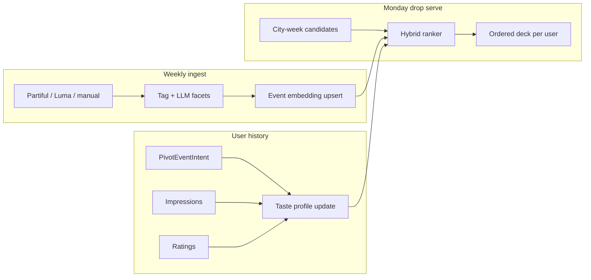

## Verdict

**The product loop is ready; the ML data plane is not — yet.** Just Go already collects the right *kinds* of signals (swipe intents, interest tags, friend graph, post-event ratings, funnel analytics) with stable IDs and a weekly batch key. That is enough to eventually train and serve embeddings-powered recommendations.

What is **not** ready today:

- No unified interaction fact table (intents and impressions live in separate stores)
- No event / user embedding storage or vector index
- Event features are still thin (18 coarse tags + free text + optional TMDB)
- Attendance ground truth is self-reported (`registered`), not verified check-in

You do **not** need to build the model yet. You *do* need a short **data-hardening phase** so that when volume arrives, historical data is joinable and label-rich enough for an evaluation period.

**Implementation plan:** [Just Go — Explore + embeddings groundwork](/strategy/just-go-explore-embeddings-plan) (phased tasks: data plane → Explore UI → soft rank → stop before vector serve).

Related: [Events marketplace pivot](/strategy/events-marketplace-pivot) (Phase 2 embeddings), [Pivot metadata contract](/strategy/pivot-metadata-contract) (v0 ranker), [Pivot MVP plan](/strategy/pivot-mvp-implementation-plan).

---

## What we have today (good foundation)

### Product loop

```text
invite → interests onboarding → weekly deck → swipe interested/pass
  → week recap → external tickets → optional "I got a ticket"
  → post-event rating → next week's deck
```

This is the correct marketplace loop for learning taste. Labels exist at every step.

### Canonical entities

| Entity | Where | Why it matters for ML |
| --- | --- | --- |
| **Event** + `customFields.pivot` | Tenant `Event` | Stable `eventId`; text + tags + host + `batchWeek` for content embeddings |
| **PivotEventIntent** | Tenant DB | Primary label store: `interested` / `passed` / `registered` + ticket opens |
| **User.pivotInterestTags** | Tenant `User` | Cold-start taste prior (≤8 catalog slugs) |
| **PivotTagCatalog** | Global DB | Shared vocabulary across ingest, onboarding, and ranker |
| **Friendship** | Tenant DB | Social features (already used in v0 sort) |
| **UniversalFeedback** (`pivot_event`) | Tenant DB | Outcome labels (1–5 + comment); negative tags already affect v0 |
| **AnalyticsEvent** | Tenant `analytics_events` | Funnel: `pivot_card_view`, pass/interested, external open, etc. |
| **PivotWeeklySnapshot** | Global DB | Ops KPIs — not a feature store, but useful for go/no-go gates |

### v1 drop deck (rules_v1)

`getPivotFeed` in `pivotFeedService.js` scores every eligible published event for the user, then keeps a short top-N (`softMax` 15 / `hardMax` 18 by default). Membership is frozen on first open (`PivotDeckSnapshot`).

```text
friendGoing × friends going
+ friendInterested × friends interested
+ crewSignal × (1.5 × crew going + crew interested)
+ personalInterest × |event.tags ∩ user.pivotInterestTags|
+ crew interest bleed
− negativeTag × tags from events rated under 3
then start_time ↑
```

The published city week is still the candidate **pool**. The **drop deck** is a per-user subset. Explore `for_you` remains the shared-catalog control surface for future model evaluation (`rules_v0` lexicographic sort).

### Signal quality (today)

| Signal | Strength as label | Notes |
| --- | --- | --- |
| `passed` / `interested` | **Strong** (preference) | Explicit binary choice on a shown card |
| `externalOpenCount` | **Medium** (intent intensity) | Stronger than interested; weaker than going |
| `registered` | **Medium–strong** (conversion) | Self-report; honest but incomplete |
| Rating 1–5 | **Strong** (outcome) | Sparse until after attendance |
| `pivotInterestTags` | **Weak–medium** (prior) | Declared, not revealed preference |
| `pivot_card_view` | **Weak alone** | Needed for exposure bias / negatives; analytics-only today |
| Friend intents | **Strong social feature** | Not a solo taste signal |

---

## Gaps that block embeddings (and how hard they are later)

| Gap | Risk if deferred | Prep cost now |
| --- | --- | --- |
| **Impressions only in `analytics_events`** | Hard to join “seen but not swiped” / position bias for training | Medium — add server-side impression or copy view → intent-adjacent store |
| **No persisted deck / `rankInFeed`** | Cannot reconstruct “what the rules system showed” for offline eval | Low–medium — log ordered event IDs per user per request or freeze deck at drop |
| **Upsert `(userId, eventId)` overwrites status** | Loses swipe history if user re-swipes across weeks / revisits | Low — append-only interaction log *alongside* current upsert |
| **Thin event enrichment** | Embeddings collapse to “generic night out” similarity | Medium — LLM facet extract at ingest (genre, vibe, price band, venue) |
| **No embedding / vector infra** | Blocks serving, not training prototypes | High when you start — not needed until go-live criteria |
| **Self-report going only** | Noisy conversion labels | Medium later — check-in or stronger post-event prompts |
| **`customFields.pivot` Mixed + weak indexes** | Slow feature jobs at scale | Low — compound indexes on `batchWeek`, `ingestStatus`, tags |

**Bottom line on shape:** IDs, tags, intents, and weekly batches are in the right shape. The missing piece is a **durable, joinable interaction log** (impression → action → outcome) and slightly richer event text/facets so embeddings have something semantic to latch onto.

---

## Target system (when you build it)

### Conceptual model

Two embeddings, one matcher:

1. **Event embedding** \(e\) — from title, description, tags, host, location, optional TMDB / LLM facets, city, time-of-week.
2. **User taste profile** \(u\) — from interest tags (cold start) + weighted history of interested / passed / opened / registered / rated events (and friends’ strong signals as a light prior).
3. **Score** — \( \mathrm{sim}(u, e) \) plus calibrated side features (friends going, start time, host reputation, city demand).



### Recommended stack shape (fits Meridian)

| Layer | Suggestion | Why |
| --- | --- | --- |
| **Source of truth** | Keep Mongo (`Event`, `PivotEventIntent`, User) | Already shipped; no need to replace |
| **Feature / interaction facts** | New tenant collection(s) or nightly export to warehouse | Training needs append-only rows |
| **Vectors** | Pinecone (or similar) integrated index, namespace per city/tenant | Event + user vectors; filter by `batchWeek` / city metadata |
| **Embedding model** | Managed multimodal/text embedder first (e.g. multilingual-e5-class) | Avoid custom training until volume justifies it |
| **Online serve** | Batch rank before drop → cache ordered `eventId[]` per user; optional mid-week refresh | Matches weekly product; cheap to evaluate vs live sort |
| **Control path** | Keep v0 rules ranker behind a flag | Required for shadow / A/B evaluation |

### Prediction tasks (start simple)

| Task | Input | Label | Use |
| --- | --- | --- | --- |
| **P(interested \| shown)** | user + event + position | `interested` vs `passed` (among impressed) | Primary deck ranker |
| **P(open tickets \| interested)** | user + event | `externalOpenCount > 0` | Recap / CTA ordering |
| **P(registered \| interested)** | user + event | `registered` | “Would go” prediction for social / coaching |
| **Taste profile match** | \(u\) vs candidate \(e\) | cosine / learned score | Explainability (“fits your live-music + late nights profile”) |
| **P(rating ≥ 4 \| attended)** | user + event | feedback rating | Quality / organizer loop (Phase 3) |

Do **not** start with organizer retention forecasting. Deck ranking + interest prediction are the only models that change the attendee product in the near term.

### Serving API (additive)

Keep `GET /pivot/feed` as the client contract. Internally:

```text
1. Load published candidates for city + batchWeek (unchanged query)
2. If rankerMode = rules → compareByFeedRank (today)
3. If rankerMode = embeddings → load cached deck or score candidates
4. If rankerMode = shadow → return rules order to client; log embeddings order + scores
5. Attach displayHost / friends / userIntent as today
```

Clients stay unaware during the evaluation period.

---

## Explore surface

Explore is a **second discovery surface** on the same catalog and embeddings, not a second recommendation stack. Deck = forced weekly session; Explore = user-initiated browse / search / similar.

**Canonical product + API contract (enums, response sketch, UX rules, non-goals):** [Explore product + API contract](/strategy/just-go-explore-embeddings-plan#explore-product--api-contract-task-01) in the Explore + embeddings groundwork plan. Prefer that section when implementing.

### How the two surfaces differ

| | **Week deck** | **Explore** |
| --- | --- | --- |
| **Job** | Decide this week’s shortlist under time pressure | Browse, filter, search, “more like this” |
| **Candidate set** | Finite published city-week batch | **Same week** (v0 locked) + filters / query; nearby weeks later |
| **Retrieval** | Rank *all* (or cached order) | **Retrieve then rank** (filters first; vector search later) |
| **Exposure** | Almost everyone sees almost everything eventually | Heavy selection bias (users only open what looks relevant) |
| **Primary label** | `interested` / `passed` given impression | Save / interested / open / dwell — **pass is rare**; scroll-past ≠ pass |
| **Embeddings use** | Score + order a known list | ANN search against taste / query / seed event (post–readiness gate) |

```mermaid
flowchart TB
  Catalog[Published Event catalog]
  Emb[(Event + user vectors)]
  Catalog --> Emb

  subgraph deck["Week deck"]
    Cand1[City-week candidates]
    Rank1[Rank / shadow]
    Cand1 --> Rank1
  end

  subgraph explore["Explore"]
    Query[Query / filters / seed event]
    Retr[Vector + metadata retrieve]
    Rank2[Re-rank with taste + social]
    Query --> Retr --> Rank2
  end

  Emb --> Rank1
  Emb --> Retr
  Emb --> Rank2
  Log[PivotInteraction surface=deck|explore]
  Rank1 --> Log
  Rank2 --> Log
```

### Shared vs Explore-specific data

**Share (one dataset, one index):**

- Event embeddings, enrichment, tags, hosts, `batchWeek`
- User taste profile \(u\) (updated from **both** surfaces)
- `PivotEventIntent` as current state (interested / passed / registered) — same event, one row
- Friends, ratings, ticket opens

**Separate in the interaction log (critical):**

Every row needs `surface` (and usually `retrieval`):

```json
{
  "userId": "...",
  "eventId": "...",
  "batchWeek": "2026-W28",
  "surface": "deck | explore | recap | plans | detail",
  "retrieval": "weekly_batch | filter | search | similar | for_you_rail | friends_rail | tag_rail",
  "type": "impression | dwell | detail_open | interested | pass | ...",
  "rankInFeed": 3,
  "query": "jazz rooftop",
  "filters": { "tags": ["live-music"], "night": "fri" },
  "seedEventId": null,
  "rankerVersion": "emb_v1"
}
```

Without `surface`, Explore traffic **pollutes** deck metrics: Explore impressions are self-selected, so interested-rate looks artificially high and will fool A/B and training if mixed with deck.

**Push / drop** still opens **Week**, never Explore.

### Intent semantics on Explore

| Action | Deck meaning | Explore meaning |
| --- | --- | --- |
| Impression | Shown in forced order | Shown after user chose a rail/query — weaker negative if ignored |
| Pass / dismiss | Strong negative (saw it, rejected) | Only if explicit dismiss; scrolling past ≠ pass |
| Save / interested | Positive shortlist | Same intent store — good |
| Open detail / dwell | Micro-intent | Often the **main** Explore signal |
| “More like this” | N/A | Query = seed event embedding — pure vector use case |
| Search submit | N/A | Query embedding; log raw query + result IDs |

**Training rule of thumb:**

- Deck: learn \(P(\text{interested} \mid \text{shown})\) with passes as negatives  
- Explore: learn \(P(\text{click/save} \mid \text{retrieved})\) and use dwell/detail heavily; **do not** treat non-clicked retrieved neighbors as hard passes unless the user explicitly dismissed  

Both update the same taste vector, with surface-specific weights (deck pass &gt; explore scroll-past).

### API / product groundwork

**v0 (rules, no vectors)** — implement in the [Explore plan](/strategy/just-go-explore-embeddings-plan):

| Endpoint shape | Role |
| --- | --- |
| `GET /pivot/explore` | Published + this `batchWeek` + pilot window; filters (`tags`, `night`, `friendsOnly`, `excludePassed`, `q`); rails metadata; same serializer family as feed |
| `POST /pivot/feed/action` (existing) | Same interested/pass — pass `surface: explore` (+ optional `retrieval`) in interaction log |

**Later (after readiness gate / vector serve):**

| Endpoint shape | Role |
| --- | --- |
| `GET /pivot/explore/for-you` | Taste \(u\) → ANN top-k in city (+ week filter) → re-rank |
| `GET /pivot/explore/search?q=` | Embed query → ANN + text/metadata filters |
| `GET /pivot/explore/similar/:eventId` | Seed event vector → neighbors (exclude self / already passed) |

UI can stay list/grid; the important part is **retrieval mode + logging**, not the layout. Full response sketch + UX policy A (Explore always available; push → Week): [plan contract](/strategy/just-go-explore-embeddings-plan#explore-product--api-contract-task-01).

### What to bake into the data plane alongside Explore

1. **`surface` + `retrieval` on every interaction** (deck defaults to `surface=deck`, `retrieval=weekly_batch`).
2. **Event vectors filtered by metadata** — index fields: `tenantKey`/`city`, `batchWeek`, `tags`, `ingestStatus`, start time. Explore needs filters; deck can ignore them. (Vector index itself is post–Phase 6.)
3. **Idempotent intent across surfaces** — reuse `PivotEventIntent`; no separate Save model.
4. **Don’t freeze Explore order like the Monday deck** — Explore is online retrieve; still log the **result list** per request for offline eval (`requestId` / `explore_request`, ordered ids).
5. **Candidate policy (locked for v0):** Explore = **this `batchWeek` only** (same published + pilot window as feed). Rolling / nearby weeks deferred.
6. **Rail taxonomy:** `friends_rail`, `for_you_rail`, `tag_rail`, plus `filter` / `search` / `similar` — each is a `retrieval` value.

### Evaluation: keep decks and Explore apart

| Eval | Deck | Explore |
| --- | --- | --- |
| Shadow / A/B | Rules vs model **order** on same week set | Retrieval quality: Recall@k of later-interested; CTR on for-you |
| Primary metric | Interested / impression | Save or detail-open / impression **within a retrieval set** |
| Contamination | — | Never pool raw interested-rate with deck without `surface` |

Explore can enter shadow later than deck: ship Explore on filters + popularity first, log `surface=explore`, then turn on ANN for-you / similar when the index exists.

### Product boundary (keep Just Go coherent)

- **Deck** remains the weekly ritual and the cleanest preference labels.  
- **Explore** is escape hatch + long-tail + “I know what I want” — always available (policy A); not a second homepage.  
- Interested from either surface lands in the **same week recap / plans**.  
- Passing on the deck **suppresses** that event in Explore by default (`excludePassed=true`); scroll-past is never a pass.  
- **Push / weekly drop opens Week**, never Explore.

---

## Data prep to do *before* model work

These are cheap relative to ML infra and preserve training history.

### 1. Unified interaction log (highest leverage)

Append-only rows, e.g. `PivotInteraction` (tenant):

```json
{
  "userId": "...",
  "eventId": "...",
  "batchWeek": "2026-W28",
  "surface": "deck",
  "retrieval": "weekly_batch",
  "type": "impression | pass | interested | external_open | registered | rating",
  "rankInFeed": 3,
  "rankerVersion": "rules_v0",
  "sessionId": "...",
  "rating": null,
  "createdAt": "..."
}
```

- Keep `PivotEventIntent` as the **current state** for product UI.
- Log **every** impression and action for ML (do not rely only on `analytics_events`).
- Include `rankInFeed` + `rankerVersion` so you can reconstruct exposure.
- Always set **`surface`** / **`retrieval`** (deck today; explore/search/similar later) so surfaces are not mixed in training or eval — see [Explore surface](#explore-surface-not-planned-yet--design-for-it-now).

### 2. Freeze or snapshot the weekly deck

At drop time (or first feed fetch), persist `{ userId, batchWeek, orderedEventIds[], rankerVersion }`. Offline eval and shadow mode need this; live re-sort on every GET makes history fuzzy.

### 3. Enrich events at ingest

Minimum facets (LLM or human Lab QA) stored under `customFields.pivot` or a sibling `EventEnrichment` doc:

- Vibe / activity facets beyond the 18 tags
- Price band / ticket type
- Venue identity (normalized string is enough at first)
- Audience (21+, all ages, etc.) when known

Text for embedding: `name + description + tags + host.name + location + facets`.

### 4. Indexes

Compound indexes on Event for `customFields.pivot.batchWeek` + `ingestStatus` (+ time). Feature jobs will scan weeks repeatedly.

### 5. Label policy (document once)

| Positive | Negative | Ignore |
| --- | --- | --- |
| `interested`, `registered`, rating ≥ 4 | `passed`, rating ≤ 2 | Never impressed; left pilot mid-deck |

Weight later: `registered` > `external_open` > `interested` > tag overlap prior.

---

## When to start implementing

### Do not start the model when…

- Pilot is still fixing funnel / auth / onboarding reliability
- Weekly unique swipers are tiny (model variance ≫ signal)
- Event descriptions are mostly empty or copy-pasted
- You cannot reconstruct impressions + rank position

### Start **data prep** (Phase 0 above) when…

- Pivot deck + intents + feedback are stable in production (post pilot dry run)
- Ops can publish a full city week with tagged events consistently
- You care about not throwing away early weeks of history

### Start **embeddings prototype** when **all** of these are true

| Gate | Suggested threshold (adjust per city) |
| --- | --- |
| Active weekly swipers | ≥ **200–500** users with ≥1 swipe in a week |
| Interaction volume | ≥ **5k–10k** impressed cards with pass/interested labels across recent weeks |
| Catalog depth | ≥ **30–50** published events/week with non-empty descriptions + tags |
| Outcome coverage | ≥ **15%** of interested → some ticket-open or registered signal (noisy OK) |
| Instrumentation | Interaction log + deck snapshot shipping for ≥ **4 weeks** |
| Baseline | v0 rules ranker has a documented interested-rate / open-rate by position |

Below those gates, improve content quality and rules (friend + tags + penalties). Embeddings will not beat noise.

### Rollout sequence

```text
Phase A — Data plane (now-ish)
  interaction log + deck snapshot + indexes + richer ingest text

Phase B — Offline prototype (when gates pass)
  embed events; build taste vectors; score historical weeks
  measure AUC / NDCG vs rules on held-out weeks

Phase C — Shadow mode (evaluation period)
  serve rules to users; log model scores + alternate order
  no UX change

Phase D — Holdout A/B
  10–20% users get model order; rest rules
  primary metric: interested rate @ impression; secondary: external open, registered

Phase E — Default model + rules fallback
  keep rules for cold-start / empty history / infra failure
```

---

## Evaluation period (rules ∥ embeddings)

You asked for a period running **both systems** and predicting whether a user would be interested. That should be a first-class mode, not an afterthought.

### Shadow mode (recommended first)

For every `GET /pivot/feed`:

1. Compute **rules order** (ship to client — unchanged UX).
2. Compute **model scores** \(P(\text{interested})\) and alternate order.
3. Persist a `PivotRankShadow` row:

```json
{
  "userId": "...",
  "batchWeek": "2026-W28",
  "rankerVersion": "emb_v1",
  "rulesOrder": ["eventA", "eventB", "..."],
  "modelOrder": ["eventB", "eventA", "..."],
  "scores": { "eventA": 0.82, "eventB": 0.71 },
  "tasteProfileSummary": {
    "topTags": ["live-music", "nightlife"],
    "embeddingId": "user:...:v1"
  },
  "createdAt": "..."
}
```

4. As the user swipes during the week, join outcomes to **both** lists offline.

No user sees the model yet. Ops can still trust the pilot experience.

### What to predict and how to score

| Prediction | Evaluation | Pass criteria (example) |
| --- | --- | --- |
| User would be interested in event \(e\) | AUC / log-loss on impressed cards | Model AUC **≥ rules** + absolute AUC ≥ ~0.65 |
| Ranking quality | NDCG@k / Recall@k of interested events in top k | Model NDCG@10 **> rules** for 2+ consecutive weeks |
| Taste ↔ event match | Correlation of \(\mathrm{sim}(u,e)\) with interested | Positive, stable across cities |
| Calibration | Predicted rate vs actual interested rate by score bucket | Within ~10% relative in mid buckets |

Also track **position bias**: interested rate by `rankInFeed`. If the model only wins by stuffing easy cards at the top in a way rules already do, lift is fake.

### User-facing A/B (after shadow wins)

- Split by `globalUserId` hash (stable).
- Same candidate set; only order differs.
- Primary: **interested / impression**.
- Guardrails: external open rate, registered rate, pass rate, 1-star rate, time-to-first-interested, session abandon after N cards.
- Kill switch: `rankerMode` tenant flag → force rules.

### Taste-profile artifact (product + eval)

For each user with enough history, materialize a readable profile used in eval dashboards (and later in-app “why this”):

```json
{
  "userId": "...",
  "batchWeek": "2026-W28",
  "declaredTags": ["live-music", "food-and-drink"],
  "revealedAffinities": [
    { "tag": "live-music", "score": 0.91 },
    { "tag": "nightlife", "score": 0.74 }
  ],
  "avoidances": [{ "tag": "board-games", "score": 0.62 }],
  "embeddingRef": "pinecone:user:...",
  "confidence": "low | medium | high"
}
```

Eval question: *Given this profile, does the model surface events the user actually marks interested?* That is closer to “taste matching” than pure collaborative filtering on sparse early data.

### Ops dashboard hooks

Reuse Lab / tenant Efficacy concepts:

- Shadow vs rules: predicted top-10 overlap, eventual interested hit-rate
- Per-event: model score distribution vs actual interested rate (miscalibration spotting)
- Cold-start users (tags only) vs warm users (history) — report separately

---

## Cold start and safety

| User state | Strategy |
| --- | --- |
| New user, interests set | Content similarity to tags + popular/friend boost (rules-heavy) |
| New user, skipped interests | City popularity + friends only until ≥ N swipes |
| Warm user | Taste embedding + rules blend |
| Infra failure / empty index | Fall back to `compareByFeedRank` |

Never hide events solely because the model score is low during evaluation — **reorder only**, same as today’s negative-tag penalty.

---

## Explicit non-goals (for this phase)

- Replacing Partiful/Luma ticketing
- Training a custom foundation model
- Real-time mid-swipe re-ranking (optional later)
- Organizer AI coaching / retention forecaster (Phase 3 in marketplace pivot doc)
- Spatial / floorplan / video embeddings
- Building the Explore UI in this doc — UI lives in the [Explore + embeddings plan](/strategy/just-go-explore-embeddings-plan); this doc owns the **shared data/retrieval contract** (see [Explore surface](#explore-surface))

---

## Suggested ownership

| Workstream | Owner shape |
| --- | --- |
| Interaction log + deck snapshot | Backend (Pivot feed / intent services) |
| Ingest enrichment | Lab + optional LLM job |
| Offline eval notebooks / jobs | Data / ML (can start as scripts) |
| Vector index + embed pipeline | Backend + infra |
| Shadow flag + Lab comparison UI | Backend + tenant ops |
| Mobile | **No change** until A/B (unless logging `rankerVersion` in analytics) |

---

## Checklist — “are we ready for embeddings?”

- [ ] `PivotInteraction` (or equivalent) logging impressions + actions with `rankInFeed`
- [ ] Every interaction has `surface` + `retrieval` (deck defaults OK before Explore ships)
- [ ] Weekly deck snapshot per user
- [ ] ≥ 4 weeks of clean logs in at least one city
- [ ] Volume gates met (users / impressions / labeled swipes)
- [ ] Event text + tags quality bar enforced at Lab publish
- [ ] Vector metadata supports city / `batchWeek` / tags filters (Explore-ready)
- [ ] Offline prototype beats rules on held-out weeks
- [ ] Shadow mode runs ≥ 2 full drop cycles
- [ ] A/B plan + kill switch documented
- [ ] Cold-start fallback = current rules ranker
- [ ] When Explore ships: same intent store; separate eval; no pooled deck+Explore CTR

When the checklist is green, implementing embeddings is an **engineering project**, not a research gamble — because the data was shaped for it on purpose.
