## How to use this document

Work through tasks **in order within each phase**. Phases have soft dependencies — see [Execution order](#execution-order).

This plan is **separate from** the [Pivot MVP implementation plan](/strategy/pivot-mvp-implementation-plan) and [pilot readiness](/strategy/just-go-pilot-readiness-plan). Complete MVP dry-run confidence before treating Explore as pilot-critical.

Architecture rationale: [Just Go — embeddings recommendations](/strategy/just-go-embeddings-recommendations).

For every task:

1. Read **Context** and **Instructions**.
2. Implement only what that task describes.
3. Run **Evaluation criteria** before marking done.
4. Update the [Task status ledger](#task-status-ledger) in the same PR.

### Agent completion

<Warning>
**Required for agents:** When you finish a task (code merged or explicitly accepted by the user), you **must edit this markdown file** in the same PR or follow-up commit—do not leave the plan out of date.
</Warning>

For the task you completed:

1. In the [Task status ledger](#task-status-ledger), change that row from `pending` to **`done`** (add `doneAt: YYYY-MM-DD` in Notes if helpful).
2. Under the task heading, change **`Status:`** from `` `pending` `` to **`done`**.
3. Check every item in that task’s **Evaluation criteria** (`- [ ]` → `- [x]`).

If work is partial or blocked, set **`Status:`** to `blocked` and note why — do not mark `done`.

---

## Overall context

### What we are building

1. **Explore** — a week-scoped, filterable index of the **same weekly drop** as the swipe deck. Escape hatch + long-tail finder. Not a second homepage.
2. **Embeddings groundwork** — durable interaction logging, surface/retrieval tagging, deck exposure reconstruction, richer ingest text, and indexes — so Explore and the future vector ranker share one data plane.

**Not in this plan (deferred):** Pinecone/vector serving, taste-profile jobs, shadow A/B of embeddings vs rules, custom model training. Those start only after [go-live gates](/strategy/just-go-embeddings-recommendations#when-to-start-implementing) in the embeddings doc.

### Product boundary

| Surface | Job |
| --- | --- |
| **Week deck** | Primary ritual — decide this week’s shortlist |
| **Recap / plans** | Commit path — tickets, going, calendar |
| **Explore** | Optional browse — find what the deck didn’t surface |
| **Push / drop** | Still opens **Week**, never Explore |

- One intent language: **Interested** / **Pass** / **Going** (`PivotEventIntent`).
- Explore defaults to **this `batchWeek`’s published catalog**.
- Scrolling past in Explore is **not** a Pass.
- Campus Meridian unchanged; Pivot edition only.

### Deck vs Explore UX rules (Task 0.2)

**Availability policy — A (locked):** Explore is **always available** as a tab. No soft-gate sheet on first visit. After the user has swiped at least once on the Week deck, Week may show a secondary CTA **“explore the rest”** that switches to the Explore tab (same `batchWeek`). Unfinished deck does not block Explore.

**Tab order (locked):** Week (home / default) · Explore · Profile · Ops (platform admins only; unchanged).

**Deep link (reserved):** `meridian://pivot/explore` — optional query `tag` (catalog slug) and/or `rail` (`friends` \| `tonight` \| `for_you` \| `tag:<slug>`). Push / weekly drop notifications continue to open **Week**, never this link.

**Intent across surfaces:** Interested / Pass / Going are shared via `PivotEventIntent`. Pass on deck suppresses the event in Explore by default (`excludePassed=true`). Explicit Pass on Explore is rare; scroll-past is never a Pass.

### Design language (mandatory)

Explore **must** use the existing Just Go scrapbook neo-brutalist system — no new visual language, no campus squircles on catalog surfaces.

| Layer | Rule |
| --- | --- |
| Palette / type | `usePivotTheme()`, Les Flos titles, Instrument headings, Space Mono body |
| Shell | `PivotScreenShell`, ticker/header patterns consistent with Week/Profile |
| Event rows | Sharp ink borders, hard shadow, tag chips — reuse `PivotEventCard` compact variant **or** a new `PivotExploreRow` that shares `pivotScrapbookBorder` / chip styles |
| Filters / rails | Sharp chips (`pivotScrapbookChip`), not pills; selected = accent fill or ink invert |
| Empty / deck-gate | Scrapbook blob or cream card copy — lowercase Space Mono |
| Detail | Existing `PivotEventDetail` modal — **do not** fork |

Copy lives in `STOOP_COPY` / `PIVOT_COPY` (extend; do not invent a parallel copy module). Suggested voice:

| Surface | Copy pattern |
| --- | --- |
| Tab | “explore” |
| Header | “this week in [city]” · count (“24 events”) |
| Post-deck CTA | “explore the rest” (Week → Explore; policy A) |
| Rails | “friends going” · “for you later” (v0 can be interest-tag rails) · “tonight” |
| Empty filters | “nothing matches — clear filters or try another tag” |
| Interested CTA | same as deck — **interested** / already in plans |

Strings live in `PIVOT_COPY.explore` (no parallel `STOOP_COPY` module).

### Sequencing principle

```text
Data contract (log + surface)
  → Explore API + UI (filters, this week)
  → Deck ↔ Explore reconciliation + micro-intent
  → Soft personalization (rules, no vectors)
  → Embeddings-ready enrichment + snapshots
  → (Later plan) vector index + shadow eval
```

Do **not** block Explore on vector infra.

### Related docs

- [Embeddings recommendations](/strategy/just-go-embeddings-recommendations) — architecture, Explore contract, gates
- [Pivot metadata contract](/strategy/pivot-metadata-contract) — feed, tags, intents
- [Pivot MVP plan](/strategy/pivot-mvp-implementation-plan) — design language + deck

### Repositories touched

| Area | Path |
| --- | --- |
| Mobile | `Meridian-Mobile/src/pivot/` |
| Backend | `Meridian/backend/` (pivot services, schemas, routes) |
| Docs | `Meridian-Mintlify/strategy/` |

---

## Execution order

```mermaid
flowchart TD
  subgraph P0["Phase 0 — Contract"]
    T01[0.1 Product + API contract]
    T02[0.2 Deck vs Explore UX rules]
    T03[0.3 Copy + design checklist]
  end

  subgraph P1["Phase 1 — Data plane"]
    T11[1.1 PivotInteraction schema]
    T12[1.2 Deck impression + rankInFeed]
    T13[1.3 Intent actions → interaction log]
    T14[1.4 Event pivot indexes]
  end

  subgraph P2["Phase 2 — Explore API"]
    T21[2.1 GET /pivot/explore]
    T22[2.2 Filters + rails]
    T23[2.3 Intent reconcile in payload]
  end

  subgraph P3["Phase 3 — Explore mobile"]
    T31[3.1 Tab + shell]
    T32[3.2 Grid/list + filters UI]
    T33[3.3 Detail + interested wiring]
    T34[3.4 Explore analytics + interactions]
  end

  subgraph P4["Phase 4 — Loop polish"]
    T41[4.1 Suppress passed / badge interested]
    T42[4.2 Post-deck entry points]
    T43[4.3 Micro-intent dwell + detail_open]
  end

  subgraph P5["Phase 5 — Soft rank"]
    T51[5.1 Friends / interest rails]
    T52[5.2 Optional for-you rules sort]
  end

  subgraph P6["Phase 6 — Embeddings groundwork"]
    T61[6.1 Deck order snapshot]
    T62[6.2 Ingest enrichment fields]
    T63[6.3 Explore request result log]
    T64[6.4 Readiness checklist gate]
  end

  P0 --> P1
  P1 --> P2
  P2 --> P3
  P3 --> P4
  P4 --> P5
  P5 --> P6
```



**Critical path to a usable Explore:** 0.1 → 1.1–1.3 → 2.1–2.3 → 3.1–3.4.

**Parallel after 0.1:** 1.4 indexes; 0.2–0.3 copy/design while backend starts 1.x.

---

### Task status ledger

| Task | Status | Notes |
| --- | --- | --- |
| 0.1 | done | Product + API contract — see [Explore product + API contract](#explore-product--api-contract-task-01); doneAt: 2026-07-12 |
| 0.2 | done | Policy A + tab order + deep link — [Deck vs Explore UX rules](#deck-vs-explore-ux-rules-task-02); doneAt: 2026-07-12 |
| 0.3 | done | `PIVOT_COPY.explore` + [Explore design checklist](#explore-design-checklist-task-03); doneAt: 2026-07-12 |
| 1.1 | done | PivotInteraction schema + write helper; doneAt: 2026-07-12 |
| 1.2 | done | Deck impression + rankInFeed; doneAt: 2026-07-12 |
| 1.3 | done | Intent / open / feedback → interaction log; doneAt: 2026-07-12 |
| 1.4 | done | Event pivot compound indexes — `pivot_batchWeek_ingestStatus_start_time` + `_tags`; doneAt: 2026-07-12 |
| 2.1 | done | GET /pivot/explore — pivotExploreService + route; doneAt: 2026-07-12 |
| 2.2 | done | Filters + rails metadata — tags, night, friendsOnly, excludePassed, q; doneAt: 2026-07-12 |
| 2.3 | done | Intent reconcile — userIntent + excludePassed + intentBadgePriority; doneAt: 2026-07-12 |
| 3.1 | done | Explore tab + shell — PivotExploreScreen; doneAt: 2026-07-12 |
| 3.2 | done | List/grid + filter chips — PivotExploreRow + filter chips; doneAt: 2026-07-12 |
| 3.3 | done | Detail + interested wiring — surface explore on actions; doneAt: 2026-07-12 |
| 3.4 | done | Explore analytics + interaction writes — pivotExploreAnalytics.ts; doneAt: 2026-07-12 |
| 4.1 | done | Pass suppress / interested badge — show passed toggle, deck pass sync; doneAt: 2026-07-13 |
| 4.2 | done | Post-deck entry points + pivot_explore_entry; doneAt: 2026-07-13 |
| 4.3 | done | Dwell + detail_open micro-intent — POST /interactions/micro; doneAt: 2026-07-13 |
| 5.1 | done | Friends / tag rails — horizontal sections + retrieval impressions; doneAt: 2026-07-13 |
| 5.2 | done | Optional rules for-you sort — sort param + session toggle; doneAt: 2026-07-13 |
| 6.1 | done | Deck order snapshot — PivotDeckSnapshot on GET /pivot/feed; doneAt: 2026-07-13 |
| 6.2 | done | Ingest enrichment fields — vibe/price/neighborhood/audience + Explore search; doneAt: 2026-07-13 |
| 6.3 | pending | Explore request result log |
| 6.4 | pending | Readiness gate (no vector serve yet) |

---

## Phase 0 — Product & design contract

*Lock semantics before code so Explore cannot become a second feed product.*

### Explore product + API contract (Task 0.1)

**Source of truth for agents.** Aligns with [embeddings Explore surface](/strategy/just-go-embeddings-recommendations#explore-surface) and [Pivot metadata contract](/strategy/pivot-metadata-contract) feed rules. Phase 2+ implements this; do not invent parallel enums.

#### Interaction tagging (canonical)

| Field | Enum | Notes |
| --- | --- | --- |
| `surface` | `deck` \| `explore` \| `recap` \| `plans` \| `detail` | Where the action happened. Deck defaults when omitted on legacy clients. |
| `retrieval` | `weekly_batch` \| `filter` \| `search` \| `similar` \| `for_you_rail` \| `friends_rail` \| `tag_rail` | How the event entered the result set. Deck impressions use `weekly_batch`. |

- **Scroll-past ≠ pass.** Explore list impressions / row dwell without an explicit Pass do **not** write `type: pass` and do **not** upsert `PivotEventIntent` to `passed`.
- **Push opens Week.** Weekly drop / push deep links target Week (`PivotWeek`), never Explore.

#### Default Explore candidate set

Same published catalog window as `GET /pivot/feed`:

- `customFields.pivot.ingestStatus === 'published'`
- `customFields.pivot.batchWeek` = requested week (default: current ISO week)
- Same upcoming / pilot time-window filters as feed (`getFeedPilotWindowFilter` + upcoming helpers)
- Host name required; `hostingId` stripped in serializer (same family as feed)

**v0 decision (locked):** Explore = **this `batchWeek` only** — not a rolling all-time marketplace. Nearby-week / ANN retrieve come later under vector serve (out of scope here).

#### `GET /pivot/explore` response shape (sketch)

```json
{
  "success": true,
  "data": {
    "batchWeek": "2026-W28",
    "cityDisplayName": "Brooklyn",
    "total": 24,
    "requestId": "optional-correlation-id",
    "intentBadgePriority": ["registered", "interested", null],
    "filters": {
      "tags": ["live-music"],
      "night": "fri",
      "friendsOnly": false,
      "excludePassed": true,
      "q": null
    },
    "rails": [
      { "id": "friends", "title": "friends going", "retrieval": "friends_rail" },
      { "id": "tonight", "title": "tonight", "retrieval": "filter" },
      { "id": "for_you", "title": "for you later", "retrieval": "for_you_rail" },
      { "id": "tag:live-music", "title": "live music", "retrieval": "tag_rail" }
    ],
    "events": [
      {
        "_id": "665a1b2c3d4e5f6789012345",
        "name": "Friday Night Board Games",
        "description": "…",
        "location": "…",
        "start_time": "2026-07-10T23:00:00.000Z",
        "end_time": "2026-07-11T03:00:00.000Z",
        "externalLink": "https://…",
        "displayHost": { "name": "…", "imageUrl": null, "profileUrl": null },
        "tags": ["board-games"],
        "userIntent": null,
        "friendsInterested": [],
        "friendsGoing": []
      }
    ]
  }
}
```

Events use the **same serializer family** as feed (`displayHost`, `tags`, friend counts, `userIntent`). Default list sort (until Task 5.2): friends going → friends interested → `start_time` (reuse feed compare helpers where possible). Pagination: `limit` (default 40) + cursor/offset — Phase 2.

#### Non-goals (v0)

| Non-goal | Why |
| --- | --- |
| Continuous all-time city marketplace | Explore is week-scoped escape hatch, not a second homepage |
| Separate Save / bookmark model | Reuse `PivotEventIntent` (`interested` / `registered` / `passed`) |
| Push or weekly drop → Explore | Ritual stays on Week |
| Vector / ANN / similar serving | Deferred past Phase 6 readiness gate |
| Campus Meridian Explore | Pivot edition only |

---

### Explore design checklist (Task 0.3)

Explore UI (Phase 3) **must** pass this checklist. Tokens live in `Meridian-Mobile/src/pivot/theme/pivotTheme.ts` via `usePivotTheme()` / `usePivotColors()` — **never** campus `COLORS`.

| Check | Rule |
| --- | --- |
| Theme | `usePivotTheme()` / `usePivotColors()` only — light + dark scrapbook palettes |
| Shell | `PivotScreenShell` + ticker/header density matching Week/Profile |
| Borders | `pivotScrapbookBorder` / `pivotScrapbookChip` — sharp ink, `borderRadius: 0` |
| Rows | Compact `PivotEventCard` or `PivotExploreRow` sharing scrapbook border + hard shadow (`pivotCardShadow`) — **no** new squircle / campus rounded catalog cards |
| Chips (unselected) | `pivotScrapbookChip(colors)`: cream (or transparent) fill, `colors.ink` border + label |
| Chips (selected) | Accent fill `colors.accent` + cream label **or** ink invert (`colors.ink` fill + `colors.cream` label) — pick one per screen and keep consistent; no pills / `rounded-full` |
| Type | Les Flos (`pivotLesFlosStyle`) for wordmark / event titles only; Instrument for UI headings; Space Mono for body (`pivotBodyStyle`) |
| Detail | Existing `PivotEventDetail` modal — extend `origin: 'explore'`; do not fork |
| Copy | `PIVOT_COPY.explore.*` only — no parallel copy module |
| Empty / deck CTA | Scrapbook blob or cream card; lowercase Space Mono |

Copy keys land in `Meridian-Mobile/src/pivot/copy/pivotCopy.ts` under `PIVOT_COPY.explore` (UI may still be unbuilt).

---

### Task 0.1 — Product + API contract doc

**Status:** done

**Context:** Explore must share catalog + intents with the deck and tag every interaction with `surface` / `retrieval`. Write the contract into docs (this file’s context + a short section in [embeddings recommendations](/strategy/just-go-embeddings-recommendations) already exists — extend metadata contract or add `pivot-explore-contract` subsection here as source of truth for agents).

**Instructions:**

1. Document canonical:
   - `surface`: `deck | explore | recap | plans | detail`
   - `retrieval`: `weekly_batch | filter | search | similar | for_you_rail | friends_rail | tag_rail`
   - Default Explore candidate set = published + this `batchWeek` + pilot window (align with feed)
2. Document response shape sketch for `GET /pivot/explore` (events[], filters applied, rails[], batchWeek, cityDisplayName).
3. Document non-goals: continuous all-time marketplace, separate Save model, push→Explore.

**Evaluation criteria:**

- [x] Contract reviewed against embeddings Explore section
- [x] Explicit: scroll-past ≠ pass
- [x] Explicit: push opens Week

---

### Task 0.2 — Deck vs Explore UX rules

**Status:** done

**Context:** Weekly drop stays primary. Decide soft-gate behavior when the deck is unfinished.

**Instructions:**

1. Choose and document one policy:
   - **A (recommended):** Explore always available; header CTA on Week after first swipes — “explore the rest”
   - **B:** Soft gate sheet first visit per week — “finish deck” / “peek anyway”
2. Define tab order: Week (home) · Explore · Profile (Ops unchanged for admins).
3. Define deep link `meridian://pivot/explore` (optional query: `tag`, `rail`).

**Evaluation criteria:**

- [x] Policy written in this plan under Overall context
- [x] Tab order decided
- [x] Deep link name reserved

---

### Task 0.3 — Copy + design checklist

**Status:** done

**Context:** Explore must match scrapbook neo-brutalist language.

**Instructions:**

1. Add Explore strings to `PIVOT_COPY` / `STOOP_COPY` (tab, header, filters, empty, rails, post-deck CTA).
2. Add a short **Explore design checklist** to this doc or `PivotDesignShowcaseScreen` notes: sharp chips, no new rounded catalog cards, reuse detail modal, Les Flos only for wordmark/titles.
3. Spec filter chip selected/unselected states using existing accent/ink tokens.

**Evaluation criteria:**

- [x] Copy keys exist (even if UI not built)
- [x] Checklist references `pivotTheme` / scrapbook helpers
- [x] No campus `COLORS` in the checklist

---

## Phase 1 — Data plane groundwork

*Prudent embeddings prep that Explore also needs. No vector DB.*

### Task 1.1 — `PivotInteraction` schema + writer

**Status:** done

**Context:** Analytics-only impressions are not joinable enough for training or Explore eval. Add append-only tenant collection.

**Instructions:**

1. Add `Meridian/backend/schemas/pivotInteraction.js` roughly:

```js
{
  userId, eventId, batchWeek,
  surface,      // deck | explore | ...
  retrieval,    // weekly_batch | filter | ...
  type,         // impression | dwell | detail_open | pass | interested | external_open | registered | rating | explore_request
  rankInFeed,   // optional number
  ms,           // optional dwell
  section,      // optional detail section
  query,        // optional search string
  filters,      // optional object
  seedEventId,  // optional
  requestId,    // optional explore/deck request correlation
  rankerVersion,// e.g. rules_v0
  sessionId,
  rating,       // optional
}
```

2. Indexes: `{ userId, batchWeek, createdAt }`, `{ eventId, type, createdAt }`, `{ batchWeek, surface, type }`, `{ requestId }` sparse.
3. `recordPivotInteraction(req, payload)` helper — fire-and-forget safe from routes; never block UX on failure (log errors).
4. Unit test: write + read round-trip; invalid surface rejected or coerced.

**Evaluation criteria:**

- [x] Schema registered in tenant models
- [x] Helper used from at least a stub test
- [x] Does not replace `PivotEventIntent` (state vs log)

---

### Task 1.2 — Deck impression + `rankInFeed`

**Status:** done

**Context:** Mobile already fires `pivot_card_view` client-side. Server needs durable impressions with position for exposure bias.

**Instructions:**

1. On `GET /pivot/feed` (or dedicated `POST /pivot/interactions/impressions` batch): after computing order, assign `rankInFeed` 0..n-1; optionally persist deck order ids for the request.
2. When top card is shown, client already tracks view — add API to record `type: impression`, `surface: deck`, `retrieval: weekly_batch`, `rankInFeed`, `rankerVersion: rules_v0`.
3. Prefer batching impressions (array) to avoid one HTTP call per card if that is easier on mobile.

**Evaluation criteria:**

- [x] Impression rows land in Mongo with rank
- [x] Existing client `pivot_card_view` analytics still fire (do not remove)
- [x] Failed interaction write does not break swipe UX

---

### Task 1.3 — Intent / open / feedback → interaction log

**Status:** done

**Context:** Keep intent upsert for product state; mirror actions into `PivotInteraction`.

**Instructions:**

1. On `POST /pivot/feed/action`, `external-open`, `registered`, feedback submit: also `recordPivotInteraction` with matching `type` and `surface` (default `deck` unless client sends `surface`).
2. Accept optional `surface` / `retrieval` / `rankInFeed` on action body (validated enums).
3. Preserve unique intent upsert behavior.

**Evaluation criteria:**

- [x] Interested/pass create intent **and** interaction row
- [x] Client can pass `surface: explore` without schema errors
- [x] Unit tests cover surface defaulting

---

### Task 1.4 — Event pivot compound indexes

**Status:** done

**Context:** Explore and feature jobs will scan `batchWeek` + `ingestStatus` repeatedly.

**Instructions:**

1. Add compound indexes supporting feed/explore queries on `customFields.pivot.batchWeek`, `ingestStatus`, `start_time` (follow existing Event index patterns in codebase).
2. Document index names in metadata contract or this plan Notes.

**Notes:** Indexes live on `Meridian/backend/events/schemas/event.js` — `pivot_batchWeek_ingestStatus_start_time` (feed/explore) and `pivot_batchWeek_ingestStatus_tags` (tag filters). Documented in [Pivot metadata contract](/strategy/pivot-metadata-contract#event-indexes-for-pivot-feed--explore-task-14). Partial on pivot `batchWeek` string. Feed query comment references the primary index.

**Evaluation criteria:**

- [x] Indexes defined in schema or migration/bootstrap path used by the repo
- [x] Explain plan or comment shows explore query is covered

---

## Phase 2 — Explore API

### Task 2.1 — `GET /pivot/explore`

**Status:** done

**Context:** Same published catalog as feed; list/browse payload, not swipe-only.

**Instructions:**

1. Add `pivotExploreService.js` + route `GET /pivot/explore` (`verifyToken`).
2. Query: published pivot events for `batchWeek` (default current) + same upcoming/pilot window rules as feed where applicable.
3. Response: `{ batchWeek, cityDisplayName, total, events: serialized[] }` using same serializer family as feed (`displayHost`, tags, friends counts, `userIntent`).
4. Default sort: friends going → friends interested → start_time (reuse feed compare helpers where possible).
5. Pagination: `limit` + `cursor` or offset — start simple (`limit` default 40).

**Evaluation criteria:**

- [x] Returns only published catalog for the week
- [x] `hostingId` stripped like feed
- [x] Unit tests with seed events

---

### Task 2.2 — Filters + rails metadata

**Status:** done

**Context:** Explore v0 = control, not magic.

**Instructions:**

1. Query params: `tags` (csv slugs), `night` (`thu|fri|sat|sun` or date), `friendsOnly` bool, `excludePassed` bool default true, `q` optional substring on name/description/host (metadata search — not vector).
2. Response includes `rails: [{ id, title, retrieval }]` describing available rails even if client builds locally — e.g. `friends`, `tag:live-music`, `tonight`.
3. Validate tags against catalog.

**Evaluation criteria:**

- [x] Tag filter works
- [x] `friendsOnly` restricts to events with friend interested/going
- [x] Unknown tag → 400 or empty with clear error

---

### Task 2.3 — Intent reconcile in payload

**Status:** done

**Context:** Explore must show “in your plans” vs available.

**Instructions:**

1. Each event includes `userIntent` (`interested` | `registered` | `passed` | null) like feed.
2. When `excludePassed=true`, omit `passed` events.
3. Sort badge priority documented for client: registered → interested → null.

**Evaluation criteria:**

- [x] Passed excluded by default
- [x] Interested events still listed with intent set (unless param says otherwise)
- [x] Tests for excludePassed

---

## Phase 3 — Explore mobile (design language)

### Task 3.1 — Tab + screen shell

**Status:** done

**Context:** Add Explore without demoting Week as home.

**Instructions:**

1. Add `PivotExplore` to `PivotMainTabParamList` and `PivotMainTabs` — order: Week · Explore · Profile (+ Ops).
2. `PivotExploreScreen` wrapped in `PivotScreenShell`; header uses Explore copy + city + event count.
3. Tab icon/label per scrapbook tab bar patterns (match existing custom `PivotTabBar`).
4. Theme: light/dark via `usePivotTheme` only.

**Evaluation criteria:**

- [x] Week remains default tab
- [x] Explore matches shell/ticker/header density of other Pivot tabs
- [x] No campus styles imported

---

### Task 3.2 — List/grid + filter chips

**Status:** done

**Context:** Scannable week index.

**Instructions:**

1. Build scrapbook event rows (`PivotExploreRow` or compact `PivotEventCard`): image thumb, Les Flos/Instrument title per existing card rules, `PivotTagChips`, friend proof if present, intent badge.
2. Horizontal sharp filter chips: All · Friends · per top tags · night shortcuts.
3. Pull-to-refresh; empty states per copy.
4. Optional simple search field (`PivotUnderlineField`) wired to `q`.

**Evaluation criteria:**

- [x] Sharp borders / hard shadows — no new squircle catalog cards
- [x] Filters update list
- [x] Works in light and dark theme

---

### Task 3.3 — Detail + interested wiring

**Status:** done

**Context:** One detail modal for all surfaces.

**Instructions:**

1. Row tap → existing `PivotEventDetail` with `origin: 'explore'` (extend origin union).
2. Interested / tickets / registered reuse existing APIs; pass `surface: 'explore'` on actions.
3. After interested, badge row “in your plans” and ensure Week recap can show it (existing intent path).

**Evaluation criteria:**

- [x] No forked detail screen
- [x] Interested from Explore appears in recap/plans
- [x] `origin` does not break deck-going auto-dismiss behavior

---

### Task 3.4 — Explore analytics + interaction writes

**Status:** done

**Context:** Instrument Explore without relying only on generic screen views.

**Instructions:**

1. Analytics: `pivot_explore_open`, `pivot_explore_filter`, `pivot_explore_row_impression` (batched), `pivot_explore_row_tap`.
2. Server interactions: row impression + action with `surface: explore`, `retrieval` set from active rail/filter.
3. Funnel helpers live next to `pivotFunnelAnalytics.ts` (e.g. `pivotExploreAnalytics.ts`).

**Evaluation criteria:**

- [x] Events visible in analytics pipeline
- [x] Interaction rows have `surface: explore`
- [x] Filter changes log retrieval/filters payload

---

## Phase 4 — Weekly loop polish

### Task 4.1 — Suppress passed / badge interested

**Status:** done

**Context:** Deck decisions should hold across Explore for the week.

**Instructions:**

1. Default Explore excludes passed (API already); ensure UI cannot re-prompt Pass awkwardly — show “passed” only if user enables “show passed.”
2. Interested/registered rows: scrapbook badge + primary CTA becomes open detail / tickets, not second Interested.

**Evaluation criteria:**

- [x] Pass on deck hides event in Explore default view
- [x] Interested badge visible
- [x] Toggle or clear documented if “show passed” exists

---

### Task 4.2 — Post-deck entry points

**Status:** done

**Context:** Explore should feel like a continuation of the drop, not a rival tab only.

**Instructions:**

1. After deck exhausted (or recap visible): CTA “explore the rest” → Explore tab (optionally with `excludeEventIds` already intent’d).
2. Profile or Week header secondary link per copy.
3. Do **not** change weekly push target away from Week.

**Evaluation criteria:**

- [x] CTA navigates to Explore with this week context
- [x] Push still opens Week
- [x] Analytics: `pivot_explore_entry` with `{ from: 'deck_done' | 'tab' | ... }`

---

### Task 4.3 — Micro-intent: dwell + detail_open

**Status:** done

**Context:** Highest-ROI intent layer for future embeddings; useful on both surfaces.

**Instructions:**

1. Deck: record dwell ms on swipe away / open detail; `type: dwell`, `detail_open` when opening detail.
2. Explore: row dwell (optional) + `detail_open` on tap; detail dwell on close.
3. Cap outliers (e.g. ms > 5 min → clamp); skip if app backgrounded mid-dwell.
4. Write to `PivotInteraction` (+ light analytics if useful).

**Evaluation criteria:**

- [x] Dwell rows appear with ms
- [x] Backgrounding does not create huge dwell
- [x] Works for `surface: deck` and `explore`

---

## Phase 5 — Soft personalization (no vectors)

### Task 5.1 — Friends + tag rails

**Status:** done

**Context:** Rails make Explore feel curated inside the drop.

**Instructions:**

1. UI sections or chip rails: **Friends going/interested**, then horizontal tag rails from catalog ∩ user interests, then full list.
2. Each rail sets `retrieval` when logging impressions (`friends_rail`, `tag_rail`).
3. Reuse feed social loading — do not N+1 per row.

**Evaluation criteria:**

- [x] Friends rail only shows events with friend intent
- [x] Tag rails use catalog labels
- [x] Impression logs include retrieval

---

### Task 5.2 — Optional rules “for you” sort

**Status:** done

**Context:** Cheap personalization before embeddings.

**Instructions:**

1. Add `sort=for_you` using same compare as feed (`compareByFeedRank`) over explore candidates.
2. Expose as default rail or sort toggle “for you” vs “soonest.”
3. `rankerVersion: rules_v0` on logs.

**Evaluation criteria:**

- [x] for_you order differs from pure start_time when interests/friends differ
- [x] Toggle persists for session only (no overbuild)

---

## Phase 6 — Embeddings groundwork (still no serve)

*Finish the data plane so a later embeddings project is engineering, not archaeology.*

### Task 6.1 — Deck order snapshot

**Status:** done

**Context:** Offline eval / future shadow mode need reconstructable decks.

**Instructions:**

1. On first `GET /pivot/feed` per user per `batchWeek` (or explicit freeze at drop): upsert `PivotDeckSnapshot` `{ userId, batchWeek, orderedEventIds[], rankerVersion, createdAt }`.
2. Do not overwrite mid-week unless `?refresh=1` admin/dev only.
3. Explore does **not** use this snapshot for UI.

**Notes:** Collection `pivotDeckSnapshots` on the tenant DB (`PivotDeckSnapshot` model). Unique index `{ userId, batchWeek }`. Writer: `recordPivotDeckSnapshot` in `pivotDeckSnapshotService.js`, invoked from `getPivotFeed` after `compareByFeedRank` sort. `orderedEventIds` match the ranked ids returned on that request. `?refresh=1` is honored only when `req.user.roles` includes `admin` or `developer`. Future shadow ranker compares live deck order to this frozen snapshot + `PivotInteraction` impressions — Explore never reads it.

**Evaluation criteria:**

- [x] Snapshot written once per user/week
- [x] Ids match the order returned to client that request
- [x] Documented for future shadow mode

---

### Task 6.2 — Ingest enrichment fields

**Status:** done

**Context:** Thin text hurts future embeddings and Explore search quality.

**Instructions:**

1. Extend Lab ingest / edit to optional `customFields.pivot.enrichment` (or sibling): `vibe[]`, `priceBand` (`free|low|mid|high`), `neighborhood`, `audience`.
2. Show fields in Lab event edit; do not block publish if empty in v0 — warn in UI.
3. Include enrichment strings in Explore `q` search.

**Notes:** Stored at `customFields.pivot.enrichment` with optional `vibe[]`, `priceBand` (`free|low|mid|high`), `neighborhood`, `audience`. Normalizer: `utilities/pivotEnrichment.js`. Lab edit modal surfaces fields with a non-blocking published warning when empty. Feed/Explore serializers return `enrichment` when present.

**Evaluation criteria:**

- [x] Fields persist on Event
- [x] Feed/Explore serializers can return enrichment (even if mobile hides some)
- [x] Empty enrichment still publishes

---

### Task 6.3 — Explore request result log

**Status:** `pending`

**Context:** Explore retrieval eval needs the result list, not a Monday freeze.

**Instructions:**

1. On each `GET /pivot/explore`, create `requestId`; log `type: explore_request` interaction (or small `PivotExploreRequest` doc) with ordered event ids, filters, retrieval, rankerVersion.
2. Return `requestId` to client; client attaches it on subsequent impressions/actions.

**Evaluation criteria:**

- [ ] requestId correlates impressions to a result list
- [ ] Filters stored on the request record
- [ ] No PII beyond userId

---

### Task 6.4 — Readiness checklist gate

**Status:** `pending`

**Context:** Explicit stop line before vector infra.

**Instructions:**

1. Verify checklist against [embeddings doc](/strategy/just-go-embeddings-recommendations#checklist--are-we-ready-for-embeddings):
   - Interactions with surface/retrieval
   - Deck snapshots
   - Explore request logs
   - Enrichment path exists
2. Write a short “Phase 7 deferred” note in this plan: vector index, embed workers, shadow mode, A/B — **new plan when volume gates pass**.
3. Do **not** add Pinecone or embed API keys in this task.

**Evaluation criteria:**

- [ ] Checklist items that this plan owns are done or explicitly waived with Notes
- [ ] Deferred vector work linked, not started
- [ ] Ledger Task 6.4 → done only when gate review is written

---

## Out of scope (later plan)

| Item | Why later |
| --- | --- |
| Vector DB + event/user embed pipeline | Needs volume + clean logs |
| Shadow ranker vs rules on deck | Needs snapshots + interactions |
| Explore ANN search / similar / for-you embeddings | Needs index + Explore traffic |
| Pass/interested reason chips, schedule/budget onboarding | Product add-ons; not required for Explore v0 |
| Verified check-in | Label quality; separate project |

---

## Success criteria (Explore v0)

| Signal | Target (guidance) |
| --- | --- |
| Explore open rate | ≥ 30% of weekly active deck users open Explore at least once in a week |
| Explore → interested | ≥ 10% of Explore sessions produce ≥ 1 interested |
| Intent consistency | 100% of Explore interested rows visible in recap/plans |
| Design | Passes scrapbook checklist (Task 0.3) in light + dark |
| Data | ≥ 90% of Explore row taps have a correlated interaction with `surface: explore` |

---

## Suggested ownership

| Workstream | Owner shape |
| --- | --- |
| Contract / copy / UX rules | Product + mobile |
| PivotInteraction + feed hooks | Backend |
| Explore API | Backend |
| Explore tab UI | Mobile |
| Lab enrichment fields | Backend + web Lab |
| Deck snapshot / request log | Backend |
| Vector serving | **Not this plan** |
