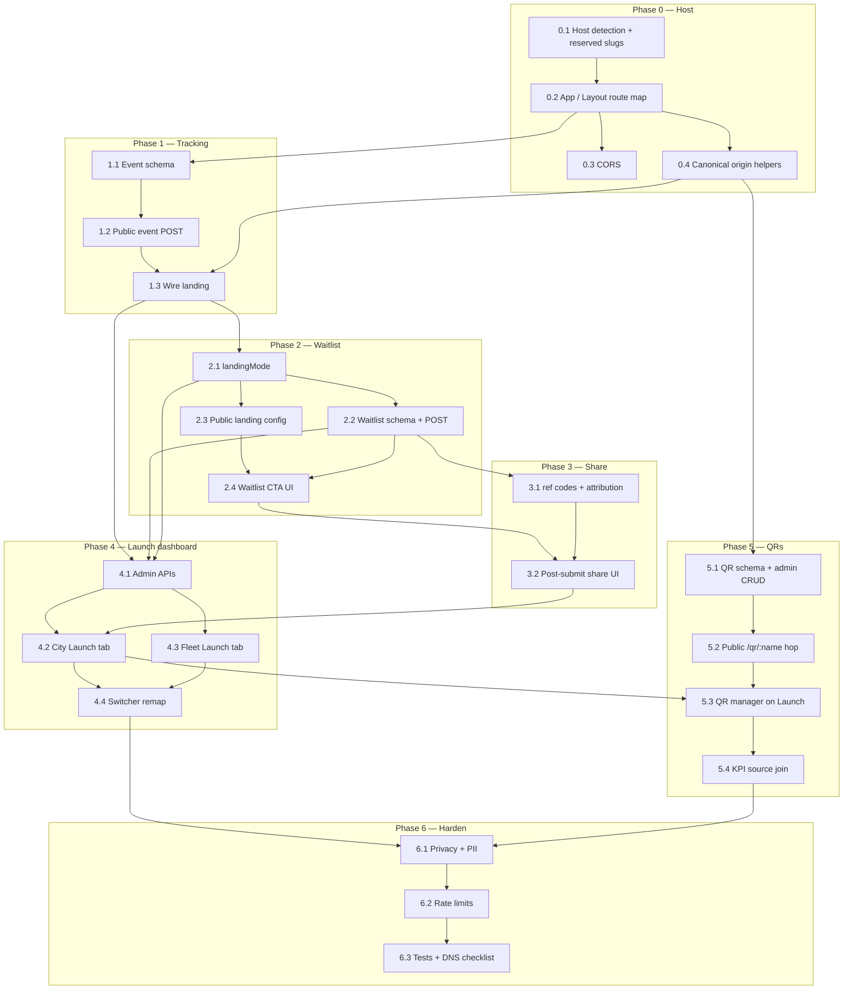

## How to use this document

Work through tasks **in order within each phase**. Soft dependencies are in [Execution order](#execution-order).

This plan is **separate from** the [Pivot tenant ops dashboard plan](/strategy/pivot-tenant-ops-dashboard-plan) (curation / journeys / drop — shipped) and the [Just Go mobile admin dashboard plan](/strategy/just-go-mobile-admin-dashboard-plan) (on-device ops companion). It adds the **public launch surface** and a **Launch** panel on the existing web ops shells.

For every task:

1. Read **Context** and **Instructions**.
2. Follow [Engineering conventions](#engineering-conventions-required) ([backend](/backend/best-practices) + [frontend](/frontend/best-practices)) — do not invent parallel API/DB patterns.
3. Implement only what that task describes (avoid scope creep).
4. Run **Evaluation criteria** as a checklist before marking done.
5. Record blockers or deviations in the PR.
6. **Update this file** when the task is complete (see [Agent completion](#agent-completion)).

### Agent completion

<Warning>
**Required for agents:** When you finish a task (code merged or explicitly accepted), edit this markdown file in the same PR — do not leave the plan out of date.
</Warning>

For the task you completed:

1. In the [Task status ledger](#task-status-ledger), change that row from `pending` to **`done`** (add `doneAt` or PR link in Notes if helpful).
2. Under the task heading, change **`Status:`** from `` `pending` `` to **`done`**.
3. Check every item in that task’s **Evaluation criteria** (`- [ ]` → `- [x]`).

If work is partial or blocked, set **`Status:`** to `blocked` and note why — do not mark `done`.

### Related docs

- [Pivot tenant ops dashboard plan](/strategy/pivot-tenant-ops-dashboard-plan) — city/fleet shells this plan **appends** a Launch tab onto (`?page=` must not shift)
- [Just Go pilot readiness plan](/strategy/just-go-pilot-readiness-plan) — invite landing at `/invite` (app referral codes; not this waitlist)
- [Pivot referral codes](/strategy/pivot-referral-codes) — in-app invite codes; do **not** reuse for waitlist share links
- [Pivot copy overlay plan](/strategy/pivot-copy-overlay-plan) — landing copy overlay via `GET /pivot/landing/copy`
- [Backend best practices](/backend/best-practices) — `getGlobalModelService`, response shape, services, tests
- [Web client best practices](/frontend/best-practices) — `useFetch` / `postRequest`, routing, SCSS

---

## Overall context

### Problem

Just Go’s public page is a marketing landing at `meridian.study/justgo` (and `/justgo/:tenantKey` for a city). It has an App Store CTA, city-scoped flyers, and almost no ops loop for launching a city:

| Gap | Today | Needed |
| --- | --- | --- |
| Public host | `meridian.study/justgo` | **`justgo.lol/`** generic, **`justgo.lol/{city}`** tenant. Alias on meridian stays as a hidden/dev path |
| CTA | Install only | Per-city **waitlist** (phone + city) **or** launched install, toggled from ops |
| Tracking | `analytics.screen('Just Go Landing')` only | First-party **views** and **view → action** (waitlist submit or store click) |
| Waitlist | None | Tenant-scoped signups, who/when on the dashboard |
| Friends | None | Unique share link; **soft** “priority if friends join” (count, no public rank) |
| QRs | Campus `QRManager` (`/qr/:id`, school-scoped Mongo) + invite QR modal | Named Just Go QRs at **`justgo.lol/qr/{name}`**, Just Go colors, scan → city landing |
| Ops UI | Overview / Curation / Journeys / Drop deck / Catalog / Voice | New **Launch** tab on city + fleet shells |

### What we are building

1. **Host-aware routing** so `justgo.lol` serves Just Go at `/`, not campus Meridian.
2. **Waitlist vs launched** landing, keyed per pivot tenant.
3. **First-party landing events** (view, store click) plus waitlist rows, queryable by ops.
4. **Soft friend-share** (`?ref=` codes, `friendsJoined` counter).
5. **Launch** pages on existing Platform Admin Pivot dashboards (platform admins / root only).
6. **Named tracking QRs** in a **global** collection (not campus `QR`).

```text
justgo.lol/                  → JustGoLanding (all cities)
justgo.lol/{city}            → JustGoLanding (locked city)
justgo.lol/qr/{name}         → scan hop → city landing ?src=qr&qr={name}
justgo.lol/creator…          → existing creator console

/platform-admin/pivot        → fleet shell; Launch appended as ?page=2
/platform-admin/pivot/:key   → city shell; Launch appended as ?page=6
```

### Product / architecture decisions (stable for this plan)

| Decision | Choice | Why |
| --- | --- | --- |
| Dashboard home | **Append Launch** to existing Pivot tenant + fleet `Dashboard` shells | Reuse chrome, auth, tenant switcher; do not fork a second console |
| Audience | **Platform admins / root only** | Same gate as `/platform-admin/pivot` |
| Public URLs | `justgo.lol` = generic; `justgo.lol/{city}` = tenant; `justgo.lol/qr/{name}` | Matches how `/justgo` and `/justgo/:tenantKey` already work |
| Legacy path | Keep `meridian.study/justgo` as a **hidden/dev alias** (same components). No 301 required in v1 | Avoid breaking bookmarks/tests; public canonical is justgo.lol |
| Conversion | **Waitlist:** successful phone submit. **Launched:** App Store / Play click | Honest funnel; no StoreKit / first-open attribution in v1 |
| Waitlist fields | Phone + city. City **inferred** on tenant URLs; **required** on generic `/` | |
| Share | **Soft promise** — unique link + `friendsJoined` count; **no** public queue position | |
| QR model | **Manual named codes** (campus QRManager-style). No auto-default per city | `{name}` is a slug, not necessarily the tenant key |
| Landing mode | New `landingMode: 'waitlist' \| 'launched'` on the **pivot tenant entry**. Default **`waitlist`**. Independent of `status` (`coming_soon` / `active`) | Tenant status still means subdomain/app availability, not marketing CTA |
| SMS | **None in v1** — no OTP, no confirm text, no launch blast | Store the number; export from dashboard |
| Phone | US-first E.164; unique `(tenantKey, phoneE164)` | |
| Share attribution | Same-city only; ignore self-ref | |
| QR storage | **Global** Mongo via `getGlobalModelService` — **not** campus `QR` / `getModels(req, 'QR')` | Campus QRs are school-scoped; `justgo.lol` has no school subdomain |
| QR destination | Always that city’s landing + `src=qr&qr={name}`. No arbitrary redirect URL in v1 | Scans become landing views with source |
| Visitor id | Dedicated `localStorage` key `justgo.landing.visitor` — do **not** reuse campus `/log-visit` / `hasVisited` | |
| Page indexes | **Append only.** City Launch = **`?page=6`**. Fleet Launch = **`?page=2`**. Do **not** insert | Catalog is 4, Voice is 5; bookmarks must stay |
| Creator console | Stays at `/justgo/creator…` on both hosts | Footer host link keeps working |
| Mixpanel | Also `analytics.track` for view/click/submit; **do not** send raw phones | |

### Public URL map (locked)

| Host | Path | Page |
| --- | --- | --- |
| `justgo.lol` / `www.justgo.lol` | `/` | Generic `JustGoLanding` |
| `justgo.lol` | `/{tenantKey}` | City `JustGoLanding` if slug is a pivot city and not reserved |
| `justgo.lol` | `/qr/:name` | Just Go QR hop |
| `justgo.lol` | `/justgo`, `/justgo/:tenantKey` | Alias of the same landing (optional; keep for shared code) |
| `justgo.lol` | `/justgo/creator…`, `/creator…` | Creator console (prefer existing `/justgo/creator` prefix; `/creator` only if needed for reserved-slug collision) |
| `meridian.study` | `/` | **Unchanged** campus `Landing` |
| `meridian.study` | `/justgo`, `/justgo/:tenantKey` | Hidden/dev alias of Just Go landing |
| `meridian.study` | `/qr/:id` | **Unchanged** campus QR |

**Reserved slugs** on the Just Go apex (`justgo.lol/:slug` must not be treated as a city): extend `JUSTGO_LANDING_RESERVED_SLUGS` in `justGoLandingUtils.js` to include at least `qr`, `creator`, `invite`, `privacy-policy`, `terms-of-service`, `login`, `platform-admin`, `admin`, `justgo`.

**Canonical public origin (production):** `https://justgo.lol`. Helper e.g. `justGoPublicOrigin()` used for share URLs, QR payloads, and footer links.

### Generic `/` vs mixed fleet

On `justgo.lol/`, keep the city picker. CTA follows the **selected** city’s `landingMode` so some cities can be waitlist while others are launched. Views on `/` may have `tenantKey: null` until a city is selected; once selected, subsequent events stamp that key.

### Design language

| Surface | Language |
| --- | --- |
| Public landing (including waitlist form, share panel) | Existing Just Go scrapbook — `JustGoLanding.scss`, copy in `justGoLandingCopy.js` |
| Launch dashboard tabs | Existing Pivot **ops** chrome (`PivotTenantPage`, `PivotOpsCard`, Linear buttons) — not a scrapbook recreation |
| QR preview/download | Reuse `qr-code-styling` + Just Go swatches from `PivotInviteQRModal` (`#1A1714` ink, cream, pop `#FFD23F`, accent `#FF4F1F`). Do **not** ship campus green `#4DAA57` as the default |

### Engineering conventions (required)

#### Backend — [best practices](/backend/best-practices)

| Concern | Rule for this plan |
| --- | --- |
| Waitlist, landing events, Just Go QRs | **Global** models via `getGlobalModelService` + `req.globalDb`. Register in `getGlobalModelService.js` with explicit collection names. Not tenant `getModels`. |
| `landingMode` | Field on pivot entries in `tenantConfig` (`schemas/tenantConfig.js` + `tenantConfigService`). Read with the same tenant-resolution as other pivot config. |
| Campus `QR` | **Do not** write Just Go codes into school `QR` collections. |
| Public routes | Thin handlers on `pivotRoutes.js` (or a dedicated `pivotLandingRoutes.js` mounted next to it). Rate-limit waitlist + events + QR hop. |
| Admin routes | `/admin/pivot/…`, `verifyToken` + `requirePlatformAdmin`. |
| Responses | `{ success: true, data? }` / `{ success: false, message, code? }` with stable codes (`INVALID_PHONE`, `WAITLIST_DUPLICATE`, `QR_NOT_FOUND`, `QR_INACTIVE`, `INVALID_LANDING_MODE`, `TENANT_NOT_FOUND`). |
| Services | `pivotLandingService.js`, `pivotLandingWaitlistService.js`, `pivotLandingQrService.js` (names locked unless a collision forces a suffix). Pass `req` / `{ globalDb, user }`. |
| PII | Phones only on platform-admin waitlist APIs. Public waitlist POST returns `{ shareUrl, friendsJoined }` — never other people’s numbers. |
| Tests | Unit tests for phone/share/QR helpers; **route-outcomes** for public + admin endpoints. |

#### Frontend — [best practices](/frontend/best-practices)

| Concern | Rule for this plan |
| --- | --- |
| Reads | `useFetch` with relative URLs; `null` URL until `tenantKey` is ready. Stabilize `params` with `useMemo`. |
| Mutations | `postRequest` / `authenticatedRequest` only — **no** ad-hoc `axios` in Launch/waitlist/QR feature code (campus `QR.jsx` axios is legacy; new hop should use `postRequest` or a small dedicated fetch). |
| Routing | `react-router-dom`. Host detection in `tenantRedirect.js`. Append Launch; do not reorder `menuItems`. |
| Switcher | Extend `remapPivotOpsSearch` / `PIVOT_OPS_PAGES` so Launch remaps fleet `page=2` ↔ city `page=6` by label. |
| Structure | Landing changes stay under `pages/JustGoLanding/`. Launch pages under `pages/PlatformAdmin/PivotTenantDashboard/`. Extract shared QR canvas if both invite modal and Launch need it. |
| Copy | Public strings in `justGoLandingCopy.js` (+ overlay keys if needed). No Atlas / Meridian / ClubDash voice on the landing. |

### Repositories touched

| Area | Path |
| --- | --- |
| Frontend (landing) | `Meridian/frontend/src/pages/JustGoLanding/`, `App.js`, `Layout.jsx`, `config/tenantRedirect.js` |
| Frontend (ops) | `Meridian/frontend/src/pages/PlatformAdmin/PivotTenantDashboard/` |
| Frontend (QR patterns) | `pages/Admin/QRManager/` (read/adapt), `PivotReferralCodesPanel/PivotInviteQRModal.jsx` (colors) |
| Backend | `Meridian/backend/` — tenant config, global schemas, pivot public + admin routes, CORS |
| Mobile | **None** |
| Docs | This file |

### Out of scope (this plan)

- SMS / OTP / launch-day text blast
- Real waitlist rank or skip-the-line
- Install attribution (StoreKit, Play, first-open)
- City-partner or creator access to Launch
- Arbitrary QR redirect URLs (campus-style)
- Changing campus `/qr/:id` or school `QR` collections
- 301 from `meridian.study/justgo` (alias is enough)
- Mobile admin Launch tab ([mobile admin dashboard plan](/strategy/just-go-mobile-admin-dashboard-plan) is orthogonal)

---

## Execution order



**Critical path (thin vertical):** 0.1–0.2 → 2.1–2.4 → 4.1–4.2 (toggle + waitlist table). Tracking (Phase 1) should land before or with the waitlist so conversion is real. Share (Phase 3) and QRs (Phase 5) can follow once Launch exists.

**Parallel:** 0.3 CORS and DNS/TLS can run beside UI work. 0.4 is required before share URLs and QR payloads go to production.

---

## Task status ledger

| ID | Status | Notes |
| --- | --- | --- |
| 0.1 | done | Host detection + reserved slugs. Dev: `localStorage.justgoHostOverride=1` on localhost. |
| 0.2 | done | App / Layout route map for `justgo.lol`. `/qr/:name` stub until Phase 5. |
| 0.3 | done | CORS + cookies for justgo.lol. Live `/pivot/cities` check blocked on DNS/TLS. |
| 0.4 | done | Canonical origin helpers. Prod `https://justgo.lol`; share/QR should use `justGoPublicUrl`. |
| 1.1 | done | Global `JustGoLandingEvent` → `justgo_landing_events`. Indexes `{ tenantKey, type, createdAt }` and `{ visitorId, tenantKey, createdAt }`. |
| 1.2 | done | Public `POST /pivot/landing/event`. Store every view; unique visitors at read time. Rate-limit 60/min/IP (`LANDING_EVENT_RATE_LIMIT`). |
| 1.3 | done | Views + store clicks on JustGoLanding. Visitor `justgo.landing.visitor`. Attribution in sessionStorage. Mixpanel `justgo_landing_view` / `justgo_landing_store_click`. |
| 2.1 | done | `landingMode` on pivot tenant entries; missing reads as `waitlist`; independent of `status`. |
| 2.2 | done | Global `JustGoWaitlist` → `justgo_waitlist`. Public `POST /pivot/landing/waitlist`. Duplicate 409. Mints `shareCode`. |
| 2.3 | done | Public `GET /pivot/landing/config` with `landingMode`. Hidden omitted; `?tenantKey=` includes scoped city. Landing wired off `/pivot/cities`. |
| 2.4 | done | Waitlist CTA on `JustGoLanding` |
| 3.1 | done | `shareCode` / `ref` attribution. Same-city increment; cross-city / self-ref / unknown ignored. Share URL `/{city}?ref=` implies `source=share`. |
| 3.2 | done | Post-submit share UI: copy link + Web Share; friendsJoined from signup payload; justGoPublicUrl |
| 4.1 | pending | Admin launch APIs + CSV |
| 4.2 | pending | City Launch tab `?page=6` |
| 4.3 | pending | Fleet Launch tab `?page=2` |
| 4.4 | pending | Switcher remap Launch ↔ Launch |
| 5.1 | pending | Global QR CRUD |
| 5.2 | pending | `justgo.lol/qr/:name` hop |
| 5.3 | pending | QR manager UI on Launch |
| 5.4 | pending | QR source on KPIs |
| 6.1 | pending | Privacy / consent / PII |
| 6.2 | pending | Rate limits |
| 6.3 | pending | Tests + DNS checklist |

---

## Phase 0 — `justgo.lol` host routing

Campus `Layout` sends non-www `/` to `/events-dashboard`. `isWww()` treats `meridian.study` / `www` / localhost as the marketing host. `justgo.lol` must be a **third** host class: Just Go apex, not campus www, not a school subdomain.

### Task 0.1 — Host detection and reserved slugs

**Status:** `done`

**Context:** `Meridian/frontend/src/config/tenantRedirect.js` has `ROOT_HOSTS`, `isWww()`, `WWW_ALLOWED_PATHS`, `getCurrentTenantKey()`. `justGoLandingUtils.js` already reserves `creator` on `/justgo/:tenantKey`.

**Instructions:**

1. Add `JUSTGO_PUBLIC_HOSTS` (`justgo.lol`, `www.justgo.lol`) and `isJustGoHost()`.
2. Local/dev: allow `localhost` to opt into Just Go apex via `localStorage` key `justgoHostOverride=1` (or equivalent) **without** breaking campus `npm start`. Document the override in this task’s PR.
3. `isJustGoHost()` must **not** make `getCurrentTenantKey()` think the subdomain is a school (`justgo` / `www` are not tenant keys).
4. Extend `JUSTGO_LANDING_RESERVED_SLUGS` as in [Public URL map](#public-url-map-locked).
5. Add `justgo.lol` paths to `WWW_ALLOWED_PATHS` **or** a sibling allowlist used by `Layout` so Just Go hosts are not bounced to `/select-school`.

**Evaluation criteria:**

- [x] Unit tests: `isJustGoHost` true for `justgo.lol` / `www.justgo.lol`; false for `meridian.study`, `rpi.meridian.study`
- [x] `landingTenantKeyFromParam('qr')` and `'creator'` stay empty
- [x] Campus `isWww()` behavior unchanged

---

### Task 0.2 — App / Layout route map

**Status:** `done`

**Context:** `App.js` index route is campus `Landing`. `Layout.jsx` hides Banner on `/justgo`. Routes already include `/justgo` and `/justgo/:tenantKey`.

**Instructions:**

1. When `isJustGoHost()`:
   - `/` → `JustGoLanding` (not campus Landing, not events-dashboard redirect).
   - `/:tenantKey` → `JustGoLanding` when the param is a non-reserved slug (unknown city can still render the existing empty-city copy).
   - `/qr/:name` → new hop component (stub that 404s until Phase 5 is fine; register the path now so it is not eaten as a city).
   - Keep `/justgo` and `/justgo/:tenantKey` working.
   - Keep privacy, terms, creator login/console.
2. When **not** Just Go host: **no** change to `/` or campus `/qr/:id`.
3. Hide campus Banner on Just Go host for landing, `/qr`, creator, privacy/terms.
4. Update `JustGoLanding` tests to cover `/` and `/:tenantKey` under a Just Go host (mock `isJustGoHost`).

**Evaluation criteria:**

- [x] `justgo.lol/` (or host override) renders `JustGoLanding`
- [x] `meridian.study/` still campus Landing
- [x] `meridian.study/justgo` still Just Go landing
- [x] Banner hidden on Just Go landing

---

### Task 0.3 — CORS and cookies

**Status:** `done`

**Context:** `Meridian/backend/app.js` `staticProductionOrigins` lists meridian/pinkpulse hosts. `isAllowedCorsOrigin` also allows `https://{tenant}.{BASE_DOMAIN}`.

**Instructions:**

1. Allow `https://justgo.lol` and `https://www.justgo.lol` in production CORS and socket origins.
2. Confirm cookie `SameSite` / domain still work for API calls from justgo.lol to the existing API host (likely `api.meridian.study` or same-origin proxy — match how `www.meridian.study` already calls the API). Do not invent a new API subdomain unless infra requires it.
3. If env-based origin lists exist in deploy config, add the new hosts there too.

**Evaluation criteria:**

- [x] Browser call from justgo.lol origin to landing/copy (or `/pivot/cities`) is not CORS-blocked in a staging check or documented as blocked on DNS-not-ready
- [x] Campus origins unchanged

**Notes:** Production CORS/Socket.IO allow `https://justgo.lol` and `https://www.justgo.lol` (`utilities/corsOrigins.js`). No env origin list existed in deploy config. The SPA keeps relative API URLs (same as `www.meridian.study`); cookies stay `SameSite=strict` and `getCookieDomain` scopes them to `.justgo.lol` on that host. Live browser check is **blocked on DNS/TLS** until `justgo.lol` points at the existing frontend. `justgo.lol` is treated as public `www` for tenant DB (not a school named `justgo`).

---

### Task 0.4 — Canonical origin helpers

**Status:** `done`

**Context:** `JUSTGO_LANDING_PATH = '/justgo'` and `justGoLandingPath()` in `justGoLandingCopy.js`. Share and QR payloads must not mint `meridian.study/justgo` as the public URL in production.

**Instructions:**

1. Add `justGoPublicOrigin()` / `justGoPublicUrl(path)` — production → `https://justgo.lol`; dev → current origin (or documented override).
2. Use them for any newly generated public links (share, QR data). Existing `/justgo` paths remain valid aliases.
3. Optional: `<link rel="canonical">` on the landing pointing at the justgo.lol URL.

**Evaluation criteria:**

- [x] Helper unit tests for prod vs dev
- [x] Creator footer `Link` still works on both hosts (relative `/justgo/creator/login` is fine)

---

## Phase 1 — View and conversion tracking

Landing today only fires `analytics.screen('Just Go Landing')`. Store CTAs are untracked `<a href={storeUrl}>`.

### Task 1.1 — Landing event schema

**Status:** `done`

**Context:** Global models live in `getGlobalModelService.js`. Do not put this on the city Event collection.

**Instructions:**

1. Schema `justGoLandingEvent` → collection `justgo_landing_events`.
2. Fields: `type` (`view` \| `store_click`), `tenantKey` (string, optional), `host`, `path`, `source` (`direct` \| `share` \| `qr`), `qrName`, `refCode`, `visitorId`, `userAgent`, `store` (`ios` \| `android`, store_click only), `createdAt`.
3. Indexes: `{ tenantKey, type, createdAt }`, `{ visitorId, tenantKey, createdAt }`.
4. Register as `JustGoLandingEvent` in `getGlobalModelService`.

**Evaluation criteria:**

- [x] Model resolves from `req.globalDb`
- [x] Index fields documented in schema

---

### Task 1.2 — Public `POST /pivot/landing/event`

**Status:** `done`

**Context:** `pivotRoutes.js` already has public `GET /pivot/cities` and `GET /pivot/landing/copy` with rate limits.

**Instructions:**

1. `POST /pivot/landing/event` — no auth. Validate `type`, optional `tenantKey` (must be a pivot city if present), `source`, `visitorId` (required, opaque string ≤ 64 chars).
2. Service writes one document. For `view`, optional same-visitor-per-tenant-per-UTC-day dedupe flag in `data.deduped` while still counting raw if you store a `unique: boolean` — pick one approach and use it in Phase 4 KPIs:
   - **Locked:** store **every** view; uniqueness is computed at read time (distinct `visitorId` in range).
3. Rate-limit per IP.
4. Route-outcomes: 200 happy path; 400 invalid type; 429 if limiter is testable.

**Evaluation criteria:**

- [x] `{ success: true }` on valid view
- [x] Invalid type → `success: false` + stable `code`
- [x] No auth cookie required

---

### Task 1.3 — Wire `JustGoLanding`

**Status:** `done`

**Context:** `JustGoLanding.jsx` already has `analytics.screen`. `MobileLanding.jsx` is the pattern for `analytics.track('mobile_landing_app_store_click', { source })`.

**Instructions:**

1. Mint/read `justgo.landing.visitor` in `localStorage`.
2. On mount: `POST` `type: view` with `tenantKey` from the URL (null on generic `/` / `/justgo`), `source` from `src` query (`qr` \| `share` \| default `direct`), `qr` / `ref` query params.
3. Wrap App Store, Play (if shown), nav CTA, footer CTA, sticky CTA: fire `store_click` (include `store`) then navigate. Do not block the click on a failed POST.
4. Also `analytics.track` with the same names (`justgo_landing_view`, `justgo_landing_store_click`) — **no phone**.
5. Persist `src`, `qr`, `ref` in `sessionStorage` so later clicks still attribute.

**Evaluation criteria:**

- [x] Component tests with mocked `postRequest` / `apiRequest`: view on render; store_click on CTA
- [x] Tenant URL includes `tenantKey`
- [x] Existing landing tests still pass

---

## Phase 2 — Waitlist vs launched

### Task 2.1 — `landingMode` on tenant config

**Status:** `done`

**Context:** Pivot tenant entries live in `schemas/tenantConfig.js` (`tenantEntrySchema`). `tenantConfigService.js` maps create/update bodies.

**Instructions:**

1. Add `landingMode: { type: String, enum: ['waitlist', 'launched'], default: 'waitlist' }` on pivot entries.
2. Existing cities default to `waitlist` on read if unset (sparse-safe).
3. Platform-admin tenant PATCH/create should accept `landingMode` (can be unused in UI until Phase 4).
4. Do **not** derive mode from `status`.

**Evaluation criteria:**

- [x] Unit/service test: missing field reads as `waitlist`
- [x] `coming_soon` + `launched` and `active` + `waitlist` are both legal

---

### Task 2.2 — Waitlist schema and public POST

**Status:** `done`

**Instructions:**

1. Schema `justGoWaitlist` → `justgo_waitlist`.
2. Fields: `phoneE164`, `tenantKey`, `cityLabel`, `visitorId`, `source`, `qrName`, `refCode` (inbound), `shareCode` (outbound, unique), `friendsJoined` (number, default 0), `createdAt`.
3. Unique index `{ tenantKey, phoneE164 }`. Unique index on `shareCode`.
4. Phone helper: trim, default `+1` if 10-digit US, store E.164. Reject garbage with `INVALID_PHONE`.
5. `POST /pivot/landing/waitlist` — `{ phone, tenantKey?, city? , ref?, visitorId, source?, qrName? }`. If URL/body `tenantKey` missing, `city` must resolve to a pivot `tenantKey`. Duplicate → `WAITLIST_DUPLICATE` (still 200 or 409 — **locked: 409**).
6. Response `data`: `{ shareUrl, friendsJoined: 0, tenantKey }` (share URL can be a placeholder path until Task 3.1 mints `shareCode` — **locked: mint `shareCode` in this task** so 3.1 is attribution-only).
7. Rate-limit per IP.

**Evaluation criteria:**

- [x] Same phone+city twice → 409
- [x] Tenant URL city inferred; generic requires city
- [x] Phone not echoed to Mixpanel

---

### Task 2.3 — Public `GET /pivot/landing/config`

**Status:** `done`

**Context:** Landing already fetches `/pivot/cities` and `/pivot/landing/copy`.

**Instructions:**

1. `GET /pivot/landing/config` returns `{ cities: [{ tenantKey, cityDisplayName, landingMode }], … }` for visible pivot cities.
2. Optional `?tenantKey=` returns that city plus `landingMode` even when listing is scoped.
3. Wire `JustGoLanding` to this (can replace or wrap `/pivot/cities` — **prefer extend cities payload** if cheaper, but a dedicated config endpoint is fine). Do not leak admin-only fields.

**Evaluation criteria:**

- [x] Waitlist city and launched city both appear with correct mode
- [x] Hidden tenants omitted

---

### Task 2.4 — Waitlist CTA on the landing

**Status:** `done`

**Context:** Hero, nav, footer, and sticky all use install CTAs. Copy lives in `justGoLandingCopy.js`.

**Instructions:**

1. When the **active** city’s `landingMode === 'waitlist'`: replace install CTAs with phone input + submit. On generic `/`, require city select (reuse deck city picker where it exists). On tenant URL, lock city.
2. Consent line + links to privacy/terms.
3. Success: hide form, show confirmation (share UI can be a “copy link” stub until 3.2).
4. When `launched`: keep current App Store badge + sticky.
5. Add waitlist strings to `justGoLandingCopy.js` (and overlay keys if you add catalog paths). Lowercase Just Go voice.
6. Tests for waitlist vs launched rendering (`JustGoLanding.test.jsx`).

**Evaluation criteria:**

- [x] Waitlist city: no App Store as primary CTA
- [x] Launched city: install CTAs unchanged in spirit
- [x] Generic `/` cannot submit without a city

---

## Phase 3 — Share with friends (soft priority)

### Task 3.1 — `ref` attribution

**Status:** `done`

**Context:** `shareCode` minted at waitlist insert (Task 2.2). App invite codes (`PivotReferralCode`) are a **different** system — do not mix.

**Instructions:**

1. Public URL: `{origin}/{city}?ref={shareCode}` (`source=share` implied).
2. Landing reads `ref`, stores in `sessionStorage` (`justgo.landing.ref`).
3. On waitlist insert: if `ref` matches another row’s `shareCode` and **same** `tenantKey` and not the same phone, increment that row’s `friendsJoined`. Invalid/unknown ref is ignored (still signup).
4. Block self-ref (same phone or same waitlist id).

**Evaluation criteria:**

- [x] Unit tests: same-city increment; cross-city no increment; self-ref no increment; unknown ref ok

---

### Task 3.2 — Post-submit share UI

**Status:** `done`

**Instructions:**

1. After successful waitlist: panel with copy-link + Web Share API when available.
2. Copy: friends who join help you get in earlier — **no** position number.
3. Show `friendsJoined` if the API returns it (0 on first submit).
4. Do not require a second round-trip to “look up my number” in v1.

**Evaluation criteria:**

- [x] Share URL uses `justGoPublicUrl` (Task 0.4)
- [x] Tests: confirmation visible; clipboard path mocked

---

## Phase 4 — Launch dashboard

Append-only. City Voice stays `?page=5`. Fleet Voice stays `?page=1`.

### Task 4.1 — Admin launch APIs

**Status:** `pending`

**Instructions:**

1. `GET /admin/pivot/tenants/:tenantKey/launch` — range query (default last 28 days): totals for views, unique visitors, waitlist signups, store clicks, conversion rate (`waitlist` → signups/views; `launched` → clicks/views), series by day, source breakdown (`direct` / `share` / `qr`), current `landingMode`, public URL.
2. `GET /admin/pivot/tenants/:tenantKey/waitlist` — paginated table: `createdAt`, `phoneE164`, `source`, `qrName`, `refCode`, `friendsJoined`. Platform admin only.
3. `GET /admin/pivot/tenants/:tenantKey/waitlist.csv` — same columns.
4. `PATCH /admin/pivot/tenants/:tenantKey/landing-mode` — `{ landingMode }`.
5. `GET /admin/pivot/launch` — fleet rollup: per-city row + totals.
6. Route-outcomes with `requirePlatformAdmin`.

**Evaluation criteria:**

- [ ] Non-admin 403
- [ ] Conversion uses the city’s **current** mode (document if historical mixed-mode weeks are “best effort”)
- [ ] CSV does not go to a public route

---

### Task 4.2 — City Launch tab (`?page=6`)

**Status:** `pending`

**Context:** `PivotTenantDashboard.jsx` builds `menuItems`. Comment already says Catalog=4, Voice=5, **appended — do not insert**.

**Instructions:**

1. Append menu item **Launch** (icon e.g. `mdi:rocket-launch-outline`).
2. Page sections: (1) `landingMode` toggle with confirm, (2) KPI strip + daily sparkline/chart using existing ops chart pieces if practical, (3) waitlist table, (4) public link `justgo.lol/{city}` (QR block is Phase 5).
3. `PivotTenantPage` / `PivotOpsCard` / Linear buttons. Loading and error states.
4. Tests: `?page=6` shows Launch; `?page=5` still Voice.

**Evaluation criteria:**

- [ ] Voice bookmarks unchanged
- [ ] Toggle PATCH + refetch
- [ ] Phones visible only here (and CSV), not on Overview

---

### Task 4.3 — Fleet Launch tab (`?page=2`)

**Status:** `pending`

**Context:** `PivotFleetDashboard.jsx` is Overview + Voice only.

**Instructions:**

1. Append **Launch** as `page=2` (Voice remains 1).
2. Totals + per-city table: mode, views, waitlists, conversion, last signup. Row links to `/platform-admin/pivot/:tenantKey?page=6`.
3. Tests: fleet `?page=1` still Voice; `?page=2` Launch.

**Evaluation criteria:**

- [ ] Fleet Voice bookmark unchanged
- [ ] Empty fleet does not crash

---

### Task 4.4 — Switcher remap

**Status:** `pending`

**Context:** `PIVOT_OPS_PAGES` + `remapPivotOpsSearch` map Voice fleet `1` ↔ city `5`. City-only pages drop to Overview when going to fleet.

**Instructions:**

1. Add `fleetLaunch: 2`, `cityLaunch: 6`.
2. Remap Launch ↔ Launch by label (same as Voice).
3. Extend `PivotTenantDropdown.test.jsx`.

**Evaluation criteria:**

- [ ] Fleet Launch → city Launch (`page=6`)
- [ ] City Launch → fleet Launch (`page=2`)
- [ ] City Curation → fleet still Overview

---

## Phase 5 — Named tracking QRs

Campus `QRManager` + `CreateQRModal` + `StyledQRCode` are the UX reference. `PivotInviteQRModal` is the color reference. Storage must be global.

### Task 5.1 — Global QR schema and admin CRUD

**Status:** `pending`

**Instructions:**

1. Schema `justGoLandingQr` → `justgo_landing_qrs`: `name` (unique slug), `tenantKey`, `description`, `isActive`, `fgColor`, `bgColor`, `transparentBg`, `dotType`, `cornerType`, `scans`, `uniqueScans`, `lastScannedAt`, timestamps. Optional short `scanHistory` (cap or daily rollup — do not unbounded-grow like campus if we can avoid it; **locked: daily scan counts map** plus integer totals).
2. Admin:
   - `GET /admin/pivot/tenants/:tenantKey/landing-qrs`
   - `POST /admin/pivot/tenants/:tenantKey/landing-qrs`
   - `PATCH /admin/pivot/landing-qrs/:name`
   - `DELETE` or deactivate (`isActive: false`) — prefer deactivate.
3. `name`: lowercase slug, unique **globally** (URL has no city). Reject collision with `QR_NAME_TAKEN`.
4. Payload URL stored or derived: `{publicOrigin}/qr/{name}`.

**Evaluation criteria:**

- [ ] Cannot create campus-school QR via this API
- [ ] Duplicate name 409
- [ ] Name `troy` allowed as a code that still hops to that city’s landing

---

### Task 5.2 — Public hop `/qr/:name`

**Status:** `pending`

**Context:** Campus `pages/QR/QR.jsx` POSTs `/qr-scan` then redirects. New page: e.g. `pages/JustGoLanding/JustGoQrHop.jsx`.

**Instructions:**

1. Route on Just Go host: `/qr/:name`. Alias `/justgo/qr/:name` optional.
2. Look up global QR; inactive/missing → simple Just Go-styled error (not campus chrome).
3. Increment scans (unique via `justgo.landing.visitor` if sent, else cookie/localStorage on hop).
4. Redirect to `justGoPublicUrl('/' + tenantKey + '?src=qr&qr=' + name)` (preserve additional query if any).
5. Do **not** intercept `meridian.study/qr/:id`.

**Evaluation criteria:**

- [ ] Active code redirects to city landing with `src=qr`
- [ ] Campus QR route tests / behavior unchanged
- [ ] Inactive → error, no redirect

---

### Task 5.3 — QR manager on city Launch

**Status:** `pending`

**Instructions:**

1. Launch tab section: list, create, edit, download SVG/PNG, copy `https://justgo.lol/qr/{name}`.
2. Reuse `qr-code-styling` (dynamic import like QRManager / invite modal). Default fg `#1A1714`, transparent or cream bg. Swatches from `PivotInviteQRModal`.
3. Extract a shared `StyledJustGoQr` if that avoids a third copy of the canvas effect; otherwise copy the invite-modal helper into a small common module under `components/` or `PivotTenantDashboard/`.
4. Create modal: name, description, optional color — `tenantKey` is the current city.

**Evaluation criteria:**

- [ ] Create → list shows row → download works
- [ ] Default colors are Just Go, not campus green

---

### Task 5.4 — KPI source join

**Status:** `pending`

**Instructions:**

1. Launch KPIs: QR scan totals from the QR collection; landing events with `source=qr` broken down by `qrName`.
2. Waitlist table already has `qrName` — show it.
3. Fleet Launch: optional top QR column; skip if noisy.

**Evaluation criteria:**

- [ ] Scan hop + landing view both visible as QR-sourced
- [ ] Store click / waitlist still the only **conversion** metrics

---

## Phase 6 — Hardening

### Task 6.1 — Privacy, consent, PII

**Status:** `pending`

**Instructions:**

1. Waitlist form consent copy; privacy/terms links work on justgo.lol (routes already exist on meridian).
2. Admin waitlist UI: treat phones as PII (no client-side logging).
3. Analytics: event props only (`tenantKey`, `source`, `store`) — never `phone`.
4. Confirm retention: waitlist rows kept until an admin deletes (no self-serve delete in v1). Optional `DELETE /admin/pivot/tenants/:tenantKey/waitlist/:id` if cheap — **include a single-row delete** for ops mistakes.

**Evaluation criteria:**

- [ ] Consent visible before submit
- [ ] Mixpanel payloads in tests/code review have no phone

---

### Task 6.2 — Rate limits

**Status:** `pending`

**Context:** `pivotLandingCopyRateLimit` / referral validate limiters already exist on `pivotRoutes.js`.

**Instructions:**

1. Tighten waitlist, landing event, QR hop limiters (per IP). Document numbers in the PR.
2. Admin GET/PATCH unchanged (auth is enough).

**Evaluation criteria:**

- [ ] Burst waitlist from one IP trips 429 in a test or documented manual check

---

### Task 6.3 — Tests and DNS checklist

**Status:** `pending`

**Instructions:**

1. Fill remaining route-outcomes and frontend tests called out in earlier tasks if still pending.
2. DNS/TLS checklist in the PR (do not put secrets here):
   - `justgo.lol` + `www` → existing frontend
   - www → apex or vice versa (pick one; **prefer apex `justgo.lol` as canonical**)
   - CORS Task 0.3 verified on prod
3. Optional: `noindex` on `meridian.study/justgo` if you want the alias hidden from search.
4. Mark this task done only when the public host is confirmed **or** explicitly blocked on infra with `blocked` + note.

**Evaluation criteria:**

- [ ] Ledger updated for all shipped tasks
- [ ] DNS item checked or blocked with owner

---

## Follow-up (not this plan)

- SMS confirm / “we’re live” blast when flipping to `launched`
- Real ranked waitlist
- Install attribution
- QR → custom URL
- Mobile Launch tab
- 301 `meridian.study/justgo` → `justgo.lol`
