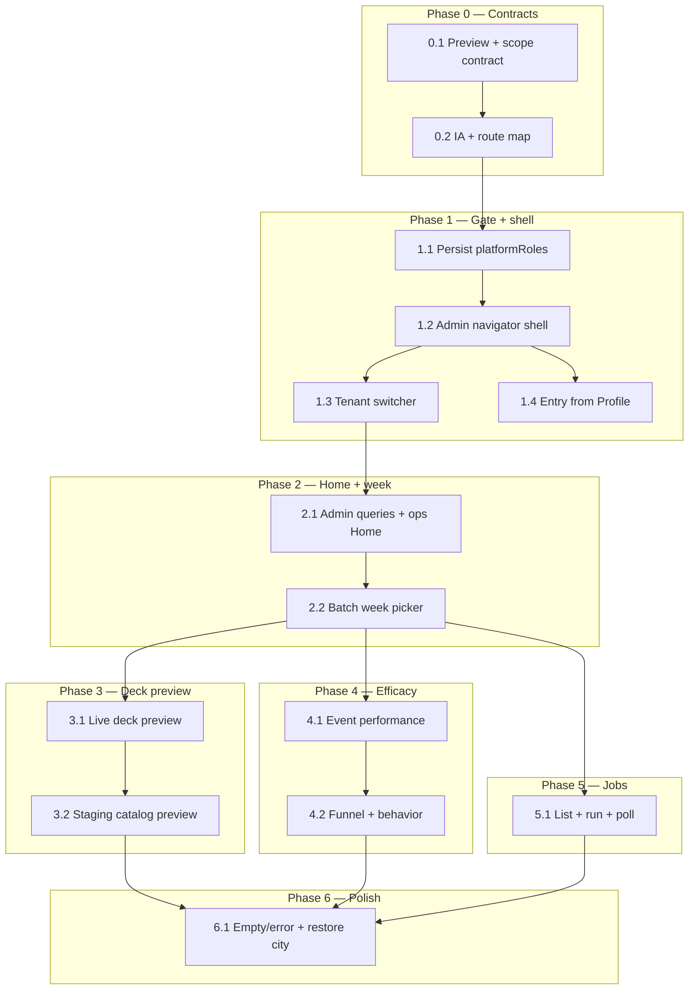

## How to use this document

Work through tasks **in order within each phase**. Soft dependencies are in [Execution order](#execution-order).

This plan is **separate from** the [Pivot tenant ops dashboard plan](/strategy/pivot-tenant-ops-dashboard-plan) (web Platform Admin — shipped) and the [Just Go pilot readiness plan](/strategy/just-go-pilot-readiness-plan). It adds a **mobile companion** for the same platform admins: preview + analytics on device, not a second curation workstation.

For every task:

1. Read **Context** and **Instructions**.
2. Follow existing mobile Pivot patterns (`src/pivot/`) and backend admin conventions from the [web ops plan](/strategy/pivot-tenant-ops-dashboard-plan#engineering-conventions-required) — do not invent parallel API/auth patterns.
3. Implement only what that task describes (avoid scope creep).
4. Run **Evaluation criteria** as a checklist before marking done.
5. Record blockers or deviations in the PR.
6. **Update this file** when the task is complete (see [Agent completion](#agent-completion)).

### Agent completion

<Warning>
**Required for agents:** When you finish a task (code merged or explicitly accepted), edit this markdown file in the same PR — do not leave the plan out of date.
</Warning>

For the task you completed:

1. In the [Task status ledger](#task-status-ledger), change that row from `pending` to **`done`** (add `doneAt` or PR link in Notes if helpful).
2. Under the task heading, change **`Status:`** from `` `pending` `` to **`done`**.
3. Check every item in that task’s **Evaluation criteria** (`- [ ]` → `- [x]`).

If work is partial or blocked, set **`Status:`** to `blocked` and note why — do not mark `done`.

### Related docs

- [Pivot tenant ops dashboard plan](/strategy/pivot-tenant-ops-dashboard-plan) — web Overview / Curation / Journeys; APIs this mobile shell reuses
- [Pivot MVP implementation plan](/strategy/pivot-mvp-implementation-plan) — design language, feed, intents
- [Pivot metadata contract](/strategy/pivot-metadata-contract) — `ingestStatus`, `batchWeek`, release gate
- [Pivot weekly drop runbook](/strategy/pivot-weekly-drop-runbook) — drop timing vs catalog release
- [Just Go pilot readiness plan](/strategy/just-go-pilot-readiness-plan) — consumer polish (orthogonal)

---

## Overall context

### Problem

Platform admins already have a capable **web** per-tenant ops dashboard (Overview, Curation, User journeys). On the road — or when checking “what would this week’s deck feel like?” — they still open a laptop. The Just Go mobile app has **no platform-admin surface**: `platformRoles` are not persisted, there is no tenant switcher for pivot cities, and feed always loads the live week.

| Gap | Today (mobile) | Needed |
| --- | --- | --- |
| Auth gate | Consumer session only; `buildEssentialUser` drops `platformRoles` | Detect `platform_admin` / `root` and gate an ops shell |
| Entry | None (only `__DEV__` reset-week on Profile) | Discoverable **Ops** entry for platform admins inside Pivot |
| Tenant | City locked via referral / invite; public tenant list excludes pivot | **Tenant switcher** at top of ops shell (pivot cities only) |
| Batch | Feed defaults to current ISO week; no week picker | Preview **any** `batchWeek` as the deck would serve it |
| Metrics | None on device | Event performance + user behavior / pivot efficacy |
| Jobs | Web-only curation runs | **Run existing** saved jobs + poll status (no full curation editor) |

### What we are building

A **Just Go Mobile Admin Dashboard** — a platform-admin-only stack inside the Pivot edition, styled with the same scrapbook neo-brutalist language as consumer Just Go (`PivotScreenShell`, cream cards, ink borders, Les Flos / Space Mono / Instrument Sans).

Four primary surfaces (tab or segmented stack — see [Task 0.2](#task-02--information-architecture-and-route-map)):

1. **Home** — tenant + week hub, KPI strip, readiness, top insights.
2. **Deck preview** — what the deck would serve for the selected week (published feed ranking; staged catalog when unreleased).
3. **Efficacy** — event performance, funnel, retention / behavior summary.
4. **Jobs** — list saved curation jobs for the city; **Run** + poll (no tag editor / release workstation).

Web remains the place for heavy curation (bulk stage/tag, release/unrelease, wipe journeys). Mobile is **preview + pulse + kick off a crawl**.

### Product / architecture decisions (stable for this plan)

| Decision | Choice |
| --- | --- |
| Audience | Same **platform admins** as web (`platformRoles` includes `platform_admin` or `root`) — not campus org admins |
| Edition | Pivot / Just Go only (`edition === 'pivot'`). No campus Meridian admin clone |
| Design | **Just Go scrapbook** tokens and components — not web Platform Admin linear chrome |
| API strategy | Prefer existing `GET /admin/pivot/tenants/:tenantKey/ops` bundles; add **one** admin deck-preview endpoint if feed-only preview is insufficient for staged weeks |
| Tenant switch | Ops-local `tenantKey` + subdomain swap for `X-Tenant`; do **not** permanently overwrite consumer `pivotMeta` without an explicit “exit ops / restore city” path |
| Deck preview | **Dual mode** — see [Deck preview model](#deck-preview-model) |
| Actions in v0 | Run existing curation jobs; optional refresh/rebuild snapshot. **Out of v0:** release/unrelease, wipe-week, ingest edit, saved-job CRUD |
| Entry | Profile → **Ops** row when `isPlatformAdmin`; optional long-press wordmark as secondary |
| Scope | Mobile UI + thin admin API only if preview needs it; no consumer feed behavior change |

### Deck preview model

Operators need: *“If this were the batch week, what would the deck serve this user?”*

| Mode | When | Source | Writes intents? |
| --- | --- | --- | --- |
| **Live deck** | Week has `published` events | `GET /pivot/feed?batchWeek=` (same ranking as consumers) | **No** — preview is read-only |
| **Staging deck** | Week is mostly `draft`/`staged` (next drop) | New admin preview **or** ops catalog + client-side card list with status pills | **No** |

**Locked for v0:**

1. Always show a **status banner**: Live / Next drop / Post-mortem + counts (`published` / `staged` / `draft`).
2. If `publishedCount > 0`, default to **Live deck** via consumer feed with `batchWeek` override (reuses `PivotCardStack` in read-only mode).
3. If `publishedCount === 0` but staged/draft exist, show **Staging deck** from admin catalog (ordered by start time or existing lab sort) with ingest-status chips — clearly labeled “not live; would not serve until release.”
4. Optional stretch (Phase 2.x): `GET /admin/pivot/tenants/:tenantKey/batches/:batchWeek/deck-preview?mode=asPublished` that runs feed ranking over `staged|published` as if released — only if catalog list feels too unlike the real deck.

Do **not** call `POST /pivot/feed/:id/action` from preview.

### Engineering conventions (required)

#### Backend

Reuse [web ops conventions](/strategy/pivot-tenant-ops-dashboard-plan#engineering-conventions-required):

| Concern | Rule |
| --- | --- |
| Auth | `verifyToken` + `requirePlatformAdmin` on all `/admin/pivot/*` |
| City data | `resolvePivotTenant` → `connectToDatabase(tenantKey)` → `getModels({ db }, …)` |
| Responses | `{ success: true, data? }` / `{ success: false, message, code? }` |
| New endpoints | Only if mobile cannot compose from `/ops`, `/events`, `/events/performance`, curation-jobs |

#### Mobile (`Meridian-Mobile`)

| Concern | Rule for this plan |
| --- | --- |
| Module home | `src/pivot/admin/` (screens, components, hooks, navigation) — keep consumer `screens/` clean |
| API | New `src/services/api/pivotAdminQueries.ts` — same `httpClient` as consumer; no ad-hoc fetch |
| Auth | Persist `platformRoles` on `User`; helper `isPlatformAdmin(user)` |
| Theme | `usePivotColors` / `usePivotFonts` / `PivotScreenShell` / `PivotCreamCard` / `PivotButton` — no parallel palette |
| Navigation | Stack under `PivotRoot` (or nested admin navigator); params carry `tenantKey` + `batchWeek` where useful |
| Week state | Port web `usePivotBatchWeekState` semantics (UI week vs debounced committed week) to a mobile hook |
| Mutations | Confirm sheets for job run; never silent destructive actions |
| Consumer safety | Preview must not write intents; tenant switch must not strand a non-admin consumer city without restore |

### Repositories touched

| Area | Path |
| --- | --- |
| Mobile | `Meridian-Mobile/src/pivot/admin/`, `src/services/api/pivotAdminQueries.ts`, auth/types |
| Backend | Only if deck-preview endpoint lands (`pivotAdminRoutes`, small service) |
| Docs | `Meridian-Mintlify/strategy/` |
| Web | None required (APIs already exist) |

### Out of scope (this plan)

- Full mobile Curation (tag suggest, bulk stage, release/unrelease UI)
- User wipe / journey inspector parity with web Journeys
- Campus Meridian admin dashboard
- Changing consumer feed eligibility or drop push
- Replacing the web tenant ops dashboard

---

## Execution order

**Critical path:** 0.1 → 1.1 → 1.2 → 1.3 → 2.1 → 3.1 → 4.1 → 5.1 → 6.1.

**Parallel tracks:** Efficacy (Phase 4) and Jobs (Phase 5) can proceed once Home + week picker exist. Staging preview (3.2) can follow live preview.

---

### Task status ledger

| Task | Status | Notes |
| --- | --- | --- |
| 0.1 | done | Preview + scope contract locked; cross-linked from web ops + metadata contract |
| 0.2 | done | Four surfaces + `PivotAdmin` mount; segmented chrome; API reuse locked |
| 1.1 | done | Persist `platformRoles` on User + SecureStore; `isPlatformAdmin` helper |
| 1.2 | done | `PivotAdmin` shell + segmented stubs; gated by `isPlatformAdmin` |
| 1.3 | done | Pivot tenant switcher + subdomain swap; restore consumer city on exit |
| 1.4 | done | Profile Ops row for `isPlatformAdmin`; navigates to `PivotAdmin` |
| 2.1 | done | Admin queries + Home KPIs/readiness/insights/next-drop; pull-to-refresh |
| 2.2 | done | Debounced week state + picker; Home fetches committed week; Run gated on weekSettled |
| 3.1 | done | Live deck via `fetchPivotFeed({ batchWeek })`; read-only swipes; status banner + empty state |
| 3.2 | done | Staging catalog via `/admin/pivot/events`; Live/Staging toggle; auto-switch when unpublished |
| 4.1 | done | Ranked event list on Efficacy; ops performance first, standalone fallback; sort interestedTotal → externalOpen |
| 4.2 | done | Funnel bars + behavior strip + retention sparkline on Efficacy; no wipe/search |
| 5.1 | done | Jobs list + confirm run + 2.5s poll; preview CTA on success; no CRUD |
| 6.1 | done | Unified state cards; begin/restore session; 403 pops to Profile |

---

## Phase 0 — Contracts and information architecture

*Lock preview semantics and IA before building screens.*

### Task 0.1 — Preview + scope contract

**Status:** `done`

**Context:** Web ops already enforce Choice A feed eligibility (`published` only). Mobile preview must not confuse “what users see now” with “what’s staged for next drop.”

**Instructions:**

1. Confirm [Deck preview model](#deck-preview-model) in this file (Live vs Staging; no intent writes).
2. Confirm v0 action surface: **run existing jobs only**; no release/wipe/CRUD jobs.
3. Note that analytics definitions match web Lab / tenant Overview (swipes, interested, ticket openers, going) — see [web analytics definitions](/strategy/pivot-tenant-ops-dashboard-plan#analytics-definitions-align-with-lab).
4. Cross-link this plan from the web ops plan Related docs (and optionally metadata contract).

**Locked contract (2026-07-10):**

| Concern | Locked decision |
| --- | --- |
| **Live deck** | When `publishedCount > 0` for the selected `batchWeek`, default preview loads `GET /pivot/feed?batchWeek=` (same ranking as consumers). Banner: **Live**. |
| **Staging deck** | When `publishedCount === 0` but `staged`/`draft` exist, show admin catalog (or ops catalog) with ingest-status chips. Banner: **not live — would not serve until release**. Optional toggle to Staging even when published exist. |
| **Status banner** | Always show Live / Next drop / Post-mortem + counts (`published` / `staged` / `draft`). |
| **Intent writes** | **Never** from preview — no `POST /pivot/feed/:id/action`; swipe/register affordances no-op or toast “preview only”. |
| **Ranked staging stretch** | Optional `deck-preview?mode=asPublished` only if catalog list feels too unlike the real deck (Phase 3.2 stretch — not required for v0). |
| **v0 actions allow** | Run **existing** saved curation jobs + poll run status; optional refresh/rebuild snapshot. |
| **v0 actions exclude** | Release / unrelease, wipe-week / journey wipe, ingest edit, saved-job create/edit/delete, bulk stage/tag. |
| **Analytics** | Same definitions as web Lab / tenant Overview — [Analytics definitions (align with Lab)](/strategy/pivot-tenant-ops-dashboard-plan#analytics-definitions-align-with-lab): **Swipes** = pass + interested + registered; **Interested** = interested + registered (unless a chart says otherwise); **Ticket openers** = unique users with `externalOpenCount > 0`; **Going** = `registered` intent. |

Cross-links added from [web tenant ops Related docs](/strategy/pivot-tenant-ops-dashboard-plan#related-docs) and [Pivot metadata contract](/strategy/pivot-metadata-contract).

**Evaluation criteria:**

- [x] Live vs Staging preview rules written and unambiguous
- [x] v0 action allowlist recorded (run jobs; exclude release/wipe/CRUD)
- [x] Cross-link from web ops plan Related docs

---

### Task 0.2 — Information architecture and route map

**Status:** `done`

**Context:** Consumer Pivot uses `PivotAppNavigator` → `PivotRoot` → tabs (Week / Profile). Admin should feel native to Just Go, not like a bolted-on settings dump.

**Instructions:**

1. Lock the four surfaces and navigation pattern below.
2. Document entry, tenant/week param ownership, and API reuse.
3. Decide whether admin is a **root stack screen** (`PivotAdmin`) with internal tabs, or four stack pushes from Home — prefer **one `PivotAdmin` stack with top segmented control or bottom tabs** so tenant switcher stays visible.

#### Surfaces (four)

| Key | Surface | Purpose | Primary data |
| --- | --- | --- | --- |
| `home` | **Home** | Tenant + week hub, KPIs, readiness, insights | `GET .../ops?include=overview` |
| `preview` | **Deck preview** | Read-only card stack / catalog for week | Feed `?batchWeek=` + admin events / ops catalog |
| `efficacy` | **Efficacy** | Event performance + funnel + behavior | `ops` performance + `include=journeys` (or standalone) |
| `jobs` | **Jobs** | Saved jobs list, run, poll | curation-jobs + runs |

#### Frontend routing (locked)

| Concern | Decision |
| --- | --- |
| **Mount** | `PivotRootStackParamList`: `PivotAdmin: { tenantKey?: string; batchWeek?: string; tab?: 'home' \| 'preview' \| 'efficacy' \| 'jobs' }` — sibling to `PivotEventDetail` / `PivotFriends` (pushed above `PivotMainTabs`) |
| **Pattern** | **One** `PivotAdmin` root-stack screen with **internal segmented control** (not four separate stack pushes). Tenant switcher + week picker stay mounted while switching surfaces. |
| **Shell** | Shared admin chrome (top → bottom): back · **tenant switcher** · **week picker** · **segmented tabs** (`home` / `preview` / `efficacy` / `jobs`) · surface body |
| **Guard** | `isPlatformAdmin(user)`; non-admins never see entry; deep link to `PivotAdmin` redirects away |
| **Code home** | `Meridian-Mobile/src/pivot/admin/` |
| **Design** | `PivotScreenShell` (or denser admin variant with same tokens); cream cards; lowercase scrapbook titles |

#### Param ownership (locked)

| State | Owner | Notes |
| --- | --- | --- |
| `tenantKey` | `PivotAdmin` shell (context or shell state) | Seed from route param → else current `pivotMeta.tenantKey` if pivot → else first pivot tenant. Route param is entry hint only; switcher owns thereafter. |
| `batchWeek` | `PivotAdmin` shell via `usePivotAdminBatchWeekState` | Seed from route param → else current ISO week. UI week + debounced committed week shared by all four surfaces. |
| `tab` | Shell segment state | Seed from route `tab` (default `home`). Changing segment does not remount shell chrome. |
| Consumer city | Snapshot on enter Ops | Restored on back/exit (v0 always restore) — see Task 1.3 / 6.1 |

#### Deep links / entry

| From | To |
| --- | --- |
| Profile **Ops** row | `PivotAdmin` (Home, current pivot city as default tenant) — **v0 primary entry** |
| Optional long-press wordmark | Same — **deferred**; Profile-only in v0 |
| Insight “thin catalog” (stretch) | `PivotAdmin` with `tab=preview` + week |

#### Backend API sketch (reuse first)

| Method | Path | Purpose | Phase |
| --- | --- | --- | --- |
| `GET` | `/admin/platform/tenants` | Pivot tenant list for switcher | 1.3 |
| `GET` | `/admin/pivot/tenants/:tenantKey/ops` | Home / Efficacy bundles | 2.1, 4.x |
| `GET` | `/pivot/feed?batchWeek=` | Live deck preview | 3.1 |
| `GET` | `/admin/pivot/events?tenantKey=&batchWeek=` | Staging catalog / status counts | 3.2 |
| `GET` | `/admin/pivot/tenants/:tenantKey/events/performance` | Fallback if not in ops | 4.1 |
| `GET` | `/admin/pivot/tenants/:tenantKey/curation-jobs` | Jobs list | 5.1 |
| `POST` | `/admin/pivot/tenants/:tenantKey/curation-jobs/:jobId/run` | Run job | 5.1 |
| `GET` | `/admin/pivot/tenants/:tenantKey/curation-runs/:runId` | Poll run | 5.1 |
| `GET` | `/admin/pivot/tenants/:tenantKey/batches/:batchWeek/deck-preview` | **Optional stretch** — ranked staging preview | 3.2 stretch |

**Locked contract (2026-07-10):**

| Concern | Locked decision |
| --- | --- |
| **Surfaces** | Exactly four: `home`, `preview`, `efficacy`, `jobs` (keys above). |
| **Mount** | Single `PivotAdmin` on `PivotRootStackParamList` with optional `tenantKey` / `batchWeek` / `tab` params. |
| **Chrome** | Segmented control under tenant + week (not bottom tabs inside Ops — keeps consumer tab thumb zone free). |
| **Shared chrome** | Tenant switcher + week picker owned by shell; visible on every surface. |
| **API strategy** | Reuse list above first; only add `deck-preview` if catalog staging feels insufficient. |
| **Entry v0** | Profile Ops row only; long-press wordmark optional later. |

**Evaluation criteria:**

- [x] Four surfaces + mount route documented
- [x] Tenant switcher + week picker called out as shared chrome
- [x] API reuse list written; optional deck-preview marked stretch

---

## Phase 1 — Gate, shell, tenant switcher

*Platform admins can open a Just Go–styled ops shell and change city.*

### Task 1.1 — Persist `platformRoles` + admin helper

**Status:** `done`

**Context:** Web `PlatformProtectedRoute` reads `user.platformRoles`. Mobile `buildEssentialUser` in `AuthContext.tsx` currently omits them, so the client cannot gate ops UI even when the JWT is a platform admin.

**Depends on:** Task 0.2

**Instructions:**

1. Extend `User` in `src/constants/types.ts` with optional `platformRoles?: string[]`.
2. Persist `platformRoles` in `buildEssentialUser` from login / validate-token payloads.
3. Add `isPlatformAdmin(user)` (true if roles include `platform_admin` or `root`) under `src/pivot/admin/` or shared auth utils.
4. Ensure SecureStore round-trip keeps roles after app restart.
5. Do **not** expose roles in consumer UI chrome beyond the Ops entry.

**Evaluation criteria:**

- [x] Platform admin session retains `platformRoles` after cold start
- [x] Non-admin users have empty/absent roles; helper returns false
- [x] No consumer-facing “you are admin” badge outside Ops entry

---

### Task 1.2 — Admin navigator shell

**Status:** `done`

**Context:** Need a dedicated stack that keeps tenant + week chrome stable while switching Home / Preview / Efficacy / Jobs.

**Depends on:** Tasks 0.2, 1.1

**Instructions:**

1. Add `PivotAdmin` to `PivotRootStackParamList` and register in `PivotRootNavigator`.
2. Build `PivotAdminShell` with:
   - Top **tenant switcher** slot (Task 1.3 can stub a city label first).
   - **Week picker** slot (Task 2.2 can stub ISO label first).
   - Segmented control or material-top / custom tabs for four surfaces.
   - Back → Profile (or previous stack screen).
3. Gate: if `!isPlatformAdmin`, `navigation.goBack()` / replace to Profile.
4. Stub four child screens with Just Go empty states (“home”, “preview”, …).
5. Use Pivot theme only — cream, ink borders, scrapbook titles; avoid web admin gray panels.

**Evaluation criteria:**

- [x] Platform admin can open `PivotAdmin` and switch four tabs without remounting auth
- [x] Non–platform-admin cannot remain on the screen
- [x] Visual language matches Just Go (fonts, borders, cream)

---

### Task 1.3 — Pivot tenant switcher (mobile)

**Status:** `done`

**Context:** Web uses `PivotTenantDropdown` filtered to `isPivotTenant`. Mobile consumers have no city picker; public tenant definitions exclude pivot cities.

**Depends on:** Task 1.2

**Instructions:**

1. Fetch `GET /admin/platform/tenants` via `pivotAdminQueries`; filter `isPivotTenant`.
2. UI: top-of-shell picker (cream card / scrapbook select) showing city display name.
3. On select:
   - Set ops `tenantKey` state (React context or shell state).
   - Call `setSelectedSubdomain(subdomain)` so `X-Tenant` / host match the city (required for tenant-scoped calls and feed preview).
   - Remount or key child screens by `tenantKey` so queries refetch.
4. **Restore policy:** when entering Ops, snapshot current consumer `pivotMeta` + subdomain; on exit Ops (back), restore unless admin explicitly chose “stay on this city” (v0: always restore consumer city on exit — simpler and safer).
5. Default tenant on entry = current `pivotMeta.tenantKey` if pivot; else first pivot tenant in list.

**Evaluation criteria:**

- [x] Switcher lists only pivot tenants
- [x] Switching city updates ops data and feed preview host context
- [x] Leaving Ops restores the consumer city context (v0)
- [x] Current city visually selected

---

### Task 1.4 — Entry from Profile

**Status:** `done`

**Context:** Profile already hosts invite, friends, and `__DEV__` tools. Ops should sit with other account actions, only for platform admins.

**Depends on:** Task 1.2

**Instructions:**

1. On `PivotProfileScreen`, if `isPlatformAdmin(user)`, show an **Ops** row / `PivotButton` (copy: “city ops” / “just go ops”) → navigate `PivotAdmin`.
2. Optional: long-press `PivotWordmark` → same navigation (document in design showcase if added).
3. Non-admins: no row, no dead affordance.

**Evaluation criteria:**

- [x] Platform admin sees Ops entry and lands on Home
- [x] Non-admin Profile unchanged
- [x] Entry works in production builds (not `__DEV__`-only)

---

## Phase 2 — Home + batch week

*City-scoped pulse matching web Overview density, mobile-sized.*

### Task 2.1 — Admin queries module + Home screen

**Status:** `done`

**Context:** Web Overview prefers `GET /admin/pivot/tenants/:tenantKey/ops?include=overview`. Mobile should do the same for one-shot paint.

**Depends on:** Task 1.3

**Instructions:**

1. Add `src/services/api/pivotAdminQueries.ts` with typed helpers: `fetchPivotAdminTenants`, `fetchTenantOps`, `fetchCurationJobs`, `runCurationJob`, `fetchCurationRun`, etc.
2. Home screen:
   - KPI strip: active users, swipes, interested, registered, external opens (from ops overview).
   - Compact readiness card (score + 1–2 CTAs as text — deep link to Preview/Jobs, not web Curation).
   - Top 2–3 insight cards (title + body); calm empty state.
   - Next-drop callout when anchors exist.
3. Loading / error / pull-to-refresh.
4. Key fetches on `tenantKey` + committed `batchWeek`.

**Evaluation criteria:**

- [x] Home loads metrics for one tenant only
- [x] Tenant switch refetches
- [x] Errors surface without crashing the shell
- [x] No dependency on cross-tenant Lab overview payload

---

### Task 2.2 — Batch week picker (mobile)

**Status:** `done`

**Context:** Web Phase 6 shipped debounced week state + menu. Mobile needs the same semantics so rapid stepping does not hammer `/ops`.

**Depends on:** Task 2.1

**Instructions:**

1. Port `shiftIsoWeek` if missing; reuse `src/pivot/utils/pivotIsoWeek.ts`.
2. Hook `usePivotAdminBatchWeekState`: UI week + debounced committed week (~350ms); `immediate` for menu picks.
3. Picker UI: prev/next + tappable week → action sheet / modal list of ±N weeks with date ranges; badges Live / Next drop when ops anchors exist.
4. Shared across Home, Preview, Efficacy, Jobs (shell-owned state).
5. Disable job **Run** while `!weekSettled`.

**Evaluation criteria:**

- [x] Stepping weeks does not refetch every tick — fetches follow committed week
- [x] Menu jump applies immediately
- [x] All four surfaces share the same week
- [x] Run disabled while week is settling

---

## Phase 3 — Deck preview

*The core mobile-only value: feel the week’s deck on device.*

### Task 3.1 — Live deck preview (published)

**Status:** `done`

**Context:** `fetchPivotFeed({ batchWeek })` already supports week override; `PivotWeekScreen` just never passes it. Ranking matches consumers.

**Depends on:** Task 2.2

**Instructions:**

1. Preview tab: status banner + read-only card stack using existing `PivotCardStack` / `PivotEventCard` patterns.
2. Load `fetchPivotFeed({ batchWeek: committedWeek })` when `tenantKey` set.
3. Disable swipe-to-intent (or intercept and no-op with a toast: “preview only”).
4. Empty published state: copy explaining deck would be empty for users; show staged/draft counts if known from ops/events.
5. Optional: open event detail in read-only mode (no register / external-open side effects beyond Safari if already standard — prefer blocking intent posts only).

**Evaluation criteria:**

- [x] Changing week reloads the preview deck
- [x] No `PivotEventIntent` writes from preview swipes
- [x] Published week shows the same event set shape as consumer feed for that week
- [x] Empty state is clear

---

### Task 3.2 — Staging catalog preview (unreleased)

**Status:** `done`

**Context:** Next-drop weeks often have `staged` events that feed correctly hides. Ops still need to flip through “what we’re about to release.”

**Depends on:** Task 3.1

**Instructions:**

1. When published count is 0 (or user toggles **Staging**), load `GET /admin/pivot/events` (or ops catalog section) for `tenantKey` + `batchWeek`.
2. Render a vertical scrapbook list or simplified card stack with ingest-status chips (`draft` / `staged` / `published`).
3. Banner: “not live — release on web to serve this deck.”
4. Stretch only if needed: admin `deck-preview` ranked-as-published endpoint — document in implementation notes if built.
5. Do not implement release CTA on mobile in v0 (link copy: “release from web ops” is enough).

**Implementation notes (2026-07-10):** Catalog list via `GET /admin/pivot/events` (start_time sort). No ranked `deck-preview` endpoint — not needed for v0. Live ↔ Staging toggle; auto-select Staging when `published === 0` and staged/draft exist.

**Evaluation criteria:**

- [x] Unreleased weeks show staged/draft catalog instead of a blank live feed with no explanation
- [x] Status chips visible
- [x] Toggle or auto-switch between Live and Staging is understandable
- [x] Still no intent writes

---

## Phase 4 — Event performance + efficacy

*Answer: which events work, and is Pivot converting?*

### Task 4.1 — Event performance

**Status:** `done`

**Context:** Web Top events table uses `events/performance` (also inside ops overview bundle).

**Depends on:** Task 2.2

**Instructions:**

1. Efficacy tab (or section): ranked list — event name, interested, registered, external opens, pass, interest rate / ticket-open rate.
2. Prefer data from `ops?include=overview` performance array; fallback to standalone performance endpoint.
3. Tap row → optional read-only detail (reuse preview event chrome) or expand inline metrics.
4. Sort order documented (match web: `interestedTotal` then `externalOpen`).

**Implementation notes (2026-07-10):** `PivotAdminEfficacyScreen` + `usePivotAdminPerformance` — prefers ops overview (`performanceLimit: 50`), falls back to `GET .../events/performance`. Phone cards with primary metrics + tap-to-expand rates/passed. Sort helper `comparePivotAdminPerformanceEvents` mirrors web/backend.

**Evaluation criteria:**

- [x] List ranks by documented primary metric
- [x] Week + tenant changes refetch
- [x] Readable on a phone (not a cramped web table dump)

---

### Task 4.2 — Funnel + user behavior summary

**Status:** `done`

**Context:** Web Journeys exposes funnel + journey overview. Mobile needs the efficacy story without user wipe/search.

**Depends on:** Task 4.1

**Instructions:**

1. Compact funnel bars: deck open → interested → external open → registered (intent and/or analytics steps — match web aliases).
2. Behavior strip: active users, median cards seen, conversion rates, vs-prev-week deltas when present.
3. Optional retention sparkline (last N weeks from ops retention) — simple View-based bars OK; no heavy chart library required.
4. Skip user search / wipe / path explorer in v0.

**Implementation notes (2026-07-10):** `usePivotAdminEfficacy` + `fetchTenantOpsEfficacy` load `journey,funnel,retention,overview,performance` in one ops call. Intent funnel bars (swipes → interested → openers → going); week snapshot KPIs with vs-prev deltas; 6-week active-user sparkline. No wipe/search/path.

**Evaluation criteria:**

- [x] Funnel visible for the selected city+week
- [x] KPI definitions align with web Overview / Journeys
- [x] No destructive journey actions on mobile

---

## Phase 5 — Light job runs

*Kick off an existing crawl without the web curation IDE.*

### Task 5.1 — List, run, poll

**Status:** `done`

**Context:** Web Curation already has saved jobs + async runs (`PivotCurationRun`, 2.5s poll). Mobile only needs to trigger and watch.

**Depends on:** Task 2.2

**Instructions:**

1. Jobs tab: list `GET .../curation-jobs` (label, provider, last run status/stats).
2. **Run for week** → confirm sheet → `POST .../run` with committed `batchWeek` (and default force/strategy as web does for “run for week”).
3. Poll `GET .../curation-runs/:runId` every ~2.5s while `queued|running`; show progress / stats / failures summary.
4. On completion, prompt to open **Deck preview** for that week (staging).
5. No create/edit/delete job UI in v0; no release button.

**Implementation notes (2026-07-10):** `PivotAdminJobsScreen` + `usePivotAdminJobs` — list via `fetchCurationJobs`; confirm sheet with force-into-week toggle (default on); poll `PIVOT_ADMIN_JOB_RUN_POLL_MS` (2500); terminal banner offers **preview deck**; `manual-json` jobs shown but not runnable. No CRUD.

**Evaluation criteria:**

- [x] Existing jobs listed for the selected tenant
- [x] Run targets committed week only; disabled while settling
- [x] Poll shows terminal success/failure
- [x] Cannot create/edit jobs from mobile v0

---

## Phase 6 — Ops UX polish

### Task 6.1 — Empty/error states + city restore hardening

**Status:** `done`

**Context:** Tenant host mismatches and forgotten restore are the main foot-guns.

**Depends on:** Tasks 3.2, 4.2, 5.1

**Instructions:**

1. Unified empty/error components in scrapbook style across four tabs.
2. Harden enter/exit Ops: snapshot + restore subdomain/`pivotMeta`; guard against double-exit.
3. If admin APIs return 403, show “platform admin required” and pop stack.
4. Smoke-test matrix: switch city → preview week → run job → exit Ops → consumer Week tab still on original city.

**Implementation notes (2026-07-10):** `PivotAdminStateCard` shared across Home / Efficacy / Jobs. `beginOpsSession` re-snapshots consumer host on focus and re-applies ops city; `restoreConsumerCity` is once-per-exit (blur + beforeRemove). `isPivotAdminForbiddenError` + shell leave-to-Profile on 403.

**Evaluation criteria:**

- [x] Exit Ops restores consumer city
- [x] 403 handling does not leave a broken shell
- [x] Empty states are calm and actionable (pick another week / open web)

---

## Cross-cutting notes

### Best-practice checklist (every PR)

**Mobile**

- [ ] Just Go theme tokens only (`pivotTheme`, existing components)
- [ ] Admin code under `src/pivot/admin/` (+ `pivotAdminQueries.ts`)
- [ ] `isPlatformAdmin` gate on entry and shell
- [ ] Preview never writes intents
- [ ] Week fetches use committed/debounced week
- [ ] Tenant switch keys child data; exit restores consumer city

**Backend** (only if new endpoint)

- [ ] `requirePlatformAdmin` + `{ success, data|message, code? }`
- [ ] City via `connectToDatabase` + `getModels`
- [ ] Route-outcome tests

### Relationship to web tenant ops dashboard

| Prefer on **web** | Prefer on **mobile** |
| --- | --- |
| Curation edit, bulk tag/stage, release/unrelease | Deck preview feel |
| User wipe / deep journey inspector | KPI + funnel pulse |
| Saved job CRUD, readiness CTAs into filters | Run existing job + poll |
| Fleet Lab | Per-city switcher on device |

### Security

- Ops UI and admin API calls: platform admin only.
- Do not ship wipe / unrelease / purge on mobile v0.
- Tenant isolation unchanged server-side; client must send matching `tenantKey` + host/`X-Tenant`.
- Preview read-only is a product rule — still rely on not calling intent endpoints.

### Suggested implementation slices (PRs)

1. Phase 0 docs + Phase 1 gate/shell/switcher/entry  
2. Phase 2 admin queries + Home + week picker  
3. Phase 3 deck preview (live + staging)  
4. Phase 4 efficacy  
5. Phase 5 jobs run/poll  
6. Phase 6 restore + polish  

---

## Open questions (resolve during Phase 0–1)

| Question | Options | Resolution |
| --- | --- | --- |
| Admin chrome | Segmented control vs bottom tabs inside Ops | **Locked (0.2):** segmented control under tenant/week |
| Exit restore | Always restore consumer city vs “stay on switched city” | **Always restore** on back (default; harden in 1.3 / 6.1) |
| Staging preview fidelity | Catalog list vs ranked `deck-preview` API | Catalog list first; ranked API only if operators complain |
| Job run `forceBatchWeek` | Match web “run for week” pin vs date-based multi-week | Match web Curation **Run for week** behavior |
| Long-press wordmark entry | Ship vs Profile-only | **Locked (0.2):** Profile-only in v0; wordmark optional later |

---

## Success criteria (plan complete when)

- [x] Platform admin opens **Ops** from Just Go Profile and sees a scrapbook-styled shell
- [x] **Tenant switcher** changes city; exit restores consumer city
- [x] **Any batch week** can be previewed: live feed when published, staging catalog when not
- [x] **Event performance** + funnel / behavior summary answer efficacy on device
- [x] **Existing curation jobs** can be run and polled for the selected week
- [x] No intent writes from preview; no mobile release/wipe/job-CRUD in v0
- [x] Web remains the system of record for heavy curation
