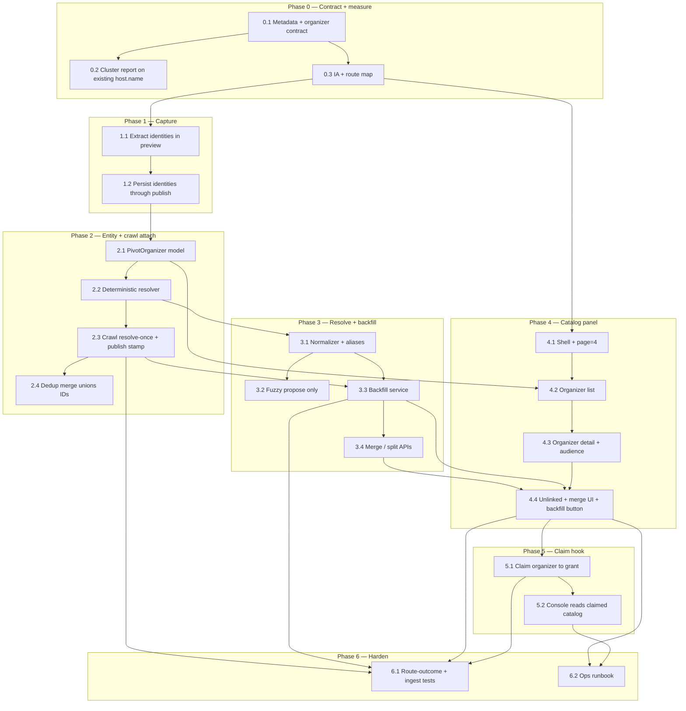

## How to use this document

Work through tasks **in order within each phase**. Soft dependencies are in [Execution order](#execution-order).

This plan is the **organizer identity** workstream. It is **separate from** campus Meridian `Org` / ClubDash, **orthogonal to** weekly drop / feed ranking, and **upstream of** Creator Console claim. [Creator console Phase 1](/strategy/just-go-creator-console-phase1-plan) already lets a granted user create `source: 'justgo'` listings; it does **not** attach scraped hosts to that user. This plan creates the join key.

<Warning>
**This file is the handoff.** Subsequent agents will not have your chat. If a choice, path, or leftover is not written here, it does not exist for the next agent. Status-only updates are not enough.
</Warning>

### Before you start (required)

1. Read this How-to, [Engineering conventions](#engineering-conventions-required), and the [Decision log](#decision-log-conversation--plan).
2. Read the [Handoff log](#handoff-log) and every **Implementation notes** / **As built** block on tasks **before** the one you are about to do — especially the immediately previous task and any task your work depends on in the mermaid graph.
3. Skim the [Task status ledger](#task-status-ledger). Do not start a task whose dependencies are still `pending` or `blocked` unless the graph marks them parallel-safe.
4. If a prior note says **Follow-up** or **Deviation**, treat it as part of your contract unless you explicitly supersede it in your own notes.

For every task:

1. Read that task’s **Context**, **Instructions**, and any notes already under it.
2. Follow [Engineering conventions](#engineering-conventions-required) ([backend](/backend/best-practices) + [frontend](/frontend/best-practices)) — do not invent parallel API/DB patterns.
3. Implement only what that task describes (avoid scope creep into consumer follow-organizer, public host pages, or native ticketing).
4. Run **Evaluation criteria** as a checklist before marking done.
5. **Write implementation notes in this file** (see [Agent completion](#agent-completion)) so the next agent can pick up without the PR thread.
6. Record blockers or deviations in the PR **and** in this file.

### Agent completion

<Warning>
**Required for agents:** When you finish, pause, or get blocked on a task, edit this markdown file in the same PR — do not leave the plan out of date. A task is not done if the **Implementation notes** stub is still there.
</Warning>

For the task you completed or paused:

1. In the [Task status ledger](#task-status-ledger), set the row to `done`, `blocked`, or `in_progress`. Put a one-line pointer in Notes (`doneAt`, PR link, or “see As built”).
2. Under the task heading, set **`Status:`** to match.
3. Check **Evaluation criteria** (`- [ ]` → `- [x]`) only for items you actually verified.
4. Replace that task’s **Implementation notes** stub with an **As built** block (template below). Subsequent agents read this before starting the next task.
5. Append a row to the [Handoff log](#handoff-log).
6. If you changed a locked decision, update the [Decision log](#decision-log-conversation--plan) — do not leave the contradiction implicit.

If work is partial or blocked, set **`Status:`** to `blocked` or `in_progress` and still write notes — what landed, what did not, exact files, how to resume. Do not mark `done`.

#### As built template (required)

Replace the task’s `_None yet._` stub with:

```md
**As built:**

| Concern | Landed |
| --- | --- |
| Files | `path/to/service.js`, `path/to/test.js` (new or touched) |
| API / exports | Function names, routes, stable `code` values |
| Choice | Any fork the instructions left open, and what you picked |
| Tests | What you ran and what they cover |
| Follow-up | Leftovers the next agent must know (or “none”) |

**Deviation:** (omit if none) What differs from Instructions, and why.

**Resume here:** (required if not `done`) Concrete next command / file / failing test.
```

Write for an agent who has **not** seen your session. Prefer paths, export names, and codes over narrative. If you discovered a footgun (ownership hole, missing index, “do not restyle X — use Y”), put it in **Follow-up** or a `<Warning>` under the task, the way [Creator console Phase 1](/strategy/just-go-creator-console-phase1-plan) does.

### Related docs

- [Pivot metadata contract](/strategy/pivot-metadata-contract) — `customFields.pivot.host` display snapshot; this plan amends it
- [Events marketplace pivot](/strategy/events-marketplace-pivot) — catalog host model (display vs technical); organizer loop was deferred
- [Just Go creator console — Phase 1](/strategy/just-go-creator-console-phase1-plan) — `createdByUserId` + grants; claim attaches here later
- [Just Go creator console — Phase 2](/strategy/just-go-creator-console-phase2-plan) — native ticketing; not a dependency
- [Pivot tenant ops dashboard plan](/strategy/pivot-tenant-ops-dashboard-plan) — Overview / Curation / Journeys / Drop deck / Catalog (`?page=4`)
- [Pivot weekly drop runbook](/strategy/pivot-weekly-drop-runbook#organizer-catalog-city-graph) — crawl attach, backfill, merge leftovers, claim before console
- [Pivot native-first discovery plan](/strategy/pivot-native-first-discovery-plan) — Luma / Partiful / generic-site crawl path this plan hooks
- [Backend best practices](/backend/best-practices) — `getModels` / `resolvePivotTenant`, auth, response shape, services, tests
- [Web client best practices](/frontend/best-practices) — `useFetch` / `postRequest` / `authenticatedRequest`, routing, SCSS

---

## Overall context

### Problem

Just Go is an event aggregator. Proprietary intent (interested / registered / passed, external opens, dwell, search) already lives on **events**. Event organizers are **not** creating on-platform, because adoption looks expensive: empty console, ops still gates publish, and we cannot show them the audience we already captured.

The join key is missing. Organizer is a **plain-text display field** (`customFields.pivot.host.name`). Different sources emit slightly different strings. Parsers see structured hosts (Partiful `hosts[]` + `isManaged`, Luma host objects, JSON-LD organizer, profile URLs) and then **collapse them** into `"Alice & Bob"`, often nulling image/profile. Event dedup is mature; organizer identity does not exist. Curation is **week-scoped** (`labEventsQuery(batchWeek)`), so ops cannot see a creator across batches.

### What we are building

A city-scoped **`PivotOrganizer`** entity, **crawl-time attribution** (extract per draft → resolve unique hosts once per crawl → stamp each event at publish), a **one-time / re-runnable backfill** over existing events, and a **Catalog panel** on the tenant dashboard that shows the entire organizer graph — not one drop week.

```text
Crawl / Lab / JSON / creator submit
  → preview keeps host.identities[] (stop dropping IDs)
  → resolve unique organizers once for the run
  → publishIngestEvent stamps host.organizerIds[]
  → host.name stays the display snapshot

Existing city Events
  → same resolver (backfill)
  → linked / ambiguous / unlinked

Pivot admin Catalog (?page=4)
  → all organizers across batch weeks
  → audience is a query by organizerId
  → merge / split / unlinked leftovers
  → backfill button

Later (Phase 5)
  → claim attaches PivotCreatorGrant to PivotOrganizer
  → Creator Console opens onto the already-ingested catalog
```

Consumer app and feed eligibility **do not change**. Cards still show `displayHost.name`.

### Product / architecture decisions (stable for this plan)

| Decision | Choice | Why |
| --- | --- | --- |
| Entity | New city-scoped `PivotOrganizer` via `getModels` | Events are per-city DBs; do **not** create a campus `Org` per venue |
| Display | Keep `host.name` forever as the card snapshot | Consumer + Lab already read it; never unique-index the string |
| Join key | `host.organizerIds[]` (ObjectId strings) | Multi-host events must not stay `"Alice & Bob"` as the only model |
| Technical host | Unchanged Pivot Catalog org per city | Satisfies Events-Backend `hostingId`; still hidden |
| When to attribute | **Crawl path**, not a weekly job | Structured hosts exist at preview; weekly sweep only has strings |
| Resolve vs stamp | Resolve unique hosts **once per crawl**; stamp **per event** at publish | Same page shows name variants together; Lab/JSON is a batch of one |
| Matching tiers | Hard ID → unique normalized name → fuzzy+corroboration (propose) → leftover unlinked | Do not invent a brand from a one-off string |
| Audience | **Live query** by `organizerId` (optional increment on intent write later) | Intents accrue after the drop; no weekly materialization |
| Backfill | Same resolver over existing Events; idempotent; no re-Firecrawl | Historical rows already dropped native IDs; pages have changed |
| Admin surface | New tenant-dashboard **Catalog** page (`?page=4`) | Curation is a week release queue; Sources is calendar hostnames |
| Catalog IA | Organizer-first + unlinked leftovers | A weekless event dump is Curation without a picker |
| Cross-city | Out of scope | City-scope first |
| Consumer | Untouched | No follow-organizer, no public host page |
| Claim | Phase 5 of this plan | Catalog + backfill must exist first so claim is not a blank workspace |

### Organizer contract (metadata amendment)

Amend [pivot-metadata-contract](/strategy/pivot-metadata-contract) in Task 0.1. Additive only.

#### `customFields.pivot.host` (event)

| Field | Type | Required | Notes |
| --- | --- | --- | --- |
| `name` | `string` | **Yes** (`staged` / `published`) | Display snapshot. Unchanged. |
| `imageUrl` | URL | No | Prefer persist when the parser has an avatar |
| `profileUrl` | URL | No | Prefer persist when the parser has a profile |
| **`organizerIds`** | `string[]` | No (empty until resolved) | `PivotOrganizer._id` values. Union on event dedup merge. |
| **`identities`** | `object[]` | No | Captured at preview even before an organizer exists |

`host.identities[]` item:

| Field | Type | Notes |
| --- | --- | --- |
| `provider` | `'luma' \| 'partiful' \| 'generic-site' \| 'justgo' \| 'manual'` | Source of this identity |
| `externalId` | `string?` | Native host id / slug when known |
| `profileUrl` | `string?` | Canonical profile URL (`partiful.com/u/…`, `luma.com/user/…`) |
| `name` | `string?` | Raw name from this identity (not the joined display string) |
| `imageUrl` | `string?` | Avatar for this identity |

#### `PivotOrganizer` (city DB)

| Field | Type | Notes |
| --- | --- | --- |
| `tenantKey` | `string` | City; denormalized for queries |
| `canonicalName` | `string` | Best display name |
| `normalizedName` | `string` | Lowercase, punctuation-folded; unique **when claimed as exact alias** — not globally unique |
| `aliases[]` | `{ name, normalized, source? }` | Observed strings |
| `kind` | `'person' \| 'brand' \| 'venue' \| 'unclear'` | Default `unclear` |
| `identities[]` | same shape as `host.identities` + `confidence` | Hard IDs live here |
| `imageUrl` | `string?` | |
| `claimedByUserId` | `ObjectId?` | GlobalUser; Phase 5 |
| `claimStatus` | `'unclaimed' \| 'pending' \| 'claimed'` | Default `unclaimed` |
| `lastResolvedAt` | `Date` | Last crawl or backfill touch |

Do **not** store weekly audience rollups on this document in v0. Catalog detail queries intents/interactions by the organizer’s event ids.

#### Resolution tiers (locked)

| Tier | Signal | Action |
| --- | --- | --- |
| 1 — hard ID | Normalized `profileUrl` or `(provider, externalId)`; `justgo` + `createdByUserId` | Auto-create / attach |
| 2 — exact alias | `normalizedName` unique in this city | Auto-attach if unique; else ambiguous |
| 3 — corroborated fuzzy | Name similarity + shared venue **or** recurring title **or** same image | **Propose** only — ops confirm in Catalog |
| 4 — leftover | Co-host soup, venue-as-host, one-offs | Stay unlinked |

### Engineering conventions (required)

All work in this plan **must** follow platform best practices. Do not invent parallel HTTP/DB patterns.

#### Backend — [best practices](/backend/best-practices)

| Concern | Rule for this plan |
| --- | --- |
| Tenant models (`Event`, `PivotOrganizer`, intents) | `resolvePivotTenant` → `connectToDatabase(tenantKey)` → `getModels({ db }, …)`. Never `mongoose.model()` / default connection. |
| New city model | Schema under `Meridian/backend/schemas/pivotOrganizer.js`; register in `getModelService.js` with explicit collection `pivotOrganizers`. |
| Global models | Not required for v0 organizers. `PivotCreatorGrant` stays global (already shipped). |
| Auth | `verifyToken` + `requirePlatformAdmin` on `/admin/pivot/tenants/:tenantKey/organizers*`. |
| Routes | Thin handlers on existing `pivotAdminRoutes.js` (or a dedicated router mounted the same way). Delegate to services. |
| Responses | `{ success: true, data?, message? }` / `{ success: false, message, code? }` with stable `code` values. |
| Services | `pivotOrganizerResolveService` (pure resolve + upsert), called from crawl/publish/backfill. Pass `req` or `{ db, school }`. |
| Dedup | Event merge **unions** `organizerIds` and `identities`. First-non-empty `host.name` may stay for display. |
| Tests | Unit for normalizer + resolver tiers; route-outcomes for Catalog APIs; ingest tests that identities survive preview → publish. |

#### Frontend (web) — [best practices](/frontend/best-practices)

| Concern | Rule for this plan |
| --- | --- |
| API reads | `useFetch` only |
| Mutations | `postRequest` / `authenticatedRequest` |
| Module home | `Meridian/frontend/src/pages/PlatformAdmin/PivotTenantDashboard/` — new `PivotTenantCatalogPage.jsx` |
| Routing | Same shell: `/platform-admin/pivot/:tenantKey?page=4` |
| Styling | Existing Pivot tenant dashboard SCSS / linear-btn patterns — not Creator Console flare |
| Curation | Do **not** add a weekless event table to Curation. Deep-link *from* Catalog *into* Curation for a week. |

#### Mobile consumer

| Concern | Rule for this plan |
| --- | --- |
| Scope | **No feature work.** `displayHost` stays `{ name, imageUrl?, profileUrl? }`. |

### Repositories touched

| Area | Path |
| --- | --- |
| Backend | `Meridian/backend/` — schema, resolver, ingest hooks, backfill, admin routes, tests |
| Frontend (ops) | `Meridian/frontend/src/pages/PlatformAdmin/PivotTenantDashboard/` — Catalog page |
| Docs | `Meridian-Mintlify/strategy/` — this plan + metadata contract amendment |
| Mobile | None |
| Creator console | Phase 5 only — list scraped events claimed to the grant |

### Out of scope (this plan)

- Consumer follow-organizer, public host profile, or feed ranking by host reputation
- Creating a campus `Org` per venue / Luma host
- Treating `PivotCitySource.host` (calendar hostname) as organizer identity
- Weekly audience materialization jobs
- Re-Firecrawling historical `sourceUrl`s to recover dropped host ids
- Eventbrite / Meetup native APIs
- Cross-city organizer graph
- Phase 2 native ticketing / `platformManaged: true`
- Replacing scrape supply or Curation’s week release workflow

---

## Execution order



---

## Task status ledger

| ID | Status | Notes |
| --- | --- | --- |
| 0.1 | done | doneAt: 2026-08-15; see As built |
| 0.2 | done | doneAt: 2026-08-15; nyc 585 events, 0% profileUrl; see As built |
| 0.3 | done | doneAt: 2026-08-15; routes locked in this task; menu stub is 4.1 |
| 1.1 | done | doneAt: 2026-08-15; draft field `hostIdentities`; see As built |
| 1.2 | done | doneAt: 2026-08-15; persist `host.identities`; see As built |
| 2.1 | done | doneAt: 2026-08-15; city model + partial unique on profileUrl; see As built |
| 2.2 | done | doneAt: 2026-08-15; tiers 1–2 only; see As built |
| 2.3 | done | doneAt: 2026-08-15; resolve-once cache + publish/creator stamp; see As built |
| 2.4 | done | doneAt: 2026-08-15; union organizerIds + existing-first host.name; see As built |
| 3.1 | done | doneAt: 2026-08-15; extend `utilities/pivotOrganizerName.js`; see As built |
| 3.2 | done | doneAt: 2026-08-15; `proposeOrganizerMerges` read-only; see As built |
| 3.3 | done | doneAt: 2026-08-15; city `PivotOrganizerBackfillRun` last-run; see As built |
| 3.4 | done | doneAt: 2026-08-15; tombstone + event-id split; see As built |
| 4.1 | done | doneAt: 2026-08-15; Catalog `?page=4` stub; see As built |
| 4.2 | done | doneAt: 2026-08-15; list API + Catalog table; audience detail-only; see As built |
| 4.3 | done | doneAt: 2026-08-15; dossier + live audience; Curation deep-link; see As built |
| 4.4 | done | doneAt: 2026-08-15; unlinked GET + merge/backfill UI; see As built |
| 5.1 | done | doneAt: 2026-08-15; ops-granted; unclaim then re-claim; see As built |
| 5.2 | done | doneAt: 2026-08-15; claimed scraped read-only + insights; see As built |
| 6.1 | done | doneAt: 2026-08-15; identity path + route 403/404 gaps; see As built |
| 6.2 | done | doneAt: 2026-08-15; runbook + tenant ops surface table; see As built |

### Handoff log

Newest row at the **top**. Every agent who touches this plan appends one row, including blocked / in-progress work.

| Date | Agent / PR | Task | What to know next |
| --- | --- | --- | --- |
| 2026-08-15 | agent | 6.2 | Ops path is in [weekly drop runbook](/strategy/pivot-weekly-drop-runbook#organizer-catalog-city-graph): crawl attach (no extra job) → first-city Backfill (`POST .../backfill` or `npm run backfill:pivot-organizers`) → merge leftovers / leave soup unlinked → grant then `POST .../claim`. Do not Firecrawl history. Tenant ops [surface table](/strategy/pivot-tenant-ops-dashboard-plan#surfaces) now lists Catalog `?page=4` (appended after Drop deck `?page=3`). Organizer identity workstream complete. |
| 2026-08-15 | agent | 6.1 | Write-path composition in `tests/unit/pivotOrganizerIdentityPath.test.js` (Partiful extract → resolve-once stamp → merge union; leftover `Alice & Bob` unlinked). Route-outcomes filled: unlinked/merge/claim **404**, split **403**, creator GET list/detail claimed `readOnly`. Re-ran existing normalizer / resolver / backfill / preview / publish / curation-run / duplicate / creator-listing suites — 281 passed. Do not snapshot city catalogs. Next: Task 6.2 ops runbook. |
| 2026-08-15 | agent | 5.2 | `listListings` / `getListing` include `createdByUserId` **or** `host.organizerIds` ∈ organizers claimed by this grant (`claimStatus: 'claimed'`, `activeOrganizerFilter`). Payload: `readOnly`, `access: 'owner'\|'claimed'`, list also `claimedOrganizerCount`. Scraped PATCH → `CREATOR_CLAIMED_READ_ONLY` (ingestStatus still `CREATOR_PUBLISH_FORBIDDEN` / `CREATOR_INGEST_STATUS_LOCKED`). Insights reuse the same `stats.intents` / `stats.analytics` / `stats.daily`. Home: claimed rows show a catalog chip; claimed-empty (count>0, no events) does **not** lead with “Start a listing”. Workspace hides Update + edit form when `readOnly`. Next: Task 6.1 route-outcome + ingest tests. |
| 2026-08-15 | agent | 5.1 | `POST .../organizers/:organizerId/claim` via `claimOrganizer` / `runClaimOrganizer`. Body `{ globalUserId }` (alias `userId`) requires an **active** `PivotCreatorGrant` for that user + tenant (`getActiveCreatorGrant`). Sets `claimedByUserId` + `claimStatus: 'claimed'`. Same user again is idempotent. Other user → `ORGANIZER_ALREADY_CLAIMED`. No grant / revoked / wrong city → `CREATOR_GRANT_REQUIRED` (409). Unclaim: same POST `{ unclaim: true }` (no grant required) → `unclaimed` + clear user. Reassign is two-step; no claim-to-other while claimed. Does **not** write Event `source` / `createdByUserId`. Merged tombstones 404. Next: Task 5.2 console reads claimed catalog. |
| 2026-08-15 | agent | 4.4 | `GET .../organizers/unlinked` **before** `/:organizerId`. Events with pivot + empty/missing `organizerIds`. Classifies `leftover` vs `ambiguous` (joined multi-host, or ≥2 active organizers share `normalizedName`). Payload also hangs `proposals` (`proposeOrganizerMerges`) and `lastBackfill` (no proposals route). Last-run stores capped `ambiguousNames[]`. Catalog `?page=4&filter=unlinked\|ambiguous` (ignore Curation leftovers like `missing-host`). Merge: path id is **target**, body `{ sourceOrganizerId }`; proposals merge `a`→`b`. Backfill button → `POST .../backfill` `{ force }`; errors stay visible. No Firecrawl. Next: Task 5.1 claim organizer to grant. |
| 2026-08-15 | agent | 4.3 | `GET .../organizers/:organizerId` via `getOrganizer` / `runGetOrganizer`. Hides merged (`ORGANIZER_NOT_FOUND`). Invalid id → `ORGANIZER_INVALID_ID`. Audience is a **live** unique-user query: `{ interested, registered, passed, externalOpens, repeatUsers }` (repeat = same userId on ≥2 events). Events reuse `loadIntentStatsByEventId` (no week filter), sorted `batchWeek` desc. UI: `?page=4&organizerId=` click-through; Curation link `?page=1&batchWeek=&eventId=` (`catalogCurationHref`). **Register `GET /unlinked` before this `:organizerId` route.** Next: Task 4.4 unlinked + merge UI + backfill button. |
| 2026-08-15 | agent | 4.2 | `GET /admin/pivot/tenants/:tenantKey/organizers` via `listOrganizers` / `runListOrganizers` in `pivotOrganizerCatalogService.js`. Hides `status: 'merged'`. Query: `q` (canonical + aliases), `claimStatus`, `source`, `sort=events\|weeks\|audience\|name` (default `events` desc). `sort=audience` is accepted but ranks like `events` — payload `audience: 'detail-only'`, no per-row audience. Limit default **100**, max **200**, `offset`. Bookmark `q` / `claimStatus` / `source` / `sort` on `?page=4` (do not use `filter` — reserved for 4.4 unlinked). Rows are display-only; `?organizerId=` is 4.3. Next: Task 4.3 organizer detail + audience query. |
| 2026-08-15 | agent | 4.1 | Catalog is a **sibling** menu item on `PivotTenantDashboard` (index 4), not a Curation tab or fleet Lab. `PIVOT_TENANT_CATALOG_PAGE = 4`. Appended — do not insert or `?page=0..3` bookmarks shift. City switcher already preserves `?page=`. No week picker. Stub empty state only — 4.2 replaces it with `GET .../organizers` (`useFetch`). Hide `status: 'merged'`. Next: Task 4.2 organizer list. |
| 2026-08-15 | agent | 3.4 | Merge/split in `pivotOrganizerCatalogService.js`. Tombstone: `status: 'merged'` + `mergedInto`; source **identities cleared** (partial unique on profileUrl). Resolve/propose use `status: { $ne: 'merged' }` (`activeOrganizerFilter`). Split is **event-id set** (`eventIds[]` required) + optional `identity` detach. Codes: `ORGANIZER_NOT_FOUND`, `ORGANIZER_MERGE_SELF`, `ORGANIZER_ALREADY_CLAIMED`, `ORGANIZER_ALREADY_MERGED`, `ORGANIZER_INVALID_ID`, `ORGANIZER_SPLIT_EMPTY`, `ORGANIZER_SPLIT_NO_EVENTS`, `ORGANIZER_IDENTITY_NOT_FOUND`. Catalog 4.2+ must hide `status: 'merged'`. Next: Task 4.1 Catalog shell `?page=4`. |
| 2026-08-15 | agent | 3.3 | `runOrganizerBackfill({ db, tenantKey, force })` + `POST /admin/pivot/tenants/:tenantKey/organizers/backfill`. Same `resolveOrganizers` (identity cache). Skip when `host.organizerIds` is already an **array** (incl. `[]`) unless `force`. Last-run is city `PivotOrganizerBackfillRun` (unique `tenantKey`) via `getLastOrganizerBackfill` — not TenantConfig. CLI: `npm run backfill:pivot-organizers -- --tenant=nyc`. No Firecrawl / no fuzzy stamp. Next: Task 3.4 merge / split APIs. |
| 2026-08-15 | agent | 3.2 | `proposeOrganizerMerges({ db, tenantKey })` in `pivotOrganizerCatalogService.js`. Read-only. Name Dice/Jaccard (`ORGANIZER_FUZZY_NAME_MIN = 0.72`) plus one corroboration (`shared-venue` / `shared-title-token` / `same-image`). Co-hosted events do **not** count as venue/title corroboration. No HTTP route yet — Catalog 4.4 should call this. Do **not** call from crawl/backfill to stamp. Next: Task 3.3 backfill (same `resolveOrganizers`, no Firecrawl, no fuzzy stamp). |
| 2026-08-15 | agent | 3.1 | Extended `utilities/pivotOrganizerName.js` (do not fork). Folds LLC/Inc/Ltd + `&`→`and`. `upsertOrganizerAlias` persists every distinct **raw** string (same normalized no longer skips). City suffixes not stripped. `looksLikeJoinedMultiHost` still leftover-gates on the raw string. Next: Task 3.2 fuzzy propose only (reuse this normalizer; do not auto-stamp). |
| 2026-08-15 | agent | 2.4 | `mergeIngestIntoExisting` unions `organizerIds` via `uniqueOrganizerIds` (existing first) and `host.identities` (already unioned). Empty incoming `[]` does **not** wipe existing ids. Display `hostName` is existing-if-present, else incoming. Next: Task 3.1 normalizer + aliases (extend `utilities/pivotOrganizerName.js`, do not fork). |
| 2026-08-15 | agent | 2.3 | Crawl: `attachOrganizerIdsToDrafts` after showtime rollup, once per distinct `identityKey`. `draft.organizerIds = []` means already resolved (ambiguous/leftover) — `publishIngestEvent` must **not** re-resolve when the field is an array. Lab/JSON fallback resolves a batch of one only when `organizerIds` is missing. Creator create stamps via `justgo` + `createdByUserId`. Run stats: `organizerResolved` / `organizerAmbiguous` / `organizerUnlinked` / `organizerUniqueIdentities`. Next: Task 2.4 union `organizerIds` on dedup merge. |
| 2026-08-15 | agent | 2.2 | `resolveOrganizers({ db, tenantKey, identities, displayName })` in `pivotOrganizerResolveService.js`. Re-exports `normalizeOrganizerName` / `normalizeProfileUrl` (do not fork). Joined `Alice & Bob` with no per-person identities → empty ids (tier 4), not a new organizer. Hard-ID miss **creates** even if a same-name row exists (no auto-merge). Creator stamp: `{ provider: 'justgo', externalId: createdByUserId, name }`. Next: Task 2.3 crawl resolve-once + publish stamp. |
| 2026-08-15 | agent | 2.1 | `PivotOrganizer` city model registered. Do **not** unique-index `normalizedName`. ProfileUrl uniqueness is a **partial** unique index (`identities.profileUrl: { $gt: '' }`), not sparse — sparse still indexes `null` and collides name-only rows. Writers must omit blank `profileUrl`. Next: Task 2.2 deterministic resolver. |
| 2026-08-15 | agent | 0.1–1.2 | Phase 0+1 landed. Draft field is `hostIdentities`; persisted as `host.identities`. First-pass normalizer is `utilities/pivotOrganizerName.js` (Task 3.1 should extend, not fork). nyc cluster: 585 events, 471 unique raw=normalized, **0% profileUrl/imageUrl**, **214 multi-host** (` & ` / ` and `). Next: Task 2.1 `PivotOrganizer` model. |
| — | — | — | No work started. Next: Task 0.1 (contract), 0.2 (cluster report) can run in parallel after 0.1’s field list is stable enough to measure. |

---

## Phase 0 — Contract + measure

### Task 0.1 — Metadata + organizer contract

**Status:** `done`

**As built:**

| Concern | Landed |
| --- | --- |
| Files | `Meridian-Mintlify/strategy/pivot-metadata-contract.mdx` |
| API / exports | Additive only: `host.organizerIds[]`, `host.identities[]`, `PivotOrganizer` city collection |
| Choice | Consumer `displayHost` stays `{ name, imageUrl?, profileUrl? }` — no `organizerIds` |
| Tests | Docs-only |
| Follow-up | none |

**Deviation:** none

**Evaluation criteria:**

- [x] Metadata contract merged with additive host fields + `PivotOrganizer` section
- [x] Explicit “do not unique-index `host.name`” and “do not weekly-job attribution”
- [x] Consumer `displayHost` shape unchanged in the contract

**Context:** Feed, Lab, and Curation already understand `host.name` / `displayHost`. Identity fields must be documented before ingest starts writing them, or parsers and publish will drift.

**Instructions:**

1. Update [pivot-metadata-contract](/strategy/pivot-metadata-contract):
   - Document `host.organizerIds[]` and `host.identities[]` as in [Organizer contract](#organizer-contract-metadata-amendment).
   - State that `host.name` remains the required display snapshot and is **not** a unique key.
   - State that consumer `displayHost` does **not** grow `organizerIds` in this plan.
   - Document resolution tiers and “leave unlinked” for tier 4.
   - Add a `PivotOrganizer` section (city collection, not a campus Org).
2. Do **not** change feed eligibility, `ingestStatus`, or `batchWeek` rules.
3. Do **not** create a campus `Org` per venue.

---

### Task 0.2 — Cluster report on existing `host.name`

**Status:** `done`

**As built:**

| Concern | Landed |
| --- | --- |
| Files | `Meridian/backend/utilities/pivotOrganizerName.js` (new), `Meridian/backend/migrations/clusterPivotHostNames.js` (new), `Meridian/backend/tests/unit/pivotOrganizerName.test.js`, `Meridian/backend/tests/unit/clusterPivotHostNames.test.js` |
| API / exports | `normalizeOrganizerName`, `looksLikeJoinedMultiHost`, `clusterHostNames`. CLI: `npm run cluster:pivot-host-names -- --tenant=nyc` (`--out=`, `--top=`) |
| Choice | First-pass fold only (trim, case, unicode punctuation, leading `the`). City suffixes **not** stripped. Task 3.1 should extend this file, not fork. |
| Tests | `npx jest tests/unit/pivotOrganizerName.test.js tests/unit/clusterPivotHostNames.test.js` |
| Follow-up | Task 3.1: add LLC/Inc/Ltd and `&`/`and` equivalence on the same export |

**nyc city summary (2026-08-15, read-only, production-shaped tenant DB):**

| Metric | Value |
| --- | --- |
| scanned | 585 |
| with `host.name` | 585 |
| unique raw | 471 |
| unique normalized | 471 |
| collisions (same normalized → multiple raw) | **0** |
| `profileUrl` present | **0 (0.0%)** |
| `imageUrl` present | **0 (0.0%)** |
| joined multi-host (` & ` / ` and `) | **214 (36.6%)** |
| top raw | `NYC Parks` 51 (generic-site, 2 weeks) |

Implication for later phases: historical rows have **no** surviving profile/image keys — backfill will be name-only. First-pass normalizer found no collisions in nyc, so review load is mostly the 214 co-host soup strings (tier 4 leftover), not punctuation variants.

<Warning>
Do not unique-index `host.name`. nyc already has 214 joined multi-host strings (`Alice & Bob`) that must stay unlinked (tier 4) until preview identities exist. Re-running the cluster script writes nothing.
</Warning>

**Deviation:** none

**Evaluation criteria:**

- [x] Script is idempotent / read-only
- [x] Output includes raw vs normalized counts, profileUrl coverage, multi-host count
- [x] At least one city summary recorded in the PR

**Context:** Before schema work, measure how dirty the strings are. This tells you auto-match vs review load and whether profile URLs survived ingest at all.

**Instructions:**

1. Add a one-off script under `Meridian/backend/migrations/` (or `scripts/`) that, for a `tenantKey`:
   - Loads every Event with `customFields.pivot`.
   - Groups by raw `host.name` and by a first-pass normalizer (trim, case, punctuation, leading `the`).
   - Counts events, distinct `batchWeek`s, distinct `source`s, how many have `host.profileUrl` / `host.imageUrl`.
   - Counts joined multi-host names (` & `).
   - Prints / writes JSON: unique raw, unique normalized, collisions (same normalized → multiple raw), profileUrl coverage, top N strings by event count.
2. Run against at least one real city DB (or a local copy) and put the summary numbers in this task’s **As built** (not only the PR).
3. Do **not** write organizer ids yet.

---

### Task 0.3 — Information architecture + route map

**Status:** `done`

**As built:**

| Concern | Landed |
| --- | --- |
| Files | This plan only (route tables already under this task). No `PivotTenantDashboard.jsx` change — that is Task 4.1. |
| API / exports | Locked prefix `/admin/pivot/tenants/:tenantKey/organizers*`. Frontend `?page=4`. Services: `pivotOrganizerResolveService.js`, `pivotOrganizerBackfillService.js`, `pivotOrganizerCatalogService.js`. Module: `PivotTenantCatalogPage.jsx`. |
| Choice | Catalog is **not** a Curation tab and **not** fleet Lab Catalog. Curation stays `?page=1&batchWeek=`. No ClubDash / campus Org routes. |
| Tests | Docs-only |
| Follow-up | Task 4.1 added the menu stub. Task 6.2 linked Catalog on the tenant ops dashboard plan surface table. |

**Deviation:** none

**Evaluation criteria:**

- [x] Routes and API prefix documented in this file (this task) and not duplicated under Curation
- [x] No new ClubDash / campus Org routes

**Context:** Lock names so Catalog does not land inside Curation’s week picker or fleet Lab.

**Instructions:**

1. Lock route map (adjust only with plan amendment):

| Surface | Route (locked) |
| --- | --- |
| Catalog list | `/platform-admin/pivot/:tenantKey?page=4` |
| Catalog detail (query) | `/platform-admin/pivot/:tenantKey?page=4&organizerId=` |
| Unlinked leftovers | `/platform-admin/pivot/:tenantKey?page=4&filter=unlinked` |
| Curation (existing) | `?page=1&batchWeek=` — deep-link *target*, not the catalog |

2. Lock API prefix (all `verifyToken` + `requirePlatformAdmin`):

| Method | Path |
| --- | --- |
| `GET` | `/admin/pivot/tenants/:tenantKey/organizers` |
| `GET` | `/admin/pivot/tenants/:tenantKey/organizers/unlinked` |
| `GET` | `/admin/pivot/tenants/:tenantKey/organizers/:organizerId` |
| `POST` | `/admin/pivot/tenants/:tenantKey/organizers/backfill` |
| `POST` | `/admin/pivot/tenants/:tenantKey/organizers/:organizerId/merge` |
| `POST` | `/admin/pivot/tenants/:tenantKey/organizers/:organizerId/split` |
| `POST` | `/admin/pivot/tenants/:tenantKey/organizers/:organizerId/claim` |

3. Lock frontend module: `PivotTenantCatalogPage.jsx` (+ SCSS) in `PivotTenantDashboard/`.
4. Lock service names: `pivotOrganizerResolveService.js`, `pivotOrganizerBackfillService.js`, `pivotOrganizerCatalogService.js`.
5. Update `PivotTenantDashboard.jsx` menu stub in Task 4.1 — this task only documents the lock.

---

## Phase 1 — Capture

### Task 1.1 — Extract identities in preview

**Status:** `done`

**As built:**

| Concern | Landed |
| --- | --- |
| Files | `Meridian/backend/utilities/pivotHostIdentity.js` (new), `Meridian/backend/services/pivotIngestPreviewService.js`, `Meridian/backend/services/pivotSiteScrapeService.js`, `Meridian/backend/tests/unit/pivotHostIdentity.test.js`, `Meridian/backend/tests/unit/pivotIngestPreviewService.test.js` |
| API / exports | Draft field is **`hostIdentities`** (matches `hostName`). Helpers: `identitiesFromPartifulHosts`, `identitiesFromLumaHosts`, `identitiesFromJsonLdOrganizer`, `identityFromDisplayName`, `unionHostIdentities`, `isInvalidHostName` (moved here; preview re-exports). |
| Choice | Fallback identity from joined `hostName` only when no per-person rows exist — do not add `"Alice & Bob"` as a third identity. Partiful `isManaged` hosts are listed first; others kept. Generic-site: `{ provider: 'generic-site', name }` only. |
| Tests | Multi-host Partiful/Luma/JSON-LD → N identities + one joined `hostName`. Invalid platform names filtered. |
| Follow-up | none |

**Deviation:** none

<Warning>
Drafts use `hostIdentities`. Publish persists `customFields.pivot.host.identities`. Do not add the joined `hostName` as an extra identity when per-person rows already exist.
</Warning>

**Context:** `pivotIngestPreviewService` already walks Partiful `hosts[]`, Luma host objects, and JSON-LD organizers, then `joinHostNames` and often sets `hostImageUrl: null`. The gold keys die here.

**Instructions:**

1. On each ingest draft, add `hostIdentities: []` (or `identities`) **without** removing `hostName`.
2. Partiful: one identity per host (prefer `isManaged` first, but keep others). Capture name, profile path / id if present, avatar if present.
3. Luma: one identity per host object. Capture `name` / first+last, `avatar_url`, any user id / slug on the object or profile URL.
4. JSON-LD: one identity per organizer node (do not join into a single identity).
5. Generic-site: one identity from LLM `hostName` with `provider: 'generic-site'` only — no fake externalId.
6. Keep `hostName` as the joined display string for cards (existing `joinHostNames` behavior).
7. Unit tests: multi-host Partiful/Luma pages produce N identities + one joined `hostName`; invalid platform names still filtered.

**Evaluation criteria:**

- [x] Drafts from Luma / Partiful / JSON-LD include `identities[]` with per-person/org rows
- [x] `hostName` still populated for existing publish validation
- [x] Unit tests cover join-vs-identities and invalid host filter

---

### Task 1.2 — Persist identities through publish

**Status:** `done`

**As built:**

| Concern | Landed |
| --- | --- |
| Files | `pivotIngestPublishService.js`, `pivotIngestDuplicateService.js`, `pivotCurationRunService.js`, `pivotCreatorListingService.js`, `pivotLabEventsService.js`, `migrations/importPivotEventsJson.js`, `PivotLab/pivotJsonImportUtils.js`, `PivotLab/PivotLabPage.jsx` |
| API / exports | Persist `host.identities`. `mergeDraftWithOverrides` no longer forces `hostImageUrl: null`. `displayFieldsFromIdentities` fills image/profile from primary identity when missing. Merge unions identities (existing first). Lab serialize exposes `hostIdentities` / `organizerProfileUrl`. |
| Choice | Creator create with omitted identities → `[{ provider: 'justgo', name }]`. Explicit `[]` stays empty. `organizerIds` not written. |
| Tests | preview → publish keeps identities + fills image; merge unions both sides; creator empty-array OK; JSON import/export round-trip |
| Follow-up | Task 2.4 still owns `organizerIds` union. Catalog edit modal does not send identities (update leaves existing). |

**Deviation:** none

**Context:** `publishIngestEvent` writes `customFields.pivot.host` and currently often nulls `hostImageUrl`. Curation upserts pass `hostName` only.

**Instructions:**

1. Persist `host.identities` on create and on merge (union by `provider+externalId` or `profileUrl` or raw name).
2. Persist `host.profileUrl` / `host.imageUrl` from the primary identity when missing (do not overwrite a better existing image with null).
3. Thread identities through curation upsert overrides, Lab URL publish, JSON import, and creator listing create/update.
4. `organizerIds` may be absent until Phase 2 — do not block publish.
5. Tests: preview → publish round-trip keeps identities; merge does not drop the other side’s identities.

**Evaluation criteria:**

- [x] Published events store `host.identities` when preview had them
- [x] Publish no longer clobbers a known image/profile with `null`
- [x] Creator / JSON / Lab paths all accept identities (empty array OK)

---

## Phase 2 — Entity + crawl attach

### Task 2.1 — `PivotOrganizer` model

**Status:** `done`

**As built:**

| Concern | Landed |
| --- | --- |
| Files | `Meridian/backend/schemas/pivotOrganizer.js` (new), `Meridian/backend/services/getModelService.js`, `Meridian/backend/tests/unit/pivotOrganizerSchema.test.js` (new) |
| API / exports | `getModels(req, 'PivotOrganizer')` → collection `pivotOrganizers`. Schema exports `PIVOT_ORGANIZER_KINDS`, `PIVOT_ORGANIZER_CLAIM_STATUSES`, `PIVOT_ORGANIZER_IDENTITY_PROVIDERS` (re-export of `IDENTITY_PROVIDERS` from `utilities/pivotHostIdentity.js`) |
| Choice | Identity `confidence` is optional `Number` 0–1. `kind` default `unclear`, `claimStatus` default `unclaimed`. No `status`/`mergedInto` tombstone yet (Task 3.4). Blank `profileUrl` / `externalId` / `imageUrl` omitted via setters. |
| Tests | `npx jest tests/unit/pivotOrganizerSchema.test.js` — getModels registration, index keys, validators/enums, same-city `normalizedName` collision allowed, same `profileUrl` rejected, cross-city profileUrl allowed, no `Org` writes |
| Follow-up | Task 2.2: omit empty `identities.profileUrl` on upsert or the partial unique index will not see the row (and a blank string must never be stored). Do not unique-index `normalizedName`. |

**Deviation:** Instructions allowed a unique **sparse** index on `(tenantKey, identities.profileUrl)`. On MongoDB that compound still indexes `null` for name-only rows (`E11000` on the second insert). The unique index uses `partialFilterExpression: { 'identities.profileUrl': { $gt: '' } }` instead. Same intent: unique only when a real profile URL exists.

<Warning>
Do not unique-index `normalizedName`. Do not use a sparse unique on `(tenantKey, identities.profileUrl)` — it collides name-only organizers. Persist hard IDs with omitted empty `profileUrl`.
</Warning>

**Context:** City-scoped entity. Same registration pattern as `PivotEventIntent`.

**Instructions:**

1. Add `Meridian/backend/schemas/pivotOrganizer.js` per [Organizer contract](#organizer-contract-metadata-amendment).
2. Register in `getModelService.js`: model `PivotOrganizer`, collection `pivotOrganizers`.
3. Indexes:
   - `{ tenantKey: 1, 'identities.profileUrl': 1 }`
   - `{ tenantKey: 1, 'identities.provider': 1, 'identities.externalId': 1 }`
   - `{ tenantKey: 1, normalizedName: 1 }`
   - `{ tenantKey: 1, claimStatus: 1 }`
4. Soft uniqueness: do **not** unique-index `normalizedName` (collisions are the product). Unique sparse index on `(tenantKey, identities.profileUrl)` is OK if empty profiles are omitted.
5. No campus `Org` writes.

**Evaluation criteria:**

- [x] `getModels(req, 'PivotOrganizer')` works on a pivot city connection
- [x] Schema validators + indexes as specified
- [x] No new `Org` documents created in tests

---

### Task 2.2 — Deterministic resolver

**Status:** `done`

**As built:**

| Concern | Landed |
| --- | --- |
| Files | `Meridian/backend/services/pivotOrganizerResolveService.js` (new), `Meridian/backend/tests/unit/pivotOrganizerResolveService.test.js` (new) |
| API / exports | `resolveOrganizers({ db, tenantKey \| school, identities, displayName })` → `{ organizerIds, created, attached, ambiguous }`. Re-exports `normalizeOrganizerName`, `normalizeProfileUrl`. Also `identitiesToResolve`, `ALIAS_SOURCE` (`'resolve'`). |
| Choice | Display-name-only fallback uses `identityFromDisplayName(name, 'manual')`. Joined multi-host (`looksLikeJoinedMultiHost`) with no per-person identities returns empty (tier 4 leftover) — not `ambiguous`. Hard-ID miss creates a new row even when `normalizedName` already exists (Catalog merge is 3.4). `justgo` + `createdByUserId` is `{ provider: 'justgo', externalId }`. Blank `profileUrl` omitted via `normalizeHostIdentity`. Sequential per identity inside one call; E11000 on profileUrl unique → re-find + attach. |
| Tests | `npx jest tests/unit/pivotOrganizerResolveService.test.js` — hard-ID create/attach (`lu.ma`→`luma.com`, partiful profile, justgo externalId), unique name create/attach (`The Chapel`/`Chapel`), ambiguous does not stamp, co-hosts → two ids, leftover `Alice & Bob` creates nothing |
| Follow-up | Task 2.3: cache `resolveOrganizers` **once per distinct identity** for the crawl; stamp `host.organizerIds` from the result. Creator path must pass a `justgo` identity with `externalId: createdByUserId`. Do not treat empty `organizerIds` as a publish failure (ambiguous + leftover). |

**Deviation:** none vs locked tiers. Leftover joined names are out of `ambiguous` on purpose (tier 4 ≠ tier 2 collision).

<Warning>
Do not auto-merge a new hard ID onto an existing name-only organizer — that creates a second row until Task 3.4. Do not add the joined `host.name` (`Alice & Bob`) as an alias when per-person identities exist. Writers must keep using `normalizeHostIdentity` so blank `profileUrl` is omitted.
</Warning>

**Context:** Shared function used by crawl, single publish, and backfill. v0 is tiers 1–2 only.

**Instructions:**

1. Add `pivotOrganizerResolveService.js`:
   - `normalizeOrganizerName(name)` (shared with Task 0.2 / 3.1).
   - `normalizeProfileUrl(url)` (host + path; `lu.ma` → `luma.com`).
   - `resolveOrganizers({ db, tenantKey, identities, displayName })` → `{ organizerIds, created, attached, ambiguous }`.
2. Tier 1: match existing organizer on profileUrl or `(provider, externalId)`. If none, create.
3. Tier 2: if no hard ID, match unique `normalizedName` in city. If 0, create. If 2+, return `ambiguous` and **do not** attach.
4. Always add the observed raw name to `aliases` and refresh `lastResolvedAt`.
5. Multi-identity drafts return **multiple** organizer ids (do not merge Alice and Bob because they co-hosted).
6. Unit tests for each tier, including ambiguous name and multi-host.

**Evaluation criteria:**

- [x] Hard ID attach/create covered
- [x] Unique name attach/create covered
- [x] Ambiguous name does not stamp
- [x] Co-hosts resolve to two organizers

---

### Task 2.3 — Crawl resolve-once + publish stamp

**Status:** `done`

**As built:**

| Concern | Landed |
| --- | --- |
| Files | `pivotOrganizerResolveService.js` (`attachOrganizerIdsToDrafts`, `uniqueOrganizerIds`), `pivotCurationRunService.js`, `pivotIngestPublishService.js`, `pivotCreatorListingService.js`, `schemas/pivotCurationRun.js`, tests: `pivotOrganizerResolveService.test.js`, `pivotCurationRunService.test.js`, `pivotIngestPublishService.test.js`, `pivotCreatorListingService.test.js` |
| API / exports | `attachOrganizerIdsToDrafts({ db, tenantKey, drafts, stats })` mutates `draft.organizerIds`. Publish writes `host.organizerIds`. Run stats: `organizerResolved`, `organizerAmbiguous`, `organizerUnlinked`, `organizerUniqueIdentities`. Ambiguous appends a warning on `stats.message`. |
| Choice | Empty `organizerIds: []` on a draft means resolve already ran — publish skips fallback. Missing/undefined → Lab/JSON/single-URL calls `resolveOrganizers` for a batch of one. Creator always resolves `{ provider: 'justgo', externalId: createdByUserId }` in addition to any host identities; explicit empty identities on the event are unchanged. Resolve failure never fails ingest. |
| Tests | Shared Partiful profileUrl → one organizer, both drafts stamped (`cacheSize === 1`). ingestEntries calls attach once after rollup and passes ids to publish. Lab URL publish fallback stamps. Ambiguous crawl/publish still upserts. Creator create stamps justgo + `createdByUserId`. |
| Follow-up | Task 2.4: `mergeIngestIntoExisting` still spreads incoming `organizerIds` and does **not** union with the existing event. Do not treat `organizerIds: []` as “not yet resolved”. |

**Deviation:** none

<Warning>
`draft.organizerIds = []` is a resolved leftover/ambiguous stamp. Re-resolving in `publishIngestEvent` would undo crawl resolve-once. Only call the fallback when `organizerIds` is missing (not an array).
</Warning>

**Context:** `executeCurationRun` / `upsertDiscoveredEntry` already preview a URL into drafts, then call `publishIngestEvent` per row. Showtime rollup already runs on the draft list. Organizer resolve should sit next to that, not in a cron.

**Instructions:**

1. After preview (and showtime rollup), collect unique identities across the run’s drafts. Call `resolveOrganizers` **once per distinct identity** (cache in-memory for the run).
2. Each draft gets `organizerIds` from its identities (and tier-2 name fallback when identities are empty).
3. `publishIngestEvent` stamps `host.organizerIds` from the draft / overrides. If missing, it may call the resolver for a batch of one (Lab URL, JSON row, creator submit).
4. Do not fail the crawl if resolve is ambiguous — publish the event, leave `organizerIds` empty, record a warning on the run stats if cheap.
5. Tests: one Partiful-like draft list with two events / one shared profileUrl creates one organizer and stamps both events; Lab single-URL publish still stamps.

**Evaluation criteria:**

- [x] Curation run resolves unique hosts once, not N independent fuzzy passes
- [x] `publishIngestEvent` always persists `organizerIds` when resolve returns them
- [x] Ambiguous events still ingest
- [x] Creator listing create also stamps (tier 1 via `createdByUserId` and/or name)

---

### Task 2.4 — Dedup merge unions IDs

**Status:** `done`

**As built:**

| Concern | Landed |
| --- | --- |
| Files | `Meridian/backend/services/pivotIngestDuplicateService.js`, `Meridian/backend/tests/unit/pivotIngestDuplicateService.test.js` |
| API / exports | `mergeIngestIntoExisting` now sets `organizerIds: uniqueOrganizerIds(existing.host.organizerIds, incoming.organizerIds)` and `hostName: existing \|\| incoming`. Identities still `unionHostIdentities(existing, incoming)` (Task 1.2). |
| Choice | Empty incoming `organizerIds: []` is a resolved leftover, not a wipe — union keeps existing ids. Showtime rollup still runs **before** resolve-once, so it does not need to union organizerIds. |
| Tests | `npx jest tests/unit/pivotIngestDuplicateService.test.js tests/unit/pivotIngestPublishService.test.js` — fingerprint merge keeps both organizer ids + both identities; empty incoming does not clobber; existing display name wins; incoming name used only when existing is blank |
| Follow-up | none for merge. Task 3.1 extends `utilities/pivotOrganizerName.js` (do not fork). |

**Deviation:** none

<Warning>
Do not let incoming `organizerIds: []` replace existing ids on merge. Display `host.name` stays first-non-empty **existing**, then incoming — never unique-index that string.
</Warning>

**Context:** `mergeIngestIntoExisting` keeps `hostName: incoming || existing`. That is wrong for identity.

**Instructions:**

1. On event dedup merge, union `host.organizerIds` and `host.identities`.
2. Display `host.name`: keep existing if present, else incoming (unchanged display rule).
3. Tests: two sources for the same fingerprint produce one event with both organizer ids if they differed; identities not dropped.

**Evaluation criteria:**

- [x] Merge unions `organizerIds` / `identities`
- [x] Existing ingest duplicate tests still pass
- [x] First-non-empty display name still works

---

## Phase 3 — Resolve + backfill

### Task 3.1 — Normalizer + aliases

**Status:** `done`

**As built:**

| Concern | Landed |
| --- | --- |
| Files | `Meridian/backend/utilities/pivotOrganizerName.js` (extended, not forked), `Meridian/backend/services/pivotOrganizerResolveService.js` (`upsertOrganizerAlias` on create/touch), `Meridian/backend/migrations/clusterPivotHostNames.js` (comment only), tests: `pivotOrganizerName.test.js`, `clusterPivotHostNames.test.js`, `pivotOrganizerResolveService.test.js` |
| API / exports | `normalizeOrganizerName`, `looksLikeJoinedMultiHost`, `upsertOrganizerAlias`. Resolve re-exports `normalizeOrganizerName` + `upsertOrganizerAlias`. Cluster + resolve import the utility — backfill (3.3) must too. |
| Choice | `&` / fullwidth ampersand → ` and ` (so `Rhythm & Blues` ≡ `Rhythm and Blues` → `rhythm and blues`). Trailing `inc` / `llc` / `ltd` stripped after punctuation fold (optional comma/period already gone), up to 3 times. Distinct raw aliases are kept even when `normalized` matches (`The Chapel` + `Chapel`). |
| Tests | `npx jest tests/unit/pivotOrganizerName.test.js tests/unit/clusterPivotHostNames.test.js tests/unit/pivotOrganizerResolveService.test.js` — apostrophes, `the`, LLC/Inc/Ltd, `&`/`and`, city suffix **not** stripped, alias upsert, LLC attach, `roof records nyc` creates a second row |
| Follow-up | Task 3.2 / 3.3: import `normalizeOrganizerName` from `utilities/pivotOrganizerName.js`. Joined `Alice & Bob` is still leftover via **raw** `looksLikeJoinedMultiHost` — do not treat the folded `alice and bob` as a brand. Do not strip city names. |

**Deviation:** none

<Warning>
Do not fork a second normalizer in resolve or backfill. Do not unique-index `normalizedName`. Do not strip city suffixes (`Roof Records` ≠ `roof records nyc`). `upsertOrganizerAlias` keys on the **raw** string — same normalized form with a new spelling must be stored.
</Warning>

**Context:** Tier 2 quality depends on a boring, tested normalizer — not an LLM.

**Instructions:**

1. Extract `normalizeOrganizerName` to `utilities/pivotOrganizerName.js` (or keep in the resolve service and re-export).
2. Fold: trim, lowercase, Unicode punctuation, leading `the `, trailing `, inc` / `llc` / `ltd`, collapse whitespace, `&` / `and` equivalence for uniqueness checks **of a single name** (do not split co-hosts here — splitting is Task 1.1).
3. Persist every observed raw string on `aliases[]`.
4. Unit tests for the fixtures you care about (`Gabe's` vs `Gabes`, `Roof Records` vs `roof records nyc` should **not** auto-merge without a shared hard ID — `nyc` suffix is a different normalized form unless you explicitly strip city suffixes; **do not** strip city names in v0).

**Evaluation criteria:**

- [x] Shared normalizer used by resolve + backfill + cluster script
- [x] Unit tests for apostrophes, case, `the`, LLC
- [x] City suffix is **not** stripped (avoids false merges)

---

### Task 3.2 — Fuzzy propose only

**Status:** `done`

**As built:**

| Concern | Landed |
| --- | --- |
| Files | `Meridian/backend/services/pivotOrganizerCatalogService.js` (new), `Meridian/backend/utilities/pivotEventSimilarityUtils.js` (export `stringSimilarity` + `tokenJaccard`), `Meridian/backend/tests/unit/pivotOrganizerCatalogService.test.js` (new) |
| API / exports | `proposeOrganizerMerges({ db, tenantKey \| school })` → `{ proposals: [{ a, b, score, reasons }] }`. `a`/`b` are `{ organizerId, canonicalName, normalizedName }`. Reasons: `name-similarity` plus ≥1 of `shared-venue` / `shared-title-token` / `same-image`. Constant `ORGANIZER_FUZZY_NAME_MIN` (`0.72`). **No HTTP route** (locked table has none; Catalog 4.4 calls the service). |
| Choice | Threshold 0.72 (not event `titleMin` 0.86) because organizer names are short. Recurring title token = appears on ≥2 exclusive events of one side and ≥1 of the other. Venue/title/image corroboration uses events that list A **xor** B — a co-hosted event does not count. Organizer-level `imageUrl` / `identities[].imageUrl` still count. |
| Tests | `npx jest tests/unit/pivotOrganizerCatalogService.test.js` — no propose without corroboration; shared venue / image / recurring title do propose; dissimilar names do not; co-host-only does not; `Roof Records` vs `roof records nyc` does not without corroboration; `organizerIds` unchanged |
| Follow-up | Task 3.3 must **not** stamp from proposals. Task 4.4 renders `proposals`. Do not add a proposals route unless you amend the Task 0.3 lock table. |

**Deviation:** none vs “API can 501 or return `[]`” — no route shipped (nothing in the locked prefix to hang it on).

<Warning>
Do not call `proposeOrganizerMerges` from crawl, publish, or backfill to write `organizerIds`. Co-hosts on one event are not venue/title evidence they are the same person.
</Warning>

**Context:** Event similarity utilities already exist. Reuse, do not start a new ML stack. v0 must not auto-stamp fuzzy matches.

**Instructions:**

1. Add `proposeOrganizerMerges({ db, tenantKey })` (or per-crawl `proposeWithin(identities)`):
   - Candidate pairs with high name Dice/Jaccard (reuse `pivotEventSimilarityUtils` patterns).
   - Require **one** corroboration: shared venue on ≥1 event, shared recurring title token, or same `imageUrl`.
2. Return proposals `{ a, b, score, reasons }`. Do **not** write `organizerIds`.
3. Catalog (Task 4.4) will show these. Until then, API can 501 or return `[]`.
4. Tests: similar names without corroboration do not propose; with shared venue they do.

**Evaluation criteria:**

- [x] No auto-attach on fuzzy
- [x] Corroboration required
- [x] Unit tests for propose / do-not-propose

---

### Task 3.3 — Backfill service

**Status:** `done`

**As built:**

| Concern | Landed |
| --- | --- |
| Files | `schemas/pivotOrganizerBackfillRun.js` (new), `services/pivotOrganizerBackfillService.js` (new), `services/getModelService.js`, `routes/pivotAdminRoutes.js`, `migrations/backfillPivotOrganizers.js` (new), `package.json` script `backfill:pivot-organizers`, tests: `tests/unit/pivotOrganizerBackfillService.test.js`, `tests/route-outcomes/pivotAdminRoutes.outcomes.test.js` |
| API / exports | `runOrganizerBackfill({ db, tenantKey, force, pageSize })` → `{ scanned, linked, skipped, ambiguous, unlinked, createdOrganizers, lastBackfill }`. `backfillOrganizers(req, { tenantKey, force })` for the route. `getLastOrganizerBackfill({ db, tenantKey })`. `identitiesFromStoredHost(host, source)`. `POST /admin/pivot/tenants/:tenantKey/organizers/backfill` body `{ force?: boolean }`. CLI `--tenant=` `--force`. |
| Choice | Last-run is a **city** singleton `PivotOrganizerBackfillRun` (`pivotOrganizerBackfillRuns`, unique `tenantKey`) — not a TenantConfig field. Skip when `host.organizerIds` is already an **array** (empty leftover counts as resolved). Historical identities: `host.identities` if present, else `{ provider, name, profileUrl, imageUrl }` from snapshot + `pivot.source`. Page size 100 (`_id` cursor). |
| Tests | `npx jest tests/unit/pivotOrganizerBackfillService.test.js tests/route-outcomes/pivotAdminRoutes.outcomes.test.js` — shared profileUrl links once; colliding names stay ambiguous; second run skipped; `force` re-stamps; joined leftover unlinked; POST 200 / 404 / 403 |
| Follow-up | Task 4.4 Backfill button → this POST; show `getLastOrganizerBackfill` counts. Task 3.4 merge/split. Do **not** stamp from `proposeOrganizerMerges`. |

**Deviation:** Outcome includes `skipped` (and `lastBackfill`) in addition to the specified `{ linked, ambiguous, unlinked, scanned, createdOrganizers }` so Catalog can show already-resolved rows.

<Warning>
`host.organizerIds: []` is a resolved leftover/ambiguous stamp — backfill skips it without `force` (same as crawl publish). Do not re-fetch `sourceUrl`. Do not call `proposeOrganizerMerges` from this path.
</Warning>

**Context:** Crawl-time attach only covers the next ingest. Adoption needs past weeks. Historical rows often have only `host.name` (and sometimes `profileUrl`).

**Instructions:**

1. Add `pivotOrganizerBackfillService.js`:
   - Walk all Events with `customFields.pivot` for the city (paged).
   - Build identities from stored `host.identities` if present, else from `profileUrl` + `name` + `source`.
   - Call the same `resolveOrganizers`.
   - Stamp `organizerIds` only for non-ambiguous results.
   - Skip events that already have `organizerIds` unless `force=true`.
2. Outcomes: `{ linked, ambiguous, unlinked, scanned, createdOrganizers }`.
3. Persist last-run summary (tenant config field or a small `PivotOrganizerBackfillRun` global/city doc — pick one, document in PR). Prefer a city doc via `getModels` if you need history; a single `lastBackfill` on tenant pivot settings is enough for v0.
4. `POST /admin/pivot/tenants/:tenantKey/organizers/backfill` (`requirePlatformAdmin`). Optional CLI wrapper that calls the service (same as other pivot migrations).
5. **Do not** re-fetch `sourceUrl` / Firecrawl.
6. Idempotent. Re-runnable after merge rules change (`force` re-resolves).
7. Tests: fixture events with shared profileUrl link; colliding names stay unlinked/ambiguous; second run is a no-op without `force`.

**Evaluation criteria:**

- [x] Same resolver as crawl
- [x] No HTTP/Firecrawl in the backfill path
- [x] Admin POST returns outcome counts
- [x] Idempotent without `force`

---

### Task 3.4 — Merge / split APIs

**Status:** `done`

**As built:**

| Concern | Landed |
| --- | --- |
| Files | `schemas/pivotOrganizer.js` (`status`, `mergedInto`, `activeOrganizerFilter`), `services/pivotOrganizerResolveService.js` (skip tombstones), `services/pivotOrganizerCatalogService.js` (`mergeOrganizers` / `splitOrganizer` / `runMergeOrganizers` / `runSplitOrganizer`), `routes/pivotAdminRoutes.js`, tests: `pivotOrganizerMergeSplit.test.js`, `pivotOrganizerSchema.test.js`, `pivotOrganizerResolveService.test.js`, `pivotAdminRoutes.outcomes.test.js` |
| API / exports | `POST .../organizers/:organizerId/merge` body `{ sourceOrganizerId }`. `POST .../organizers/:organizerId/split` body `{ eventIds, newCanonicalName?, identity? }`. Codes: `ORGANIZER_NOT_FOUND`, `ORGANIZER_MERGE_SELF`, `ORGANIZER_ALREADY_CLAIMED`, `ORGANIZER_ALREADY_MERGED`, `ORGANIZER_INVALID_ID`, `ORGANIZER_SPLIT_EMPTY`, `ORGANIZER_SPLIT_NO_EVENTS`, `ORGANIZER_IDENTITY_NOT_FOUND`. Schema: `PIVOT_ORGANIZER_STATUSES` (`active` \| `merged`), `activeOrganizerFilter(tenantKey)`. |
| Choice | Tombstone, not delete. Split is **event-id set** (open question #2); optional `identity` is detached onto the new row (save source first so the profileUrl unique index is free). Unclaimed target inherits a claimed source; two different claimed users → 409. Idempotent if source already `mergedInto` this target. |
| Tests | `npx jest tests/unit/pivotOrganizerMergeSplit.test.js tests/unit/pivotOrganizerSchema.test.js tests/unit/pivotOrganizerResolveService.test.js tests/route-outcomes/pivotAdminRoutes.outcomes.test.js` — event rewrite + tombstone; claimed guard; merge-self / not-found; split detaches identity + only selected events; resolve ignores tombstones; POST 200 / 409 / 403 |
| Follow-up | Task 4.2 list must filter `status: { $ne: 'merged' }` (or `activeOrganizerFilter`). Task 4.4 merge UI calls this POST. Do not hard-delete tombstones. |

**Deviation:** none vs preferred tombstone + event-id split.

<Warning>
Clear source `identities[]` before copying them onto the target (or before creating a split row). The partial unique index on `identities.profileUrl` will `E11000` if both rows still hold the URL. Resolve and propose already skip `status: 'merged'`.
</Warning>

**Context:** Ops will be wrong sometimes. Catalog needs explicit merge/split, not silent rewrites.

**Instructions:**

1. `POST .../organizers/:organizerId/merge` body `{ sourceOrganizerId }`:
   - Move aliases + identities onto the target.
   - Rewrite `host.organizerIds` on all events that referenced the source.
   - Delete or soft-retire the source (`status: 'merged'` + `mergedInto` is safer than delete).
2. `POST .../organizers/:organizerId/split` body `{ identity, newCanonicalName? }` (v0 may be “detach these eventIds onto a new organizer” if identity split is messy — pick one, document).
3. Stable codes: `ORGANIZER_NOT_FOUND`, `ORGANIZER_MERGE_SELF`, `ORGANIZER_ALREADY_CLAIMED` (do not merge two claimed-by-different-users rows).
4. Tests for merge rewrite + claimed guard.

**Evaluation criteria:**

- [x] Merge rewrites event ids and retires source
- [x] Two different claimed organizers cannot merge
- [x] Route-outcomes for auth + happy path

---

## Phase 4 — Catalog panel

### Task 4.1 — Shell + `page=4`

**Status:** `done`

**As built:**

| Concern | Landed |
| --- | --- |
| Files | `Meridian/frontend/src/pages/PlatformAdmin/PivotTenantDashboard/PivotTenantCatalogPage.jsx` (new), `PivotTenantCatalogPage.scss` (new), `PivotTenantDashboard.jsx` (append menu), tests: `PivotTenantCatalogPage.test.jsx`, `PivotTenantDashboard.test.jsx` |
| API / exports | `PIVOT_TENANT_CATALOG_PAGE = 4`. Module `PivotTenantCatalogPage`. No organizer HTTP yet. |
| Choice | Same `Dashboard` `menuItems` slot as Overview/Curation/Journeys/Drop deck — sidebar only swaps `?page=` (auth shell stays mounted). **Appended** as index 4 so `?page=0..3` stay stable. No `batchWeek` picker. City switcher already keeps `?page=` via `searchParams`. Empty state is the weekless city graph copy (4.2 replaces with the list). |
| Tests | `CI=true npm test -- --watch=false --runInBand src/pages/PlatformAdmin/PivotTenantDashboard/PivotTenantCatalogPage.test.jsx src/pages/PlatformAdmin/PivotTenantDashboard/PivotTenantDashboard.test.jsx` — title/city/empty/no week picker; Catalog is `menu-4` with `mdi:account-group-outline`, not under Curation |
| Follow-up | Task 4.2: `useFetch` `GET /admin/pivot/tenants/:tenantKey/organizers` on this page. Filter `status: { $ne: 'merged' }` (`activeOrganizerFilter`). Do **not** add a week picker. Reuse `pivot-tenant-catalog` / `PivotOpsSection` / linear-btn. Deep-link `?page=4&organizerId=` is 4.3. |

**Deviation:** none

<Warning>
Do not insert Catalog earlier in `menuItems` — that would shift Curation/Journeys/Drop deck bookmarks. Do not mount this page inside Curation or fleet Lab. Do not add a `batchWeek` picker on the Catalog list.
</Warning>

**Context:** `PivotTenantDashboard` menu is Overview (0), Curation (1), User journeys (2), Drop deck (3). Catalog is **4**.

**Instructions:**

1. Add `PivotTenantCatalogPage.jsx` stub (title, city name, empty state).
2. Append menu item `Catalog` (`mdi:account-group-outline` or similar — match existing icon set).
3. Preserve `tenantKey` on switch; Catalog is **not** week-gated (no batch week picker required on the list).
4. Bookmarkable `?page=4`.

**Evaluation criteria:**

- [x] Sidebar opens Catalog without remounting the auth shell incorrectly
- [x] Not mounted under Curation or fleet Lab
- [x] `page=4` is bookmarkable

---

### Task 4.2 — Organizer list

**Status:** `done`

**As built:**

| Concern | Landed |
| --- | --- |
| Files | `services/pivotOrganizerCatalogService.js` (`listOrganizers` / `runListOrganizers`), `routes/pivotAdminRoutes.js` (`GET .../organizers`), `PivotTenantCatalogPage.jsx` + `.scss`, tests: `tests/unit/pivotOrganizerList.test.js`, `tests/route-outcomes/pivotAdminRoutes.outcomes.test.js`, `PivotTenantCatalogPage.test.jsx` |
| API / exports | `GET /admin/pivot/tenants/:tenantKey/organizers`. Query: `q`, `claimStatus`, `source`, `sort`, `limit`, `offset`. `{ organizers, total, limit, offset, sort, audience: 'detail-only', tenantKey }`. Row: `id`, `canonicalName`, `aliases[]` (raw name strings), `providers[]`, `eventCount`, `weeksActive[]` (ISO weeks desc), `claimStatus`, `imageUrl`. Constants: `ORGANIZER_LIST_DEFAULT_LIMIT=100`, `ORGANIZER_LIST_MAX_LIMIT=200`, `ORGANIZER_LIST_DEFAULT_SORT='events'`. |
| Choice | **Audience omitted on the list** (open question #1 → detail-only). `sort=audience` accepted, ranks like `events`. Event stats via one aggregation (not Event docs in the response). Filter `activeOrganizerFilter` (hide `merged`). Search: regex on canonical / aliases + folded `normalizedName`. Invalid `claimStatus` / `source` ignored. UI bookmarks `q` / `claimStatus` / `source` / `sort` on `?page=4`; do **not** use `filter` (4.4). Rows are not detail links yet. |
| Tests | `npx jest tests/unit/pivotOrganizerList.test.js tests/route-outcomes/pivotAdminRoutes.outcomes.test.js` — empty city, multi-week counts, tombstone hidden, search alias+canonical, claim/source filters, sort events/weeks/name, pagination, GET 200/404/403. Frontend: empty state, list rows, no `batchWeek` param, chips present. |
| Follow-up | Task 4.3: `GET .../organizers/:organizerId` + `?page=4&organizerId=` click-through. Audience unique interested / registered / passed lives there. Register `GET /unlinked` **before** `/:organizerId`. Keep list weekless. |

**Deviation:** none vs “omit audience if too heavy” — documented as `audience: 'detail-only'`.

<Warning>
Do not add a `batchWeek` picker or filter on this list. Hide `status: 'merged'`. Do not put unique-user audience on the list query — 4.3 owns that. Catalog URL `filter=` is reserved for unlinked leftovers (4.4); list filters use `q` / `claimStatus` / `source` / `sort`.
</Warning>

**Context:** This is the entire city catalog of creators, across every batch week.

**Instructions:**

1. `GET /admin/pivot/tenants/:tenantKey/organizers`
   - Query: `q`, `claimStatus`, `source` (identity provider), `sort=events|weeks|audience|name`.
   - Each row: `id`, `canonicalName`, `aliases[]`, `providers[]`, `eventCount`, `weeksActive[]` (or count), `claimStatus`, `imageUrl`.
   - Audience on the list: unique interested users across the organizer’s events (cheap aggregation; omit if too heavy and show on detail only — if omitted, document).
2. UI table/list using existing dashboard patterns (`useFetch`, linear buttons).
3. Filters: search, claimed/unclaimed, source chips.
4. Sort default: `events` desc (outbound ranking).
5. Pagination or a high sane limit (document). Do not load every Event into the browser.

**Evaluation criteria:**

- [x] List is not filtered by `batchWeek`
- [x] Search matches canonical name + aliases
- [x] Empty city shows an empty state, not Curation’s week queue

---

### Task 4.3 — Organizer detail + audience

**Status:** `done`

**As built:**

| Concern | Landed |
| --- | --- |
| Files | `services/pivotOrganizerCatalogService.js` (`getOrganizer` / `runGetOrganizer`), `routes/pivotAdminRoutes.js` (`GET .../organizers/:organizerId`), `PivotTenantCatalogPage.jsx` + `.scss`, tests: `tests/unit/pivotOrganizerDetail.test.js`, `tests/route-outcomes/pivotAdminRoutes.outcomes.test.js`, `PivotTenantCatalogPage.test.jsx` |
| API / exports | `GET /admin/pivot/tenants/:tenantKey/organizers/:organizerId`. `{ organizer, events[], audience, tenantKey }`. Event: `id`, `name`, `batchWeek`, `ingestStatus`, `source`, `start`, `intentStats` (Lab `loadIntentStatsByEventId`, no week filter). Audience: `{ interested, registered, passed, externalOpens, repeatUsers }` — unique users; `externalOpens` is sum of `externalOpenCount`; `repeatUsers` = same `userId` on ≥2 events. Codes: `ORGANIZER_NOT_FOUND`, `ORGANIZER_INVALID_ID`. Frontend: `catalogCurationHref(tenantKey, event)`. |
| Choice | Merged tombstones 404 (same hide as list). Events any `ingestStatus`, `isDeleted: { $ne: true }`, sorted `batchWeek` desc then start desc. Curation already supports `?eventId=` so the link includes it. List fetch skipped while the dossier is open. |
| Tests | `npx jest tests/unit/pivotOrganizerDetail.test.js tests/route-outcomes/pivotAdminRoutes.outcomes.test.js` — invalid id; merged/missing 404; two-week events; audience 2/1/1/3/1 matches fixture; GET 200/404/403. Frontend: multi-week groups + Curation hrefs + audience metrics. |
| Follow-up | Task 4.4: `GET .../organizers/unlinked` **must be registered before** `/:organizerId`. Merge UI + backfill button on this page. Do not add audience to the list query. |

**Deviation:** none

<Warning>
Register `GET /admin/pivot/tenants/:tenantKey/organizers/unlinked` before `GET .../organizers/:organizerId` or Express will treat `unlinked` as an id (`ORGANIZER_INVALID_ID`). Audience is a live query — do not persist weekly rollups on `PivotOrganizer`.
</Warning>

**Context:** Detail is the dossier. Audience is a query, not a rollup job.

**Instructions:**

1. `GET .../organizers/:organizerId`:
   - Organizer fields + identities + aliases.
   - `events[]`: id, name, `batchWeek`, `ingestStatus`, `source`, start, `intentStats` (reuse Lab’s per-event intent loader).
   - `audience`: unique users interested / registered / passed; `externalOpen` count; optional repeat-user count (same userId on ≥2 of this organizer’s events).
2. UI: header (name, claim, sources), identity list, events grouped or sorted by `batchWeek` descending.
3. Event row deep-links to Curation: `/platform-admin/pivot/:tenantKey?page=1&batchWeek=YYYY-Www` (and event id query if Curation already supports it; otherwise week is enough).
4. No consumer UI.

**Evaluation criteria:**

- [x] Detail shows events from multiple weeks
- [x] Audience numbers match a manual count on fixtures
- [x] Deep-link lands on that week’s Curation

---

### Task 4.4 — Unlinked leftovers, merge UI, backfill button

**Status:** `done`

**As built:**

| Concern | Landed |
| --- | --- |
| Files | `services/pivotOrganizerCatalogService.js` (`listUnlinkedOrganizerEvents` / `runListUnlinkedOrganizerEvents`), `services/pivotOrganizerBackfillService.js` + `schemas/pivotOrganizerBackfillRun.js` (`ambiguousNames`), `routes/pivotAdminRoutes.js` (`GET .../organizers/unlinked` **before** `/:organizerId`), `PivotTenantCatalogPage.jsx` + `PivotTenantCatalogOps.jsx` + `.scss`, tests: `tests/unit/pivotOrganizerUnlinked.test.js`, `tests/route-outcomes/pivotAdminRoutes.outcomes.test.js`, `PivotTenantCatalogPage.test.jsx` |
| API / exports | `GET /admin/pivot/tenants/:tenantKey/organizers/unlinked?kind=leftover\|ambiguous&limit&offset`. `{ events[], total, leftover, ambiguous, lastBackfill, proposals, tenantKey }`. Event: `id`, `name`, `hostName`, `source`, `batchWeek`, `ingestStatus`, `start`, `kind`. Query: pivot exists, `isDeleted ≠ true`, `host.organizerIds.0` missing (covers `[]` / null / absent). `POST .../backfill` `{ force? }`. `POST .../organizers/:organizerId/merge` body `{ sourceOrganizerId }` — path id is the **kept** target. List payload also includes `lastBackfill`. |
| Choice | No dedicated proposals route (Task 0.3 lock) — `proposeOrganizerMerges` hangs on unlinked GET. `filter=unlinked` shows leftover+ambiguous; `filter=ambiguous` passes `kind=ambiguous`. Curation leftover values (`missing-host`) ignored. Proposal confirm merges `a` (source) into `b` (target). Last-run `ambiguousNames` capped at 40. Session-only proposal dismiss (`Set`). |
| Tests | Backend: leftover vs ambiguous, excludes linked, includes missing `organizerIds`, `kind=ambiguous` keeps full leftover/ambiguous counts, GET 200/403. Frontend: `filter=unlinked` table + Curation href + last-run names + proposals; `filter=ambiguous` sends `kind`; Backfill posts and shows `result.error`; merge confirms then `POST .../:target/merge`. |
| Follow-up | Task 5.1 claim organizer to grant. Split UI not on Catalog (API exists). Do not add a proposals HTTP route. Do not call `proposeOrganizerMerges` from crawl/backfill. |

**Deviation:** Unlinked GET also returns `proposals` and `lastBackfill` so Catalog has one extras fetch instead of a locked-table route.

<Warning>
`GET /admin/pivot/tenants/:tenantKey/organizers/unlinked` must stay registered **before** `GET .../organizers/:organizerId`. Catalog URL `filter=` is only `all` / `unlinked` / `ambiguous` — list claim/source still use `claimStatus` / `source`. Merge path id is the target that is kept.
</Warning>

**Context:** Backfill leftovers must stay visible. Merge/split and backfill are ops actions on this page.

**Instructions:**

1. `GET .../organizers/unlinked` — events with pivot metadata and empty `organizerIds`. Include `host.name`, source, week.
2. Catalog `filter=unlinked` view.
3. Merge: pick source + target, confirm, call merge API, refetch.
4. Show fuzzy proposals from Task 3.2 if any (dismiss / confirm merge).
5. **Backfill** button → `POST .../backfill`. Show last-run counts (linked / ambiguous / unlinked). Disable while in flight. Do not hide errors.
6. Ambiguous names from the last backfill should be reachable (list in last-run payload or a `filter=ambiguous` if you stored them).

**Evaluation criteria:**

- [x] Unlinked events are visible after backfill
- [x] Merge from the UI rewrites the list
- [x] Backfill button shows outcome counts
- [x] No Firecrawl / URL recrawl from this UI

---

## Phase 5 — Claim hook

### Task 5.1 — Claim organizer to grant

**Status:** `done`

**As built:**

| Concern | Landed |
| --- | --- |
| Files | `services/pivotOrganizerCatalogService.js` (`claimOrganizer` / `runClaimOrganizer`), `routes/pivotAdminRoutes.js` (`POST .../organizers/:organizerId/claim`), tests: `tests/unit/pivotOrganizerClaim.test.js`, `tests/route-outcomes/pivotAdminRoutes.outcomes.test.js` |
| API / exports | `POST /admin/pivot/tenants/:tenantKey/organizers/:organizerId/claim`. Body `{ globalUserId }` (alias `userId`) or `{ unclaim: true }`. `{ organizer, alreadyClaimed? }` / `{ organizer, unclaimed, alreadyUnclaimed? }`. Codes: `CREATOR_GRANT_REQUIRED`, `ORGANIZER_ALREADY_CLAIMED`, `ORGANIZER_NOT_FOUND`, `ORGANIZER_INVALID_ID`, `INVALID_GLOBAL_USER_ID`. Grant check is `getActiveCreatorGrant` (active + same tenant). |
| Choice | **Unclaim then re-claim.** Same POST `{ unclaim: true }` sets `claimStatus: 'unclaimed'` and clears `claimedByUserId` (no grant required). Claim-to-other while claimed is **not** allowed (`ORGANIZER_ALREADY_CLAIMED`) even for platform admin. Same-user claim is idempotent. No Catalog claim UI (API only). |
| Tests | `npx jest tests/unit/pivotOrganizerClaim.test.js tests/route-outcomes/pivotAdminRoutes.outcomes.test.js` — grant required (missing / revoked / wrong city); claim; double-claim 409; idempotent same user; unclaim then reassign; luma/partiful `source` + missing `createdByUserId` unchanged; merged 404; POST 200 / 409 / 403 |
| Follow-up | Task 5.2: console list/detail include events whose `host.organizerIds` match organizers claimed by this grant. Do not treat `source === 'justgo'` as ownership. No Catalog claim form yet — ops use this POST (or add UI later). |

**Deviation:** none vs locked route + ops-granted proof. Unclaim is the same path with `{ unclaim: true }` rather than a second verb (nothing else in the Task 0.3 lock table).

<Warning>
Do not rewrite `customFields.pivot.source` or `createdByUserId` on claim. Ownership for console reads is organizer `claimedByUserId`, not scrape provenance. Reassign is unclaim then claim — a second `globalUserId` while claimed is `ORGANIZER_ALREADY_CLAIMED`.
</Warning>

**Context:** Catalog + backfill make outbound possible. Claim is how a creator inherits that catalog. Proof v0 is **ops-granted** (platform admin attaches a `PivotCreatorGrant` user to an organizer). Self-serve “is this you?” via profile URL can wait.

**Instructions:**

1. `POST .../organizers/:organizerId/claim` body `{ globalUserId }`:
   - Require an **active** `PivotCreatorGrant` for that user + tenant.
   - Set `claimedByUserId`, `claimStatus: 'claimed'`.
   - Reject if already claimed by someone else (`ORGANIZER_ALREADY_CLAIMED`).
2. Unclaim / reassign: `claimStatus: 'unclaimed'` + clear user, or claim-to-other only if platform admin. Document the choice.
3. Do not change `createdByUserId` on historical scraped events (provenance stays scrape). Ownership for console reads is **organizer claim**, not `source === 'justgo'`.
4. Tests for grant-required + double-claim.

**Evaluation criteria:**

- [x] Claim requires active grant
- [x] Second claim by another user fails
- [x] Scraped events keep `source: luma|partiful|…`

---

### Task 5.2 — Console reads claimed catalog

**Status:** `done`

**As built:**

| Concern | Landed |
| --- | --- |
| Files | `services/pivotCreatorListingService.js` (`loadClaimedOrganizerIds`, `creatorConsoleListingsQuery`, `assertListingAccess`); Creator Console: `JustGoCreatorHome.jsx`, `JustGoCreatorEventWorkspace.jsx`, `WorkspaceHeader.jsx`, `justGoCreatorCopy.js`; tests: `pivotCreatorListingService.test.js`, `pivotCreatorRoutes.outcomes.test.js`, `JustGoCreatorHome.test.jsx`, `JustGoCreatorEventWorkspace.test.jsx` |
| API / exports | `GET /pivot/creator/events` `$or` own justgo + claimed `host.organizerIds`. List `{ events, total, claimedOrganizerCount }`. Event: `readOnly`, `access: 'owner'\|'claimed'`. `GET .../:eventId` same access + existing `stats.intents` / `analytics` / `daily`. `PATCH` claimed → `CREATOR_CLAIMED_READ_ONLY`. |
| Choice | Scraped claimed rows are **read-only** (no content edits). `source: 'justgo'` + matching `createdByUserId` stays Phase 1 editable. Unclaimed scraped → `CREATOR_NOT_OWNER`. Claimed-empty home (organizers claimed, 0 events) uses `claimedEmpty*` copy and omits the first-run CTA. |
| Tests | Backend: list $or + luma `readOnly`; detail insights on claimed fixture; unclaimed 403; PATCH content `CREATOR_CLAIMED_READ_ONLY`; ingestStatus still locked. Frontend: claimed row in list (no empty CTA); claimed-empty copy; workspace hides Update/form and still renders insights. |
| Follow-up | Task 6.1 should keep claimed list/detail/claim codes in the route-outcome sweep. Do not treat `source === 'justgo'` as ownership. No consumer changes. |

**Deviation:** none vs “default read-only + insights”.

<Warning>
Ownership for console reads is organizer claim **or** `createdByUserId` on `source: 'justgo'`. Do not rewrite scraped `source` / `createdByUserId` to make them look host-created. Claimed rows cannot change `ingestStatus`.
</Warning>

**Context:** Creator Console Phase 1 lists events where `createdByUserId` matches. After claim, the console must also show scraped events whose `organizerIds` include the claimed organizer — read-only is OK for scraped rows in v0.

**Instructions:**

1. Extend `pivotCreatorListingService` list/detail:
   - Include events that match `createdByUserId` **or** `host.organizerIds` ∈ claimed organizers for this grant.
   - Scraped events: read-only (no update) unless you already allow content edits — default **read-only** + insights.
   - `source: 'justgo'` events remain editable per Phase 1 rules.
2. Insights charts already per-listing; claimed scraped listings should use the same intent/view series.
3. Empty state copy: if they have claimed events, do **not** show “create your first event” as the only CTA.
4. No consumer branching.

**Evaluation criteria:**

- [x] Claimed scraped events appear in `/pivot/creator/events`
- [x] Creator cannot publish / change `ingestStatus` on those rows
- [x] Insights render for a claimed scraped fixture

---

## Phase 6 — Harden

### Task 6.1 — Route-outcome + ingest tests

**Status:** `done`

**As built:**

| Concern | Landed |
| --- | --- |
| Files | `tests/unit/pivotOrganizerIdentityPath.test.js` (new). Touched: `tests/route-outcomes/pivotAdminRoutes.outcomes.test.js`, `tests/route-outcomes/pivotCreatorRoutes.outcomes.test.js`. Prior unit files already cover normalizer / resolver / backfill / preview / publish / curation-run / duplicate / creator listing. |
| API / exports | No production API change. Route-outcome codes asserted: `TENANT_NOT_FOUND`, `ORGANIZER_NOT_FOUND`, `ORGANIZER_ALREADY_CLAIMED`, `CREATOR_GRANT_REQUIRED`, `CREATOR_CLAIMED_READ_ONLY`, `CREATOR_NOT_OWNER`, `CREATOR_PUBLISH_FORBIDDEN`. |
| Choice | Composition test (extract + `attachOrganizerIdsToDrafts` + `mergeIngestIntoExisting`) instead of a second mocked `publishIngestEvent` suite — publish already stamps `organizerIds` in `pivotIngestPublishService.test.js`. Small hand-built hosts only. |
| Tests | `npx jest` on identity-path + name + resolve + duplicate + backfill + preview + publish + curation-run + creator-listing + admin/creator route-outcomes — **11 suites, 281 passed**. New: shared Partiful identities resolve-once (2 organizers, both drafts); merge unions ids/identities and empty `[]` does not wipe; leftover `Alice & Bob` unlinked. Route gaps: unlinked/merge/claim 404, split 403, creator claimed list/detail 200. |
| Follow-up | Task 6.2 ops runbook. Keep `GET .../unlinked` registered before `/:organizerId`. |

**Deviation:** none vs “do not snapshot entire city catalogs.”

**Context:** Identity bugs are silent (wrong creator dossier). Cover the write path and admin APIs.

**Instructions:**

1. Unit: normalizer, resolver tiers, merge union, backfill idempotence.
2. Route-outcomes: organizers list/detail/unlinked/backfill/merge/claim — 200 / 403 / 404 / stable codes.
3. Ingest: preview identities → publish `organizerIds`; curation run resolve-once; duplicate merge union.
4. Do not snapshot entire city catalogs in fixtures — small hand-built events.

**Evaluation criteria:**

- [x] New tests pass in CI
- [x] Existing ingest duplicate + creator listing tests still pass

---

### Task 6.2 — Ops runbook

**Status:** `done`

**As built:**

| Concern | Landed |
| --- | --- |
| Files | `Meridian-Mintlify/strategy/pivot-weekly-drop-runbook.mdx` (new **Organizer Catalog** section), `Meridian-Mintlify/strategy/pivot-tenant-ops-dashboard-plan.mdx` (surface table + deep links + `?page=` lock) |
| API / exports | Runbook matches shipped: Catalog `?page=4`, unlinked/ambiguous filters, Backfill button / `npm run backfill:pivot-organizers`, merge target path + `{ sourceOrganizerId }`, claim `POST .../claim` `{ globalUserId }` (unclaim `{ unclaim: true }`). No new routes. |
| Choice | Runbook lives on the weekly drop doc (ops already open it for Refresh → Release → push). Tenant ops surface table **appended** Catalog as `page=4` (Drop deck stays `3`) so `?page=0..2` bookmarks do not shift. |
| Tests | Docs-only |
| Follow-up | none — identity workstream complete. Claim UI on Catalog is still optional later. |

**Deviation:** none

**Context:** Ops need a short path: refresh city → Catalog → backfill once → merge leftovers → claim when recruiting.

**Instructions:**

1. Add a section to [pivot weekly drop runbook](/strategy/pivot-weekly-drop-runbook) or a short subsection here:
   - After Refresh all / curation runs, Catalog updates from crawl attach (no extra job).
   - First time per city: run Backfill. Re-run after merge-rule changes with `force`.
   - Do not recrawl history.
   - How to merge / what to leave unlinked.
   - How to claim before inviting a creator to the console.
2. Link this plan from the tenant ops dashboard plan’s surface table (Catalog `page=4`).

**Evaluation criteria:**

- [x] Runbook steps exist and match shipped APIs
- [x] Tenant ops plan mentions Catalog

---

## Decision log (conversation → plan)

| Topic | Decision |
| --- | --- |
| Weekly rollup job | **No.** Attribution on the crawl path; audience is a query |
| Per-event vs end of crawl | Extract per draft; **resolve unique hosts once per crawl**; stamp per publish |
| Historical data | **Yes** — same resolver, no re-Firecrawl |
| Admin surface | New **Catalog** page (`?page=4`), organizer-first, not inside Curation |
| Campus Org per venue | **No** |
| `PivotCitySource` as organizer | **No** (calendar hostname ≠ creator) |
| Unique-index `host.name` | **No** |
| Unique-index `normalizedName` | **No** (collisions are tier-2 ambiguous) |
| Unique `identities.profileUrl` | **partialFilterExpression** `{ $gt: '' }`, not sparse — sparse still indexes `null` and collides name-only rows (Task 2.1) |
| Hard ID vs existing name-only | **Create** a new organizer (do not auto-attach the URL onto the name-only row). Merge is Task 3.4 |
| Joined `Alice & Bob` displayName | **Unlinked leftover** when no per-person identities — do not create a soup organizer (Task 2.2) |
| `organizerIds: []` vs missing | Empty array = already resolved (ambiguous/leftover). Missing = Lab/JSON may resolve a batch of one (Task 2.3) |
| Dedup display `host.name` | **Existing if present**, else incoming. Union `organizerIds` / `identities`; empty incoming ids do not wipe (Task 2.4) |
| Name fold (Task 3.1) | Shared `utilities/pivotOrganizerName.js`. `&` → ` and `; trailing `inc`/`llc`/`ltd` stripped; **no** city-suffix strip. Leftover join detection stays on the **raw** string (`looksLikeJoinedMultiHost`) |
| Alias uniqueness (Task 3.1) | **Raw** string via `upsertOrganizerAlias` — same normalized form with a new spelling is stored (`The Chapel` + `Chapel`) |
| Fuzzy (Task 3.2) | **Propose only.** `proposeOrganizerMerges` in `pivotOrganizerCatalogService.js`. Name score ≥ `0.72` plus one corroboration. Co-hosted events excluded from venue/title evidence. **No dedicated HTTP route** — Catalog 4.4 hangs `proposals` on `GET .../organizers/unlinked` |
| Unlinked leftovers (Task 4.4) | `GET .../organizers/unlinked` before `/:organizerId`. `organizerIds.0` missing. Kind: joined multi-host → leftover; else ≥2 active same `normalizedName` → ambiguous. Catalog `filter=unlinked\|ambiguous` |
| Backfill ambiguous names (Task 4.4) | Last-run singleton stores capped `ambiguousNames[]` (40). Shown on Catalog backfill bar |
| Backfill last-run (Task 3.3) | City `PivotOrganizerBackfillRun` singleton (unique `tenantKey`), not TenantConfig. Skip when `organizerIds` is already an array |
| Merge tombstone (Task 3.4) | `status: 'merged'` + `mergedInto`. Source identities cleared. Resolve/propose use `status: { $ne: 'merged' }` |
| Split shape (Task 3.4) | **Event-id set** (`eventIds[]` required). Optional `identity` detached onto the new organizer |
| List audience (Task 4.2) | **Detail-only.** List payload `audience: 'detail-only'`; `sort=audience` ranks like `events`. Unique-user counts are Task 4.3 |
| Consumer follow / public host page | **Out of scope** |
| Claim proof v0 | Ops attaches grant → organizer (self-serve “is this you?” later) |
| Claim / unclaim (Task 5.1) | `POST .../claim` `{ globalUserId }` requires active grant. Same user idempotent. Other user → `ORGANIZER_ALREADY_CLAIMED`. Missing/revoked/wrong-city grant → `CREATOR_GRANT_REQUIRED`. Unclaim is `{ unclaim: true }` on the same path (clear user). Reassign is two-step. Does not write Event `source` / `createdByUserId` |
| Console after claim | Show scraped catalog read-only + insights; do not ask them to re-enter events |
| Console claimed catalog (Task 5.2) | List/detail `$or` own `justgo`+`createdByUserId` **or** `host.organizerIds` ∈ claimed organizers. `readOnly` / `access`. PATCH claimed → `CREATOR_CLAIMED_READ_ONLY`. Same insights series. Empty CTA omitted when claimed events exist or `claimedOrganizerCount > 0` |

---

## Open questions (resolve in Task 0.x / 3.x PRs if needed)

1. **List audience cost:** **Closed (4.2).** Detail-only. List does not aggregate unique users.
2. **Split API shape:** **Closed (3.4).** Event-id set (`eventIds[]`); optional identity detach.
3. **Merged organizer tombstone:** **Closed (3.4).** `status: 'merged'` + `mergedInto`; identities cleared on the source.
4. **Self-serve claim:** profile-URL proof — not in v0; revisit after Catalog is in daily use.

Resolve in PR notes and update this decision log when closed.
