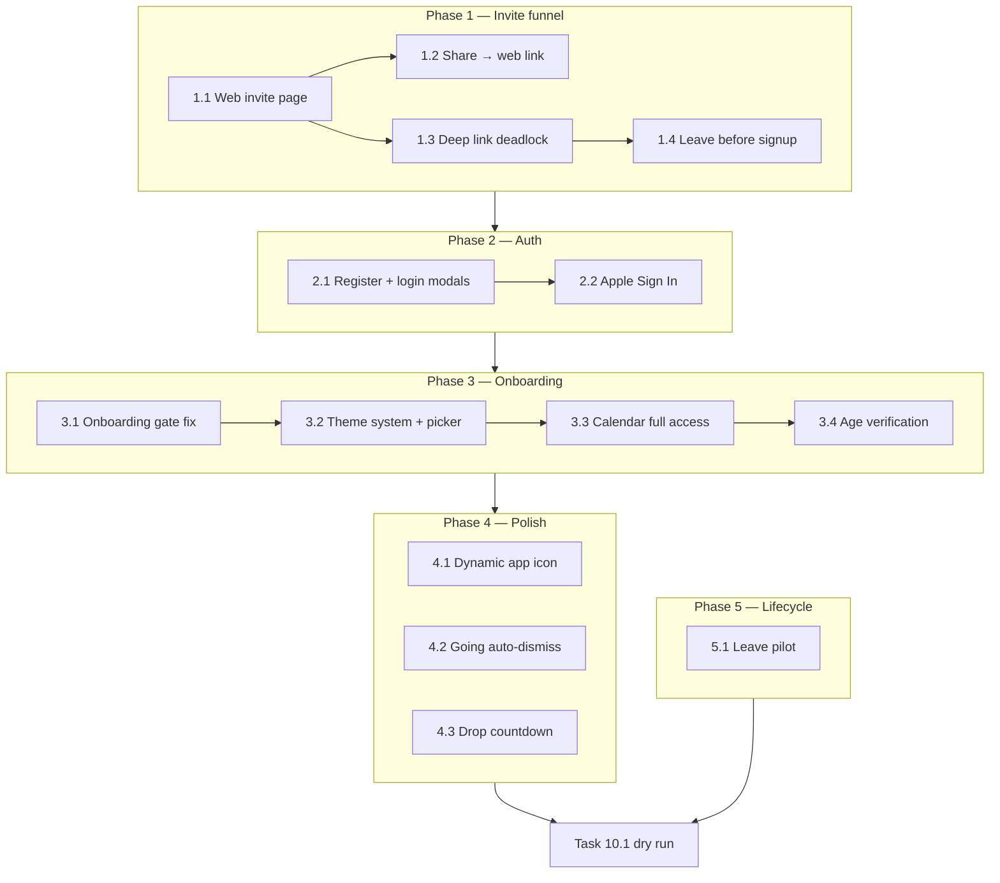

## How to use this document

Work through tasks **in order within each phase**. Phases have soft dependencies — see [Execution order](#execution-order).

This plan is **separate from** the [Pivot MVP implementation plan](/strategy/pivot-mvp-implementation-plan). It covers pilot-readiness bugs discovered after Phases 0–9 shipped. Complete this plan (or the critical-path subset) **before** [Task 10.1 — End-to-end pilot dry run](/strategy/pivot-mvp-implementation-plan#task-101--end-to-end-pilot-dry-run-integration-gate).

For every task:

1. Read **Context** and **Instructions**.
2. Implement only what that task describes.
3. Run **Evaluation criteria** before marking done.
4. Update the [Task status ledger](#task-status-ledger) in the same PR.

### Related docs

- [Pivot MVP implementation plan](/strategy/pivot-mvp-implementation-plan) — core Pivot build (Phases 0–9)
- [Pivot referral codes](/strategy/pivot-referral-codes) — invite code schema and redemption
- [Pivot weekly drop runbook](/strategy/pivot-weekly-drop-runbook) — ops drop timing (relevant to Task 4.3)

---

## Overall context

### What this plan fixes

Fourteen pilot-readiness issues grouped into five phases:

| Phase | Theme | Bugs addressed |
| --- | --- | --- |
| **1** | Invite & growth funnel | Web invite page, in-app share link, deep-link deadlock, leave before signup |
| **2** | Authentication | Email register, Apple Sign In, register-first auth UI |
| **3** | Onboarding pipeline | Onboarding gate fix, theme picker, calendar access, age verification |
| **4** | In-app polish | Dynamic app icon, deck going auto-dismiss, next-drop countdown |
| **5** | Account lifecycle | Leave pilot (logout + deactivate) |

### Product boundary (unchanged)

Pivot / Just Go remains a **separate edition** inside the same mobile binary (`app_edition: campus | pivot`). Campus Meridian must stay unchanged for users who never enter a valid referral code. See the [Pivot MVP plan — Product boundary](/strategy/pivot-mvp-implementation-plan#overall-context).

### Design language

All new user-facing surfaces use **Just Go scrapbook neo-brutalist** styling — sharp ink borders, oat cream palette, Les Flos wordmark, Space Mono body. See [Pivot MVP plan — Design language](/strategy/pivot-mvp-implementation-plan#design-language-v0--scrapbook-neo-brutalist).

### Repositories touched

| Area | Path |
| --- | --- |
| Mobile | `Meridian-Mobile/` |
| Backend | `Meridian/backend/` |
| Web (invite landing) | `Meridian/frontend/` |
| Docs | `Meridian-Mintlify/strategy/` |

---

## Execution order

**Critical path:** 1.1 → 1.3 → 2.1 → 3.1 → 3.2–3.4 → 10.1 dry run.

**Parallel after Phase 2:** Phase 4 tasks (4.1, 4.2, 4.3) and Phase 5 backend work can run alongside Phase 3.

---

### Task status ledger

| Task | Status | Notes |
| --- | --- | --- |
| 1.1 | done | Web invite landing page at `/invite`; preview API; AASA + Android intent filters (replace `APPLE_TEAM_ID` / SHA256 before prod verify) |
| 1.2 | done | In-app share uses `meridian.study/invite` as primary url |
| 1.3 | done | Invite deep link routes to Week when pivot+authed; ReferralCode exit CTAs |
| 1.4 | done | PivotAuth leave CTA — back to meridian before signup |
| 2.1 | done | PivotAuth register-first toggle (create account + sign in) with email validation and handleRegister wiring |
| 2.2 | done | Apple Sign In added to PivotAuth on iOS (register/sign-in modes), wired through handleAppleLogin |
| 3.1 | done | Added `pivot_onboarding_v1_complete`; forced pivot onboarding sequence for new users; legacy interests-complete users backfilled to avoid regression |
| 3.2 | done | Added `system|light|dark` theme preference, new theme onboarding step (match phone/light/dark), and inserted flow between interests and calendar |
| 3.3 | done | Calendar onboarding always shown for new users; connected-confirm state when already granted; analytics now include `{ granted, fullAccess }`; platform notes documented |
| 3.4 | done | Added 18+ birth-year attestation screen, backend `/pivot/profile/age-verification` persistence (`pivotAgeVerifiedAt`), and inserted flow `theme → age → calendar` |
| 4.1 | done | Added edition-driven app icon sync via `expo-alternate-app-icons` on iOS (`setPivotEdition`/`clearEdition` + boot restore); Android keeps default icon (launcher fallback documented); native rebuild required |
| 4.2 | done | Added `PivotEventDetail.origin` (`deck|recap|plans`); deck-origin "going" now queues optimistic deck removal, auto-closes detail, and returns to next card; recap/plans behavior unchanged |
| 4.3 | done | Added `fetchPivotConfig()` and `usePivotDropCountdown` (minute tick, tenant timezone) and surfaced "next drop" line on Week header; countdown hides after drop passes |
| 5.1 | done | Added `POST /pivot/leave-pilot` (pivot participation `left` + session invalidation, not `accessSuspended`); mobile leave flow logs out and clears pivot local state; rejoin via login + invite redeem reactivates participation |

---

## Phase 1 — Invite & growth funnel

*Extends [Pivot MVP Task 6.1](/strategy/pivot-mvp-implementation-plan#task-61--deep-link-invite-code) and [Task 7.5](/strategy/pivot-mvp-implementation-plan#task-75--invite-friends-to-the-pilot-share-referral-code). Highest priority — blocks viral loop and causes app-restart dead ends.*

### Task 1.1 — Web invite landing page (install + code redemption)

**Status:** `done`

**Context:** Recipients without the app need a Just Go-branded page that explains install → return → open deep link. Today `createPivotInviteUniversalLink` points to `https://meridian.study/invite?code=…` but no dedicated landing page exists.

**Instructions:**

1. Add a public route (e.g. `/invite` or `/go/invite`) in `Meridian/frontend` — server-rendered or lightweight static page.
2. Parse `?code=` from query string; optionally call a read-only preview API for city name and validity.
3. Page content:
   - Just Go wordmark and scrapbook layout (sharp borders, ink on cream, Space Mono copy).
   - Display invite code prominently.
   - Step 1: download the app (App Store / Play Store badges).
   - Step 2: "come back and tap open" with smart link to `meridian://invite?code=…`.
   - Fallback: copy code + manual entry instructions.
4. Invalid or missing code: Just Go error state ("that code didn't work").
5. **Optional backend:** `GET /pivot/referral/preview?code=` — public, returns `{ valid, cityDisplayName }` only; reuse validate logic from [referral codes](/strategy/pivot-referral-codes).
6. Ensure `https://meridian.study/invite` is in Apple App Site Association and Android intent filters for universal links.

**Evaluation criteria:**

- [ ] Page loads on mobile Safari without app installed
- [ ] Valid code shows city-specific copy and install steps
- [ ] "Open in app" deep link works when app is installed
- [ ] Invalid code shows error state (no crash)
- [ ] Visual design matches Just Go scrapbook language

---

### Task 1.2 — In-app invite share uses web link as primary

**Status:** `done`

**Context:** [Task 7.5](/strategy/pivot-mvp-implementation-plan#task-75--invite-friends-to-the-pilot-share-referral-code) ships share from Profile/Friends. The https URL is in the message body but iOS `Share.share` `url` is still `meridian://`.

**Depends on:** Task 1.1

**Instructions:**

1. In `pivotInviteShare.ts`, set primary `url` to `createPivotInviteUniversalLink(code)` on both platforms.
2. Update `PIVOT_COPY.invite` share message to reference the web flow ("tap the link to get started").
3. Update tests in `pivotInviteShare.test.ts` and `pivotInviteDeepLink.test.ts`.

**Evaluation criteria:**

- [ ] Share sheet preview shows `meridian.study/invite?…`
- [ ] Recipient without app lands on Task 1.1 page
- [ ] Recipient with app can open via universal link or page CTA
- [ ] `pivot_invite_share` analytics unchanged (no raw code in payload)

---

### Task 1.3 — Deep link when already redeemed (navigation deadlock)

**Status:** `done`

**Context:** Opening an invite link while already in the pivot edition routes to `ReferralCode` via React Navigation linking. `usePivotInviteDeepLinkBoot` no-ops when `edition === 'pivot'`, but linking still pushes the redeem screen. Redeem is idempotent server-side so the UI appears stuck; back fails when `ReferralCode` is the stack root.

**Instructions:**

1. Add `resolveInviteDeepLinkAction(edition, isAuthenticated, code)` utility.
2. Behavior matrix:

| App state | Action |
| --- | --- |
| Campus, not authed | Existing: validate → set edition → PivotAuth |
| Pivot, not authed | Skip ReferralCode → PivotAuth (code in `pivotMeta`) |
| Pivot, authed | Toast "already in just go" → navigate to `PivotWeek` |
| Campus, authed (edge) | Product decision: offer switch to pivot or ignore |

3. Intercept `invite` linking in `PivotAppNavigator` before `ReferralCode` mounts.
4. Update `usePivotInviteDeepLinkBoot` to navigate (not no-op) when edition is already pivot.
5. `ReferralCodeScreen`: when `!canGoBack()`, show explicit exit ("continue to just go" / "back to meridian") instead of broken back arrow.

**Evaluation criteria:**

- [ ] Invite link while logged into pivot lands on Week, not redeem screen
- [ ] Hardware back works from all invite entry points
- [ ] No app restart required to recover from stuck state
- [ ] Campus cold-start invite flow unchanged

---

### Task 1.4 — Leave option after code redeemed, before signup

**Status:** `done`

**Context:** After `setPivotEdition`, users land on `PivotAuthScreen` with no production exit. Back button exists only in `__DEV__`.

**Instructions:**

1. Add production-visible secondary action on `PivotAuthScreen`: e.g. "changed your mind?" ghost CTA "back to meridian".
2. On press: `clearEdition()` + `clearSelectedSubdomain()` → `AppContent` returns to campus `AppNavigator` / Welcome.
3. Do **not** call redeem API (user never authenticated).
4. Just Go copy; match scrapbook button styling (`PivotButton` ghost variant).

**Evaluation criteria:**

- [ ] Redeem code → PivotAuth → leave → campus Welcome
- [ ] Re-entering same code works on second attempt
- [ ] No server-side redemption recorded for users who leave before auth

---

## Phase 2 — Authentication completeness

*Extends [Pivot MVP Task 1.4](/strategy/pivot-mvp-implementation-plan#task-14--pivotauthscreen--pivot-post-login-stub). Blocks new-user conversion.*

### Task 2.1 — Email register + separate register/login modals

**Status:** `pending`

**Context:** `PivotAuthScreen` only calls `handleLogin`. Campus `RegisterScreen` and `handleRegister` exist but are not wired in pivot.

**Instructions:**

1. Refactor `PivotAuthScreen` to **register-first** flow with mode toggle.
2. **Register mode (default):** email, password, confirm password, "create account" CTA. Footer: "already have an account? sign in".
3. **Sign-in mode:** email, password, "sign in" CTA. Footer: "new here? create account".
4. Wire `useAuthActions.handleRegister` for register path.
5. On success → existing `PivotReferralRedeemSync` + `resolveAuthenticatedPivotRoute`.
6. Reuse validation patterns from `RegisterScreen`; surface errors in pivot styling.

**Evaluation criteria:**

- [ ] New email user can create account without leaving pivot navigator
- [ ] Toggle between register and sign-in works both directions
- [ ] Validation errors display in pivot card UI
- [ ] Successful register enters onboarding pipeline (Phase 3)

---

### Task 2.2 — Apple Sign In on PivotAuth

**Status:** `pending`

**Context:** `expo-apple-authentication`, `appleAuth.ts`, backend Apple auth, and `AuthContext.handleAppleLogin` exist. Wired on campus `LoginScreen` / `RegisterScreen` only.

**Depends on:** Task 2.1 (shared auth card layout)

**Instructions:**

1. Add Apple button to `PivotAuthScreen` in both register and sign-in modes.
2. Flow: `signInWithApple()` → `handleAppleLogin(idToken, true)` (mirror Google).
3. Hide on Android or show iOS-only hint per campus pattern.
4. Ensure new Apple users enter Phase 3 onboarding (not skipped by campus profile state).

**Evaluation criteria:**

- [ ] Apple sign-in completes pivot auth on iOS
- [ ] New Apple users enter onboarding pipeline
- [ ] Google + email flows unchanged

---

## Phase 3 — Onboarding pipeline fixes & new steps

*Extends [Task 2.3](/strategy/pivot-mvp-implementation-plan#task-23--pivot-display-name-onboarding), [Task 8.3](/strategy/pivot-mvp-implementation-plan#task-83--interests-onboarding-screen--navigator-gate), and [Task 9.1](/strategy/pivot-mvp-implementation-plan#task-91--expo-calendar-service--helpers).*

### Task 3.1 — Fix: onboarding always shows for new accounts

**Status:** `pending`

**Context:** `resolveAuthenticatedPivotRoute` gates on campus profile state. OAuth users may arrive with `user.name` populated → skip display name. Interests and calendar steps auto-skip via SecureStore flags or existing OS permissions.

**Instructions:**

1. Introduce pivot-specific completion flag: `pivot_onboarding_v1_complete` in SecureStore (or server field `user.pivotOnboardingCompletedAt`).
2. New pivot users always walk the full sequence regardless of campus profile data.
3. Display name step: show even if name pre-filled (confirm / edit).
4. Migration: backfill completion flag for existing pilot users who already finished interests onboarding — do not force them through again.
5. Set completion flag only after final onboarding step (Task 3.4).

**Evaluation criteria:**

- [ ] Brand-new Google / Apple / email pivot account sees full onboarding once
- [ ] Returning completed user skips directly to `PivotRoot`
- [ ] Existing pilot users not regressed

---

### Task 3.2 — Dark/light mode: system default + onboarding picker

**Status:** `pending`

**Context:** `PivotThemeProvider` supports `light | dark` but not `system`. Stored preference overrides permanently. `app.config.js` sets `userInterfaceStyle: "light"` globally.

**Depends on:** Task 3.1 (onboarding sequence)

**Instructions:**

1. Extend `PivotColorScheme` to `'system' | 'light' | 'dark'` in `pivotThemeStorage.ts`.
2. `PivotThemeProvider`: when `system`, subscribe to `useColorScheme()` changes.
3. New `PivotThemeOnboardingScreen` — three sharp chips: "match phone", "light", "dark".
4. Insert in `resolveAuthenticatedPivotRoute` after interests, before age (Task 3.4).
5. Optional: Profile setting to change preference later.

**Evaluation criteria:**

- [ ] Fresh install follows OS appearance until user picks
- [ ] Explicit choice persists across restarts
- [ ] All pivot surfaces respect `getPivotColors()`
- [ ] "Match phone" updates when OS theme changes

---

### Task 3.3 — Calendar full-access onboarding step

**Status:** `pending`

**Context:** `PivotCalendarOnboardingScreen` exists but may be skipped. Pilot needs full calendar access for availability-aware recommendations and adding going events to calendar.

**Depends on:** Task 3.1

**Instructions:**

1. Always show calendar step for new users — if permission already granted, show "you're connected ✓" confirm instead of auto-skip.
2. iOS: request full calendar access; add `NSCalendarsFullAccessUsageDescription` to `app.config.js` if missing.
3. Update copy: explain availability recommendations + add going events to calendar.
4. Analytics: `pivot_calendar_onboarding_completed` with `{ granted, fullAccess }`.
5. Document actual platform capabilities in `PIVOT_CALENDAR_QA.md`.

**Evaluation criteria:**

- [ ] New user sees calendar onboarding step
- [ ] Granting permission enables week-plans and add-to-calendar flows
- [ ] Deny / skip allows continue with degraded calendar features
- [ ] Step not shown again after onboarding complete

---

### Task 3.4 — Age verification (18+)

**Status:** `pending`

**Context:** Pilot events may include 18+ venues; need explicit age gate in onboarding.

**Depends on:** Task 3.2 (insert before calendar or after theme — product order: theme → age → calendar)

**Instructions:**

1. New `PivotAgeOnboardingScreen`.
2. UI: date-of-birth picker or "I'm 18 or older" attestation with birth year — product chooses; attestation is faster for pilot.
3. Client: block continue if under 18.
4. Server: `PUT /pivot/profile` field `dateOfBirth` or `pivotAgeVerifiedAt` on tenant `User` for audit trail.
5. Insert in `resolveAuthenticatedPivotRoute`; set `pivot_onboarding_v1_complete` after this step (or after calendar if calendar follows age).

**Evaluation criteria:**

- [ ] Under-18 cannot proceed to `PivotRoot`
- [ ] Verified state persisted server-side
- [ ] Gate enforced in `resolveAuthenticatedPivotRoute`

---

## Phase 4 — In-app experience polish

*Can run in parallel with Phase 3 after Task 3.1. Extends [Task 0.4](/strategy/pivot-mvp-implementation-plan#task-04--configurable-pivot-drop-daytime-tenant-config) and [Task 4.1](/strategy/pivot-mvp-implementation-plan#task-41--pivotcardstack--feed-wiring).*

### Task 4.1 — Dynamic "go" app icon in pivot edition

**Status:** `pending`

**Context:** App icon is static Meridian branding. When user enters Just Go pilot, icon should switch to "go" mark.

**Instructions:**

1. Design "go" icon asset — neo-brutalist mark (sharp, ink on cream).
2. iOS: alternate app icons via `expo-alternate-app-icon` or config plugin; swap on `setPivotEdition('pivot')`, revert on `clearEdition()`.
3. Android: runtime icon swap is limited — document fallback (keep Meridian icon or activity-alias if feasible).
4. Hook from `AppEditionContext` on edition change and cold-start restore from SecureStore.

**Evaluation criteria:**

- [ ] Enter pivot → home screen icon shows "go"
- [ ] Leave pivot → icon reverts to Meridian
- [ ] Survives app restart while pivot edition persisted
- [ ] Requires native build (document: not OTA-only)

---

### Task 4.2 — Auto-close detail + deck advance on "going" from deck

**Status:** `pending`

**Context:** User opens event from deck → detail → taps "I got a ticket" / going → sheet stays open; deck does not advance.

**Instructions:**

1. Add `origin?: 'deck' | 'recap' | 'plans'` to `PivotEventDetail` route params.
2. `PivotWeekScreen.openEventDetail` passes `origin: 'deck'`.
3. On successful `confirmPivotRegistered` when `origin === 'deck'`:
   - Dismiss detail sheet (`sheetRef.close` → `goBack`).
   - Signal `PivotWeekScreen` to remove card from deck and advance stack (reuse interested swipe animation path).
4. Update picks via existing `queuePivotRecapRegistered` optimistic patch.

**Evaluation criteria:**

- [ ] Deck → detail → going → sheet closes automatically
- [ ] Card removed from deck with animation; next card visible
- [ ] Recap / plans origin unchanged (no auto-dismiss)

---

### Task 4.3 — Rough countdown to next drop

**Status:** `pending`

**Context:** Backend `GET /pivot/config` returns `dropSchedule.nextDropAt` per [weekly drop schedule](/strategy/pivot-mvp-implementation-plan#weekly-drop-schedule-configurable). Mobile does not display it.

**Instructions:**

1. Add `fetchPivotConfig()` in `pivotQueries.ts`.
2. `usePivotDropCountdown` hook — tick every minute; format "next drop in 2d 4h" or "drops thu 6pm".
3. Surface on `PivotWeekScreen` — ticker line or `PivotBlobCard` when deck empty / pre-drop.
4. Use tenant `dropSchedule.timezone`; never hardcode Thursday 6pm.
5. After drop instant passes, hide countdown (show current week deck).

**Evaluation criteria:**

- [ ] Countdown visible on Week tab before drop
- [ ] Matches Platform Admin "Next drop" for tenant
- [ ] Updates without app restart
- [ ] Hidden or replaced after drop time passes

---

## Phase 5 — Account lifecycle

*Should ship before wide pilot distribution.*

### Task 5.1 — Graceful leave pilot (logout + deactivate)

**Status:** `pending`

**Context:** `handleLeavePilot` only calls `clearEdition()` + `clearSelectedSubdomain()`. User stays authenticated and lands on campus UI — wrong for pivot-only tenants.

**Instructions:**

1. **Backend:** `POST /pivot/leave-pilot` — set `globalUser.isActive = false` or `pivotParticipationStatus = 'left'`; do **not** delete user or tenant data; invalidate sessions.
2. **Mobile:** Confirm dialog (stronger copy) → API → `logout()` → `clearEdition()` → appropriate post-exit screen.
3. **Pivot-only tenants:** If user has no campus subdomain, show neutral "you've left the pilot" screen — not campus MainTabs.
4. Clear pivot SecureStore keys: redeemed code, onboarding flags, color scheme, calendar dedupe.
5. Product/legal: document re-registration policy for deactivated accounts.

**Evaluation criteria:**

- [ ] Leave pilot logs user out
- [ ] Account deactivated server-side (not deleted)
- [ ] Pivot-only users do not land on campus MainTabs
- [ ] Re-login shows appropriate deactivated message
- [ ] Pivot data retained for ops / analytics

---

## Pilot dry run gate (Task 10.1 extension)

After this plan ships, run [Task 10.1](/strategy/pivot-mvp-implementation-plan#task-101--end-to-end-pilot-dry-run-integration-gate) with these additional steps:

<Steps>
  <Step title="Web invite loop">
    Share invite from Profile → open link on device without app → install → return → universal link → pivot auth.
  </Step>
  <Step title="Auth loop">
    Register with email; sign in with Apple; leave before signup from PivotAuth.
  </Step>
  <Step title="Onboarding loop">
    New account walks display name → interests → theme → age → calendar → Week.
  </Step>
  <Step title="Deck loop">
    Swipe interested → open detail from deck → mark going → auto-dismiss → next card.
  </Step>
  <Step title="Drop UX">
  Confirm countdown matches tenant config; deck loads after drop.
  </Step>
  <Step title="Exit loop">
    Leave pilot → logout → deactivated state; icon reverts to Meridian.
  </Step>
</Steps>

---

## Risk register

| Risk | Mitigation |
| --- | --- |
| Web page without AASA → dead-end redeem screen | Ship Tasks 1.1 and 1.3 together |
| Onboarding skip via OAuth profile data | Task 3.1 completion flag is the durable fix |
| iOS alternate icons need native build | Plan EAS build; document in Task 4.1 |
| Deactivate vs delete policy | Product sign-off before Task 5.1 |
| iOS 17+ calendar permission limits | Document in `PIVOT_CALENDAR_QA.md` (Task 3.3) |
