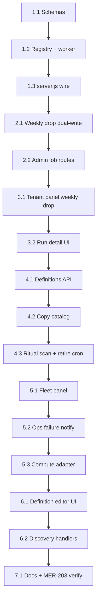

<!-- relay-plan
format: 1
defaults:
  preview: none
  agent: cursor
  gate: review-after
  cwd: Meridian/backend
  branch: MER-203-Jobs-Durability
  suggestedEffort: 7
-->

## How to use this document

Work through tasks **in order within each phase**. Soft dependencies are in [Execution order](#execution-order).

This plan is **local Cursor work on this laptop**, against the Meridian checkout. It is **not** a Relay Mini execution plan for notification sends. Do not `relay-handoff` this Mintlify file. For phased agent runs on the laptop, compile and lint this canonical source from `relay`: `npx --no-install relay plan lint ../Meridian-Mintlify/strategy/meridian-job-notification-platform-plan.mdx --resolve`.

Branch: **`MER-203-Jobs-Durability`** — implement **before** merge to `main`.

<Warning>
**This file is the handoff.** Later agents will not have the chat. If a choice is not in the [Decision log](#decision-log) or a task, it does not exist. Do not run notification jobs on Relay/Mini. Do not add SMS, user-editable schedules, or live WebSocket panel updates in v1.
</Warning>

### Before you start

1. `cd Meridian && git fetch origin && git checkout MER-203-Jobs-Durability && git pull`.
2. Node 20 (`nvm use 20`). Backend **5001**, frontend **3000** for panel verification.
3. Backend tests: `npx jest --runInBand <files>`. **Do not** `npm test` in backend — `scripts.test` is full coverage.
4. Frontend panel tests: `cd frontend && CI=true npx react-scripts test --watchAll=false --testPathPattern=<pattern>`.

For every task:

1. Read **Context**, **File context**, and **Instructions**.
2. Implement only that task.
3. Run **Evaluation criteria** before marking done.
4. **Edit this file** in the same PR ([Agent completion](#agent-completion)).

### Agent completion

<Warning>
A task is not done if **Implementation notes** is still `_None yet._`
</Warning>

1. Ledger row → `done` / `blocked` / `in_progress` (`doneAt`, pointer).
2. Task **Status** matches.
3. Check evaluation items you actually ran.
4. Fill **Implementation notes** (template below).
5. After a phase, fill **Phase completion notes**.

```md
**Implementation notes** (YYYY-MM-DD, agent)

- **Shipped:**
- **Files:**
- **Deviations:**
- **Verify:**
- **Handoff:**
```

### Related docs

- `Meridian/backend/docs/meridian-job-notification-platform-plan.md` — stub pointer to this page
- Canonical execution annotations in this file — Relay derives the local agent snapshot from this MDX; no parallel Relay-syntax plan is maintained
- `Meridian/backend/docs/just-go-agent-scrape-jobs-handoff.md` — compute/Relay boundary; update in Task 7.1
- `relay/docs/offloaded-admin-jobs-worker.md` — Relay schedules **compute** only

---

## Overall context

### Problem

Pivot notifications (weekly drop, crew nudges, future ritual reminders) run on **ad hoc crons** and **manual admin sends**. There is no **fleet-wide observability**, no **per-user delivery audit**, and no **data-driven notification definitions** with voice copy. `Notification.scheduledFor` exists but has no worker. Compute jobs already have `pivot_compute_jobs` and Relay scheduling — a **second mental model** for operators.

### What we are building

**Layer C observability:** shared **runs**, **attempts**, and **deliveries** for Meridian-executed notification work; **compute jobs surfaced read-only** via an adapter in the same Notifications panel.

```text
Admin UI (fleet + tenant)
  → meridian job runs API
  → in-process worker (Option A) claims global Mongo queue
  → handler registry (weekly_drop, ritual_crew_scan, definition:*)
  → expoPushDeliveryService + copy pack
  → meridian_job_deliveries (per-user audit)
  dual-write PivotDropPushRun (weekly drop migration)
```

**Dynamic definitions:** admins create rows (`meridian_notification_definitions`) with **30-minute** cron, copy keys, and `handlerKey`; new schedules need minimal code if handler exists.

**Failure after retries:** email + Expo push to **all platform admins** with pivot tokens on ops tenant **`sf`**.

### Out of scope

- SMS and end-user notification preference UI
- User-editable schedules in the consumer app
- Relay/Mini executing Meridian notification jobs
- Relay schedule metadata in compute panel v1
- Live WebSocket updates in admin (polling OK)
- Separate Heroku worker dyno in v1 (Option A only; extract later)

---

## Decision log

| Decision | Choice | Why |
| --- | --- | --- |
| Where to run | **Laptop / Heroku Meridian API** | User: close to Meridian server |
| Branch | `MER-203-Jobs-Durability` | Stack before merge to main |
| Unification model | **Layer C** — shared run/attempt/delivery; compute via **read-only adapter** | Avoid two operator silos |
| Worker topology v1 | **Option A** — loop in **same Node process** as Express | Single web dyno; lean memory |
| Dev vs prod process | **One process** (`server.js` starts loop) | Matches Heroku single dyno |
| Coordination | **Global Mongo** + atomic claim | Same pattern when scaling dynos later |
| Weekly drop history | **Dual-write** `PivotDropPushRun` + preserve legacy reads | No big-bang cutover |
| Ops tenant for admin failure push | **`sf`** (`MERIDIAN_OPS_TENANT_KEY`) | User choice |
| Per-tenant overrides | **`TenantConfig.meridianNotificationOverrides`** merged at read | Reuse tenant admin storage |
| Definition catalog | **Global** `meridian_notification_definitions` | Fleet templates + tenant rows |
| Copy | **`notifications`** section in copy pack + resolved snapshot on deliveries | Voice system parity |
| Schedule granularity | **30 minutes**; evaluate in **tenant `pivotDropTimezone`** | User requirement |
| Retries | **3** attempts; backoff **2m → 15m → 1h** | Transient Expo/DB |
| Dev Expo gate | **All user pushes** via `expoPushDeliveryService` | Already shipped |
| Relay compute | **Unchanged** — schedules stay on Relay | User confirmed boundary |
| Compute panel v1 | **Read-only adapter** only | No Relay schedule API yet |

### Environment (Option A worker)

| Variable | Default | Role |
| --- | --- | --- |
| `MERIDIAN_JOB_POLL_MS` | `30000` | In-process poll interval |
| `MERIDIAN_JOB_LEASE_MS` | `900000` | Reclaim `running` claims older than this |
| `MERIDIAN_JOB_MAX_PER_TICK` | `8` | Due jobs drained serially per poll |
| `MERIDIAN_JOB_ALERT_CLAIM_MS` | `120000` | Retry a failure alert when the claim is older than this and neither channel delivered |
| `MERIDIAN_OPS_TENANT_KEY` | `sf` | Tenant used for admin failure Expo push (task 5.2) |
| `DISABLE_MERIDIAN_JOB_WORKER` | unset | `true` skips starting the loop (`NODE_ENV=test` also skips) |

A future worker dyno should `require('./services/meridianJobWorkerLoop').startMeridianJobWorkerLoop()` — same module as `server.js`.

---

## File map

| File | Role |
| --- | --- |
| `Meridian/backend/schemas/meridianJobRun.js` | Run document (global) |
| `Meridian/backend/schemas/meridianJobAttempt.js` | Attempt per retry |
| `Meridian/backend/schemas/meridianJobDelivery.js` | Per-user audit |
| `Meridian/backend/schemas/meridianNotificationDefinition.js` | Dynamic definitions |
| `Meridian/backend/services/getGlobalModelService.js` | Register global models |
| `Meridian/backend/services/meridianJobRegistry.js` | Handler registry |
| `Meridian/backend/services/meridianJobWorkerLoop.js` | Poll, claim, execute |
| `Meridian/backend/services/meridianJobEnqueueService.js` | Idempotent enqueue |
| `Meridian/backend/services/meridianOpsNotifyService.js` | Terminal failure email + push (sf) |
| `Meridian/backend/services/meridianComputeJobRunAdapter.js` | Compute → panel shape |
| `Meridian/backend/services/pivotWeeklyDropService.js` | Dual-write on send |
| `Meridian/backend/services/expoPushDeliveryService.js` | Expo gate + batch send |
| `Meridian/backend/services/pivotCrewNudgeService.js` | Ritual scan handler source |
| `Meridian/backend/routes/meridianJobAdminRoutes.js` | Platform-admin job APIs |
| `Meridian/backend/server.js` | Start worker loop; remove crew nudge cron when migrated |
| `Meridian/backend/utilities/pivotCopyCatalog.js` | Add `notifications` keys |
| `Meridian/backend/utilities/meridianJobCopyResolve.js` | Pack resolve + weekly-drop precedence |
| `Meridian/frontend/.../PivotFleetDashboard.jsx` | Fleet Notifications nav |
| `Meridian/frontend/.../PivotTenantDashboard.jsx` | Tenant Notifications tab |
| `Meridian/frontend/.../PivotNotifications/` | Panel + weekly drop absorb |
| `Meridian/backend/services/tenantConfigService.js` | `meridianNotificationOverrides` |
| `Meridian/backend/utilities/meridianNotificationCron.js` | 30-minute cron parse/match |

---

## Design rules (do not violate)

1. **All user-facing Expo sends** go through `expoPushDeliveryService`.
2. **Do not enqueue notification work on Relay** or the Mini worker.
3. **Do not change** Relay compute worker API or apply/auto-apply semantics (MER-203).
4. **Persist resolved title/body** on `meridian_job_deliveries` for audit.
5. **Cap delivery rows** per run (500 + overflow count, align `PivotDropPushRun`).
6. **runKey idempotency** — duplicate enqueue must not double-send.
7. **Terminal failure notify** dedupes with `failureAlertSentAt`.
8. **Handlers in code**, schedules/copy/enabled in **definitions** + tenant overrides.
9. Backend verify is `npx jest --runInBand`, not `npm test`.
10. **New notification types:** add handler once; prefer new **definition row** over new cron files.

---

## Execution order



Phases 4.2 and 4.1 can overlap after 2.2 if needed. Phase 5.3 can ship before 6.1.

---

## Task status ledger

| Task | Status | Notes |
| --- | --- | --- |
| 1.1 | done | 2026-09-21 — global schemas, indexes, `getGlobalModelService` |
| 1.2 | done | 2026-09-21 — registry, enqueue, claim, weekly_drop |
| 1.3 | done | 2026-09-21 — server.js Option A loop + env guards |
| 2.1 | done | 2026-09-21 — dual-write deliveries + PivotDropPushRun |
| 2.2 | done | 2026-09-21 — platform-admin runs list/detail/enqueue |
| 3.1 | done | 2026-09-21 — Tenant Notifications absorbs weekly drop |
| 3.2 | done | 2026-09-21 — Run detail attempts + deliveries |
| 4.1 | done | 2026-09-21 — definition schema + CRUD + 30m cron + timezone enqueue |
| 4.2 | done | 2026-09-21 — notifications copy keys + send-time resolve |
| 4.3 | done | 2026-09-21 — ritual_crew_scan handler; nudge cron removed from server.js |
| 5.1 | done | 2026-09-21 — Fleet Notifications page |
| 5.2 | done | 2026-09-21 — terminal failure email + sf Expo push |
| 5.3 | done | 2026-09-21 — compute read-only adapter in fleet Notifications |
| 6.1 | done | 2026-09-21 — definition editor + handler dropdown + tenant overrides |
| 6.2 | done | 2026-09-21 — solo swipe + discovery enqueue (disabled until enabled) |
| 7.1 | done | 2026-09-22 — handoff boundary + MER-203 regression |

---

## Phase 1 — Global job run model and worker loop
<!-- relay-phase
verify:
  - cwd: Meridian/backend
    command: npx jest --runInBand tests/unit/meridianJobRunSchema.test.js tests/unit/meridianJobRegistry.test.js tests/unit/meridianJobWorker.test.js
    label: Global job models and worker tests
-->

### Task 1.1 — Global schemas and indexes
<!-- relay-step
instruction: |
  Add global Meridian job run, attempt, and delivery schemas with bounded delivery audit data, indexes, global registration, and a reversible index migration. Preserve runKey idempotency and the global observability model described in this handoff.
-->

**Status:** `done`

**Context:** Observability layer stores runs, attempts, and per-user deliveries on the **global** DB alongside `PivotComputeJob`.

**File context:**

- `Meridian/backend/schemas/meridianJobRun.js`
- `Meridian/backend/schemas/meridianJobAttempt.js`
- `Meridian/backend/schemas/meridianJobDelivery.js`
- `Meridian/backend/services/getGlobalModelService.js`
- `Meridian/backend/tests/unit/meridianJobRunSchema.test.js`
- Migration script if repo pattern requires (`migrations/ensureMeridianJobIndexes.js`)

**Instructions:**

1. Model fields per [Decision log](#decision-log): `runKey` (unique), `category`, `type`, `tenantKey`, `status`, `scheduledFor`, `payload`, `summary`, `failureAlertSentAt`, `pivotDropPushRunId`, timestamps.
2. Attempts: `runId`, `attemptNumber`, `status`, `error`, `startedAt`, `finishedAt`.
3. Deliveries: user snapshot, `copyKey`, resolved `title`/`body`, `deliveryStatus`, `sentAt`, `error`; indexes for run and support queries.
4. Register models on global connection.

**Evaluation criteria:**

- [x] `npx jest --runInBand tests/unit/meridianJobRunSchema.test.js` passes
- [x] `rg -n "MeridianJobRun" Meridian/backend/services/getGlobalModelService.js` registers the model

**Implementation notes** (2026-09-21, agent)

- **Shipped:** Global `MeridianJobRun` / `MeridianJobAttempt` / `MeridianJobDelivery` schemas with unique `runKey`, claim-queue index, delivery support indexes, and reversible `ensureMeridianJobIndexes` (same pattern as compute jobs). Models registered on the global connection.
- **Files:** `Meridian/backend/schemas/meridianJobRun.js`, `meridianJobAttempt.js`, `meridianJobDelivery.js`; `services/getGlobalModelService.js`; `services/ensureMeridianJobIndexes.js`; `migrations/ensureMeridianJobIndexes.js`; `tests/unit/meridianJobRunSchema.test.js`
- **Deviations:** Added worker-ready fields (`nextAttemptAt`, `attemptCount`, `maxAttempts`, `claimedAt`) and `preview` status so 1.2 claim/retry and 2.1 dry-run do not need a schema revision. Delivery statuses include `blocked_dev_gate` ahead of dual-write.
- **Verify:** `npx jest --runInBand tests/unit/meridianJobRunSchema.test.js` (10 passed). Registration: `MeridianJobRun` → `meridian_job_runs` in `getGlobalModelService.js`.
- **Handoff:** Task 1.2 can enqueue/claim against these collections. Do not start the worker loop yet.

---

### Task 1.2 — Registry, enqueue, claim, weekly_drop handler
<!-- relay-step
instruction: |
  Implement the code-owned handler registry, idempotent enqueue and atomic claim flow, three-attempt retry policy, and weekly_drop delegation. Keep notification work in Meridian's Option A process; Relay continues to schedule compute only.
-->

**Status:** `done`

**Context:** Handlers execute notification work; queue uses atomic claim and retry policy.

**File context:**

- `Meridian/backend/services/meridianJobRegistry.js`
- `Meridian/backend/services/meridianJobEnqueueService.js`
- `Meridian/backend/services/meridianJobWorkerLoop.js`
- `Meridian/backend/services/meridianJobHandlers/weeklyDrop.js`
- `Meridian/backend/tests/unit/meridianJobRegistry.test.js`
- `Meridian/backend/tests/unit/meridianJobWorker.test.js`

**Instructions:**

1. `registerMeridianJobHandler(handlerKey, { category, buildRunKey, execute })`.
2. Enqueue with idempotent `runKey`; max **3** attempts; backoff **2m / 15m / 1h**.
3. `weekly_drop` handler delegates to `sendWeeklyDropPush` without changing drop window semantics.
4. Mutex: one run in flight per process initially.

**Evaluation criteria:**

- [x] `npx jest --runInBand tests/unit/meridianJobRegistry.test.js tests/unit/meridianJobWorker.test.js` passes
- [x] Dry-run weekly drop path can create a run without calling Expo (covered in worker or weekly drop tests)

**Implementation notes** (2026-09-21, agent)

- **Shipped:** `registerMeridianJobHandler` + idempotent `enqueueMeridianJob` (`runKey` unique). Worker `tickMeridianJobWorker` atomically claims due runs, executes one at a time (process mutex), retries up to 3 with backoff 2m / 15m / 1h, then terminal `failed`. `weekly_drop` delegates to `sendWeeklyDropPush` (409 outside window is non-retryable). Dry-run enqueues `…:dry` and finishes as `preview`. Loop `startMeridianJobWorkerLoop` is exported but not wired in `server.js` (task 1.3).
- **Files:** `Meridian/backend/services/meridianJobRegistry.js`, `meridianJobEnqueueService.js`, `meridianJobWorkerLoop.js`, `meridianJobHandlers/index.js`, `meridianJobHandlers/weeklyDrop.js`, `tests/unit/meridianJobRegistry.test.js`, `tests/unit/meridianJobWorker.test.js`
- **Deviations:** 4xx from weekly drop (including drop-window 409) is terminal rather than retried, so window/force semantics stay in `sendWeeklyDropPush`. The 1h backoff is defined for attempt 3 but unused because max attempts is 3 (terminal after the third failure).
- **Verify:** `npx jest --runInBand tests/unit/meridianJobRegistry.test.js tests/unit/meridianJobWorker.test.js` (10 passed). Dry-run test mocks `sendWeeklyDropPush` with `dryRun: true` and asserts no real Expo path.
- **Handoff:** Task 1.3 should start the loop after `listen` unless `DISABLE_MERIDIAN_JOB_WORKER=true` or `NODE_ENV=test`. Dual-write deliveries is still 2.1.

---

### Task 1.3 — Wire worker loop in server.js
<!-- relay-step
instruction: |
  Start the exported in-process worker loop after server listen while honoring NODE_ENV=test and DISABLE_MERIDIAN_JOB_WORKER. Document the worker environment contract and retain a future worker-dyno seam.
-->

**Status:** `done`

**Context:** Option A — same process as API. Disable in test and via env.

**File context:**

- `Meridian/backend/server.js`
- `Meridian/backend/services/meridianJobWorkerLoop.js`

**Instructions:**

1. Start loop after `listen` unless `DISABLE_MERIDIAN_JOB_WORKER=true` or `NODE_ENV=test`.
2. Document env: `MERIDIAN_JOB_POLL_MS` (default 30000), `MERIDIAN_OPS_TENANT_KEY` (default `sf`).
3. Export loop from one module so a future `meridianJobWorker.js` can require it unchanged.

**Evaluation criteria:**

- [x] `rg -n "meridianJobWorker|DISABLE_MERIDIAN_JOB_WORKER" Meridian/backend/server.js` shows wiring
- [x] App boot in Jest does not start the loop (existing test suite still passes)

**Implementation notes** (2026-09-21, agent)

- **Shipped:** `server.js` starts `startMeridianJobWorkerLoop` after `listen` unless `NODE_ENV=test` or `DISABLE_MERIDIAN_JOB_WORKER=true`. The start function is independently gated (opt-in with `{ force: true }`). Env documented in this plan and in `meridianJobWorkerLoop.js`. Future dyno seam is that same export.
- **Files:** `Meridian/backend/server.js`, `Meridian/backend/services/meridianJobWorkerLoop.js`, `Meridian/backend/tests/unit/meridianJobWorker.test.js`, this MDX
- **Deviations:** None.
- **Verify:** Wiring strings in `server.js`. `npx jest --runInBand tests/unit/meridianJobWorker.test.js tests/unit/meridianJobRegistry.test.js` includes boot-guard tests (`startMeridianJobWorkerLoop()` is null in Jest). Tests load `createApp`/`routes`, not `server.js`, so listen never fires in Jest.
- **Handoff:** Phase 2.1 dual-writes deliveries on weekly drop send. Worker will claim enqueued runs once a process is started with the loop enabled.

**Phase 1 completion notes:** Global run/attempt/delivery models, handler registry, idempotent enqueue, atomic claim + retries, `weekly_drop` handler, and Option A in-process loop wired behind test/env kill switches. Notification jobs still do not write delivery rows (2.1) and are not exposed on admin routes (2.2).

---

## Phase 2 — Delivery audit and weekly drop dual-write
<!-- relay-phase
verify:
  - cwd: Meridian/backend
    command: npx jest --runInBand tests/unit/pivotWeeklyDropService.test.js tests/unit/meridianJobWeeklyDrop.test.js tests/route-outcomes/meridianJobRoutes.outcomes.test.js
    label: Delivery audit and admin route tests
-->

### Task 2.1 — Dual-write weekly drop + deliveries
<!-- relay-step
instruction: |
  Dual-write weekly-drop runs, attempts, and bounded per-recipient deliveries while preserving PivotDropPushRun history and Expo gating. Dry runs must remain preview-only and never send Expo pushes.
-->

**Status:** `done`

**Context:** Every push recipient gets a `meridian_job_deliveries` row; legacy `PivotDropPushRun` preserved.

**File context:**

- `Meridian/backend/services/pivotWeeklyDropService.js`
- `Meridian/backend/schemas/pivotDropPushRun.js`
- `Meridian/backend/tests/unit/pivotWeeklyDropService.test.js`
- `Meridian/backend/tests/unit/meridianJobWeeklyDrop.test.js`

**Instructions:**

1. On send (and dry-run preview policy per product): create run + attempt + delivery rows.
2. Dual-write `PivotDropPushRun`; set `pivotDropPushRunId` on run.
3. Map Expo outcomes to `deliveryStatus` including `blocked_dev_gate`.

**Evaluation criteria:**

- [x] `npx jest --runInBand tests/unit/pivotWeeklyDropService.test.js tests/unit/meridianJobWeeklyDrop.test.js` passes
- [x] Recipient cap 500 + overflow matches `PivotDropPushRun`

**Implementation notes** (2026-09-21, agent)

- **Shipped:** Weekly drop send dual-writes a meridian job run, attempt, and per-user `meridian_job_deliveries` (resolved title/body, no push tokens). Legacy `PivotDropPushRun` is still written on real sends; `pivotDropPushRunId` is stored on the run. Dry-run creates a `preview` run with `skipped` deliveries and does not call Expo or write `PivotDropPushRun`. Dev-gate exclusions are `blocked_dev_gate`. Direct admin sends create a unique `…:direct:` run; the worker path attaches to the claimed run.
- **Files:** `Meridian/backend/services/meridianJobWeeklyDropAudit.js`, `pivotWeeklyDropService.js`, `meridianJobHandlers/weeklyDrop.js`, `tests/unit/meridianJobWeeklyDrop.test.js`, `tests/unit/pivotWeeklyDropService.test.js`
- **Deviations:** Audit persist is best-effort (send still succeeds if global write fails), matching existing `PivotDropPushRun` persist. Dry-run allowed recipients are `skipped`, not `pending`. Delivery cap uses the same 500 + overflow as `PivotDropPushRun`.
- **Verify:** `npx jest --runInBand tests/unit/pivotWeeklyDropService.test.js tests/unit/meridianJobWeeklyDrop.test.js tests/unit/meridianJobWorker.test.js` (36 passed).
- **Handoff:** Task 2.2 can list runs/deliveries from the global collections. Admin panel still talks to the weekly-drop send route; that path now creates observability rows without going through enqueue.

### Task 2.2 — Platform-admin job routes
<!-- relay-step
instruction: |
  Add platform-admin fleet and tenant-scoped job run APIs, safe manual enqueue, paginated delivery and attempt detail, and strict token redaction. Do not grant tenant-admin enqueue access.
-->

**Status:** `done`

**Context:** Notifications panel consumes these APIs.

**File context:**

- `Meridian/backend/routes/meridianJobAdminRoutes.js`
- `Meridian/backend/app.js` or route mount file
- `Meridian/backend/tests/route-outcomes/meridianJobRoutes.outcomes.test.js`

**Instructions:**

1. `GET /admin/meridian/jobs/runs` — fleet filters (tenant, type, status, time).
2. `GET /admin/meridian/jobs/runs/:id` — attempts + paginated deliveries.
3. `POST /admin/meridian/jobs/runs/enqueue` — manual run (platform_admin).
4. Do not return raw `pushToken` in delivery rows.

**Evaluation criteria:**

- [x] `npx jest --runInBand tests/route-outcomes/meridianJobRoutes.outcomes.test.js` passes
- [x] `requirePlatformAdmin` on mutating routes

**Implementation notes** (2026-09-21, agent)

- **Shipped:** Platform-admin APIs for fleet run list (tenant/type/status/from/to/cursor), run detail (attempts + paginated deliveries), and manual enqueue. Tenant-scoped list/detail under `/admin/platform/tenants/:tenantKey/meridian/jobs/runs` for the tenant dashboard. All routes use `verifyToken` + `requirePlatformAdmin`. Responses whitelist delivery fields so `pushToken` / Expo `to` never go out; payload tokens are stripped too. Enqueue is fleet-only (no tenant-admin enqueue).
- **Files:** `Meridian/backend/routes/meridianJobAdminRoutes.js`, `services/meridianJobAdminService.js`, `app.js` (mount + www `/admin/meridian` allowlist), `tests/route-outcomes/meridianJobRoutes.outcomes.test.js`, `tests/unit/meridianJobAdminService.test.js`
- **Deviations:** Added tenant-scoped GET list/detail (Relay 2.2 note) so Phase 3.1 does not need a new backend pass. `GET` is also platform-admin-gated, not only POST enqueue.
- **Verify:** `npx jest --runInBand tests/route-outcomes/meridianJobRoutes.outcomes.test.js tests/unit/meridianJobAdminService.test.js` (12 passed).
- **Handoff:** Phase 3.1 can list `GET /admin/meridian/jobs/runs?tenantKey=` or the tenant-prefixed route; enqueue with `POST /admin/meridian/jobs/runs/enqueue`. Definitions CRUD is still 4.1.

**Phase 2 completion notes:** Dual-write weekly drop audit (2.1) and platform-admin job run APIs (2.2) are in place. Notifications UI (3.1) can consume list/detail/enqueue; definition editor still waits on 4.1.

---

## Phase 3 — Notifications panel (tenant)
<!-- relay-phase
cwd: Meridian/frontend
verify:
  - cwd: Meridian/frontend
    command: CI=true npx react-scripts test --watchAll=false --testPathPattern=PivotNotifications|PivotWeeklyDrop|PivotTenantDashboard.test
    label: Tenant Notifications panel tests
-->

### Task 3.1 — Absorb weekly drop into tenant Notifications
<!-- relay-step
instruction: |
  Consolidate weekly-drop configuration, send, dry-run, and history into the tenant Notifications panel. Prefer Meridian job APIs, preserve a legacy history fallback, and leave one tenant-facing surface with polling only.
-->

**Status:** `done`

**Context:** Single tenant surface for drop config, send, dry-run, run history.

**File context:**

- `Meridian/frontend/src/pages/PlatformAdmin/PivotTenantDashboard/PivotTenantDashboard.jsx`
- `Meridian/frontend/src/pages/PlatformAdmin/PivotWeeklyDrop/PivotWeeklyDropPage.jsx`
- New `Meridian/frontend/src/pages/PlatformAdmin/PivotNotifications/`

**Instructions:**

1. Add **Notifications** tab; migrate weekly drop UI into it.
2. List runs from meridian job API; fall back to legacy `PivotDropPushRun` for old history.
3. Redirect or remove duplicate weekly-drop-only nav entry.

**Evaluation criteria:**

- [x] `cd Meridian/frontend && CI=true npx react-scripts test --watchAll=false --testPathPattern=PivotNotifications|PivotWeeklyDrop` passes
- [ ] Manual: tenant panel send + dry-run against local API

**Implementation notes** (2026-09-21, agent)

- **Shipped:** City dashboard page=9 is **Notifications** (same index as former Weekly drop). Weekly drop config, preview, force/send, and schedule live in that tab. Recent sends prefer `GET /admin/platform/tenants/:tenantKey/meridian/jobs/runs?type=weekly_drop`; unmatched legacy `PivotDropPushRun` rows still list. Inspect on a job run loads deliveries from the tenant detail API.
- **Files:** `Meridian/frontend/src/pages/PlatformAdmin/PivotNotifications/PivotNotificationsPage.jsx`, `mergeWeeklyDropHistory.js` (+ tests); `PivotWeeklyDropPage.jsx`; `PivotTenantDashboard.jsx`
- **Deviations:** Platform Admin `/platform-admin?page=2` still labeled Weekly drop (city picker) so Tenants/Lab/Admins page indexes do not shift. Fleet Notifications is task 5.1.
- **Verify:** `CI=true npm test -- --watchAll=false --testPathPattern='PivotNotifications|PivotWeeklyDrop|PivotTenantDashboard.test'` (17 passed). Manual send/dry-run against local API not run in this pass (no logged-in tenant panel session).
- **Handoff:** Task 3.2 can add run-detail attempt timeline on the same panel; list/inspect already consume tenant job APIs.

---

### Task 3.2 — Run detail and deliveries table
<!-- relay-step
instruction: |
  Add bookmarkable job-run detail with attempts, errors, deliveries, and support identifiers. Follow the established platform-admin accessibility patterns and use bounded polling rather than WebSockets.
-->

**Status:** `done`

**Context:** Absolute observability — which users got what and when.

**File context:**

- `Meridian/frontend/src/pages/PlatformAdmin/PivotNotifications/PivotJobRunDetail.jsx`
- Tests alongside Phase 3.1

**Instructions:**

1. Attempt timeline, terminal error, deliveries table (user, product, status, time, error).
2. Polling refresh only (30–60s on detail page).

**Evaluation criteria:**

- [x] Component tests cover deliveries table with failed/accepted rows
- [x] Links include `batchWeek` / run id where applicable

**Implementation notes** (2026-09-21, agent)

- **Shipped:** Notifications `?jobRunId=` + `batchWeek` opens `PivotJobRunDetail`: attempt timeline, `lastError`, deliveries table (user / app / status / time / error). Silent poll every 45s. List **Open run** links use `/platform-admin/pivot/:tenant?page=9&jobRunId=&batchWeek=`. Legacy PivotDropPushRun rows still inspect inline.
- **Files:** `PivotJobRunDetail.jsx` (+ scss/test), `notificationJobRoutes.js`, `PivotNotificationsPage.jsx`, `PivotWeeklyDropPage.jsx`
- **Deviations:** Polls even after terminal success so late delivery writes show up. Deliveries page size 100 (cap remains 500 + overflow note).
- **Verify:** `CI=true npm test -- --watchAll=false --testPathPattern='PivotNotifications|PivotWeeklyDrop'` (12 passed).
- **Handoff:** Phase 4.1 can add definition CRUD; this panel does not yet list non-weekly_drop jobs.

**Phase 3 completion notes:** Tenant Notifications (page=9) absorbs weekly drop send/dry-run/schedule. History prefers meridian job runs with legacy fallback. Run detail is bookmarkable (`jobRunId` + `batchWeek`) with attempts, terminal error, and per-user deliveries, polled every 45s.

---

## Phase 4 — Definitions, copy, ritual cron
<!-- relay-phase
verify:
  - cwd: Meridian/backend
    command: npx jest --runInBand tests/unit/meridianNotificationDefinitions.test.js tests/unit/meridianJobCopyResolve.test.js tests/unit/pivotCopyService.test.js tests/unit/pivotCrewNudgeService.test.js tests/unit/meridianJobRitualScan.test.js
    label: Definitions, copy, and ritual handler tests
-->

### Task 4.1 — Notification definitions API
<!-- relay-step
instruction: |
  Add global notification definitions, platform-admin CRUD, 30-minute cron validation, timezone-aware idempotent enqueue, and read-time tenant overrides. Handlers remain code-owned and definitions remain data-driven.
-->

**Status:** `done`

**Context:** Data-driven schedules and copy keys; handlers stay in registry.

**File context:**

- `Meridian/backend/schemas/meridianNotificationDefinition.js`
- `Meridian/backend/services/meridianNotificationDefinitionService.js`
- `Meridian/backend/services/tenantConfigService.js` — `meridianNotificationOverrides`
- `Meridian/backend/tests/unit/meridianNotificationDefinitions.test.js`

**Instructions:**

1. CRUD for definitions: `definitionKey`, `handlerKey`, `tenantKey`, `enabled`, `scheduleCron` (**30-minute** validation), copy keys, `triggerConfig`.
2. Schedule evaluator enqueues idempotent runs per tenant timezone (`pivotDropTimezone`).
3. Merge tenant overrides from `TenantConfig` at read time.

**Evaluation criteria:**

- [x] `npx jest --runInBand tests/unit/meridianNotificationDefinitions.test.js` passes
- [x] Invalid cron (minute not 0 or 30) rejected

**Implementation notes** (2026-09-21, agent)

- **Shipped:** Global `meridian_notification_definitions` with unique `(definitionKey, tenantKey)`. Platform-admin CRUD under `/admin/meridian/jobs/definitions`. Cron minutes must be 0 or 30 (`0`, `30`, `0,30`, `*/30`). Tenant `meridianNotificationOverrides` merge at list/get. Worker tick evaluates schedules in each pivot tenant's `pivotDropTimezone` and enqueues idempotent `runKey`s that include the 30-minute `timeBucket`.
- **Files:** `Meridian/backend/schemas/meridianNotificationDefinition.js`; `utilities/meridianNotificationCron.js`, `meridianNotificationOverrides.js`; `services/meridianNotificationDefinitionService.js`; `getGlobalModelService.js`; `ensureMeridianJobIndexes.js`; `meridianJobWorkerLoop.js`; `tenantConfig.js` / `tenantConfigService.js` / `defaultTenants.js`; `routes/meridianJobAdminRoutes.js`, `platformTenantRoutes.js`; `tests/unit/meridianNotificationDefinitions.test.js`
- **Deviations:** Fleet templates use empty-string `tenantKey` (serialized as `null`). Evaluator fans out null-tenant definitions to pivot cities only. Handler must already exist in the registry (no `definition:*` wildcard handler in 4.1).
- **Verify:** `npx jest --runInBand tests/unit/meridianNotificationDefinitions.test.js tests/unit/meridianJobWorker.test.js tests/route-outcomes/meridianJobRoutes.outcomes.test.js` (24 passed). Invalid `15 * * * *` rejected; NYC 18:00 Friday vs LA 15:00 at the same UTC instant.
- **Handoff:** 4.2 can add copy-pack keys and resolve them at send. Ritual scan handler is still 4.3; definitions can already target `weekly_drop` or a future `ritual_crew_scan` once registered. Definition editor UI is 6.1.

---

### Task 4.2 — Copy pack `notifications` section
<!-- relay-step
instruction: |
  Add notification voice-copy keys and send-time resolution with documented weekly-drop precedence. Persist resolved title and body snapshots on delivery audit records while preserving fallback behavior.
-->

**Status:** `done`

**Context:** Default text configurable like voice; audit stores resolved strings.

**File context:**

- `Meridian/backend/utilities/pivotCopyCatalog.js`
- `Meridian/backend/utilities/pivotCopyDefaults.json`
- `Meridian-Mobile/src/pivot/copy/pivotCopyCatalog.ts` (sync keys if user-visible)
- `Meridian/backend/tests/unit/meridianJobCopyResolve.test.js`

**Instructions:**

1. Add `notifications` keys (weekly drop, ritual nudges, definition templates).
2. Resolve at send via `getMergedCopyPackOrEmpty` + `resolveOverlayPushBody` pattern.
3. Weekly drop tenant `pivotDropPushTitle` / `Body` precedence documented in merge helper.

**Evaluation criteria:**

- [x] `npx jest --runInBand tests/unit/meridianJobCopyResolve.test.js tests/unit/pivotCopyService.test.js` passes

**Implementation notes** (2026-09-21, agent)

- **Shipped:** Voice-overlayable `notifications` section (weekly drop, ritual nudge title/body, definition templates). `mergeWeeklyDropPushCopy` documents and applies send → week override → tenant `pivotDropPushTitle`/`Body` → copy pack → bundled. Weekly drop send/status load `getMergedCopyPackOrEmpty`. ICU/blank overlay falls back like `resolveOverlayPushBody`.
- **Files:** `Meridian-Mobile/src/pivot/copy/pivotCopy.ts`, `pivotCopyCatalog.ts`; `Meridian/backend/utilities/pivotCopyCatalog.js`, `pivotCopyDefaults.json`, `meridianJobCopyResolve.js`; `services/pivotWeeklyDropService.js`; tests `meridianJobCopyResolve.test.js`, `pivotCopyService.test.js`, `pivotWeeklyDropService.test.js`
- **Deviations:** Ritual job sends still use `crew.push.*` until 4.3. Definition handler can already call `resolveDefinitionNotificationCopy`. Regenerated catalog restored HEAD-only keys (`landing.web.story.grafs`, public-event landing strings) that the walker does not emit.
- **Verify:** `npx jest --runInBand tests/unit/meridianJobCopyResolve.test.js tests/unit/pivotCopyService.test.js tests/unit/pivotWeeklyDropService.test.js` (60 passed).
- **Handoff:** 4.3 should resolve ritual scan bodies via `resolveRitualNotificationCopy` (or keep `crew.push` if product wants one overlay key). Persist resolved title/body on deliveries as 2.1 already does.

---

### Task 4.3 — Ritual crew scan handler; retire nudge cron
<!-- relay-step
instruction: |
  Migrate ritual crew scanning to a definition-driven Meridian handler that reuses eligibility and Expo delivery rules, retire the server cron after verification, and retain the emergency kill-switch behavior.
-->

**Status:** `done`

**Context:** Replace `startPivotCrewNudgeScheduler` with definition-driven or built-in `ritual_crew_scan`.

**File context:**

- `Meridian/backend/services/pivotCrewNudgeService.js`
- `Meridian/backend/services/meridianJobHandlers/ritualCrewScan.js`
- `Meridian/backend/server.js`
- `Meridian/backend/tests/unit/pivotCrewNudgeService.test.js`
- `Meridian/backend/tests/unit/meridianJobRitualScan.test.js`

**Instructions:**

1. Handler reuses existing nudge eligibility and `expoPushDeliveryService`.
2. Remove `startPivotCrewNudgeScheduler` from `server.js` when equivalent definitions enabled.
3. Keep `DISABLE_PIVOT_CREW_NUDGE_CRON` as kill switch mapping to disabled path or env.

**Evaluation criteria:**

- [x] `npx jest --runInBand tests/unit/pivotCrewNudgeService.test.js tests/unit/meridianJobRitualScan.test.js` passes
- [x] `rg startPivotCrewNudgeScheduler Meridian/backend/server.js` empty after migration

**Implementation notes** (2026-09-21, agent)

- **Shipped:** `ritual_crew_scan` handler runs unfinished-swipe + pending-consensus nudges per tenant via existing eligibility and `expoPushDeliveryService`. Fleet definition `ritual_crew_scan` (`0,30 * * * *`) is seeded when the Option A worker starts. `server.js` no longer starts the node-cron. `DISABLE_PIVOT_CREW_NUDGE_CRON=true` skips schedule enqueue and handler send. Deliveries persist resolved title/body (cap 500). `notifications.*` overlay wins when present; otherwise `crew.push` ritual copy.
- **Files:** `meridianJobHandlers/ritualCrewScan.js`, `index.js`; `pivotCrewNudgeService.js`; `pivotCrewNudgeScheduler.js`; `meridianNotificationDefinitionService.js`; `meridianJobWorkerLoop.js`; `server.js`; tests `meridianJobRitualScan.test.js`, `pivotCrewNudgeService.test.js`
- **Deviations:** Per-tenant runs from the 4.1 evaluator (run schema requires `tenantKey`; not a single null-tenant fleet row). Scheduler module remains callable for emergency use but is unused by `server.js`.
- **Verify:** `npx jest --runInBand tests/unit/pivotCrewNudgeService.test.js tests/unit/meridianJobRitualScan.test.js tests/unit/meridianNotificationDefinitions.test.js` (16 passed). `startPivotCrewNudgeScheduler` absent from `server.js`.
- **Handoff:** Phase 5.1 can list `ritual_crew_scan` runs in fleet Notifications. 5.2 should alert on terminal failed ritual scans.

**Phase 4 completion notes:** Definitions CRUD + 30-minute cron (4.1), Voice `notifications` copy resolve with weekly-drop tenant precedence (4.2), and ritual crew scan on the Meridian job worker with the old nudge cron retired (4.3). Next is fleet Notifications UI (5.1).

---

## Phase 5 — Fleet panel, ops alerts, compute adapter
<!-- relay-phase
cwd: Meridian
verify:
  - cwd: Meridian/frontend
    command: CI=true npx react-scripts test --watchAll=false --testPathPattern=PivotFleetDashboard|PivotNotifications
    label: Fleet Notifications panel tests
  - cwd: Meridian/backend
    command: npx jest --runInBand tests/unit/meridianOpsNotify.test.js tests/unit/meridianComputeJobRunAdapter.test.js
    label: Ops alert and compute adapter tests
-->

### Task 5.1 — Fleet Notifications page
<!-- relay-step
instruction: |
  Add a fleet Notifications surface for failed runs, definitions, fleet enqueue, and read-only compute visibility, sharing tenant components where practical without changing Relay scheduler behavior.
-->

**Status:** `done`

**Context:** Fleet operators see failed runs and definitions across cities.

**File context:**

- `Meridian/frontend/src/pages/PlatformAdmin/PivotTenantDashboard/PivotFleetDashboard.jsx`
- `Meridian/frontend/src/pages/PlatformAdmin/PivotNotifications/PivotFleetNotificationsPage.jsx`

**Instructions:**

1. Add **Notifications** menu item (alongside Compute jobs).
2. Failed runs queue, definition list, fleet enqueue where supported.

**Evaluation criteria:**

- [x] `cd Meridian/frontend && CI=true npx react-scripts test --watchAll=false --testPathPattern=PivotFleetDashboard|PivotNotifications` passes

**Implementation notes** (2026-09-21, agent)

- **Shipped:** Fleet **Notifications** appended at `?page=5` (Analytics stays 4). Failed-run queue (`GET /admin/meridian/jobs/runs?status=failed`, 45s poll), definition list, and platform-admin enqueue for `weekly_drop` / `ritual_crew_scan`. Open run links city detail (`?page=9&jobRunId=`). City switcher remaps Notifications 5↔9.
- **Files:** `PivotFleetNotificationsPage.jsx` (+ scss/test); `PivotFleetDashboard.jsx` (+ test); `notificationJobRoutes.js`; `PivotTenantDropdown.jsx` (+ test); this MDX
- **Deviations:** Appended after Analytics rather than inserting beside Compute jobs so `?page=4` bookmarks stay put. Definition editor is still 6.1 (read-only table). Enqueue uses existing POST; weekly drop still respects the drop window (force remains city panel).
- **Verify:** `CI=true npm test -- --watchAll=false --testPathPattern='PivotFleetDashboard|PivotNotifications|PivotTenantDropdown'` (36 passed). Bare `npx react-scripts test` is blocked by this app’s Jest `setupFilesAfterEnv` (same as prior frontend tasks).
- **Handoff:** 5.2 can email/push on terminal failed runs and link to city Notifications run detail. 5.3 can add a compute section on this same fleet page.

---

### Task 5.2 — Terminal failure ops notify (email + sf push)
<!-- relay-step
instruction: |
  Notify all platform admins after terminal Meridian notification failure by email and Expo push to the sf ops tenant, deduped by failureAlertSentAt. Do not alter compute success or review notifications except for safe shared extraction.
-->

**Status:** `done`

**Context:** After last retry, alert all platform admins.

**File context:**

- `Meridian/backend/services/meridianOpsNotifyService.js`
- `Meridian/backend/services/pivotComputeAdminNotifyService.js` (reuse patterns, do not break compute emails)
- `Meridian/backend/services/platformAdminInviteService.js`
- `Meridian/backend/tests/unit/meridianOpsNotify.test.js`

**Instructions:**

1. On terminal `failed`, if `!failureAlertSentAt`: email via `listPlatformAdmins`; push via pivot tokens on tenant **`sf`**.
2. Dedupe; link to Notifications run detail in email.
3. Use `expoPushDeliveryService` for pushes.

**Evaluation criteria:**

- [x] `npx jest --runInBand tests/unit/meridianOpsNotify.test.js` passes

**Implementation notes** (2026-09-21, agent)

- **Shipped:** Terminal `failed` runs atomically set `failureAlertSentAt`, then email unique platform-admin addresses (Resend, same From as compute) with an Open Notifications run link (`?page=9&jobRunId=`). Expo push goes through `sendExpoPushToRecipients` to those admins who have pivot tokens on `MERIDIAN_OPS_TENANT_KEY` (default `sf`). Email/push errors do not throw to the worker; a failed email still attempts push.
- **Files:** `meridianOpsNotifyService.js`; `meridianJobWorkerLoop.js`; `utilities/pivotAdminHrefs.js`; tests `meridianOpsNotify.test.js`, `meridianJobWorker.test.js`, `pivotAdminHrefs.test.js`; this MDX
- **Deviations:** Email and push are isolated try/catch so one channel cannot skip the other after reservation. Compute admin emails are unchanged.
- **Verify:** `npx jest --runInBand tests/unit/meridianOpsNotify.test.js` (7 passed). Worker terminal-fail path also sets `failureAlertSentAt` (`meridianJobWorker.test.js`).
- **Handoff:** 5.3 can surface compute jobs in the same Notifications panel. Ops push still respects the Expo development gate (admins on `sf` should pass).

---

### Task 5.3 — Compute read-only adapter in panel
<!-- relay-step
instruction: |
  Map existing PivotComputeJob data into the Notifications read model without duplicate persistence, schedule metadata, Relay worker API changes, or write controls for compute jobs.
-->

**Status:** `done`

**Context:** Layer C — same panel, no duplicate compute execution.

**File context:**

- `Meridian/backend/services/meridianComputeJobRunAdapter.js`
- `Meridian/frontend/.../PivotNotifications/` (compute section or tab)
- `Meridian/backend/tests/unit/meridianComputeJobRunAdapter.test.js`

**Instructions:**

1. Map `PivotComputeJob` + latest attempt to run list/detail **shape** in API (virtual merge v1).
2. Wire UI read-only; existing compute APIs unchanged.
3. No Relay schedule metadata in v1.

**Evaluation criteria:**

- [x] `npx jest --runInBand tests/unit/meridianComputeJobRunAdapter.test.js` passes

**Implementation notes** (2026-09-21, agent)

- **Shipped:** Read-only adapter maps `PivotComputeJob` + latest attempt into meridian run/attempt shape (`category: compute_surface`, `source: compute`). List/detail at `GET /admin/meridian/jobs/compute-runs` (tenant-scoped too). Fleet Notifications shows a Compute jobs table with Open inspect → city Compute jobs (`?page=10&computeJobId=`). `/admin/pivot/compute-jobs` is unchanged. Relay `scheduleId` / `scheduleOccurrenceId` and lease tokens are stripped.
- **Files:** `meridianComputeJobRunAdapter.js`; `meridianJobAdminRoutes.js`; `PivotFleetNotificationsPage.jsx` (+ test); `notificationJobRoutes.js` (+ test); `tests/unit/meridianComputeJobRunAdapter.test.js`; this MDX
- **Deviations:** Virtual merge is a sibling compute-runs API + panel section rather than mixing compute rows into notification `GET /runs` (failed-queue stays notification-only). Compute status is preserved as `computeStatus`; meridian `status` is mapped (`completed`→`succeeded`, `retryable`→`retry_wait`, `review-required`→`preview`).
- **Verify:** `npx jest --runInBand tests/unit/meridianComputeJobRunAdapter.test.js` (5 passed). Frontend `PivotFleetDashboard|PivotNotifications` (22 passed).
- **Handoff:** 6.1 can add the definition editor on this same fleet page. Apply/retry stay on the Compute jobs tab.

**Phase 5 completion notes:** Fleet Notifications (5.1) lists failed notification runs, definitions, and enqueue. Terminal failure alerts email platform admins and push on ops tenant `sf` (5.2). Compute jobs appear read-only in the same panel via the adapter (5.3); Relay still owns compute execution.

---

## Phase 6 — Definition editor and follow-on handlers
<!-- relay-phase
cwd: Meridian
verify:
  - cwd: Meridian/frontend
    command: CI=true npx react-scripts test --watchAll=false --testPathPattern=PivotNotificationsDefinitions
    label: Definition editor tests
  - cwd: Meridian/backend
    command: npx jest --runInBand tests/unit/meridianJobDiscoveryEnqueue.test.js
    label: Follow-on handler tests
-->

### Task 6.1 — Definition editor UI
<!-- relay-step
instruction: |
  Build the Notifications definition editor with registry-backed handlers, 30-minute cron controls, copy and fallback fields, validated triggerConfig JSON, fleet templates, and tenant override toggles.
-->

**Status:** `done`

**Context:** Admins add notifications without deploy when handler exists.

**File context:**

- `Meridian/frontend/src/pages/PlatformAdmin/PivotNotifications/PivotNotificationDefinitionEditor.jsx`
- Backend registry metadata endpoint (handler list for dropdown)

**Instructions:**

1. Cron builder limited to **30-minute** steps; copy key fields; `triggerConfig` JSON with validation errors.
2. Fleet templates + tenant override toggles.

**Evaluation criteria:**

- [x] `cd Meridian/frontend && CI=true npx react-scripts test --watchAll=false --testPathPattern=PivotNotificationsDefinitions` passes

**Implementation notes** (2026-09-21, agent)

- **Shipped:** Fleet Notifications definition editor with 30-minute cron builder (advanced 5-field fallback), copy key/fallback fields, `triggerConfig` JSON validation, and fleet-template tenant override toggles. Handler dropdown from `GET /admin/meridian/jobs/handlers`.
- **Files:** `PivotNotificationDefinitionEditor.jsx` (+ scss); `notificationDefinitionCron.js`; `PivotNotificationsDefinitions.test.jsx`; `PivotFleetNotificationsPage.jsx`; `meridianJobAdminRoutes.js` (`GET /admin/meridian/jobs/handlers`); this MDX
- **Deviations:** Evaluation command uses this app’s `CI=true npm test -- --watchAll=false --testPathPattern=PivotNotificationsDefinitions` wrapper (`npx react-scripts test` is blocked by `setupFilesAfterEnv`). Override save is `PUT` of only toggled fields, or `{ patch: null }` when all toggles are off.
- **Verify:** Frontend `PivotNotificationsDefinitions` (6 passed). Backend `meridianJobRoutes.outcomes.test.js` + `meridianJobAdminService.test.js` (15 passed).
- **Handoff:** 6.2 can add solo swipe + discovery handlers; they will appear in the editor dropdown once registered. Discovery definition `enabled: false` until product enables.

---

### Task 6.2 — Solo swipe + discovery enqueue handlers
<!-- relay-step
instruction: |
  Add the solo-swipe reminder and a per-user-per-day debounced discovery enqueue handler with minimal happy-path tests. Keep discovery disabled by default until product enables its definition, and add neither SMS nor user-editable schedules.
-->

**Status:** `done`

**Context:** Extensibility proof — new handler + definition rows.

**File context:**

- `Meridian/backend/services/meridianJobHandlers/soloSwipeReminder.js`
- `Meridian/backend/services/meridianJobHandlers/eventDiscoveryEnqueue.js`
- Hook on catalog publish (debounced idempotency per user per day)
- `Meridian/backend/tests/unit/meridianJobDiscoveryEnqueue.test.js`

**Instructions:**

1. Ship handlers; discovery definition **enabled: false** until product enables.
2. All sends audited via deliveries collection.

**Evaluation criteria:**

- [x] `npx jest --runInBand tests/unit/meridianJobDiscoveryEnqueue.test.js` passes

**Implementation notes** (2026-09-21, agent)

- **Shipped:** `solo_swipe_reminder` (enabled fleet definition; unfinished solo decks after the crew nudge window) and `event_discovery` (seeded **enabled: false**). Catalog publish (`releaseBatch`) enqueues discovery with per-user-per-day `runKey` debounce. Both handlers send via `expoPushDeliveryService` and persist `meridian_job_deliveries`.
- **Files:** `meridianJobHandlers/soloSwipeReminder.js`, `eventDiscoveryEnqueue.js`, `index.js`; `meridianJobWeeklyDropAudit.js` (`persistMeridianJobDeliveries`); `meridianJobWorkerLoop.js`; `pivotBatchReleaseService.js`; `PivotFleetNotificationsPage.jsx` enqueue options; `tests/unit/meridianJobDiscoveryEnqueue.test.js`; this MDX
- **Deviations:** Discovery cron stays off until product enables the definition; the publish hook also no-ops while disabled. Per-user debounce is `event_discovery:{tenant}:{userId}:{localDay}` when `userIds` are passed; a tenant-day key is used for bulk/schedule enqueue.
- **Verify:** `npx jest --runInBand tests/unit/meridianJobDiscoveryEnqueue.test.js` (4 passed). Related: `pivotBatchReleaseService`, `meridianJobAdminService`, `meridianJobRitualScan` (26 passed together).
- **Handoff:** 7.1 can document Notifications vs Relay compute. Product can enable `event_discovery` from the definition editor without a deploy.

**Phase 6 completion notes:** Definition editor (6.1) and follow-on handlers (6.2) are in place. New notification types register a handler once; schedules/copy/enabled stay on definition rows. Discovery remains off until an admin enables it.

---

## Phase 7 — Docs and MER-203 reconciliation
<!-- relay-phase
verify:
  - cwd: Meridian/backend
    command: npx jest --runInBand tests/unit/pivotComputeAutoApply.test.js tests/unit/pivotComputeResultApply.test.js tests/unit/pivotWeeklyDropService.test.js
    label: MER-203 regression tests
-->

### Task 7.1 — Docs and regression tests
<!-- relay-step
instruction: |
  Update the operator handoff boundary and confirm MER-203 auto-apply, native tags, and weekly-drop regressions. This plan remains laptop/Heroku Meridian work: never execute notification sends on Relay or the Mini.
-->

**Status:** `done`

**Context:** Operators understand Meridian jobs vs Relay compute.

**File context:**

- `Meridian/backend/docs/just-go-agent-scrape-jobs-handoff.md`
- This MDX file — update ledger and definition of done

**Instructions:**

1. Document notification jobs vs Relay schedules in handoff doc.
2. Run MER-203 regression: auto-apply, native tags, weekly drop tests.

**Evaluation criteria:**

- [x] `npx jest --runInBand tests/unit/pivotComputeAutoApply.test.js tests/unit/pivotComputeResultApply.test.js tests/unit/pivotWeeklyDropService.test.js` passes
- [x] Handoff doc mentions Notifications panel and ops tenant `sf`

**Implementation notes** (2026-09-22, agent)

- **Shipped:** Operator boundary in the scrape-jobs handoff: Relay still owns discovery/refresh compute; Meridian Option A runs notification jobs. Fleet/city Notifications routes, `sf` failure push, and future worker-dyno seam documented.
- **Files:** `Meridian/backend/docs/just-go-agent-scrape-jobs-handoff.md`; this MDX
- **Deviations:** None. Native-tag and auto-apply paths were not changed.
- **Verify:** The three MER-203 unit files (49 passed). Handoff section names Notifications (`?page=5` / `?page=9`) and `MERIDIAN_OPS_TENANT_KEY` default `sf`.
- **Handoff:** v1 milestone checkboxes below match shipped work. Product still enables `event_discovery` from the definition editor.

**Phase 7 completion notes:** Docs and MER-203 regression (auto-apply, native-tag apply, weekly drop) are green. Notification execution stays on the Meridian API process; Relay compute schedules are unchanged.

---

## Definition of done (v1 milestone)

- [x] Weekly drop from Notifications panel with dry-run and full delivery audit
- [x] Legacy `PivotDropPushRun` history visible; new sends dual-write
- [x] At least one admin-defined definition live (e.g. crew ritual scan) with copy keys
- [x] Terminal failure alerts platform admins (email + sf push)
- [x] Compute jobs visible in panel via read-only adapter
- [x] Option A worker in production path; documented path to worker dyno later
