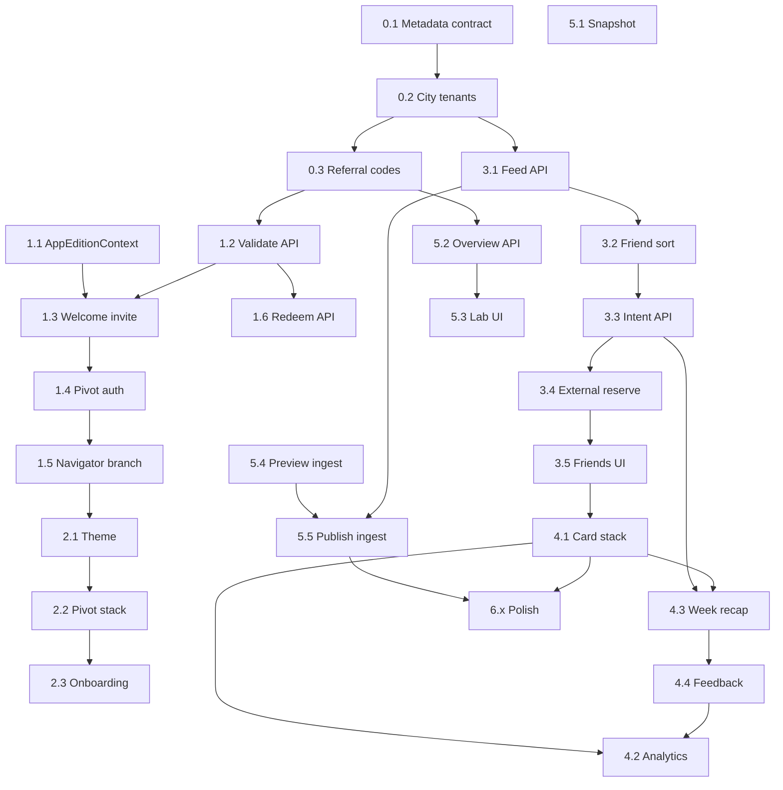

## How to use this document

Work through tasks **in order** within each phase. Do not skip to later phases unless a task explicitly says it is optional.

For every task:

1. Read **Context** and **Instructions**.
2. Implement only what that task describes (avoid scope creep).
3. Run **Evaluation criteria** as a checklist before marking the task done.
4. Record blockers or deviations in your PR / notes so the next task stays accurate.
5. **Update this file** when the task is complete (see [Agent completion](#agent-completion) below).

### Agent completion

<Warning>
**Required for agents:** When you finish a task (code merged or explicitly accepted by the user), you **must edit this markdown file** in the same PR or follow-up commit—do not leave the plan out of date.
</Warning>

For the task you completed:

1. In the [Task status ledger](#task-status-ledger), change that row from `pending` to **`done`** (and add `doneAt: YYYY-MM-DD` or PR link in the Notes column if helpful).
2. Under the task heading, change **`Status:`** from `` `pending` `` to **`done`**.
3. Check every item in that task’s **Evaluation criteria** (`- [ ]` → `- [x]`).

If work is partial or blocked, set **`Status:`** to `blocked` in the ledger and note why in Notes—do not mark `done`.

Optional tasks (e.g. 4.5, 5.1) may stay `pending` or `skipped` with a short Note.

### Task status ledger

| Task | Status | Notes |
| --- | --- | --- |
| 0.1 | done | [Metadata contract](/strategy/pivot-metadata-contract); doneAt: 2026-05-26 |
| 0.2 | done | Platform tenant management UI + dynamic APIs; doneAt: 2026-05-26 |
| 0.3 | done | [Referral codes](/strategy/pivot-referral-codes); doneAt: 2026-05-26 |
| 1.1 | pending | |
| 1.2 | pending | |
| 1.3 | pending | |
| 1.4 | pending | |
| 1.5 | pending | |
| 1.6 | pending | |
| 2.1 | pending | |
| 2.2 | pending | |
| 2.3 | pending | |
| 3.1 | pending | |
| 3.2 | pending | |
| 3.3 | pending | |
| 3.4 | pending | |
| 3.5 | pending | |
| 4.1 | pending | |
| 4.2 | pending | |
| 4.3 | pending | |
| 4.4 | pending | |
| 4.5 | pending | optional |
| 5.1 | pending | optional |
| 5.2 | pending | |
| 5.3 | pending | |
| 5.4 | pending | |
| 5.5 | pending | |
| 6.1 | pending | |
| 6.2 | pending | |
| 6.3 | pending | |
| 6.4 | pending | |
| 6.5 | pending | |

<Note>
**Product boundary:** Pivot is a separate end-user experience inside the same mobile binary. Campus Meridian must remain unchanged for users who do not enter a valid referral code.
</Note>

---

## Overall context

### What we are building

A **weekly local-events pilot** (“Pivot”) that:

- Feels like a **different app** after an invite code (separate navigator, theme, copy).
- Uses **existing platform plumbing**: global auth, per-tenant Mongo DBs (city = school), Events-Backend events, pivot intent store, friendships, push tokens, universal feedback.
- Avoids **system-level changes**: no new tenancy layer, no second App Store binary, no campus UI mixed into Pivot tabs.

### Core user loops

| Actor | Loop |
| --- | --- |
| **Attendee** | Invite code → sign in → swipe **Interested** → week recap → **Reserve** on Partiful/Luma → optional “I registered” → see friends **interested / going** → attend → quick rating → next week |
| **Ops (internal)** | Pivot Lab: paste Partiful/Luma URL → publish to city + week → monitor interested / registered / external opens, feedback, week-2 retention |

### Architecture (stable decisions)

| Decision | Choice |
| --- | --- |
| City isolation | `tenantKey` / subdomain (e.g. `brooklyn.meridian.study`) |
| Weekly batch | `event.customFields.pivot.batchWeek` (ISO week string) |
| Catalog events | Normal `Event` documents: `status: 'not-applicable'`, `visibility: 'public'`, `externalLink` — **no separate Pivot schema** |
| **Display host** | Real organizer from import in `customFields.pivot.host`; users never see “Meridian [city]” |
| **Technical host** | One internal **Pivot Catalog** org per city on `hostingId` (DB-required only; hidden from Pivot UI) |
| Mobile separation | `app_edition`: `campus` \| `pivot` in SecureStore + **Pivot-only navigator** |
| APIs | Namespace `/pivot/*` (tenant-scoped) + `/admin/pivot/*` (cross-tenant, platform admin) |
| Referral | Global DB `PivotReferralCode` maps code → tenant + optional cohort |
| **Swipe right** | **Interested** (intent)—not campus RSVP; external ticket is separate |
| **Attendance truth** | Partiful/Luma until hosts are on-platform; optional self-confirm **Registered** |

### Repositories touched

| Area | Path |
| --- | --- |
| Mobile | `Meridian-Mobile/` |
| Backend | `Meridian/backend/` (+ `Events-Backend/` via symlink) |
| Admin UI (Pivot Lab) | `Meridian/frontend/` (new route under admin) |
| Docs | `Meridian-Mintlify/strategy/` |

### Catalog host model (display vs technical)

Imported events are still normal `Event` records. `hostingId` / `hostingType` remain **required** in Events-Backend, but Pivot must show the **actual organizer** from Partiful/Luma—not a public-facing “Meridian [city]” org.

| Layer | Storage | Shown in Pivot UI? |
| --- | --- | --- |
| **Display host** | `customFields.pivot.host` (`name`, optional `imageUrl`, `profileUrl`) | **Yes** — primary label on cards and detail |
| **Technical host** | `hostingId` → per-city **Pivot Catalog** org (`hostingType: 'Org'`) | **No** — internal only; exclude from org discovery / Atlas profiles |
| **Tickets** | `externalLink` | “Get tickets” opens provider URL |

**Do not** create a new `Org` per venue for imports.

`GET /pivot/feed` (and event detail) should return a resolved **`displayHost`** object so mobile does not read `hostingId.org_name`. Campus `EventCard` paths stay unchanged.

**Later (optional):** promote `host` to a top-level `catalogHost` sub-schema if you need indexes or dedupe by venue; not required for MVP.

---

### Intent vs registration (external catalog)

Creators are **external** for MVP (Partiful/Luma). Swipe-right is **not** ticket confirmation. Do **not** open the external URL on swipe (breaks the feed). Do **not** fake campus RSVP (misleading “friends going”).

| Strategy | MVP decision |
| --- | --- |
| Open external page on swipe right | **No** — too much friction |
| Meridian-only RSVP (ignore external) | **No** — dishonest for scraped events |
| **Interested → recap → Reserve externally** | **Yes** — default loop |
| Optional self-confirm **Registered** | **Yes** — after external signup |

**Per-user states** (tenant DB; do not reuse campus `attendees` as “going” unless status is explicit):

| State | Meaning | UI copy | Friend-facing |
| --- | --- | --- | --- |
| `interested` | Swipe right / tap Interested | “Interested” | “X friends interested” |
| `registered` | User tapped “I got a ticket” (self-report v0) | “Going” | “X friends going” |
| `passed` | Swipe left | — | — |

**Where external opens:** event detail **Get tickets**, and **week recap** list—not on swipe.

**APIs:**

- `POST /pivot/feed/action` — `{ eventId, action: 'interested' \| 'pass' }`
- `GET /pivot/week-recap` — interested events for user + batch week
- `POST /pivot/intent/:eventId/registered` — self-confirm (optional `openedExternalAt` from client)
- Track `pivot_external_open` when user taps Reserve (analytics)

**Later:** on-platform hosts can map **Registered** to real Meridian RSVP without changing swipe UX.

---

### Out of scope for this MVP

- Second App Store listing / separate bundle ID
- ML ranker, embeddings, spatial/video dataset
- Organizer payouts, surge pricing, self-serve host onboarding
- Campus feature changes (Home, ClubDash, approvals) except bugfixes
- Automated Monday cron (manual push OK for pilot)

### Pilot success metrics (program level)

Track in Pivot Lab after **Phase 5**:

| Metric | Target (guidance) |
| --- | --- |
| Week-2 return | ≥ 40% of week-1 users open Pivot / swipe again |
| Interested rate | ≥ 20% of card impressions → interested |
| External open rate | ≥ 30% of interested users tap Reserve (recap or detail) |
| Self-confirm rate | ≥ 15% of interested → `registered` (guidance) |
| Feedback rate | ≥ 25% of **registered** users leave a rating |
| Ops ingest time | &lt; 2 min per event URL (after Phase 4) |
| Qualitative | ≥ 8 interviews; themes logged in Lab |

---

## Phase 0 — Prerequisites and conventions

### Task 0.1 — Document pivot metadata contract


**Status:** `done`

**Context:** All cities and dashboards assume one shape on events.

**Instructions:**

1. Add a short internal spec (this doc section is canonical) for `customFields.pivot`:

```json
{
  "batchWeek": "2026-W21",
  "source": "luma | partiful | manual",
  "sourceUrl": "https://...",
  "host": {
    "name": "Brooklyn Board Game Cafe",
    "imageUrl": "https://...",
    "profileUrl": "https://partiful.com/u/..."
  },
  "tags": ["music", "outdoor"],
  "ingestStatus": "draft | published",
  "importedAt": "ISO-8601",
  "importedBy": "globalUserId or ops email"
}
```

2. Agree on ISO week format: `YYYY-Www` (e.g. `2026-W21`).
3. Document API field **`displayHost`**: server maps from `customFields.pivot.host` (required for published catalog events).
4. Document **`PivotEventIntent`** statuses: `interested`, `registered`, `passed` (see [Intent vs registration](#intent-vs-registration-external-catalog)).
5. Share with anyone ingesting events manually before Lab exists.

Canonical spec: [Pivot metadata contract](/strategy/pivot-metadata-contract).

**Evaluation criteria:**

- [x] Contract is written and linked from this plan
- [x] Team agrees `batchWeek` and `host.name` are required for every published Pivot catalog event
- [x] Sample event JSON includes `host` and notes internal `hostingId` (Pivot Catalog org)
- [x] `displayHost` response shape documented for `/pivot/feed`

---

### Task 0.2 — Provision pilot city tenant(s)


**Status:** `done`

**Context:** Cities are schools; each needs a DB and tenant row.

**Instructions:**

1. Add tenant(s) via `TenantConfig` (e.g. `brooklyn`, `austin`) with `location` set to real city names.
2. Ensure Mongo connection works for each `tenantKey` (same process as adding a school).
3. Create subdomain DNS / dev override: `brooklyn` host → backend `req.school = 'brooklyn'`.
4. Seed per city **one internal org only** (technical host, not user-facing):
   - Name example: `Pivot Catalog — Brooklyn` (not “Meridian Brooklyn” on consumer UI)
   - Flags: hidden from org discovery / public org list if your config supports it; document org `_id` for ingest
   - No per-venue orgs—venues live in `customFields.pivot.host` only

**Dynamic provisioning (implemented):** Use **Platform Admin → Tenant management** at `/platform-admin` (platform admin only). Creates tenant rows in global `TenantConfig`, derives Mongo URI, runs health check, auto-provisions Pivot Catalog org for pivot cities, and surfaces manual DNS/CORS checklist.

**Evaluation criteria:**

- [x] `GET /api/tenant-config` lists new city tenant(s) as `active`
- [x] Health check against city subdomain returns DB OK
- [x] Pivot Catalog org `_id` documented in runbook for ingest scripts
- [x] Org is not linked from Pivot mobile UI and does not appear in featured orgs

---

### Task 0.3 — Create referral codes for pilot cohorts


**Status:** `done`

**Context:** Codes are the only gate into Pivot edition.

**Instructions:**

1. Add global schema `PivotReferralCode` (in `Meridian/backend/schemas/`) with fields: `code`, `tenantKey`, `cohortId`, `maxRedemptions`, `redemptionCount`, `expiresAt`, `active`, `batchWeek` (optional default week).
2. Seed 2–3 codes (e.g. `NYC-PILOT-A`, `NYC-PILOT-B`) tied to `nyc`.
3. Register model in `getGlobalModelService.js`.
4. Seed via `npm run seed:pivot-referral-codes` (or `node migrations/seedPivotReferralCodes.js`).

Canonical spec: [Pivot referral codes](/strategy/pivot-referral-codes).

**Evaluation criteria:**

- [x] Codes exist in global DB and are `active`
- [x] Each code maps to exactly one `tenantKey`
- [x] Expired/inactive codes are testable in DB

---

## Phase 1 — Mobile edition gate (separate product entry)

### Task 1.1 — `AppEditionContext` and SecureStore persistence


**Status:** `pending`

**Context:** Root of mobile separation; must survive app restart.

**Instructions:**

1. Create `Meridian-Mobile/src/contexts/AppEditionContext.tsx`:
   - State: `edition: 'campus' | 'pivot' | null` (`null` = loading)
   - `pivotMeta: { code, tenantKey, subdomain, cohortId, cityDisplayName } | null`
2. Persist keys in SecureStore:
   - `app_edition`
   - `pivot_meta` (JSON string)
3. Expose: `setPivotEdition(meta)`, `clearEdition()`, `loadEditionOnBoot()`.
4. Wrap app root in `AppEditionProvider` (above or beside `AuthProvider`).

**Evaluation criteria:**

- [ ] Cold start reads edition from SecureStore before showing main navigator
- [ ] `setPivotEdition` persists and survives force-quit
- [ ] `clearEdition` returns to `campus` and clears pivot meta
- [ ] No imports from `src/pivot/` in campus-only screens yet

---

### Task 1.2 — Referral validate API (backend)


**Status:** `pending`

**Context:** Mobile must not trust client-side tenant guessing.

**Instructions:**

1. Create `Meridian/backend/routes/pivotRoutes.js` mounted at `/pivot` in `app.js`.
2. Implement `POST /pivot/referral/validate` (no auth required):
   - Body: `{ code: string }`
   - Normalize code (trim, uppercase)
   - Load `PivotReferralCode`; check `active`, `expiresAt`, `redemptionCount < maxRedemptions`
   - Resolve tenant row from `TenantConfig` for `tenantKey`
   - Return `{ success, data: { tenantKey, subdomain, cohortId, cityDisplayName, batchWeek } }`
3. Rate-limit lightly (e.g. 20/min per IP) if middleware exists; otherwise document manual limit.

**Evaluation criteria:**

- [ ] Valid code returns 200 with subdomain usable by mobile HTTP client
- [ ] Invalid / expired / maxed code returns 4xx with clear message
- [ ] Unit or manual curl tests documented in PR

---

### Task 1.3 — Welcome screen: “Have an invite code?”


**Status:** `pending`

**Context:** Campus users see unchanged welcome; pivot path is opt-in.

**Instructions:**

1. On `WelcomeScreen.tsx`, add text button below Sign In: **“Have an invite code?”**
2. Navigate to new screen `ReferralCodeScreen`:
   - Text input, Continue button
   - Calls `POST /pivot/referral/validate`
   - On success: `setPivotEdition(meta)` + `setSelectedSubdomain(subdomain)` from `subdomainStorage`
   - Navigate to Pivot auth entry (Task 1.4) or shared Login with param `edition=pivot`
3. Support optional deep link query `?code=` on Welcome (read in `AppNavigator` linking later in Phase 6).

**Evaluation criteria:**

- [ ] Campus Get Started / Sign In flow unchanged
- [ ] Valid code never shows `DomainPicker` with RPI/TVCOG
- [ ] Invalid code shows inline error; user stays on referral screen
- [ ] Successful code sets edition + subdomain before login

---

### Task 1.4 — Pivot-branded auth entry screen


**Status:** `pending`

**Context:** Zero campus copy after referral; still use same login APIs.

**Instructions:**

1. Add `PivotAuthScreen.tsx` (or reuse Login with pivot layout branch):
   - Pivot wordmark / theme colors
   - Copy: “Join [cityDisplayName] this week”
   - Google / email sign-in only (same `AuthContext` methods)
2. After successful login, navigation must **not** go to `MainTabs`.
3. Skip campus `Onboarding` username requirements if product allows (or minimal Pivot onboarding in Phase 2).

**Evaluation criteria:**

- [ ] Login works against city subdomain (API base URL uses `brooklyn` not `rpi`)
- [ ] No “Discover your campus” strings on this path
- [ ] Failed login does not reset edition or subdomain

---

### Task 1.5 — Root navigator branch by edition


**Status:** `pending`

**Context:** Separate UI tree — highest-impact separation.

**Instructions:**

1. In `App.tsx` (or parent of `AppNavigator`), branch:
   - `edition === 'pivot'` → `PivotAppNavigator`
   - else → existing `AppNavigator`
2. Create `Meridian-Mobile/src/pivot/navigation/PivotAppNavigator.tsx`:
   - `NavigationContainer` with pivot-only screens (stub initially)
   - Unauthenticated: `PivotAuthScreen` (or Referral → Auth)
   - Authenticated: stub `PivotWeekPlaceholder` with “This week (coming soon)”
3. Ensure campus `StackNavigator` is **not mounted** when `edition === 'pivot'`.

**Evaluation criteria:**

- [ ] Entering valid code + login lands on Pivot stub, never `MainTabs`
- [ ] Campus login without code still lands on `MainTabs` / normal flow
- [ ] Logout from Pivot returns to Welcome or Pivot auth per spec (document choice)
- [ ] `clearEdition()` from dev menu restores campus navigator

---

### Task 1.6 — Redeem referral on first authenticated session


**Status:** `pending`

**Context:** Enforce max redemptions server-side.

**Instructions:**

1. Add `POST /pivot/referral/redeem` (requires auth):
   - Body: `{ code }`
   - Increment `redemptionCount` if user not already redeemed (store `PivotReferralRedemption` with `globalUserId + code` or idempotent upsert)
2. Call from mobile once after first successful Pivot login.

**Evaluation criteria:**

- [ ] Second device with same code works until `maxRedemptions`
- [ ] Same user double-login does not double-count
- [ ] Lab can see redemption count in DB

---

## Phase 2 — Pivot shell UX (empty but real product)

### Task 2.1 — Pivot theme and assets


**Status:** `pending`

**Context:** Users must feel they left campus Meridian.

**Instructions:**

1. Add `src/pivot/theme/pivotTheme.ts` (colors, typography overrides).
2. Add pivot wordmark asset (or text logo placeholder).
3. Apply theme to all screens under `src/pivot/`.

**Evaluation criteria:**

- [ ] No Meridian campus wordmark on Pivot screens
- [ ] Status bar / headers use pivot primary color
- [ ] Theme is imported only from `src/pivot/**`

---

### Task 2.2 — Pivot main navigator structure


**Status:** `pending`

**Context:** Minimal IA: week feed is home.

**Instructions:**

1. Replace placeholder with `PivotRootStack`:
   - `PivotWeek` (home)
   - `PivotEventDetail`
   - `PivotProfile` (settings-lite)
2. Optional: single bottom tab (Week | Profile) — avoid multi-tab campus parity.
3. Header: week label (“May 19–25”) from server or client ISO week.

**Evaluation criteria:**

- [ ] User can navigate Week → Event detail → back
- [ ] Profile shows logout + “Leave pilot” (calls `clearEdition()`, navigates to campus Welcome)
- [ ] Android back button behaves correctly

---

### Task 2.3 — Minimal Pivot onboarding (if needed)


**Status:** `pending`

**Context:** Campus onboarding requires username; pivot may not.

**Instructions:**

1. If JWT user lacks `name`, show one screen: display name → save via existing profile API.
2. Skip username requirement for pivot edition only (client-side gate).
3. Do not register for campus orgs.

**Evaluation criteria:**

- [ ] Pivot user with only email can reach `PivotWeek` in one extra step max
- [ ] Campus onboarding rules unchanged for campus edition

---

## Phase 3 — Backend feed and catalog

### Task 3.1 — `GET /pivot/feed`


**Status:** `pending`

**Context:** Tenant-scoped deck for current week.

**Instructions:**

1. In `pivotRoutes.js`, `GET /pivot/feed` with `verifyToken`:
   - Read `req.school` (city tenant)
   - Query `Event` where:
     - `customFields.pivot.batchWeek` = query `batchWeek` or current ISO week
     - `customFields.pivot.ingestStatus` = `'published'`
     - `status` in `['approved', 'not-applicable']`
     - `isDeleted` false
     - `start_time` within pilot window (e.g. tomorrow through +7 days)
   - Sort v0: `registrationCount` desc, then `start_time` asc
   - Populate attendees (friends optional); **do not** expose technical `hostingId` name to client
   - For each event, attach **`displayHost`** from `customFields.pivot.host` (fail ingest QA if `host.name` missing on published events)
   - Include **`userIntent`**: `'interested' | 'registered' | null` and social counts: `friendsInterested`, `friendsGoing` (registered only)
2. Return `{ events: [{ ...eventFields, displayHost, userIntent, friendsInterested, friendsGoing }], batchWeek, cityDisplayName }`.

**Evaluation criteria:**

- [ ] Feed returns only published pivot events for active city
- [ ] Empty feed returns 200 with `events: []`
- [ ] Manual seed of 3 events appears in feed for test user
- [ ] Each event includes `displayHost.name` from import, not Pivot Catalog org name

---

### Task 3.2 — Friend-boosted sort (v0 ranker)


**Status:** `pending`

**Context:** Reuse friendship data without new ML service.

**Instructions:**

1. In feed aggregation, boost events where friends have **`interested`** or **`registered`** (prefer `registered` weight).
2. Sort: `friendRegistered` desc, `friendInterested` desc, then `start_time` asc.
3. Optionally accept `excludeEventIds` from client (passed cards).

**Evaluation criteria:**

- [ ] Event with friend **registered** ranks above friend **interested** only
- [ ] Passed IDs from client are excluded when provided

---

### Task 3.3 — Pivot intent API (interested ≠ campus RSVP)


**Status:** `pending`

**Context:** External creators own ticketing; Meridian stores **intent** only for MVP.

**Instructions:**

1. Add tenant-scoped store (choose one and document):
   - **Preferred:** `PivotEventIntent` collection `{ userId, eventId, batchWeek, status: 'interested' | 'registered' | 'passed', updatedAt }` with unique index `(userId, eventId)`
   - **Avoid:** writing campus `attendees` rows that imply confirmed RSVP without `registered`
2. `POST /pivot/feed/action` with `verifyToken`:
   - Body: `{ eventId, action: 'interested' | 'pass' }`
   - Upsert intent; validate event is published pivot catalog in active batch window
3. `POST /pivot/intent/:eventId/registered` — set status `registered` (idempotent).
4. `GET /pivot/week-recap` — list user’s `interested` events for `batchWeek` (default current), include `displayHost`, `externalLink`, `userIntent`.

**Evaluation criteria:**

- [ ] Swipe actions persist and survive app restart
- [ ] `pass` excludes event from recap (or shows dismissed—document choice)
- [ ] Campus event RSVP endpoints are **not** called from Pivot swipe flow
- [ ] Two users can both be `interested` on same event without attendee row confusion

---

### Task 3.4 — External reserve (detail + recap, not on swipe)


**Status:** `pending`

**Context:** Ticket confirmation happens off-platform; reduce feed friction.

**Instructions:**

1. **Do not** auto-open `WebBrowser` on swipe right.
2. `PivotEventDetail`: primary CTA **Get tickets** → opens `externalLink`; log `pivot_external_open` (analytics or `POST /pivot/intent/:eventId/external-open`).
3. Secondary CTA **I got a ticket** → `POST /pivot/intent/:eventId/registered`.
4. Copy uses **Interested** / **Going** (registered), never “RSVP” for catalog events unless you add real on-platform RSVP later.

**Evaluation criteria:**

- [ ] Swipe right does not leave the card stack for browser
- [ ] Get tickets opens correct Partiful/Luma URL
- [ ] Self-confirm updates feed `userIntent` to `registered`
- [ ] External opens are countable in Lab or analytics

---

### Task 3.5 — Friends interested / going on card and detail


**Status:** `pending`

**Context:** Social proof must match intent model—no false “going.”

**Instructions:**

1. Feed payload:
   - `friendsInterested: [{ id, name, picture }]` (cap 5) where intent = `interested` or `registered`
   - `friendsGoing: [...]` where intent = **`registered` only**
2. Card stack: show “N friends interested” and, if any, “M going” separately.
3. Do not use campus `registrationCount` as “friends going” for pivot cards.

**Evaluation criteria:**

- [ ] User A interested + User B registered on same event → A sees B under **going**, not merely interested
- [ ] No friends → sections hidden gracefully
- [ ] Copy does not say “RSVP” for swipe-right action

---

## Phase 4 — Pivot Week UI (attendee loop)

### Task 4.1 — Card stack component


**Status:** `pending`

**Context:** New UX; do not reuse `HomeScreen` carousel or campus host row (`hostingId.org_name`).

**Instructions:**

1. Build `PivotCardStack` under `src/pivot/components/`:
   - Shows one event at a time; swipe or buttons **Pass** / **Interested**
   - Show **`displayHost.name`** (and optional `imageUrl`); no org profile navigation for catalog events
   - **Interested** → `POST /pivot/feed/action` `{ action: 'interested' }` → next card (**no** browser, **no** campus RSVP)
   - **Pass** → `{ action: 'pass' }` → next card
   - Tap card → `PivotEventDetail` (Get tickets + self-confirm live there)
2. Wire to `GET /pivot/feed` on focus; show `userIntent` on card if returning user.
3. When deck empty → navigate to **Week recap** (Task 4.3).

**Evaluation criteria:**

- [ ] Can exhaust deck and land on week recap (not a dead end)
- [ ] Pull-to-refresh reloads feed
- [ ] No campus `EventCard` on home tab
- [ ] Card shows scraped organizer name (e.g. venue), not Pivot Catalog org name
- [ ] Tapping host does not open campus org profile for catalog events
- [ ] Swipe right never opens external URL inline

---

### Task 4.2 — Swipe / funnel analytics


**Status:** `pending`

**Context:** Lab needs intent → external → registered funnel, not RSVP counts.

**Instructions:**

1. On pass/interested: `POST /pivot/feed/action` (preferred) plus analytics `pivot_card_pass`, `pivot_card_interested`.
2. On Get tickets: `pivot_external_open`.
3. On self-confirm: `pivot_confirm_registered`.
4. Payload always includes: `eventId`, `batchWeek`, `cohortId` from edition meta.

**Evaluation criteria:**

- [ ] All four event names (or API equivalents) appear in analytics / Lab queries
- [ ] Repeated pass on same event is idempotent or allowed (documented)
- [ ] Funnel can be computed: impressions → interested → external_open → registered

---

### Task 4.3 — Week recap screen


**Status:** `pending`

**Context:** Batch external signup step after low-friction swiping (strategy 2).

**Instructions:**

1. Add `PivotWeekRecap` screen after deck completes (and reachable from `PivotWeek` header):
   - `GET /pivot/week-recap`
   - List interested events with `displayHost`, time, location
   - Per row: **Get tickets** (external), **I got a ticket** (registered), **Remove** (optional → pass or delete intent)
2. Empty recap: “No picks yet — browse the deck again.”
3. Footer copy: tickets are on Partiful/Luma; Meridian tracks what you’re planning.

**Evaluation criteria:**

- [ ] All `interested` events from current batch appear
- [ ] Get tickets opens external link without returning through swipe stack
- [ ] Self-confirm updates list row to “Going” / registered state
- [ ] User can open recap without re-swiping entire deck

---

### Task 4.4 — Post-event feedback sheet


**Status:** `pending`

**Context:** Closes loop for week-2 ranking tweaks; tie to likely attendance.

**Instructions:**

1. After `end_time` passed and user is **`registered`** (not merely interested), prompt on `PivotWeek` open.
2. Modal: 1–5 stars + optional comment → `UniversalFeedback` with `feature: 'pivot_event'`, `processId: eventId`.
3. Dismiss = don’t ask again for that event (local flag or server).

**Evaluation criteria:**

- [ ] Feedback saved and retrievable in DB
- [ ] User not prompted for **interested-only** events
- [ ] Second prompt not shown after submit

---

### Task 4.5 — `POST /pivot/feedback` (optional thin wrapper)


**Status:** `pending`

**Context:** Mobile may prefer one pivot-shaped API.

**Instructions:**

1. Wrapper validates event in tenant, maps body to `UniversalFeedback` create.
2. Mobile uses wrapper if universal feedback shape is awkward.

**Evaluation criteria:**

- [ ] Same data as direct universal feedback create
- [ ] Invalid eventId returns 404

---

## Phase 5 — Pivot Lab (ops + cross-tenant)

### Task 5.1 — Global snapshot schema (optional but recommended)


**Status:** `pending`

**Context:** Cross-tenant dashboard without N+1 UI calls from browser.

**Instructions:**

1. Add `PivotWeeklySnapshot` in global DB: `batchWeek`, `generatedAt`, `tenants: [{ tenantKey, eventCount, interestedCount, registeredCount, externalOpenCount, swipeCount, feedbackAvg, activeUsers }]`.
2. Job or on-demand rebuild endpoint for platform admin.

**Evaluation criteria:**

- [ ] Snapshot can be generated for a given `batchWeek`
- [ ] Stale snapshot timestamp visible in UI

---

### Task 5.2 — `GET /admin/pivot/overview`


**Status:** `pending`

**Context:** Cross-tenant progress for operators.

**Instructions:**

1. New routes in `pivotAdminRoutes.js`, mount at `/admin/pivot`, `verifyToken` + `requireAdmin`.
2. Loop `TenantConfig.tenants` filtered to pivot-enabled cities (flag `pivotPilot: true` on tenant row OR hardcoded list).
3. Per tenant `connectToDatabase(tenantKey)` and aggregate:
   - Published events for `batchWeek`
   - Intent counts: `interested`, `registered`, `externalOpen` (from `PivotEventIntent` + analytics)
   - Feedback count / average (registered users only)
   - Redemptions per referral code
4. Return combined JSON.

**Evaluation criteria:**

- [ ] Platform admin on localhost can call endpoint
- [ ] Non-admin gets 403
- [ ] Two cities show separate rows

---

### Task 5.3 — Pivot Lab frontend page


**Status:** `pending`

**Context:** Internal dashboard; not linked from consumer app.

**Instructions:**

1. Route `/admin/pivot` under existing Admin shell (platform admin only).
2. Panels: city summary cards, event table, referral code stats, interview notes textarea (save to global doc).
3. Use `useFetch` / `apiRequest` with credentials.

**Evaluation criteria:**

- [ ] Page loads overview for selected `batchWeek` dropdown
- [ ] Campus club admin cannot access URL
- [ ] No link from mobile Pivot profile to Lab

---

### Task 5.4 — Link import preview


**Status:** `pending`

**Context:** Ops ingest Partiful/Luma without manual retyping.

**Instructions:**

1. `POST /admin/pivot/ingest/preview` body `{ url }`:
   - Fetch URL server-side; parse Open Graph (`title`, `description`, `image`)
   - Best-effort **organizer / host name** from JSON-LD (`organizer`), page metadata, or host-specific selectors (document per provider)
   - Best-effort datetime/location from JSON-LD or host-specific regex (document failures)
2. Return `{ draft: { name, description, image, start_time?, end_time?, location?, hostName?, hostImageUrl? }, warnings: [] }`.

**Evaluation criteria:**

- [ ] Valid Luma or Partiful test URL returns populated draft including **hostName** when page exposes it
- [ ] Garbage URL returns 4xx with message
- [ ] Timeout handled (10s)
- [ ] Lab UI shows editable **Organizer name** defaulting from `hostName`

---

### Task 5.5 — Link import publish


**Status:** `pending`

**Context:** Creates real events in city DB.

**Instructions:**

1. `POST /admin/pivot/ingest` body `{ tenantKey, url, batchWeek, overrides }`:
   - Merge draft + overrides; **`overrides.hostName` required** (or draft `hostName`)
   - Create event via internal helper (same required fields as Events-Backend create):
     - `hostingType: 'Org'`, **`hostingId` = Pivot Catalog org** for that `tenantKey` (technical only)
     - `status: 'not-applicable'`, `visibility: 'public'`
     - `externalLink: url`
     - `customFields.pivot`: include `host: { name, imageUrl, profileUrl }`, `ingestStatus: 'published'`, plus batch/source fields
     - `registrationEnabled: true`
   - Reject publish if `host.name` would be empty after merge
2. List ingested events in Lab table with **Organizer** column (`host.name`) and edit link.

**Evaluation criteria:**

- [ ] Published event appears in `GET /pivot/feed` for that city/week
- [ ] Feed `displayHost.name` matches ingest organizer, not Pivot Catalog org
- [ ] Edit overrides in Lab can update `customFields.pivot.host` and event fields
- [ ] Draft status events do not appear in feed
- [ ] No new `Org` document created per imported venue

---

## Phase 6 — Polish and pilot operations

### Task 6.1 — Deep link: invite code


**Status:** `pending`

**Instructions:**

1. Extend campus linking OR add pivot prefix: `meridian://invite?code=BK-PILOT-A`.
2. On cold start, parse code → validate → set edition before Welcome.

**Evaluation criteria:**

- [ ] Link opens app to Pivot auth with code applied
- [ ] Invalid code in link shows error screen

---

### Task 6.2 — Push notification routing by edition


**Status:** `pending`

**Instructions:**

1. When registering push token, include `appEdition: 'pivot' | 'campus'`.
2. Notification handler: if payload `edition === 'pivot'`, navigate inside `PivotAppNavigator` only.

**Evaluation criteria:**

- [ ] Pivot push opens `PivotWeek`, not campus `EventDetails`
- [ ] Campus pushes unchanged for campus users

---

### Task 6.3 — Manual Monday push runbook


**Status:** `pending`

**Instructions:**

1. Document copy: “What are you doing this week?”
2. Document steps: Firebase/Expo console or script targeting pivot edition tokens / cohort.
3. Deep link to `PivotWeek`.

**Evaluation criteria:**

- [ ] Runbook in Mintlify or internal wiki
- [ ] One test push received on pilot device

---

### Task 6.4 — Negative feedback downrank (rules only)


**Status:** `pending`

**Instructions:**

1. In `GET /pivot/feed`, load user’s low ratings (&lt; 3) for prior pivot events; collect `tags`.
2. Deprioritize events sharing those tags (sort penalty, not hide).

**Evaluation criteria:**

- [ ] User who rated “board games” low sees fewer board-game-tagged events lower in deck
- [ ] No hard exclusion unless configured

---

### Task 6.5 — End-to-end pilot dry run


**Status:** `pending`

**Instructions:**

1. Seed one city, 10 events, 2 referral codes, 5 test users.
2. Run full loop: code → login → swipe interested → recap → external open → self-confirm registered → feedback.
3. Ops: import 2 URLs in Lab; verify overview numbers.
4. Hold 2 mock interviews; log notes in Lab.

**Evaluation criteria:**

- [ ] All Phase 1–5 task checklists still pass
- [ ] Week-2 return measurable (repeat open after 7 days)
- [ ] No campus regression: user without code never sees Pivot UI
- [ ] Known issues list created for post-MVP

---

## Task dependency graph



---

## Suggested schedule (calendar guidance)

| Week | Phases | Exit milestone |
| --- | --- | --- |
| 1 | 0 + 1 | Code gate works; pivot stub after login |
| 2 | 2 + 3 | Feed API + empty week UI wired |
| 3 | 4 + 5.4–5.5 | Card stack + week recap + ingest; 10 events live |
| 4 | 5.2–5.3 + 6 | Lab dashboard; dry run; Monday push |

---

## Per-task PR checklist (for reviewers)

Use on every PR:

- [ ] Scope matches **one task ID** only
- [ ] **`pivot-mvp-implementation-plan.mdx` updated** — ledger row, task **Status**, and evaluation checkboxes for that task
- [ ] **Evaluation criteria** copied into PR description with checkboxes addressed
- [ ] Campus path manually smoke-tested (no referral code)
- [ ] Pivot path smoke-tested with test referral code
- [ ] No secrets or real pilot codes committed
- [ ] Types / lint pass for touched packages

---

## Related docs

- [Events marketplace pivot — architecture](/strategy/events-marketplace-pivot) — strategic consequences ([catalog host](/strategy/events-marketplace-pivot#catalog-host-model-display-vs-technical), [intent vs registration](/strategy/events-marketplace-pivot#intent-vs-registration-external-creators))
- [Pivot referral codes](/strategy/pivot-referral-codes) — invite codes, admin UI, and seeding
- [Multi-tenant identity](/backend/multi-tenant-identity) — auth and `req.school`
- [Beacon overview](/beacon/overview) — campus events (unchanged product)
