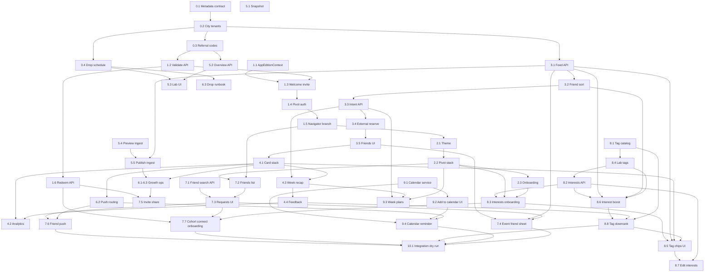

## How to use this document

Work through tasks **in order** within each phase. Do not skip to later phases unless a task explicitly says it is optional.

For every task:

1. Read **Context** and **Instructions**.
2. Implement only what that task describes (avoid scope creep).
3. Run **Evaluation criteria** as a checklist before marking the task done.
4. Record blockers or deviations in your PR / notes so the next task stays accurate.
5. **Update this file** when the task is complete (see [Agent completion](#agent-completion) below).

### Agent completion

<Warning>
**Required for agents:** When you finish a task (code merged or explicitly accepted by the user), you **must edit this markdown file** in the same PR or follow-up commit—do not leave the plan out of date.
</Warning>

For the task you completed:

1. In the [Task status ledger](#task-status-ledger), change that row from `pending` to **`done`** (and add `doneAt: YYYY-MM-DD` or PR link in the Notes column if helpful).
2. Under the task heading, change **`Status:`** from `` `pending` `` to **`done`**.
3. Check every item in that task’s **Evaluation criteria** (`- [ ]` → `- [x]`).

If work is partial or blocked, set **`Status:`** to `blocked` in the ledger and note why in Notes—do not mark `done`.

Optional tasks (e.g. 4.5, 5.1) may stay `pending` or `skipped` with a short Note.

### Task status ledger

| Task | Status | Notes |
| --- | --- | --- |
| 0.1 | done | [Metadata contract](/strategy/pivot-metadata-contract); doneAt: 2026-05-26 |
| 0.2 | done | Platform tenant management UI + dynamic APIs; doneAt: 2026-05-26 |
| 0.3 | done | [Referral codes](/strategy/pivot-referral-codes); doneAt: 2026-05-26 |
| 0.4 | done | Configurable pivot drop day/time per tenant; doneAt: 2026-06-29 |
| 1.1 | done | `AppEditionContext` + SecureStore; doneAt: 2026-05-26 |
| 1.2 | done | `POST /pivot/referral/validate`; doneAt: 2026-05-26 |
| 1.3 | done | Welcome invite + ReferralCodeScreen; doneAt: 2026-05-26 |
| 1.4 | done | PivotAuthScreen + pivot post-login stub; doneAt: 2026-05-26 |
| 1.5 | done | `PivotAppNavigator` + `AppContent` branch; doneAt: 2026-05-27 |
| 1.6 | done | `POST /pivot/referral/redeem`, `PivotReferralRedemption`, mobile sync; doneAt: 2026-05-27 |
| 2.1 | done | Just Go theme, scrapbook neo-brutalist UI, Les Flos, hero assets; doneAt: 2026-05-28 |
| 2.2 | done | PivotRoot stack + Week/Profile tabs + immersive event detail; doneAt: 2026-05-28 |
| 2.3 | done | Pivot display-name onboarding; skips campus username; doneAt: 2026-05-28 |
| 3.1 | done | GET /pivot/feed + PivotEventIntent read path; seed:pivot-feed-events; doneAt: 2026-05-28 |
| 3.2 | done | Friend-boosted feed sort + `excludeEventIds`; doneAt: 2026-06-25 |
| 3.3 | done | Intent API: feed/action, registered, week-recap; doneAt: 2026-06-25 |
| 3.4 | done | Detail Get tickets + I got a ticket; external-open tracking; doneAt: 2026-06-25 |
| 3.5 | done | Friends interested/going on card + detail; feed counts exposed; doneAt: 2026-06-25 |
| 4.1 | done | PivotCardStack + feed wiring; recap stub route; doneAt: 2026-06-25 |
| 4.2 | done | Funnel analytics helpers + card pass/interested; doneAt: 2026-06-26 |
| 4.3 | done | Week recap list + ticket CTAs + week header link; doneAt: 2026-06-26 |
| 4.4 | done | One-tap star sheet + POST/GET /pivot/feedback; doneAt: 2026-06-26 |
| 4.5 | done | POST /pivot/feedback wrapper + seed + mobile fix; doneAt: 2026-06-26 |
| 5.1 | done | PivotWeeklySnapshot + rebuild API; doneAt: 2026-06-26 |
| 5.2 | done | GET /admin/pivot/overview; doneAt: 2026-06-26 |
| 5.3 | done | Pivot Lab UI at `/admin/pivot`; doneAt: 2026-06-26 |
| 5.4 | done | POST /admin/pivot/ingest/preview + Lab import preview UI; doneAt: 2026-06-26 |
| 5.5 | done | POST /admin/pivot/ingest + Lab publish/edit; doneAt: 2026-06-26 |
| 6.1 | done | meridian://invite deep link + cold-start validation; doneAt: 2026-06-26 |
| 6.2 | done | pushAppEdition on token register + pivot notification routing; doneAt: 2026-06-26 |
| 6.3 | done | Manual weekly drop push runbook + send:pivot-weekly-push script; doneAt: 2026-06-29 |
| 7.1 | done | GET /pivot/friends/search + pivotFriendService; doneAt: 2026-06-29 |
| 7.2 | done | PivotFriends + Profile entry; pivot-scoped list/requests APIs; doneAt: 2026-06-29 |
| 7.3 | done | Search, send-by-userId, accept/decline in Pivot UI; doneAt: 2026-06-29 |
| 7.4 | done | GET /pivot/events/:eventId/friends + PivotEventFriendsSheet; doneAt: 2026-06-29 |
| 7.5 | done | Profile + Friends share sheet, copy code, pivot_invite_share analytics; doneAt: 2026-06-29 |
| 7.6 | done | Pivot friend push routing + accept/decline from notification actions; doneAt: 2026-06-29 |
| 7.7 | done | Cohort connect onboarding step — "know any of these people?" (same-cohortId joiners, request inline); doneAt: 2026-07-07 |
| 8.1 | done | Pivot tag catalog + GET /pivot/tags; seed:pivot-tag-catalog; doneAt: 2026-06-29 |
| 8.4 | done | Lab tag picker + ingest validation; seed tags updated; doneAt: 2026-06-29 |
| 8.2 | done | User interest tags API — GET/PUT /pivot/profile/interests; doneAt: 2026-06-29 |
| 8.3 | done | Interests onboarding screen + navigator gate; doneAt: 2026-06-29 |
| 8.6 | done | Interest boost in feed ranker; doneAt: 2026-06-29 |
| 8.8 | done | Negative-feedback tag downrank in feed ranker; doneAt: 2026-06-29 |
| 8.5 | done | Multi-tag chips on cards/detail/recap; doneAt: 2026-06-29 |
| 8.7 | done | Edit interests in Profile; doneAt: 2026-06-29 |
| 9.1 | done | expo-calendar service + helpers + PIVOT_CALENDAR_QA.md; doneAt: 2026-06-29 |
| 9.2 | done | Detail + recap add-to-calendar, dedupe, analytics, post-ticket prompt; doneAt: 2026-06-29 |
| 9.3 | done | PivotWeekPlansScreen, day-grouped agenda, Week tab CTA, meridian://pivot/plans; doneAt: 2026-06-29 |
| 9.4 | pending | |
| 10.1 | pending | End-to-end pilot dry run (integration gate) — **run last** (after Phases 7–9) |

<Note>
**Product boundary:** Pivot is a separate end-user experience inside the same mobile binary. Campus Meridian must remain unchanged for users who do not enter a valid referral code.
</Note>

---

## Overall context

### What we are building

A **weekly local-events pilot** (internal code name **Pivot**; consumer brand **Just Go**) that:

- Feels like a **different app** after an invite code (separate navigator, theme, copy).
- Uses **existing platform plumbing**: global auth, per-tenant Mongo DBs (city = school), Events-Backend events, pivot intent store, friendships, push tokens, universal feedback.
- Avoids **system-level changes**: no new tenancy layer, no second App Store binary, no campus UI mixed into Pivot tabs.

### Consumer brand — Just Go

User-facing voice is **action-first**: wordmark **`just go*`**, CTAs like **“just go”** (referral continue, future swipe actions), and copy that frames the loop as *swipe → save → go*. Internal paths stay `pivot` / `AppEdition`; strings live in `Meridian-Mobile/src/pivot/copy/pivotCopy.ts`.

| Surface | Copy pattern |
| --- | --- |
| Welcome (campus) | “just go — got a code?” |
| Referral | “got an invite code?” · primary CTA **just go** |
| Auth | “what are you doing this week?” · “just go in [city]” |
| Interests onboarding | “what are you into?” · “pick a few — we’ll sort your deck” |
| Week ticker | “swipe what’s on. just go” |
| Profile | “just go pilot · [city]” |
| Friends (search) | “find friends in [city]” · “add” |
| Friends (empty) | “no friends yet — search or invite someone” |
| Invite share | “bring a friend — share your code” |
| Calendar | “add to calendar” · “in your calendar ✓” |
| Week plans | “your week” · “plans this week” |
| Push (guidance) | “what are you doing this week? just go.” |

### Design language (v0 — scrapbook neo-brutalist)

Pivot should feel **hand-cut and collage-like**, not polished SaaS. Reference: YARDWORK / zine scrapbooks — **sharp ink borders**, layered offsets, level type on tilted containers. Distinct from campus Meridian (no squircle cards, no campus blue).

| Layer | Rule | Implementation |
| --- | --- | --- |
| **Palette** | Warm oat cream, ink, periwinkle ticker, clay accent, sage secondary | `PIVOT_COLORS` in `pivotTheme.ts` |
| **Logo & event titles** | Quirky display face | **Les Flos Sans** (`Les Flos Sans.otf`) via `pivotLesFlosStyle` — **`PivotWordmark`**, **`PivotScrapbookTitle`** only |
| **Other headings** | Chunky sans | **Instrument Sans** 600/700 via `pivotHeadingStyle` |
| **Body** | Mono, lowercase | **Space Mono** via `pivotBodyStyle` |
| **Cards & chips** | **No rounded corners** on catalog/editorial surfaces | `pivotScrapbookBorder` / `pivotScrapbookChip` — sharp rects, 2–2.5px ink stroke, hard shadow (`pivotCardShadow`, `shadowRadius: 0`) |
| **Card tilt** | Subtle hand-placed rotation | `PIVOT_SCRAPBOOK.cardTiltDeg` (−0.5°) on `PivotEventCard` / `PivotCreamCard`; `blobTiltDeg` (0.45°) on `PivotBlobCard` |
| **Blob / announcement card** | Cut-paper silhouette, not organic blob | `PivotBlobCard` + `PIVOT_SCRAPBOOK_CARD_PATH` (SVG quadrilateral) |
| **Event title (detail hero)** | Scrapbook strips: tilted tags, **level text**, alternating fills | `PivotScrapbookTitle` — SVG hand-cut shapes, counter-rotated type, ink/cream/accent strips; stronger tilt than cards |
| **Event detail layout** | Full-screen immersive modal | Sharp hero image → **cream gradient fade** into body; ink on cream; close pill in hero chrome (semi-transparent squircle — exception to sharp chips) |
| **Buttons on hero** | Readable on photo | `PivotButton` `onPhoto` + `outline`: **cream fill**, ink border/text (not transparent ghost on hero) |
| **Squircles** | **Legacy exception only** | `pivotSquircleStyle` retained for primary CTAs (`PivotButton` pill base) and event-detail **close** control — **not** for event cards, meta chips, or blob cards |

**Shared UI (`src/pivot/`):** `PivotWordmark`, `PivotScrapbookTitle`, `PivotScreenShell`, `PivotTicker`, `PivotCreamCard`, `PivotBlobCard` (announcements), `PivotEventCard` (catalog events), `PivotButton`, `PivotUnderlineField`, `PivotLoFiPhotoOverlay`, `PivotDesignShowcaseScreen`. Copy via `STOOP_COPY`. No campus wordmark or `@/constants` `COLORS` in pivot screens.

**Do not regress:** Reintroducing squircle corners on event surfaces, rotating title type with its strip, or transparent outline buttons on hero photos.

### Core user loops

| Actor | Loop |
| --- | --- |
| **Attendee** | Invite code → sign in → **pick interests** → **add friends** (search / invite) → swipe **Interested** → week recap → **Reserve** on Partiful/Luma → optional “I registered” → **add to calendar** / **week plans** → see friends **interested / going** → attend → quick rating → next week |
| **Ops (internal)** | Pivot Lab: paste Partiful/Luma URL → **tag event** → publish to city + week → monitor interested / registered / external opens, feedback, week-2 retention |

### Architecture (stable decisions)

| Decision | Choice |
| --- | --- |
| City isolation | `tenantKey` / subdomain (e.g. `brooklyn.meridian.study`) |
| Weekly batch | `event.customFields.pivot.batchWeek` (ISO week string) |
| **Weekly drop** | **Configurable per tenant** — `pivotDropTimezone` + day-of-week + local time on `TenantConfig`; optional per-week overrides; default pilot suggestion **Thursday 6pm** local (seed default, not a code constant) |
| Catalog events | Normal `Event` documents: `status: 'not-applicable'`, `visibility: 'public'`, `externalLink` — **no separate Pivot schema** |
| **Display host** | Real organizer from import in `customFields.pivot.host`; users never see “Meridian [city]” |
| **Technical host** | One internal **Pivot Catalog** org per city on `hostingId` (DB-required only; hidden from Pivot UI) |
| Mobile separation | `app_edition`: `campus` \| `pivot` in SecureStore + **Pivot-only navigator** |
| **Consumer brand** | **Just Go** — wordmark `just go*`; invite **code** (not “stoop code”); see [Consumer brand](#consumer-brand--just-go) |
| Drop schedule storage | `TenantConfig` tenant row: `pivotDropTimezone`, `pivotDropDayOfWeek` (0=Sun…6=Sat), `pivotDropHour`, `pivotDropMinute`; optional `pivotDropOverrides[]` for one-off `{ batchWeek, dayOfWeek, hour, minute }` when ops move a single week |
| APIs | Namespace `/pivot/*` (tenant-scoped) + `/admin/pivot/*` (cross-tenant, platform admin) |
| Referral | Global DB `PivotReferralCode` maps code → tenant + optional cohort |
| **Swipe right** | **Interested** (intent)—not campus RSVP; external ticket is separate |
| **Attendance truth** | Partiful/Luma until hosts are on-platform; optional self-confirm **Registered** |
| **Friend graph** | Reuse tenant `Friendship` collection + existing accept/send routes; **Pivot-only UI** under `src/pivot/` (no campus Profile friends tab) |
| **Friend discovery** | Search by **display name** within active city tenant (Pivot skips campus username onboarding) |
| **Event tags** | `customFields.pivot.tags` — slug array from **global tag catalog** (see Phase 8) |
| **User interests** | `User.pivotInterestTags` (tenant DB) — subset of catalog; set at onboarding, editable in Profile |
| **Calendar** | **Device calendar** via `expo-calendar` (client-only); no Meridian-hosted calendar sync for MVP |

### Repositories touched

| Area | Path |
| --- | --- |
| Mobile | `Meridian-Mobile/` |
| Backend | `Meridian/backend/` (+ `Events-Backend/` via symlink) |
| Admin UI (Pivot Lab) | `Meridian/frontend/` (new route under admin) |
| Docs | `Meridian-Mintlify/strategy/` |

### Catalog host model (display vs technical)

Imported events are still normal `Event` records. `hostingId` / `hostingType` remain **required** in Events-Backend, but Pivot must show the **actual organizer** from Partiful/Luma—not a public-facing “Meridian [city]” org.

| Layer | Storage | Shown in Pivot UI? |
| --- | --- | --- |
| **Display host** | `customFields.pivot.host` (`name`, optional `imageUrl`, `profileUrl`) | **Yes** — primary label on cards and detail |
| **Technical host** | `hostingId` → per-city **Pivot Catalog** org (`hostingType: 'Org'`) | **No** — internal only; exclude from org discovery / Atlas profiles |
| **Tickets** | `externalLink` | “Get tickets” opens provider URL |

**Do not** create a new `Org` per venue for imports.

`GET /pivot/feed` (and event detail) should return a resolved **`displayHost`** object so mobile does not read `hostingId.org_name`. Campus `EventCard` paths stay unchanged.

**Later (optional):** promote `host` to a top-level `catalogHost` sub-schema if you need indexes or dedupe by venue; not required for MVP.

---

### Weekly drop schedule (configurable)

Do **not** hardcode drop day or time in mobile, push scripts, or Lab copy. Each Pivot city tenant owns its schedule in **`TenantConfig`** so ops can move drops without a deploy.

| Field | Type | Notes |
| --- | --- | --- |
| `pivotDropTimezone` | IANA string | Pilot city local zone (e.g. `America/New_York` for NYC). Used for all drop math and “next drop” display. |
| `pivotDropDayOfWeek` | `0–6` | Sunday = `0`, Thursday = `4`. |
| `pivotDropHour` | `0–23` | Local hour in `pivotDropTimezone`. |
| `pivotDropMinute` | `0–59` | Local minute (default `0`). |
| `pivotDropOverrides` | array (optional) | `{ batchWeek, dayOfWeek, hour, minute }` — per-week exceptions when the default slot moves (holiday, ops delay, A/B timing). |

**Default pilot suggestion (not a code constant):** Thursday **6:00pm** local — gives users Thu–Sun to browse and plan before weekend events. Seed new pivot tenants with this default in Platform Admin; change per city or per week via config.

**What “drop” means at runtime:**

1. Ops publish that week’s catalog in Lab (`ingestStatus: published`, correct `batchWeek`) **before** the configured drop instant (can be days earlier).
2. At the configured local time, send the weekly push (Task 6.3) targeting pivot edition tokens for that tenant.
3. Mobile deck refresh is driven by `GET /pivot/feed` — users see the new week’s published events whenever they open the app; push is the nudge, not the publish gate.

**Resolved schedule helper (backend):** `resolvePivotDropInstant(tenant, batchWeek, now?)` → UTC `Date` for the effective drop instant (override wins over default). Expose resolved schedule on:

- `GET /pivot/config` (mobile) — `{ dropSchedule: { timezone, dayOfWeek, hour, minute, nextDropAt, batchWeek } }`
- Platform Admin tenant detail + Pivot Lab city header — “Next drop: Thu Jun 5, 6:00pm ET”

**Constraints:** No automated cron required for pilot (Task 6.3 runbook). Do not tie `batchWeek` ISO week boundaries to drop day in code — `batchWeek` labels catalog rows; drop time is independent and configurable.

---

### Intent vs registration (external catalog)

Creators are **external** for MVP (Partiful/Luma). Swipe-right is **not** ticket confirmation. Do **not** open the external URL on swipe (breaks the feed). Do **not** fake campus RSVP (misleading “friends going”).

| Strategy | MVP decision |
| --- | --- |
| Open external page on swipe right | **No** — too much friction |
| Meridian-only RSVP (ignore external) | **No** — dishonest for scraped events |
| **Interested → recap → Reserve externally** | **Yes** — default loop |
| Optional self-confirm **Registered** | **Yes** — after external signup |

**Per-user states** (tenant DB; do not reuse campus `attendees` as “going” unless status is explicit):

| State | Meaning | UI copy | Friend-facing |
| --- | --- | --- | --- |
| `interested` | Swipe right / tap Interested | “Interested” | “X friends interested” |
| `registered` | User tapped “I got a ticket” (self-report v0) | “Going” | “X friends going” |
| `passed` | Swipe left | — | — |

**Where external opens:** event detail **Get tickets**, and **week recap** list—not on swipe.

**APIs:**

- `POST /pivot/feed/action` — `{ eventId, action: 'interested' \| 'pass' }`
- `GET /pivot/week-recap` — interested events for user + batch week
- `POST /pivot/intent/:eventId/registered` — self-confirm (optional `openedExternalAt` from client)
- Track `pivot_external_open` when user taps Reserve (analytics)

**Later:** on-platform hosts can map **Registered** to real Meridian RSVP without changing swipe UX.

---

### Friends in Pivot (read vs build)

Social proof on events is **done** (Phase 3.2 / 3.5): friend-boosted feed sort, avatar stacks, and “N friends interested / M going” on cards and detail — backed by the tenant `Friendship` graph + `PivotEventIntent`.

**Done (Phase 7, 2026-06-29):** Pivot users can grow and manage the friend graph inside the edition — name search, send/accept/decline requests, friends list on Profile, tappable event friend sheet, invite share, and pivot-scoped push routing for friend notifications.

| Capability | Status | Notes |
| --- | --- | --- |
| See friends on an event | **Done** — `PivotFriendSocialProof` + `PivotEventFriendsSheet` (Task 7.4) | Tap social proof for full going / interested lists |
| Add / accept friends | **Done** — `PivotFriendSearchScreen`, requests inbox, Profile entry (Tasks 7.1–7.3) | Search by **name**; `/pivot/friends/*` bypasses tenant gate |
| Invite to pilot | **Done** — share sheet + copy code on Profile/Friends (Task 7.5) | Uses stored referral code + `meridian://` / https invite links |
| Friend push | **Done** — pivot edition routing for requests + accept/decline actions (Task 7.6) | Campus routing unchanged when `pushAppEdition !== 'pivot'` |
| Connect with cohort at onboarding | **Done** — "know any of these people?" step (Task 7.7) | Suggests joiners sharing a code `cohortId` from redemption records; send requests inline; skippable; auto-skips when cohort empty |

**Constraints:** Friend search is **same city tenant** only for MVP. Do not mount campus `FriendsScreen` / `ProfileScreen` friends tab inside `PivotAppNavigator`. Campus users who later enter Pivot keep their existing friend graph.

---

### Tags & interests (read vs build)

**Partial today:** Events may carry `customFields.pivot.tags` (metadata contract Task 0.1) and the feed returns `tags[]`; mobile shows the **first tag only** via `formatPivotEventTag` on cards. Ingest defaults to `tags: []` unless ops set them manually in DB.

**Not built yet (Phase 8):**

| Capability | Today | Phase 8 target |
| --- | --- | --- |
| Canonical tag list | Ad hoc strings in event JSON | Global **tag catalog** with labels (Task 8.1) |
| User interests | Onboarding + Profile edit (Tasks 8.2–8.3, 8.7) | — |
| Ops tagging | Empty on publish | Lab multi-select; ≥1 tag required to publish (Task 8.4) |
| Card / detail UI | Multi-tag chips (Task 8.5) | — |
| Feed ranking | Friend boost only (Task 3.2) | **Interest boost** + negative-feedback tag penalty (Tasks 8.6, 8.8) |

**Tag rules:** Slugs are lowercase kebab-case (`board-games`, `live-music`). User interests must be catalog slugs. Event tags use the same vocabulary so ranker and Lab stay aligned.

---

### Calendar (read vs build)

Pivot is **not** a campus-style month calendar (see [events marketplace pivot](/strategy/events-marketplace-pivot#2-time-model-continuous-calendar--weekly-anchor-window)). **Easy calendar interaction** means low-friction **export to the phone’s calendar** and a **compact week plans view** for events the user already marked interested or going.

| Capability | Today | Phase 9 target |
| --- | --- | --- |
| Add to Apple / Google calendar | None in Pivot | One tap from detail + recap (Tasks 9.1–9.2) |
| See plans at a glance | Week recap list only (unordered picks) | Day-grouped **week plans** agenda (Task 9.3) |
| Reminders | Campus `EventNotificationService` exists; not wired in Pivot | Optional **1h-before** local reminder when adding (Task 9.4) |
| “Already added” state | — | Local dedupe + “in your calendar” chip (Task 9.2) |

**Constraints:** Use event `start_time`, `end_time`, `location`, `name`, and `displayHost.name` already on feed/recap payloads — **no new backend schema required** for MVP. Do not mount campus `RoomScheduleCalendar` or month-grid UI in Pivot.

---

### Out of scope for this MVP

- Second App Store listing / separate bundle ID
- ML ranker, embeddings, spatial/video dataset
- Organizer payouts, surge pricing, self-serve host onboarding
- Campus feature changes (Home, ClubDash, approvals) except bugfixes
- Automated drop-time cron (manual push OK for pilot; schedule is configurable per tenant — see [Weekly drop schedule](#weekly-drop-schedule-configurable))
- Cross-city friend search, contact-book import, or in-app QR scan (pilot city only)
- Post-event “add friend I met” QR / bump (defer; use search + invite for MVP)
- User-created or free-text tags (catalog only for MVP)
- ML tag inference from event descriptions (manual + optional Lab suggest only)
- Full-month calendar grid, two-way Google/Outlook sync, or server-generated `.ics` feeds
- Auto-add every swipe-right to calendar (only explicit user action)

### Pilot success metrics (program level)

Track in Pivot Lab after **Phase 5**:

| Metric | Target (guidance) |
| --- | --- |
| Week-2 return | ≥ 40% of week-1 users open Pivot / swipe again |
| Interested rate | ≥ 20% of card impressions → interested |
| External open rate | ≥ 30% of interested users tap Reserve (recap or detail) |
| Self-confirm rate | ≥ 15% of interested → `registered` (guidance) |
| Feedback rate | ≥ 25% of **registered** users leave a rating |
| Ops ingest time | &lt; 2 min per event URL (after Phase 4) |
| Qualitative | ≥ 8 interviews; themes logged in Lab |
| Friend connections | ≥ 50% of week-1 users send or accept ≥ 1 friend request in Pivot |
| Interests onboarding | ≥ 70% of new Pivot users save ≥ 1 interest tag (skip allowed) |
| Event tag coverage | 100% of published catalog events have ≥ 1 catalog tag |
| Calendar adds | ≥ 25% of **registered** users add ≥ 1 event to device calendar |

---

## Phase 0 — Prerequisites and conventions

### Task 0.1 — Document pivot metadata contract


**Status:** `done`

**Context:** All cities and dashboards assume one shape on events.

**Instructions:**

1. Add a short internal spec (this doc section is canonical) for `customFields.pivot`:

```json
{
  "batchWeek": "2026-W21",
  "source": "luma | partiful | manual",
  "sourceUrl": "https://...",
  "host": {
    "name": "Brooklyn Board Game Cafe",
    "imageUrl": "https://...",
    "profileUrl": "https://partiful.com/u/..."
  },
  "tags": ["music", "outdoor"],
  "ingestStatus": "draft | published",
  "importedAt": "ISO-8601",
  "importedBy": "globalUserId or ops email"
}
```

2. Agree on ISO week format: `YYYY-Www` (e.g. `2026-W21`).
3. Document API field **`displayHost`**: server maps from `customFields.pivot.host` (required for published catalog events).
4. Document **`PivotEventIntent`** statuses: `interested`, `registered`, `passed` (see [Intent vs registration](#intent-vs-registration-external-catalog)).
5. Share with anyone ingesting events manually before Lab exists.

Canonical spec: [Pivot metadata contract](/strategy/pivot-metadata-contract).

**Evaluation criteria:**

- [x] Contract is written and linked from this plan
- [x] Team agrees `batchWeek` and `host.name` are required for every published Pivot catalog event
- [x] Sample event JSON includes `host` and notes internal `hostingId` (Pivot Catalog org)
- [x] `displayHost` response shape documented for `/pivot/feed`

---

### Task 0.2 — Provision pilot city tenant(s)


**Status:** `done`

**Context:** Cities are schools; each needs a DB and tenant row.

**Instructions:**

1. Add tenant(s) via `TenantConfig` (e.g. `brooklyn`, `austin`) with `location` set to real city names.
2. Ensure Mongo connection works for each `tenantKey` (same process as adding a school).
3. Create subdomain DNS / dev override: `brooklyn` host → backend `req.school = 'brooklyn'`.
4. Seed per city **one internal org only** (technical host, not user-facing):
   - Name example: `Pivot Catalog — Brooklyn` (not “Meridian Brooklyn” on consumer UI)
   - Flags: hidden from org discovery / public org list if your config supports it; document org `_id` for ingest
   - No per-venue orgs—venues live in `customFields.pivot.host` only
5. When provisioning pivot tenants, set initial **weekly drop** defaults (Task 0.4): timezone + day/time — suggested **Thursday 18:00** local until ops change in Platform Admin.

**Dynamic provisioning (implemented):** Use **Platform Admin → Tenant management** at `/platform-admin` (platform admin only). Creates tenant rows in global `TenantConfig`, derives Mongo URI, runs health check, auto-provisions Pivot Catalog org for pivot cities, and surfaces manual DNS/CORS checklist. New pivot tenants seed weekly drop defaults (Task 0.4); edit in tenant metadata modal or **Weekly drop** tab.

**Evaluation criteria:**

- [x] `GET /api/tenant-config` lists new city tenant(s) as `active`
- [x] Health check against city subdomain returns DB OK
- [x] Pivot Catalog org `_id` documented in runbook for ingest scripts
- [x] Org is not linked from Pivot mobile UI and does not appear in featured orgs

---

### Task 0.3 — Create referral codes for pilot cohorts


**Status:** `done`

**Context:** Codes are the only gate into Pivot edition.

**Instructions:**

1. Add global schema `PivotReferralCode` (in `Meridian/backend/schemas/`) with fields: `code`, `tenantKey`, `cohortId`, `maxRedemptions`, `redemptionCount`, `expiresAt`, `active`, `batchWeek` (optional default week).
2. Seed 2–3 codes (e.g. `NYC-PILOT-A`, `NYC-PILOT-B`) tied to `nyc`.
3. Register model in `getGlobalModelService.js`.
4. Seed via `npm run seed:pivot-referral-codes` (or `node migrations/seedPivotReferralCodes.js`).

Canonical spec: [Pivot referral codes](/strategy/pivot-referral-codes).

**Evaluation criteria:**

- [x] Codes exist in global DB and are `active`
- [x] Each code maps to exactly one `tenantKey`
- [x] Expired/inactive codes are testable in DB

---

### Task 0.4 — Configurable pivot drop day/time (tenant config)


**Status:** `done` (2026-06-29)

**Implementation notes (2026-06-29):**

- **Schedule resolver:** `utilities/pivotDropSchedule.js` + `services/pivotConfigService.js` (`buildDropSchedulePayload`, `getPivotConfig`).
- **Tenant config:** drop fields on `tenantEntrySchema`; new pivot tenants seed `PIVOT_DROP_PILOT_DEFAULTS` (Thursday 18:00 America/New_York).
- **Platform Admin:** tenant metadata modal **Weekly drop** fields + overrides; tenant detail read-only **Next drop**; dedicated **Weekly drop** tab for send-window ops (Task 6.3).
- **Pivot Lab:** city summary cards + catalog header show resolved **Next drop** for selected `batchWeek`.
- **API:** `GET /pivot/config` (`verifyToken`) returns `dropSchedule` for authenticated pivot users.
- **Tests:** `tests/unit/pivotDropSchedule.test.js`, `tests/unit/pivotConfigService.test.js`, `GET /pivot/config` in `pivotRoutes.outcomes.test.js`.

**Context:** Weekly deck push timing must not be baked into code as “Thursday 6pm.” Ops need to set default day/time per pilot city and override individual weeks when schedules slip.

**Instructions:**

1. Extend `tenantEntrySchema` in `Meridian/backend/schemas/tenantConfig.js`:
   - `pivotDropTimezone` (string, IANA, required for `tenantType: 'pivot'`)
   - `pivotDropDayOfWeek` (number 0–6)
   - `pivotDropHour` (number 0–23)
   - `pivotDropMinute` (number 0–59, default `0`)
   - `pivotDropOverrides` (optional array of `{ batchWeek, dayOfWeek, hour, minute }`)
2. Update `normalizeTenantRow` / `toStoredTenantRow` in `tenantConfigService.js` and `defaultTenants.js` merge helpers so fields round-trip through Platform Admin APIs.
3. Add `resolvePivotDropInstant(tenant, batchWeek, now?)` in `Meridian/backend/utilities/pivotDropSchedule.js` (or `services/pivotDropScheduleService.js`):
   - Pick override row when `batchWeek` matches; else use tenant default fields
   - Convert local instant in `pivotDropTimezone` to UTC `Date`
   - Return `{ dropAt, batchWeek, timezone, dayOfWeek, hour, minute, source: 'default' | 'override' }`
4. **Platform Admin → Tenant management:** on pivot tenant detail / metadata modal, add **Weekly drop** fields (timezone picker or text, day-of-week select, time inputs) plus optional **Overrides** table (batch week + alternate day/time). Default new pivot tenants to **Thursday 18:00** in a sensible timezone derived from `location` or ops input.
5. **Pivot Lab:** show resolved **Next drop** for selected city + `batchWeek` (calls same resolver).
6. **`GET /pivot/config`** (`verifyToken`) in `pivotRoutes.js` — return `dropSchedule` with resolved `nextDropAt` for active tenant (used by mobile copy / future countdown UI; no UI required in this task).
7. Unit tests: `tests/unit/pivotDropSchedule.test.js` — default schedule, override wins, invalid timezone fails gracefully, DST edge documented.

**Evaluation criteria:**

- [x] Pivot tenant row stores timezone + day + time; campus tenants omit fields
- [x] Platform Admin can change default drop without code change
- [x] Ops can add `pivotDropOverrides` entry to move one `batchWeek` without changing default
- [x] `resolvePivotDropInstant` returns correct UTC instant for default and override cases
- [x] `GET /pivot/config` exposes `dropSchedule` for authenticated pivot users
- [x] Pivot Lab displays next drop for selected city/week
- [x] No mobile or backend string literals enforce “Thursday” or “18:00” as the only drop time

---

## Phase 1 — Mobile edition gate (separate product entry)

### Task 1.1 — `AppEditionContext` and SecureStore persistence


**Status:** `done`

**Context:** Root of mobile separation; must survive app restart.

**Instructions:**

1. Create `Meridian-Mobile/src/contexts/AppEditionContext.tsx`:
   - State: `edition: 'campus' | 'pivot' | null` (`null` = loading)
   - `pivotMeta: { code, tenantKey, subdomain, cohortId, cityDisplayName } | null`
2. Persist keys in SecureStore:
   - `app_edition`
   - `pivot_meta` (JSON string)
3. Expose: `setPivotEdition(meta)`, `clearEdition()`, `loadEditionOnBoot()`.
4. Wrap app root in `AppEditionProvider` (above or beside `AuthProvider`).

**Evaluation criteria:**

- [x] Cold start reads edition from SecureStore before showing main navigator
- [x] `setPivotEdition` persists and survives force-quit
- [x] `clearEdition` returns to `campus` and clears pivot meta
- [x] No imports from `src/pivot/` in campus-only screens yet

---

### Task 1.2 — Referral validate API (backend)


**Status:** `done`

**Context:** Mobile must not trust client-side tenant guessing.

**Instructions:**

1. Create `Meridian/backend/routes/pivotRoutes.js` mounted at `/pivot` in `app.js`.
2. Implement `POST /pivot/referral/validate` (no auth required):
   - Body: `{ code: string }`
   - Normalize code (trim, uppercase)
   - Load `PivotReferralCode`; check `active`, `expiresAt`, `redemptionCount < maxRedemptions`
   - Resolve tenant row from `TenantConfig` for `tenantKey`
   - Return `{ success, data: { tenantKey, subdomain, cohortId, cityDisplayName, batchWeek } }`
3. Rate-limit lightly (e.g. 20/min per IP) if middleware exists; otherwise document manual limit.

**Evaluation criteria:**

- [x] Valid code returns 200 with subdomain usable by mobile HTTP client
- [x] Invalid / expired / maxed code returns 4xx with clear message
- [x] Unit or manual curl tests documented in PR

---

### Task 1.3 — Welcome screen: “Just go — got a code?”


**Status:** `done`

**Context:** Campus users see unchanged welcome; pivot path is opt-in.

**Instructions:**

1. On `WelcomeScreen.tsx`, add text button below Sign In: **“Just go — got a code?”** (see [Consumer brand](#consumer-brand--just-go))
2. Navigate to new screen `ReferralCodeScreen`:
   - Text input, Continue button
   - Calls `POST /pivot/referral/validate`
   - On success: `setPivotEdition(meta)` + `setSelectedSubdomain(subdomain)` from `subdomainStorage`
   - Navigate to Pivot auth entry (Task 1.4) or shared Login with param `edition=pivot`
3. Support optional deep link query `?code=` on Welcome (read in `AppNavigator` linking later in Phase 6).

**Evaluation criteria:**

- [x] Campus Get Started / Sign In flow unchanged
- [x] Valid code never shows `DomainPicker` with RPI/TVCOG
- [x] Invalid code shows inline error; user stays on referral screen
- [x] Successful code sets edition + subdomain before login

**Implementation notes (2026-05-28):** Welcome link uses Just Go voice via `STOOP_COPY.welcome.inviteLink` (“just go — got a code?”). Referral screen pill/title use **just go pilot** / **got an invite code?**; continue button label is **just go**.

---

### Task 1.4 — Pivot-branded auth entry screen


**Status:** `done`

**Context:** Zero campus copy after referral; still use same login APIs.

**Instructions:**

1. Add `PivotAuthScreen.tsx` (or reuse Login with pivot layout branch):
   - Just Go wordmark (`just go*`) / theme colors
   - Copy: **“Just go in [cityDisplayName]”** · hero **“What are you doing this week?”**
   - Google / email sign-in only (same `AuthContext` methods)
2. After successful login, navigation must **not** go to `MainTabs`.
3. Skip campus `Onboarding` username requirements if product allows (or minimal Pivot onboarding in Phase 2).

**Evaluation criteria:**

- [x] Login works against city subdomain (API base URL uses `brooklyn` not `rpi`)
- [x] No “Discover your campus” strings on this path
- [x] Failed login does not reset edition or subdomain

---

### Task 1.5 — Root navigator branch by edition


**Status:** `done`

**Context:** Separate UI tree — highest-impact separation.

**Instructions:**

1. In `App.tsx` (or parent of `AppNavigator`), branch:
   - `edition === 'pivot'` → `PivotAppNavigator`
   - else → existing `AppNavigator`
2. Create `Meridian-Mobile/src/pivot/navigation/PivotAppNavigator.tsx`:
   - `NavigationContainer` with pivot-only screens (stub initially)
   - Unauthenticated: `PivotAuthScreen` (or Referral → Auth)
   - Authenticated: stub `PivotWeekPlaceholder` with “This week (coming soon)”
3. Ensure campus `StackNavigator` is **not mounted** when `edition === 'pivot'`.

**Implementation notes (2026-05-27):** Branching is in `Meridian-Mobile/AppContent.tsx`. After a valid invite code on campus, `ReferralCodeScreen` only calls `setPivotEdition` (no `navigate`) so the app swaps to `PivotAppNavigator` and lands on `PivotAuth` with meta from context. Campus `StackNavigator` no longer registers `PivotAuth` or `PivotWeekPlaceholder`. **`clearEdition()`** (e.g. dev back on `PivotAuth`) unmounts the pivot tree and restores campus `AppNavigator` to **Welcome**.

**Evaluation criteria:**

- [x] Entering valid code + login lands on Pivot stub, never `MainTabs`
- [x] Campus login without code still lands on `MainTabs` / normal flow
- [x] Logout from Pivot returns to Welcome or Pivot auth per spec (document choice)
- [x] `clearEdition()` from dev menu restores campus navigator

**Logout choice:** While `edition` remains `pivot`, logging out resets the **pivot** stack to **`PivotAuth`** (invited city context preserved). Clearing the edition returns to campus **Welcome**.

---

### Task 1.6 — Redeem referral on first authenticated session


**Status:** `done`

**Context:** Enforce max redemptions server-side.

**Instructions:**

1. Add `POST /pivot/referral/redeem` (requires auth):
   - Body: `{ code }`
   - Increment `redemptionCount` if user not already redeemed (store `PivotReferralRedemption` with `globalUserId + code` or idempotent upsert)
2. Call from mobile once after first successful Pivot login.

**Implementation notes (2026-05-27):** Global collection `pivot_referral_redemptions` with unique index `(globalUserId, code)`. `redeemReferralCode` in `pivotReferralCodeService.js` checks `req.school` matches the code’s tenant, requires JWT `globalUserId`, increments `PivotReferralCode` atomically, and rolls back the increment if a duplicate-key race inserts two redemption rows for the same user. Mobile **`PivotReferralRedeemSync`** runs inside **`PivotAppNavigator`** after authentication; **`PIVOT_REFERRAL_REDEEMED_CODE_KEY`** in SecureStore skips repeat calls after success ( **`clearEdition`** deletes it).

**Evaluation criteria:**

- [x] Second device with same code works until `maxRedemptions`
- [x] Same user double-login does not double-count
- [x] Lab can see redemption count in DB

---

## Phase 2 — Pivot shell UX (empty but real product)

### Task 2.1 — Pivot theme and assets


**Status:** `done`

**Context:** Users must feel they left campus Meridian.

**Instructions:**

1. Add `src/pivot/theme/pivotTheme.ts` (colors, typography overrides).
2. Add pivot wordmark asset (or text logo placeholder).
3. Apply theme to all screens under `src/pivot/`.

**Implementation notes (2026-05-28):**

**Consumer brand:** **Just Go** — wordmark **`just go*`** (internal code paths remain `pivot` / `AppEdition`). All user-facing strings in `Meridian-Mobile/src/pivot/copy/stoopCopy.ts` (legacy filename; exports `STOOP_COPY`). Voice is CTA-centered: swipe → tickets → **just go** (not neighborhood/stoop metaphor). Welcome: “just go — got a code?”; referral CTA: **just go**; auth: “what are you doing this week?” / “just go in [city]”.

**Visual direction:** Neo-brutalist **scrapbook / zine** collage (YARDWORK-adjacent, not a clone). Distinct palette in `pivotTheme.ts`: warm oat **cream** `#F2EBE1`, **ink** `#1E1B18`, **periwinkle** ticker bar (not safety yellow), **clay rose** accent, **sage** secondary — no campus blue or corporate CTAs. Surfaces use **sharp ink-bordered** shapes and hard shadows; cards get **subtle tilt** only (`PIVOT_SCRAPBOOK`).

**Typography:** **Les Flos Sans** (default cut — not Sage/Chaos) for **`just go*`** wordmark and **event detail scrapbook titles** (`pivotLesFlosStyle`). **Instrument Sans** 600/700 for other display headings (`pivotHeadingStyle`). **Space Mono** for body (`pivotBodyStyle`). Loaded in `PivotFontsProvider` via `useFonts`. `surface: 'photo' | 'card'`: cream type on hero photos, ink on cream cards.

**Hero & overlay:** Default full-bleed **`pivot-hero-canopy.png`**. Profile tab uses **`pivot-hero-coast.png`**. Shared hero registry: `pivotHeroAssets.ts`. `PivotLoFiPhotoOverlay`: soft **dark vignette** (top, sides, bottom edge), film grain tile, warm cast; **cream lift only at the bottom** for signup cards. `PivotScreenShell`: image + overlays edge-to-edge (translucent status bar, ticker inside hero with safe-area padding).

**Scrapbook surfaces:** `pivotScrapbookBorder`, `pivotScrapbookChip`, `PIVOT_SCRAPBOOK_CARD_PATH`. **`PivotEventCard`**, **`PivotCreamCard`**, **`PivotBlobCard`**, and detail **meta/tag chips** use **zero border-radius**. **`PivotScrapbookTitle`**: 1–3 hand-cut SVG strips, counter-rotated level type, alternating ink/cream/accent fills. Pilot preview event: `pivotPreviewEvent.ts` + tap-through from week tab.

**Corners (exceptions):** `pivotSquircleStyle` / `borderCurve: 'continuous'` **only** for **`PivotButton`** pill base and event-detail **close** pill — not catalog cards.

**Buttons:** `PivotButton` primary = ink pill. **`onPhoto` outline** = cream background + ink border/text for legibility on hero (ghost variant removed from design showcase; avoid transparent text-on-photo).

**Shared UI (under `src/pivot/`):** `PivotWordmark`, `PivotScrapbookTitle`, `PivotScreenShell`, `PivotTicker`, `PivotCreamCard`, `PivotBlobCard` (announcements only), `PivotEventCard` (catalog events), `PivotButton`, `PivotUnderlineField`, `PivotLoFiPhotoOverlay`, `PivotDesignShowcaseScreen`. Applied to auth, week, profile, referral entry, and design showcase via `STOOP_COPY`. See [Design language](#design-language-v0--scrapbook-neo-brutalist).

**Evaluation criteria:**

- [x] No Meridian campus wordmark on Pivot screens
- [x] Status bar / headers use pivot primary color
- [x] Theme is imported only from `src/pivot/**`
- [x] Event cards and announcement blob use sharp scrapbook borders (not squircle cards)
- [x] Wordmark and event detail title use Les Flos Sans

---

### Task 2.2 — Pivot main navigator structure


**Status:** `done`

**Context:** Minimal IA: week feed is home.

**Instructions:**

1. Replace placeholder with `PivotRootStack`:
   - `PivotWeek` (home)
   - `PivotEventDetail`
   - `PivotProfile` (settings-lite)
2. Optional: single bottom tab (Week | Profile) — avoid multi-tab campus parity.
3. Header: week label (“May 19–25”) from server or client ISO week.

**Implementation notes (2026-05-28):** Authenticated shell is `PivotRoot` in `PivotAppNavigator` → `PivotRootNavigator` (stack) with `PivotMainTabs` (bottom tabs: Week | Profile) and stacked `PivotEventDetail`. Week header uses client ISO week via `formatWeekRangeLabel` in `src/pivot/utils/pivotIsoWeek.ts`. **Event detail** is a **full-screen immersive** transparent modal (spring open + drag-to-dismiss) over blurred week hero — sharp hero image, **cream gradient fade** into body, **`PivotScrapbookTitle`** for event name, host/hook in ink on cream, close pill in hero chrome (squircle exception). **Events** use **`PivotEventCard`** (sharp scrapbook card, subtle tilt); **announcements** use **`PivotBlobCard`** (cut-paper SVG). Week tab includes **`PIVOT_PREVIEW_EVENT`** stub for tap-through until Task 3.1 feed. Profile: **Sign out** (`logout`) and **Leave pilot** (`clearEdition` + `clearSelectedSubdomain` → campus `AppNavigator` / Welcome). Android: app-level `goBack` pops event detail; Profile tab back switches to Week. Copy remains **Just Go**-centered throughout (see Task 2.1 / [Design language](#design-language-v0--scrapbook-neo-brutalist)).

**Evaluation criteria:**

- [x] User can navigate Week → Event detail → back
- [x] Profile shows logout + “Leave pilot” (calls `clearEdition()`, navigates to campus Welcome)
- [x] Android back button behaves correctly

---

### Task 2.3 — Minimal Pivot onboarding (if needed)


**Status:** `done`

**Context:** Campus onboarding requires username; pivot may not.

**Instructions:**

1. If JWT user lacks `name`, show one screen: display name → save via existing profile API.
2. Skip username requirement for pivot edition only (client-side gate).
3. Do not register for campus orgs.

**Implementation notes (2026-05-28):** `PivotOnboardingScreen` (Just Go themed) posts `{ name }` to `POST /update-user` — **no username field**. Gate in `PivotAppNavigator`: `needsPivotDisplayName` → `PivotOnboarding` before `PivotRoot`; users with a name skip straight to week. Campus `StackNavigator` / `OnboardingScreen` unchanged (still requires name + username). Copy in `STOOP_COPY.onboarding`; analytics `pivot_onboarding_completed`.

**Follow-up (Phase 8):** add **`PivotInterestsOnboarding`** after display name (Task 8.3) — do not fold interests into this screen; keep one concern per step.

**Evaluation criteria:**

- [x] Pivot user with only email can reach `PivotWeek` in one extra step max
- [x] Campus onboarding rules unchanged for campus edition

---

## Phase 3 — Backend feed and catalog

### Task 3.1 — `GET /pivot/feed`


**Status:** `done`

**Context:** Tenant-scoped deck for current week.

**Instructions:**

1. In `pivotRoutes.js`, `GET /pivot/feed` with `verifyToken`:
   - Read `req.school` (city tenant)
   - Query `Event` where:
     - `customFields.pivot.batchWeek` = query `batchWeek` or current ISO week
     - `customFields.pivot.ingestStatus` = `'published'`
     - `status` in `['approved', 'not-applicable']`
     - `isDeleted` false
     - `start_time` within pilot window (e.g. tomorrow through +7 days)
   - Sort v0: `registrationCount` desc, then `start_time` asc
   - Populate attendees (friends optional); **do not** expose technical `hostingId` name to client
   - For each event, attach **`displayHost`** from `customFields.pivot.host` (fail ingest QA if `host.name` missing on published events)
   - Include **`userIntent`**: `'interested' | 'registered' | null` and social counts: `friendsInterested`, `friendsGoing` (registered only)
2. Return `{ events: [{ ...eventFields, displayHost, userIntent, friendsInterested, friendsGoing }], batchWeek, cityDisplayName }`.

**Implementation notes (2026-05-28):**

- **`GET /pivot/feed`** in `Meridian/backend/routes/pivotRoutes.js` → `services/pivotFeedService.js` (`getPivotFeed`).
- Query filters: published pivot metadata, `batchWeek` (query or `toIsoWeek()`), pilot window **tomorrow UTC → +7 days**, `host.name` required.
- Response strips `hostingId`; returns catalog fields + `displayHost`, `userIntent`, `friendsInterested[]`, `friendsGoing[]` (friend previews capped at 5; registered friends appear in both interested + going lists per Task 3.5 shape).
- **`PivotEventIntent`** tenant schema (`schemas/pivotEventIntent.js`, collection `pivotEventIntents`) registered in `getModelService.js` for intent reads (writes land in Task 3.3).
- **`cityDisplayName`** from tenant config (`location` || `name`).
- Manual seed: `npm run seed:pivot-feed-events` (3 NYC catalog events for current `batchWeek`).

**Evaluation criteria:**

- [x] Feed returns only published pivot events for active city
- [x] Empty feed returns 200 with `events: []`
- [x] Manual seed of 3 events appears in feed for test user
- [x] Each event includes `displayHost.name` from import, not Pivot Catalog org name

---

### Task 3.2 — Friend-boosted sort (v0 ranker)


**Status:** `done`

**Context:** Reuse friendship data without new ML service.

**Instructions:**

1. In feed aggregation, boost events where friends have **`interested`** or **`registered`** (prefer `registered` weight).
2. Sort: `friendRegistered` desc, `friendInterested` desc, then `start_time` asc.
3. Optionally accept `excludeEventIds` from client (passed cards).

**Implementation notes (2026-06-25):**

- `getPivotFeed` in `Meridian/backend/services/pivotFeedService.js` now re-sorts the resolved feed in-process via `compareByFriendBoost`: `friendRegisteredCount` desc → `friendInterestedCount` desc → `start_time` asc (the DB `registrationCount` sort remains the pre-boost ordering). Registered friends count toward both registered and interested so a friend-registered event always outranks a friend-interested-only event.
- `loadFriendSocial` reuses the existing accepted-friend + `PivotEventIntent` reads and now also returns per-event `friendRegisteredCount` / `friendInterestedCount` (uncapped) alongside the capped `friendsInterested` / `friendsGoing` preview arrays. No new collections or campus RSVP reads.
- `GET /pivot/feed` accepts an optional `excludeEventIds` query (comma-separated or repeated). `normalizeExcludeEventIds` trims, validates ObjectIds, and dedupes; valid ids are applied as `_id: { $nin: [...] }` so passed cards are excluded server-side.
- Tests: `tests/unit/pivotFeedService.test.js` (friend-boost ordering, exclude query, normalize helper) and `tests/route-outcomes/pivotRoutes.outcomes.test.js` (route forwards `excludeEventIds`).

**Evaluation criteria:**

- [x] Event with friend **registered** ranks above friend **interested** only
- [x] Passed IDs from client are excluded when provided

---

### Task 3.3 — Pivot intent API (interested ≠ campus RSVP)


**Status:** `done`

**Context:** External creators own ticketing; Meridian stores **intent** only for MVP.

**Instructions:**

1. Add tenant-scoped store (choose one and document):
   - **Preferred:** `PivotEventIntent` collection `{ userId, eventId, batchWeek, status: 'interested' | 'registered' | 'passed', updatedAt }` with unique index `(userId, eventId)`
   - **Avoid:** writing campus `attendees` rows that imply confirmed RSVP without `registered`
2. `POST /pivot/feed/action` with `verifyToken`:
   - Body: `{ eventId, action: 'interested' | 'pass' }`
   - Upsert intent; validate event is published pivot catalog in active batch window
3. `POST /pivot/intent/:eventId/registered` — set status `registered` (idempotent).
4. `GET /pivot/week-recap` — list user’s `interested` events for `batchWeek` (default current), include `displayHost`, `externalLink`, `userIntent`.

**Implementation notes (2026-06-25):**

- New `Meridian/backend/services/pivotIntentService.js` holds all three writes/reads; all DB access goes through request-scoped `getModels(req, ...)` on the tenant DB. No campus `attendees` / RSVP endpoints are touched — intents live only in the `PivotEventIntent` collection (`schemas/pivotEventIntent.js`, registered in `getModelService.js`, unique index `(userId, eventId)`).
- **`POST /pivot/feed/action`** (`verifyToken`): body `{ eventId, action: 'interested' | 'pass' }`. `pass` maps to status `passed`; validates the event via `findPublishedPivotEvent` (published pivot catalog, `status` in `approved`/`not-applicable`, not deleted, `host.name` present) **and** the active pilot window (tomorrow → +7d, shared with the feed). `batchWeek` is copied from the event's `customFields.pivot.batchWeek`; intent is upserted by `(userId, eventId)`.
- **`POST /pivot/intent/:eventId/registered`** (`verifyToken`): idempotent upsert to status `registered`; same published-pivot validation but without the swipe window check (self-confirm can land after browsing).
- **`GET /pivot/week-recap`** (`verifyToken`): returns the user's `interested` **and** `registered` events for `batchWeek` (default current ISO week), sorted by `start_time`, each with `displayHost`, `externalLink`, and `userIntent`. **Passed events are excluded** (documented choice — they never appear in recap).
- Validation: invalid `eventId` → 400 `INVALID_EVENT_ID`; bad action → 400 `INVALID_ACTION`; non-pivot/inactive event → 404 `EVENT_NOT_FOUND`; bad `batchWeek` → 400 `INVALID_BATCH_WEEK`. Responses use the standard `{ success, data | message, code }` shape.
- Tests: `tests/unit/pivotIntentService.test.js` and route cases in `tests/route-outcomes/pivotRoutes.outcomes.test.js`.

**Evaluation criteria:**

- [x] Swipe actions persist and survive app restart
- [x] `pass` excludes event from recap (or shows dismissed—document choice)
- [x] Campus event RSVP endpoints are **not** called from Pivot swipe flow
- [x] Two users can both be `interested` on same event without attendee row confusion

---

### Task 3.4 — External reserve (detail + recap, not on swipe)


**Status:** `done`

**Context:** Ticket confirmation happens off-platform; reduce feed friction.

**Instructions:**

1. **Do not** auto-open `WebBrowser` on swipe right.
2. `PivotEventDetail`: primary CTA **Get tickets** → opens `externalLink`; log `pivot_external_open` (analytics or `POST /pivot/intent/:eventId/external-open`).
3. Secondary CTA **I got a ticket** → `POST /pivot/intent/:eventId/registered`.
4. Copy uses **Interested** / **Going** (registered), never “RSVP” for catalog events unless you add real on-platform RSVP later.

**Implementation notes (2026-06-25):**

- **Backend external-open tracking (both analytics + API):** new `POST /pivot/intent/:eventId/external-open` (`verifyToken`) → `recordExternalOpen` in `pivotIntentService.js`. `PivotEventIntent` schema gains `externalOpenAt` (Date) + `externalOpenCount` (Number) so opens are countable in Lab. The upsert `$inc`s the counter and `$setOnInsert: { status: 'interested' }` (opening tickets is a stronger signal than a pass; an existing `interested`/`registered` row keeps its status). Accepts optional `openedExternalAt` from the client.
- **Mobile detail CTAs** (`PivotEventDetailScreen.tsx`): primary **get tickets** opens `externalLink` via `WebBrowser.openBrowserAsync` (form sheet), fires `analytics.track('pivot_external_open', { eventId, batchWeek, cohortId })`, and fire-and-forget calls `recordPivotExternalOpen` (real events only — the preview stub skips the API). Secondary **i got a ticket** calls `confirmPivotRegistered` → flips local state to **going\*** and fires `pivot_confirm_registered`. Copy uses Interested/Going, never “RSVP”.
- **Swipe never opens the browser:** external opens are confined to the detail screen; the future card stack (Task 4.1) only records intent. Route params extended with `externalLink`, `batchWeek`, `cohortId`, `userIntent` so feed-driven events (Task 4.1) pass real data; the preview event now carries a sample `externalLink` to exercise the CTAs today.
- API client: `recordPivotExternalOpen` / `confirmPivotRegistered` in `services/api/pivotQueries.ts`. Backend tests: `tests/unit/pivotIntentService.test.js` + `tests/route-outcomes/pivotRoutes.outcomes.test.js`.

**Evaluation criteria:**

- [x] Swipe right does not leave the card stack for browser
- [x] Get tickets opens correct Partiful/Luma URL
- [x] Self-confirm updates feed `userIntent` to `registered`
- [x] External opens are countable in Lab or analytics

---

### Task 3.5 — Friends interested / going on card and detail


**Status:** `done`

**Context:** Social proof must match intent model—no false “going.”

**Instructions:**

1. Feed payload:
   - `friendsInterested: [{ id, name, picture }]` (cap 5) where intent = `interested` or `registered`
   - `friendsGoing: [...]` where intent = **`registered` only**
2. Card stack: show “N friends interested” and, if any, “M going” separately.
3. Do not use campus `registrationCount` as “friends going” for pivot cards.

**Implementation notes (2026-06-25):**

- **Backend payload:** `serializePivotFeedEvent` in `Meridian/backend/services/pivotFeedService.js` now also returns **`friendsInterestedCount`** / **`friendsGoingCount`** — the uncapped totals already computed in `loadFriendSocial` (`friendInterestedCount` / `friendRegisteredCount`). The capped (`FRIEND_CAP = 5`) `friendsInterested` / `friendsGoing` preview arrays are unchanged from Task 3.1/3.2, so the client can render “N friends interested” accurately even when the avatar previews are truncated. Registered friends still appear in **both** arrays (interested incl. registered); `friendsGoing` is registered-only. No campus `registrationCount` is used for social proof. Unit coverage in `tests/unit/pivotFeedService.test.js`.
- **Shared UI:** new **`PivotFriendSocialProof`** (`src/pivot/components/PivotFriendSocialProof.tsx`) renders a small overlapping avatar stack + label, showing the **going** line first (accent, `registered` only) then **interested** (includes registered) as a separate line. Returns `null` when the user has no friends with intent (graceful hide). Copy lives in `STOOP_COPY.social` (`interested(n)` / `going(m)`) — uses **interested** / **going**, never “RSVP”.
- **Wired into card + detail:** `PivotEventCard` accepts `friendsInterested` / `friendsGoing` / `friendsInterestedCount` / `friendsGoingCount` and renders the proof under the meta row; `PivotEventDetailScreen` reads the same shape from route params (with `PivotFriendPreview` added to `PivotRootStackParamList.PivotEventDetail`) and renders it above the description. Types (`PivotFriendPreview`, `PivotFriendSocial`) live in `services/api/pivotQueries.ts`.
- **Exercisable today:** `PIVOT_PREVIEW_EVENT` carries sample friends (3 interested, 1 going — the going friend also appears in interested) so the week-tab card and detail popup demonstrate the going-vs-interested split before the real feed (Task 4.1) supplies previews. The card stack (Task 4.1) reuses `PivotEventCard` / this component directly.

**Evaluation criteria:**

- [x] User A interested + User B registered on same event → A sees B under **going**, not merely interested
- [x] No friends → sections hidden gracefully
- [x] Copy does not say “RSVP” for swipe-right action

---

## Phase 4 — Pivot Week UI (attendee loop)

### Task 4.1 — Card stack component


**Status:** `done`

**Context:** New UX; do not reuse `HomeScreen` carousel or campus host row (`hostingId.org_name`).

**Instructions:**

1. Build `PivotCardStack` under `src/pivot/components/`:
   - Shows one event at a time; swipe or buttons **Pass** / **Interested**
   - Show **`displayHost.name`** (and optional `imageUrl`); no org profile navigation for catalog events
   - Use **`PivotEventCard`** (not `PivotBlobCard`) for event surfaces — **sharp scrapbook styling**, subtle tilt; do not use campus `EventCard` or reintroduce squircle card corners
   - Event detail title must use **`PivotScrapbookTitle`** + Les Flos (see [Design language](#design-language-v0--scrapbook-neo-brutalist))
   - **Interested** → `POST /pivot/feed/action` `{ action: 'interested' }` → next card (**no** browser, **no** campus RSVP)
   - **Pass** → `{ action: 'pass' }` → next card
   - Tap card → `PivotEventDetail` (Get tickets + self-confirm live there)
2. Wire to `GET /pivot/feed` on focus; show `userIntent` on card if returning user.
3. When deck empty → navigate to **Week recap** (Task 4.3).

**Implementation notes (2026-06-25):**

- **`PivotCardStack`** (`src/pivot/components/PivotCardStack.tsx`): one **`PivotEventCard`** (`variant="detail"`, no tilt) at a time with RNGH pan swipe + **pass** / **interested** pill buttons. Swipe overlays label the action; **`displayHost.name`** + optional **`displayHost.imageUrl`** only — no host tap / org profile. Intent badge when **`userIntent`** is set. Swipe/buttons call parent handlers only — **no** `WebBrowser` on swipe.
- **Feed client:** `fetchPivotFeed` / `postPivotFeedAction` in `services/api/pivotQueries.ts`; `formatPivotEventWhen` / `formatPivotEventTag` in `pivot/utils/pivotEventFormat.ts`.
- **`PivotWeekScreen`:** loads **`GET /pivot/feed`** on tab focus; deck = events with **`userIntent == null`**; maintains **`passedIdsRef`** for **`excludeEventIds`** on refresh. Pull-to-refresh reloads feed. Tap card → **`PivotEventDetail`** with feed fields (host, times, social, tickets). Exhausting the deck navigates to **`PivotWeekRecap`** (stub screen until Task 4.3).
- **`PivotEventDetailScreen`:** non-preview events render from route params (name, host, when/where, description, host image, CTAs).
- **Recap stub:** `PivotWeekRecap` on root stack — placeholder copy + back to deck; Task 4.3 replaces with **`GET /pivot/week-recap`** list.

**Evaluation criteria:**

- [x] Can exhaust deck and land on week recap (not a dead end)
- [x] Pull-to-refresh reloads feed
- [x] No campus `EventCard` on home tab
- [x] Card shows scraped organizer name (e.g. venue), not Pivot Catalog org name
- [x] Tapping host does not open campus org profile for catalog events
- [x] Swipe right never opens external URL inline

---

### Task 4.2 — Swipe / funnel analytics


**Status:** `done`

**Context:** Lab needs intent → external → registered funnel, not RSVP counts.

**Instructions:**

1. On pass/interested: `POST /pivot/feed/action` (preferred) plus analytics `pivot_card_pass`, `pivot_card_interested`.
2. On Get tickets: `pivot_external_open`.
3. On self-confirm: `pivot_confirm_registered`.
4. Payload always includes: `eventId`, `batchWeek`, `cohortId` from edition meta.

**Implementation notes (2026-06-26):**

- **`pivotFunnelAnalytics.ts`** (`src/pivot/utils/`): shared `PivotFunnelPayload`, `buildPivotFunnelPayload`, and `trackPivotCardPass` / `trackPivotCardInterested` / `trackPivotExternalOpen` / `trackPivotConfirmRegistered` wrappers around `analytics.track`.
- **`PivotWeekScreen`:** swipe and pill buttons fire analytics **before** `postPivotFeedAction`; payload uses feed `batchWeek` + `pivotMeta.cohortId`.
- **`PivotEventDetailScreen`:** refactored to the same helpers for **`pivot_external_open`** and **`pivot_confirm_registered`** (unchanged behavior from Task 3.4).
- **Idempotency:** `POST /pivot/feed/action` upserts intent by `(userId, eventId)` — repeated pass/interested on the same event (e.g. rebrowse deck) overwrites status server-side without error. Analytics fires on each client swipe (allowed for funnel volume; dedupe in Lab queries if needed).
- **Funnel queries:** card actions = `pivot_card_pass` + `pivot_card_interested`; interested = `pivot_card_interested`; external = `pivot_external_open` (+ `PivotEventIntent.externalOpenCount`); registered = `pivot_confirm_registered` (+ intent `registered`). Filter all by `batchWeek` / `cohortId` properties.

**Evaluation criteria:**

- [x] All four event names (or API equivalents) appear in analytics / Lab queries
- [x] Repeated pass on same event is idempotent or allowed (documented)
- [x] Funnel can be computed: impressions → interested → external_open → registered

---

### Task 4.3 — Week recap screen


**Status:** `done`

**Context:** Batch external signup step after low-friction swiping (strategy 2).

**Instructions:**

1. Add `PivotWeekRecap` screen after deck completes (and reachable from `PivotWeek` header):
   - `GET /pivot/week-recap`
   - List interested events with `displayHost`, time, location
   - Per row: **Get tickets** (external), **I got a ticket** (registered), **Remove** (optional → pass or delete intent)
2. Empty recap: “No picks yet — browse the deck again.”
3. Footer copy: tickets are on Partiful/Luma; Meridian tracks what you’re planning.

**Implementation notes (2026-06-26):**

- **`fetchPivotWeekRecap`** in `services/api/pivotQueries.ts` — wraps `GET /pivot/week-recap` (current batch week default).
- **`PivotWeekRecapScreen`:** loads on focus + pull-to-refresh; lists `interested` + `registered` events from recap API with host, when, location; empty state uses **`STOOP_COPY.recap.emptyBody`**; footer note unchanged.
- **`PivotWeekRecapRow`:** per-row **get tickets** (`WebBrowser` + `pivot_external_open` / `recordPivotExternalOpen`), **i got a ticket** (`confirmPivotRegistered` + local → **going\***), **remove** (`POST /pivot/feed/action` pass → drops row). Registered rows hide self-confirm CTA; badge shows **going\***.
- **`PivotWeekScreen`:** **your picks →** link in week header navigates to recap without exhausting the deck (eval: open recap without re-swiping). Deck exhaustion still auto-navigates here (Task 4.1).

**Evaluation criteria:**

- [x] All `interested` events from current batch appear
- [x] Get tickets opens external link without returning through swipe stack
- [x] Self-confirm updates list row to “Going” / registered state
- [x] User can open recap without re-swiping entire deck

---

### Task 4.4 — Post-event feedback sheet


**Status:** `done`

**Context:** Closes loop for week-2 ranking tweaks; tie to likely attendance.

**Instructions:**

1. After `end_time` passed and user is **`registered`** (not merely interested), prompt on `PivotWeek` open.
2. Modal: 1–5 stars + optional comment → `UniversalFeedback` with `feature: 'pivot_event'`, `processId: eventId`.
3. Dismiss = don’t ask again for that event (local flag or server).

**Implementation notes (2026-06-26):**

- **Low-friction UX:** `PivotEventFeedbackSheet` — bottom card, **one tap on a star submits** (no separate submit button, no comment field in UI). Optional comment supported on API only. **Skip** + backdrop tap dismiss via AsyncStorage `pivot_feedback_dismissed_event_ids`. At most **one prompt per Week-tab focus**; **600ms delay** after load; **never while deck overlay is open**.
- **Backend:** `pivotFeedbackService.js` — `GET /pivot/feedback/pending` (oldest ended registered event without feedback), `POST /pivot/feedback` `{ eventId, rating }` → `UniversalFeedback` `feature: 'pivot_event'`. Enforces registered intent + `end_time` passed. `FeedbackConfig` seed for `pivot_event` in `initializeDefaultConfigs`.
- **Mobile:** `usePivotFeedbackPrompt` in `PivotWeekScreen`; `submitPivotEventFeedback` / `fetchPivotFeedbackPending` in `pivotQueries.ts`; analytics `pivot_feedback_submit`.

**Evaluation criteria:**

- [x] Feedback saved and retrievable in DB
- [x] User not prompted for **interested-only** events
- [x] Second prompt not shown after submit

---

### Task 4.5 — `POST /pivot/feedback` (optional thin wrapper)


**Status:** `done`

**Context:** Mobile may prefer one pivot-shaped API.

**Instructions:**

1. Wrapper validates event in tenant, maps body to `UniversalFeedback` create.
2. Mobile uses wrapper if universal feedback shape is awkward.

**Implementation notes (2026-06-26):**

- **`POST /pivot/feedback`** (`verifyToken`): body `{ eventId, rating: 1–5, comment? }` → `pivotFeedbackService.submitEventFeedback` validates published pivot catalog + **registered** intent + `end_time` passed, then maps to `FeedbackService.submitFeedback` with `feature: 'pivot_event'`, `processId: eventId`, `responses: { rating, comment? }`. Auto-provisions `FeedbackConfig` via `ensurePivotEventFeedbackConfig` on first submit. Invalid/missing event → **404** `EVENT_NOT_FOUND`.
- **`GET /pivot/feedback/pending`** (companion for 4.4): oldest ended registered event without a feedback row.
- **Mobile:** `submitPivotEventFeedback(eventId, { rating })` posts `{ eventId, rating }` to the wrapper (not raw universal shape).
- **Seed:** `npm run seed:pivot-feedback-config` per pilot tenant.
- **Tests:** `tests/unit/pivotFeedbackService.test.js`, route cases in `pivotRoutes.outcomes.test.js`.

**Evaluation criteria:**

- [x] Same data as direct universal feedback create
- [x] Invalid eventId returns 404

---

## Phase 5 — Pivot Lab (ops + cross-tenant)

### Task 5.1 — Global snapshot schema (optional but recommended)


**Status:** `done`

**Context:** Cross-tenant dashboard without N+1 UI calls from browser.

**Instructions:**

1. Add `PivotWeeklySnapshot` in global DB: `batchWeek`, `generatedAt`, `tenants: [{ tenantKey, eventCount, interestedCount, registeredCount, externalOpenCount, swipeCount, feedbackAvg, activeUsers }]`.
2. Job or on-demand rebuild endpoint for platform admin.

**Implementation notes (2026-06-26):**

- **Schema:** `schemas/pivotWeeklySnapshot.js` in global DB (`pivot_weekly_snapshots`); unique index on `batchWeek`; per-tenant row includes `cityDisplayName` for Lab display.
- **Service:** `pivotWeeklySnapshotService.js` — loops `getMergedTenants` filtered by `isPivotTenant`, aggregates published events + `PivotEventIntent` + `UniversalFeedback` (`pivot_event`) per tenant via `connectToDatabase`, upserts snapshot with fresh `generatedAt`.
- **Admin routes:** `routes/pivotAdminRoutes.js` mounted at `/admin/pivot` — `POST /admin/pivot/snapshots/rebuild` (body/query `batchWeek`) and `GET /admin/pivot/snapshots/:batchWeek` (`verifyToken` + `requirePlatformAdmin`). Response includes `generatedAt` for stale-data display in Lab (Task 5.3).
- **CLI:** `npm run rebuild:pivot-weekly-snapshot` (`migrations/rebuildPivotWeeklySnapshot.js`); optional `--batchWeek=YYYY-Www`.
- **Tests:** `tests/unit/pivotWeeklySnapshotService.test.js`, `tests/route-outcomes/pivotAdminRoutes.outcomes.test.js`.

**Evaluation criteria:**

- [x] Snapshot can be generated for a given `batchWeek`
- [x] Stale snapshot timestamp visible in UI

---

### Task 5.2 — `GET /admin/pivot/overview`


**Status:** `done`

**Context:** Cross-tenant progress for operators.

**Instructions:**

1. New routes in `pivotAdminRoutes.js`, mount at `/admin/pivot`, `verifyToken` + `requireAdmin`.
2. Loop `TenantConfig.tenants` filtered to pivot-enabled cities (flag `pivotPilot: true` on tenant row OR hardcoded list).
3. Per tenant `connectToDatabase(tenantKey)` and aggregate:
   - Published events for `batchWeek`
   - Intent counts: `interested`, `registered`, `externalOpen` (from `PivotEventIntent` + analytics)
   - Feedback count / average (registered users only)
   - Redemptions per referral code
4. Return combined JSON.

**Implementation notes (2026-06-26):**

- **`pivotAdminOverviewService.js`** — `getPivotOverview` loops `getMergedTenants` filtered by `isPivotTenant`, aggregates per tenant via `connectToDatabase` + shared `PUBLISHED_EVENT_QUERY` from snapshot service.
- **Metrics per tenant:** `eventCount`, `interestedCount`, `registeredCount`, `externalOpenCount` (sum of `PivotEventIntent.externalOpenCount`), `swipeCount`, `feedbackCount` / `feedbackAvg` (**registered users only** — feedback row must match a `registered` intent for that user+event), `activeUsers`, `referralCodes[]` (from global `PivotReferralCode` with redemption counts).
- **Route:** `GET /admin/pivot/overview?batchWeek=` (`verifyToken` + `requireAdmin`); response includes optional `snapshotGeneratedAt` from stored `PivotWeeklySnapshot` when present (staleness hint for Lab).
- **Tests:** `tests/unit/pivotAdminOverviewService.test.js`, overview cases in `tests/route-outcomes/pivotAdminRoutes.outcomes.test.js`.

**Evaluation criteria:**

- [x] Platform admin on localhost can call endpoint
- [x] Non-admin gets 403
- [x] Two cities show separate rows

---

### Task 5.3 — Pivot Lab frontend page


**Status:** `done`

**Context:** Internal dashboard; not linked from consumer app.

**Instructions:**

1. Route `/admin/pivot` under existing Admin shell (platform admin only).
2. Panels: city summary cards, event table, referral code stats, interview notes textarea (save to global doc).
3. Use `useFetch` / `apiRequest` with credentials.

**Implementation notes (2026-06-26):**

- **Route:** Pivot Lab is a **Pivot Lab** sidebar tab on `/platform-admin` (`PlatformAdmin.jsx`) — platform admin only via `PlatformProtectedRoute`. Legacy `/admin/pivot` redirects to `/platform-admin?page=1`.
- **Page:** `Meridian/frontend/src/pages/PlatformAdmin/PivotLab/PivotLabPage.jsx` — batch week selector, city summary cards from `GET /admin/pivot/overview`, catalog event table via `GET /admin/pivot/events?tenantKey=&batchWeek=`, referral redemption table from overview `referralCodes[]`, interview notes textarea with `GET/PUT /admin/pivot/interview-notes`.
- **Backend (Lab support):** global `PivotLabNotes` schema (`pivot_lab_notes`); `pivotLabEventsService.js` + `pivotLabNotesService.js`; all Lab routes use `requirePlatformAdmin` (overview tightened from `requireAdmin`).
- **Snapshot staleness:** shows `snapshotGeneratedAt` from overview; **Rebuild snapshot** calls `POST /admin/pivot/snapshots/rebuild`.
- **Mobile:** no link from Pivot profile (unchanged).

**Evaluation criteria:**

- [x] Page loads overview for selected `batchWeek` dropdown
- [x] Campus club admin cannot access URL
- [x] No link from mobile Pivot profile to Lab

---

### Task 5.4 — Link import preview


**Status:** `done`

**Context:** Ops ingest Partiful/Luma without manual retyping.

**Instructions:**

1. `POST /admin/pivot/ingest/preview` body `{ url }`:
   - Fetch URL server-side; parse Open Graph (`title`, `description`, `image`)
   - Best-effort **organizer / host name** from JSON-LD (`organizer`), page metadata, or host-specific selectors (document per provider)
   - Best-effort datetime/location from JSON-LD or host-specific regex (document failures)
2. Return `{ draft: { name, description, image, start_time?, end_time?, location?, hostName?, hostImageUrl? }, warnings: [] }`.

**Implementation notes (2026-06-26):**

- **`pivotIngestPreviewService.js`** — validates Partiful/Luma hosts only; fetches with **10s** axios timeout; parses Open Graph meta tags + JSON-LD `Event` (`organizer`, `startDate`, `location`). Provider helpers: **Partiful** (`__NEXT_DATA__` host fields, `/u/` slug fallback); **Luma** (JSON-LD `Person`/`Organization`, `luma:event:host_name` meta).
- **Route:** `POST /admin/pivot/ingest/preview` (`verifyToken` + `requirePlatformAdmin`); errors: `INVALID_URL`, `UNSUPPORTED_HOST`, `FETCH_TIMEOUT` (504), `PAGE_NOT_FOUND`.
- **Lab UI:** Pivot Lab **Import preview** panel — URL input, preview button, read-only draft fields + editable **Organizer name** defaulting from `hostName`, warnings list.
- **Tests:** `tests/unit/pivotIngestPreviewService.test.js`, ingest preview cases in `tests/route-outcomes/pivotAdminRoutes.outcomes.test.js`.

**Evaluation criteria:**

- [x] Valid Luma or Partiful test URL returns populated draft including **hostName** when page exposes it
- [x] Garbage URL returns 4xx with message
- [x] Timeout handled (10s)
- [x] Lab UI shows editable **Organizer name** defaulting from `hostName`

---

### Task 5.5 — Link import publish


**Status:** `done`

**Context:** Creates real events in city DB.

**Instructions:**

1. `POST /admin/pivot/ingest` body `{ tenantKey, url, batchWeek, overrides }`:
   - Merge draft + overrides; **`overrides.hostName` required** (or draft `hostName`)
   - Create event via internal helper (same required fields as Events-Backend create):
     - `hostingType: 'Org'`, **`hostingId` = Pivot Catalog org** for that `tenantKey` (technical only)
     - `status: 'not-applicable'`, `visibility: 'public'`
     - `externalLink: url`
     - `customFields.pivot`: include `host: { name, imageUrl, profileUrl }`, `ingestStatus: 'published'`, plus batch/source fields
     - `registrationEnabled: true`
   - Reject publish if `host.name` would be empty after merge
2. List ingested events in Lab table with **Organizer** column (`host.name`) and edit link.

**Implementation notes (2026-06-26):**

- **`pivotIngestPublishService.js`** — `publishIngestEvent` re-runs preview, merges `overrides`, validates `hostName` + required event fields, upserts by `customFields.pivot.sourceUrl`. Uses tenant `pivotCatalogOrgId` or `provisionPivotCatalogOrg` (no per-venue org). `updateIngestEvent` via `PATCH /admin/pivot/ingest/:eventId` updates event fields + `customFields.pivot.host` / `ingestStatus`.
- **Routes:** `POST /admin/pivot/ingest`, `PATCH /admin/pivot/ingest/:eventId` (`requirePlatformAdmin`).
- **Lab UI:** Import panel **Publish to [city]**; catalog table **Status** + **Edit** with organizer/host overrides; draft events listed in Lab but excluded from feed (`ingestStatus: 'published'` gate unchanged in `GET /pivot/feed`).
- **Tests:** `tests/unit/pivotIngestPublishService.test.js`, publish/edit cases in `tests/route-outcomes/pivotAdminRoutes.outcomes.test.js`.

**Evaluation criteria:**

- [x] Published event appears in `GET /pivot/feed` for that city/week
- [x] Feed `displayHost.name` matches ingest organizer, not Pivot Catalog org
- [x] Edit overrides in Lab can update `customFields.pivot.host` and event fields
- [x] Draft status events do not appear in feed
- [x] No new `Org` document created per imported venue

---

## Phase 6 — Growth and pilot operations

Deep links, push routing, and weekly drop ops. **Feed ranker work lives in Phase 8** (Tasks 8.6, 8.8) — not here.

### Task 6.1 — Deep link: invite code


**Status:** `done`

**Instructions:**

1. Extend campus linking OR add pivot prefix: `meridian://invite?code=BK-PILOT-A`.
2. On cold start, parse code → validate → set edition before Welcome.

**Implementation notes (2026-06-26):**

- **`pivotInviteDeepLink.ts`** — `parseInviteCodeFromUrl` / `createPivotInviteDeepLink` for `meridian://invite?code=…` and `https://meridian.study/invite?code=…`.
- **`usePivotInviteDeepLinkBoot`** — on boot (after SecureStore edition load), reads `Linking.getInitialURL()`, validates via `buildPivotEditionFromReferralCode`, calls `setPivotEdition` before campus Welcome mounts; subscribes to warm links. Splash stays up while invite boot runs.
- **Invalid code:** failure routes campus stack to **`ReferralCode`** with prefilled code + `initialError` (skips Welcome).
- **Linking config:** `ReferralCode: { path: 'invite', parse: { code } }` in campus + pivot navigators.
- **Tests:** `src/pivot/utils/__tests__/pivotInviteDeepLink.test.ts`.

**Evaluation criteria:**

- [x] Link opens app to Pivot auth with code applied
- [x] Invalid code in link shows error screen

---

### Task 6.2 — Push notification routing by edition


**Status:** `done`

**Instructions:**

1. When registering push token, include `appEdition: 'pivot' | 'campus'`.
2. Notification handler: if payload `edition === 'pivot'`, navigate inside `PivotAppNavigator` only.

**Implementation notes (2026-06-26):**

- **Backend:** `User.pushAppEdition` (`campus` \| `pivot`); `POST /register-push-token` accepts `appEdition`; Expo push `data` includes `edition` / `appEdition` from stored registration (`notificationService.js`).
- **Mobile register:** `NotificationContext` sends `appEdition` via `resolvePushAppEdition(edition)`; re-registers when edition changes after login.
- **Mobile routing:** `pivotNotificationNavigation.ts` + `NotificationNavigationService.handlePivotNotification` — pivot payload opens `PivotRoot → PivotMainTabs → PivotWeek` (or `PivotEventDetail` when `eventId` present); campus paths unchanged.
- **Deep link:** `meridian://pivot/week` in pivot navigator linking config.
- **Tests:** `pivotNotificationNavigation.test.ts`, `userRoutes.outcomes` register-push-token case.

**Evaluation criteria:**

- [x] Pivot push opens `PivotWeek`, not campus `EventDetails`
- [x] Campus pushes unchanged for campus users

---

### Task 6.3 — Manual weekly drop push runbook (config-driven)


**Status:** `done` (2026-06-29)

**Context:** Drop timing comes from **Task 0.4** tenant config (`pivotDropTimezone` + day/time + optional per-week overrides), not a fixed Thursday 6pm constant. Ops publish catalog in Lab first; push fires at the resolved local instant.

**Implementation notes (2026-06-29):**

- **Runbook:** [Pivot weekly drop push runbook](/strategy/pivot-weekly-drop-runbook) — Just Go copy, pre-send checklist, Platform Admin / Lab **Next drop**, deep link to `PivotWeek`.
- **Script:** `npm run send:pivot-weekly-push -- --tenantKey=nyc --batchWeek=2026-W22` (`migrations/sendPivotWeeklyPush.js`) — loads tenant drop config via `resolvePivotDropInstant`, warns on publish count / drop window, targets `pushAppEdition === 'pivot'` only; supports `--dry-run` and `--force`.
- **Schedule helper:** `utilities/pivotDropSchedule.js` + `tests/unit/pivotDropSchedule.test.js` (shared with Task 0.4).
- **Tenant config fields:** `pivotDropTimezone`, `pivotDropDayOfWeek`, `pivotDropHour`, `pivotDropMinute`, `pivotDropOverrides[]` on `tenantEntrySchema`.

**Instructions:**

1. Document copy (Just Go voice): **“What are you doing this week? Just go.”** (body may deep-link to `PivotWeek`)
2. Document steps:
   - Confirm that week’s events are **published** in Lab for the target `batchWeek`
   - Read **Next drop** from Platform Admin tenant detail or Pivot Lab (uses `resolvePivotDropInstant`)
   - At that instant (or manually if ops moved the slot via override), send via Firebase/Expo console or script targeting pivot edition tokens for that `tenantKey` / cohort
   - If schedule moved: update `pivotDropOverrides` or default fields in Platform Admin **before** sending — do not rely on calendar memory
3. Deep link to `PivotWeek`.
4. Document default pilot suggestion: **Thursday 6pm local** — weekend lead time for interested → recap → Reserve on Partiful/Luma — but emphasize it is **configurable per city and per week**.
5. Optional script: `npm run send:pivot-weekly-push -- --tenantKey=nyc --batchWeek=2026-W22` that loads tenant drop config, warns if `now` is far from resolved `dropAt`, and targets `pushAppEdition === 'pivot'` tokens only.

**Evaluation criteria:**

- [x] Runbook in Mintlify or internal wiki references tenant drop config (not hardcoded day/time)
- [x] Runbook steps mention Lab publish gate + Platform Admin / Lab “Next drop” display
- [ ] One test push received on pilot device
- [x] Moving drop via `pivotDropOverrides` changes displayed next drop without code deploy

---

## Phase 7 — Friends in Pivot (social graph)

Grow and manage the friend graph **inside the Pivot edition**. Reuse the tenant `Friendship` model and existing `/friend-request/*`, `/getFriends`, `/friend-requests` routes where possible; add Pivot-shaped discovery where campus **username** search is insufficient (Pivot onboarding collects display **name** only).

<Note>
**Boundary:** Phase 3 already surfaces friends on events (read-only). Phase 7 is **friend management + richer social UX** — not a second friendship schema.
</Note>

### Task 7.1 — Pivot friend search API (name, tenant-scoped)


**Status:** `done` (2026-06-29)

**Context:** Campus `GET /user-search/:searchTerm` matches **username** only. Pivot users may lack a username after Task 2.3 onboarding.

**Implementation notes (2026-06-29):**

- **`pivotFriendService.js`:** `searchPivotFriends()` — tenant-scoped name/username search, min 2 chars, cap 20, friendship status per hit.
- **Route:** `GET /pivot/friends/search?q=` in `pivotRoutes.js`.
- **Tests:** `tests/unit/pivotFriendService.test.js`.

**Instructions:**

1. Add `GET /pivot/friends/search?q=` (`verifyToken`) in `pivotRoutes.js`:
   - Scope to active tenant (`req.school`); same DB as other pivot routes
   - Match `name` (case-insensitive, min 2 chars); optionally match `username` when present
   - Exclude self; cap results (e.g. 20)
   - For each hit return: `{ id, name, picture, username?, friendshipStatus: 'none' | 'pending_outgoing' | 'pending_incoming' | 'accepted' }`
2. Implement in `pivotFriendService.js` (new) using `User` + `Friendship` reads — no new collections.
3. Document that search is **pilot city only** (not cross-tenant).

**Evaluation criteria:**

- [x] Query by display name finds Pivot users in the same city
- [x] Self never appears in results
- [x] `friendshipStatus` is correct for none / pending / accepted pairs
- [x] Empty or single-char query returns 200 with `users: []` (or 400 with clear message — document choice)
- [x] Unit tests in `tests/unit/pivotFriendService.test.js`

---

### Task 7.2 — Pivot friends list + requests entry (Profile)


**Status:** `done` (2026-06-29)

**Context:** `PivotProfileScreen` has account actions only; no way to see who you are connected to.

**Implementation notes (2026-06-29):**

- **Mobile:** `PivotProfileScreen` friends scrapbook card; `PivotFriendsScreen`, `PivotFriendRequestsScreen`; stack routes in `PivotRootNavigator`; copy in `PIVOT_COPY.friends`.
- **APIs:** `GET /pivot/friends` and `GET /pivot/friends/requests` (pivot-scoped — bypass `coming_soon` tenant gate; not campus `/getFriends`).
- **Helpers:** `PivotStackHeader`, `PivotFriendAvatar`, `pivotFriendDisplay.ts`, `pivotFriendRequests.ts`.

**Instructions:**

1. Add **Friends** section on `PivotProfileScreen` (scrapbook card):
   - Row: friend count + pending-requests badge
   - Tap → `PivotFriends` screen (stack route on `PivotRoot`)
2. `PivotFriendsScreen`: list accepted friends (`GET /getFriends`) — avatar, **name** (not campus username as primary label)
   - Pull-to-refresh; empty state with CTA to search / invite (Tasks 7.3 / 7.5)
3. Header action: **requests** → `PivotFriendRequests` (or modal) with incoming pending list (`GET /friend-requests`)
4. Copy in `PIVOT_COPY.friends`; theme via existing pivot components (`PivotCreamCard`, `PivotButton`).

**Evaluation criteria:**

- [x] Accepted friends list loads on focus
- [x] Pending count badge matches server
- [x] Empty friends state shows search / invite CTAs
- [x] No campus `FriendsScreen` / `ProfileScreen` mounted in pivot navigator
- [x] Android back returns to Profile

---

### Task 7.3 — Send, accept, and decline friend requests (Pivot UI)


**Status:** `done` (2026-06-29)

**Context:** Users must connect without switching to campus edition.

**Implementation notes (2026-06-29):**

- **Send:** `POST /pivot/friends/request` with `{ userId }` in `pivotFriendService.js` (Pivot users may lack username).
- **Mobile:** full `PivotFriendSearchScreen` (debounced search, add button, status chips); accept/decline on `PivotFriendRequestsScreen` via `POST /pivot/friends/requests/:friendshipId/accept|decline`.
- **Analytics:** `pivot_friend_request_accept` in `pivotFriendAnalytics.ts`.

**Instructions:**

1. **`PivotFriendSearchScreen`** (from Profile or Friends empty state):
   - Debounced search calling `GET /pivot/friends/search?q=`
   - Per row: name, avatar, status chip; **add** when `none`, disabled when pending / accepted
2. **Send:** call existing `POST /friend-request/:friendUsername` when target has `username`; if no username, either:
   - **Preferred for MVP:** auto-provision a unique pivot username on first friend action (server helper), **or**
   - Add `POST /pivot/friends/request` body `{ userId }` that resolves recipient without username (document choice in PR)
3. **Accept / decline:** `PivotFriendRequests` uses existing accept/reject routes; list refreshes; optional analytics `pivot_friend_request_accept`
4. Handle errors inline (already friends, pending duplicate, user not found).

**Evaluation criteria:**

- [x] Two Pivot users in same city can become friends entirely inside Pivot
- [x] Outgoing request shows “pending” without duplicate send
- [x] Accept updates both users’ friend lists without app restart
- [x] Decline removes request from inbox
- [x] Campus friend APIs unchanged for campus edition

---

### Task 7.4 — Event friend list sheet (expand social proof)


**Status:** `done` (2026-06-29)

**Context:** `PivotFriendSocialProof` caps avatars at 3 and is not tappable; users cannot see **who** is interested or going.

**Implementation notes (2026-06-29):**

- **Backend:** `GET /pivot/events/:eventId/friends` via `getPivotEventFriends()` in `pivotFeedService.js` (reuses `loadFriendSocial` with uncapped preview).
- **Mobile:** `PivotEventFriendsSheet.tsx` (`BottomSheetModal`); optional `onPress` on `PivotFriendSocialProof`; wired in `PivotEventCard`, `PivotCardStack`, `PivotWeekScreen`, `PivotEventDetailScreen`, `PivotWeekRecapRow`, `PivotWeekPicksSection`.
- **Queries:** `fetchPivotEventFriends`, `dedupeInterestedFriendsForSheet` in `pivotQueries.ts`.

**Instructions:**

1. Add `GET /pivot/events/:eventId/friends` (`verifyToken`):
   - Return `{ interested: [{ id, name, picture }], going: [...] }` for **accepted friends only** (same rules as feed: going = `registered`, interested incl. registered)
   - Reuse `loadFriendSocial` logic from `pivotFeedService.js` or shared helper
2. **`PivotEventFriendsSheet`**: bottom sheet opened when user taps social proof on card or detail
   - Sections: **going** first, then **interested** (dedupe registered from interested list or show badge — match Task 3.5 semantics)
   - No navigation to campus profiles for MVP (optional: pivot-minimal friend row only)
3. Wire tap on `PivotFriendSocialProof` in `PivotEventCard` and `PivotEventDetailScreen`.

**Evaluation criteria:**

- [x] Tap “N friends interested” opens sheet with full friend names
- [x] Going friends appear under **going** only
- [x] Non-friends never listed
- [x] Sheet works for feed events and week recap rows
- [x] No tap target when counts are zero (component stays hidden)

---

### Task 7.5 — Invite friends to the pilot (share referral code)


**Status:** `done` (2026-06-29)

**Context:** Task 6.1 added `meridian://invite?code=` deep links; growth loop needs an in-app share path.

**Implementation notes (2026-06-29):**

- **Utils:** `pivotInviteShare.ts` (`buildPivotInviteShareContent`, `sharePivotInvite`, `copyPivotInviteCode`); `createPivotInviteUniversalLink` in `pivotInviteDeepLink.ts` for SMS-friendly https links alongside `meridian://`.
- **Hook:** `usePivotInviteShare` — share + copy with `pivotMeta.code`.
- **Mobile:** invite card on `PivotProfileScreen`; empty + header invite on `PivotFriendsScreen` (replaces navigate-to-Profile stub).
- **Analytics:** `pivot_invite_share` via `pivotInviteAnalytics.ts` (`cohortId`, `tenantKey` only).
- **Copy:** `PIVOT_COPY.invite` — share message, copy code, no-code hint.
- **Tests:** `pivotInviteShare.test.ts`, universal link in `pivotInviteDeepLink.test.ts`.

**Instructions:**

1. On `PivotProfileScreen` or `PivotFriendsScreen`, add **invite a friend**:
   - Builds link via `createPivotInviteDeepLink(pivotMeta.code)` (or cohort-specific code if product assigns per-user codes later — use stored referral code from edition meta for MVP)
   - Native share sheet (`Share.share`) with Just Go copy: **“bring a friend — join just go in [city]”**
2. Optional: copy-to-clipboard for code alone (secondary action)
3. Analytics: `pivot_invite_share` with `{ cohortId, tenantKey }` (no raw code in analytics payload if codes are sensitive — use cohortId only)

**Evaluation criteria:**

- [x] Share sheet opens with deep link + human-readable message
- [x] Recipient opening link lands in Pivot referral flow (Task 6.1)
- [x] Works from Profile without leaving pivot navigator
- [x] User without stored code sees disabled state or “ask ops for a code” copy

---

### Task 7.6 — Friend notification routing in Pivot


**Status:** `done` (2026-06-29)

**Context:** Task 6.2 routes pivot **edition** pushes to `PivotWeek`; friend request notifications may still assume campus navigation.

**Implementation notes (2026-06-29):**

- **Backend:** `notificationService.buildNavigationInstructions(notification, { pushAppEdition })` — when recipient is pivot, `friend_request` → `PivotFriendRequests`, `friend_accepted` → `PivotFriends`; push payload uses template name as `type` and includes `friendshipId`.
- **Mobile:** `pivotNotificationNavigation.ts` — `buildPivotFriendRequestsNavigationParams`, `buildPivotFriendsNavigationParams`; `NotificationNavigationService.handlePivotNotification` routes friend taps; `parseDeepLink` supports `meridian://pivot/friends/requests`.
- **Actions:** `FriendNotificationService.handleFriendRequestResponse` calls pivot or campus accept/decline APIs, then navigates to the matching screen (friends list refreshes on focus).
- **Deferred:** friend-interested activity push (optional pilot item — skipped as noisy).
- **Tests:** `notificationService.navigation.test.js`, extended `pivotNotificationNavigation.test.ts`.

**Instructions:**

1. Audit `friend_request` (and friend-accepted if present) notification payloads from `friendRoutes.js` / `NotificationService`
2. When recipient has `pushAppEdition === 'pivot'`, include `edition: 'pivot'` + navigation target `PivotFriendRequests` (or Profile with requests modal)
3. Extend `NotificationNavigationService` / `pivotNotificationNavigation.ts` to handle `friend_request` and `friend_accepted` types in pivot edition
4. **Optional (pilot):** push when a friend marks **interested** on an event you have not seen — defer if noisy; document in PR if skipped

**Evaluation criteria:**

- [x] Pivot user tapping friend-request push opens requests UI, not campus Profile
- [x] Campus users still land on campus friend requests
- [x] Accept-from-push (if supported) refreshes friend list on return
- [x] No duplicate handlers between campus and pivot paths

---

### Task 7.7 — "Know any of these people?" cohort connect (onboarding step)


**Status:** `done` (2026-07-07)

**Context:** New Pivot users arrive via a shared referral **code** (Task 1.6 records each redemption as `globalUserId + code` in the global `pivot_referral_redemptions` collection). People who joined with the **same code** are almost always a real-world cohort (a friend group, a club, a dorm floor). Surface them during onboarding so a new user can seed their friend graph before the first deck instead of arriving to an empty social experience.

This is a **friend-management** feature (reuses the Phase 7 graph + send-by-`userId` route) that runs as an **onboarding gate step**. Implement after **1.6** (redemption records), **7.1 / 7.3** (search + `POST /pivot/friends/request { userId }`), and **8.3** (interests onboarding — this step runs immediately after it).

**Onboarding order (gate in `PivotAppNavigator`):**

```text
PivotAuth → PivotOnboarding (name, 2.3) → PivotInterestsOnboarding (8.3) → PivotCohortConnect (7.7) → PivotRoot (week)
```

**Instructions:**

1. **Backend — cohort suggestions API.** Add `GET /pivot/friends/cohort` (`verifyToken`) in `pivotRoutes.js` → new `getPivotCohortSuggestions()` in `pivotFriendService.js`:
   - Resolve the requester's redemption row(s) in global `pivot_referral_redemptions`, then load the `PivotReferralCode`(s) they redeemed to find their **`cohortId`** (Task 0.3). If the user has no redemption record **or their code carries no `cohortId`**, return `{ users: [] }` (empty, not an error) — grouping is **cohort-only**, never by raw code.
   - Find other codes with the **same `cohortId`** and the `globalUserId`s that redeemed any of them; scope to the active tenant (`req.school`).
   - Map to tenant `User` docs; exclude self and users who are **already friends**. Cap results (e.g. 30) and order by most-recent redemption (or shared-friends count if cheap).
   - Return `{ users: [{ id, name, picture, username?, friendshipStatus: 'none' | 'pending_outgoing' | 'pending_incoming' | 'accepted' }] }` — same shape as `GET /pivot/friends/search` so the mobile row component is reusable.
   - No new collections; reuse redemption + `User` + `Friendship` reads.
2. **Mobile — `PivotCohortConnectScreen`** under `src/pivot/`:
   - Headline (Just Go voice): **"know any of these people?"** · subtitle **"they joined [city] with your code"**
   - Fetch `GET /pivot/friends/cohort`; render reusable friend rows (name, avatar, status chip) with an inline **add** button that calls `POST /pivot/friends/request { userId }` (Task 7.3). Button flips to **pending** on success without leaving the screen (optimistic + reconcile).
   - Primary CTA **just go** (or **done**) → mark step complete → navigate to `PivotRoot`. Do **not** require sending any requests.
   - If the list is empty (solo redeemer or everyone already a friend), auto-skip the screen (never show an empty gate).
3. **Gate in `PivotAppNavigator`** after interests onboarding:
   - `needsPivotDisplayName` → `PivotOnboarding`; then `needsPivotInterestsOnboarding` → `PivotInterestsOnboarding`; then `needsPivotCohortConnect` → `PivotCohortConnect`.
   - Use SecureStore flag `pivot_cohort_connect_done` so the step shows **once** (skip / continue both set it); `clearEdition` clears it alongside other pivot flags.
   - Fetch suggestions before mounting the gate (or mount + auto-skip on empty) so users with no cohort never see a spinner-then-skip flicker.
4. Copy in `PIVOT_COPY` / `STOOP_COPY` (e.g. `cohortConnect`); reuse `PivotScreenShell`, scrapbook row/chip styling, and existing friend-request query helpers.
5. Analytics `pivot_cohort_connect` with `{ shown, suggestionCount, requestsSent, skipped }` (no raw referral code in payload — use `cohortId` / `tenantKey`, per Task 7.5 convention).

**Evaluation criteria:**

- [ ] Two users whose redeemed codes share a **`cohortId`** in the same city see each other on the step (self excluded)
- [ ] Tapping **add** sends a request via `POST /pivot/friends/request` and the row shows **pending** without app restart
- [ ] Step appears **after** interests onboarding and **before** the week deck, at most once per user (SecureStore flag)
- [ ] Solo redeemer / all-already-friends → step auto-skips to the deck (no empty gate)
- [ ] Users whose code has a **different** `cohortId` (or no `cohortId`) do not appear
- [ ] Skipping (no requests) still reaches the week deck; `clearEdition` resets the flag
- [ ] Campus onboarding unchanged; no campus friend/onboarding screens mounted in pivot navigator

---

## Phase 8 — Tags & interests (personalization)

Canonical **tag catalog**, **user interest** storage, **interests onboarding** (after display name), ops tagging in Lab, multi-tag UI on events, and **interest-aware feed ranking**. Reuses `customFields.pivot.tags` on events (Task 0.1); does not introduce a separate event taxonomy collection.

<Note>
**Boundary:** “Interested” swipe intent (Phase 3) is per-event attendance signal. **Interest tags** (Phase 8) are stable user preferences (`live-music`, `food-and-drink`) used to sort the deck — different concepts, different field names.
</Note>

### Phase 8 implementation order (one-directional)

Implement in this sequence — each step only depends on rows above it. **Do not start Task 8.8 before 8.6.**

| Step | Task | Why |
| --- | --- | --- |
| 1 | **8.1** Tag catalog | Canonical slugs for Lab, mobile, and ranker |
| 2 | **8.4** Lab tagging | Published events carry catalog tags |
| 3 | **8.2** Interests API | User prefs validated against catalog |
| 4 | **8.3** Interests onboarding | Users have interests before ranker QA |
| 5 | **8.6** Interest boost | Ranker v1: friend → interest → time |
| 6 | **8.8** Negative-feedback downrank | Ranker v2: penalty after boost (ex-6.4) |
| 7 | **8.5** Multi-tag chips | Display only; safe after ranker is stable |
| 8 | **8.7** Edit interests | Profile edit; reuses 8.3 chip UI |

**Feed sort pipeline (document in 8.6 + 8.8 PRs):**

```text
friend registered ↓
friend interested ↓
interest overlap ↓
negative-tag penalty ↓
start_time ↑
```

Phase **7** (friends) can run **in parallel** with steps 1–2 if staffed separately; merge before **10.1** (integration dry run).

### Task 8.1 — Pivot tag catalog (canonical taxonomy)


**Status:** `done` (2026-06-29)

**Context:** Tags today are ad hoc strings with no shared vocabulary between Lab, ranker, and mobile chips.

**Instructions:**

1. Add global **`PivotTagCatalog`** (or seeded JSON + migration) with rows: `{ slug, label, sortOrder, active }`:
   - Slugs: lowercase kebab-case (`live-music`, `board-games`, `food-and-drink`, `outdoors`, `art-and-culture`, `nightlife`, `fitness`, `tech`, … — pilot set ~12–20)
   - `label`: human copy for chips (“live music”, “board games”)
2. `GET /pivot/tags` (`verifyToken`, tenant-scoped mount OK): returns `{ tags: [{ slug, label }] }` sorted by `sortOrder`
3. Platform admin seed: `npm run seed:pivot-tag-catalog`
4. Update [Pivot metadata contract](/strategy/pivot-metadata-contract): published event `tags[]` **should** use catalog slugs; document validation rules

**Evaluation criteria:**

- [x] Catalog seeded and idempotent
- [x] Mobile and Lab can fetch the same slug list
- [x] Inactive tags hidden from onboarding but still valid on legacy events
- [x] Metadata contract links catalog slugs

---

### Task 8.4 — Lab + ingest: event tag assignment


**Status:** `done` (2026-06-29)

**Context:** `pivotIngestPublishService` sets `tags: []` on publish; ops cannot tag from Lab UI. **Implement after 8.1** (catalog slugs required).

**Instructions:**

1. **Lab import panel:** multi-select tag picker (catalog from `GET /pivot/tags` or admin variant)
2. **Publish / edit:** pass `overrides.tags: string[]`; merge into `customFields.pivot.tags`
3. **Validation:** reject publish if `tags.length === 0` for pilot (400 `TAGS_REQUIRED`) — document ops exception for announcements if needed
4. **Edit flow:** `PATCH /admin/pivot/ingest/:eventId` accepts `tags` in overrides
5. Update `seed:pivot-feed-events` demo events with diverse catalog tags

**Evaluation criteria:**

- [x] Published event from Lab includes ≥1 catalog tag
- [x] Tags appear in `GET /pivot/feed` payload
- [x] Edit in Lab updates tags on existing event
- [x] Invalid slug rejected at publish

---

### Task 8.2 — User interest tags API


**Status:** `done` (2026-06-29)

**Context:** No user preference store exists; ranker and onboarding need one field. **Implement after 8.1** (catalog slugs required for validation) and **8.4** (tagged events for ranker QA).

**Instructions:**

1. Extend tenant `User` schema: `pivotInterestTags: { type: [String], default: [] }` (catalog slugs only)
2. `GET /pivot/profile/interests` (`verifyToken`) → `{ interestTags: string[] }`
3. `PUT /pivot/profile/interests` body `{ interestTags: string[] }`:
   - Normalize slugs; dedupe; cap at **8**
   - Reject unknown slugs (404 or 400 `INVALID_TAG` — document choice)
   - Allow `[]` (user cleared interests or skipped onboarding)
4. Service: `pivotProfileService.js` (new); tests in `tests/unit/pivotProfileService.test.js`

**Evaluation criteria:**

- [x] Valid slugs persist on user document
- [x] Unknown slug rejected with clear error
- [x] GET returns saved array after PUT
- [x] Campus user endpoints unchanged

---

### Task 8.3 — Interests onboarding step (mobile)


**Status:** `done` (2026-06-29)

**Context:** Task 2.3 collects display name only. Personalization needs an explicit interests step before the week deck. **Implement after 8.2.**

**Instructions:**

1. Add **`PivotInterestsOnboardingScreen`** under `src/pivot/`:
   - Headline (Just Go voice): **“what are you into?”** · subtitle **“pick a few — we’ll sort your deck”**
   - Fetch catalog via `GET /pivot/tags`
   - Multi-select **scrapbook chips** (`pivotScrapbookChip`); min **1**, max **8** selections
   - Primary CTA **just go** → `PUT /pivot/profile/interests` → navigate to `PivotRoot`
   - Secondary **skip for now** → save `[]` or skip API call (document: skip leaves `[]`; user can set later in Profile)
2. Gate in `PivotAppNavigator` after name onboarding:
   - `needsPivotDisplayName` → `PivotOnboarding`
   - then `needsPivotInterestsOnboarding(user)` → `PivotInterestsOnboarding` when user has name but onboarding not completed **and** `pivotInterestTags` empty **and** local flag not set
   - Use SecureStore flag `pivot_interests_onboarding_done` so skip does not re-prompt every launch
   - **Ordering:** interests is followed by the **cohort connect** step (Task 7.7) before `PivotRoot`: name → interests → cohort connect → week
3. Returning users with saved interests skip the screen
4. Copy in `PIVOT_COPY.interestsOnboarding`; analytics `pivot_interests_onboarding_completed` with `{ count, skipped }`

**Evaluation criteria:**

- [x] New Pivot user sees name → interests → week (max two steps before deck)
- [x] Selecting 3 tags and continuing persists via API
- [x] Skip reaches week without blocking
- [x] User with existing `pivotInterestTags` in DB skips interests screen
- [x] Campus onboarding unchanged

---

### Task 8.6 — Interest boost in feed ranker


**Status:** `done` (2026-06-29)

**Context:** Task 3.2 friend boost exists; interest overlap not yet used. **Implement after 8.2 and 8.4** (user interests + tagged events). Task **8.8** adds downrank on top — do not combine until boost is tested alone.

**Instructions:**

1. In `getPivotFeed`, load requesting user’s `pivotInterestTags`
2. After friend boost (Task 3.2), apply **interest boost** sort key:
   - `interestOverlapCount` = |event.tags ∩ user.pivotInterestTags|
   - Sort: friend registered → friend interested → **interestOverlapCount** desc → `start_time` asc
3. Events with no tags get overlap 0 (neutral, not penalized)
4. Unit tests: user with `['live-music']` sees music-tagged event above untagged tie-breaker
5. Document sort pipeline through interest boost; Task **8.8** extends the same doc with the penalty tier

**Evaluation criteria:**

- [x] Tagged event matching user interest ranks above same-friend-score untagged event
- [x] User with empty interests → same order as today (friend boost only)
- [x] Overlap uses catalog slug equality only
- [x] Sort pipeline documented through interest boost (8.8 adds penalty tier)

---

### Task 8.8 — Negative-feedback tag downrank (rules only)


**Status:** `done` (2026-06-29)

**Context:** Formerly Task **6.4** (moved to Phase 8). Requires **8.1** catalog slugs, **8.4** tagged events, **8.6** interest boost, and **4.4** event feedback. Applies a sort **penalty** after boost — never hard-hides events.

**Instructions:**

1. In `GET /pivot/feed`, load user’s low ratings (&lt; 3) for prior pivot events; collect **`customFields.pivot.tags`** from those events (catalog slugs only).
2. After friend + interest boost (Task 8.6), apply **negative-tag penalty** sort key:
   - `negativeTagOverlapCount` = |event.tags ∩ tagsFromLowRatedEvents|
   - Sort: existing keys → **negativeTagOverlapCount** asc (fewer overlaps rank higher)
3. Document penalty weight relative to one interest-overlap step so one bad night out does not erase all `live-music` (e.g. one shared tag ≈ one interest-overlap rank step — document exact choice in PR).
4. Untagged events always get penalty 0.

**Evaluation criteria:**

- [x] User who rated a board-games event low sees board-games-tagged events lower in deck
- [x] No hard exclusion unless configured
- [x] Untagged events unaffected by downrank
- [x] Full sort pipeline documented: friend → interest → downrank → `start_time`

---

### Task 8.5 — Multi-tag chips on cards and detail


**Status:** `done` · doneAt: 2026-06-29

**Context:** `formatPivotEventTag` exposed only the first tag; detail meta row showed one chip. **Implement after 8.8** (display-only; ranker should be stable first).

**Instructions:**

1. Add **`PivotTagChips`** component: horizontal row of up to **3** scrapbook chips from `event.tags`
2. When user has `pivotInterestTags`, chips matching user interests use **accent** fill (others cream/ink)
3. Wire into **`PivotEventCard`**, **`PivotEventDetailScreen`**, and **`PivotWeekRecapRow`** (optional compact: 1 chip)
4. Fallback when `tags` empty: show **`type`** chip (same as legacy `formatPivotEventTag`); hide row when both empty
5. Remove or narrow `formatPivotEventTag` to delegate to shared helper

**Evaluation criteria:**

- [x] Event with 3 tags shows 3 chips on card
- [x] Matching interest tag visually distinct
- [x] Empty tags: type fallback when `type` present; no row when both empty
- [x] Preview / seed events demonstrate multi-tag layout

---

### Task 8.7 — Edit interests in Profile


**Status:** `done` · doneAt: 2026-06-29

**Context:** Users who skip onboarding or change tastes need in-app edit without re-onboarding gate. **Implement after 8.3 and 8.5** (reuse chip UI).

**Instructions:**

1. **Profile section** “your interests” on `PivotProfileScreen` → `PivotEditInterests` screen (or inline expand)
2. Reuse chip UI from Task 8.3; pre-fill from `GET /pivot/profile/interests`
3. Save via `PUT /pivot/profile/interests`; toast **saved**; optional pull-to-refresh on Week tab to pick up new rank order
4. Analytics `pivot_interests_updated`

**Evaluation criteria:**

- [x] User can add/remove tags after onboarding
- [x] Feed order updates on next `GET /pivot/feed` after save
- [x] Same validation as Task 8.2 (cap, unknown slug)
- [x] Skip onboarding user can set interests here later

---

## Phase 9 — Easy calendar interaction

Help users **commit plans on their phone’s calendar** without turning Pivot into a campus month grid. Client-only for MVP (`expo-calendar` + local notifications); reuses recap/detail event fields.

<Note>
**Boundary:** Offer **add to calendar** only after the user has expressed intent (`interested` or `registered`) — not on every card swipe. Ticket truth still lives on Partiful/Luma; calendar entry is a personal planning aid.
</Note>

### Task 9.1 — Device calendar service + permissions


**Status:** `done`

**Context:** Meridian-Mobile has no `expo-calendar` integration today; campus reminders use `EventNotificationService` but not OS calendar writes.

**Instructions:**

1. Add **`expo-calendar`** to `Meridian-Mobile` (Expo config plugin if required for iOS calendar usage description)
2. Create **`pivotCalendarService.ts`** under `src/pivot/services/`:
   - Request calendar permission (`requestCalendarPermissionsAsync`)
   - Resolve or create a **“Just Go”** calendar (iOS default calendar or dedicated calendar name — document choice)
   - `addPivotEventToCalendar({ title, startDate, endDate, location, notes?, url? })` → returns native event id or throws with user-facing error
   - `buildCalendarNotes(event)` — include host name + optional `externalLink` in description
3. Handle missing permission gracefully (inline message + link to Settings on iOS/Android)
4. Unit-test pure helpers (date parsing, notes formatting); manual QA doc for simulators

**Evaluation criteria:**

- [x] Permission prompt shown on first add attempt
- [x] Event with `start_time` + `end_time` creates a native calendar entry
- [x] Denied permission shows clear error; app does not crash
- [x] Works on iOS and Android (document simulator limitations)

---

### Task 9.2 — Add to calendar on detail + recap


**Status:** `done`

**Context:** Users decide to go during recap or detail — that is the right moment to save the plan.

**Instructions:**

1. **Detail (`PivotEventDetailScreen`):** tertiary/outline control **add to calendar** when `userIntent` is `interested` or `registered` (hidden for preview stub / no times)
2. **Recap (`PivotWeekRecapRow`):** same action per row
3. On success:
   - Persist event id in AsyncStorage set `pivot_calendar_added_event_ids`
   - Show **in your calendar ✓** disabled state on repeat tap
   - Analytics `pivot_calendar_add` with `{ eventId, batchWeek, userIntent }`
4. Copy in `PIVOT_COPY.calendar`
5. Optional: after **i got a ticket**, soft prompt “add to calendar?” (sheet or inline — keep low friction)

**Evaluation criteria:**

- [x] Tap creates device calendar entry with correct title, time, location
- [x] Second tap does not duplicate (local dedupe)
- [x] Action hidden when `start_time` missing or invalid
- [x] Recap and detail both expose the control
- [x] Swipe deck / card stack does **not** show add-to-calendar

---

### Task 9.3 — Week plans agenda (day-grouped)


**Status:** `done`

**Context:** Recap is pick-oriented; users also want a **time-ordered view** of the same data (“what am I doing Friday night?”).

**Instructions:**

1. Add **`PivotWeekPlansScreen`** on `PivotRoot` stack:
   - Data: `GET /pivot/week-recap` (interested + registered for current `batchWeek`)
   - Group rows by **local calendar day** (section headers: `fri may 30`, etc.)
   - Sort within day by `start_time`
   - Row tap → `PivotEventDetail`
2. Entry points:
   - **Week header** link **your week →** (alongside existing **your picks →** recap link)
   - Optional deep link `meridian://pivot/plans` in pivot navigator linking config
3. Empty state: “no plans yet — swipe the deck or check your picks”
4. Reuse scrapbook list styling; show host, time, intent badge (interested / going)

**Evaluation criteria:**

- [x] Interested + registered events appear in day order
- [x] Multi-day week shows multiple section headers
- [x] Empty recap → friendly empty state
- [x] Reachable from Week tab without exhausting deck
- [x] No month-grid calendar component introduced

---

### Task 9.4 — Optional reminder when adding to calendar


**Status:** `pending`

**Context:** Reuse existing local notification plumbing; Pivot-specific opt-in at add time.

**Instructions:**

1. When user taps **add to calendar**, show lightweight follow-up (same sheet or alert): **“remind me 1 hour before?”** — default off
2. If yes, schedule via `EventNotificationService.scheduleEventReminder` (or thin wrapper) with pivot edition payload `{ edition: 'pivot', eventId, type: 'pivot_event_reminder' }`
3. Store scheduled notification id keyed by `eventId` in AsyncStorage; cancel on recap **remove** if feasible (document limitation if not)
4. Respect global notification preferences; skip if reminders disabled
5. Analytics `pivot_calendar_reminder_scheduled`

**Evaluation criteria:**

- [ ] Opt-in reminder fires ~1h before `start_time` on device
- [ ] Reminder tap opens Pivot event detail (Task 6.2 routing)
- [ ] User who declines reminder still gets calendar add only
- [ ] Past events do not schedule reminders

---

## Phase 10 — Pilot validation (integration gate)

Cross-phase dry run and launch readiness. **Run last** — after Phases **7** (friends), **8** (tags, interests, ranker), and **9** (calendar). This phase validates end-to-end loops, not a single feature.

### Task 10.1 — End-to-end pilot dry run (integration gate)


**Status:** `pending`

<Note>
**Moved from Task 6.5:** Growth ops (Phase 6) ships before friends, tags, and calendar; the dry run belongs here so every loop can be exercised in one pass.
</Note>

**Instructions:**

1. Seed one city, 10 events, 2 referral codes, 5 test users.
2. Run full loop: code → login → swipe interested → recap → external open → self-confirm registered → feedback.
3. **Friends loop (after Phase 7):** onboard second user with a referral code sharing the **same `cohortId`** → confirm they appear on the **"know any of these people?"** cohort step (Task 7.7) and send a request from it → search → send request → accept on second device → verify friend-boost + social proof on shared event.
4. **Interests loop (after Phase 8):** pick interests at onboarding → verify tagged events rank higher → edit interests in Profile → downrank after low rating (Task 8.8).
5. **Calendar loop (after Phase 9):** mark interested → add to calendar from recap → open week plans → confirm event appears on device calendar.
6. Ops: import 2 URLs in Lab; verify overview numbers; confirm **Next drop** in Lab matches tenant config (Task 0.4).
7. Hold 2 mock interviews; log notes in Lab.

**Evaluation criteria:**

- [ ] All Phase 1–5 task checklists still pass
- [ ] Week-2 return measurable (repeat open after 7 days)
- [ ] No campus regression: user without code never sees Pivot UI
- [ ] Known issues list created for post-MVP

---

## Task dependency graph



---

## Suggested schedule (calendar guidance)

| Week | Phases | Exit milestone |
| --- | --- | --- |
| 1 | 0 + 1 | Code gate works; pivot stub after login |
| 2 | 2 + 3 | Feed API + empty week UI wired |
| 3 | 4 + 5.4–5.5 | Card stack + week recap + ingest; 10 events live |
| 4 | 0.4 + 5.2–5.3 + 6.1–6.3 | Drop schedule config; Lab dashboard; config-driven weekly push |
| 5 | 7 *or* 8.1–8.4 | Friends loop **or** tagged catalog ready (parallel OK) |
| 6 | 8.1–8.8 | Tag catalog → Lab tags → interests → boost → downrank |
| 7 | 8.5–8.7 + 9 | Multi-tag UI, profile interests, calendar export |
| 8 | 10.1 | Integration dry run (all loops) |

---

## Per-task PR checklist (for reviewers)

Use on every PR:

- [ ] Scope matches **one task ID** only
- [ ] **`pivot-mvp-implementation-plan.mdx` updated** — ledger row, task **Status**, and evaluation checkboxes for that task
- [ ] **Evaluation criteria** copied into PR description with checkboxes addressed
- [ ] Campus path manually smoke-tested (no referral code)
- [ ] Pivot path smoke-tested with test referral code
- [ ] No secrets or real pilot codes committed
- [ ] Types / lint pass for touched packages

---

## Related docs

- [Events marketplace pivot — architecture](/strategy/events-marketplace-pivot) — strategic consequences ([catalog host](/strategy/events-marketplace-pivot#catalog-host-model-display-vs-technical), [intent vs registration](/strategy/events-marketplace-pivot#intent-vs-registration-external-creators))
- [Pivot referral codes](/strategy/pivot-referral-codes) — invite codes, admin UI, and seeding
- [Pivot metadata contract](/strategy/pivot-metadata-contract) — `customFields.pivot.tags` and catalog slug rules (Task 8.1)
- [Multi-tenant identity](/backend/multi-tenant-identity) — auth and `req.school`
- [Beacon overview](/beacon/overview) — campus events (unchanged product)
