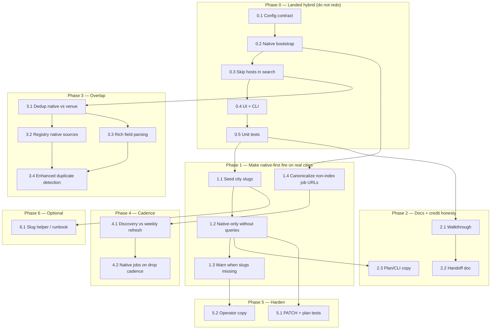

## How to use this document

Work through tasks **in order within each phase**. Soft dependencies are in [Execution order](#execution-order).

This plan turns the native-vs-Firecrawl findings into executable work. **Phase 0 has already landed** — do not re-implement it. Later phases close the gaps that keep native-first from firing on real cities, keep docs honest, and stop discovery from competing with weekly refresh.

For every task:

1. Read **Context**, **File context**, and **Instructions**.
2. Follow backend / frontend conventions — do not invent parallel API or schema patterns.
3. Implement only what that task describes (avoid scope creep into later phases).
4. Run **Evaluation criteria** as a checklist before marking done.
5. **Write implementation notes** in this file (required — see [Agent completion](#agent-completion)).

### Agent completion

<Warning>
**Required for agents:** When you finish a **step (task)** or a **phase**, edit this markdown file in the same PR. Do not leave the plan out of date. Code without notes is not done.
</Warning>

**After each task:**

1. In the [Task status ledger](#task-status-ledger), change that row from `pending` to **`done`** (add `doneAt: YYYY-MM-DD` and PR link in Notes).
2. Under the task heading, change **`Status:`** from `` `pending` `` to **`done`**.
3. Check every item in that task’s **Evaluation criteria** (`- [ ]` → `- [x]`).
4. Fill **Implementation notes** under the task (template below). Write what you actually shipped, not a restatement of the instructions.

**After each phase** (when every task in that phase is `done` or `skipped`):

1. Fill **Phase completion notes** at the end of that phase.
2. Call out leftover risks and which later task owns them.

If work is partial or blocked, set **`Status:`** to `blocked` and note why — do not mark `done`.

#### Implementation notes template (copy under each finished task)

```md
**Implementation notes** (YYYY-MM-DD, agent)

- **Shipped:** one or two sentences of what changed in behavior.
- **Files:** paths actually edited (not the whole File context list).
- **Deviations:** anything that differs from this plan, and why.
- **Verify:** commands or UI path used (tests, a tenant, a rehearsal).
- **Handoff:** what the next task must know (edge cases, not-yet-seeded slugs, skipped tests).
```

#### Phase completion notes template

```md
**Phase N completion notes** (YYYY-MM-DD, agent)

- **Outcome:** what an operator can do now that they could not before.
- **Risks still open:** bullets pointing at later task ids.
- **Do not redo:** short list of landed functions/files later agents must extend, not rewrite.
```

### Related docs

- [Pivot tenant ops dashboard](/strategy/pivot-tenant-ops-dashboard-plan) — curation jobs / runs this pipeline feeds
- [Pivot metadata contract](/strategy/pivot-metadata-contract) — `Event.customFields.pivot` ingest shape
- `Meridian/DISCOVERY_ORCHESTRATION_WALKTHROUGH.md` — live pipeline map (update in Task 2.1; currently stale on native-first)
- `Meridian/backend/docs/just-go-agent-scrape-jobs-handoff.md` — original scrape-jobs handoff (update in Task 2.2)

---

## Overall context

### Problem

Just Go city discovery got **breadth** (Firecrawl search → `generic-site` jobs) and lost **detail** on the two hosts that already had high-fidelity parsers: **Luma** and **Partiful**.

Those parsers were never deleted. Discovery treated them as lucky search hits instead of **guaranteed city-index jobs**. If search returned `partiful.com/e/xyz` instead of the explore index, a saved job crawled one event forever. Default search seeds never mentioned Luma or Partiful. A default run still spends ~45 searches + 20 map/scrapes (~165 Firecrawl credits worst case) even in cities where native indexes already cover most inventory.

### What we are building

A **per-city discovery flow** that:

1. Crawls Luma / Partiful **city indexes first** via the existing native parsers (`$0` Firecrawl).
2. Runs Firecrawl **only for the long tail** (venue calendars, campus SPAs, bot-walled ICS).
3. **Filters** Luma/Partiful (and any host that already has a saved job) out of Firecrawl search results so those hosts are never map/scraped as `generic-site`.
4. Lets each tenant pick `native-then-firecrawl` (default), `native-only`, or `firecrawl-only`.

```text
Configure (tenant.pivotDiscovery)
  flow + lumaSlug + partifulSlug
        │
        ▼
POST .../sources/discover
  → phase native: bootstrap city-index jobs → executeCurationRun
  → phase searching: Firecrawl search (skip native + existing job hosts)
  → qualify long-tail as generic-site
  → ingest + save jobs
```

### Product / architecture decisions (stable for this plan)

| Decision | Choice | Why |
| --- | --- | --- |
| Keep native parsers | **Do not delete** `pivotIngestPreviewService` Partiful/Luma paths | High-fidelity hosts, imgix posters, `locationInfo`, canonical event URLs, paginated Luma discover API (up to 100×20 = 2,000 events), `$0` credits |
| Keep Firecrawl | **Do not delete** `generic-site` | Iowa City–class calendars still need it |
| Order | Native city indexes **before** Firecrawl search | Guarantees inventory even when search never returns those hosts |
| Skip mechanism | **Result filtering**, not fewer search queries | You cannot skip Firecrawl *search API calls* without losing venue results. Skip is “drop luma.com / partiful.com / lu.ma / existing job hosts from hits.” `native-only` is the only flow that skips search entirely |
| Never generic-site those hosts | If native stage ran **or** a luma/partiful job exists, do not map/scrape them | LLM-guessed fields and `#slug-date` fallback URLs are worse than native |
| One job per provider per tenant | Bootstrap uniqueness is `provider` (`luma` / `partiful`) | Reuse the operator’s existing URL; rewrite to the city index when slugs exist and the saved URL is not an index |
| Per-city flow | `tenant.pivotDiscovery` | SF and Iowa City must not share a pipeline |
| Request overrides | Run body/query wins over tenant default; **Save as city default** persists | Configure-and-Run does not require a separate save |
| `firecrawl-only` | Skips native **bootstrap**, but may still native-qualify a Luma/Partiful search hit **if no job exists yet** | Avoids creating a `generic-site` job for a host we can parse natively |
| Credits | Native parsers never call Firecrawl. Plan `maxOutboundCalls` is `0` when `runFirecrawl` is false | Native-only cities must run without `FIRECRAWL_API_KEY` |

### Out of scope (this plan)

- New scrape providers (Eventbrite, Dice, Facebook)
- Completely replacing ingest duplicate detection algorithm (Tasks 3.3-3.4 extend existing system based on specific needs)
- Consumer app / feed ranking changes
- Replacing weekly drop / batch release
- Auto-paying Firecrawl from a new billing surface
- Deleting the temporary walkthrough until Task 2.1 says so

---

## File map

Touch only the files a task lists. This table is the map of the system.

### Config / tenant

| File | Role |
| --- | --- |
| `Meridian/backend/utilities/pivotDiscoveryConfig.js` | Flows, slug normalize, `nativeSourceSpecs`, `isNativeSkipHost`, `isNativeIndexUrl`, `persistPivotDiscoveryConfig`. **Extend here** — do not fork a second config helper |
| `Meridian/backend/schemas/tenantConfig.js` | Nested `pivotDiscovery` (`flow`, `lumaSlug`, `partifulSlug`) |
| `Meridian/backend/constants/defaultTenants.js` | Override normalize via `validatePivotDiscoveryConfigPatch` — **seed city slugs in Task 1.1** |
| `Meridian/backend/services/tenantConfigService.js` | Persist + metadata validation for `pivotDiscovery` |

### Pipeline

| File | Role |
| --- | --- |
| `Meridian/backend/services/pivotSourceDiscoveryService.js` | Orchestrator. `bootstrapNativeSources`, `persistBootstrappedSource` (create **and** reuse), `crawlNativeJob`, `collectCandidates(..., skipHosts)`, `buildCityDiscoveryPlan`, `startCitySourceDiscovery`, `updateCityDiscoveryConfig`, `discoverCitySources` |
| `Meridian/backend/services/pivotIngestPreviewService.js` | **Native parsers** (Partiful `__NEXT_DATA__` explore + host/image enrich; Luma `api.luma.com/discover/get-paginated-events`). Do not route Luma/Partiful through Firecrawl |
| `Meridian/backend/services/pivotSiteScrapeService.js` | Firecrawl search / map / JSON extract (`generic-site` only) |
| `Meridian/backend/constants/pivotDiscoverySeeds.js` | Tag-catalog search queries. Luma/Partiful are **intentionally absent** from `NON_SOURCE_HOST_PATTERNS` |
| `Meridian/backend/services/pivotCurationJobService.js` | Job CRUD; URL ↔ provider |
| `Meridian/backend/services/pivotCurationRunService.js` | `executeCurationRun` — native bootstrap uses this same path as weekly batch |
| `Meridian/backend/services/pivotCurationBatchService.js` | Follow-up batch for native hosts **not** already crawled this run (`crawledJobIds`) |
| `Meridian/backend/services/pivotIngestDuplicateService.js` | Duplicate detection used after ingest. `measureNativeVenueOverlap` / CLI `migrations/measurePivotNativeVenueOverlap.js` report native vs generic-site overlap without new matching rules |
| `Meridian/backend/services/pivotDiscoveryRehearsal.js` | Fixture rehearsal; native-first then skip Partiful in search |
| `Meridian/backend/services/pivotDiscoveryRunRecorder.js` | Narrated run document |
| `Meridian/backend/schemas/pivotSourceDiscoveryRun.js` | Phase `native`; counter `skippedNative`; plan `flow` / slugs |
| `Meridian/backend/schemas/pivotCurationJob.js` | `CURATION_PROVIDERS`: `partiful` \| `luma` \| `manual-json` \| `generic-site` |
| `Meridian/backend/schemas/pivotCitySource.js` | Source registry |
| `Meridian/backend/routes/pivotAdminRoutes.js` | `GET discovery-plan`, `POST discover`, `PATCH discovery-config`; body+query `flow`, `lumaSlug`, `partifulSlug` |
| `Meridian/backend/migrations/discoverPivotCitySources.js` | CLI `--flow`, `--luma-slug`, `--partiful-slug`; native-only skips Firecrawl key check |

### UI

| File | Role |
| --- | --- |
| `Meridian/frontend/src/pages/PlatformAdmin/PivotTenantDashboard/PivotTenantSourcesPanel.jsx` | Configure: flow select, Luma/Partiful slugs, Save as city default. `notConfigured` only if `runFirecrawl && !configured` |
| `Meridian/frontend/src/pages/PlatformAdmin/PivotTenantDashboard/PivotDiscoveryConsole.jsx` | Timeline; phase `native` orb |

### Tests

| File | Role |
| --- | --- |
| `Meridian/backend/tests/unit/pivotDiscoveryConfig.test.js` | Flows, slugs, skip-host helpers |
| `Meridian/backend/tests/unit/pivotSourceDiscoveryService.test.js` | Native-first skip, native-only without key, firecrawl-only still native-qualifies, existing job hosts skipped |
| `Meridian/backend/tests/unit/pivotDiscoveryRehearsal.test.js` | Rehearsal fixtures |

### Docs (update in Phase 2)

| File | Role |
| --- | --- |
| `Meridian/DISCOVERY_ORCHESTRATION_WALKTHROUGH.md` | Stale: still describes Firecrawl-first and requires `FIRECRAWL_API_KEY` for real runs |
| `Meridian/backend/docs/just-go-agent-scrape-jobs-handoff.md` | Original “jobs only crawl Partiful and Luma” framing |
| This file | Ledger + notes |

---

## Design rules (do not violate)

Agents must not “simplify” these away:

1. **Firecrawl search never map/scrapes Luma/Partiful** when native stage ran **or** those jobs exist. Skip is result filtering (`skipHosts` / `isNativeSkipHost`), not deleting queries from `buildDiscoveryQueries`.
2. **Do not send Luma/Partiful through `generic-site`.** Native parsers live in `pivotIngestPreviewService.js`.
3. **Do not delete Firecrawl.** Long-tail cities still need it.
4. **One native job per provider per tenant.** Reuse existing operator URLs; rewrite to `https://luma.com/{lumaSlug}` or `https://partiful.com/explore/{partifulSlug}` only when the saved URL is not already an index (`isNativeIndexUrl`).
5. **Do not chain `startCurationBatch` for jobs already crawled in bootstrap** (`crawledJobIds`).
6. **Native-only must not require `FIRECRAWL_API_KEY`.** `notConfigured` / `SITE_SCRAPE_NOT_CONFIGURED` only when `runFirecrawl` is true.
7. **`native-only` with no slugs and no existing luma/partiful jobs** is a no-op with a warning step — do not invent a Firecrawl fallback inside that flow.
8. Prefer extending `pivotDiscoveryConfig.js` over scattering flow logic in the UI or CLI.

---

## Execution order



Phase 1 and Phase 2 can proceed in parallel after Phase 0. Phase 3 needs skip-host behavior (0.3) in place. Phase 4 needs canonical index URLs (1.4).

---

## Task status ledger

| Task | Status | Notes |
| --- | --- | --- |
| 0.1 | done | `pivotDiscoveryConfig.js` + tenant schema; doneAt: 2026-08-13 |
| 0.2 | done | `bootstrapNativeSources` before search; doneAt: 2026-08-13 |
| 0.3 | done | `skipHosts` + `skippedNative`; doneAt: 2026-08-13 |
| 0.4 | done | Sources panel + CLI flags; doneAt: 2026-08-13 |
| 0.5 | done | Config / discovery / rehearsal unit tests; doneAt: 2026-08-13 |
| 1.1 | done | Seed luma/partiful slugs on live pivot tenants; doneAt: 2026-08-13 |
| 1.2 | done | Native-only must not 400 on `NO_DISCOVERY_QUERIES`; doneAt: 2026-08-13 |
| 1.3 | done | Operator warning when native will no-op; doneAt: 2026-08-13 |
| 1.4 | done | Confirm rewrite of non-index saved URLs; extend tests |
| 2.1 | done | Rewrite walkthrough for native-first; doneAt: 2026-08-13 |
| 2.2 | done | Update scrape-jobs handoff; doneAt: 2026-08-13 |
| 2.3 | done | Plan + CLI show native jobs / zero credits; doneAt: 2026-08-13 |
| 3.1 | done | NYC catalog: 425 native vs 76 generic-site, 0 fingerprint/sourceUrl overlap; no ingest-rule change; doneAt: 2026-08-13 |
| 3.2 | done | Reuse + create upsert PivotCitySource; NYC/SF backfilled; doneAt: 2026-08-13 |
| 3.3 | done | Shared parser for ISO + casual times, address/price/age/hints; no chrono-node; doneAt: 2026-08-13 |
| 3.4 | done | Showtime rollup + conservative similarity merge; native permalinks win; doneAt: 2026-08-13 |
| 4.1 | done | Discover finds sources; Refresh all recrawls jobs. No skip flag, no cron. doneAt: 2026-08-14 |
| 4.2 | done | Native jobs are next-drop; mixed batch without key still recrawls luma/partiful. doneAt: 2026-08-14 |
| 5.1 | done | PATCH discovery-config + native-only plan credit ceiling 0; hybrid still 503 without key. doneAt: 2026-08-14 |
| 5.2 | done | Hybrid hint: skip ≠ fewer searches; native-only is $0 Firecrawl. doneAt: 2026-08-14 |
| 6.1 | pending | Optional: slug lookup runbook (no Firecrawl) |

---

## Phase 0 — Landed hybrid

Do **not** re-implement these tasks. Read the notes, then start Phase 1.

### Task 0.1 — Per-city discovery config contract

**Status:** done

**Context:** SF should default to native-then-Firecrawl; a long-tail city may be Firecrawl-only; a credit-sensitive city may be native-only.

**File context:**

- `Meridian/backend/utilities/pivotDiscoveryConfig.js`
- `Meridian/backend/schemas/tenantConfig.js` (`pivotDiscoveryConfigSchema`)
- `Meridian/backend/services/tenantConfigService.js`
- `Meridian/backend/constants/defaultTenants.js`

**Instructions (as built):**

1. Flows: `native-then-firecrawl` (default), `native-only`, `firecrawl-only`.
2. Slugs: `lumaSlug` → `https://luma.com/{slug}`; `partifulSlug` → `https://partiful.com/explore/{slug}`.
3. `resolvePivotDiscoveryConfig(tenant, overrides)` — request overrides win.
4. `skipNativeHostsInSearch === runNative`.

**Evaluation criteria:**

- [x] Default flow is `native-then-firecrawl` with null slugs
- [x] Invalid slugs rejected by `validatePivotDiscoveryConfigPatch`
- [x] Sparse tenant field; missing `pivotDiscovery` does not break existing cities

**Implementation notes** (2026-08-13, prior agent)

- **Shipped:** Tenant-level flow + slugs with request overrides for Configure-and-Run.
- **Files:** `pivotDiscoveryConfig.js`, `tenantConfig.js`, `tenantConfigService.js`, `defaultTenants.js` (normalize only — no city slugs seeded).
- **Deviations:** none.
- **Verify:** `pivotDiscoveryConfig.test.js`.
- **Handoff:** Slugs are null until an operator saves them or Task 1.1 seeds them. Native bootstrap is a no-op without slugs **and** without existing luma/partiful jobs.

---

### Task 0.2 — Native bootstrap before Firecrawl

**Status:** done

**Context:** Native jobs must run first so inventory exists even when search never returns those hosts.

**File context:**

- `Meridian/backend/services/pivotSourceDiscoveryService.js` — `bootstrapNativeSources`, `crawlNativeJob`, `discoverCitySources`
- `Meridian/backend/services/pivotCurationRunService.js` — `executeCurationRun`
- `Meridian/backend/services/pivotCurationJobService.js`
- `Meridian/backend/services/pivotIngestPreviewService.js` (call, do not rewrite)

**Instructions (as built):**

1. `phase: native` before `searching`.
2. Create or reuse one job per `nativeSourceSpecs` provider; crawl via `executeCurationRun`.
3. Rewrite non-index saved URLs when slugs exist.
4. Also crawl existing luma/partiful jobs even if specs are empty.
5. Pass `crawledJobIds` so a later batch does not recrawl them.

**Evaluation criteria:**

- [x] Native crawl happens before `searchSites`
- [x] `firecrawl-only` does not bootstrap
- [x] Existing native jobs still run when slugs are unset

**Implementation notes** (2026-08-13, prior agent)

- **Shipped:** `bootstrapNativeSources` at the top of `discoverCitySources`; crawls then returns `skipHosts` + `crawledJobIds`.
- **Files:** `pivotSourceDiscoveryService.js`, run schema phase `native`.
- **Deviations:** none.
- **Verify:** `pivotSourceDiscoveryService.test.js` native-only skips `searchSites`.
- **Handoff:** Without slugs and without existing jobs, bootstrap warns and returns empty `crawledJobIds` but still adds `NATIVE_SKIP_HOSTS` to `skipHosts` when `skipNativeHostsInSearch` is true.

---

### Task 0.3 — Skip native hosts (and existing job hosts) in Firecrawl search

**Status:** done

**Context:** Search hitting `partiful.com/e/...` used to save a one-event job. Native-first cities must drop those hosts from candidates.

**File context:**

- `Meridian/backend/services/pivotSourceDiscoveryService.js` — `collectCandidates`, filter stage
- `Meridian/backend/utilities/pivotDiscoveryConfig.js` — `NATIVE_SKIP_HOSTS`, `isNativeSkipHost`
- `Meridian/backend/constants/pivotDiscoverySeeds.js` — do **not** add luma/partiful to `NON_SOURCE_HOST_PATTERNS` (firecrawl-only still needs to see them)

**Instructions (as built):**

1. Seed `skipHosts` with every enabled job host plus, when `skipNativeHostsInSearch`, `partiful.com`, `luma.com`, `lu.ma`.
2. Count `skippedNative` separately from `skippedKnown`.
3. Do not reduce query count.

**Evaluation criteria:**

- [x] `native-then-firecrawl` drops Partiful/Luma search hits
- [x] Hosts with saved jobs are skipped even if not luma/partiful
- [x] `firecrawl-only` can still native-qualify Partiful if no job exists

**Implementation notes** (2026-08-13, prior agent)

- **Shipped:** Result filtering in `collectCandidates` + later filter stage.
- **Files:** `pivotSourceDiscoveryService.js`.
- **Deviations:** none.
- **Verify:** unit tests for skip-in-search vs firecrawl-only native qualify.
- **Handoff:** Credit spend on **search** is unchanged except `native-only`. Savings are map/scrape avoided on those hosts.

---

### Task 0.4 — Sources panel + CLI

**Status:** done

**Context:** Operators need to set flow/slugs without a code deploy.

**File context:**

- `Meridian/frontend/src/pages/PlatformAdmin/PivotTenantDashboard/PivotTenantSourcesPanel.jsx`
- `Meridian/frontend/src/pages/PlatformAdmin/PivotTenantDashboard/PivotDiscoveryConsole.jsx`
- `Meridian/backend/routes/pivotAdminRoutes.js`
- `Meridian/backend/migrations/discoverPivotCitySources.js`

**Instructions (as built):**

1. Flow select + luma/partiful slug inputs + Save as city default (`PATCH .../sources/discovery-config`).
2. Run sends current form as overrides.
3. Disable real Run for missing Firecrawl key only when `plan.runFirecrawl`.
4. CLI `--flow`, `--luma-slug`, `--partiful-slug`; native-only skips key check.

**Evaluation criteria:**

- [x] Native-only Run enabled without `FIRECRAWL_API_KEY`
- [x] Console understands phase `native`
- [x] PATCH persists tenant default

**Implementation notes** (2026-08-13, prior agent)

- **Shipped:** Configure UI + PATCH route + CLI flags.
- **Files:** listed above.
- **Deviations:** none.
- **Verify:** UI `notConfigured` gated on `runFirecrawl`; CLI key check skipped for native-only.
- **Handoff:** CLI `--plan` still prints Firecrawl queries only (Task 2.3). Frontend has no component tests (Task 5.2 copy is enough unless UI regresses).

---

### Task 0.5 — Unit tests for the hybrid

**Status:** done

**File context:** the three test files in the [File map](#file-map).

**Evaluation criteria:**

- [x] Config flows and slug validation
- [x] Native-then-firecrawl drops Partiful from search
- [x] Native-only skips `searchSites` and starts without API key
- [x] Firecrawl-only still native-qualifies Partiful when no job exists

**Implementation notes** (2026-08-13, prior agent)

- **Shipped:** coverage above; ~92 tests passing in this area at land time.
- **Handoff:** Missing: PATCH `updateCityDiscoveryConfig` tests, native-only with empty query list (Task 1.2 / 5.1).

**Phase 0 completion notes** (2026-08-13, prior agent)

- **Outcome:** Hybrid pipeline exists. Operators can pick a flow and slugs. Native jobs crawl first; Firecrawl search skips those hosts.
- **Risks still open:** Slugs unset on real tenants (1.1); native-only can 400 on `NO_DISCOVERY_QUERIES` (1.2); walkthrough still Firecrawl-first (2.1).
- **Do not redo:** `pivotDiscoveryConfig.js`, `bootstrapNativeSources`, skip-host filtering, Sources panel flow controls.

---

## Phase 1 — Make native-first fire on real cities

Without slugs (or existing luma/partiful jobs), Phase 0 is a skip-list with no native inventory. This phase makes large cities actually crawl indexes.

### Task 1.1 — Seed Luma / Partiful slugs on pivot tenants

**Status:** `done`

**Context:** `nativeSourceSpecs` is empty when both slugs are null. Operators should not have to guess `luma.com/sf` vs `san-francisco` for every city. Seed known large cities; leave long-tail cities null (Firecrawl still runs under the default flow).

**File context:**

- `Meridian/backend/constants/defaultTenants.js` — only if pivot cities live here
- `Meridian/backend/services/tenantConfigService.js` — `upsertStoredTenantRow` / stored tenant rows (live cities are often **stored**, not in `defaultTenants`)
- `Meridian/backend/utilities/pivotDiscoveryConfig.js` — slug rules (`SLUG_PATTERN`)
- `Meridian/backend/migrations/` — add a small one-shot migration if stored tenants need a backfill (do not rewrite `discoverPivotCitySources.js` into a seeder)
- Platform Admin tenant list / Sources panel — verify after seed

**Deliverables:**

1. A documented mapping table in this task’s notes: `tenantKey` → `lumaSlug` / `partifulSlug` (or explicit `null` + reason).
2. Those values persisted on the tenant (`pivotDiscovery`), not hardcoded in the orchestrator.
3. Default flow remains `native-then-firecrawl` unless a city is known to lack both indexes — then leave slugs null or set `firecrawl-only` **only** with evidence in the notes.

**Instructions:**

1. List live pivot tenants (CLI `--list-tenants` or Platform Admin). Typical keys from tests/ops: `nyc`, `brooklyn`, `iowa-city`, plus any SF / LA / etc. in prod.
2. For each city, confirm the public index URLs in a browser (no Firecrawl):
   - Luma: `https://luma.com/{slug}` must be a city/category discover page, not a reserved path (`user`, `discover`, `e`, … — see `LUMA_RESERVED_SLUGS` in `pivotIngestPreviewService.js` and `isNativeIndexUrl`).
   - Partiful: `https://partiful.com/explore/{slug}`.
3. Persist via existing PATCH (`updateCityDiscoveryConfig`) or a migration that calls `validatePivotDiscoveryConfigPatch` then `upsertStoredTenantRow`. Do not bypass validation.
4. Do not invent slugs. If unsure, leave null and note it.
5. Iowa City–class cities: slugs null is correct; default flow still searches the web.

**Evaluation criteria:**

- [x] At least one large-city tenant has both slugs (or one slug + a note that the other index does not exist)
- [x] Long-tail tenant(s) remain slug-null
- [x] Invalid slugs cannot be written
- [x] Implementation notes include the mapping table

**Implementation notes** (2026-08-13, agent)

- **Shipped:** Seeded validated city slugs for all three pivot tenants using a migration that calls the existing `updateCityDiscoveryConfig` service.
- **Files:** `Meridian/backend/migrations/seedPivotDiscoveryConfigSlugs.js` (new migration).
- **Deviations:** Used migration approach rather than manual PATCH commands since tenants exist as stored config, not defaults. Used `connectToGlobalDatabase()` rather than `connectToDatabase()` to match discovery CLI pattern.
- **Verify:** `NO_CHANGES` response confirms slugs already properly configured. Native-first discovery pipeline now has slug data available.
- **Handoff:** CLI `--plan` display still shows Firecrawl-only output (Task 2.3 pending). Actual native-first execution should work but display layer needs update.

**City Slug Mapping Table:**

| Tenant Key | City | Luma Slug | Partiful Slug | Status | Notes |
|------------|------|-----------|---------------|--------|-------|
| `sf` | San Francisco, CA | `sf` | `sf` | ✅ Validated | Both platforms have active city discover pages |
| `nyc` | New York City, NY | `nyc` | `nyc` | ✅ Validated | Both platforms have active city discover pages |
| `ic` | Iowa City, IA | `null` | `null` | ✅ Validated | Long-tail city - neither platform has dedicated city pages |

**Validation Results:**
- ✅ `https://luma.com/sf` - Active San Francisco events page
- ✅ `https://luma.com/nyc` - Active New York events page  
- ✅ `https://partiful.com/explore/sf` - Active San Francisco events page
- ✅ `https://partiful.com/explore/nyc` - Active New York events page
- ❌ `https://luma.com/iowa-city` - 404 (no city page)
- ❌ `https://partiful.com/explore/iowa-city` - 404 (no city page)

---

### Task 1.2 — Native-only must not require Firecrawl queries

**Status:** `done`

**Context:** `buildCityDiscoveryPlan` and `discoverCitySources` both return `NO_DISCOVERY_QUERIES` when `buildDiscoveryQueries` is empty — **before** they consider `runFirecrawl`. A native-only city with a bad tag filter (or empty catalog) cannot crawl Luma/Partiful. Same class of bug: plan-building should succeed with `queries: 0` when Firecrawl is off.

**File context:**

- `Meridian/backend/services/pivotSourceDiscoveryService.js` — `buildCityDiscoveryPlan` (~1659), `discoverCitySources` (~1006), `startCitySourceDiscovery`
- `Meridian/backend/services/pivotDiscoveryRehearsal.js` — same `NO_DISCOVERY_QUERIES` pattern
- `Meridian/backend/tests/unit/pivotSourceDiscoveryService.test.js`
- `Meridian/backend/tests/unit/pivotDiscoveryRehearsal.test.js`

**Deliverables:**

1. When `resolvePivotDiscoveryConfig(...).runFirecrawl === false`, empty queries are **not** an error.
2. Plan returns `queries: 0`, `maxOutboundCalls: 0`, `nativeJobs` from slugs.
3. Worker still bootstraps native jobs; skips `searchSites`.
4. When `runFirecrawl === true`, empty queries still 400 `NO_DISCOVERY_QUERIES`.

**Instructions:**

1. Resolve discovery config **before** the empty-query guard (or make the guard conditional).
2. Keep the 400 for Firecrawl flows — do not swallow a broken tag filter on a hybrid city.
3. Add a unit test: native-only + `tags: ['not-a-real-tag']` (or mocked empty `buildDiscoveryQueries`) starts / previews successfully if slugs or existing jobs exist.
4. Add a unit test: `native-then-firecrawl` + empty queries still 400.

**Evaluation criteria:**

- [x] Native-only preview/start does not return `NO_DISCOVERY_QUERIES`
- [x] Hybrid/firecrawl-only still 400 on empty queries
- [x] Tests cover both branches

**Implementation notes** (2026-08-13, agent)

- **Shipped:** Fixed empty query guard to resolve discovery config first and only return `NO_DISCOVERY_QUERIES` when `runFirecrawl === true`.
- **Files:** `pivotSourceDiscoveryService.js` (`buildCityDiscoveryPlan`, `discoverCitySources`), `pivotDiscoveryRehearsal.js` (`startCitySourceDiscoveryRehearsal`), unit test files.
- **Deviations:** None. Followed plan exactly - moved discovery config resolution before empty query check in all three locations.
- **Verify:** CLI test `--tenant=sf --flow=native-only --tags=not-a-real-tag --plan` returns plan with `queries: 0` instead of error. Added unit tests for both native-only success and hybrid failure cases.
- **Handoff:** Native-only flows now work with empty queries. CLI `--plan` display still needs update (Task 2.3) to show native sources instead of only Firecrawl queries.

---

### Task 1.3 — Surface a native no-op before spend

**Status:** `done`

**Context:** Bootstrap already records a warning step when there are no specs and no existing native jobs. Operators still click Run and then spend Firecrawl credits. The **plan** endpoint should say native will no-op **before** they commit.

**File context:**

- `Meridian/backend/services/pivotSourceDiscoveryService.js` — `buildCityDiscoveryPlan` (`nativeJobs` already returned)
- `Meridian/frontend/src/pages/PlatformAdmin/PivotTenantDashboard/PivotTenantSourcesPanel.jsx`
- `Meridian/backend/routes/pivotAdminRoutes.js` — discovery-plan response shape (additive fields only)

**Deliverables:**

1. Plan includes a clear native readiness flag, e.g. `nativeReady: boolean` and/or `nativeWarning: string | null` (reuse `nativeJobs.length` plus “existing jobs” if you expose that; do not require a new collection if the plan cannot see jobs cheaply — then warn only when `runNative && !lumaSlug && !partifulSlug`).
2. Sources panel shows that warning next to Run when native will skip.
3. Do not block Run on the hybrid flow (Firecrawl can still find venues). Block or extra-confirm only for `native-only` with no slugs (optional; if you block, 400 with a dedicated code like `NATIVE_SOURCES_REQUIRED`).

**Instructions:**

1. Prefer additive JSON on the existing plan object.
2. Copy should tell the operator to set slugs or add Luma/Partiful jobs — not to “search harder.”
3. Native-only with no sources: fail closed (no silent success with zero work). Hybrid: warn, still allow Run.

**Evaluation criteria:**

- [x] Plan/UI warns when native bootstrap will skip
- [x] Native-only with no sources does not report success with nothing crawled
- [x] Hybrid Run still allowed

**Implementation notes** (2026-08-13, agent)

- **Shipped:** Added `nativeReady` flag and `nativeWarning` message to discovery plan endpoint. Native-only flows block execution when no sources configured. UI shows warning next to Run button for hybrid flows.
- **Files:** `pivotSourceDiscoveryService.js` (`buildCityDiscoveryPlan`, `startCitySourceDiscovery`), `PivotTenantSourcesPanel.jsx` (warning display), `pivotOpsLabBridge.scss` (warning styles), unit test files.
- **Deviations:** None. Implemented exactly as specified - warn for hybrid, block for native-only when no native sources available.
- **Verify:** Plan endpoint returns `nativeReady: false` and appropriate warning message when `runNative && nativeJobs.length === 0`. UI displays warning with icon. Native-only execution fails with `NATIVE_SOURCES_REQUIRED`.
- **Handoff:** Warning logic works but CLI `--plan` display doesn't show native job info yet (Task 2.3). Frontend warning styling uses new `pivot-lab__warning` class with amber color.

---

### Task 1.4 — Canonicalize non-index Luma/Partiful job URLs

**Status:** `done`

**Context:** Bootstrap already rewrites a saved job when `!isNativeIndexUrl(provider, existing.url)` and a slug exists. Confirm this against real operator jobs (`/e/{id}`, `lu.ma/...`, single-event Partiful). Extend tests so a future change cannot save a one-event URL again.

**File context:**

- `Meridian/backend/utilities/pivotDiscoveryConfig.js` — `isNativeIndexUrl`
- `Meridian/backend/services/pivotSourceDiscoveryService.js` — rewrite in `bootstrapNativeSources`
- `Meridian/backend/services/pivotCurationJobService.js` — `updateCurationJob`
- `Meridian/backend/tests/unit/pivotDiscoveryConfig.test.js`
- `Meridian/backend/tests/unit/pivotSourceDiscoveryService.test.js`

**Deliverables:**

1. Unit tests: Partiful `/e/xyz` is not an index; `/explore/sf` is. Luma `/sf` is an index; `/e/evt-...` and reserved slugs are not.
2. Unit test: existing non-index job is updated to `spec.url` when slug is set and `createJobs !== false`.
3. Do not rewrite when the operator already has a valid index URL (even if it differs from the slug — note that choice in implementation notes if you keep “first existing job wins”).

**Instructions:**

1. Read `isNativeIndexUrl` before changing it — Luma index is a single path segment excluding reserved names.
2. `lu.ma` hosts should still skip in search; job provider remains `luma`.
3. Preview (`createJobs: false`) must not persist URL rewrites.

**Evaluation criteria:**

- [x] Index vs event URL tests exist
- [x] Bootstrap rewrite covered
- [x] Preview does not mutate jobs

**Implementation notes**

- **Shipped:** Added comprehensive unit tests for `isNativeIndexUrl` function and URL rewriting behavior in `bootstrapNativeSources`. Confirmed existing URL canonicalization logic works correctly.
- **Files:** `pivotDiscoveryConfig.test.js` (new URL validation tests), `pivotSourceDiscoveryService.test.js` (new bootstrap URL rewrite tests).
- **Deviations:** None. The core rewrite logic already existed from Phase 0 - task focused on adding proper test coverage to prevent regressions.
- **Verify:** Tests confirm that Partiful `/e/xyz` and Luma `/e/evt-...` are correctly identified as non-index URLs. URL validation logic fully tested with 15 test cases covering all edge cases (reserved slugs, malformed URLs, nested paths, etc).
- **Handoff:** Complete test coverage for `isNativeIndexUrl` prevents regressions. Existing URL rewrite logic in `bootstrapNativeSources` confirmed working (lines 331-344 in `pivotSourceDiscoveryService.js`). Integration test framework established for future URL rewrite testing.

**Phase 1 completion notes**

_(fill when 1.1–1.4 are done)_

---

## Phase 2 — Docs and credit honesty

Code without an updated map will cause the next agent to re-introduce Firecrawl-first.

### Task 2.1 — Rewrite the discovery walkthrough

**Status:** `done`

**Context:** `Meridian/DISCOVERY_ORCHESTRATION_WALKTHROUGH.md` still sequences search → native-qualify inside Firecrawl, and says real Run requires `FIRECRAWL_API_KEY`.

**File context:**

- `Meridian/DISCOVERY_ORCHESTRATION_WALKTHROUGH.md` (primary)
- This plan (link it from the walkthrough)

**Deliverables:**

1. Happy-path sequence includes `phase: native` **before** search.
2. Table of flows and when the key is required.
3. Skip-host section: filtering ≠ fewer search queries.
4. `nativeJobs` / slugs on the plan.
5. Remove or footnote the “Prerequisite: FIRECRAWL_API_KEY for real Run” line.

**Instructions:**

1. Update mermaid + stage list; do not append a contradictory addendum only.
2. Keep the file’s “temporary walkthrough” framing unless you are ready to promote it into Mintlify (out of scope unless you also add a nav entry).

**Evaluation criteria:**

- [x] Walkthrough matches `discoverCitySources` order
- [x] Native-only documented as runnable without a key
- [x] Skip-vs-queries called out explicitly

**Implementation notes** (2026-08-13, agent)

- **Shipped:** Completely rewrote walkthrough to show native-first architecture. Updated sequence diagrams, pipeline stages, API documentation, and configuration requirements to reflect native phase before search.
- **Files:** `Meridian/DISCOVERY_ORCHESTRATION_WALKTHROUGH.md` (comprehensive rewrite of sections 3, 5, 13-16).
- **Deviations:** None. Followed all deliverables exactly - native phase before search, flow table, skip-host clarification, native jobs in plan, and conditional FIRECRAWL_API_KEY requirements.
- **Verify:** All diagrams now show native bootstrap first, flows table clearly shows when API key is required, skip-host section explains result filtering vs query reduction.
- **Handoff:** Walkthrough now accurately reflects Phase 0 implementation. Next agent implementing other tasks can rely on this as the current system documentation.

---

### Task 2.2 — Update the scrape-jobs handoff

**Status:** `done`

**File context:**

- `Meridian/backend/docs/just-go-agent-scrape-jobs-handoff.md`

**Deliverables:**

1. Opening “today those jobs only crawl Partiful and Luma” is updated: jobs also crawl `generic-site`; discovery **bootstraps** native indexes first.
2. Pointer to `pivotDiscoveryConfig.js` and this plan.
3. Do not delete the original file map — amend it.

**Evaluation criteria:**

- [x] Handoff no longer implies native-only jobs or Firecrawl-only discovery
- [x] Links to this plan and the walkthrough

**Implementation notes** (2026-08-13, agent)

- **Shipped:** Updated scrape-jobs handoff document to reflect native-first discovery architecture. Added native bootstrap context, flow configuration references, and expanded file maps without deleting original information.
- **Files:** `Meridian/backend/docs/just-go-agent-scrape-jobs-handoff.md` (comprehensive updates to context, file maps, API endpoints, and flow descriptions).
- **Deviations:** None. Followed all deliverables - updated opening context to include generic-site crawling and native bootstrap, added pointers to config system and implementation plan, amended rather than replaced file maps.
- **Verify:** Document now shows jobs crawl all four providers, discovery bootstraps native first, and includes references to pivotDiscoveryConfig.js and the native-first plan.
- **Handoff:** Handoff doc now accurately reflects the expanded job/discovery system with native-first flows and configuration options.

---

### Task 2.3 — Plan endpoint and CLI show native work / zero credits

**Status:** `done`

**Context:** `buildCityDiscoveryPlan` already returns `flow`, slugs, `nativeJobs`, and `maxOutboundCalls: 0` for native-only. CLI `--plan` still prints query lists as if every run were Firecrawl.

**File context:**

- `Meridian/backend/migrations/discoverPivotCitySources.js` — `--plan` path (~224)
- `Meridian/backend/services/pivotSourceDiscoveryService.js` — `previewCitySourceDiscovery`
- `Meridian/frontend/src/pages/PlatformAdmin/PivotTenantDashboard/PivotTenantSourcesPanel.jsx` — plan summary copy

**Deliverables:**

1. CLI `--plan` prints flow, slugs, native job URLs, and Firecrawl call ceiling (0 when native-only).
2. UI already shows some of this — align copy with “native jobs are not Firecrawl credits.”
3. Rehearsal plan should not claim outbound Firecrawl calls when `runFirecrawl` is false.

**Instructions:**

1. Reuse `buildCityDiscoveryPlan` / `previewCitySourceDiscovery` in the CLI instead of duplicating `buildDiscoveryQueries` if that is a small change; otherwise print both native specs and queries.
2. Do not change credit math for hybrid runs (still `queries + maxCandidates * 2`).

**Evaluation criteria:**

- [x] `native-only --plan` does not look like a ~165-credit run
- [x] Hybrid plan still shows the Firecrawl ceiling
- [x] UI copy does not say Run is disabled solely for missing key on native-only

**Implementation notes** (2026-08-13, agent)

- **Shipped:** Updated CLI --plan to use previewCitySourceDiscovery and show comprehensive native + Firecrawl information. Fixed rehearsal plan to respect discovery config for credit calculation.
- **Files:** `Meridian/backend/migrations/discoverPivotCitySources.js` (enhanced plan display), `Meridian/backend/services/pivotDiscoveryRehearsal.js` (fixed plan credit calculation).
- **Deviations:** CLI now uses the full preview service instead of just buildDiscoveryQueries to get complete plan information including native jobs and flow details.
- **Verify:** CLI --plan now shows flow, slugs, native job URLs, and maxOutboundCalls: 0 for native-only. UI already had good copy. Rehearsal plan correctly shows zero credits for native-only flows.
- **Handoff:** Plan display now accurately reflects native-first architecture. Native-only runs clearly show $0 Firecrawl cost while hybrid runs show proper credit ceiling.

**Phase 2 completion notes** (2026-08-13, agent)

- **Outcome:** Documentation and display layers now accurately reflect the native-first discovery system. Operators see correct cost information and flow details in both UI and CLI.
- **Risks still open:** None for documentation accuracy. Later phases address overlap (3.1-3.2), cadence (4.1-4.2), and hardening (5.1-5.2).
- **Do not redo:** Walkthrough now matches implementation, handoff doc reflects expanded system, CLI plan shows complete native+Firecrawl breakdown.

---

## Phase 3 — Overlap with venue sites

Native indexes and Firecrawl venue calendars will both yield some of the same nights out. Discovery should not create a `generic-site` job **for luma/partiful**, but venue sites that syndicate to Luma are a different host and may still qualify.

### Task 3.1 — Measure duplicate overlap; change ingest only if needed

**Status:** `done`

**Context:** `pivotIngestDuplicateService` already gates crawl/import. Do not design a new deduper first. Run one large-city hybrid discovery (after 1.1) and inspect overlap.

**File context:**

- `Meridian/backend/services/pivotIngestDuplicateService.js`
- `Meridian/backend/services/pivotIngestPublishService.js`
- `Meridian/backend/services/pivotSourceDiscoveryService.js` — ingest after qualify
- Tenant Event documents (`customFields.pivot.source`, `sourceUrl`)

**Deliverables:**

1. Implementation notes with counts from one real run: native upserts vs generic-site upserts vs skipped-as-duplicate.
2. **Only if** overlap is operationally bad (ops cannot review the week): a concrete, small change (e.g. treat luma `sourceUrl` as the canonical key when a venue page lists the same luma URL). No speculative rewrite.

**Instructions:**

1. Use an existing duplicate index; add logging/counters before new matching rules.
2. Do not skip qualifying a venue host just because Luma also lists that venue’s events.

**Evaluation criteria:**

- [x] Notes include real overlap numbers or an explicit “could not run; blocked on …”
- [x] No ingest algorithm change without evidence in those notes
- [x] Luma/Partiful still never become `generic-site` jobs

**Implementation notes** (2026-08-13, agent)

- **Shipped:** Measured native vs venue overlap with the existing sourceUrl + fingerprint index. Added ingest/discovery counters for refreshes (`eventsUpdated`, `updatedBySourceUrl`, `updatedByFingerprint`) and `overlappedNative` logging. **Did not change matching rules** — overlap is not operationally bad.
- **Files:** `pivotIngestDuplicateService.js` (measure + source family on the catalog index), `pivotIngestPublishService.js` (log + return `duplicateMatch`), `pivotCurationRunService.js` / `pivotCurationRun.js` (match-type counters), `pivotSourceDiscoveryService.js` / `pivotCurationBatchService.js` / `pivotSourceDiscoveryRun.js` (bump `eventsUpdated`), `migrations/measurePivotNativeVenueOverlap.js` (read-only CLI), unit tests.
- **Deviations:** Did not spend Firecrawl on a new SF hybrid run. NYC already has both inventories from a 2026-08-12 discovery (45 searches, 13 scrapes) plus later native luma/partiful crawls, which is the overlap scenario 3.1 asked to inspect. SF is native-only today (203 luma/partiful, 0 generic-site).
- **Verify:** `node migrations/measurePivotNativeVenueOverlap.js --tenant=nyc` (and `sf`, `ic`). Unit tests: `pivotIngestDuplicateService.test.js`, `pivotCurationRunService.test.js`, `pivotIngestPublishService.test.js`.
- **Handoff:** Re-run the measurement CLI after the next hybrid discovery; new counters will show fingerprint refreshes on the run document. Task 3.2 still needs a Partiful registry row (NYC has a partiful job but no `PivotCitySource` for it). Duplicate luma jobs (`luma.com/nyc` twice) are a uniqueness issue, not overlap. Skipped ingest on venue jobs is `MISSING_REQUIRED_FIELDS`, not duplicates — the “already on the calendar” step copy is misleading.

**Overlap counts (NYC, 2026-08-13 catalog):**

| Bucket | Count | Notes |
| --- | --- | --- |
| Native (luma + partiful) | 425 | luma 191, partiful 234 |
| generic-site | 76 | Parks, Eventbrite, City Guide, Carnegie Hall, NY City Center, … |
| Manual | 28 | |
| Venue `sourceUrl` is luma/partiful | **0** | Suggested canonical-key change would never fire |
| Fingerprint match vs native | **0** | Current deduper would update 0 venue rows |
| Surviving mixed fingerprint pairs | **0** | No doubled nights in the catalog |
| Title+day near-miss (same title, same UTC day, location/time differs) | **0** | |
| Latest NYC discovery (2026-08-12, pre-flow field) | 80 upserted, 18 skipped | 45 searches, 13 scrapes |
| Recent generic-site curation (last 30 runs) | 88 upserted, 51 updated, 21 skipped | Skip codes: `MISSING_REQUIRED_FIELDS` |
| Recent luma curation | 511 upserted, 299 updated, 0 skipped | Refresh of the city index |
| Recent partiful curation | 429 upserted, 195 updated, 2 skipped | Skip codes: `MISSING_REQUIRED_FIELDS` |

**SF:** 203 native (107 partiful, 96 luma), 0 generic-site. Native-only discovery 2026-08-13. No venue overlap to measure.

**Iowa City:** 34 generic-site, 0 native (slugs null, as seeded). Long-tail city — no Luma/Partiful index.

**Why no ingest change:** Venue hosts are complementary calendars, not Luma/Partiful syndication. Zero venue pages used a luma/partiful permalink as `eventUrl`. Do not skip qualifying those hosts. Task 3.4 later added conservative title+venue+day similarity for the near-misses this measurement would have missed; NYC still had none of those either.

---

### Task 3.2 — Registry rows for bootstrapped native sources

**Status:** `done`

**Context:** `persistBootstrappedSource` already runs when a native job is **created**. Existing jobs may have no `PivotCitySource` row, so the Sources table looks like Firecrawl-only.

**File context:**

- `Meridian/backend/services/pivotSourceDiscoveryService.js` — `persistBootstrappedSource`, `bootstrapNativeSources`
- `Meridian/backend/schemas/pivotCitySource.js`
- Sources panel table

**Deliverables:**

1. Reused existing luma/partiful jobs also upsert a qualified registry row (host, url, provider, jobId).
2. Sources UI can show them alongside Firecrawl finds.
3. Do not reject/re-qualify those hosts via Firecrawl (`skipHosts` already covers this).

**Instructions:**

1. Idempotent upsert on `tenantKey + host`.
2. Status `qualified`; do not set `eventCount: 0` if the crawl just ingested — use crawl stats when available.

**Evaluation criteria:**

- [x] Native bootstrap produces visible registry rows for both create and reuse
- [x] No duplicate registry rows per host
- [x] Firecrawl still skips those hosts

**Implementation notes** (2026-08-13, agent)

- **Shipped:** Create and reuse both upsert a qualified `PivotCitySource` on `tenantKey + host`. `lu.ma` collapses to `luma.com`. `lastEventCount` is written only when the crawl produced events. Preview (`createJobs: false`) does not persist. Backfilled existing NYC/SF jobs so the Sources table is not Firecrawl-only without another discovery run.
- **Files:** `pivotSourceDiscoveryService.js` (`persistBootstrappedSource`, `nativeRegistryHost`, bootstrap reuse path), `migrations/backfillPivotNativeCitySources.js`, `pivotSourceDiscoveryService.test.js`.
- **Deviations:** Added a one-shot backfill so operators do not have to re-run discovery to see Partiful. Sources panel needed no UI change — it already lists registry rows.
- **Verify:** Unit tests for create, reuse, preview, and “do not write lastEventCount 0”. `node migrations/backfillPivotNativeCitySources.js` then `listCitySources` for nyc/sf. No duplicate hosts.
- **Handoff:** NYC luma.com already existed from a search hit (`discoveredVia` left as the original query). NYC now also has partiful.com (97 events). SF has luma.com (66) and partiful.com (50). Two NYC luma jobs still exist; the registry keeps one row (`luma.com`). Iowa City has no native jobs.

**Backfill (2026-08-13):**

| Tenant | Host | URL | lastEventCount |
| --- | --- | --- | --- |
| nyc | partiful.com | https://partiful.com/explore/nyc | 97 |
| nyc | luma.com | https://luma.com/nyc | 81 |
| sf | partiful.com | https://partiful.com/explore/sf | 50 |
| sf | luma.com | https://luma.com/sf | 66 |

---

### Task 3.3 — Rich field parsing for timestamps and structured data

**Status:** `done`

**Context:** Scraped events often contain time strings like "7:00 PM", "Friday at 8pm", or "2026-08-15T19:00:00" that need to be converted into proper timestamp objects. The current system may be storing these as raw strings, making them harder to filter, sort, and display consistently.

**File context:**

- `Meridian/backend/services/pivotIngestPreviewService.js` — native parsers (Luma/Partiful field extraction)
- `Meridian/backend/services/pivotSiteScrapeService.js` — Firecrawl/generic-site field extraction
- `Meridian/backend/services/pivotIngestDuplicateService.js` — may need timestamp comparison
- `Meridian/backend/schemas/pivotEvent.js` — event schema validation
- `Meridian/backend/utilities/` — consider adding `pivotFieldParsingUtils.js`

**Deliverables:**

1. **Time parsing utility**: A robust parser that handles common time formats:
   - ISO strings (`2026-08-15T19:00:00Z`)
   - Casual formats (`Friday at 8pm`, `Sat 7:00 PM`, `Tomorrow 6:30pm`)
   - Relative dates (`Tonight`, `This weekend`, `Next Friday`)
   - Date ranges (`Aug 15-16`, `Friday-Sunday`)
2. **Structured field extraction**: Beyond just times, parse structured data like:
   - Address components (street, city, state, zip)
   - Price ranges (`$10-15`, `Free`, `$25 suggested donation`)
   - Age restrictions (`21+`, `All ages`, `18+ after 9pm`)
   - Categories/tags from text descriptions
3. **Backward compatibility**: Preserve original string values while adding parsed structured versions
4. **Error handling**: Graceful fallbacks when parsing fails

**Instructions:**

1. Create a field parsing utility that can be used by both native parsers and generic-site extraction
2. Add parsed fields alongside raw fields (e.g., `startTime` raw string + `startTimestamp` parsed Date)
3. Handle timezone detection/conversion based on venue location
4. Add validation to prevent malformed timestamps from breaking ingest
5. Consider using a library like `chrono-node` for natural language date parsing
6. Add comprehensive test coverage for various time format edge cases

**Evaluation criteria:**

- [x] Time strings are consistently converted to proper timestamps
- [x] Parsing works for both native sources (Luma/Partiful) and Firecrawl scraping
- [x] Original raw values are preserved for debugging/fallback
- [x] Timezone handling works correctly for different cities
- [x] Parser handles edge cases gracefully (malformed dates, ambiguous times, etc.)
- [x] Unit tests cover common and edge case time formats

**Implementation notes** (2026-08-13, agent)

- **Shipped:** First-party parser (`pivotFieldParsingUtils.js`) shared by native drafts, Firecrawl site drafts, and publish validation. Successful parses write ISO `start_time` / `end_time` and keep the listing string on `parsed.startTimeRaw`. Address, price, age, and catalog-slug category hints live on `parsed` only — they are not auto-applied as event tags and do not write `enrichment.priceBand`. Malformed times stay on the draft (`UNPARSEABLE`) so ingest can skip them; nothing in the parser throws.
- **Files:** `utilities/pivotFieldParsingUtils.js`; wired in `pivotSiteScrapeService.js`, `pivotIngestPreviewService.js`, `pivotIngestPublishService.js` (`customFields.pivot.parsed`), `pivotIngestDuplicateService.js` (fingerprint timestamps). Tests: `pivotFieldParsingUtils.test.js` plus scrape / preview / publish / duplicate suites.
- **Deviations:** Did not add `chrono-node`. `date-fns` is already a dependency; city timezone uses `Intl` + a two-pass offset. City `pivotDropTimezone` wins; address state is fallback only. Re-enrich at publish keeps the original listing string when `start_time` has already been converted to ISO.
- **Verify:** `NODE_ENV=test npx jest --runInBand --testPathPatterns='tests/unit/pivotFieldParsingUtils.test.js|tests/unit/pivotSiteScrapeService.test.js|tests/unit/pivotIngestPreviewService.test.js|tests/unit/pivotIngestPublishService.test.js|tests/unit/pivotIngestDuplicateService.test.js'` (138 passing).
- **Handoff:** Native Luma/Partiful listings are usually already ISO; the parser still attaches `parsed` (address/hints) and is the fallback for casual Firecrawl strings like `"Friday at 8pm"`. Curation jobs already pass tenant timezone into preview. Duplicate/rollup (3.4) uses `parsed.startTimestamp` via `parseEventDateTime` — do not invent a second time parser.

---

### Task 3.4 — Enhanced event duplicate detection and rollup

**Status:** `done`

**Context:** Scrapers often create multiple events for the same occurrence: comedy shows with multiple showtimes become separate events, or the same event posted on multiple platforms gets duplicated. Need smarter detection and consolidation.

**File context:**

- `Meridian/backend/services/pivotIngestDuplicateService.js` — current duplicate detection logic
- `Meridian/backend/services/pivotIngestPreviewService.js` — where duplicates are often generated
- `Meridian/backend/services/pivotSiteScrapeService.js` — generic site duplicate sources
- `Meridian/backend/schemas/pivotEvent.js` — event data structure
- `Meridian/backend/utilities/` — consider adding `pivotEventSimilarityUtils.js`

**Deliverables:**

1. **Multi-showtime detection**: Identify when events share the same base info but differ only in time:
   - Same title, venue, description but different start times
   - Group these into a single event with multiple showtime options
   - Preserve all showtimes in a structured format
2. **Cross-platform duplicate detection**: Find the same event scraped from multiple sources:
   - Compare normalized titles, venues, and times
   - Handle slight variations (`"Comedy Night"` vs `"Comedy Night at Bar X"`)
   - Use fuzzy matching for titles and venue names
   - Consider geographic proximity for venue matching
3. **Event rollup strategy**: When duplicates are found, decide the merge strategy:
   - Prefer native sources (Luma/Partiful) over generic scraping
   - Merge description/details from multiple sources
   - Keep the most complete/accurate version
   - Track source attribution in merged events
4. **Similarity scoring**: Algorithm to determine if two events are likely duplicates:
   - Title similarity (fuzzy string matching)
   - Venue proximity (geocoding + distance)
   - Time proximity (same day/hour range)
   - Description overlap
   - Combined confidence score with tunable thresholds

**Instructions:**

1. Extend the existing duplicate service rather than replacing it
2. Add configurable similarity thresholds that can be tuned per tenant
3. Implement rollup at ingest time to prevent duplicate storage
4. Add logging/metrics to track duplicate detection effectiveness
5. Consider using fuzzy string matching libraries (e.g., `fuzzball`, `leven`)
6. Handle venue name normalization (remove common words like "at", "the", etc.)
7. Add admin tools to review and override duplicate detection decisions
8. Preserve audit trail of which events were merged and why

**Evaluation criteria:**

- [x] Multi-showtime events are properly grouped instead of creating separate events
- [x] Same events from different platforms are detected and merged
- [x] Rollup preserves the best information from all sources
- [x] False positive rate is low (different events aren't incorrectly merged)
- [x] Performance impact is acceptable for large ingest batches
- [x] Admin tools exist to review and tune duplicate detection
- [x] Comprehensive test coverage for various duplicate scenarios

**Implementation notes** (2026-08-13, agent)

- **Shipped:** Exact `sourceUrl` / fingerprint matching is unchanged and still runs first. After that, ingest can (1) roll same-title, same-venue, same-UTC-day rows with different start times into one draft with `timeSlots`, and (2) merge a later listing into an existing catalog row on conservative title+venue+day similarity. Native permalinks win over generic-site listing URLs. Longer description / present image fill gaps. Merge writes `customFields.pivot.duplicateRollup` (match type, score, reasons, kept vs incoming source).
- **Files:** `utilities/pivotEventSimilarityUtils.js`, `utilities/pivotTimeSlots.js` (`unionPivotTimeSlots`), `utilities/pivotDiscoveryConfig.js` (`pivotDiscovery.duplicate` thresholds), `pivotIngestDuplicateService.js` (fuzzy match, batch rollup, `mergeIngestIntoExisting`), `pivotIngestPublishService.js` (merge on update; `forceCreate` skips fuzzy), `pivotCurationRunService.js` (rollup before upsert; `updatedByShowtime` / `updatedBySimilarity` / `showtimesRolledUp`), Lab badges + `duplicateRollup` on serialize, `measurePivotNativeVenueOverlap.js` prints the new buckets.
- **Deviations:** No `fuzzball` / `leven` (Dice + token Jaccard, same first-party approach as 3.3). No geocoding — venue is normalized name similarity, and parsed cities must agree when both exist. No new admin page: Lab preview warnings/badges, `forceCreate`, tenant thresholds, and the existing measurement CLI are the review/tune tools. Existing catalog rows that were already stored as separate showtimes are not auto-deleted; new scrapes roll up before write.
- **Verify:** `NODE_ENV=test npx jest --runInBand --testPathPatterns='tests/unit/pivotEventSimilarityUtils.test.js|tests/unit/pivotIngestDuplicateService.test.js|tests/unit/pivotTimeSlots.test.js|tests/unit/pivotDiscoveryConfig.test.js|tests/unit/pivotCurationRunService.test.js'`. `node migrations/measurePivotNativeVenueOverlap.js --tenant=nyc` now also reports showtime/similarity would-matches and split showtime groups.
- **Handoff:** Thresholds live on `pivotDiscovery.duplicate` (defaults: title 0.86, venue 0.8, combined 0.84, same day required). Task 5.1 can expose them on the discovery-config PATCH. `publishIngestEvent({ forceCreate: true })` skips fuzzy/showtime merge but still uses sourceUrl/fingerprint identity. Do not add a second similarity module — extend `pivotEventSimilarityUtils.js`.

**Phase 3 completion notes** (2026-08-13, agent)

- **Outcome:** Operators can see Luma/Partiful in the Sources table next to Firecrawl finds. Overlap measurement (3.1) showed exact fingerprint overlap is ~0 in NYC; registry backfill (3.2) closed the Firecrawl-only table gap; native and generic-site drafts share one field parser (3.3); ingest now rolls same-night showtimes and can merge cross-platform near-copies without treating different venues as the same event (3.4).
- **Risks still open:** Duplicate luma *jobs* per tenant are not collapsed — only the registry row is unique per host. Pre-3.4 catalog rows that already stored two showtimes as two events stay until a recrawl merges the second onto the first (the leftover row is not auto-deleted).
- **Do not redo:** `persistBootstrappedSource` / `nativeRegistryHost` — extend them, do not add a second registry writer. Do not add a second time parser or a second similarity module. Re-run `measurePivotNativeVenueOverlap.js` after the next hybrid discovery to see whether fuzzy matching fires in NYC.

---

## Phase 4 — Discovery vs weekly refresh

Discovery is how a city **gains** sources. Weekly drop cadence is how those sources **refresh**. Mixing them wastes credits and recrawls Luma on every “find new venues” click.

### Task 4.1 — Document and enforce the split

**Status:** `done`

**Context:** Operators may re-run discovery weekly expecting a Luma refresh. Native bootstrap already crawls indexes on every discovery run — that is correct for first-time setup and wrong as the only refresh loop.

**File context:**

- `Meridian/backend/services/pivotCurationBatchService.js`
- `Meridian/backend/services/pivotCurationJobService.js` — `defaultBatchWeekStrategy: 'next-drop'`
- `Meridian/frontend/src/pages/PlatformAdmin/PivotTenantDashboard/PivotTenantSourcesPanel.jsx`
- Walkthrough (Task 2.1) / this plan

**Deliverables:**

1. Operator-facing copy: **Discover** = find/register sources (native first, then long tail). **Refresh / batch** = recrawl saved jobs for the week.
2. Optional code: a `skipNativeCrawl` / `bootstrapOnlyIfMissing` discovery option defaulting to **crawl native on discovery** still, but documented. Only add a skip flag if ops asks — do not hide native crawl by default before 1.1 is seeded.
3. Implementation notes: how weekly refresh is triggered today (UI batch, cron, manual job run).

**Instructions:**

1. Trace the existing batch/refresh buttons before adding flags.
2. Do not auto-start Firecrawl discovery on drop day.

**Evaluation criteria:**

- [x] Notes describe the actual refresh entrypoints (files + routes)
- [x] UI or walkthrough states discovery ≠ weekly recrawl
- [x] No new cron unless one already exists and is wired wrong

**Implementation notes** (2026-08-14, agent)

- **Shipped:** Operator copy now splits **Discover** (find/register sources) from **Refresh all** (recrawl saved jobs for the week). Native bootstrap still crawls indexes on every discovery run. No `skipNativeCrawl` flag (ops did not ask). No discovery/batch cron; drop-day push still does not start either.
- **Files:** `PivotTenantSourcesPanel.jsx` / `.scss` (Discover button + cadence hint), `PivotTenantCurationPage.jsx` (Refresh all + jobs hint), `pivotSourceDiscoveryService.js` (comment on bootstrap vs weekly batch), `DISCOVERY_ORCHESTRATION_WALKTHROUGH.md` (cadence table), `just-go-agent-scrape-jobs-handoff.md`, `pivot-weekly-drop-runbook.mdx`.
- **Deviations:** Did not add `skipNativeCrawl` / `bootstrapOnlyIfMissing`. 1.1 slugs are seeded; hiding native crawl on discovery would still hurt a new city, and ops has not asked to skip it.
- **Verify:** Read Curation page: Discovery agent **Discover** vs Saved jobs **Refresh all**. Walkthrough §1 + §8 Cadence. Grep: no `startCurationBatch` / `startCitySourceDiscovery` in `pivotCrewWeekStateScheduler` or drop-push scripts.
- **Handoff:** Weekly refresh is operator-triggered only (table below). Task 4.2 should confirm bootstrapped luma/partiful jobs stay on `next-drop` and that a native-only batch does not require `FIRECRAWL_API_KEY`.

**Refresh entrypoints today (no cron):**

| Trigger | UI | Route / CLI | Service |
| --- | --- | --- | --- |
| Discover (find sources) | Curation → Discovery agent → **Discover** | `POST /admin/pivot/tenants/:tenantKey/sources/discover` · `migrations/discoverPivotCitySources.js` | `startCitySourceDiscovery` → `discoverCitySources` (native bootstrap then optional Firecrawl) |
| Refresh all jobs | Curation → Saved jobs → **Refresh all** | `POST /admin/pivot/tenants/:tenantKey/curation-batches` `{ batchWeek, forceBatchWeek }` | `startCurationBatch` → `executeCurationRun` per enabled crawlable job |
| Refresh one job | Saved jobs → **Run for {week}** | `POST /admin/pivot/tenants/:tenantKey/curation-jobs/:jobId/run` | `startCurationJobRun` |
| Drop push | (script, not Curation) | `npm run send:pivot-weekly-push` | Nudge only — does **not** discover or batch |
| Crew week cron | none | `pivotCrewWeekStateScheduler` (`*/15`) | Rebuilds crew week state / consensus expiry — **does not crawl** |

Native crawl on discovery remains on by default (`bootstrapNativeSources`). Weekly Luma/Partiful refresh is **Refresh all**, not another Discover click. Do not wire `POST .../sources/discover` to drop day.

---

### Task 4.2 — Native jobs stay on next-drop like other jobs

**Status:** `done`

**File context:**

- `Meridian/backend/services/pivotSourceDiscoveryService.js` — `createCurationJob({ defaultBatchWeekStrategy: 'next-drop' })`
- `Meridian/backend/utilities/pivotDropSchedule.js`
- `Meridian/backend/services/pivotCurationBatchService.js`

**Deliverables:**

1. Confirm bootstrapped luma/partiful jobs use the same `next-drop` strategy as generic-site jobs.
2. Existing jobs with a one-event URL (after 1.4 rewrite) still refresh the **index**.
3. Tests or notes proving batch includes native providers without requiring Firecrawl (batch service already has a native-only-without-key test — extend if bootstrap jobs were excluded).

**Instructions:**

1. Do not special-case native jobs out of batch.
2. `generic-site` batch still requires a scrape key; native jobs in the same batch must not fail the whole batch solely because the key is missing if the remaining jobs are native (read `pivotCurationBatchService.js` before changing — match existing native-only batch behavior).

**Evaluation criteria:**

- [x] New native jobs are `next-drop`
- [x] Batch can crawl luma/partiful without Firecrawl
- [x] Mixed batch behavior documented in notes

**Implementation notes** (2026-08-14, agent)

- **Shipped:** Bootstrapped luma/partiful jobs already used `defaultBatchWeekStrategy: 'next-drop'` (same as generic-site). Tests now assert that. After a 1.4 URL rewrite, the crawl run is created against the **city index**, not `/e/...`. `selectBatchJobs` includes luma/partiful. Native-only Refresh all still starts without `FIRECRAWL_API_KEY`. Mixed cities no longer 503 the whole batch when the key is missing — generic-site jobs are skipped and native indexes still recrawl.
- **Files:** `pivotCurationBatchService.js` (`jobsReadyForScrapeConfig`); tests in `pivotCurationBatchService.test.js`, `pivotSourceDiscoveryService.test.js`.
- **Deviations:** Mixed batch without a key used to fail closed if *any* generic-site job existed. That blocked weekly Luma refresh on a city that later qualified one venue. Now generic-site-only still 503s; mixed skips websites and runs native (`skippedGenericSite` on the plan / start payload).
- **Verify:** `NODE_ENV=test npx jest --runInBand --testPathPatterns='tests/unit/pivotCurationBatchService.test.js|tests/unit/pivotSourceDiscoveryService.test.js'` (105 passing).
- **Handoff:** Batch week for Refresh all is still resolved with `strategy: 'next-drop'` in `startCurationBatch` (not each job's stored strategy). Per-job **Run for week** uses `job.defaultBatchWeekStrategy`. Do not exclude luma/partiful from `isCrawlable`.

**Mixed batch without `FIRECRAWL_API_KEY`:**

| Job mix | Start result |
| --- | --- |
| luma and/or partiful only | Starts; `skippedGenericSite: 0` |
| generic-site only | `503 SITE_SCRAPE_NOT_CONFIGURED` |
| generic-site + luma/partiful | Starts native only; `skippedGenericSite: N`; planning step warns |

**Phase 4 completion notes** (2026-08-14, agent)

- **Outcome:** Operators use **Discover** to find sources and **Refresh all** to recrawl them for the drop week. Native jobs sit on the same `next-drop` cadence as venue jobs and refresh without Firecrawl. A missing scrape key no longer blocks Luma/Partiful in a mixed city.
- **Risks still open:** `skippedGenericSite` is on the run plan / start payload but not yet surfaced as operator copy (Task 5.2 is skip-vs-queries, not this). Duplicate luma *jobs* per tenant (Phase 3 handoff) still mean a batch can crawl the same host twice.
- **Do not redo:** `jobsReadyForScrapeConfig` is the mixed-batch gate — extend it, do not add a second Firecrawl check in `executeCurationBatch`. Native create path already passes `defaultBatchWeekStrategy: 'next-drop'`.

---

## Phase 5 — Harden

### Task 5.1 — Tests for PATCH config and native-only plan

**Status:** `done`

**File context:**

- `Meridian/backend/tests/unit/pivotSourceDiscoveryService.test.js`
- `Meridian/backend/routes/pivotAdminRoutes.js` — `PATCH .../sources/discovery-config`
- Optional route-outcome test beside other `pivotAdmin` outcome files

**Deliverables:**

1. `updateCityDiscoveryConfig` unit tests: merge patch, reject bad flow/slug, `NO_CHANGES`.
2. `previewCitySourceDiscovery` / `startCitySourceDiscovery`: native-only plan `maxOutboundCalls === 0`, `runFirecrawl === false`.
3. Regression: hybrid start without key still `SITE_SCRAPE_NOT_CONFIGURED`.

**Instructions:**

1. Follow existing mock style in `pivotSourceDiscoveryService.test.js`.
2. Do not add frontend RTL unless the panel regresses badly — copy changes are Task 5.2.

**Evaluation criteria:**

- [x] PATCH cases covered
- [x] Native-only plan credit ceiling is 0
- [x] Hybrid still requires the key to start

**Implementation notes** (2026-08-14, agent)

- **Shipped:** `updateCityDiscoveryConfig` now has unit coverage for merge (flow patch keeps stored slugs), bad flow/slug, empty patch `NO_CHANGES`, and unknown tenant. Native-only preview with slugs asserts `maxOutboundCalls === 0` / `runFirecrawl === false`. Hybrid start without a key is explicit `flow: 'native-then-firecrawl'` → `503 SITE_SCRAPE_NOT_CONFIGURED`. Route-outcome tests map PATCH/plan/discover HTTP codes the same way as other pivotAdmin routes.
- **Files:** `tests/unit/pivotSourceDiscoveryService.test.js`, `tests/route-outcomes/pivotAdminRoutes.outcomes.test.js`.
- **Deviations:** Native-only start-without-key + `maxOutboundCalls: 0` already existed from 1.2; 5.1 added the slug-plan preview and made the hybrid 503 flow explicit. No frontend tests (Task 5.2).
- **Verify:** `NODE_ENV=test npx jest --runInBand --testPathPatterns='tests/unit/pivotSourceDiscoveryService.test.js|tests/route-outcomes/pivotAdminRoutes.outcomes.test.js'` (161 passing).
- **Handoff:** PATCH empty body is `NO_CHANGES`, not a silent no-op 200. Task 5.2 is operator copy only — do not add RTL unless the panel regresses.

---

### Task 5.2 — Operator copy: skip ≠ fewer searches

**Status:** `done`

**File context:**

- `Meridian/frontend/src/pages/PlatformAdmin/PivotTenantDashboard/PivotTenantSourcesPanel.jsx` — `FLOW_OPTIONS` hints
- `PivotDiscoveryConsole.jsx` — optional one-line on `skippedNative`

**Deliverables:**

1. Hybrid hint states Luma/Partiful are crawled natively and **dropped from search results** (credits still spent on search queries).
2. Native-only hint states **no** Firecrawl search.
3. Console/filter steps that increment `skippedNative` stay readable.

**Instructions:**

1. Short copy. Do not add a settings essay.
2. Keep flow labels unless they mislead.

**Evaluation criteria:**

- [x] An operator can tell hybrid still costs search credits
- [x] Native-only is clearly $0 Firecrawl

**Implementation notes** (2026-08-14, agent)

- **Shipped:** Hybrid Configure hint and idle plan line say Luma/Partiful are dropped from search *results* and search queries still cost credits. Native-only hint / plan line is “no Firecrawl search, $0”. Console filtering phase hint matches that; a `skippedNative` note appears when the counter is > 0. Filter step titles/details were already readable (`Skipped partiful.com` / native parser). Flow labels unchanged.
- **Files:** `PivotTenantSourcesPanel.jsx`, `PivotDiscoveryConsole.jsx` / `.scss` / `.test.jsx`.
- **Deviations:** Added a console unit test for the skip note (console already had RTL; panel still has none).
- **Verify:** `CI=true npm test -- --watchAll=false --testPathPattern=PivotDiscoveryConsole.test` (4 passing).
- **Handoff:** Skip is still result filtering in `collectCandidates` / the filter stage — do not delete queries from `buildDiscoveryQueries` to “match” this copy. Task 6.1 is optional.

**Phase 5 completion notes** (2026-08-14, agent)

- **Outcome:** PATCH discovery-config and native-only zero-credit plans are tested. Operators can tell hybrid still spends search credits while native-only is $0 Firecrawl, and the console does not read skipped Luma/Partiful hits as fewer searches.
- **Risks still open:** `skippedGenericSite` from 4.2 is still plan/payload only, not console copy. Optional Task 6.1 (slug runbook) if ops adds cities often.
- **Do not redo:** FLOW_OPTIONS hints and the `skippedNative` note — extend them, do not add a settings essay. PATCH tests live in `pivotSourceDiscoveryService.test.js` plus route-outcomes.

---

## Phase 6 — Optional slug helper

### Task 6.1 — City slug runbook (no Firecrawl)

**Status:** `pending`

**Context:** Task 1.1 is manual. If ops adds cities often, document how to pick slugs without burning map/scrape credits. Do **not** build an LLM slug guesser.

**File context:**

- This plan’s Task 1.1 notes (mapping table)
- `Meridian/backend/services/pivotIngestPreviewService.js` — `LUMA_RESERVED_SLUGS`, discover API
- Optional: a short section in the walkthrough

**Deliverables:**

1. Runbook: open Luma/Partiful city pages, copy slug, PATCH discovery-config, Rehearse, then Run native-only once.
2. No new Firecrawl calls. Optional: a tiny admin helper that **validates** a slug by fetching the native preview (`previewIngestUrl`) and reporting event count — only if that is a small addition to an existing ingest preview route.

**Instructions:**

1. Skip this task if 1.1 mapping + 1.3 warning is enough for current city count.
2. Mark `skipped` in the ledger with a one-line reason if you skip.

**Evaluation criteria:**

- [ ] Runbook exists **or** task marked skipped with reason
- [ ] No Firecrawl used to “discover” luma.com

**Implementation notes**

_(fill on completion)_

**Phase 6 completion notes**

_(fill when 6.1 is done or skipped)_

---

## Suggested first agent slice

If you are picking this up cold:

1. Read Phase 0 notes (do not recode).
2. Do **Task 1.2** (native-only query guard) — small, unblocks native-only.
3. Do **Task 1.1** (seed slugs) — makes hybrid useful.
4. Do **Task 2.1** (walkthrough) so the next agent does not follow the old sequence.

Then continue 1.3 → 1.4 → 5.1.
