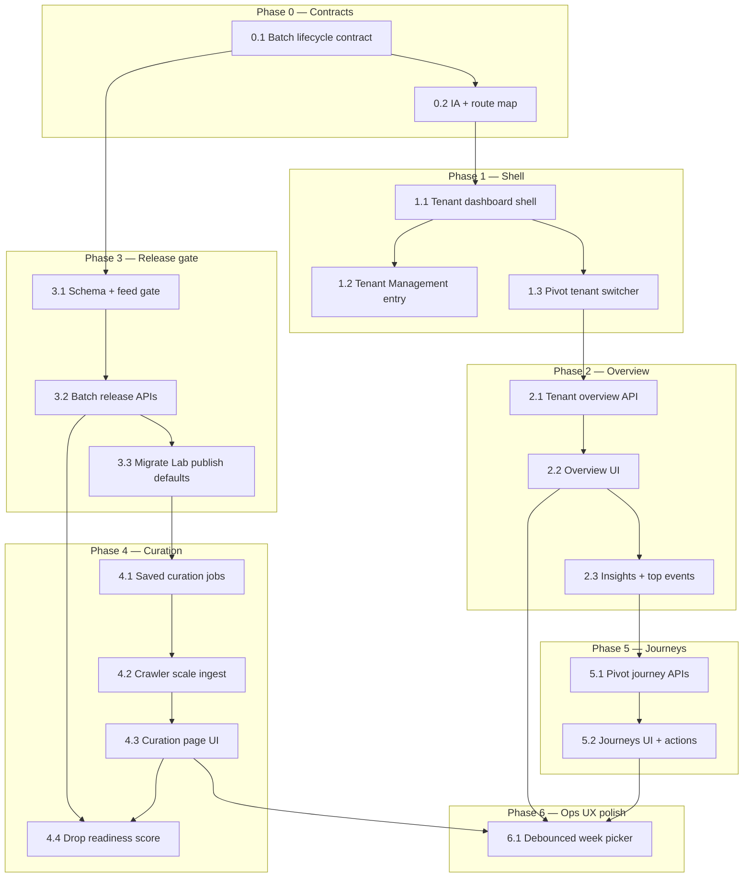

## How to use this document

Work through tasks **in order within each phase**. Soft dependencies are in [Execution order](#execution-order).

This plan is **separate from** the [Pivot MVP implementation plan](/strategy/pivot-mvp-implementation-plan) (Phases 0–9 shipped) and the [Just Go pilot readiness plan](/strategy/just-go-pilot-readiness-plan). It upgrades **ops tooling** after the pilot product loop exists.

For every task:

1. Read **Context** and **Instructions**.
2. Follow [Engineering conventions](#engineering-conventions-required) ([backend](/backend/best-practices) + [frontend](/frontend/best-practices)) — do not invent parallel API/DB patterns.
3. Implement only what that task describes (avoid scope creep).
4. Run **Evaluation criteria** as a checklist before marking done.
5. Record blockers or deviations in the PR.
6. **Update this file** when the task is complete (see [Agent completion](#agent-completion)).

### Agent completion

<Warning>
**Required for agents:** When you finish a task (code merged or explicitly accepted), edit this markdown file in the same PR — do not leave the plan out of date.
</Warning>

For the task you completed:

1. In the [Task status ledger](#task-status-ledger), change that row from `pending` to **`done`** (add `doneAt` or PR link in Notes if helpful).
2. Under the task heading, change **`Status:`** from `` `pending` `` to **`done`**.
3. Check every item in that task’s **Evaluation criteria** (`- [ ]` → `- [x]`).

If work is partial or blocked, set **`Status:`** to `blocked` and note why — do not mark `done`.

### Related docs

- [Pivot MVP implementation plan](/strategy/pivot-mvp-implementation-plan) — Lab (Phase 5), feed, intents, drop schedule
- [Pivot metadata contract](/strategy/pivot-metadata-contract) — `customFields.pivot`, `ingestStatus`, `batchWeek`
- [Pivot weekly drop runbook](/strategy/pivot-weekly-drop-runbook) — push timing vs catalog publish
- [Just Go pilot readiness plan](/strategy/just-go-pilot-readiness-plan) — consumer polish (orthogonal)
- [Just Go mobile admin dashboard plan](/strategy/just-go-mobile-admin-dashboard-plan) — on-device preview + analytics companion for the same platform admins
- [Backend best practices](/backend/best-practices) — `getModels` / global models, response shape, services, tests
- [Web client best practices](/frontend/best-practices) — `useFetch` / `postRequest` / `authenticatedRequest`, routing, SCSS

---

## Overall context

### Problem

Today ops run Just Go from a **single cross-tenant Pivot Lab** (`Meridian/frontend/src/pages/PlatformAdmin/PivotLab/`) with Overview / Import / Catalog tabs. That works for a one-city pilot, but it breaks down as cities multiply:

| Gap | Today | Needed |
| --- | --- | --- |
| Entry | Lab is a Platform Admin sidebar tab; Tenant Management has no deep link into city ops | **Per-tenant dashboard** opened from Tenant Management |
| Shell | Lab city picker inside the page | **Admin-style shell** with tenant switcher (like `Admin.jsx` + `AdminTenantDropdown`) |
| Metrics | City KPIs + funnel + retention for one `batchWeek` | **Granular** aggregates, **high-performing events**, **actionable insights** |
| Curation | Import tab + URL paste; explore crawl used an artificial **50**-event default | Dedicated **Curation** page, **saved jobs**, crawler takes **all events** found in page HTML |
| Week model | `batchWeek` + `ingestStatus: draft \| published`; published events appear in feed immediately | **Enforced batch lifecycle** — curate next drop ahead of time; release is an explicit gate |
| Users | No pivot-focused journey UI; wipe is `POST /pivot/dev/reset-week-actions` (self, development only) | Compact **User journeys** page with history + **admin wipe** for a week |

### What we are building

A **Pivot Tenant Ops Dashboard** — one Dashboard shell per pivot city (or one shell with tenant switcher locked to pivot tenants), entered from Tenant Management, with three primary surfaces:

1. **Overview** — analytics + insights for the selected city/week (and next-drop readiness).
2. **Curation** — full-page crawl/import/review/release workflow (not a Lab tab).
3. **User journeys** — pivot funnel/path exploration + ops actions (wipe week intents, inspect history).

Cross-tenant Pivot Lab can remain as a **fleet summary** later; this plan prioritizes the **per-tenant** experience.

### Product / architecture decisions (stable for this plan)

| Decision | Choice |
| --- | --- |
| Entry point | Tenant Management detail → **Open Pivot dashboard** (pivot tenants only) |
| Shell pattern | Reuse `Dashboard` like `Admin.jsx`: sidebar pages + **`middleItem` tenant switcher** filtered to `isPivotTenant` |
| Routes | **Locked:** `/platform-admin/pivot/:tenantKey` + Dashboard `?page=` (`0` Overview, `1` Curation, `2` User journeys) — see [Task 0.2](#task-02--information-architecture-and-route-map) |
| Catalog events | Still normal `Event` docs; metadata under `customFields.pivot` |
| Week label | Unchanged: `batchWeek` = `YYYY-Www` |
| Week assignment | **Default:** each event’s `batchWeek` = ISO week of its start date (or first time slot). One crawl/import may fill many weeks. **Override:** `forceBatchWeek: true` + `batchWeek` pins every write to that week. Undated events fall back to provided `batchWeek`, else current ISO week. |
| Release gate | Extend lifecycle beyond `draft \| published` — see [Batch release model](#batch-release-model) |
| Crawl scale | **No default event cap** — take every event embedded in explore HTML; optional explicit `maxEvents` only. Provider pagination/scroll still a follow-up if HTML is incomplete. |
| Saved jobs | New **global** `PivotCurationJob` (via `getGlobalModelService`) — URL + provider + defaults + last run; city data stays in tenant DB |
| User wipe | Platform-admin API: delete `PivotEventIntent` (and optionally related analytics) for `{ tenantKey, userId, batchWeek }` — not the mobile self-dev route |
| Scope | **Ops UI + admin APIs only** — no mobile consumer changes unless a feed filter must honor the new release gate |

### Engineering conventions (required)

All work in this plan **must** follow platform best practices. Do not invent parallel HTTP/DB patterns.

#### Backend — [best practices](/backend/best-practices)

| Concern | Rule for this plan |
| --- | --- |
| Tenant models (`Event`, `PivotEventIntent`, …) | Resolve via `getModels(reqLike, …)` on the **city** connection. Never `mongoose.model()` / default connection. |
| Cross-tenant admin `tenantKey` | Platform Admin requests often hit a non-city host. Follow existing Pivot Lab services: `resolvePivotTenant` → `connectToDatabase(tenantKey)` → call `getModels` with `{ db }` (same pattern as `pivotIngestPublishService` / `pivotCatalogPurgeService`). Do not read city catalog from `req.db` unless the request is already on that tenant. |
| Global models (`PivotCurationJob`, `PivotWeeklySnapshot`, jobs/runs metadata) | `getGlobalModelService(req, …)` + `req.globalDb` only. Register new global schemas in the global model service, not `getModelService`. |
| New tenant-scoped models (e.g. `PivotBatch` if stored per city) | Add schema under `schemas/`, register in `getModelService.js` with explicit collection name. |
| Routes | Thin handlers in `pivotAdminRoutes.js` (or split routers mounted under `/admin/pivot`); `verifyToken` then `requirePlatformAdmin`; delegate to services. |
| Responses | `{ success: true, data? }` / `{ success: false, message, code? }` with correct status codes. Stable `code` values for UI (`INVALID_BATCH_WEEK`, `TENANT_NOT_FOUND`, etc.). |
| Services | Business logic in `services/`; pass `req` (or `{ db, globalDb, user }`) so model helpers stay request-scoped. Background crawl runs without HTTP `req` must still obtain a tenant connection via `connectToDatabase` — no global default mongoose. |
| Tests | Unit tests for pure/service logic; **route-outcomes** for new admin endpoints with `req.db` / `req.globalDb` / `req.school` set (see backend testing section). Extend existing `pivotAdminRoutes.outcomes.test.js` where practical. |

#### Frontend — [best practices](/frontend/best-practices)

| Concern | Rule for this plan |
| --- | --- |
| Reads | `useFetch(url, options)` with **relative** URLs. Pass `null` URL until `tenantKey` / `batchWeek` are ready. |
| Params | **Stabilize** `options.params` with `useMemo` (Lab already does this) — never inline `{ batchWeek }` objects that refetch-loop. |
| Mutations | `postRequest` / `authenticatedRequest` only — **no direct `axios`** in feature code. Check `{ error, code }` return shapes. |
| After mutate | Call `refetch()` (or equivalent) so Overview / Curation / Journeys stay aligned. |
| Routing | `react-router-dom`; keep Overview / Curation / Journeys **bookmarkable** (`tenantKey` in path, `page` / filters in query). |
| Structure | Colocate `Component.jsx` + `Component.scss`; compose shared pieces under `PlatformAdmin/` or `src/components/` before duplicating Lab. |
| UX | Explicit loading and error states; destructive actions keyboard-reachable and labeled. |
| Bundles | Prefer lazy-loading the tenant dashboard route if it pulls heavy chart/import code into Platform Admin’s critical path. |

### Batch release model

Today: `ingestStatus: 'published'` ⇒ eligible for `GET /pivot/feed`. Ops often publish as they import, so the “next week” deck leaks early.

**Target lifecycle** (on each event’s `customFields.pivot.ingestStatus`):

| Status | Meaning | In feed? |
| --- | --- | --- |
| `draft` | Imported / crawled; incomplete or unreviewed | No |
| `staged` | Ready for the target `batchWeek`; waiting for drop release | No |
| `published` | Released for that week’s deck | Yes |

**Feed rule (locked — Choice A):** feed requires `ingestStatus === 'published'` only. **Release** bulk-flips `staged` → `published` for `(tenantKey, batchWeek)`. Choice B (batch flag + event) was rejected for v0 — see [metadata contract](/strategy/pivot-metadata-contract#ingest-status-lifecycle).

Optional `PivotBatch` (ops progress / readiness; **not** a feed gate under Choice A) — prefer tenant DB:

```json
{
  "tenantKey": "brooklyn",
  "batchWeek": "2026-W28",
  "status": "curating | ready | released",
  "targetEventCount": 40,
  "releasedAt": null,
  "releasedBy": null
}
```

**Release** = explicit ops action (and/or drop-time automation later) that flips `staged → published` for the batch and sets `PivotBatch.status = 'released'`. Do **not** auto-release on ingest.

Feed change (required once lifecycle lands): `GET /pivot/feed` continues to require `published` events only; Lab/Curation list shows all statuses for the target week. Canonical wording: [Pivot metadata contract](/strategy/pivot-metadata-contract#ingest-status-lifecycle).

### Repositories touched

| Area | Path |
| --- | --- |
| Frontend (ops) | `Meridian/frontend/src/pages/PlatformAdmin/` |
| Backend | `Meridian/backend/` (`pivotAdminRoutes`, services, schemas) |
| Docs | `Meridian-Mintlify/strategy/` |
| Mobile | Only if feed release gate needs a client-visible flag (prefer server-only) |

### Out of scope (this plan)

- Automated weekly push cron (still [drop runbook](/strategy/pivot-weekly-drop-runbook))
- New consumer surfaces or campus Admin changes
- Replacing Tenant Management’s referral / tag panels (they stay; dashboard is additive)
- Full multi-provider web crawler beyond Partiful/Luma explore + saved URL jobs (extend providers later)

---

## Execution order



**Critical path:** 0.1 → 1.1 → 1.2 → 2.1 → 3.1 → 4.1 → 4.3 → 5.2 → 6.1.

**Parallel tracks:** Overview UI (Phase 2) can proceed with existing metrics while Phase 3 lands the release gate. Journeys (Phase 5) can start after Overview APIs exist; wipe actions do not depend on curation.

---

### Task status ledger

| Task | Status | Notes |
| --- | --- | --- |
| 0.1 | done | Choice A (event-only); contract updated 2026-07-09 |
| 0.2 | done | Routes + Lab slim; doneAt: 2026-07-09 |
| 1.1 | done | Shell at `/platform-admin/pivot/:tenantKey`; doneAt: 2026-07-09 |
| 1.2 | done | Tenant Management CTA; doneAt: 2026-07-09 |
| 1.3 | done | PivotTenantDropdown; doneAt: 2026-07-09 |
| 2.1 | done | Tenant overview + performance APIs; doneAt: 2026-07-09 |
| 2.2 | done | Overview UI on tenant dashboard; doneAt: 2026-07-09 |
| 2.3 | done | Insights API + top events UI; doneAt: 2026-07-09 |
| 3.1 | done | Schema + feed gate (Choice A); doneAt: 2026-07-09 |
| 3.2 | done | Batch release/unrelease APIs; doneAt: 2026-07-09 |
| 3.3 | done | Ingest defaults to staged; Lab Stage copy; doneAt: 2026-07-09 |
| 4.1 | done | Saved curation jobs CRUD; doneAt: 2026-07-09 |
| 4.2 | done | Async curation runs; default uncapped (all HTML events); doneAt: 2026-07-10 |
| 4.3 | done | Curation page UI; doneAt: 2026-07-09 |
| 4.4 | done | Readiness score API + UI; doneAt: 2026-07-09 |
| 5.1 | done | Journey APIs + wipe; doneAt: 2026-07-09 |
| 5.2 | done | Journeys UI + wipe; doneAt: 2026-07-09 |
| 6.1 | done | Debounced week picker + portaled week menu; doneAt: 2026-07-10 |

---

## Phase 0 — Contracts and information architecture

*Locks vocabulary before UI so Overview, Curation, and feed stay aligned.*

### Task 0.1 — Batch lifecycle + metadata contract update

**Status:** `done`

**Context:** [Pivot metadata contract](/strategy/pivot-metadata-contract) documents `ingestStatus: draft | published`. Ops need a **staged** (or equivalent) state so next week’s crawl does not enter the live deck. Feed already filters `ingestStatus: 'published'` in `pivotFeedService.js`.

**Instructions:**

1. Update `Meridian-Mintlify/strategy/pivot-metadata-contract.mdx`:
   - Add `staged` (or rename to a three-state enum) with feed eligibility table.
   - Document optional `PivotBatch` (or `customFields.pivot.batchRelease`) fields: `status`, `releasedAt`, `releasedBy`, `targetEventCount`.
   - Document that **ingest defaults to `draft` or `staged`**, never auto-`published`.
2. Decide feed rule (pick one, write it down):
   - **A (event-only):** feed requires `ingestStatus === 'published'`; release job bulk-updates staged → published.
   - **B (batch + event):** feed requires event `staged|published` **and** batch `released` (stricter; allows pre-tagging as staged without a mass flip).
3. Note migration: existing `published` events for current/past weeks stay published; only change default for **new** ingest + add explicit Release for future weeks.
4. Cross-link this plan from the metadata contract “Related docs” list.

**Implementation notes (2026-07-09):**

- Locked **Choice A** (event-only publish flip). Choice B rejected for v0.
- Contract sections: [Ingest status lifecycle](/strategy/pivot-metadata-contract#ingest-status-lifecycle), [Ingest defaults](/strategy/pivot-metadata-contract#ingest-defaults), [Migration](/strategy/pivot-metadata-contract#migration-existing-catalog), optional [`PivotBatch`](/strategy/pivot-metadata-contract#pivotbatch-optional-ops-record).
- This plan’s [Batch release model](#batch-release-model) updated to match.

**Evaluation criteria:**

- [x] Contract MDX updated with three-state (or batch+event) rules
- [x] Feed eligibility is unambiguous for implementers
- [x] Migration note for existing published catalog is written
- [x] Choice A or B recorded in this plan’s [Batch release model](#batch-release-model) if it changes

---

### Task 0.2 — Information architecture and route map

**Status:** `done`

**Context:** Platform Admin today: Tenants / Pivot Lab / Weekly drop (`PlatformAdmin.jsx`). Campus Admin uses `Dashboard` + `AdminTenantDropdown`. Target: per-tenant ops with three pages.

**Instructions:**

1. Write the IA into this section (or a short subsection) as the source of truth.
2. Choose routing and Lab fate.
3. Document deep link from Tenant Management.
4. List APIs to add/extend.

**Implementation notes (2026-07-09):** Decisions below are the source of truth for Phase 1+.

#### Surfaces (three pages)

| `page` | Surface | Purpose | Inspired by |
| --- | --- | --- | --- |
| `0` (default) | **Overview** | KPIs, funnel, top events, insights, next-drop readiness summary | `PivotLabOverview` + deeper event metrics |
| `1` | **Curation** | Saved jobs, crawl, review queue, week assignment, release | Lab Import/Catalog — **full page** |
| `2` | **User journeys** | Funnel + user lookup + wipe week (path optional/thin) | `UserJourneyAnalytics` (more compact) + actions |

#### Frontend routing (locked)

| Concern | Decision |
| --- | --- |
| **Path** | `/platform-admin/pivot/:tenantKey` — dedicated React Router route (sibling to `/platform-admin`), **not** a `page=` tab inside the Tenants/Lab/Weekly-drop shell |
| **Shell** | Own `Dashboard` instance: `menuItems` = Overview, Curation, User journeys; `middleItem` = pivot tenant switcher; `onBack` → `/platform-admin?page=0` (Tenants) |
| **Page index** | Reuse Dashboard’s existing `?page=` query (`0` Overview, `1` Curation, `2` User journeys) |
| **Filters** | Optional query params on Curation/Journeys, e.g. `?page=1&batchWeek=2026-W28&filter=untagged` — bookmarkable per [frontend best practices](/frontend/best-practices) |
| **Guard** | Same platform-admin protection as `/platform-admin` |
| **Legacy** | Keep `/admin/pivot` → `/platform-admin?page=1` (fleet Lab) unchanged |
| **Code home** | `Meridian/frontend/src/pages/PlatformAdmin/PivotTenantDashboard/` |

**Deep links**

| From | To |
| --- | --- |
| Tenant Management (pivot detail) primary CTA | `/platform-admin/pivot/:tenantKey` (Overview, `page=0` or omit) |
| Optional secondary “Curation” | `/platform-admin/pivot/:tenantKey?page=1` |
| Overview insight “fix tags” | `/platform-admin/pivot/:tenantKey?page=1&filter=untagged&batchWeek=…` |
| Tenant switcher | Same `page` (+ filters when safe) for the new `tenantKey` |

#### Fate of cross-tenant Pivot Lab (locked — **slim**)

| Keep on fleet Lab (`/platform-admin?page=1`) | Move / prefer on tenant dashboard |
| --- | --- |
| Cross-city comparison cards (optional; can become link list) | Day-to-day Overview |
| Interview notes (global) until per-tenant notes exist | Curation + release |
| Emergency purge / snapshot rebuild shortcuts | Linked from tenant Overview/Curation as needed |
| — | Import / Catalog day-to-day → **Curation page** |

After Phase 4, slim Lab Import/Catalog UI to **“Open curation for [city]”** links into `/platform-admin/pivot/:tenantKey?page=1`. Do **not** delete the Lab tab in Phase 1 — keep it as a fleet entry until Overview parity exists.

**Weekly drop** tab stays on Platform Admin (unchanged) — push runbook ops, not part of the three-page tenant shell.

#### Backend API sketch (provisional paths)

All under `/admin/pivot`, `verifyToken` + `requirePlatformAdmin`. City data via `connectToDatabase(tenantKey)` + `getModels`; jobs/snapshots via `getGlobalModelService` where noted.

| Method | Path | Purpose | Phase |
| --- | --- | --- | --- |
| `GET` | `/admin/pivot/tenants/:tenantKey/overview` | Granular city KPIs + funnel + drop snippet | 2.1 |
| `GET` | `/admin/pivot/tenants/:tenantKey/insights` | Actionable insight cards | 2.3 |
| `GET` | `/admin/pivot/tenants/:tenantKey/events/performance` | Top/bottom events for week | 2.1 |
| `GET` | `/admin/pivot/tenants/:tenantKey/curation-jobs` | List saved jobs | 4.1 |
| `POST` | `/admin/pivot/tenants/:tenantKey/curation-jobs` | Create job | 4.1 |
| `PATCH` | `/admin/pivot/tenants/:tenantKey/curation-jobs/:jobId` | Update job | 4.1 |
| `DELETE` | `/admin/pivot/tenants/:tenantKey/curation-jobs/:jobId` | Delete job | 4.1 |
| `POST` | `/admin/pivot/tenants/:tenantKey/curation-jobs/:jobId/run` | Start crawl run for `batchWeek` | 4.2 |
| `GET` | `/admin/pivot/tenants/:tenantKey/curation-runs/:runId` | Poll run status | 4.2 |
| `POST` | `/admin/pivot/tenants/:tenantKey/batches/:batchWeek/release` | Choice A: staged → published | 3.2 |
| `POST` | `/admin/pivot/tenants/:tenantKey/batches/:batchWeek/unrelease` | published → staged (confirm) | 3.2 |
| `GET` | `/admin/pivot/tenants/:tenantKey/batches/:batchWeek/readiness` | Readiness score vs past | 4.4 |
| `GET` | `/admin/pivot/tenants/:tenantKey/journeys/overview` | Compact journey KPIs | 5.1 |
| `GET` | `/admin/pivot/tenants/:tenantKey/journeys/funnel` | Pivot funnel steps | 5.1 |
| `GET` | `/admin/pivot/tenants/:tenantKey/journeys/path` | Optional thin path exploration | 5.1 |
| `GET` | `/admin/pivot/tenants/:tenantKey/journeys/users` | User search | 5.1 |
| `GET` | `/admin/pivot/tenants/:tenantKey/journeys/users/:userId/history` | Intent / analytics history | 5.1 |
| `GET` | `/admin/pivot/tenants/:tenantKey/ops` | Shared ops bundle (`include=overview\|journeys\|curation`) | 6.x |
| `POST` | `/admin/pivot/tenants/:tenantKey/users/:userId/wipe-week` | Ops wipe intents for week | 5.1 |

Existing Lab endpoints (`/admin/pivot/overview`, `/events`, `/ingest/*`, etc.) remain until Curation absorbs them; tenant dashboard should prefer the `:tenantKey`-scoped routes above as they land.

**Evaluation criteria:**

- [x] Three-page IA agreed and written here
- [x] Route pattern chosen and documented
- [x] API sketch listed (can refine in later tasks)
- [x] Decision on fate of cross-tenant Lab tab recorded (keep / slim / redirect)

---

## Phase 1 — Per-tenant dashboard shell

*Get operators into a city-scoped Admin-like shell before building deep metrics.*

### Task 1.1 — Pivot tenant dashboard shell

**Status:** `done`

**Context:** `Admin.jsx` wraps pages in `Dashboard` with `middleItem={<AdminTenantDropdown />}` and `enableSubSidebar`. Platform Admin does not. New shell should feel like Admin, scoped to pivot ops.

**Depends on:** Task 0.2

**Instructions:**

1. Add frontend route + page container under `Meridian/frontend/src/pages/PlatformAdmin/PivotTenantDashboard/` (name flexible). Follow [web client best practices](/frontend/best-practices): relative API URLs, colocate SCSS, bookmarkable `tenantKey` + `page` query.
2. Use `Dashboard` with:
   - `menuItems`: Overview, Curation, User journeys (placeholder elements OK until later phases).
   - `middleItem`: pivot tenant switcher (Task 1.3 can land in the same PR or immediately after).
   - `onBack` → Platform Admin Tenants (or Tenant Management).
   - Platform-admin-only guard (same as Platform Admin).
3. Resolve `tenantKey` from URL params; 404 / redirect if not a pivot tenant.
4. Share layout SCSS with existing linear/platform-admin patterns — do not invent a new design system.
5. Stub three child pages so navigation works empty.
6. Optional: `React.lazy` the dashboard module if import/chart deps would bloat the Platform Admin bundle.

**Implementation notes (2026-07-09):**

- **Route:** `/platform-admin/pivot/:tenantKey` inside `PlatformProtectedRoute` (`App.js`).
- **Shell:** `PivotTenantDashboard.jsx` — `Dashboard` with Overview / Curation / User journeys stubs; `onBack` → `/platform-admin?page=0`.
- **middleItem:** city label for now (Task 1.3 replaces with `PivotTenantDropdown`).
- **Validation:** `GET /admin/platform/tenants` via `useFetch`; gate for missing / unknown / non-`isPivotTenant` keys.
- **Stubs:** `PivotTenantOverviewPage`, `PivotTenantCurationPage`, `PivotTenantJourneysPage`.

**Evaluation criteria:**

- [x] Platform admin can open `/platform-admin/pivot/:tenantKey` (or chosen path)
- [x] Non–platform-admin cannot
- [x] Sidebar switches Overview / Curation / Journeys without full remount of auth shell
- [x] Invalid / non-pivot `tenantKey` handled cleanly

---

### Task 1.2 — Entry from Tenant Management

**Status:** `done`

**Context:** `TenantManagementPage.jsx` already shows pivot-only panels (tags, referral codes). Operators should jump into the city dashboard from the tenant detail header/actions.

**Depends on:** Task 1.1

**Instructions:**

1. On pivot tenant detail, add primary CTA: **Open Pivot dashboard** (or **Just Go ops**).
2. Navigate to the shell with that `tenantKey` (Overview page).
3. Optional: secondary link “Curation” deep-linking `page=` for Curation.
4. Do not remove existing tag/referral panels in this task.

**Implementation notes (2026-07-09):**

- Pivot-only **Just Go ops** section on tenant detail: primary **Open Pivot dashboard** → `/platform-admin/pivot/:tenantKey`; secondary **Curation** → `?page=1`.
- Non-pivot tenants unchanged (section gated by `isPivotTenant`).

**Evaluation criteria:**

- [x] Pivot tenant detail shows the CTA
- [x] Non-pivot tenants do not show it
- [x] Click lands on Overview for the correct city

---

### Task 1.3 — Pivot tenant switcher

**Status:** `done`

**Context:** `AdminTenantDropdown` switches campus tenant context via API + localStorage. Pivot ops need a similar control that only lists pivot cities and updates the dashboard URL/`tenantKey` without leaving the shell.

**Depends on:** Task 1.1

**Instructions:**

1. Implement `PivotTenantDropdown` (can fork patterns from `AdminTenantDropdown`).
2. Options = `isPivotTenant` tenants from platform tenant list API.
3. On select: navigate to same page index for the new `tenantKey` (preserve Overview vs Curation vs Journeys).
4. Place as `middleItem` on the Pivot tenant `Dashboard`.
5. Ensure data hooks in child pages key off `tenantKey` from the route (refetch on change).

**Implementation notes (2026-07-09):**

- **`PivotTenantDropdown.jsx`** — filters `/admin/platform/tenants` with `isPivotTenant`; `navigate` to `/platform-admin/pivot/:tenantKey` preserving full `searchParams` (`page`, filters).
- Wired as Dashboard `middleItem` in `PivotTenantDashboard.jsx` (replaces city label).
- Child pages keyed by `tenantKey` so Overview / Curation / Journeys remount cleanly on switch.

**Evaluation criteria:**

- [x] Switcher lists only pivot tenants
- [x] Switching city updates URL and reloads city-scoped data
- [x] Current city is visually selected
- [x] Works on the three sidebar pages

---

## Phase 2 — Overview (granular analytics + insights)

*City-scoped successor to `PivotLabOverview`, denser and more actionable.*

### Task 2.1 — Tenant overview + performance APIs

**Status:** `done`

**Context:** `GET /admin/pivot/overview` loops all pivot tenants. Per-tenant dashboard should not pay that cost. Lab already has per-event intent counts via `pivotLabEventsService.js`.

**Depends on:** Task 1.1 (for consumers); backend can ship first.

**Instructions:**

1. Add `GET /admin/pivot/tenants/:tenantKey/overview?batchWeek=` returning at least:
   - KPIs: active users, event counts by status, interested, registered, external opens, swipe count, feedback avg/count, calendar adds, invite shares, interests saved (parity with Lab + status breakdown).
   - Funnel stages (same definitions as `PivotLabOverview` FunnelChart).
   - Drop schedule snippet via `resolvePivotDropInstant`.
   - Optional: prior-week deltas (`vsPrevWeek`) for each KPI.
2. Add `GET /admin/pivot/tenants/:tenantKey/events/performance?batchWeek=&limit=` returning ranked events with interested / registered / externalOpen / pass counts, interest rate, ticket-open rate.
3. Reuse aggregation helpers from `pivotWeeklySnapshotService` / `pivotAdminOverviewService` — extract shared functions rather than copy-paste.
4. Auth + tenancy ([backend best practices](/backend/best-practices)):
   - `verifyToken` + `requirePlatformAdmin`.
   - Resolve city via existing `resolvePivotTenant` / `getMergedTenants` + `isPivotTenant`.
   - Open city DB with `connectToDatabase(tenantKey)`; load `Event` / `PivotEventIntent` via `getModels({ db }, …)` — do not assume `req.db` is the pivot city.
   - Response shape `{ success, data }` / `{ success: false, message, code }` (`TENANT_NOT_FOUND`, `INVALID_BATCH_WEEK`, …).
5. Tests: unit coverage for aggregations; route-outcomes with `req.globalDb` set when global snapshot/tenant config is touched.

**Implementation notes (2026-07-09):**

- **`GET /admin/pivot/tenants/:tenantKey/overview`** — `getTenantOverview` in `pivotAdminOverviewService.js`; reuses `aggregateTenantOverview` (+ status breakdown, funnel, `vsPrevWeek` via `shiftIsoWeek(-1)`, drop schedule).
- **`GET /admin/pivot/tenants/:tenantKey/events/performance`** — `getTenantEventPerformance`; ranks by **`interestedTotal`** (interested + registered), then `externalOpen`; rates: `interestRate`, `ticketOpenRate`.
- Tenant resolve via exported `resolvePivotTenant`; city DB via `connectToDatabase` + `getModels`; intent stats via `loadIntentStatsByEventId(..., { batchWeek })`.
- Tests: unit (`pivotAdminOverviewService.test.js`) + route-outcomes (404 / 403 / happy path).

**Evaluation criteria:**

- [x] Endpoint returns metrics for one tenant only
- [x] Wrong tenantKey → 404
- [x] Performance list sorted by a documented primary metric (e.g. interested)
- [x] Non-admin → 403

---

### Task 2.2 — Overview page UI

**Status:** `done`

**Context:** Port and extend `PivotLabOverview.jsx` into the tenant dashboard Overview page. Keep linear-stat / panel patterns.

**Depends on:** Tasks 1.1, 2.1

**Instructions:**

1. Build Overview page with:
   - Batch week selector (reuse `toIsoWeek` / `shiftIsoWeek` utils).
   - KPI grid + funnel + active-users trend (can call existing retention endpoint scoped or add tenant retention query).
   - Next drop callout (time + batch week).
2. Data access ([web client best practices](/frontend/best-practices)):
   - `useFetch` for overview/performance; `url` null until `tenantKey` + valid `batchWeek`.
   - Memoize `params` objects; `refetch` after snapshot rebuild or release actions.
   - Mutations (if any on this page) via `authenticatedRequest` / `postRequest` — no direct axios.
3. Wire loading / empty / error states explicitly.
4. Do not block on insights (Task 2.3) — leave a slot/section.

**Implementation notes (2026-07-09):**

- **`PivotTenantOverviewPage.jsx`** — week stepper (`toIsoWeek` / `shiftIsoWeek`), KPI grid with optional `vsPrevWeek` deltas, funnel from tenant overview API, next-drop callout, active-users trend via existing `/admin/pivot/retention` filtered to current `tenantKey`.
- Data: `useFetch` on `/admin/pivot/tenants/:tenantKey/overview` with memoized `params`; URL null until valid week; Refresh calls `refetch`. Remount on tenant switch via shell `key={tenantKey}`.
- Insights / top-events section left as a calm placeholder for Task 2.3.
- Styles: `PivotTenantOverviewPage.scss` + reused Lab funnel/KPI classes from `PivotLabPage.scss`.

**Evaluation criteria:**

- [x] Overview matches or exceeds Lab KPI clarity for one city
- [x] Week change refetches
- [x] Tenant switcher change refetches
- [x] No dependency on cross-tenant overview payload

---

### Task 2.3 — High-performing events + actionable insights

**Status:** `done`

**Context:** Operators need “what to do next,” not only totals — e.g. untagged staged events, low ticket-open rate on high-interest events, thin tag coverage, readiness gaps.

**Depends on:** Task 2.2

**Instructions:**

1. API `GET /admin/pivot/tenants/:tenantKey/insights?batchWeek=` returns a list of insight cards:
   - `id`, `severity` (`info|warn|critical`), `title`, `body`, `metric?`, `href?` or `action` hint (e.g. open Curation filtered to untagged).
2. Seed insight rules (implement 4–6 v0 rules), examples:
   - Staged/draft count below target for next drop.
   - Events with interested ≥ N but external opens = 0.
   - Published/staged events missing tags.
   - Tag concentration (one tag > X% of deck).
   - Feedback avg below trailing average.
   - Week-over-week active user drop.
3. UI: “Top events” table (from performance API) + “Needs attention” insight list with deep links into Curation/Journeys where possible.
4. Keep rules server-side so mobile/other clients could reuse later.

**Implementation notes (2026-07-09):**

- **`GET /admin/pivot/tenants/:tenantKey/insights`** — `pivotTenantInsightsService.js`; pure `buildTenantInsights` + `getTenantInsights`.
- **v0 rules (6):** `thin-catalog`, `interest-no-ticket`, `untagged-events`, `tag-concentration`, `low-feedback`, `active-users-drop`. Deep links to Curation (`?page=1&filter=untagged`) / Journeys (`?page=2`).
- **Overview UI:** Top events table from performance API; Needs attention list with calm empty state when no rules fire.
- Tests: unit fixture fires ≥4 rules; route-outcomes for 200/403.

**Evaluation criteria:**

- [x] Top events table shows granular per-event metrics
- [x] At least four insight rules fire on fixture/seed data
- [x] Insight links navigate to a useful filtered view or page
- [x] Empty insights state is calm (not a wall of zeros)

---

## Phase 3 — Enforced week / batch release

*Clear separation between “curating next drop” and “live deck.”*

### Task 3.1 — Schema + feed eligibility

**Status:** `done`

**Context:** Implements Task 0.1 in code. Today ingest publish sets `ingestStatus: 'published'` (`pivotIngestPublishService.js`), and feed filters published only.

**Depends on:** Task 0.1

**Instructions:**

1. Extend allowed `ingestStatus` values; update validators, Lab edit modal, metadata contract (if not already).
2. If using `PivotBatch`:
   - **Prefer tenant DB** (city isolation): schema + register in `getModelService.js` with explicit collection name; access via `getModels({ db }, 'PivotBatch')` after `connectToDatabase(tenantKey)`.
   - If stored globally instead: `getGlobalModelService` + unique index `(tenantKey, batchWeek)` — document the choice in implementation notes.
   - Upsert on first curation for `(tenantKey, batchWeek)`.
3. Update `GET /pivot/feed` (+ any `findPublishedPivotEvent` helpers) to honor the chosen release rule (A or B). Feed path already has correct `req.db` for the mobile tenant — keep using `getModels(req, …)` there.
4. Add tests: staged events excluded; after release, included; wrong week excluded.

**Implementation notes (2026-07-09):**

- **Choice A confirmed in code:** feed / intents / feedback / snapshots / drop counts use `PIVOT_FEED_INGEST_STATUS` (`published` only) from `utilities/pivotIngestStatus.js`.
- **Validators:** `normalizeIngestStatus` allows `draft | staged | published`; Lab edit modal + `IngestStatusPill` include Staged.
- **`PivotBatch`:** tenant DB schema `schemas/pivotBatch.js`, collection `pivotBatches`, registered in `getModelService`; helpers `ensurePivotBatch` / `getPivotBatch` in `pivotBatchService.js` (upsert on first curation). Release flip lands in Task 3.2.
- **Migration:** existing `published` events unchanged — still feed-eligible; no mass rewrite.

**Evaluation criteria:**

- [x] Staged/draft events never appear in feed
- [x] Released/published events for the active batchWeek do
- [x] Existing pilot cities’ current published events still feed until migrated intentionally
- [x] Unit tests cover feed gate

---

### Task 3.2 — Batch release (and unrelease) APIs

**Status:** `done`

**Context:** Ops need an explicit **Release week** action, ideally from Curation readiness UI (Phase 4) and callable from Overview.

**Depends on:** Task 3.1

**Instructions:**

1. `POST /admin/pivot/tenants/:tenantKey/batches/:batchWeek/release` — platform admin; body optional `{ eventIds? }` (default all `staged` for that week).
2. `POST /admin/pivot/tenants/:tenantKey/batches/:batchWeek/unrelease` — emergency pull back to `staged` (document danger: users may have already swiped).
3. Record `releasedAt` / `releasedBy` on batch and/or events.
4. Return counts: `{ releasedCount, skippedCount, batchStatus }`.
5. Optionally rebuild weekly snapshot after release.

**Implementation notes (2026-07-09):**

- **Service:** `pivotBatchReleaseService.js` — `releaseBatch` / `unreleaseBatch`; city DB via `connectToDatabase` + `getModels`; tenant resolve via `resolvePivotTenant`.
- **Release:** `staged` → `published` (all staged for week, or optional `eventIds` partial). Upserts `PivotBatch`, sets `status: 'released'`, `releasedAt`, `releasedBy` (admin email / globalUserId). Rebuilds weekly snapshot by default (`rebuildSnapshot: false` to skip).
- **Unrelease:** requires body `confirm: "UNRELEASE"` (`CONFIRMATION_REQUIRED` otherwise). `published` → `staged`; clears batch audit when no published remain, else keeps `released`. Response includes `warning` about existing swipes.
- **Routes:** thin handlers on `pivotAdminRoutes.js`. Response `{ success, data: { releasedCount|unreleasedCount, skippedCount, batchStatus, batch, … } }`.

**Evaluation criteria:**

- [x] Release flips eligibility for feed
- [x] Partial release supported or explicitly rejected with clear error
- [x] Unrelease documented + confirmed with typed confirm token if destructive
- [x] Audit fields stored

---

### Task 3.3 — Migrate Lab / ingest defaults off auto-publish

**Status:** `done`

**Context:** Lab Import “Publish to city” and JSON ingest currently create live feed rows. After the gate, default should be **stage for `batchWeek`**, with release separate.

**Depends on:** Task 3.2

**Instructions:**

1. Change ingest create/update defaults: new imports → `draft` or `staged` (product pick: prefer `draft` until tags/host valid, then `staged`).
2. Update Lab UI copy: “Add to week” / “Stage” vs “Release to deck”.
3. Keep a privileged “Stage & release now” only behind confirm for emergencies.
4. Update seeds/tests that assumed immediate publish.
5. Document ops runbook blurb: curate early in the week → release before drop push.

**Implementation notes (2026-07-09):**

- **Default:** `publishIngestEvent` / batch write `ingestStatus: 'staged'` (`DEFAULT_INGEST_STATUS`). Override may set `draft`/`staged` only; `published` override → `RELEASE_CONFIRM_REQUIRED`.
- **Emergency:** `releaseNow: true` + `confirm: "RELEASE_NOW"` → create as `published`. Lab Import: primary **Stage**; ghost **Stage & release now…** with `window.prompt` for the token.
- **UI:** Lab Import / manual modal / catalog hints use Stage copy; edit modal default status `staged`.
- **Seeds:** `seedPivotFeedEvents` still writes `published` for live pilot decks (intentional).
- **Ops sequence:** [weekly drop runbook](/strategy/pivot-weekly-drop-runbook#ops-sequence-curate--release--push) — curate early → Release → push.

**Evaluation criteria:**

- [x] Fresh ingest does not appear in mobile feed until release
- [x] Lab/Curation can still list drafts/staged
- [x] Seeds/tests updated
- [x] Runbook or this plan notes the new ops sequence

---

## Phase 4 — Curation page (jobs, crawler, readiness)

*Replace the Import tab with a capable, week-aware curation workspace.*

### Task 4.1 — Saved curation jobs schema + CRUD

**Status:** `done`

**Context:** Operators re-paste the same Partiful/Luma explore URLs every week. Persist jobs per tenant.

**Depends on:** Task 1.1 (UI later); backend first OK.

**Instructions:**

1. Schema `PivotCurationJob` in **global DB** (ops config spans cities; includes `tenantKey`):
   - Fields: `tenantKey`, `label`, `url`, `provider` (`partiful|luma|manual-json`), `defaultBatchWeekStrategy` (`explicit|next-drop|current-iso`), `defaultTags[]`, `enabled`, `lastRunAt`, `lastRunStatus`, `lastRunStats`, `createdBy`, timestamps.
   - Register via **`getGlobalModelService`** (not tenant `getModelService`). Same pattern as `PivotWeeklySnapshot` / `PivotLabNotes`.
2. Routes under `/admin/pivot/tenants/:tenantKey/curation-jobs`:
   - `GET` list, `POST` create, `PATCH /:jobId`, `DELETE /:jobId`.
   - Thin route handlers; service uses `getGlobalModels(req, 'PivotCurationJob')`; always filter by path `tenantKey`.
3. Validate URL host allowlist (same as ingest preview).
4. Response/error codes per [backend best practices](/backend/best-practices).
5. Tests for CRUD + tenant isolation (job for city A not returned when listing city B).

**Implementation notes (2026-07-09):**

- **Schema:** `schemas/pivotCurationJob.js` — global collection `pivot_curation_jobs`; registered in `getGlobalModelService`.
- **Service:** `pivotCurationJobService.js` — `list` / `create` / `update` / `delete`; tenant gate via `resolvePivotTenant`; Partiful/Luma URLs via `normalizeUrl` allowlist; `manual-json` may omit URL.
- **Routes:** `GET|POST /tenants/:tenantKey/curation-jobs`, `PATCH|DELETE .../:jobId` on `pivotAdminRoutes.js`.
- **Delete:** idempotent (`deleted: false` when already gone). Codes: `UNSUPPORTED_HOST`, `INVALID_URL`, `PROVIDER_MISMATCH`, `JOB_NOT_FOUND`, `INVALID_JOB_ID`, `TENANT_NOT_FOUND`.
- **Tests:** unit (`pivotCurationJobService.test.js`) + route-outcomes (CRUD, isolation, 403).

**Evaluation criteria:**

- [x] Jobs persist across sessions
- [x] List filtered by tenantKey
- [x] Invalid URL rejected
- [x] Delete is idempotent

---

### Task 4.2 — Crawler-scale ingest (remove 50 cap)

**Status:** `done`

**Context:** `MAX_BATCH_EVENTS = 50` in `pivotIngestPreviewService.js` truncates explore pages. Goal: **as many events as possible**, with progress and dedupe — not a single huge synchronous HTTP response that times out.

**Depends on:** Tasks 3.3, 4.1 (job run can land with 4.3)

**Instructions:**

1. Remove (or drastically raise) the hard slice cap; replace with:
   - **Job run model:** `POST .../curation-jobs/:jobId/run` with `{ batchWeek, maxEvents? }` creates a `PivotCurationRun` (`queued|running|completed|failed`) and processes asynchronously **or** in chunked synchronous pages with cursor — pick one and document. Prefer async if explore pages are large.
2. For each discovered event URL/card: preview → upsert draft/staged into catalog for `batchWeek` with `customFields.pivot.batchWeek` set at crawl time (enforced week tie-in). Catalog writes: `connectToDatabase(tenantKey)` + `getModels({ db }, 'Event', …)`.
3. Dedupe via existing `pivotIngestDuplicateService` (sourceUrl / fingerprint).
4. Persist run stats on the global run/job docs via `getGlobalModelService`.
5. **No-req workers:** if the run continues after the HTTP response, obtain tenant + global connections explicitly (`connectToDatabase`, global connection helper) — do not introduce a default mongoose connection ([backend best practices — Services](/backend/best-practices#services)).
6. If provider HTML only returns first N client-side, document follow-up (pagination API, scroll simulation) as a sub-task note — still remove the artificial 50 ceiling in our code.
7. Gateway timeouts: chunk enrichment (`HOST_ENRICH_CONCURRENCY` already exists); never require one request to enrich hundreds.

**Implementation notes (2026-07-09):**

- **Async model (locked):** `POST .../curation-jobs/:jobId/run` creates a global `PivotCurationRun` (`queued`), returns immediately, then `setImmediate` → `executeCurationRun`. Poll via `GET .../curation-runs/:runId`.
- **Cap:** Default is **unlimited** (every event found in page HTML / Luma discover API). Optional explicit `maxEvents` is clamped only by `MAX_BATCH_EVENTS_CEILING` (10_000). Lab preview and crawler share `resolveBatchLimit` (`null` = no slice).
- **Luma discover:** City/category URLs (`https://luma.com/{slug}`) paginate `https://api.luma.com/discover/get-paginated-events` (unauthenticated JSON, ~20/page) until exhausted; HTML `__NEXT_DATA__` is fallback only. Partiful explore remains HTML-only.
- **Upsert:** each discovered draft → `publishIngestEvent` with pre-built `draft` (no per-URL refetch), `tagsRequired: false`, `ingestStatus: draft|staged` from job `defaultTags`. **Default `batchWeek`:** ISO week of the event’s start date (one run can fill many weeks; `stats.byBatchWeek` + `ensurePivotBatch` per week). **Override:** `forceBatchWeek: true` pins every upsert to the run’s `batchWeek`. Dedupe via existing publish path. One event failure → recorded in `failures[]`, run continues.
- **Worker connections:** `connectToGlobalDatabase` + `connectToDatabase(tenantKey)` — no default mongoose.
- **Provider HTML limit:** if an explicit `maxEvents` truncates, run `stats.message` notes it; **follow-up:** Partiful pagination/scroll when the HTML itself is incomplete.
- **Schema:** `schemas/pivotCurationRun.js` → collection `pivot_curation_runs`; job `lastRunAt/Status/Stats` synced on finish.

**Evaluation criteria:**

- [x] Explore ingest can exceed 50 events when the source lists more
- [x] Each upserted event gets `batchWeek` from its start date (or forced run week); one run may span multiple weeks
- [x] Duplicates do not create twin catalog rows
- [x] Run status visible to UI (polling or websocket — polling OK)
- [x] Failure on one event does not abort the whole run without recording progress

---

### Task 4.3 — Dedicated Curation page UI

**Status:** `done`

**Context:** Full page (not Lab tab): saved jobs, run controls, review queue, week assignment, bulk tag/stage, release CTA. Much more capable than manual URL paste.

**Depends on:** Tasks 4.1, 4.2, 3.2

**Instructions:**

1. Curation page layout (action-driven):
   - **Header:** target `batchWeek` (default **next drop week**, not necessarily current ISO week), drop countdown, Release button (disabled until readiness thresholds or confirm).
   - **Jobs panel:** list saved jobs, add/edit, **Run for week**.
   - **Review queue:** table/cards of draft+staged events for that week — filters (missing tags, missing host, duplicates, film slots), bulk actions (suggest tags, stage, delete).
   - **Manual add:** keep URL + JSON import as secondary actions (reuse Lab modals/components where possible).
2. Extract shared import components from `PivotLabPage.jsx` rather than duplicating 3k-line logic — incremental refactor OK inside this task ([frontend composition](/frontend/best-practices#components-and-styling)).
3. Data access: `useFetch` for jobs/queue (memoized params); `postRequest` / `authenticatedRequest` for run, stage, release, tag suggest; `refetch` after each successful mutation. Poll run status with a stable `useFetch` URL or interval + `refetch` — do not spin new axios clients.
4. Enforce week: changing target week refilters queue; crawl run always writes that week. Keep filters in the query string when practical (bookmarkable).
5. Deep links from Overview insights land with query filters (`?filter=untagged`).

**Implementation notes (2026-07-09):**

- **Page:** `PivotTenantCurationPage.jsx` (+ SCSS) on Dashboard `page=1`.
- **Header:** target week stepper (defaults to overview `dropSchedule.batchWeek` / next drop), drop callout, status counts, **Release week** → `POST .../batches/:batchWeek/release` with confirm.
- **Jobs:** CRUD + **Run for week** → `POST .../curation-jobs/:jobId/run`; poll `GET .../curation-runs/:runId` every 2.5s while queued/running.
- **Review queue:** `GET /admin/pivot/events`; filters `all|draft|staged|untagged|missing-host|film` in query string; bulk apply tags / suggest tags / stage selected via `PATCH /admin/pivot/ingest/:id`.
- **Manual:** reuses `PivotManualImportModal` + `PivotCatalogEventEditModal`; URL paste opens job form for explore links or stages single events.
- **Extracted:** `IngestStatusPill.jsx` from Lab for shared status chips.
- **Delete:** no per-event delete API yet — omitted from bulk actions (edit/stage/tag only).

**Evaluation criteria:**

- [x] Curation is a Dashboard page, not a tab inside Lab
- [x] Saved job run stages events into the selected week without retyping URL
- [x] Review queue supports bulk stage + tag fix
- [x] Release calls Task 3.2 API with confirm
- [x] Can curate **next** batch while current week remains live

---

### Task 4.4 — Next-drop readiness score

**Status:** `done`

**Context:** When opening Curation (and as a summary on Overview), show a **readiness score** for the next drop vs trailing averages / past weeks.

**Depends on:** Tasks 2.1, 3.2, 4.3

**Instructions:**

1. `GET /admin/pivot/tenants/:tenantKey/batches/:batchWeek/readiness` returns:
   - `score` 0–100 (document formula).
   - Component metrics with `value`, `benchmark` (avg of last K released weeks), `delta`, `status` (`below|on|above`).
   - Suggested components: staged+ready event count, tag coverage %, host completeness %, tag diversity, hours until drop, optional “quality” proxy (description/image present).
2. Formula v0 example (adjust in implementation notes): weighted sum — event count vs target (40%), tag coverage (25%), completeness (20%), diversity (10%), time buffer (5%).
3. UI: large score, metric comparison rows, CTA list (“Add 8 more events”, “Tag 3 drafts”).
4. Show on Curation header and compact card on Overview.

**Implementation notes (2026-07-09):**

- **API:** `GET /admin/pivot/tenants/:tenantKey/batches/:batchWeek/readiness?benchmarkWeeks=` — `pivotBatchReadinessService.js`.
- **Formula v0** (also in `data.formula`): event count vs `targetEventCount` 40%, tag coverage 25%, host completeness 20%, tag diversity 10%, hours-until-drop buffer 5% (full credit at 72h). Score = round(100 × weighted sum of normalized components).
- **Benchmark:** avg of last K (`default 4`) `PivotBatch.status === 'released'` weeks (excluding current); `benchmarkWeeksUsed` in response.
- **CTAs:** add events / tag untagged / fix hosts / stage drafts → `curationHref` with filters.
- **UI:** `PivotReadinessCard` — full panel on Curation (target week); compact card on Overview (next-drop week from `dropSchedule.batchWeek`).

**Evaluation criteria:**

- [x] Score loads for next drop week
- [x] Each component shows vs past average
- [x] CTAs map to Curation filters/actions
- [x] Formula documented in API response or MDX notes

---

## Phase 5 — Pivot user journeys + ops actions

*Compact, pivot-specific cousin of `UserJourneyAnalytics`, with testing actions.*

### Task 5.1 — Pivot journey + user history APIs

**Status:** `done`

**Context:** Campus journeys use `/dashboard/all`, `/dashboard/user-journey`, `/dashboard/funnel`. Pivot needs the same ideas on pivot analytics events + intents (`pivot_card_*`, `pivot_external_open`, `pivot_confirm_registered`, etc. from MVP Task 4.2).

**Depends on:** Task 1.1

**Instructions:**

1. Add under `/admin/pivot/tenants/:tenantKey/journeys`:
   - `GET /overview?batchWeek=&range=` — compact KPIs: users active, median cards seen, conversion rates.
   - `GET /funnel?batchWeek=&steps=` — default steps: `deck_open → card_interested → external_open → registered` (map to real event names).
   - `GET /path?batchWeek=&startingPoint=` — optional v0; can be thinner than campus path exploration.
   - `GET /users?query=` — search pivot users by display name / userId.
   - `GET /users/:userId/history?batchWeek?` — intents + key analytics for that user (week filter optional).
2. `POST /admin/pivot/tenants/:tenantKey/users/:userId/wipe-week` body `{ batchWeek, confirm: "WIPE" }`:
   - Deletes `PivotEventIntent` rows for that user+week (extend `resetWeekActions` to admin/target user; open city DB via `connectToDatabase` + `getModels`).
   - Optionally delete or flag related analytics — document choice (prefer intents-only for v0).
   - **Not** limited to `NODE_ENV=development` (platform admin is the gate); still require confirm token.
   - Return `{ success: true, data: { batchWeek, deletedCount } }` / `400` with `code: 'CONFIRM_REQUIRED'` when confirm missing.
3. Tests for wipe isolation (other users untouched; other weeks untouched) in unit + route-outcomes.

**Implementation notes (2026-07-09):**

- **Service:** `pivotTenantJourneyService.js` — city DB via `connectToDatabase` + `getModels`; tenant gate via `resolvePivotTenant`.
- **Funnel aliases:** `deck_open` → `pivot_card_view`, `card_interested` → `pivot_card_interested`, `external_open` → `pivot_external_open`, `registered` → `pivot_confirm_registered`. Closed analytics funnel by `user_id` + ISO-week `ts` range; also returns intent-based `intentFunnel` (same stages as Overview).
- **Overview:** reuses `aggregateTenantOverview` + `buildFunnelStages`; adds `medianCardsSeen` from `pivot_card_view` analytics (best-effort).
- **Path (thin v0):** top next pivot events after `startingPoint` within sessions.
- **Users / history:** name/username/ObjectId search; history joins intents → Event names + optional pivot analytics timeline.
- **Wipe:** `confirm: "WIPE"` → `CONFIRM_REQUIRED` otherwise; **intents-only** (analytics retained); not gated on `NODE_ENV`.
- **Tests:** unit (`pivotTenantJourneyService.test.js`) + route-outcomes (funnel, history, wipe confirm).

**Evaluation criteria:**

- [x] Funnel returns pivot-named steps for the city
- [x] User history shows intents for a week
- [x] Wipe removes only that user+week intents
- [x] Confirm token required; missing confirm → 400

---

### Task 5.2 — User journeys page UI + actions

**Status:** `done`

**Context:** `UserJourneyAnalytics.jsx` is tabbed Overview / Path / Funnel. Pivot version should be **more compact**, city+week scoped, and **action-first**.

**Depends on:** Task 5.1

**Instructions:**

1. Build Journeys page:
   - Compact header: batch week, time range if needed, refresh.
   - Default **Funnel** + small KPI strip (skip heavy path UI in v0 if timeboxed; Path can be phase-later).
   - **User inspector:** search → select user → history timeline (interested / passed / registered / external opens).
   - **Actions:** “Wipe interactions for week” with typed confirm; optional “Open in catalog” for event ids.
2. Visual density: prefer single-column compact panels over campus journey’s large header chrome; reuse existing chart components where possible (`FunnelChart`, linear stats). Colocate SCSS with the page.
3. `useFetch` for funnel/history (conditional URLs); wipe via `postRequest` / `authenticatedRequest`, then `refetch` history. Surface errors from `{ error, code }` explicitly.
4. Link from Overview insight (“Users with interest but no ticket open”) into filtered inspector when feasible (v1 stretch).

**Implementation notes (2026-07-09):**

- **Page:** `PivotTenantJourneysPage.jsx` (+ SCSS) on Dashboard `page=2`.
- **Header:** week stepper + Refresh; `batchWeek` / `userId` bookmarkable in query string.
- **KPIs:** journey overview API (active users, median cards seen, conversion rates).
- **Funnel:** intent stages (Lab-style bars) + analytics closed-funnel steps side-by-side; Path UI deferred.
- **Inspector:** debounced search → select user → intents timeline + recent analytics; Catalog link → Curation for the week.
- **Wipe:** `window.confirm` then typed `WIPE` via `prompt` → `POST .../wipe-week`; refetch history/overview/funnel. Errors surfaced via notifications.
- **Density:** single-column compact panels; no campus journey tab chrome.

**Evaluation criteria:**

- [x] Page usable for QA: find user → see week history → wipe → history empty for that week
- [x] Funnel visible without leaving the tenant shell
- [x] Destructive action requires explicit confirm
- [x] Layout is clearly denser than campus `UserJourneyAnalytics`

---

## Phase 6 — Ops UX polish

*Shared week navigation and fetch hygiene after the three pages ship.*

### Task 6.1 — Debounced batch-week picker + week menu

**Status:** `done`

**Context:** Overview / Curation / Journeys each had a week stepper that updated `batchWeek` immediately and refetched on every step. Rapid ←/→ (or keyboard) hammered the ops APIs. Operators also needed a way to jump to a specific past/upcoming week with visible date ranges, not only step one week at a time.

**Depends on:** Tasks 2.2, 4.3, 5.2 (shared control across pages)

**Instructions:**

1. Introduce shared week state: immediate UI week + debounced **committed** week used for `useFetch` params and URL sync.
2. Replace per-page steppers with one picker: prev/next + clickable week trigger that opens a menu of previous/upcoming weeks (ISO label + human date range; badge Live / Next drop when anchors exist).
3. Menu picks and deep-link URL sync skip the debounce (`immediate: true`). Stepper/keyboard keep the debounce.
4. Keep mutations safe while a week change is pending (do not release/run against a week that does not match loaded data).
5. Ensure the week menu is never covered by dashboard content (page stacking / overflow).

**Implementation notes (2026-07-10):**

#### Shared state — `usePivotBatchWeekState.js`

| Concern | Behavior |
| --- | --- |
| `batchWeek` | Immediate UI value (stepper, picker label, keybinds). |
| `committedWeek` | Debounced (~**350ms**); drives `useFetch` `params.batchWeek` and bookmarkable URL `?batchWeek=`. |
| `setBatchWeek(next, { immediate? })` | Supports updater fns; `{ immediate: true }` sets both UI + committed in one tick. |
| `weekSettled` | `batchWeek === committedWeek` — gate release / job run while settling. |
| Validity | `batchWeekValid` / `committedWeekValid` via `isValidIsoWeek`. |

Wired on **Overview**, **Curation**, and **Journeys**. URL sync writes **committed** week only; inbound deep links / tenant switch call `setBatchWeek(…, { immediate: true })`.

#### Picker UI — `PivotBatchWeekPicker.jsx` (+ `.scss`)

- Prev / next steppers (reuse `shiftIsoWeek`) with `KeybindTooltip` (← / →).
- Center **trigger** shows ISO week + `formatIsoWeekRange` subtitle; click toggles menu.
- Menu options: ±N weeks around the current selection (default **8** past / **8** future), plus any `anchors.liveWeek` / `anchors.curateWeek` outside that window.
- Each option: `YYYY-Www`, date-range label, optional badge (`Live` / `Next drop` / `Selected`).
- Selecting an option → `onChange(week, { immediate: true })` and close.
- `pending` prop dims the trigger while `batchWeek !== committedWeek`.

#### Portaled menu (stacking fix)

In-tree absolute menus sat **behind** page sections: `.pivot-tenant-page` uses `isolation: isolate` and gives every direct child `z-index: 1`, so later siblings paint over the header/banner stacking context (header `z-index` alone was not enough; specificity of `> *:not(.pivot-dash-burst)` also overrode a weaker header rule).

**Locked approach:** render the menu with `createPortal(…, document.body)`, `position: fixed`, positioned from the trigger’s `getBoundingClientRect` (recompute on scroll/resize). Portal class uses **`z-index: 1100`** so it clears Dashboard chrome (~999–1003). Outside click / Escape still close; clicks inside the portaled menu do not count as outside.

#### Mutation safety (Curation)

| Action | Rule |
| --- | --- |
| Release / Run job | Use **`committedWeek`**; disabled while `!weekSettled`. |
| Manual / URL ingest | Flush with `setBatchWeek(batchWeek, { immediate: true })` then POST that week (matches picker intent). |
| Wipe (Journeys) | Uses **`committedWeek`** (same as loaded history). |

#### Related polish (same era; not separate ledger rows)

Documented here so agents do not re-invent:

- **Ops aggregate:** `GET /admin/pivot/tenants/:tenantKey/ops?batchWeek=&include=` (`overview` / `journeys` / `curation` presets) via `pivotTenantOpsService.js` — Overview / Journeys / Curation prefer one bundle for initial paint; standalone routes kept for Lab/tests.
- **Curation stage from week:** past → post-mortem, live → monitor, future → curate (`resolveCurationStageForWeek` / `CURATION_STAGE_META` in frontend `pivotIsoWeek.js`); UI mode follows **committed** week / ops `stage`.
- **Keyboard:** `usePivotTenantWeekKeybinds.js` — ←/→ step week, `R` refresh; disabled while Curation modals/forms open.

**Evaluation criteria:**

- [x] Stepping weeks does not refetch on every keypress — fetches follow debounced `committedWeek`
- [x] Clicking the week opens a menu of past/upcoming weeks with date ranges
- [x] Menu pick / URL deep link applies immediately (no debounce wait)
- [x] Week menu appears above dashboard content (portaled to `document.body`)
- [x] Overview, Curation, and Journeys share the same picker + state hook
- [x] Release / run cannot target a week that has not settled / does not match loaded ops data

---

## Cross-cutting notes

### Best-practice checklist (every PR)

Before marking a task done, confirm:

**Backend** ([/backend/best-practices](/backend/best-practices))

- [ ] No new default/`mongoose.model` usage for app data
- [ ] City data via `connectToDatabase(tenantKey)` + `getModels({ db }, …)` when admin host ≠ city
- [ ] Global ops docs via `getGlobalModelService`
- [ ] New tenant schemas registered in `getModelService.js`
- [ ] `{ success, data|message, code? }` responses
- [ ] `verifyToken` + `requirePlatformAdmin` on `/admin/pivot/*`
- [ ] Unit and/or route-outcome tests with tenant + global DB context

**Frontend** ([/frontend/best-practices](/frontend/best-practices))

- [ ] No direct `axios` in feature modules
- [ ] `useFetch` / `postRequest` / `authenticatedRequest` only
- [ ] Memoized `params`; conditional `null` URLs
- [ ] `refetch` after mutations
- [ ] Bookmarkable tenant + page (+ filters where useful)
- [ ] Colocated SCSS; loading/error UX present

### Relationship to existing Pivot Lab

Per [Task 0.2](#task-02--information-architecture-and-route-map) (**slim**):

| Keep in Lab (short term) | Move / prefer in tenant dashboard |
| --- | --- |
| Cross-city comparison (optional later) | Day-to-day Overview |
| Emergency purge (`/admin/pivot/dev/purge-catalog`) | Curation + release |
| Interview notes (global) | Optional later per-tenant notes |

After Phase 4, slim Lab Import/Catalog to links: “Open curation for [city]” → `/platform-admin/pivot/:tenantKey?page=1`.

### Security

- All new routes: `verifyToken` + `requirePlatformAdmin` (not campus `authorizeRoles('admin')` alone).
- Wipe / unrelease / purge: confirm tokens (`WIPE`, `PURGE`, etc.) with stable `code` on failure.
- Never expose wipe on mobile production builds.
- Tenant isolation: every service that accepts `tenantKey` must verify `isPivotTenant` and scope queries to that city DB / job `tenantKey` filter.

### Analytics definitions (align with Lab)

Reuse Lab funnel semantics so Overview and Journeys do not disagree:

- **Swipes** = pass + interested + registered (as in snapshot service).
- **Interested** = interested + registered (right-swipe survivors), unless a chart explicitly says otherwise — document on the API.
- **Ticket openers** = unique users with `externalOpenCount > 0`.
- **Going** = `registered` intent.

### Suggested implementation slices (PRs)

1. Phase 0 docs + Phase 1 shell/entry/switcher  
2. Phase 2 overview APIs + UI  
3. Phase 3 release gate + feed + Lab default change  
4. Phase 4 jobs + crawler + curation UI + readiness  
5. Phase 5 journeys + wipe  
6. Phase 6 week picker debounce + menu (shared across pages) 

---

## Open questions (resolve during Phase 0–1)

| Question | Options | Default if undecided |
| --- | --- | --- |
| Feed gate style | Event-only publish flip vs batch `released` flag | **Locked: Choice A** (event-only) |
| `PivotBatch` storage | Tenant DB (`getModelService`) vs global (`getGlobalModelService`) | Tenant DB |
| Async crawl | In-process job + poll vs queue worker | In-process + poll for pilot scale (still use `connectToDatabase`, no global mongoose) |
| Lab fate | Keep fleet page vs redirect | **Locked: slim** — keep Lab tab; day-to-day → tenant dashboard; after Phase 4, Lab Import/Catalog → city links |
| Wipe analytics | Intents only vs intents + events | Intents only |
| Next-week default | ISO next week vs next `resolvePivotDropInstant` week | Next drop’s `batchWeek` |

---

## Success criteria (plan complete when)

- [x] From Tenant Management, ops open a **per-tenant** Just Go dashboard with tenant switcher
- [x] Overview shows granular KPIs, top events, and actionable insights
- [x] Curation is a **full page** with **saved jobs**, crawl takes **all events** found in explore HTML, events tied to a target `batchWeek`, and **explicit release**
- [x] Next-drop **readiness score** compares to past weeks and drives CTAs
- [x] Journeys page supports funnel + user history + **wipe week** for testing
- [x] Mobile feed does not show next week’s catalog until release
- [x] Batch week changes are **debounced**; week control opens a **menu** of past/upcoming weeks with date ranges
