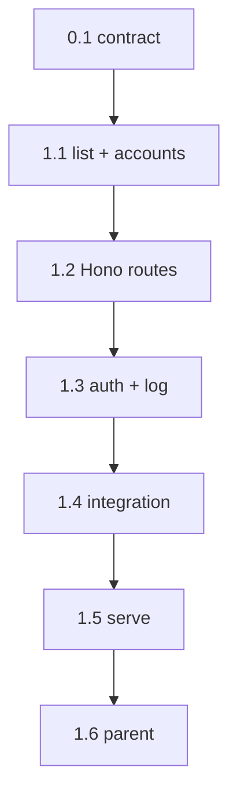

```text
Parent: /strategy/relay-master-plan
Track: C
Needs Mini: no
Blocked by: B
```

## How to use this document

This is **Relay child plan #3** (Track C). It wraps [child #2](/strategy/relay-runner-plan) with HTTP. It does **not** implement the web console, phone app, Cursor adapter, jobs/promote, or Mini networking.

Read [Relay — master plan](/strategy/relay-master-plan) **Control API** and **Machines** first. Call `startRun` / `approve` / `reject` / `stop` / `loadRun` from `relay/src/runner`. Do not invent a second run record.

Work tasks **in order**. Subsequent agents will not have this chat.

<Warning>
**This file is the handoff.** If a choice is not in the [Decision log](#decision-log) or a task, it does not exist. Do not start Track D or E from this plan.
</Warning>

### Before you start (required)

1. Read this How-to, [Engineering conventions](#engineering-conventions-required), and the [Decision log](#decision-log).
2. Read `relay/src/runner/index.ts` and parent [Control API](/strategy/relay-master-plan#control-api-contract).
3. Skim the [Task status ledger](#task-status-ledger).

For every task:

1. Read **Context**, **Instructions**, and **As built** on tasks you depend on.
2. Implement only what that task describes.
3. Run **Evaluation criteria** before marking done.
4. **Edit this file** in the same PR ([Agent completion](#agent-completion)).

### Agent completion

<Warning>
When you finish, pause, or get blocked, edit this markdown file in the same PR. A task is not done if **Implementation notes** is still `_None yet._`. Also update the parent [Child plan ledger](/strategy/relay-master-plan#child-plan-ledger) when this plan is `done` / `blocked`.
</Warning>

1. Ledger row → `done` / `blocked` / `in_progress` (Notes: `doneAt`, pointer).
2. Task heading **Status** matches.
3. Evaluation checkboxes only for items you verified.
4. Replace **Implementation notes** with **As built**.
5. Append [Handoff log](#handoff-log).
6. Architecture forks → [Decision log](#decision-log) **and** the parent if a locked decision changed.

#### As built template

```md
**As built:**

| Concern | Landed |
| --- | --- |
| Files | `path` |
| Exports | names |
| Choice | fork you picked |
| Tests | what you ran |
| Follow-up | leftovers (or “none”) |
```

---

## Overall context

### What we are building

A **localhost HTTP API** (`relay/src/api`) so laptop web and the phone share one contract:

1. Health + machine identity (this box only).
2. Kickoff / list / get / approve / reject / stop via the existing runner.
3. Log tail (SSE or poll) from `runs/<id>/log.txt`.
4. `GET /accounts` from config + attributed usage already on run records.
5. Integration: `POST /runs` → fake adapter → `awaiting-approval` → `POST approve` → `done`.

### What we are not building

- Web UI, Expo app, MSW
- Cursor / Claude / Codex adapters
- `goal` planner (`POST /runs` with only `goal` → `400`)
- Job artifact + promote (return `501` with `code: not-implemented`)
- Preview supervisor (Metro/Vite). `POST /runs/:id/preview` updates the stored `preview` only; `previewUrl` stays empty
- Tailscale, TLS, launchd
- A registry of other Minis (clients hold `{ id, url }`)

---

## Engineering conventions (required)

| Concern | Rule |
| --- | --- |
| Home | `relay/src/api/`. Same package |
| Runtime | Node 20, TypeScript, ESM, Vitest |
| HTTP | **Hono** + `@hono/node-server`. One `createApp(deps)` for tests |
| Runner | Import from `../runner/index.js`. Fake adapter default (same as `relay run`) |
| Auth | `Authorization: Bearer <RELAY_BEARER>`. If `RELAY_BEARER` is unset, require nothing (localhost tests). If set, missing/wrong token → `401` |
| Errors | `{ error: { code, message } }` + HTTP status. `409` mutex, `404` unknown run, `400` bad body |
| Copy | Product **Relay**. Phases and steps keep those words |
| Tests | `app.request()` or listen on port `0`. Temp `RELAY_DATA`. No Mini, no public bind requirement (`127.0.0.1`) |

---

## Decision log

| Date | Decision |
| --- | --- |
| 2026-08-21 | Framework: Hono. Listen `127.0.0.1:${RELAY_PORT\|\|8787}`. |
| 2026-08-21 | JSON bodies and responses. `GET /runs/:id` returns the `RunRecord` plus `logPath`. Do not wrap in Meridian `{ success, data }`. |
| 2026-08-21 | `POST /runs` requires `planPath` (absolute or workspace-relative). Optional overrides: `preview`, `agent`, `account`, `gate`, `branch`, `machineId`. Ignore client `machineId` if it disagrees with this process; use `RELAY_MACHINE_ID`. |
| 2026-08-21 | Kickoff is **async enough**: `startRun` may return `awaiting-approval` or `done` before the HTTP response. Do not background the first phase unless it would block the event loop for minutes — fake adapter is fast; if `startRun` is still `running` when you would reply, wait until it parks (`awaiting-approval` / `done` / `failed`) or 5s, then return current `state.json`. |
| 2026-08-21 | `GET /accounts`: read `RELAY_DATA/accounts.json` (list of `{ tool, account }`). Sum `usage[]` from listed runs. `vendorRemaining: "unknown"`. Empty file → empty array (not an error). |
| 2026-08-21 | `GET /runs/:id/log?after=` byte offset poll. `Accept: text/event-stream` → SSE of new lines. |
| 2026-08-21 | Jobs routes exist as stubs (`501`). |
| 2026-08-23 | Kickoff now persists and returns the durable `queued` `RunRecord` immediately after plan parsing/mutex acquisition. Branch alignment, preview selection, and agent execution continue in the registered background runtime; clients poll the existing run/log routes for progress. Stop during queued setup fails the run and prevents preview/agent startup. This supersedes the earlier wait-for-first-park behavior. |

---

## Route contract

Implement every parent row. Status codes as below.

| Method | Path | Status | Body / notes |
| --- | --- | --- | --- |
| `GET` | `/health` | 200 | `{ ok: true }` |
| `GET` | `/machine` | 200 | `{ id, hostname, profile, ram: { totalBytes, freeBytes }, idle }` — `idle` true when no run is `queued`/`running`/`awaiting-approval`. `profile` is `"agent"` until Track G |
| `GET` | `/accounts` | 200 | `{ accounts: [{ tool, account, attributed: { tokens, costUsd, durationMs }, vendorRemaining, lastUsedAt? }] }` |
| `GET` | `/runs` | 200 | `{ runs: RunRecord[] }` newest first |
| `POST` | `/runs` | 201 | Durable `queued` `RunRecord`; setup/execution continues asynchronously. `400` if `goal` without `planPath` or missing `planPath` |
| `GET` | `/runs/:id` | 200 | `RunRecord` |
| `GET` | `/runs/:id/log` | 200 | Poll: `{ offset, chunk }`. SSE: `text/event-stream` |
| `POST` | `/runs/:id/approve` | 200 | `RunRecord` after `approve` |
| `POST` | `/runs/:id/reject` | 200 | `{ note: string }` required |
| `POST` | `/runs/:id/stop` | 200 | `RunRecord` after `stop` |
| `POST` | `/runs/:id/preview` | 200 | `{ preview: expo\|web\|none }` updates record only |
| `GET` | `/jobs/:id` | 501 | `{ error: { code: "not-implemented", message } }` |
| `POST` | `/jobs/:id/promote` | 501 | same |

`POST /runs` example:

```json
{
  "planPath": "fixtures/plans/mixed-gates.md",
  "preview": "none",
  "agent": "cursor",
  "account": "work"
}
```

---

## Task status ledger

| Task | Status | Notes |
| --- | --- | --- |
| 0.1 | done | doneAt 2026-08-21; contract confirmed in this file |
| 1.1 | done | doneAt 2026-08-21; `listRuns` + accounts rollup with unit coverage |
| 1.2 | done | doneAt 2026-08-21; Hono app + run routes with unit coverage |
| 1.3 | done | doneAt 2026-08-21; bearer middleware + byte-offset poll/SSE log tail |
| 1.4 | done | doneAt 2026-08-21; offline HTTP fake-runner approval loop |
| 1.5 | done | doneAt 2026-08-21; localhost `relay serve` CLI + env wiring |
| 1.6 | done | doneAt 2026-08-21; Track C closed on parent ledger |

---

## Execution order



---

## Phase 0 — Contract

### Task 0.1 — Confirm API contract

**Status:** `done`

**Context:** Parent table is the resource model. This file only fills status codes and stubs.

**Instructions:**

1. Treat [Decision log](#decision-log) and [Route contract](#route-contract) as locked.
2. Do not add `/v1` prefixes or a second run schema.
3. No code.

**Evaluation criteria:**

- [x] Jobs are stubs, not omitted
- [x] No planner route

**As built:**

| Concern | Landed |
| --- | --- |
| Files | `strategy/relay-api-plan.mdx` |
| Exports | none (contract-only task) |
| Choice | Confirmed the locked unversioned routes, existing runner record, `501` jobs stubs, and `400` response for `goal` without `planPath` |
| Tests | Manual contract review against the parent Control API, this plan's Decision log and Route contract, and `relay/src/runner/index.ts` |
| Follow-up | Task 1.1 may add run listing and account rollups; later route work must retain the jobs stubs and must not add a planner |

---

## Phase 1 — API

### Task 1.1 — List runs + accounts rollup

**Status:** `done`

**Context:** Store has `loadRun` / `createRun` but no list. Accounts UI needs a rollup.

**Instructions:**

1. Add `listRuns(dataDir)` in `relay/src/runner/store.ts` — read `runs/*/state.json`, skip corrupt files, sort by `createdAt` desc.
2. `relay/src/api/accounts.ts`: load `accounts.json`; fold `usage` from `listRuns`. Export a pure function for tests.
3. Default `accounts.json` in tests: `[{ "tool": "cursor", "account": "work" }, { "tool": "claude", "account": "max" }]`.
4. Unit tests: empty dir; two runs; usage sums on the matching `tool`+`account`.

**Evaluation criteria:**

- [x] `listRuns` used by `GET /runs` later
- [x] Missing `accounts.json` → `[]`

**As built:**

| Concern | Landed |
| --- | --- |
| Files | `relay/src/runner/store.ts`, `relay/src/runner/index.ts`, `relay/src/runner/store.test.ts`, `relay/src/api/accounts.ts`, `relay/src/api/accounts.test.ts` |
| Exports | `listRuns`, `rollupAccounts`, `loadAccounts`, `ConfiguredAccount`, `AccountSummary` |
| Choice | Run listing skips unreadable/corrupt state files and sorts valid records newest first; account attribution matches both tool and account, reports the latest usage time, and leaves vendor remaining as `unknown` |
| Tests | `npm test` (59 passed); `npm run build` |
| Follow-up | Task 1.2 should call exported `listRuns` for `GET /runs` and `loadAccounts` for `GET /accounts` |

---

### Task 1.2 — Hono app + run routes

**Status:** `done`

**Context:** Thin handlers. All mutation goes through runner functions.

**Instructions:**

1. `relay/src/api/app.ts`: `createApp(options)` with `dataDir`, `workspace`, `machineId`, `bearer?`, injectable `startRun` deps (fake adapter default).
2. Implement `/health`, `/machine`, `/accounts`, `/runs`, `/runs/:id`, approve, reject, stop, preview.
3. Jobs stubs.
4. `409` on `RunMutexError`.
5. Depend on `hono` + `@hono/node-server` in `relay/package.json`.

**Evaluation criteria:**

- [x] `GET /health` → `{ ok: true }`
- [x] `POST /runs` without `planPath` → `400`
- [x] `GET /jobs/x` → `501`

**As built:**

| Concern | Landed |
| --- | --- |
| Files | `relay/src/api/app.ts`, `relay/src/api/app.test.ts`, `relay/package.json`, `relay/package-lock.json` |
| Exports | `createApp`, `AppOptions` |
| Choice | Thin Hono handlers reuse runner records/actions, force the configured machine id, resolve workspace-relative plans, persist preview selection only, return structured errors, and keep both jobs endpoints as `501` stubs; fake adapter is the default with injectable runner dependencies |
| Tests | `npm test` (66 passed); `npm run build` |
| Follow-up | Task 1.3 should add bearer middleware and `/runs/:id/log`; Task 1.4 should exercise the real fake-runner loop through `app.request()` |

---

### Task 1.3 — Bearer + log tail

**Status:** `done`

**Context:** Phone and laptop will send a shared secret later.

**Instructions:**

1. Middleware: if `options.bearer` (or `RELAY_BEARER`) is set, require it on every route except `GET /health`.
2. `GET /runs/:id/log`:
   - Default JSON `{ offset, chunk }` reading `log.txt` from `after` query (default 0).
   - If `Accept` contains `text/event-stream`, stream new data (poll the file every 200–500ms; end when run is `done`/`failed` **and** file is idle, or keep open until the client drops — pick one and test it).
3. Tests: 401 with bearer set; 200 without; poll returns appended bytes.

**Evaluation criteria:**

- [x] Wrong bearer → `401` on `GET /runs`
- [x] `GET /health` never requires bearer
- [x] Poll `after` advances

**As built:**

| Concern | Landed |
| --- | --- |
| Files | `relay/src/api/app.ts`, `relay/src/api/app.test.ts` |
| Exports | existing `createApp` / `AppOptions` now enforce optional bearer auth and serve log poll/SSE |
| Choice | `options.bearer` overrides `RELAY_BEARER`; only `GET /health` is exempt. Poll offsets count bytes, missing logs are empty, active SSE tails poll every 250 ms, and terminal streams close after all current log bytes are emitted |
| Tests | `npm test` (70 passed); `npm run build` |
| Follow-up | Task 1.4 should verify the fake-runner approval loop through the authenticated-capable app; none for the 1.3 contract |

---

### Task 1.4 — Integration test

**Status:** `done`

**Context:** Parent: POST run → fake adapter → awaiting-approval → approve → done.

**Instructions:**

1. Use `fixtures/plans/mixed-gates.md` and a temp workspace / `RELAY_DATA` (same style as `runner/integration.test.ts`).
2. Inject fake VC/git/shell like Track B so this does not touch real remotes.
3. `POST /runs` → status `awaiting-approval` (phase 2 `approve-before`).
4. `POST /runs/:id/approve` → `done`.
5. `GET /runs/:id` matches disk `state.json`.
6. Existing `npm test` (54+) stays green.

**Evaluation criteria:**

- [x] Integration test green, no network except localhost
- [x] No `relay/web` or `relay-mobile`

**As built:**

| Concern | Landed |
| --- | --- |
| Files | `relay/src/api/app.integration.test.ts` |
| Exports | none (integration coverage only) |
| Choice | Used in-memory `app.request()` with the real runner and default fake adapter; Meridian, branch probing, git, and verify shell calls are injected offline fakes |
| Tests | `npm test -- --run src/api/app.integration.test.ts`; `npm test` (71 passed); `npm run build` |
| Follow-up | Task 1.5 can add the localhost server/CLI entrypoint against the now-verified `createApp` contract |

---

### Task 1.5 — `relay serve`

**Status:** `done`

**Context:** Laptop target until Track G.

**Instructions:**

1. `relay serve` in the existing CLI (`src/cli.ts` / `cli/run.ts`): bind `127.0.0.1`, print `id` + URL.
2. Env: `RELAY_DATA`, `RELAY_WORKSPACE`, `RELAY_MACHINE_ID`, `RELAY_BEARER`, `RELAY_PORT`.
3. README: one example (`RELAY_WORKSPACE=.. npx relay serve`).
4. Unit test: argv `serve` calls a injectable listen (do not leave a server running in Vitest).

**Evaluation criteria:**

- [x] `relay parse` still works
- [x] `relay serve --help` or missing workspace prints a clear error

**As built:**

| Concern | Landed |
| --- | --- |
| Files | `relay/src/cli/serve.ts`, `relay/src/cli/run.ts`, `relay/src/cli/run.test.ts`, `relay/README.md` |
| Exports | `runServeCli`, `SERVE_USAGE`, `Listen`, `ListenOptions`, `ListenInfo`, `ServeCliDependencies`, updated `runMainCli` dependency injection |
| Choice | Requires `RELAY_WORKSPACE`, binds only `127.0.0.1`, defaults to port `8787` and machine `relay-1`, wires all five Relay env values, and prints machine id plus the actual listening port; `--help` never binds |
| Tests | `npm test` (74 passed); `npm run build`; compiled `relay parse` and `relay serve --help` smokes |
| Follow-up | Task 1.6 should close Track C in the parent ledger; no server process was left running during verification |

---

### Task 1.6 — Close Track C on the parent

**Status:** `done`

**Context:** Parent agent-completion rule.

**Instructions:**

1. Parent ledger row **#3** → `done` + Notes with date and this Mintlify path.
2. This file’s 0.1–1.5 are `done`.
3. Do not start Vite or Expo.

**Evaluation criteria:**

- [x] Parent row #3 is `done`
- [x] No web/phone app in the PR

**As built:**

| Concern | Landed |
| --- | --- |
| Files | `strategy/relay-master-plan.mdx`, `strategy/relay-api-plan.mdx` |
| Exports | none (plan closeout only) |
| Choice | Marked child #3 / Track C complete after confirming tasks 0.1–1.5 were done; no locked decisions changed and no web or phone implementation was added |
| Tests | Closeout audit of both ledgers and Relay directory boundary; latest full Relay suite remains 74 passing with a green TypeScript build from Task 1.5 |
| Follow-up | Track C is closed; subsequent work belongs to the separate Track D/E, adapter, Mini, or jobs plans |

---

## Out of scope / next plan

| Item | When |
| --- | --- |
| Web console (can mock or hit this API) | [Child #4a](/strategy/relay-web-plan) |
| Phone shell | [Child #4b](/strategy/relay-phone-plan) |
| Cursor adapter | [Child #5](/strategy/relay-cursor-plan) |
| Jobs + promote | #8 |

---

## Success criteria (this plan)

| Signal | Target |
| --- | --- |
| Loop | HTTP mixed-gates → approve → `done` |
| Machine | `GET /machine` has `id` + `idle` |
| Accounts | Rollup from run usage; vendor `unknown` |
| Auth | Bearer optional unless configured |
| Boundary | No UI; runner tests still green |

---

## Handoff log

- 2026-08-21 — Task 0.1 complete. Confirmed the Track C API contract as written: routes remain unversioned, HTTP handlers reuse the runner's `RunRecord`, jobs routes remain explicit `501` stubs, and planner behavior is out of scope (`goal` without `planPath` returns `400`). No code, architecture, or parent-plan changes were needed. Next: Task 1.1.
- 2026-08-21 — Task 1.1 complete. Added newest-first persisted run listing with corrupt-state tolerance, exported it through the runner API, and added configured-account usage rollups keyed by tool and account with `unknown` vendor remaining and latest-use timestamps. Full Relay suite passes (59 tests) and the TypeScript build is green. Next: Task 1.2.
- 2026-08-21 — Task 1.2 complete. Added the Hono `createApp` factory with injectable runner dependencies and fake adapter default; health, machine, accounts, run creation/list/get/actions/preview, structured errors, mutex conflict handling, and explicit jobs stubs are covered. Added Hono runtime dependencies. Full Relay suite passes (66 tests) and the TypeScript build is green. Next: Task 1.3.
- 2026-08-21 — Task 1.3 complete. Added optional bearer middleware from app options or `RELAY_BEARER` with an always-public health route, byte-offset JSON log polling, and SSE tailing that polls active runs every 250 ms and closes after terminal logs are drained. Full Relay suite passes (70 tests) and the TypeScript build is green. Next: Task 1.4.
- 2026-08-21 — Task 1.4 complete. Added an offline `app.request()` integration loop using `mixed-gates.md`: HTTP kickoff reaches phase 2 `awaiting-approval`, HTTP approval reaches `done`, fake usage covers both phases, and HTTP GET matches persisted state plus `logPath`. Full Relay suite passes (71 tests) and the TypeScript build is green. Next: Task 1.5.
- 2026-08-21 — Task 1.5 complete. Added `relay serve` with injectable listening, fixed `127.0.0.1` binding, port `8787` default, complete Relay env wiring, machine/URL startup output, help and missing-workspace errors, and README usage. Full Relay suite passes (74 tests), the TypeScript build is green, and compiled parse/help smokes pass. Next: Task 1.6.
- 2026-08-21 — Task 1.6 complete. Marked child #3 / Track C done in the Relay master ledger, confirmed all child tasks are complete, and rechecked the no-web/no-phone boundary. No locked decisions changed. Track C is closed; next work belongs to its separate child plans.
- 2026-08-22 — Post-close restart hardening. Each `createApp` instance now owns a runtime registry and completes persisted-run recovery before handling requests. Parked gates resume through approve/reject/stop after a process restart; interrupted queued/running records fail closed and release the machine mutex. The integration loop now recreates the API between gate and approval.
- 2026-08-23 — Post-close observable kickoff. `POST /runs` now returns the persisted `queued` record before branch alignment/preview/agent work and continues through the existing registered runtime in the background. Runner logs expose accepted, branch-alignment, preview-selection, and execution-start transitions; stop during queued setup fails closed before preview/agent startup. All 139 Relay tests and the TypeScript build pass.
