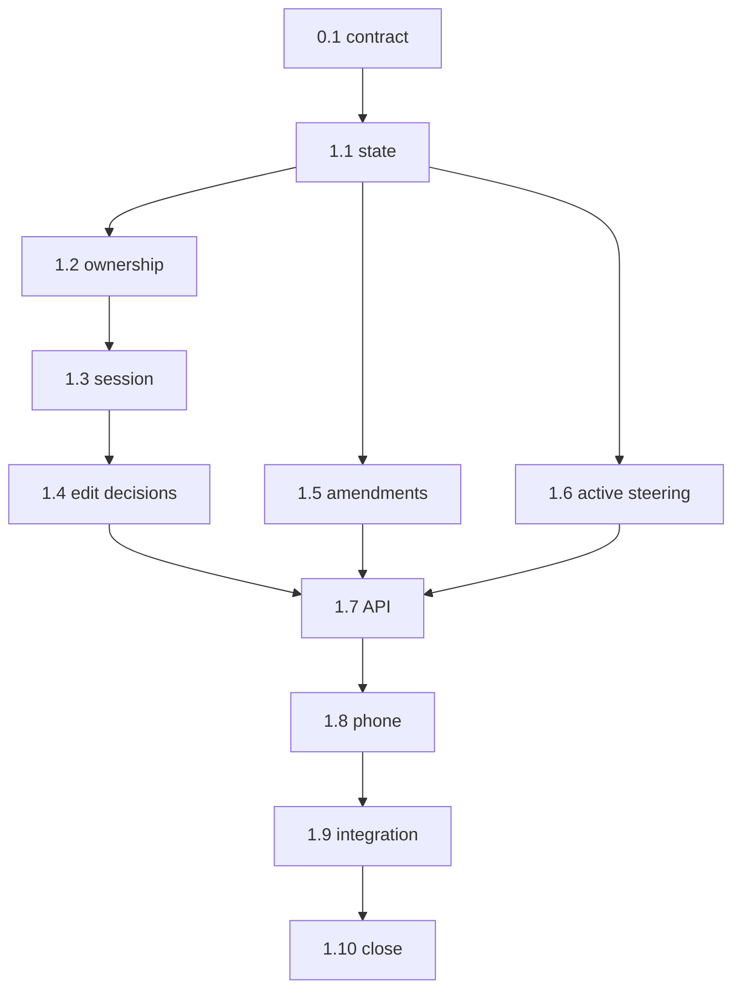

```text
Parent: /strategy/relay-master-plan
Track: I
Needs Mini: no for implementation; yes for real Cursor/restart acceptance
Blocked by: B, C, H, child #5
```

## How to use this document

This is **Relay child plan #11**. It turns an approval gate into a bounded steering workspace: ask read-only questions, explicitly request direct code edits, inspect the session-owned diff/tests, accept or discard those edits, and separately accept any revision to remaining plan work.

Read [Relay — master plan](/strategy/relay-master-plan) **Checkpoint steering**, **Run amendments**, **Context**, **Version control**, and **Control API**; [child #2](/strategy/relay-runner-plan), [child #3](/strategy/relay-api-plan), [child #5](/strategy/relay-cursor-plan), and [child #10](/strategy/relay-planning-workspace-plan).

Work tasks **in order**. Subsequent agents will not have the product-alignment conversation that created this plan.

<Warning>
**Hard boundary:** The checkpoint session may edit only after an explicit change request and only while it owns the run lock. It must never make ordinary questions mutating, rewrite completed history, reset unrelated work, silently accept a plan revision, preserve a false claim that an SDK process survived restart, or resume execution with unresolved owned changes.
</Warning>

### Before you start (required)

1. Read this How-to, [Engineering conventions](#engineering-conventions-required), [Decision log](#decision-log), and [Task status ledger](#task-status-ledger).
2. Read `relay/src/runner/run.ts`, store/types/mutex/recovery, packer briefs, VC wrappers, adapter cancellation/disposal, and API gate routes.
3. Read current phone Run/Gate screens and polling behavior.
4. Inspect child #10 accepted revision/store APIs as built; do not assume planned filenames survived implementation unchanged.
5. Keep tests offline through injected adapter, shell, Git, clock, and filesystem seams.

### Agent completion

<Warning>
When a task finishes, pauses, or blocks, update this file in the same PR. A task is not done while its **Implementation notes** remain `_None yet._`. Update the parent ledger when this child becomes `done` or `blocked`.
</Warning>

1. Ledger row matches task status.
2. Evaluation checkboxes reflect commands actually run.
3. Replace **Implementation notes** with **As built**.
4. Architecture forks update this Decision log and the parent.
5. Append the [Handoff log](#handoff-log).

---

## Overall context

### Ordinary checkpoint

```text
verify passes → awaiting approval
  → Ask question (read-only, same bounded session)
  → Request change (session edits current branch directly)
  → live preview + accumulated owned diff + verification
  → optional proposed remaining-plan amendment → Accept revision
  → Accept changes OR Discard changes
  → next phase starts with a fresh execution agent + steering brief
```

The checkpoint Cursor session may persist across the back-and-forth while the gate is open. It is not the next phase execution session.

### Active-step steering

| Choice | Semantics |
| --- | --- |
| Send at next checkpoint | Persist the note immediately and include it when the next normal gate opens; do not interrupt the active adapter |
| Stop and steer now | Cancel the active adapter, preserve partial files/logs, park the current step in steering state, and open a checkpoint session |

After stop-now steering is accepted, the **current step restarts with a fresh execution agent**. Its brief contains the interrupted output, partial diff, accepted checkpoint edits, and steering note so it can finish without blindly redoing work.

### Code versus plan acceptance

Code edits and plan revisions are separate:

- The checkpoint agent may directly change code only after an explicit change request.
- The phone shows the accumulated session-owned diff and verification.
- **Accept changes** finalizes those edits; **Discard changes** restores the captured baseline for owned paths only.
- If future direction changes, the agent proposes a new remaining-plan revision. That revision has its own **Accept revision** action.
- Resume is disabled until every pending code/plan decision is resolved.

### What we are not building

- A long-lived execution agent across phases
- Mutating code in response to ordinary questions
- Rewriting completed phases/steps or deleting their artifacts
- Raw Git reset/checkout over the workspace
- Concurrent worker or manual-process ownership during checkpoint editing
- Web steering UI in this child; APIs remain client-neutral
- Push delivery itself; polling works and child #9 may notify later

---

## Engineering conventions (required)

| Concern | Rule |
| --- | --- |
| Run status | Preserve compatibility by keeping the run gate-visible while a nested checkpoint/steering record expresses discussion/edit/verify/decision state |
| Persistence | `RELAY_DATA/runs/<id>/checkpoints/` stores transcript, baseline metadata, owned paths/diff, verification, proposed amendment, and recovery state |
| Session | One bounded checkpoint agent per open gate. Same session may answer/edit repeatedly; restart creates a fresh agent from persisted pack and labels it recovered |
| Question | Read-only tools/context only. No file mutation unless the user explicitly requests a change |
| Edit ownership | Capture baseline before the first edit. Track every owned path/repo; reject concurrent mutations and never discard files outside ownership |
| Git | Runner/VC owns branch alignment. Checkpoint agent never switches/pulls/pushes/ships. Accepted edits use the existing commit path after verification |
| Verification | Show relevant requested/plan verification results. Do not claim success from agent prose |
| Plan amendment | Completed cursor/history immutable; remaining plan re-resolves from a separately accepted revision; completed-work changes append corrective work |
| Locking | Checkpoint editing holds the run/worker lock and blocks manual processes. Read-only workspace status remains available |
| Recovery | Persist first, act second. Never claim the original SDK session survived a Relay/Mini restart |
| Tests | Inject agent, exec, Git, filesystem, time, and recovery. No live Cursor, Mini, Tailscale, push, or Git remote |

---

## Decision log

| Date | Decision |
| --- | --- |
| 2026-08-23 | Ordinary questions are read-only. Explicit change requests let the bounded checkpoint Cursor session edit code directly. |
| 2026-08-23 | The same checkpoint agent session remains live for back-and-forth while the gate is open; the next execution phase is still fresh. |
| 2026-08-23 | Capture a baseline; show live owned diff/tests; Accept finalizes and Discard removes checkpoint-owned work only. |
| 2026-08-23 | Completed history is immutable. Remaining work may be revised; completed-work changes become corrective steps. |
| 2026-08-23 | Code acceptance and plan-revision acceptance are separate and both block resume while unresolved. |
| 2026-08-23 | Active work offers Send at next checkpoint and Stop and steer now. Stop-now parks partial state and later restarts the current step with a fresh execution agent. |
| 2026-08-23 | Recovery persists transcript/baseline/diff/artifacts, creates a new agent, and labels the session recovered. |
| 2026-08-23 | Phone gets the first steering UI; API design must remain usable by a future web client. |
| 2026-08-24 | Checkpoint state is an atomic nested store below each run rather than duplicated inside `RunRecord`; the compatible top-level status remains `awaiting-approval`, and runner mutex/runtime seams enforce ownership and resume blocking. |
| 2026-08-24 | Repository ownership uses the captured HEAD as the immutable source for initially clean tracked files and stores exact content for preexisting dirty/untracked paths. Git HEAD, content, or index drift outside declared edit paths becomes a durable conflict; discard and commit use exact owned pathspecs only. |
| 2026-08-24 | One live Cursor agent is reused only within an open checkpoint. Every turn replaces its synthetic custom-tool surface by explicit intent: questions get inventory/read/search only; edit requests additionally get bounded write/delete callbacks. Restart disposes any old in-memory session, creates a fresh agent from persisted context, and labels its response recovered. |

---

## Task status ledger

| Task | Status | Notes |
| --- | --- | --- |
| 0.1 | done | Locked checkpoint/edit/amendment contract and named exact implementation seams; no code |
| 1.1 | done | Typed atomic checkpoint/steering store, validated transitions, persist-first effects, and restart-safe mutex retention |
| 1.2 | done | Multi-repo baseline, structured owned diff, external conflict detection, exact discard, and scoped resumable commit |
| 1.3 | done | Persist-first bounded Cursor conversation, intent-specific capabilities, live-session reuse, safe context, usage, and fresh recovery |
| 1.4 | done | Direct edit verification, accept, discard, and resume |
| 1.5 | done | Versioned remaining-plan amendments and corrective work |
| 1.6 | done | Queue-next and stop-now active-step steering |
| 1.7 | done | Authenticated checkpoint conversation, decisions, safe review payloads, and active steering routes |
| 1.8 | done | Machine-scoped phone checkpoint conversation, decisions, recovery, preview, and active steering UI |
| 1.9 | done | Offline cross-service acceptance, restart/concurrency recovery, full regressions, and security boundaries |
| 1.10 | done | Audited child #11, reran full regressions and boundaries, and closed the parent ledger |

## Execution order



---

## Phase 0 — Contract

### Task 0.1 — Confirm checkpoint steering contract

**Status:** `done`

**Instructions:**

1. Treat the Decision log, ordinary-checkpoint flow, and active-step semantics as locked.
2. Name exact runner/store/adapter/VC/API/mobile seams for tasks 1.1–1.9.
3. Confirm direct edits require explicit language, plan amendments require separate acceptance, and completed history stays immutable.
4. No product code.

**Evaluation criteria:**

- [x] Question/edit, code/plan acceptance, and checkpoint/execution sessions remain distinct
- [x] Stop-now semantics restart the interrupted current step with a fresh agent
- [x] Discard is ownership-scoped, not a broad reset
- [x] No code changed

**As built:**

- Confirmed the locked lifecycle without product-code changes. An ordinary checkpoint question is read-only; only an explicitly classified change request may grant the bounded checkpoint session write capability. Checkpoint code edits require an explicit **Accept changes** or **Discard changes** decision, while a proposed remaining-plan amendment independently requires **Accept revision** or rejection. Neither proposal changes execution before acceptance, and unresolved code or plan decisions block resume.
- Confirmed session and history boundaries. One checkpoint session may persist only while its gate remains open; Relay restart reconstructs a fresh checkpoint agent from persisted state and labels it recovered. Every resumed phase/step execution uses a fresh execution adapter. Completed cursor/history and verification artifacts remain immutable; implications for completed work append corrective work with checkpoint provenance.
- Confirmed active steering semantics. **Send at next checkpoint** persists context without interrupting the current adapter. **Stop and steer now** is a persisted controlled cancellation, not terminal Stop/failure; it retains partial files/logs/artifacts and, after all steering decisions resolve, restarts the interrupted current step with a fresh execution adapter and an explicit partial-state/do-not-redo brief.
- Confirmed ownership and version-control boundaries. The checkpoint editor owns only paths captured from its pre-edit baseline while holding the run mutex. Accept follows Relay's scoped verify/commit conventions. Discard restores only owned paths after conflict checks; it must not approve the gate, overwrite external/unowned changes, or use broad reset, checkout, clean, or stash operations.

| Task | Exact implementation seams locked by 0.1 |
| --- | --- |
| 1.1 | Keep `relay/src/runner/types.ts` (`RunRecord`, `RunStatus`) and `relay/src/runner/store.ts` as the compatible top-level run source; add the atomic nested store under `relay/src/checkpoint/` using `relayDataDir` / `runDirectory`; extend `relay/src/runner/mutex.ts` (`mutexOwner`) and `relay/src/runner/run.ts` (`recoverRunRuntimes`, `approve`, runtime registry) so unresolved sessions retain exclusive ownership and block resume across restart. |
| 1.2 | Add an injected checkpoint-baseline/ownership service under `relay/src/checkpoint/`, using `relay/src/vc/index.ts` contracts (`MeridianExec`, `GitExec`, `CommandResult`), `relay/src/vc/meridian.ts` / `sibling-git.ts` repository rules, and a new scoped commit seam factored from `relay/src/runner/run.ts#phaseCommit`; never reuse the broad `git add -A` path for checkpoint acceptance or use destructive Git restoration. |
| 1.3 | Add the bounded conversation service under `relay/src/checkpoint/`, reusing account-key resolution from `relay/src/adapters/cursor.ts` (`resolveCursorApiKey`) and the same injected `Agent.create` pattern. Add a checkpoint-specific context pack in `relay/src/checkpoint/context.ts` that reads the existing `relay/src/pack/brief.ts` artifacts plus persisted run/plan, logs/artifacts, verification, VC/Git status, baseline/diff, and transcript. Keep question and edit capabilities separate per turn without changing execution-adapter factory defaults. |
| 1.4 | Extend `relay/src/runner/run.ts` (`RunRuntimeRegistry`, `approve`, `reject`, `stop`, adapter execution/verification, preview supervisor use, and commit flow), `relay/src/runner/types.ts#VerifyResult`, and checkpoint persistence/services. Acceptance requires recorded successful shell verification plus conflict-free owned changes; discard disposes the checkpoint adapter and returns to the existing `awaiting-approval` gate without calling `approve`. Generate accepted steering into the next fresh execution brief through `relay/src/pack/brief.ts`. |
| 1.5 | Reuse `relay/src/planning/types.ts#PlanDraftRevision`, `relay/src/planning/store.ts` (`addRevision`, `acceptRevision`, immutable-revision validation), and `relay/src/planning/planner.ts#validateProposedPlan` shapes/validation where compatible, but persist run amendment proposals below the run checkpoint directory. Re-resolve only accepted remaining work through `relay/src/parser/index.ts` (`parsePlanMarkdown`, `resolvePlan`, `stringifyPlan`) and preserve the original `RunRecord.plan`, completed cursor, briefs, and artifacts. |
| 1.6 | Extend `relay/src/runner/run.ts` runtime context/active-adapter handling and `relay/src/adapters/types.ts#AgentAdapter.abort`; preserve Cursor cancel/dispose behavior in `relay/src/adapters/cursor.ts`. Persist queue-next or stop-now intent before side effects, distinguish controlled stop-now from `run.ts#stop`, capture partial state, and restart the same cursor with a newly constructed adapter and steering brief. |
| 1.7 | Extend `relay/src/api/app.ts` (`AppOptions`, injected run actions, bearer middleware, `createApp`, existing `/runs/:id` action and preview route patterns) with checkpoint read/message/code-decision/plan-decision and steer endpoints. Keep `approve`, `reject`, `stop`, and preview routes compatible; add in-memory coverage alongside `relay/src/api/app.test.ts` and `app.integration.test.ts`, using structured non-secret conflict/transition errors. |
| 1.8 | Extend `relay-mobile/src/types.ts`, `api.ts`, and `navigation/types.ts`, then the existing polling/navigation surfaces in `relay-mobile/src/screens/RunScreen.tsx` and `GateSheetScreen.tsx`. Preserve machine `baseUrl`, current Approve/Reject/Stop behavior, and phase/step wording; render question/edit, code decisions, and plan-revision decisions as distinct phone-only states with mocked coverage in `relay-mobile/src/__tests__/RunScreen.test.tsx`, `App.test.tsx`, and focused Gate tests. |
| 1.9 | Compose injected runner/store/checkpoint/adapter/shell/Git/time/filesystem seams in `relay/src/runner/integration.test.ts` and `relay/src/api/app.integration.test.ts`; add focused checkpoint recovery/ownership tests under `relay/src/checkpoint/` and mobile mocked integration coverage under `relay-mobile/src/__tests__/`. Restart at every persisted boundary and retain explicit scans for destructive Git, secret/absolute-path leakage, question writes, implicit amendment acceptance, web scope, and live external calls. |

---

## Phase 1 — State, ownership, agent, and amendments

### Task 1.1 — Persist checkpoint and steering state

**Status:** `done`

**Instructions:**

1. Add typed checkpoint/message/edit/recovery/steering records without replacing `RunRecord` or the existing run store.
2. Preserve ordinary `awaiting-approval` compatibility while expressing nested states: discussing, editing, verifying, awaiting-code-decision, awaiting-plan-decision, accepted, discarded, recoverable.
3. Persist messages and steering intent before invoking/canceling an adapter.
4. Enforce one checkpoint editor per run and preserve the worker mutex across the entire unresolved session.
5. Add state-transition tests for normal gates, consecutive gate types, terminal runs, duplicate requests, and restart.

**Evaluation criteria:**

- [x] Existing approve/reject/stop tests remain compatible
- [x] Invalid transitions fail without corrupting run state
- [x] Unresolved checkpoint state retains the worker lock
- [x] Persist-first transition tests pass

**As built:**

- Added the exported `relay/src/checkpoint/` module. Its typed records cover checkpoint gates, question/edit messages, edit lifecycle, restart recovery, and queue-next/stop-now steering while keeping the existing `RunRecord` and runner store as the compatible run-status surface. The nested checkpoint state supports `discussing`, `editing`, `verifying`, `awaiting-code-decision`, `awaiting-plan-decision`, `accepted`, `discarded`, and `recoverable` without adding new top-level run statuses.
- Added atomic validated persistence at `RELAY_DATA/runs/<id>/checkpoints/state.json` plus an exclusive per-run editor marker. Opening requires the run to be `awaiting-approval` and to own `run.lock`; duplicate editors, conflicting idempotency keys, terminal runs, invalid transitions, and mismatched records fail without mutating persisted checkpoint or run state. Resolving a checkpoint removes only its editor marker and leaves the ordinary approval gate and worker mutex intact.
- Added persist-first message and steering actions. Explicit user intent is typed as `question` or `edit`; edit intent creates a durable edit record and moves the nested state to `editing`. Queue-next and stop-now records are saved before an injected effect may invoke or cancel later adapter work. Matching request retries are idempotent and conflicting retries are rejected.
- Extended `recoverRunRuntimes` to mark an unresolved parked checkpoint `recoverable` with its previous state and recovery provenance before registering the reconstructed runtime. Repeated recovery is idempotent. The existing `approve` path now refuses to resume while a checkpoint remains unresolved, preserving `awaiting-approval` and `run.lock`; ordinary approve/reject/stop behavior remains unchanged when no checkpoint is active.
- Added offline transition coverage for a normal question/edit/verify/decision flow, consecutive `phase-approve` and `approve-before` gates, terminal runs, duplicate editor/message requests, invalid transitions, persist-before-effect ordering, direct restart recovery, runtime-registry recovery, approval blocking, and mutex retention. Verification: `npx vitest run src/checkpoint/store.test.ts src/runner/store.test.ts src/runner/run.test.ts src/runner/integration.test.ts` passed (4 files, 28 tests); `npm test` passed (28 files, 210 tests); `npm run build` and `git diff --check` passed.

### Task 1.2 — Capture baseline and session-owned changes safely

**Status:** `done`

**Instructions:**

1. Add an injected repository-baseline service covering Meridian/Events through existing VC rules and sibling repos through safe Git inspection.
2. Capture repo HEAD/status and content needed to restore only checkpoint-owned tracked/untracked paths before the first direct edit.
3. After each edit response, compute a structured owned diff and detect any unexpected external change; block instead of overwriting.
4. Implement discard without broad reset/checkout/clean and acceptance through the existing verify/commit path.
5. Test multi-repo edits, preexisting run-owned changes, untracked files, external-change detection, repeated discard, and crash recovery.

**Evaluation criteria:**

- [x] Discard restores the baseline only for session-owned paths
- [x] No `git reset --hard`, broad checkout, clean, stash, pull, or push exists
- [x] External/unowned changes block accept/discard with a precise error
- [x] Multi-repo ownership tests pass

**As built:**

- Added the injected repository ownership service in `relay/src/checkpoint/ownership.ts`, exported through `relay/checkpoint`. It discovers the existing VC-aligned repository set from `MERIDIAN_REPOSITORIES` (`Meridian`, `Events-Backend`) and `SIBLING_REPOSITORIES`, records each existing repository's HEAD/status, and persists an atomic private record at `RELAY_DATA/runs/<id>/checkpoints/<checkpoint>/ownership.json`.
- Baselines store exact file/symlink bytes and modes for preexisting dirty or untracked paths; initially clean tracked paths use the captured immutable HEAD plus binary-safe Git blob/mode reads. Each edit response supplies normalized repository-relative claims. Relay compares baseline, last observation, current bytes/modes, Git status, and HEAD; only actual claimed changes become owned. The persisted structured diff reports repository/path, add/modify/delete kind, byte counts, and before/after SHA-256 digests without exposing unrestricted absolute paths.
- Added durable conflict handling for changed HEADs, unowned paths, owned paths mutated after an edit response, and Git index-status changes even when file bytes are unchanged. Conflicts name the exact safe repository/path, persist as `conflicted`, and block both discard and commit without overwriting the workspace. Persisted records validate aligned repository identities and every path before any inspection or restoration.
- Added exact discard using injected filesystem operations only. It restores owned tracked, preexisting-dirty, preexisting-untracked, newly untracked, deleted, executable, and symlink paths from the captured baseline; missing-baseline files are unlinked individually. It never resets, checks out, cleans, stashes, pulls, pushes, or touches unowned paths. Successful discard empties the owned diff and repeated discard is idempotent.
- Added path-scoped local commit using injected `GitExec`: only owned diff paths are passed after `--` to `git add` and `git commit --only`. Multi-repository progress persists after each commit under a `committing` state so a restarted operation skips completed repositories and rechecks uncommitted repositories for external drift. Preexisting changes outside owned paths remain uncommitted and untouched. Task 1.4 will gate this seam on persisted successful verification and resolve the checkpoint decision.
- Added offline real-Git/temp-directory tests for Meridian/Events/sibling discovery, multi-repo diff and commit, preexisting tracked/untracked preservation, new untracked files, symlink restoration, repeated discard, exact commit argv, unowned conflicts, post-edit owned-path conflicts, index-only conflicts, invalid path rejection before effects, and persisted restart/discard recovery. Verification: `npx vitest run src/checkpoint/ownership.test.ts src/checkpoint/store.test.ts` passed (2 files, 14 tests); `npm test` passed (29 files, 217 tests); `npm run build`, `git diff --check`, forbidden-command scans, and adjacent-scope scans passed.

### Task 1.3 — Add bounded Cursor checkpoint conversation

**Status:** `done`

**Instructions:**

1. Add an injected checkpoint-agent service using the selected run/account and one live session while the gate is open.
2. Pack accepted plan/revision, completed summaries, current cursor, phase briefs, logs/artifacts, verification, baseline/diff, Git status, and transcript.
3. Classify each user message explicitly as question or requested edit. Construct read-only capability for questions and bounded write capability for edit requests.
4. Stream/persist assistant responses and usage without secrets. Rebuild a fresh session from the persisted pack after restart and mark it recovered.
5. Test read-only questions, repeated edits in one session, cancellation/disposal, recovery, and missing account errors with injected agents.

**Evaluation criteria:**

- [x] Questions cannot write even if the model attempts it
- [x] Explicit edit requests may update only aligned workspace repos
- [x] Same live session supports follow-up turns until accept/discard
- [x] Recovery uses a new agent and visibly reports that fact
- [x] No live Cursor call runs in tests

**As built:**

- Added the injected `CheckpointConversationManager` and exported Cursor construction seam under `relay/src/checkpoint/conversation.ts`. It resolves the current phase/run Cursor account through the existing `resolveCursorApiKey` and account configuration, persists the user turn and (for edits) ownership baseline before SDK construction, creates one local agent for the open checkpoint, and reuses that same agent across successful follow-up questions and edit requests until explicit close or failure.
- Added intent-specific capability construction through `CheckpointWorkspace`. Every agent is restricted to `tools: ["mcp"]`, sandboxing, no ambient setting sources, and synthetic in-process callbacks rooted only at existing VC-aligned repositories. Question turns expose only bounded inventory/read/search. Explicit edit turns replace the per-send surface with those read tools plus complete-file write and exact-file delete; each mutation preflights external drift and persists claimed ownership immediately afterward. Built-in shell/edit/delete/task/web/process/Git tools, arbitrary MCP servers, symlink writes, directory mutation, and escaping paths are unavailable.
- Added a bounded persisted context pack containing the accepted immutable run plan/resolution, current phase/step cursor, completed phase briefs, adapter artifacts, log tail, last real verification, ownership baseline metadata/diff/conflicts, live safe Git status, transcript, and recovery marker. Context and assistant/error text redact the selected API key, every configured environment value, `RELAY_DATA`, workspace paths, and resolved repository roots. Baseline file contents and credential configuration are not placed in the prompt.
- Extended checkpoint persistence with atomic assistant-response and per-turn Cursor usage records. SDK assistant text is consumed from the stream, sanitized, then stored with token/cost/duration attribution and optional account; tool arguments/results and SDK secrets are never persisted. A forbidden tool event fails closed, cancels the active run when supported, disposes the agent, and leaves the workspace unchanged.
- Recovery uses the Task 1.1 `recoverable` record and prior nested state. A recovered turn disposes any stale in-memory session, restores the persisted state, creates a new injected SDK agent from the rebuilt context, keeps the intact transcript/ownership data, and marks both the returned result and persisted assistant message `recovered: true`; it never claims the prior SDK process survived.
- Added offline injected-SDK/temp-Git coverage for attempted question writes, exact agent option/tool boundaries, explicit aligned writes, escaping-path rejection, repeated edits through one live agent, persist-before-create ordering, context briefs/artifacts/verification/diff, response/usage persistence, secret/path redaction, cancellation/disposal, restart with a new labeled agent, and concise missing-account errors. Verification: `npx vitest run src/checkpoint/conversation.test.ts src/checkpoint/ownership.test.ts src/checkpoint/store.test.ts` passed (3 files, 19 tests); `npm test` passed (30 files, 222 tests); `npm run build`, `git diff --check`, capability scans, secret scans, live-call scans, and adjacent-scope scans passed.

### Task 1.4 — Verify and resolve checkpoint code edits

**Status:** `done`

**Instructions:**

1. Run relevant plan/requested verification against the current owned diff and persist exact command/result.
2. Keep previews live under the active run so the phone can inspect direct edits; do not create a manual process session.
3. **Accept changes** requires no unresolved ownership conflict and records/commits through existing runner conventions before resume.
4. **Discard changes** cancels/disposes the session, restores owned baseline, records the decision, and returns to the original gate.
5. Resume only when code and plan decisions are resolved; next phase uses a fresh execution agent and generated steering brief.

**Evaluation criteria:**

- [x] UI/API data cannot claim verification passed without a real successful command
- [x] Accept commits only owned changes and preserves run history
- [x] Discard leaves no checkpoint-owned diff and does not approve the gate
- [x] Next execution adapter is fresh and receives accepted steering context

**As built:**

- Added persisted checkpoint verification batches with exact command, source (`plan` or explicitly requested), phase-relative working directory, exit code, stdout, stderr, and timestamp. Verification refreshes the structured owned diff before execution, requires at least one real command, enters `verifying` before shell work, and reaches `awaiting-code-decision` only when every recorded result in the latest batch succeeds. A failed or thrown command is durably recorded and returns the checkpoint to `editing`, so later API/UI surfaces cannot infer success from intent or stale results.
- Added `acceptCheckpointChanges` and `discardCheckpointChanges` orchestration under `relay/src/checkpoint/resolution.ts`. Accept requires the run's existing approval gate, the exact code-decision state, a successful latest verification batch, a live runtime backed by an adapter factory, and conflict-free ownership. It closes the checkpoint conversation, uses the Task 1.2 path-scoped multi-repository commit, records a durable handoff, resolves the checkpoint, and only then resumes. Pending plan-decision state cannot pass this boundary.
- Extended runner handoff behavior with a persisted run-relative `pendingSteeringBrief`. The accepted checkpoint brief lists the explicit edit requests, accepted repository-relative paths, and successful commands, tells the next executor not to redo accepted work, and is included exactly in the next execution adapter's prompt before being cleared. Checkpoint resume rejects singleton adapters, guaranteeing factory-created fresh execution while preserving the normal run cursor, usage, artifacts, and completed phase history.
- Discard closes/cancels the checkpoint conversation, invokes ownership-scoped restoration, persists `discarded`, clears the active editor, and leaves the top-level run at the original `awaiting-approval` phase/step. Neither discard nor verification switches/stops the existing preview supervisor, invokes ordinary `approve`, or creates a manual process session.
- Added offline temp-Git/fake-adapter integration coverage for successful plan plus requested verification, exact persisted output, owned-only commit, fresh next adapter with steering prompt, preview continuity, failed verification blocking acceptance, and discard restoration without resume. Verification: focused Task 1.4 plus ownership/store/runner tests passed (4 files, 27 tests); `npm test` passed (31 files, 225 tests); `npm run build`, `git diff --check`, destructive/manual-process scans, and adjacent-scope checks passed.

### Task 1.5 — Add versioned remaining-plan amendments

**Status:** `done`

**Instructions:**

1. Reuse child #10 revision validation/storage shapes where possible; store run amendment proposals inside the run.
2. Freeze completed phases/steps and verification history. Reject proposals that remove/rewrite completed history.
3. Allow remaining phases to change; convert completed-work implications into explicit corrective steps/phases with provenance.
4. Show semantic before/after diff and require explicit **Accept revision** or reject before resume.
5. Re-resolve the accepted remaining plan, regenerate future briefs, and persist amendment provenance without changing the original run snapshot/artifacts.

**Evaluation criteria:**

- [x] Completed history is byte/semantic stable after amendment
- [x] Corrective work is append-only and traceable to the checkpoint
- [x] Unaccepted amendment cannot affect execution
- [x] Re-resolved remaining cursor survives restart
- [x] Parser/runner amendment tests pass

**As built:**

- Added `relay/src/checkpoint/amendment.ts` with checkpoint-local, atomically persisted, versioned run-amendment revisions. The record deliberately reuses child #10's executable revision core (`plan`, canonical `markdown`, optional `summary`, affected repositories, generated id/timestamp) and adds run-specific semantic diff, cursor, decision status, return state, and corrective-work provenance. Multiple proposed drafts may coexist, one selected revision is explicitly accepted, alternatives become superseded, and explicit rejection changes no executable run state.
- Every proposal passes the existing `validateProposedPlan` parser/stringifier/resolver path, then compares the proposed resolved prefix with `RunRecord.resolved` at the persisted phase/step cursor. Any rewrite/removal/reinterpretation of a completed phase header or completed step is rejected before persistence. The immutable original `RunRecord.plan`, `runs/<id>/plan.md`, completed phase briefs, usage, verification, and cursor are never rewritten.
- Added explicit completed-work implication conversion. An implication must identify an actually completed phase/step and becomes a generated corrective step at the first remaining cursor, or a generated corrective phase immediately after a fully completed current phase. Future phases/steps are renumbered canonically, and each generated target retains structured source phase/step plus checkpoint provenance rather than altering the completed source work.
- Acceptance persists the selected decision before effects, writes a separate accepted execution-plan snapshot and amendment brief below the checkpoint, re-resolves only that accepted plan into `RunRecord.resolved`, records acceptance provenance, and keeps the phase/step cursor unchanged. The runner now prompts from the accepted execution snapshot and includes all pending accepted steering/amendment briefs on the next fresh adapter, then clears those one-shot briefs without touching the immutable original plan artifact.
- Added idempotent `reconcileAcceptedRunAmendment` recovery for a crash after acceptance persistence. Restart can finish the run-state projection, restore the checkpoint to its prior `discussing` or `awaiting-code-decision` state, and execute the generated corrective or revised remaining step at the same cursor. Pending plan decisions continue to block Task 1.4 code acceptance; accepting a revision does not implicitly accept code or resume execution.
- Added offline tests covering completed-step rewrite rejection, inert unaccepted/rejected revisions, multiple drafts and explicit selection, semantic before/after changes, generated corrective provenance, immutable plan/history/brief/verification/usage artifacts, separate accepted snapshots, acceptance-crash reconciliation, reloaded cursor, and runner consumption of the accepted plan plus brief. Verification: focused amendment/checkpoint/runner coverage passed (4 files, 24 tests); `npm test` passed (32 files, 229 tests); `npm run build`, `git diff --check`, and adjacent API/mobile/web/active-steering scope scans passed.

### Task 1.6 — Add queued and immediate active-step steering

**Status:** `done`

**Instructions:**

1. Persist **Send at next checkpoint** notes without interrupting the adapter and inject them when the next gate opens.
2. Implement **Stop and steer now** as a controlled cancellation distinct from ordinary terminal Stop/failure.
3. Preserve partial files/log/artifacts and park the current step in steering state with a captured baseline/context.
4. After accepted steering, restart the same step with a fresh execution adapter and a brief containing partial state and “do not redo” guidance.
5. Test races: adapter finishes while stop arrives, duplicate stop-now, no cancel support, verification boundary, restart before/after cancellation.

**Evaluation criteria:**

- [x] Queue-next never interrupts active work
- [x] Stop-now is not recorded as an ordinary terminal failure
- [x] Current step restarts fresh with retained partial context
- [x] Cancellation/disposal and race tests pass

**As built:**

- Extended durable steering records with the requested phase/step cursor, explicit `queued` / `opening-checkpoint` / `parked` / `consumed` lifecycle, attached checkpoint id, safe partial artifact metadata, log byte count, and run-relative brief path. Persisted records validate relative paths and numeric metadata, while compatible loading supplies cursor defaults for older Task 1.1 records. Opening or parked stop-now work now counts as unresolved, so ordinary approval cannot bypass the steering checkpoint after a code discard or restart.
- Added `steerRun` around the existing runtime registry and adapter `abort()` seam. **Send at next checkpoint** persists without touching the live adapter and is converted into a checkpoint transcript entry and one-shot brief only when the runner reaches its next real gate. **Stop and steer now** requires a currently executing adapter, persists `opening-checkpoint` before calling `abort()`, deduplicates retries, and refuses requests after the adapter has crossed into shell verification.
- The runner now interprets a persisted matching stop request before treating the interrupted adapter result as success/failure. Exit `130`, a normal `0` from an adapter without cancel support, and the finish-versus-stop race all park the unchanged phase/step cursor as ordinary `awaiting-approval`; they do not run verification, advance history, mark the run failed, release the worker mutex, or stop the active preview. Partial adapter files/logs remain in the run and an ownership baseline is captured after parking so later checkpoint edits can still be accepted or discarded safely.
- Added automatic steering checkpoints and `acceptSteeringCheckpoint`. Queue-next and stop-now notes are injected as durable checkpoint context. Their generated handoff identifies the persisted cursor and retained artifact sizes, carries the explicit direction, and tells the next executor to inspect partial state and not blindly redo interrupted work. Acceptance requires no unresolved code/plan decision, consumes the parked steering record, and uses the Task 1.4 factory-only resume path; a discarded code edit remains parked until this explicit steering acceptance.
- Extended restart reconciliation across persistence boundaries: an opening stop request is finalized even if Relay restarts before abort, after the run was saved as awaiting approval, or before its handoff projection completed. A fully parked checkpoint becomes `recoverable` through the existing recovery path; after explicit recovery/acceptance, a newly constructed execution adapter restarts the exact interrupted step with the retained plan, files, logs, amendment/code briefs, and active-steering brief.
- Added deterministic offline tests for non-interrupting queue-next delivery, cancel-supported stop-now, same-step fresh restart after Relay recovery, persisted partial artifact/baseline/preview continuity, duplicate stop requests, unsupported cancellation with adapter exit `0`, adapter-finish race, verification-boundary rejection, and restart before cancellation effects. Focused steering/store/resolution/amendment/runner/Cursor cancellation coverage passed (6 files, 42 tests); `npm test` passed (33 files, 234 tests); `npm run build`, `git diff --check`, and API/mobile/web boundary scans passed.

---

## Phase 2 — API, phone, and acceptance

### Task 1.7 — Expose checkpoint and steering API

**Status:** `done`

**Instructions:**

1. Add the parent-contract checkpoint read/message/accept/discard and run steer routes to the existing authenticated API.
2. Validate explicit question/edit intent and queue-next/stop-now modes; return structured transition/conflict errors.
3. Return transcript, state, safe diff summaries/patches, verification, plan proposal, and recovery label without secrets or unrestricted filesystem paths.
4. Keep existing approve/reject/stop/preview routes backward compatible.
5. Add in-memory API tests for auth, all transitions, conflicts, retry/idempotency, and recovery.

**Evaluation criteria:**

- [x] Existing control API tests remain green
- [x] Every mutating endpoint is bearer-protected and transition-validated
- [x] Response payloads omit keys, env values, and unsafe host paths
- [x] API tests cover both ordinary and stop-now checkpoints

**As built:**

- Extended the existing authenticated Hono control plane with `GET /runs/:id/checkpoint`, checkpoint question/edit messages, explicit verification, code accept/discard, separate plan-revision accept/reject, and `POST /runs/:id/steer`. Ordinary checkpoint messages lazily open the one permitted editor while preserving top-level `awaiting-approval`; active steering accepts only `next-checkpoint` or `stop-now` and maps the public `message` field to the persisted steering note.
- Kept the API as a transition-validated projection over the Task 1.1–1.6 services. Question/edit intent is explicit, code acceptance still requires successful persisted verification, pending plan decisions block checkpoint acceptance/discard, accepted/rejected/message retries are idempotent, and ordinary question-only acceptance resumes through the existing injected approve action. Existing approve/reject/stop/preview routes were unchanged.
- Added one safe checkpoint response projection containing transcript/state, recovery labeling, owned diff summaries, bounded text patches or binary/large-file labels, verification, amendment proposal/history, and steering partial-state metadata. Private ownership snapshots and account selection are not returned; configured environment values, Relay/workspace roots, control characters, and unrestricted host paths are redacted from responses and structured errors.
- Added deterministic `app.request()` coverage for bearer enforcement on every new mutation, invalid question/edit and steering values, message retry deduplication, ordinary question and edit transitions, premature code acceptance, independent plan rejection and retry, question-only acceptance and retry, recovered stop-now state, safe partial artifacts, and secret/path omission. Focused API suites passed (2 files, 26 tests); all Relay tests passed (33 files, 237 tests), and `npm run build` plus `git diff --check` passed.

### Task 1.8 — Build phone checkpoint conversation and amendment UI

**Status:** `done`

**Instructions:**

1. Expand the existing Gate/Run flow on phone only; retain Approve/Reject/Stop and current phase/step language.
2. Add explicit Ask question and Request change entry, durable transcript, live/recovered state, owned diff, verification, preview link, Accept changes, and Discard changes.
3. Render remaining-plan proposal separately with semantic diff and Accept revision/reject actions.
4. While running, expose Send at next checkpoint and Stop and steer now with clear consequences and confirmation for stop-now.
5. Disable resume/approve while code or plan decisions are unresolved; add mocked navigation/API/accessibility tests.

**Evaluation criteria:**

- [x] Ordinary question does not present itself as a code change
- [x] Stop-now consequence is explicit before cancellation
- [x] Code and plan decisions are visually/behaviorally separate
- [x] Recovery is labeled and transcript persists across reopen
- [x] Mobile tests and typecheck pass

**As built:**

- Extended the standalone `relay-mobile` client types and API wrapper with the Task 1.7 checkpoint read/message/verify/code-decision/plan-decision and steering contracts. Every method encodes run/revision ids, retains the selected machine `baseUrl`, and uses the existing bearer/error request path; no server code is imported into Metro.
- Expanded the existing Gate sheet without changing its phase/step language or removing Approve, Reject, Dismiss, preview, and run context. The sheet now loads the durable checkpoint alongside the run, labels live/recovered state, renders the persisted transcript, and offers visibly separate **Ask question** and **Request change** entry modes. Question copy states that the turn is read-only; change-request copy states the owned-file, verification, and explicit-acceptance boundary.
- Added a dedicated checkpoint-code decision card with owned safe patches, verification results, **Run verification**, **Accept changes**, and **Discard changes**. A separate remaining-plan proposal card shows its summary and semantic paths with independent **Accept revision** and **Reject revision** actions. Ordinary approval is disabled while code, plan, or recovery decisions remain unresolved; a discussion-only checkpoint resumes through **Accept checkpoint & continue**.
- Added active-run steering to the existing Run screen. **Send at next checkpoint** explicitly leaves the active step running. **Stop and steer now** explains partial file/log preservation and fresh-agent same-step restart in the screen and again in a destructive confirmation alert before the API request. The original terminal **Stop** action remains available and behaviorally separate.
- Added mocked API, navigation, interaction, recovery, and accessibility coverage for selected-machine routing, encoded endpoints, read-only questions, explicit change requests, restored transcript/recovery labels, preview links, simultaneous code/plan review, blocked approval, plan acceptance enabling the later code decision, queue-next steering, and confirmed stop-now. `npm test` passed all 10 suites / 52 tests; `npm run typecheck`, `git diff --check`, and phone-scope boundary scans passed.

### Task 1.9 — Verify offline integration, restart, and boundaries

**Status:** `done`

**Instructions:**

1. Run an injected end-to-end ordinary checkpoint: question, edit, diff, verify, amendment, accept, fresh next phase.
2. Run discard, queue-next, stop-now, current-step restart, and no-cancel adapter paths across multiple repos.
3. Restart API/Relay at each durable boundary and verify recovered label, new agent, owned baseline, mutex, preview, and no duplicate process/session.
4. Run security scans for broad Git/destructive commands, secret/path leakage, question writes, auto-accepted amendments, web UI scope, and live external calls.
5. Run all touched Relay/phone tests and builds.

**Evaluation criteria:**

- [x] Ordinary, discard, queue-next, and stop-now integration flows pass offline
- [x] Restart never loses ownership or claims an old agent survived
- [x] Worker/manual-process conflicts remain blocked
- [x] No live Cursor, Mini, Tailscale, push, Git remote, or destructive Git command occurs
- [x] All touched package tests/builds pass

**As built:**

- Added an authenticated `app.request()` integration scenario that runs entirely in temporary Relay data/workspace directories with injected adapter, checkpoint conversation, Git, shell, VC, clock-independent request ids, and preview supervisor seams. It starts a two-phase run, parks after the first phase, asks a read-only question, proves the repository remains unchanged, and verifies the checkpoint response omits the configured secret and unrestricted workspace path.
- Reconstructed the API/runtime five times across the durable question, edit, verification, plan-decision, and code-decision boundaries. Each reconstruction marks and exposes the session as recovered, restores the previous nested checkpoint state only through a fresh injected conversation generation, preserves the same owned baseline/diff and worker mutex, retains the web preview without a second switch/process, and never claims an old agent/session survived.
- Exercised the complete ordinary acceptance path after recovery: explicit edit creates an owned text patch, plan plus requested verification results persist, the future-phase amendment remains inert until its separate API acceptance, a competing run is rejected by the worker mutex, code acceptance commits only the owned path, and a distinct fresh execution adapter starts the accepted amended next phase. The accepted ownership record, unchanged original question baseline, preview continuity, one close, and exact conversation-generation sequence are asserted.
- Reused and reran the focused multi-repository ownership/discard, queue-next, cancel-supported stop-now, no-cancel stop-now, current-step restart, amendment crash reconciliation, fresh Cursor recovery, duplicate request, editor conflict, and approval/mutex blocking suites. Tightened the no-cancel test to wait for the full durable parked run plus ownership boundary before temporary-directory teardown, removing a real background-write cleanup race; five consecutive focused runs passed.
- Completed explicit scans for destructive/broad Git commands, unrestricted checkpoint write capability, implicit amendment acceptance, secret/host-path leakage, web UI changes, live network/service calls, and phone expansion into push, Live Activities, Tailscale, store, or promote work. Only fake `.invalid` preview URLs and the phone's existing Relay API fetch seam were present. Relay passed 33 files / 238 tests plus build; phone passed 10 suites / 52 tests plus typecheck; both diff checks passed.

### Task 1.10 — Close child #11

**Status:** `done`

**Instructions:**

1. Audit tasks 0.1–1.9, Evaluation criteria, As built tables, recovery, and boundary scans.
2. Update this ledger and append the final handoff.
3. Mark parent child #11 done with `doneAt` and this Mintlify path.
4. Do not begin workspace/process controls (#12), push (#9), or Claude/Codex (#7).

**Evaluation criteria:**

- [x] Child ledger and task statuses agree
- [x] Parent child #11 row is current
- [x] No adjacent-child implementation entered closeout

**As built:**

- Audited Tasks 0.1–1.9 against the task-status ledger, checked evaluation criteria, As built records, decision/recovery contracts, and chronological handoffs. Every implementation task and evaluation remains complete, with Task 1.9 carrying the final injected restart, ownership, mutex, preview, and no-duplicate acceptance evidence.
- Re-ran the complete Relay and phone verification sets at closeout. Relay passed 33 files / 238 tests and `npm run build`; phone passed 10 suites / 52 tests and `npm run typecheck`. Both package diff checks remain clean.
- Repeated the closeout boundary scans for destructive Git operations and adjacent workspace/process, push/Live Activity/store, Claude/Codex adapter, web-steering, Mini/Tailscale, and live-service expansion. No child #12, #9, or #7 implementation entered this documentation-only task; existing agent choices outside this child remain unchanged.
- Marked parent child #11 done with `doneAt 2026-08-24` and the canonical `/strategy/relay-checkpoint-steering-plan` path, and aligned the parent's related-doc status. Child #11 is closed; future workspace/process, push, and additional-adapter work remains in its own pending child.

---

## Handoff log

- 2026-08-24 — Task 1.10 complete. Audited Tasks 0.1–1.9, child status/evaluations/As built records, recovery and ownership evidence, handoffs, and security boundaries. Re-ran all 238 Relay tests/build and all 52 phone tests/typecheck, plus diff and adjacent-child scans. Marked parent child #11 done with `doneAt 2026-08-24` and the canonical Mintlify path. This closeout changed documentation only and did not begin workspace/process controls (#12), push/Live Activity (#9), or Claude/Codex adapter work (#7). Child #11 is closed.
- 2026-08-24 — Task 1.9 complete. Added an injected API-driven ordinary checkpoint acceptance spanning five restart boundaries through question, owned edit/diff, verification, explicit amendment acceptance, explicit code acceptance, mutex conflict, retained preview, and a fresh amended next-phase adapter. Revalidated multi-repo discard, queue-next, stop-now/no-cancel, current-step restart, recovery, ownership, and concurrency suites; stabilized the no-cancel teardown boundary. All 238 Relay tests/build, all 52 phone tests/typecheck, diff checks, and destructive Git/secret/path/question-write/implicit-amendment/web/live-service/adjacent-phone scans pass. Next: Task 1.10 closeout and parent-ledger update only.
- 2026-08-24 — Task 1.8 complete. Added machine-scoped phone checkpoint API types/actions, durable recovered conversation UI, explicit read-only question versus bounded change entry, owned diff/verification/code decisions, separate plan-revision decisions, preview access, blocked approval while unresolved, and active queue-next/confirmed stop-now steering while retaining Approve/Reject/Stop. All 52 mobile tests, typecheck, diff check, and phone boundary scans pass. No web, push, Live Activity, store, Jobs/promote, or Task 1.9 integration work entered this slice. Next: Task 1.9 offline integration, restart, concurrency, and boundary verification.
- 2026-08-24 — Task 1.7 complete. Added bearer-protected checkpoint read/message/verify/code-decision/plan-decision routes and queue-next/stop-now steering, with structured transition/conflict errors, idempotent retries, safe transcript/diff/patch/verification/amendment/recovery projections, and injected offline API coverage. Focused 26 API tests, all 237 Relay tests, build, and diff check pass. Existing approve/reject/stop/preview behavior remains green; no phone or web UI work entered this slice. Next: Task 1.8 phone checkpoint conversation and amendment UI.
- 2026-08-24 — Task 1.6 complete. Added durable queue-next delivery, persist-before-abort stop-now, controlled same-cursor parking, safe partial-state metadata and ownership baseline, automatic steering checkpoints, explicit steering acceptance, fresh same-step execution with a do-not-redo brief, and restart/race/no-cancel reconciliation. Focused 42 tests, all 234 Relay tests, build, diff check, and scope scans pass. No API, web, or mobile work entered this slice. Next: Task 1.7 authenticated checkpoint and steering routes.
- 2026-08-24 — Task 1.5 complete. Added checkpoint-local immutable amendment drafts, existing-parser executable validation, completed-prefix protection, semantic diffs, explicit accept/reject, generated corrective work with provenance, separate accepted execution snapshots/briefs, and restart-safe re-resolution at the unchanged cursor. Focused 24 tests, all 229 Relay tests, build, diff check, and scope scans pass. No active-step steering, API, web, or mobile work entered this slice. Next: Task 1.6 queued and immediate active-step steering.
- 2026-08-24 — Task 1.4 complete. Added exact persisted verification batches, conflict-checked owned-only acceptance, checkpoint-session disposal, ownership-scoped discard, durable accepted steering briefs, and factory-enforced fresh execution resume while leaving the active preview under the run. Focused 27 tests, all 225 Relay tests, build, diff check, and boundary scans pass. No plan-amendment, active-step steering, API, web, or mobile work entered this slice. Next: Task 1.5 versioned remaining-plan amendments.
- 2026-08-24 — Task 1.3 complete. Added the injected bounded Cursor checkpoint manager, persist-first user/baseline flow, read-only question and aligned-write edit capabilities, one live multi-turn session, safe comprehensive context packing, sanitized streamed response/usage persistence, cancellation/disposal, and fresh labeled recovery. Focused 19 tests, all 222 Relay tests, build, diff check, and boundary scans pass with no live Cursor call. No verification/accept/discard orchestration, amendment resolution, API, preview/manual-process, or mobile work entered this slice. Next: Task 1.4 direct edit verification, code acceptance/discard, and fresh execution resume.
- 2026-08-24 — Task 1.2 complete. Added injected aligned-repository baseline capture, structured claimed-path ownership/diffs, durable HEAD/content/index conflict detection, exact tracked/untracked/symlink discard, and resumable path-only multi-repo commits that preserve preexisting unowned changes. Focused 14 tests, all 217 Relay tests, build, diff check, and boundary scans pass. No checkpoint Cursor agent, verification/decision orchestration, API, amendment, or mobile work entered this slice. Next: Task 1.3 bounded Cursor checkpoint conversation and recovery.
- 2026-08-24 — Task 1.1 complete. Added the typed atomic checkpoint/steering store, explicit validated nested transitions, exclusive editor marker, idempotent persist-first message/steering actions, restart recovery to `recoverable`, and approval blocking while unresolved so the worker mutex remains held. Focused 28 tests, all 210 Relay tests, build, diff check, and scope scans pass. No ownership/diff restoration, Cursor checkpoint agent, amendment resolution, new API, or mobile UI entered this slice. Next: Task 1.2 baseline, owned diff, discard, and scoped commit safety.
- 2026-08-24 — Task 0.1 complete. Locked the distinct question/edit, code/plan-decision, checkpoint/execution-session, ownership-scoped discard, immutable-history amendment, queue-next, and controlled stop-now contracts. Named the exact runner/store/mutex/checkpoint/adapter/packer/VC/parser/planning/API/mobile/test seams for Tasks 1.1–1.9. Documentation only; no product code changed. Next: Task 1.1 persistent checkpoint and steering state transitions.
- 2026-08-23 — Child #11 plan created from the approved product-alignment decisions. No code implemented. Blocked by child #10; when unblocked, start with Task 0.1.
