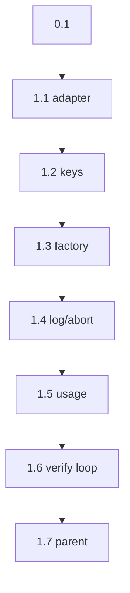

```text
Parent: /strategy/relay-master-plan
Track: B
Needs Mini: no
Blocked by: B, C
```

## How to use this document

This is **Relay child plan #5**. It replaces the **default fake adapter** for `agent: cursor` with a local Cursor SDK session. The runner, parser, HTTP API, and UIs already exist.

Read [Relay — master plan](/strategy/relay-master-plan) **Agents**, [Accounts and usage](/strategy/relay-master-plan#accounts-and-usage), and [What to code](/strategy/relay-master-plan#what-to-code-size). Import `AgentAdapter` from [child #2](/strategy/relay-runner-plan). Do not fork the interface.

Work tasks **in order**. Subsequent agents will not have this chat.

<Warning>
**This file is the handoff.** If a choice is not in the [Decision log](#decision-log) or a task, it does not exist. Do not implement Claude/Codex, failover, phone, or Mini launchd from this plan.
</Warning>

### Before you start (required)

1. Read this How-to, [Engineering conventions](#engineering-conventions-required), and the [Decision log](#decision-log).
2. Read `relay/src/adapters/types.ts`, `relay/src/adapters/fake.ts`, `relay/src/runner/run.ts` (adapter + `verify` + usage), `relay/src/api/app.ts` (default factory), `relay/src/api/accounts.ts`.
3. Read the Cursor SDK TypeScript skill / [cursor.com/docs/sdk/typescript](https://cursor.com/docs/sdk/typescript). Local runtime only.
4. Skim the [Task status ledger](#task-status-ledger).

For every task:

1. Read **Context**, **Instructions**, and **As built** on tasks you depend on.
2. Implement only what that task describes.
3. Run **Evaluation criteria** before marking done.
4. **Edit this file** in the same PR ([Agent completion](#agent-completion)).

### Agent completion

<Warning>
When you finish, pause, or get blocked, edit this markdown file in the same PR. A task is not done if **Implementation notes** is still `_None yet._`. Also update the parent [Child plan ledger](/strategy/relay-master-plan#child-plan-ledger) when this plan is `done` / `blocked`.
</Warning>

1. Ledger row → `done` / `blocked` / `in_progress`.
2. Task heading **Status** matches.
3. Evaluation checkboxes only for items you verified.
4. Replace **Implementation notes** with **As built**.
5. Append [Handoff log](#handoff-log).
6. Architecture forks → [Decision log](#decision-log) **and** the parent if a locked decision changed.

#### As built template

```md
**As built:**

| Concern | Landed |
| --- | --- |
| Files | `path` |
| Exports | names |
| Choice | fork you picked |
| Tests | what you ran |
| Follow-up | leftovers (or “none”) |
```

---

## Overall context

### What we are building

A **Cursor adapter** that implements the existing `AgentAdapter` (`start` / `wait` / `abort`):

1. **Local** `@cursor/sdk` (`Agent.create` + `agent.send` + `run.wait()`), `cwd` = the phase package.
2. **Fresh agent per phase** (empty session). Next phase gets plan + `phase-N-brief.md` as files, not a resumed chat.
3. **Named account** → which API key env var to send (see [Accounts](#accounts)).
4. **Stream** assistant text into `runs/<id>/log.txt`.
5. **Real `verify`** — keep the runner’s existing `shell(step.verify)` after a 0 exit. Prove it with tests. Do not invent a second verify channel.
6. **Factory** so `relay serve` and `relay run` pick Cursor when the resolved agent is `cursor`, unless forced fake.

### What we are not building

- Claude / Codex adapters or failover lists (#7)
- Cloud Cursor agents, `autoCreatePR`, or opening PRs
- Browser usage scraping or a billing product
- Preview supervisor / Metro / Vite (#6)
- Phone (#4b) or BoardUI changes
- Planner-from-goal
- Changing the plan markdown schema

---

## Engineering conventions (required)

| Concern | Rule |
| --- | --- |
| Interface | `relay/src/adapters/types.ts` — do not add a second adapter type |
| Runtime | **Local** only: `local: { cwd }`. Never omit both `local` and `cloud` (SDK default trap) |
| Session | `Agent.create` per phase. Do **not** `Agent.resume` across phases |
| Dispose | `await using` or `try/finally` + async dispose. `abort()` cancels the run if `supports("cancel")` |
| Tests | Inject `Agent.create` / a stub agent. **No live Cursor API** in `npm test` |
| Secrets | Keys in env, not in git, not in the plan file. `accounts.json` stores `apiKeyEnv` names only |
| Fake | Keep `FakeAdapter`. `RELAY_ADAPTER=fake` and `relay run` (no flag) stay fake so fixtures stay offline |
| Verify | Still `context.shell(step.verify, cwd)` in `run.ts`. Adapter must not run verify itself |
| Usage | Adapter returns `{ tokens, costUsd, durationMs }` when the SDK exposes them; otherwise duration + zeros |

---

## Decision log

| Date | Decision |
| --- | --- |
| 2026-08-22 | Cursor via `@cursor/sdk` TypeScript, local runtime. Not the `agent` CLI unless the SDK cannot bind `cwd`. |
| 2026-08-22 | Same `AgentAdapter` as fake. Factory chooses implementation. |
| 2026-08-22 | `relay serve`: if `RELAY_ADAPTER=fake` → fake; else `phase.agent === "cursor"` → Cursor; `claude` / `codex` → fail with a clear “not implemented” (do not silently fake). |
| 2026-08-22 | `relay run` stays fake by default. `--adapter cursor` opts in. |
| 2026-08-22 | Fresh `Agent.create` per phase. Prompt = contents of `promptFiles` (plan + brief) plus the step `instruction` and the brief’s “do not checkout” line. |
| 2026-08-22 | `accounts.json` may add optional `apiKeyEnv` (default `CURSOR_API_KEY`). Missing key → adapter fail, not a hang. |
| 2026-08-22 | `vendorRemaining` stays `unknown` unless the SDK has a one-call usage probe. Do not scrape the dashboard. |
| 2026-08-22 | Failover is **not** this plan. One account per start. |
| 2026-08-22 | Model: pass an explicit id (`composer-2.5` or `auto`). Do not rely on local default. Overridable with `RELAY_CURSOR_MODEL`. |

---

## Accounts

`relay` data dir `accounts.json` today:

```json
[{ "tool": "cursor", "account": "work" }]
```

Allowed additive field (backward compatible):

```json
[{ "tool": "cursor", "account": "work", "apiKeyEnv": "CURSOR_API_KEY" }]
[{ "tool": "cursor", "account": "home", "apiKeyEnv": "CURSOR_API_KEY_HOME" }]
```

Resolution for a phase with `agent: cursor` and `account: home`:

1. Find the matching row (`tool` + `account`). If `account` is omitted, first `cursor` row or `CURSOR_API_KEY`.
2. Read `process.env[apiKeyEnv]` (default name `CURSOR_API_KEY`).
3. Pass that string as `apiKey` to `Agent.create` for **this process only**. Do not export it onto a child that other tools share.

Do not write the key into `RunRecord` or `log.txt`.

---

## Adapter contract (Cursor)

```text
start({ cwd, promptFiles, account, env })
  → create local Agent (injected in tests)
  → send one prompt (files + instruction)
  → stream tokens to log.txt
wait()
  → run.wait(); map status error / non-zero → exitCode 1
  → CursorAgentError (never started) → exitCode 1 + log message
  → usage from SDK if present
abort()
  → cancel if supported; dispose
```

The runner already:

- writes `plan.md` and `phase-N-brief.md`
- calls `adapter.start` then `wait`
- on exit 0, runs `step.verify` in `cwd`
- records `run.lastVerify` and fails the run if verify ≠ 0

This plan must **not** bypass that. After Cursor, verify is a real shell command against real files.

`adapterOutput` in `run.ts` currently reads `fake/<phase>-<step>.txt`. Extend it so a Cursor (or generic) transcript path works for the next brief — e.g. last log slice or `cursor/<phase>-<step>.txt` the adapter writes.

---

## Task status ledger

| Task | Status | Notes |
| --- | --- | --- |
| 0.1 | done | Contract confirmed as written; no code or architecture changes |
| 1.1 | done | CursorAdapter + injected SDK; 78 tests pass |
| 1.2 | done | apiKeyEnv resolution + secret-safe account summaries; 84 tests pass |
| 1.3 | done | Factory + serve / CLI selection; 91 tests pass |
| 1.4 | done | Streamed log/artifact + cancellation/disposal + brief handoff; 95 tests pass |
| 1.5 | done | Token/cost/duration mapping + existing runner persistence; 97 tests pass |
| 1.6 | done | Offline Cursor stub → real shell verify success/failure; 99 tests pass |
| 1.7 | done | Parent child #5 closed at this plan path |

---

## Execution order



---

## Phase 0 — Contract

### Task 0.1 — Confirm adapter contract

**Status:** `done`

**Instructions:**

1. Treat [Decision log](#decision-log) as locked.
2. Do not change `AgentAdapter` method names.
3. No code.

**Evaluation criteria:**

- [x] Local SDK, not cloud
- [x] Fake remains for tests and `relay run`
- [x] Claude / Codex out of scope

**As built:**

| Concern | Landed |
| --- | --- |
| Files | `strategy/relay-cursor-plan.mdx` |
| Exports | none |
| Choice | Confirmed the locked contract: local `@cursor/sdk`, unchanged `AgentAdapter`, fake remains the offline/default `relay run` path, and Claude/Codex remain out of scope |
| Tests | Contract review against the parent plan and Cursor TypeScript SDK documentation; no code tests required |
| Follow-up | Task 1.1 (`CursorAdapter`) |

---

## Phase 1 — Cursor

### Task 1.1 — `CursorAdapter`

**Status:** `done`

**Instructions:**

1. Add `relay/src/adapters/cursor.ts` implementing `AgentAdapter`.
2. Depend on `@cursor/sdk`. Wrap `Agent.create` so tests inject a stub (`createAgent` option).
3. `start` is sync on the interface — kick the async work inside `wait()` (same pattern as fake: `start` stores input, `wait` executes). Do not block `start`.
4. Unit tests: stub agent `send`/`wait`/`dispose`; assert `local.cwd` and `apiKey` were passed; `instruction === "fail"` is **not** a Cursor special case (that is fake-only).

**Evaluation criteria:**

- [x] No network in unit tests
- [x] `local: { cwd }` is always set
- [x] Fresh create — no `resume` in this file

**As built:**

| Concern | Landed |
| --- | --- |
| Files | `relay/src/adapters/cursor.ts`, `relay/src/adapters/cursor.test.ts`, `relay/src/adapters/index.ts`, `relay/package.json`, `relay/package-lock.json` |
| Exports | `CursorAdapter`, `createCursorAdapter`, `CursorAdapterOptions`, `CreateCursorAgent` |
| Choice | Injected `createAgent` defaults to fresh `Agent.create`; `start` stores input and `wait` reads prompt files, creates a local agent with explicit model/API key/cwd, sends once, waits, maps status, and always disposes. Relay now requires Node 22.13+, matching `@cursor/sdk` 1.0.28. Cancellation remains Task 1.4. |
| Tests | `npm run build`; `npm test` (78 tests); injected SDK tests make no network calls and cover deferred create, prompt composition, local cwd/API key/model, normal `fail` instruction, error status, and disposal. `npm audit --omit=dev` reports 3 transitive `undici` vulnerabilities through `@cursor/sdk` (2 moderate, 1 high) with no fix available. |
| Follow-up | Task 1.2 (account → API key resolution) |

---

### Task 1.2 — Account → API key

**Status:** `done`

**Instructions:**

1. Extend `ConfiguredAccount` with optional `apiKeyEnv`.
2. `resolveCursorApiKey({ account, env, accounts })` — unit-tested.
3. Missing / empty key → throw a short error (`cursor:home missing CURSOR_API_KEY_HOME`).
4. `GET /accounts` still rolls up usage; do not return the key or env value.

**Evaluation criteria:**

- [x] Existing `{ tool, account }` JSON still loads
- [x] Keys never appear in account summaries

**As built:**

| Concern | Landed |
| --- | --- |
| Files | `relay/src/api/accounts.ts`, `relay/src/api/accounts.test.ts`, `relay/src/api/app.test.ts`, `relay/src/adapters/cursor.ts`, `relay/src/adapters/cursor.test.ts`, `relay/src/adapters/index.ts` |
| Exports | `resolveCursorApiKey`, `ResolveCursorApiKeyInput`; `ConfiguredAccount.apiKeyEnv` |
| Choice | Named accounts must match a configured Cursor row; omitted accounts use the first Cursor row, or `CURSOR_API_KEY` when none exists. Missing/blank values fail with a short account/env error. Account summaries explicitly project `tool` and `account`, omitting `apiKeyEnv` as well as all secret values. |
| Tests | `npm run build`; `npm test` (84 tests). Offline coverage includes legacy account JSON, named/default/no-config resolution, empty/missing keys, unknown accounts, rollup secrecy, and the `GET /accounts` response boundary. |
| Follow-up | Task 1.3 (factory + CLI / serve) |

---

### Task 1.3 — Factory + CLI / serve

**Status:** `done`

**Instructions:**

1. `createAdapterFactory({ force?: "fake" | "cursor" })` in `relay/src/adapters/`.
2. `relay/src/api/app.ts` default factory uses `RELAY_ADAPTER` / this helper — not a hardcoded `FakeAdapter` for `cursor` phases.
3. `relay run` remains fake unless `--adapter cursor`.
4. `claude` / `codex` without `RELAY_ADAPTER=fake` → startRun fails with `adapter not implemented` (HTTP 500 is fine; message must name the tool).
5. Tests: factory returns fake vs cursor; serve/cli argument / env documented in `relay/README.md`.

**Evaluation criteria:**

- [x] `RELAY_ADAPTER=fake` still runs mixed-gates offline
- [x] Default `relay run` still fake

**As built:**

| Concern | Landed |
| --- | --- |
| Files | `relay/src/adapters/factory.ts`, `relay/src/adapters/factory.test.ts`, `relay/src/adapters/index.ts`, `relay/src/adapters/types.ts`, `relay/src/api/app.ts`, `relay/src/api/app.test.ts`, `relay/src/api/app.integration.test.ts`, `relay/src/runner/cli.ts`, `relay/src/runner/cli.test.ts`, `relay/src/runner/run.ts`, `relay/src/cli/run.ts`, `relay/src/cli/run.test.ts`, `relay/src/cli/serve.ts`, `relay/README.md` |
| Exports | `createAdapterFactory`, `AdapterFactoryOptions`, `AdapterSelection`; `RunnerCliDependencies.createAdapterFactory` / `env` injection |
| Choice | Factory fake mode handles every phase offline; real/default mode creates Cursor only for resolved `cursor` phases and throws `<tool> adapter not implemented` for Claude/Codex. `relay serve` defaults to real routing and honors `RELAY_ADAPTER`; `relay run` forces fake unless `--adapter cursor`. Named account config is read lazily from `RELAY_DATA/accounts.json`. |
| Tests | `npm run build`; `npm test` (91 tests); `git diff --check`; compiled `relay serve --help` smoke. Coverage includes fake/Cursor factory selection, lazy account config, explicit Claude/Codex failures, API fake env wiring, offline mixed-gates, CLI default fake, and Cursor opt-in. |
| Follow-up | Task 1.4 (log stream + abort + brief artifact) |

---

### Task 1.4 — Log, abort, brief artifact

**Status:** `done`

**Instructions:**

1. Stream assistant text (and a one-line start/end) to `log.txt`.
2. Write a small artifact the packer can quote (`cursor/<phase>-<step>.txt` or equivalent). Update `adapterOutput` so briefs are not stuck on `fake/…`.
3. `abort()` cancels + disposes; wait resolves with a non-zero exit (130 is fine, matching fake).
4. Tests: abort before wait finishes; log contains stubbed stream chunks.

**Evaluation criteria:**

- [x] Stop from the API still tears down the active adapter
- [x] Next-phase brief is not always `(adapter completed)` after a Cursor stub

**As built:**

| Concern | Landed |
| --- | --- |
| Files | `relay/src/adapters/cursor.ts`, `relay/src/adapters/cursor.test.ts`, `relay/src/adapters/factory.ts`, `relay/src/runner/run.ts`, `relay/src/runner/run.test.ts`, `relay/src/api/app.integration.test.ts` |
| Exports | `CursorAdapterOptions` now requires `runDir`, `phase`, and `step` so the adapter owns deterministic run artifacts |
| Choice | Assistant text blocks stream sequentially to both `log.txt` and `cursor/<phase>-<step>.txt`, bracketed by one-line start/end records. Abort is idempotent, cancels only when the SDK supports it, disposes exactly once across races, and resolves wait with exit 130. Runner brief lookup checks Cursor then fake artifacts. |
| Tests | `npm run build`; `npm test` (95 tests); `git diff --check`. Offline coverage includes assistant stream filtering, log/artifact content, abort during wait, cancel/dispose, API stop of an active adapter, and a two-phase Cursor stub whose next brief quotes assistant output. |
| Follow-up | Task 1.5 (usage mapping) |

---

### Task 1.5 — Usage

**Status:** `done`

**Instructions:**

1. Map SDK token/cost fields if present; always set `durationMs`.
2. Runner already appends `run.usage` — do not add a second store.
3. `vendorRemaining` remains `unknown` unless you find a **documented** one-call probe on the SDK. If you add a probe, it must be optional and fail soft.

**Evaluation criteria:**

- [x] Stubbed usage appears on `RunRecord.usage` after a cursor-stub step
- [x] No dashboard scraper

**As built:**

| Concern | Landed |
| --- | --- |
| Files | `relay/src/adapters/cursor.ts`, `relay/src/adapters/cursor.test.ts`, `relay/src/runner/run.test.ts` |
| Exports | no new public exports; `CursorAdapter.wait()` now always supplies Relay `usage` on resolved results |
| Choice | Prefer `run.wait().usage.totalTokens`, fall back to fresh-agent `getUsage().usage.totalTokens`, map documented `chargedCents` to `costUsd`, and prefer SDK `durationMs` over elapsed wall time. The documented billed-usage lookup is optional/fail-soft; missing fields become zero. `vendorRemaining` stays `unknown`. |
| Tests | `npm run build`; `npm test` (97 tests); `git diff --check`. Offline coverage includes exact token/cost/duration mapping, elapsed/zero fallback, billed-usage failure, abort usage, and persisted Cursor usage on `RunRecord.usage`. |
| Follow-up | Task 1.6 (offline Cursor stub → real verify loop) |

---

### Task 1.6 — Offline loop: stub Cursor → real verify

**Status:** `done`

**Instructions:**

1. Integration test (temp workspace): stub `Agent.create` so `wait()` writes a file in `cwd`, then set `step.verify` to a command that checks that file (`test -f …` / `node -e`).
2. Assert `lastVerify.exitCode === 0` and status proceeds (approve-all or `gate: auto`).
3. Second case: stub succeeds, verify command `false` → run `failed`, log contains the verify line.
4. Keep existing fake integration tests green.

**Evaluation criteria:**

- [x] Verify runs **after** the stub agent, in phase `cwd`
- [x] `cd relay && npm test` green
- [x] No live `CURSOR_API_KEY` required for CI

**As built:**

| Concern | Landed |
| --- | --- |
| Files | `relay/src/runner/cursor.integration.test.ts` |
| Exports | none |
| Choice | The injected Cursor agent writes `cursor-created.txt` during `run.wait()` in the SDK `local.cwd`; the runner uses its real default shell afterward. One auto-gated case verifies `test -f cursor-created.txt` and completes, while a second successful stub uses `verify: false` and fails. |
| Tests | `npm run build`; `npm test` (99 tests); `git diff --check`. Assertions cover resolved phase cwd, persisted `lastVerify`, real verify log lines, successful status/usage, and verify-caused failure. The SDK factory and API key are fully stubbed/offline. |
| Follow-up | Task 1.7 (close child #5 in the parent ledger) |

---

### Task 1.7 — Close #5 on the parent

**Status:** `done`

**Instructions:**

1. Parent ledger row **#5** → `done` + this Mintlify path.
2. This file’s 0.1–1.6 are `done`.
3. Do not start Claude/Codex.

**Evaluation criteria:**

- [x] Parent #5 is `done`
- [x] No `claude.ts` / `codex.ts` adapters

**As built:**

| Concern | Landed |
| --- | --- |
| Files | `strategy/relay-master-plan.mdx`, `strategy/relay-cursor-plan.mdx` |
| Exports | none |
| Choice | Closed parent child #5 as `done` at `/strategy/relay-cursor-plan`; no locked decisions changed and child #7 Claude/Codex work was not started. |
| Tests | Confirmed tasks 0.1–1.6 are `done`; confirmed adapter directory contains only fake, Cursor, factory, types, and tests; final `npm run build`, `npm test` (99 tests), and `git diff --check` pass. |
| Follow-up | none for child #5; Claude/Codex/failover remain child #7 |

---

## Out of scope / next plan

| Item | When |
| --- | --- |
| Phone shell | [Child #4b](/strategy/relay-phone-plan) |
| Claude + Codex + failover | #7 |
| Mini launchd + Tailscale | #6 |
| Jobs + promote | #8 |

---

## Success criteria (this plan)

| Signal | Target |
| --- | --- |
| Unit | Injected SDK; cwd + apiKey + abort + log |
| Verify | Stub Cursor then real `verify` command; fail run on verify ≠ 0 |
| Serve | `cursor` phases use Cursor unless `RELAY_ADAPTER=fake` |
| CLI | `relay run` still offline/fake by default |
| Boundary | No Claude/Codex; no live network in `npm test` |

---

## Manual smoke (not required to close the plan)

On a machine with `CURSOR_API_KEY` and the workspace:

```sh
# accounts.json includes { "tool": "cursor", "account": "work" }
RELAY_WORKSPACE=.. RELAY_ADAPTER=cursor npx relay serve
# or
RELAY_WORKSPACE=.. npx relay run path/to/small-plan.md --adapter cursor
```

Use a tiny plan (`gate: auto`, `verify: true` or a cheap test). Do not merge this smoke into CI.

---

## Handoff log

- 2026-08-22 — Task 0.1 complete. Confirmed the adapter contract as written: Cursor uses the local `@cursor/sdk` runtime through the existing `start` / `wait` / `abort` interface, FakeAdapter remains for offline tests and default `relay run`, and Claude/Codex remain out of scope. No product code, architecture, or parent-plan changes were needed. Next: Task 1.1.
- 2026-08-22 — Task 1.1 complete. Added the exported `CursorAdapter` with injected `Agent.create`, deferred async execution, ordered prompt-file composition, explicit local cwd/API key/model, terminal status mapping, and guaranteed async disposal. Added `@cursor/sdk` 1.0.28 and aligned Relay's Node floor to 22.13. Build and all 78 offline tests pass; npm reports 3 transitive `undici` vulnerabilities through the SDK with no fix available. Next: Task 1.2.
- 2026-08-22 — Task 1.2 complete. Added optional `apiKeyEnv`, exported named/default Cursor API-key resolution with concise missing-key failures, retained legacy account JSON support, and prevented key configuration or values from appearing in account summaries and `GET /accounts`. Build and all 84 offline tests pass. Next: Task 1.3.
- 2026-08-22 — Task 1.3 complete. Added the shared adapter factory, lazy named-account config loading, real Cursor routing for serve, explicit Claude/Codex failures, `RELAY_ADAPTER=fake`, and `relay run --adapter cursor` while retaining fake-by-default CLI behavior. Updated serve env propagation and runtime documentation. Build and all 91 offline tests pass; compiled serve help is green. Next: Task 1.4.
- 2026-08-22 — Task 1.4 complete. Streamed Cursor assistant text into the run log and deterministic Cursor artifact with start/end records, added race-safe cancel/dispose with exit 130, taught the runner to pack Cursor artifacts into phase briefs, and proved API stop tears down an active adapter. Build and all 95 offline tests pass. Next: Task 1.5.
- 2026-08-22 — Task 1.5 complete. Mapped SDK run tokens, documented billed charged cents, and SDK/elapsed duration into the existing Relay usage record, with zero fallbacks and a fail-soft billing lookup. Stubbed Cursor usage now persists on `RunRecord.usage`; vendor remaining stays `unknown` and no scraper was added. Build and all 97 offline tests pass. Next: Task 1.6.
- 2026-08-22 — Task 1.6 complete. Added an offline temp-workspace integration pair where an injected Cursor agent writes in the resolved phase cwd before the runner's real shell verify. File verification completes with persisted exit 0; `verify: false` fails after the successful stub and records the verify log. Build and all 99 tests pass with no live Cursor key. Next: Task 1.7.
- 2026-08-22 — Task 1.7 complete. Marked parent child #5 / Track B/C done at `/strategy/relay-cursor-plan`, confirmed every child task is complete, and rechecked the no-Claude/no-Codex boundary. Final build and all 99 tests pass. Child #5 is closed; future multi-agent/failover work remains child #7.
