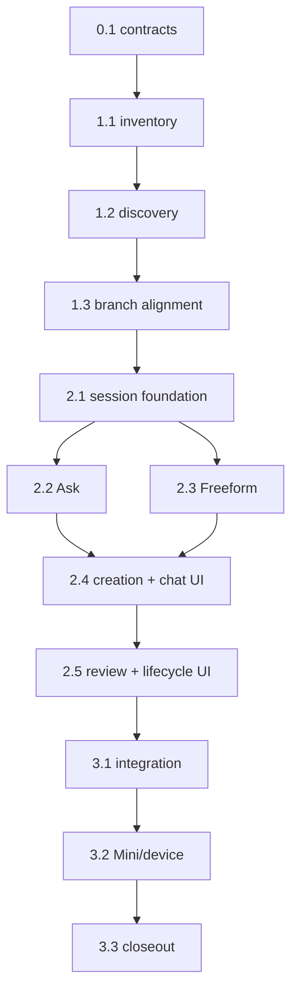

```text
Parent: /strategy/relay-master-plan
Track: B, E, H, I, J
Needs Mini: no for injected implementation; yes for live multi-agent and physical-phone acceptance
Blocked by: H, I, J and child #7 Phase 1
```

## How to use this document

This is **Relay child plan #13**. It corrects two limitations in the established planning workspace:

1. Work is feature-scoped and may cross mobile, web/API, backend, Relay, and documentation repositories. Selecting one product is an initial context hint, not a repository boundary.
2. Not every interaction warrants a phased plan. Relay needs **Ask**, **Plan**, and **Freeform** on the same multi-agent conversation surface.

Child #7 Phase 1 supplies vendor-neutral Cursor/Claude/Codex execution and interaction adapters. This child consumes that contract; it does not reimplement vendor CLIs. Read the [master plan](/strategy/relay-master-plan), [planning child #10](/strategy/relay-planning-workspace-plan), [checkpoint child #11](/strategy/relay-checkpoint-steering-plan), [workspace child #12](/strategy/relay-workspace-process-plan), and [post-core child #7](/strategy/relay-post-core-integrations-plan).

Work tasks **in order**. Feature-workspace foundations precede modes because Ask, Plan, and Freeform need one honest read/write repository-scope model.

<Warning>
**Hard boundary:** Ask is always read-only. Plan remains read-only until an accepted revision is kicked off. Freeform removes plan/revision/phase/gate ceremony, but not Relay's machine-safety invariants: Relay aligns a dedicated branch before writes, owns the worker lock, persists transcript/diff/process identity, forbids agent branch switching and unattended push/merge, protects secrets, and recovers without duplicating a mutating turn. No client-supplied path, executable, argv, environment value, or raw shell endpoint.
</Warning>

### Before you start (required)

1. Read this How-to, [Mode contract](#mode-contract), [Feature workspace](#feature-workspace-contract), [Engineering conventions](#engineering-conventions-required), [Decision log](#decision-log), and ledger.
2. Inspect current `PlanDraft`, planning/checkpoint conversation, repository inventory/status, runner/VC/mutex/store, API, and phone composer/navigation as built.
3. Inspect child #7's actual shared interactive adapter/recovery contract; planned names may have changed.
4. Preserve existing `/drafts`, run, and checkpoint clients while adding the mode-neutral model additively.
5. Keep tests offline through injected agents, repository discovery, VC/Git/Meridian, filesystem, mutex, process, preview, and clock.
6. Stop for explicit authorization before live agent calls, Mini configuration, or physical-phone acceptance.

### Agent completion

<Warning>
When a task finishes, pauses, or blocks, update this file in the same PR. A task is not done while its **Implementation notes** remain `_None yet._`. Update the parent when this child becomes `done` or `blocked`.
</Warning>

Update the ledger, checked evidence, **As built**, Decision log if needed, and [Handoff log](#handoff-log) in the same change.

---

## Overall context

### Mode contract

| Mode | Purpose | Repository access | Branch and capacity | Plan ceremony |
| --- | --- | --- | --- | --- |
| **Ask** | Repo-aware questions, investigation, explanation, follow-ups | Read-only across the configured feature workspace | No branch; read-only planning capacity, not worker lock | None |
| **Plan** | Larger work needing explicit scope, steps, verification, and gates | Read-only while planning; accepted writable scope at kickoff | Relay aligns accepted repository set when run starts | Existing revisions/phases/gates |
| **Freeform** | Quick fixes and small features in a persistent remote-agent session | Reads broadly; writes immediately in approved writable set | Dedicated aligned branch; owns worker lock | None; messages may change files immediately |

All modes use one phone conversation surface and the same Cursor/Claude/Codex agent/account selection, attachments, safe activity, transcript persistence, abort, and recovered-session labeling. Optional vendor telemetry may be unavailable; core mode interaction may not be.

Ask and Plan are distinct though both start read-only: Ask answers and never proposes executable revisions unless the user starts a **new linked Plan**. Plan retains immutable revisions and explicit acceptance.

Freeform is unstructured, not a remote shell. Natural-language messages reach the selected agent with its normal workspace tools, but the client never submits commands. Changes are live on the session branch—there is no **Accept changes** gate. The branch, baselines, durable transcript, per-repository diff/commits, worker ownership, and no-push/no-merge boundary provide review and rollback.

### Feature workspace contract

Creation asks for a goal first and may accept a **starting area** such as Just Go, Campus, Meridian Web, Meridian Backend, Relay, or Documentation. It ranks initial context only; it does not prevent reading other configured repositories or grant writes.

Every durable session records:

| Field | Meaning |
| --- | --- |
| `startingArea` | Optional context hint; never a hard repository boundary |
| `readableRepositoryIds` | Machine-configured repositories the mode may inspect; never client paths |
| `writableRepositories` | Explicit repository IDs with reason, decision, and alignment state |
| `branch` | One feature/session branch slug across all writable repositories |
| `baselines` | Per-repository HEAD, dirty/ownership state, and aligned branch captured before writes |
| `scopeHistory` | Durable proposed/accepted/rejected repository changes and reasons |

Plan scope changes are part of a structured revision and remain inert until accepted. Kickoff shows the final repository/branch matrix.

Freeform starts with a confirmed writable set. If another configured repository must change, Relay parks **before mutation**, shows repository and reason, and asks once to add it. Approval captures its baseline and aligns the shared branch before continuing. This is workspace authorization, not a plan revision or phase gate.

Ask may inspect the readable set without a branch. During active work it labels answers as a changing snapshot. **Start a Plan** and **Open as Freeform** create new linked sessions with explicit scope/branch confirmation; Ask never elevates in place.

### What we are not building

- General web chatbot, RAG/memory OS, terminal/SSH replacement, or arbitrary command form
- Treating starting area as proof that only one repository is affected
- Silent writable-scope expansion or raw client filesystem paths
- Plan revisions/checkpoint gates in Freeform, or writes/branches/worker ownership in Ask
- In-place elevation of a read-only session
- Agent checkout/switch/pull, automatic push/merge/ship, or cross-Mini session migration
- Concurrent Freeform/run/checkpoint/job mutation
- Separate Cursor-only modes or vendor-specific phone UI
- Laptop conversational UI in this child; API remains client-neutral

---

## Engineering conventions (required)

| Concern | Rule |
| --- | --- |
| Repository identity | Stable configured IDs from child #12; clients never send paths |
| Starting area | Optional context-ranking hint; never restricts reads or grants writes |
| Writable scope | Explicit durable repository IDs with reasons, baseline, decision, and alignment |
| Multi-repo VC | One branch slug; Meridian CLI for Meridian + Events, existing Git wrapper for siblings; fail closed on partial alignment |
| Dirty work | Never overwrite/stash/reset unrelated changes; return repository-specific conflict |
| Agents | Cursor, Claude, and Codex implement identical modes through child #7's adapter |
| Ask capacity | Existing one-at-a-time read-only planning response capacity; no worker lock |
| Freeform capacity | Owns worker mutex/preview like run or checkpoint; blocks jobs/manual starts |
| Freeform writes | Start only after alignment; subsequent turns mutate live without acceptance ceremony |
| Mode transition | New linked session with sanitized context; never change `mode` or permissions in place |
| Recovery | Recreate from transcript/scope/baselines when native resume is absent; never replay a completed mutating turn |
| Output | Safe activity plus per-repo files/diff/commits/tests; no secrets/private roots |
| Tests | Inject everything external; no live vendor, Mini, or network calls in automation |

---

## Decision log

| Date | Decision |
| --- | --- |
| 2026-08-24 | Create child #13 rather than expand combined child #7. Child #7 supplies adapters; #13 owns mode/scope state, API, and UI. |
| 2026-08-24 | Primary interaction modes are Ask, Plan, and Freeform on one conversation surface. |
| 2026-08-24 | “Pick one system” becomes optional `startingArea`; the durable unit is a feature workspace with separate readable/writable sets. |
| 2026-08-24 | Ask is permanently read-only and creates no branch or worker ownership. |
| 2026-08-24 | Plan preserves explicit revision acceptance and aligns accepted multi-repo scope only at kickoff. |
| 2026-08-24 | Freeform removes plan ceremony and applies work immediately on a dedicated aligned branch while retaining VC/worker/secret/recovery invariants. |
| 2026-08-24 | Writable-scope expansion is explicit and happens before mutation; it is not a plan gate. |
| 2026-08-24 | Ask-to-Plan/Freeform creates a new linked session; capability is never elevated in place. |
| 2026-08-24 | Conversational UI remains phone-first; no vendor-specific UI or laptop planning chat. |

---

## Task status ledger

| Task | Status | Notes |
| --- | --- | --- |
| 0.1 | pending | Confirm feature-workspace and three-mode contracts; no code/live mutation |
| 1.1 | pending | Configured feature-workspace inventory and scope types |
| 1.2 | pending | Cross-repo scope discovery, proposal, and Plan revision integration |
| 1.3 | pending | Multi-repo baseline and branch alignment |
| 2.1 | pending | Additive durable interaction-session model/API foundation |
| 2.2 | pending | Ask service/API and safe linked transitions |
| 2.3 | pending | Freeform worker lifecycle and scope expansion |
| 2.4 | pending | Phone Ask/Plan/Freeform creation and conversation UI |
| 2.5 | pending | Per-repo Freeform review, continuation, stop, and close UI |
| 3.1 | pending | Offline mode/scope/restart/concurrency/security matrix |
| 3.2 | pending | Separately authorized Mini/physical-phone acceptance and rollback |
| 3.3 | pending | Audit, parent closeout, and handoff |

## Execution order



---

## Phase 0 — Contract

### Task 0.1 — Confirm feature-workspace and mode contracts

**Status:** `pending`

**Instructions:**

1. Lock mode/read/write/Freeform-invariant decisions and name exact inventory, draft, conversation, adapter, runner/VC/mutex/store, API, phone, preview, and test seams.
2. Define additive schemas/state transitions for feature scope and `ask | plan | freeform`, including migration of existing drafts/runs.
3. Define repository-family defaults and how `startingArea` ranks context without restricting reads or granting writes.
4. Define branch/baseline/partial-alignment, dirty work, scope expansion, stop/close, and native-or-replayed recovery behavior.
5. Make no code, branch, live agent, Mini, or device mutation.

**Evaluation criteria:**

- [ ] Mode capacity, mutation, branch, ceremony, and recovery differences are explicit
- [ ] Starting area is a hint; readable/writable scopes are distinct
- [ ] Exact seams and compatibility rules are named
- [ ] No code or live mutation occurred

**Implementation notes:**

_None yet._

---

## Phase 1 — Feature workspace foundation

### Task 1.1 — Add configured inventory and scope types

**Status:** `pending`

**Instructions:**

1. Reuse child #12 configured repository IDs/roots/status; accept no client paths.
2. Add starting-area families that rank context while retaining configured readable scope.
3. Add versioned feature scope, writable-repository reason/status, baseline, and scope-history types/migration.
4. Return safe IDs/labels/capabilities only; test multi-repo families, missing repos, unknown/duplicate IDs, containment, migration, and redaction.

**Evaluation criteria:**

- [ ] Configured identity is reused and paths are never client-controlled
- [ ] Starting area affects priority, not authorization
- [ ] Writable scope/baselines/history are durable
- [ ] Partial inventory and redaction pass offline

**Implementation notes:**

_None yet._

### Task 1.2 — Add cross-repository discovery and Plan integration

**Status:** `pending`

**Instructions:**

1. Pack bounded read-only context across the feature workspace, ranked by starting area and expanded on demand.
2. Let Plan propose configured affected repository IDs with reasons inside its structured revision.
3. Extend semantic revision diff/acceptance so scope changes remain inert until accepted and appear at kickoff.
4. Preserve existing single-product drafts/history through migration/default projection.
5. Test a mobile feature proposing mobile + API + Events, scope accept/reject, missing repo, concurrency, and restart.

**Evaluation criteria:**

- [ ] Cross-repo impact can be inspected and justified
- [ ] Scope is typed, visible, and inert until revision acceptance
- [ ] Existing drafts/runs remain compatible
- [ ] Planning and Ask remain read-only

**Implementation notes:**

_None yet._

### Task 1.3 — Align multi-repository baselines and branches

**Status:** `pending`

**Instructions:**

1. Extend runner/VC orchestration to one writable repository set and safe shared branch slug.
2. Capture per-repo HEAD/branch/dirty/ownership baseline; preserve unrelated dirty work and return precise conflicts.
3. Use Meridian CLI for Meridian + Events and the existing Git wrapper for siblings. Agents never change branches.
4. Persist/reconcile partial alignment. Start no editor until every writable repo is aligned and owned.
5. Support later Freeform expansion by parking, baselining, aligning the same branch, then refreshing context.

**Evaluation criteria:**

- [ ] One branch/baseline covers every writable repository
- [ ] Partial alignment/restart cannot create mixed-branch editing
- [ ] Unrelated work is preserved
- [ ] Expanded scope aligns before writes

**Implementation notes:**

_None yet._

---

## Phase 2 — Interaction modes and phone

### Task 2.1 — Add durable interaction-session foundation

**Status:** `pending`

**Instructions:**

1. Add an additive durable session projection: mode, machine, starting area, feature scope, agent/account, attachments, transcript/activity, usage, state, linkage, and recovery.
2. Preserve existing draft/run/checkpoint APIs/records; project them rather than flag-day rewriting.
3. Add authenticated create/read/list/message/stop/close/scope-decision services with idempotency and structured conflicts; lock route names in Task 0.1.
4. Route all agents through child #7 and enforce mode capabilities server-side.

**Evaluation criteria:**

- [ ] Session state is mode-neutral and backward compatible
- [ ] Server distinguishes Ask/Plan/Freeform capability
- [ ] Retry/conflict/link/recovery/redaction tests pass
- [ ] No vendor-specific bypass exists

**Implementation notes:**

_None yet._

### Task 2.2 — Implement Ask and linked transitions

**Status:** `pending`

**Instructions:**

1. Implement persistent multi-turn Ask with repository search/read tools only.
2. Use planning capacity/memory admission; label changing snapshots during active work.
3. Prove no branch, worker lock, write, commit, preview mutation, or client executable input.
4. **Start a Plan** and **Open as Freeform** create new linked sessions carrying sanitized context after explicit confirmation.
5. Test every agent, follow-ups, denied writes, changing snapshot, restart recovery, link idempotency, and cancellation.

**Evaluation criteria:**

- [ ] Ask answers across configured repos and remains read-only
- [ ] Ask owns no branch/worker and handles memory pressure honestly
- [ ] Every agent passes the same Ask contract
- [ ] Transitions never elevate in place

**Implementation notes:**

_None yet._

### Task 2.3 — Implement Freeform worker and scope expansion

**Status:** `pending`

**Instructions:**

1. Acquire worker lock and align initial writable repo set/branch before the first mutating turn.
2. Give the selected agent normal bounded workspace tools. Add no plan/revision/phase/gate or post-turn acceptance; edits/allowed commits are live.
3. Persist each user turn before execution, started/completed identity, transcript/activity, per-repo diff/commits/tests, usage, preview, and process owner.
4. Park before a new-repo mutation; persist ID/reason, accept/reject once, align/baseline on approval, then resume with refreshed context.
5. Stop aborts owned agent and preserves partial branch state. Restart never repeats a completed turn or claims process survival. Close never discards/merges.
6. Keep push/merge/ship, agent branch switching, raw shell/client paths/argv/env, and concurrent heavy ownership forbidden.

**Evaluation criteria:**

- [ ] Mutation begins only after alignment/ownership
- [ ] Messages apply directly without plan ceremony
- [ ] Scope expansion is explicit and precedes mutation
- [ ] Stop/restart/failure preserves reviewable state without duplicates
- [ ] Every agent passes the same Freeform contract

**Implementation notes:**

_None yet._

### Task 2.4 — Build phone mode creation and conversation UI

**Status:** `pending`

**Instructions:**

1. Replace single-system creation gate with mode, goal/composer, optional starting area, agent/account, attachments, and affected-systems scope card.
2. Explain **Ask · Plan · Freeform** consequences: read-only/no branch; revisions before run; immediate branch writes/no gates.
3. Reuse one chat-first transcript/composer/activity UI and preserve selected machine/session/mode/agent/scope through navigation, polling, deep links, and notifications.
4. Plan uses revision acceptance; Freeform confirms initial/later writable scope; Ask shows read-only context.
5. Linked actions create new sessions. Freeform keeps a persistent warning that messages may immediately change files.
6. Test accessibility, small screens, keyboard, recovered/error states, machines, and all agents with mocked APIs.

**Evaluation criteria:**

- [ ] Creation is goal-first and starting area is optional
- [ ] Mode consequences/write timing are unmistakable
- [ ] One UI supports every agent
- [ ] Scope and links are machine-aware and accessible

**Implementation notes:**

_None yet._

### Task 2.5 — Add Freeform review and lifecycle UI

**Status:** `pending`

**Instructions:**

1. Show state, branch, agent/account, preview, usage, tests, and per-repo files/diff/commits beneath conversation without an acceptance gate.
2. Provide follow-up, stop, recover/resume, close, and preview. Explain that stop/close leaves branch changes and never merges/discards.
3. Show inline scope requests with repo/reason/conflict and explicit Add/Reject.
4. Bound/redact large diffs/logs while preserving authenticated server artifacts.
5. Test dirty/committed/multi-repo, stopped/recoverable/failed/closed, preview, partial patch, and rejected scope.

**Evaluation criteria:**

- [ ] Review is per repository and not Accept/Discard
- [ ] Lifecycle matches durable state
- [ ] Scope requests/conflicts are actionable
- [ ] Large/private output is bounded/redacted

**Implementation notes:**

_None yet._

---

## Phase 3 — Acceptance and closeout

### Task 3.1 — Verify offline integration and boundaries

**Status:** `pending`

**Instructions:**

1. Run injected Ask across mobile/API/backend with follow-up, changing snapshot, denied mutation, recovery, and linked sessions.
2. Run Plan discovering/accepting three repositories, aligning one branch, executing/restarting, and preserving baselines.
3. Run Freeform quick fix/follow-up/new-repo approval/tests/commit/stop/recovery/close across all agent fixtures.
4. Prove planning versus worker capacity, Freeform/run/checkpoint/job/manual conflicts, memory pressure, and no duplicate agent/preview.
5. Run Relay/web/mobile suites and scan for arbitrary paths/commands, Ask writes, silent scope, in-place elevation, checkout/push/merge, secrets, vendor UI, or Freeform plan ceremony.

**Evaluation criteria:**

- [ ] Mode/feature-workspace scenarios pass
- [ ] Every agent passes identical mode contracts
- [ ] Restart/branch/scope/ownership/memory/process invariants pass
- [ ] Existing drafts/runs/checkpoints remain green
- [ ] Boundary scans pass

**Implementation notes:**

_None yet._

### Task 3.2 — Run separately authorized Mini/phone acceptance

**Status:** `pending`

**Instructions:**

1. Stop for explicit authorization; back up private data/config and record repos/ports/owner/rollback without secrets.
2. Verify physical-phone Ask across repos creates no branch/write/worker and labels changing state.
3. Verify controlled Plan discovers/aligns a multi-repo fixture without touching unrelated work.
4. Verify bounded Freeform branch, small change/follow-up, one repo expansion before write, Relay restart, and per-repo review.
5. Use configured real agents only if separately authorized/bounded; fake/injected proof remains deterministic baseline.
6. Stop/close, restore original branches/config/process ownership, and prove no push/merge/unrelated mutation.

**Evaluation criteria:**

- [ ] Physical modes match their read/write/branch contracts
- [ ] Multi-repo discovery/expansion/recovery pass
- [ ] Any live agents were authorized/bounded
- [ ] Mini rollback passes cleanly

**Implementation notes:**

_None yet._

### Task 3.3 — Audit and close child #13

**Status:** `pending`

**Instructions:**

1. Audit tasks, evidence, As built, decisions, tests, acceptance, and rollback.
2. Confirm no raw shell/client path/argv/env, Ask mutation, silent scope, in-place elevation, push/merge, vendor UI, laptop planning chat, or unrelated work.
3. Update parent ledger/docs with `doneAt` and exact implementation/live-agent boundary.
4. Append final handoff with commits, migrations, acceptance, and rollback.

**Evaluation criteria:**

- [ ] Completed tasks have evidence/As built
- [ ] Parent/child decisions agree
- [ ] Compatibility and scope audit pass
- [ ] Handoff separates offline from live acceptance

**Implementation notes:**

_None yet._

---

## Handoff log

| Date | Task | Result | Next |
| --- | --- | --- | --- |
| 2026-08-24 | Plan creation | Created child #13 for Ask/Plan/Freeform and feature-scoped multi-repository work. Child #7 remains adapter prerequisite; no product code, branch, live agent, Mini, or device mutation. | Execute Task 0.1 only. |
