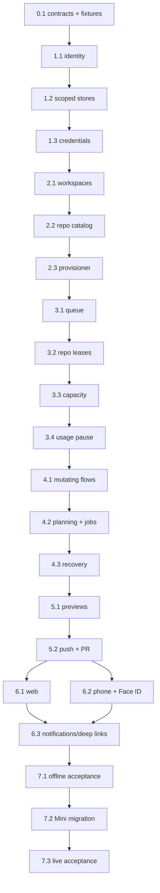

```text
Parent: /strategy/relay-master-plan
Track: K
Needs Mini: no for Phases 0–6; yes for Phase 7 migration, capacity tuning, and device acceptance
Blocked by: child #13 and the existing runner, workspace, preview, PR, web, and phone contracts
```

## How to use this document

This is **Relay child plan #14**. It replaces the original one-workspace/one-heavy-owner assumption with a bounded two-user control plane on one 16 GB Mac Mini.

Work through the phases in order. Do not start by weakening `run.lock`, adding parallel `Promise` calls, or cloning repositories directly from a request handler. Identity and durable workspace ownership come first; repository provisioning comes second; leases and admission come third; existing execution paths move onto that foundation only after it is recoverable.

Read the [master plan](/strategy/relay-master-plan), [interaction modes child #13](/strategy/relay-interaction-modes-plan), [workspace/process child #12](/strategy/relay-workspace-process-plan), [Mini child #6](/strategy/relay-mini-ops-plan), and [post-core child #7](/strategy/relay-post-core-integrations-plan) before implementation.

<Warning>
**Hard boundaries:** This is operational isolation, not a hostile-user security boundary. Both users run under one trusted macOS account, but never share working copies, Relay records, vendor sessions, GitHub credentials, or preview ownership. The browser and phone never submit a filesystem path, executable, environment value, setup command, Git refspec, or shell command. Relay may push only its validated feature branch and may open or update a pull request; it must not expose merge, force-push, protected-branch push, or arbitrary Git operations.
</Warning>

### Agent completion

When a task finishes, pauses, or blocks, update this plan in the same change:

1. Update the task ledger and task heading.
2. Check only evaluation criteria actually verified.
3. Replace `_None yet._` with an **As built** table naming files, exports, decisions, tests, and follow-up.
4. Append a dated entry to the handoff log.
5. Update the parent ledger when this child becomes `in_progress`, `blocked`, or `done`.
6. Stop before every manual gate. Automated tests never use live GitHub, vendor accounts, the Mini, Tailscale, Face ID, or a physical phone.

---

## Confirmed product contract

| Concern | Decision |
| --- | --- |
| Initial scale | Two trusted users through at least the end of 2026 |
| Isolation | Separate working copies and private app records; not an OS security boundary |
| Workspace lifetime | One persistent workspace bundle per user |
| Repository catalog | Each user adds/removes interested repositories dynamically through Relay UI |
| Accepted remotes | GitHub URLs only; HTTPS and SCP-style SSH input normalize to a canonical GitHub repository identity |
| Starting point | Repository default is configurable; every mutating task resolves and persists an exact starting commit |
| Lock scope | Exclusive `(workspaceId, repositoryId)` leases; two users may concurrently use separate clones of the same logical repository |
| Multi-repository work | Acquire the complete sorted repository set atomically or wait without holding a partial set |
| Queue | Durable FIFO, reorderable by either trusted user, with starvation-safe sequence numbers |
| Capacity | Bounded machine admission independent from repository leases; initial production cap is two ordinary execution slots |
| Gates | A parked run retains repository leases but releases compute capacity |
| Usage pause | After a completed step, pause before the next step when that account's five-hour window has less than 10% remaining; poll until it recovers |
| Preview | Per active task, with a persisted port lease and workspace-bound process supervisor |
| Jobs | Globally visible and queued; consume machine capacity but do not belong to a user workspace |
| Credentials | Individual Relay, GitHub, Cursor, Claude, and Codex credentials |
| Git delivery | Push Relay feature branches and open/update PRs; no merge, force push, or direct protected-branch push |
| Authentication | Individual Relay identities, no role hierarchy, low-friction device enrollment |
| Phone lock | Face ID/device passcode on cold launch and after six hours; no prompt per screen or request |
| Failure | Retry incomplete provisioning; preserve and quarantine any workspace with dirty or unpushed work |

### Lock semantics by interaction

| Interaction | Repository lease | Capacity lease |
| --- | --- | --- |
| Ask | None; read-only snapshot | One lightweight planning unit while responding |
| Plan before repository scope is confirmed | None | One lightweight planning unit while responding |
| Plan after the user confirms intended repositories | Exclusive repository set until closed or handed to its run | Only while an agent response is running |
| Freeform | Exclusive writable repository set for the live workstream | While a mutating turn or preview is running |
| Run | Exclusive writable repository set for the full run, including approval and usage-reset waits | While aligning, executing, verifying, committing, or serving its preview; released during a usage-reset wait |
| Checkpoint edit | Reuses its run's repository leases | While the checkpoint agent/verification is active |
| Global job | No user repository lease | Weighted job capacity while running |

Repository leases protect working copies. Capacity leases protect the Mini. They are deliberately separate.

---

## Target architecture

```text
Phone / Web
    │ individual device session
    ▼
Relay API
    ├── identity + device sessions
    ├── principal-scoped stores and projections
    ├── workspace/repository registry
    ├── durable FIFO + reorder operations
    ├── atomic repository lease manager
    ├── weighted capacity admission
    ├── per-account five-hour usage monitor
    └── preview/port registry
             │
       ┌─────┴─────┐
       ▼           ▼
 user A workspace  user B workspace
 independent repos independent repos
 independent auth  independent auth
       │           │
       └──── global jobs/runtime checkout
```

Keep one Relay API process and its existing file-based persistence style. At this scale, do not add Redis, Temporal, Docker, a database server, or a second public control plane. Serialize mutations through injected coordinators and persist versioned JSON with atomic rename. Filesystem `open(..., "wx")` remains the final cross-process exclusion primitive for repository and port lease files.

### Data layout

```text
RELAY_DATA/
  control/
    principals.json
    device-sessions.json
    queue.json
    capacity.json
    jobs/...
  workspaces/<workspaceId>/
    workspace.json
    repositories.json
    leases/<repositoryId>.lock
    state/
      drafts/...
      sessions/...
      runs/...
      workstreams/...
      notifications/...
      usage.json
    credentials/
      accounts.json
      github.json
      vendor-auth/...
    previews/
      ports.json
      <taskId>.json

RELAY_WORKSPACES_ROOT/
  <workspaceId>/
    repos/<repositoryDirectory>/
    provisioning/<operationId>/
    quarantine/...
```

All public records use opaque IDs and repository labels. Absolute paths, credential locations, raw remotes containing credentials, mutex paths, and provisioning paths stay private.

### Core records

`PrincipalRecord` contains `id`, display name, status, timestamps, and no secret token. `DeviceSessionRecord` contains the principal, token hash, device label/platform, expiry/revocation, and last use. Tokens are high-entropy, displayed once, stored hashed, and compared in constant time.

`WorkspaceRecord` contains `id`, `principalId`, root identity, state (`provisioning | ready | degraded | rebuilding | quarantined`), repository IDs, configured capacity/preview defaults, and timestamps.

`WorkspaceRepositoryRecord` contains a stable ID, canonical GitHub identity, display label, relative directory, configured base ref, resolved base commit, provisioning state/attempt, and safe error summary.

`QueueRecord` contains a globally unique task reference, principal/workspace, requested repository IDs, resource class/weight, monotonic FIFO sequence, optional user-adjusted position, state, retry count, and timestamps. Queue reorder is an audited mutation that never rewrites task creation time.

`RepositoryLeaseRecord` contains workspace/repository/task identity, lease state, acquisition time, last reconciliation, and reason. There is no automatic approval-gate timeout. Recovery may retain, restore, or explicitly mark a lease conflicted; it never silently steals one from a nonterminal task.

`CapacityLeaseRecord` contains task identity, resource class, units, preview ports, and heartbeat. Capacity may be released and reacquired without releasing repository leases.

`UsageSnapshotRecord` contains principal/account identity, provider, five-hour window duration, used and remaining percentages, reset time, observation time, source, and status (`fresh | stale | unknown | error`). A run waiting on usage stores the triggering snapshot, completed step, next step, poll schedule, and resume observation. Raw provider responses and credentials are not persisted.

### Resource classes

Use configuration, not hardcoded machine guesses:

| Class | Initial units | Notes |
| --- | ---: | --- |
| `planning` | 1 | Ask/Plan response; may coexist when memory policy permits |
| `agent` | 1 | Freeform/run/checkpoint without preview |
| `agent-web` | 2 | Agent plus one web preview |
| `agent-expo` | 2 | Agent plus Metro preview |
| `job` | 2 | Discovery/refresh/export default; per-kind override allowed in machine config |

Start the Mini with two total units, then raise only after Phase 7 records healthy memory and swap behavior for the desired two-user combinations. Architecture must support two concurrent previews even if the initial production policy admits one preview-heavy task at a time.

---

## Engineering rules

| Concern | Rule |
| --- | --- |
| Compatibility | The current workspace becomes the first principal's persistent workspace. Existing IDs and history remain readable during migration. |
| Ownership | Every draft, session, run, workstream, attachment, notification, and requester-owned job stores `principalId`; every mutating task stores `workspaceId`. |
| Public queries | Filter by authenticated principal before lookup/projection. Knowing another record's UUID never grants access. Global jobs are the explicit exception. |
| Repository URLs | Accept only configured GitHub hosts. Normalize HTTPS/SSH forms, strip credentials, reject query/fragment, local/file URLs, redirects to another host, and duplicate canonical identities. |
| Clone/fetch | Spawn `git` with argv arrays and controlled credential injection. Never interpolate a URL/ref into a shell command. |
| Agent credentials | Do not place GitHub credentials in the long-lived Relay environment or general agent child environment. Inject them only into narrow clone/fetch/push/PR operations. |
| Provisioning | Clone into a unique incomplete directory, validate Git identity/HEAD/containment, then atomically rename. Retry only incomplete clean state. |
| Setup | UI may choose a server-configured bootstrap profile. It may not submit install commands or lifecycle scripts. |
| Leases | Acquire a sorted repository set atomically. On any conflict, acquire none and enqueue. |
| Queue | Persist before dispatch. A request accepted into the queue returns `202`, not a mutex conflict. |
| Recovery | Reconcile records, lease files, process identity, Git state, and queue before dispatching new work. |
| Usage boundary | Persist step completion before checking usage. When the selected account's fresh 300-minute window is below 10% remaining and another executable step remains, enter `waiting-for-usage-reset`; never interrupt an active step. At a phase approval gate, keep the gate and recheck before starting the next phase. |
| Usage polling | Poll through the account adapter without invoking an agent. Prefer the reported reset time, with a bounded five-minute heartbeat and jitter. Resume only when the same account's five-hour remaining value is at least 10%. |
| Usage uncertainty | `unknown`, stale, or failed usage probes are visible warnings and do not manufacture a reset or pause forever. Weekly or other windows remain informational and never control this policy. |
| Preview | Every preview has exact task/workspace ownership and an allocated port set. Stop never targets an unverified PID or another task's ports. |
| Git branch | Create a Relay-controlled feature branch from a resolved full commit SHA. Persist branch and SHA before mutation. |
| Push | Relay constructs the only permitted refspec. Reject protected names, unexpected upstreams, force flags, and commits not descended from the recorded start unless explicitly supported later. |
| Pull request | Open/update only for the pushed Relay branch. Remove merge controls from API and clients. |
| Face ID | Local application unlock protects access to the stored phone device token. It does not replace server authentication. |
| Tests | Inject Git, clocks, memory, spawn, filesystem roots, token generator, biometric adapter, and network clients. Automated tests stay offline. |

---

## Decision log

| Date | Decision |
| --- | --- |
| 2026-09-14 | Replace one-heavy-owner-per-Mini with repository-scoped workspace leases plus separate bounded machine admission. |
| 2026-09-14 | Use one persistent workspace bundle per user. Two users have independent clones and may work on the same logical GitHub repository concurrently. |
| 2026-09-14 | Retain one trusted macOS account; this is working-copy and application-record isolation, not a hostile-user filesystem boundary. |
| 2026-09-14 | Use one Relay API and versioned file stores; do not introduce an external queue/database service for the initial two-user deployment. |
| 2026-09-14 | Repository additions accept configured GitHub hosts only and happen asynchronously through a durable provisioner. |
| 2026-09-14 | FIFO ordering is user-adjustable and audited. Repository acquisition is atomic; capacity is weighted and independently releasable. |
| 2026-09-14 | Approval gates retain repositories indefinitely but release compute capacity. |
| 2026-09-14 | Global jobs share the capacity scheduler and global visibility but do not use a user's repository clones. |
| 2026-09-14 | GitHub credentials remain outside agent environments. Relay alone performs validated feature-branch push and PR operations; merge is removed. |
| 2026-09-14 | Phone enrollment stores an individual device token in SecureStore and gates cold/expired access with Face ID or device passcode for a six-hour local unlock window. |
| 2026-09-14 | Runs may pause only between completed steps when the selected account's five-hour usage has less than 10% remaining. They retain repository leases, release agent capacity, poll without model calls, and resume the next step after that five-hour bucket recovers to at least 10%. |
| 2026-09-14 | The first principal created is the durable legacy-bearer owner. Pairing codes use 18 random bytes with a ten-minute default/one-hour maximum; device tokens use 32 random bytes and expire after 90 days. Both are shown once, stored only as SHA-256 digests, and compared with constant-time primitives. |

---

## Task status ledger

| Task | Status | Notes |
| --- | --- | --- |
| 0.1 | done | 2026-09-14: v1 records/projections, lease invariants, staged flags, deterministic legacy-owner fixture, and rollback contract |
| 1.1 | done | 2026-09-14: principal CLI, one-time pairing, hashed device sessions, PrincipalContext middleware, `/me`, scoped list/revoke |
| 1.2 | done | 2026-09-14: scoped private stores/routes, global job requester audit, verified idempotent first-owner adoption |
| 1.3 | done | 2026-09-14: principal account/login roots, scoped resolution/revocation, hidden-input GitHub enrollment/status, narrow Git broker, agent secret stripping |
| 2.1 | done | 2026-09-14: durable principal-derived workspace registry, legacy-root adoption, containment, and closed duplicate-root detection |
| 2.2 | done | 2026-09-14: allowlisted GitHub normalization, private catalog, async create/retry/inspect/remove-preview API |
| 2.3 | done | 2026-09-14: recoverable bounded provisioner, configured bootstrap profiles, startup reconciliation, and clean-only rebuild/quarantine |
| 3.1 | done | 2026-09-14: durable FIFO store, revision-checked reorder API, dispatcher contract, and multi-workspace run enqueue |
| 3.2 | done | 2026-09-14: atomic repository-set lease manager, wx lock files, recovery, and multi-workspace run dispatch |
| 3.3 | done | 2026-09-14: weighted capacity coordinator, memory-pressure admission, park/approve release, queue pump, shared job accounting |
| 3.4 | done | 2026-09-14: five-hour usage snapshots, `waiting-for-usage-reset`, step-boundary pause/resume, capacity release with lease retention |
| 4.1 | done | 2026-09-14: record-bound workspace execution, Freeform/run/checkpoint/workstream leases, concurrent disjoint users |
| 4.2 | done | 2026-09-14: Ask/Plan on shared queue+capacity; confirmed Plan repo leases; global jobs without user clones |
| 4.3 | done | 2026-09-14: ordered control-plane recovery, lease-safe interrupt, retry cap, no completed-job replay |
| 5.1 | done | 2026-09-14: per-task/workspace preview registry, atomic port leases, `{port}` substitution, safe stop/recover |
| 5.2 | done | 2026-09-14: validated `relay/*` push/PR with confirm; merge removed; clone pre-push hook |
| 6.1 | done | 2026-09-14: web pairing cookie, workspace/queue/catalog UI, usage-wait, preview/PR; no Vite bearer
| 6.2 | done | 2026-09-14: phone pairing, Keychain + Face ID six-hour gate, no Expo public bearer, usage-wait |
| 6.3 | done | 2026-09-14: principal/device-session push + Live Activity binding, job opt-in, Face ID + ownership-checked deep links |
| 7.1 | done | 2026-09-14: two-principal offline harness, migration rehearsal, and cross-surface acceptance |
| 7.2 | blocked | 2026-09-14: operator backup/export/runbook landed; Mini SSH host key and live enrollment remain |
| 7.3 | blocked | 2026-09-14: blocked on 7.2 Mini SSH/enrollment; no live two-user/Face ID/rollback drill |

## Correct implementation order



Do not parallelize Phases 1–4 across schema boundaries. Web and phone UI work may proceed in parallel only after Task 5.2 freezes their API. The Mini is not mutated until every offline migration, lease, queue, process, and auth test in Task 7.1 passes.

---

## Phase 0 — Freeze the migration contract

### Task 0.1 — Versioned schemas, invariants, and fixtures

**Status:** `done`

Define exact versions and validators for principals, device sessions, workspaces, repositories, queue items, repository leases, capacity leases, preview port leases, and migrated owner fields. Add a fixture representing the current single-user data layout and golden migrated output.

Feature flags:

- `RELAY_MULTI_WORKSPACE=false` keeps legacy single-workspace dispatch before migration.
- `RELAY_AUTH_MODE=legacy-bearer | individual` permits staged identity rollout.
- `RELAY_MAX_CAPACITY_UNITS`, initially `2`.
- `RELAY_PREVIEW_PORT_RANGE`, explicit and bounded.
- `RELAY_GITHUB_HOSTS`, default `github.com`.
- `RELAY_ENABLE_PUSH_PR=false` until GitHub protections pass live acceptance.

Specify forward-only record upgrades with a dry-run report and backup requirement. Rollback before Phase 4 may return to legacy dispatch. After new multi-workspace tasks are created, rollback means stopping admission and running the documented compatibility exporter; it must not point the legacy runtime at two workspaces.

**Evaluation criteria:**

- [x] Every record has a version, strict validator, and private/public projection
- [x] Ownership and global-job exceptions are explicit
- [x] Repository/capacity lease invariants are executable tests
- [x] Current data migrates deterministically in an offline fixture
- [x] Feature flags and rollback boundaries are documented

**As built:**

| Concern | Files / exports / decisions / tests / follow-up |
| --- | --- |
| Versioned records | `relay/src/multi-workspace/contracts.ts` freezes v1 principal, device-session, workspace, workspace-repository, queue, repository-lease, capacity-lease, preview-port-lease, and migrated-owner records. Each record has an exact-key throwing validator, boolean type guard, and public projection. |
| Ownership | `QueueRecordV1` and `MigratedOwnerFieldsV1` encode principal ownership explicitly. Only `job` may use `global-job`; global jobs have null principal/workspace and request no repositories. Private projections remove device token hashes, workspace root identity, canonical repository/directory/provisioning operation identity, and preview process identity. |
| Lease invariants | `relay/src/multi-workspace/invariants.ts` exports pure all-or-none sorted repository-set preflight plus repository and capacity invariant assertions. Active repository ownership is unique per `(workspaceId, repositoryId)` while separate workspaces may own clones of the same logical repository. Capacity is independently bounded and rejects duplicate task and port ownership. |
| Feature flags | `relay/src/multi-workspace/config.ts` strictly parses all six rollout variables. Defaults remain legacy dispatch, legacy bearer, two capacity units, ports `19000-19049`, `github.com`, and push/PR disabled. The package exports the additive contract as `relay/multi-workspace`; no runtime dispatch changed. |
| Migration fixture | `relay/src/multi-workspace/migration.ts` defines a forward-only v0→v1 deterministic owner migration/dry-run report. `apply` requires a verified backup receipt. `relay/fixtures/multi-workspace/legacy-single-workspace.v0.json` represents current draft/session/run/workstream/attachment/notification/job history; its v1 golden file preserves IDs, record contents and existing schema versions, adds direct ownership fields, and marks the existing job global. Filesystem adoption remains Task 1.2. |
| Rollback | `relay/docs/multi-workspace-migration.md` documents flags, privacy, backup/dry-run rules, and the hard pre-/post-Phase-4 rollback boundary. After multi-workspace work exists, the legacy runtime may target only the original first-user workspace via a later compatibility export. |
| Verification | `cd relay && npm test` — 122 files / 881 tests passed. `cd relay && npm run build` — TypeScript clean. Offline only; no Mini, live GitHub, vendor, or device action. |

---

## Phase 1 — Establish individual identity before shared access

### Task 1.1 — Principal and device-session authentication

**Status:** `done`

Replace the single bearer comparison with authentication middleware that resolves a `PrincipalContext`. Add CLI-only principal creation/revocation and short-lived, single-use pairing codes. Pairing creates a revocable opaque device session; store only its hash. Add `GET /me`, device-session listing, and self-revocation.

Health stays unauthenticated. Every other route requires a principal in individual mode. No roles are introduced; machine-dangerous controls may remain available to both trusted principals, but every mutation is attributed.

**Evaluation criteria:**

- [x] Tokens are random, shown once, hashed at rest, constant-time compared, expiring/revocable, and never logged
- [x] Pairing codes expire and cannot be replayed
- [x] Legacy bearer maps only to the designated first principal during staged migration
- [x] Requests carry one tested `PrincipalContext`
- [x] Unauthorized record IDs do not reveal existence

**As built:**

| Concern | Files / exports / decisions / tests / follow-up |
| --- | --- |
| Durable identity | `relay/src/identity/store.ts` owns strict v1 `control/principals.json`, `device-sessions.json`, and `pairing-codes.json` stores with serialized mutations, `0700`/`0600` creation, and atomic rename. The first created principal is the immutable legacy owner; principal revocation also revokes its sessions. `relay/identity` exports the injected service and `PrincipalContext`. |
| Secret lifecycle | Production generators use 18 random bytes for pairing codes and 32 for device tokens. Raw values are returned/printed once, only `sha256:` digests persist, comparison uses `timingSafeEqual` across the full candidate set, pairing defaults to ten minutes with a one-hour maximum, and device sessions expire after 90 days. Injected clock/ID/token seams keep tests offline. |
| CLI-only administration | `relay principal create <display-name>`, `relay principal revoke <principal-id>`, and `relay pairing-code create <principal-id> [--ttl-minutes N]` are implemented in `relay/src/cli/identity.ts`. There are no HTTP principal-creation, principal-revocation, or pairing-code-creation routes. |
| API authentication | `relay/src/api/app.ts` resolves authentication before recovery or route lookup. Individual mode accepts only device sessions, stores `PrincipalContext` on Hono context, and attributes request logs by opaque principal ID. Legacy mode uses constant-time bearer comparison and maps only to the stored first principal. The previous no-bearer development/test behavior remains compatible through a synthetic `legacy-owner` context. |
| Enrollment and self-service | `POST /auth/pair` is the individual-mode bootstrap exception. `GET /me`, `GET /device-sessions`, and `POST /device-sessions/:id/revoke` return public projections. Session lookup/revocation filters by principal before returning a result, so cross-principal and unknown IDs both return `404`. |
| Logging and docs | API logs contain method/path/status/principal ID only and tests prove pairing codes and device tokens are absent from logs and stores. `relay/docs/multi-workspace-identity.md` documents operator commands, staged auth, routes, expiry, and privacy. Phase 1.2 still owns principal-scoping existing Relay records. |
| Verification | `cd relay && npm test` — 125 files / 890 tests passed. `cd relay && npm run build` — TypeScript clean. Identity-focused store/API/CLI tests: 9 new tests. Offline only; no Mini, live account, or device enrollment. |

### Task 1.2 — Principal-scoped stores and legacy migration

**Status:** `done`

Add `principalId` and, where mutation is possible, `workspaceId` to drafts, sessions, runs, workstreams, attachments, notifications, Live Activities, and requester metadata on jobs. Route store access through a scoped options object instead of passing a bare global `dataDir`.

Adopt all existing private state into the first principal without changing public IDs. Lists filter before projection; item routes authorize before reading logs, diffs, attachments, checkpoints, or PR data.

**Evaluation criteria:**

- [x] Existing fixture history remains readable by the first principal
- [x] Second principal sees none of the first principal's private records
- [x] Logs, update polling, deep links, notifications, and UUID lookups enforce ownership
- [x] Global jobs remain visible to both and retain requester audit
- [x] Migration is idempotent and never prints private paths or tokens

**As built:**

| Concern | Files / exports / decisions / tests / follow-up |
| --- | --- |
| Scoped ownership | `relay/src/identity/scope.ts` exports `RecordScope`, `ScopedStoreOptions`, deterministic provisional `workspaceIdForPrincipal`, request-local scoping, ownership validation/application, and an explicit trusted maintenance escape hatch. Draft, session, run, workstream/workstream-preview, attachment, notification, and Live Activity records persist direct principal/workspace ownership. Store item loads return not-found for a different owner and list stores filter before public projection. |
| API enforcement | `relay/src/api/app.ts` wraps every authenticated request in its `PrincipalContext` scope. Draft/session polling, run logs/transcripts/diffs/PRs, checkpoint reads and mutations, workstream preview/apply, notification unregister, Live Activity registration, and ordinary UUID lookup all authorize the owning parent before reading or mutating subordinate data. Legacy bearer requests may read pre-adoption unowned records only during staging. Trusted startup recovery deliberately runs machine-wide. |
| Notifications and activities | Notification subscriptions/outbox events and Live Activity subscriptions are owner-scoped. Notification emission derives scope from the persisted run, session, or job requester so restart/recovery cannot attribute delivery to the caller that triggered maintenance. Scoped Live Activity reconciliation merges its owned subset back without dropping another principal's subscriptions. Public subscription projections omit tokens and ownership fields. |
| Global jobs | `JobRecord.requester` records immutable principal/workspace audit metadata while jobs, artifacts, logs, and job routes remain global. Both detail and summary projections retain the opaque requester audit, and legacy jobs acquire it during first-owner adoption or their first staged mutation. Jobs do not gain repository ownership. |
| Filesystem adoption | `relay/src/identity/migration.ts` scans legacy drafts, sessions, runs, jobs, workstreams/previews, notification subscriptions/outbox, and Live Activity subscriptions. `relay principal adopt-legacy <first-principal-id>` defaults to dry-run; `--apply` accepts only the designated first principal, copies and byte-verifies a private backup before atomic state replacement, preserves public IDs/schema versions, and is idempotent. Reports contain opaque IDs/counts only—never record paths or secret material. |
| Documentation | `relay/docs/multi-workspace-identity.md` and `relay/docs/multi-workspace-migration.md` document the scoped model, global-job exception, dry-run/apply sequence, verified backup, and staged legacy behavior. Multi-workspace dispatch, credential isolation, repository clones, and the global mutex remain unchanged for later tasks. |
| Verification | `cd relay && npm test` — 126 files / 896 tests passed. `cd relay && npm run build` — TypeScript clean. New coverage exercises two-principal list/item/log/checkpoint/Live Activity denial, globally visible requester-attributed jobs, per-principal notification and Live Activity state, all filesystem adoption families, idempotency, and path-free CLI reports. Offline only; no Mini, GitHub, vendor, credential, or physical-device action. |

### Task 1.3 — Per-user vendor and GitHub credentials

**Status:** `done`

Move account catalogs and vendor login directories beneath the principal workspace data. Resolve Cursor/Claude/Codex accounts from the authenticated principal. Add CLI-only GitHub credential enrollment with hidden input and mode `0600`; public APIs return status/labels only.

For Git operations, create a narrow credential broker that injects credentials only into owned clone/fetch/push calls. General agents receive no GitHub token, `GH_TOKEN`, credential-helper file, or readable SSH private-key path.

**Evaluation criteria:**

- [x] Two principals can use different vendor accounts without cross-resolution
- [x] GitHub credentials never enter agent child environments or logs
- [x] Missing credentials fail as that principal, without falling back to another user's account
- [x] Login recovery and revocation are principal-scoped

**As built:**

| Concern | Files / exports / decisions / tests / follow-up |
| --- | --- |
| Principal vendor state | `relay/src/identity/scope.ts`, `relay/src/api/accounts.ts`, `relay/src/api/account-configuration.ts`, and `relay/src/adapters/vendor-auth.ts` place individual catalogs, private environment files, and Claude/Codex login directories beneath `RELAY_DATA/workspaces/<workspaceId>/`. The staged legacy bearer alone retains the old global account/login layout. Managed key names include the workspace identity. |
| Account resolution | Adapter execution, planning, Ask/Freeform, checkpoint conversation, model catalogs, account summaries, and provider probes reload the authenticated principal's catalog/environment. Strict individual scopes remove process-global provider defaults and catalog-referenced key names before overlaying the principal file; missing credentials fail without cross-principal fallback. |
| Login lifecycle | Login catalog enrollment is attached to the authenticated start route. In-flight login recovery/cancel state is keyed by workspace/tool/account, and account deletion or API-key replacement removes only that principal's superseded login directory. |
| GitHub storage/API | `relay/src/credentials/github.ts` adds atomic per-principal GitHub credential storage with `0700` directories and `0600` files. `relay github-credential set <principal> <label> [--host ...]` requires hidden TTY input; revoke is also CLI-only. `GET /credentials/github` returns status, label, host, and timestamps without token material. |
| Git broker and child isolation | The broker resolves the current principal only for controller-owned `clone`, `fetch`, and `push`, injects an in-memory one-shot HTTPS extra header, creates no helper/key file, and redacts raw/encoded credentials from command output. Run, planning, Freeform, checkpoint, and model-catalog child environments strip GitHub, Git askpass/SSH, and vendor credentials. Durable repository-root ownership remains Task 2 work; current callers already authorize owned records before invoking the broker. |
| Migration boundary | Existing global vendor login directories are not copied automatically because live OAuth directories must not be duplicated. Legacy bearer staging can continue using them; operators re-enroll each principal into the individual directory before switching auth modes. GitHub credentials have no global fallback and must be enrolled through the CLI. |
| Verification | `cd relay && npm test` — 127 files / 905 tests passed. `cd relay && npm run build` — TypeScript clean. New offline coverage exercises two-principal vendor resolution, missing-account failure, isolated login recovery/cancel/revoke, separate `0600` GitHub records, status-only API output, hidden-input CLI enrollment/revocation, narrow Git injection, child secret stripping, and output redaction. No live Mini, GitHub, vendor, repository, or device operation ran. |

---

## Phase 2 — Make user workspaces and repositories durable

### Task 2.1 — Workspace registry and legacy adoption

**Status:** `done`

Create one persistent workspace record per principal. Adopt the current `RELAY_WORKSPACE` as the first principal's workspace. Provision the second beneath `RELAY_WORKSPACES_ROOT`. All repository path containment resolves against the selected workspace, never a process-global root.

Expose safe workspace summary/status through `GET /workspaces/current`. Do not let the client choose another principal's workspace ID.

**Evaluation criteria:**

- [ ] Exactly one primary workspace is resolved per principal
- [ ] Legacy workspace adoption performs no clone, move, reset, checkout, or deletion
- [ ] Canonical paths cannot escape the workspace root through symlinks or traversal
- [ ] Startup detects duplicate roots and fails closed

**As built:**

| Concern | Files / exports / decisions / tests / follow-up |
| --- | --- |
| Registry and adoption | `relay/src/multi-workspace/workspaces.ts` persists one `workspace.json` under the principal-derived workspace ID. The designated first principal, including after individual-device enrollment, adopts the existing `RELAY_WORKSPACE` by reference only; new principals receive a private directory below `RELAY_WORKSPACES_ROOT`. No clone, move, checkout, reset, or deletion occurs during adoption. |
| Isolation and safety | Workspace roots are canonicalized, duplicate canonical roots fail closed during startup recovery, and `resolveWorkspacePath` rejects traversal and checks the nearest existing ancestor for symlink escape. `GET /workspaces/current` derives both IDs solely from the authenticated principal and projects no root path. |
| Verification | `relay/src/multi-workspace/workspaces.test.ts` verifies legacy adoption through individual authentication, distinct second-user roots, public projection, duplicate-root refusal, traversal rejection, and symlink rejection. |

### Task 2.2 — GitHub repository catalog and API

**Status:** `done`

Add list/create/inspect/retry/remove-preview endpoints for workspace repositories. Accept GitHub HTTPS and SSH-shaped input, normalize to an allowlisted host plus owner/name identity, strip `.git`, and persist a credential-free canonical URL. Repository directory names are server-derived and collision-safe.

The request may select a configured base ref or full commit. Resolve mutable refs to a full commit during provisioning/task preparation and persist both the requested ref and resolved SHA.

Repository removal is a two-step preview/confirm operation. Block removal while leased or dirty/unpushed. Initial implementation may archive a clean clone instead of deleting it.

**Evaluation criteria:**

- [ ] Equivalent GitHub URL forms deduplicate
- [ ] File/local URLs, embedded credentials, bad hosts, traversal, fragments, and option-like values fail
- [ ] Client never controls directory names or commands
- [ ] Remove preview reports leases and Git safety conditions without private paths

**As built:**

| Concern | Files / exports / decisions / tests / follow-up |
| --- | --- |
| Catalog | `relay/src/multi-workspace/repositories.ts` accepts only allowlisted GitHub HTTPS, SSH, or SCP-shaped URLs; removes `.git`; strips URL credentials by rejecting them; and deduplicates the lowercased host/owner/name identity. Directory names derive on the server from that identity plus a digest. |
| API | `relay/src/api/app.ts` adds principal-derived current-workspace list, create, inspect, retry, and remove-preview routes. Create/retry return `202`; catalog creation atomically records the opaque repository ID on its owning workspace. Clients never provide a directory, filesystem root, command, or Git argv. The preview exposes lease policy and clean/dirty/unavailable Git safety only, never a private path or raw Git diagnostic. |
| Verification | Offline tests cover equivalent HTTPS/SCP deduplication; reject local, credentialed, query-bearing, off-host, and traversal-shaped input; and exercise authenticated create, cross-principal isolation, public-field redaction, workspace membership, and duplicate rejection. |

### Task 2.3 — Recoverable repository provisioner

**Status:** `done`

Implement an asynchronous provisioner with durable attempts and bounded retry. Clone/fetch into a unique incomplete directory, verify remote identity, Git repository status, requested ref, resolved SHA, and containment, then atomically publish the clone. Reconcile orphaned incomplete directories on startup.

Add server-configured bootstrap profiles for known repository families. Dynamic repository UI chooses only a profile ID; no arbitrary install command is accepted. A failed bootstrap marks the repository degraded but preserves diagnostic logs.

Rebuild only an incomplete or verified-clean clone. Dirty/unpushed/corrupt repositories move to quarantine and require explicit user action.

**Evaluation criteria:**

- [ ] Interrupted clone retries without exposing a partial repository as ready
- [ ] Duplicate create/retry requests are idempotent
- [ ] Dirty or unpushed work is never rebuilt or deleted automatically
- [ ] Two users receive physically distinct `.git` directories and working copies
- [ ] Provisioning logs redact credentials and private roots

**As built:**

| Concern | Files / exports / decisions / tests / follow-up |
| --- | --- |
| Provisioning core | `relay/src/multi-workspace/provisioner.ts` records attempts, clones into a unique `provisioning/<operationId>` directory, verifies detached requested ref, full HEAD SHA, and origin identity, then atomically renames it into the server-derived repository directory. Public creation never exposes the incomplete clone. Failed attempts retain a redacted error summary. In-flight operations coalesce by workspace/repository and retries stop at the configured limit (default three). |
| Recovery and rebuild | Startup recovery removes unowned incomplete directories, converts interrupted provisioning to pending, and resumes only retry-eligible records. `rebuild` removes only a verified clean clone; dirty, unpushed, or Git-invalid clones move to the private quarantine area and become `quarantined`, requiring explicit recovery. |
| Bootstrap | `AppOptions.bootstrapProfiles` is a server-provided map of opaque profile IDs to functions. The API rejects every unconfigured ID; it never accepts a command. A bootstrap failure preserves the clone attempt diagnostic state and marks the workspace degraded. |
| Verification | Offline tests cover atomic verified publish and bounded failed retries without a published clone. Existing workspace tests verify distinct user roots; all provisioning failures redact command output. |

---

## Phase 3 — Replace the machine mutex with leases and admission

### Task 3.1 — Durable FIFO and adjustable ordering

**Status:** `done`

Add one durable queue for planning responses, Freeform turns, runs, checkpoint work, previews, and global jobs. Persist before dispatch and return queue metadata from create/send/approve operations. Add list and reorder endpoints using an expected queue revision to prevent lost updates.

Default order is monotonic FIFO. Either trusted user may reorder pending items. Running items cannot be reordered. Record who moved what and when.

**Evaluation criteria:**

- [x] Restart preserves exact pending order and retry count
- [x] Concurrent enqueue/reorder is serialized and revision-checked
- [x] Existing `409 run-conflict` creation becomes an accepted queued record where appropriate
- [x] A repeatedly blocked item cannot cause partial lease ownership

**As built:**

| Concern | Files / exports / decisions / tests / follow-up |
| --- | --- |
| Durable store | `relay/src/multi-workspace/queue.ts` persists `control/queue.json` with monotonic `revision`, `nextFifoSequence`, validated `QueueRecordV1` items, and append-only reorder audit entries. Mutations serialize through an in-process coordinator and atomic rename writes at `0700`/`0600`. |
| Ordering | Default FIFO uses `fifoSequence`; pending reorder assigns stable `userPosition` values without rewriting creation timestamps. `compareQueueOrder` and `pendingQueueItems` export the dispatcher sort contract. Running/admitted/terminal items are excluded from reorder. |
| Dispatcher contract | `createQueueCoordinator` exports `peekPending`, `markAdmitted`, `markRunning`, `markParked`, `markTerminal`, and `recordDispatchBlock` for Tasks 3.2–3.3/4.x. Blocked dispatch increments `retryCount` only; enqueue remains all-or-none with no lease side effects in this task. |
| API | `GET /queue` and `POST /queue/reorder` are available when `RELAY_MULTI_WORKSPACE=true`. Reorder requires `expectedRevision`, records the acting principal in audit history, and returns `409 revision-conflict` on stale writes. |
| Run integration | With multi-workspace enabled, `POST /runs` persists a deferred run (`createDeferredRun`), enqueues before dispatch, returns `{ run, queue }` with `201` when the machine mutex is free and `202` when blocked. Legacy dispatch remains unchanged when the flag is false. |
| Verification | `relay/src/multi-workspace/queue.test.ts` and `relay/src/api/queue.integration.test.ts` cover restart preservation, serialized enqueue/reorder, stale revision rejection, mutex-busy acceptance, and audit history. `cd relay && npm test` — 130 files / 920 tests passed; TypeScript build clean. Offline only. |

**Implementation notes:**

Task 3.2 owns repository-set acquisition; Task 3.3 owns capacity admission and queue pumping after release/reorder/terminal transitions. Planning/Freeform/job enqueue wiring remains for Task 4.2.

### Task 3.2 — Atomic repository-set leases

**Status:** `done`

Replace `$RELAY_DATA/run.lock` as the execution authority with a `RepositoryLeaseManager`. Normalize and sort requested repository IDs, validate that each belongs to the principal workspace, inspect every current lease, then acquire all or none. Persist task/lease linkage before execution.

Plan leases begin only when repository intent is confirmed. Freeform and runs claim their writable set before alignment. Scope expansion queues the complete expanded set without surrendering already owned leases. Checkpoint work reuses its run's set.

Retain a compatibility machine mutex adapter under the feature flag until all mutating paths use repository leases.

**Evaluation criteria:**

- [x] Same user's same repository conflicts and queues
- [x] Same logical GitHub repository in different user workspaces may run concurrently
- [x] Disjoint repositories in one workspace may run concurrently
- [x] Multi-repository acquisition cannot deadlock or partially succeed
- [x] Approval gates and recoverable tasks retain exact repository ownership

**As built:**

| Concern | Files / exports / decisions / tests / follow-up |
| --- | --- |
| Lease manager | `relay/src/multi-workspace/repository-leases.ts` exports `createRepositoryLeaseManager` with sorted all-or-none `tryAcquire`, idempotent same-task re-entry, `releaseTask`, `inspect`, startup `recoverWorkspace`/`recoverAll`, and `releaseRepositoryLeasesForTask`. Records persist in `workspaces/<id>/repository-leases.json`; cross-process exclusion uses `workspaces/<id>/leases/<repositoryId>.lock` created with `open(..., "wx")`. |
| Invariants | Acquisition reuses Task 0.1 `inspectRepositorySetAvailability` and validates opaque repository membership against the workspace record before touching locks. Partial `wx` failure rolls back every lock from the attempt and writes no new records. |
| Multi-workspace runs | When `RELAY_MULTI_WORKSPACE=true` and a run names repositories, `POST /runs` acquires the complete set before dispatch, marks the run `mutex: "repository-lease"`, skips global `run.lock`, and returns `202` with `repository-conflict` queue blocking instead of `409`. Runs with no repository scope use capacity admission (`mutex: "capacity-lease"`) instead of the legacy machine mutex. |
| Retention/release | Terminal run persistence releases repository leases but not approval-gate ownership; `awaiting-approval` runs keep their held set. Remove-preview now reports `leases: held|available` from the manager. |
| Compatibility | Legacy/non-multi-workspace paths still use `run.lock`. Freeform, Plan, checkpoint, and scope-expansion lease wiring remain for Tasks 4.1–4.2. |
| Verification | `relay/src/multi-workspace/repository-leases.test.ts` and `relay/src/api/repository-leases.integration.test.ts` cover conflict, cross-workspace concurrency, disjoint same-workspace concurrency, all-or-none multi-repo failure, recovery, and queued API acceptance. `cd relay && npm test` — 132 files / 927 tests passed; TypeScript build clean. Offline only. |

**Implementation notes:**

Task 3.3 owns capacity admission and queue pumping after repository readiness. Task 4.1 owns Freeform/checkpoint/scope-expansion lease integration and full retirement of the machine mutex on mutating paths.

### Task 3.3 — Weighted capacity admission and pressure policy

**Status:** `done`

Add a `CapacityCoordinator` layered after repository readiness. Admit only when requested units fit the configured total and memory pressure is healthy. Record free/total memory and macOS pressure/swap signals at admission and release. Stop admitting under pressure; do not kill healthy active work automatically.

Capacity is released at approval/response waits and reacquired on approve/reply. Repository leases are unchanged. Queue pumping runs after release, reorder, terminal transition, recovery, and memory-health change.

**Evaluation criteria:**

- [x] Unit accounting cannot oversubscribe under concurrent dispatch
- [x] Parked approval keeps repositories and releases capacity
- [x] Pressure blocks new work and resumes it later
- [x] Global jobs and user tasks share the same accounting
- [x] Metrics support later tuning without exposing paths or secrets

**As built:**

| Area | Detail |
| --- | --- |
| Store/coordinator | `relay/src/multi-workspace/capacity.ts` persists `control/capacity.json`, serializes admit/release, records capped observations, and evaluates the same 512MB/5% memory policy used by jobs. |
| Dispatcher hooks | `relay/src/multi-workspace/dispatcher.ts` and `task-lifecycle.ts` release capacity on park/terminal, reacquire on approve, and pump the queue after release/reorder/recovery/request completion. |
| Multi-workspace runs | `POST /runs` now acquires repository leases (when named) and then capacity before dispatch; blocked dispatch records `capacity-unavailable`. Runs without repositories use `mutex: "capacity-lease"` instead of `run.lock`. |
| API/metrics | `GET /capacity` returns revision, used/max units, healthy memory snapshot, public lease summaries, and redacted observations only. |
| Jobs/worker | Local jobs and the production worker inspect/acquire the shared pool (`resourceClass: "job"`) when `RELAY_MULTI_WORKSPACE=true`; legacy paths keep `run.lock`. |
| Verification | `relay/src/multi-workspace/capacity.test.ts`, `relay/src/api/capacity.integration.test.ts`, and updated queue/repository lease integration tests. `cd relay && npm test` — 134 files / 935 tests passed; TypeScript build clean. Offline only. |

**Implementation notes:**

Task 3.4 owns five-hour usage pauses. Task 4.1–4.2 own remaining Freeform/planning mutex retirement and full planning/job dispatcher wiring.

### Task 3.4 — Five-hour usage monitor and step-boundary pause

**Status:** `done`

Extend the existing `relay/src/api/provider-usage.ts` `ProviderWindow`/`probeProviderUsage` seam with a normalized window kind and `durationMinutes`; do not add a second provider client or select a window by display label alone. Select the window whose duration is exactly 300 minutes; other windows, including weekly limits, remain display-only. Preserve the current 90-second probe cache while enforcing the scheduler's slower polling floor. Persist a redacted snapshot after every step completes and before dispatching the next step in the same phase, with provider parsing fixtures in `relay/src/api/provider-usage.test.ts`.

If the fresh five-hour snapshot reports strictly less than 10% remaining and another executable step remains, transition the run to `waiting-for-usage-reset` only after the completed step's result, verification, Git state, and checkpoint metadata are durable. Retain its repository leases, release agent capacity, and stop its preview by default so other work can run. Never cancel or pause an active step because usage crosses the threshold while that step is executing. If the completed step reaches a phase approval gate, preserve the normal gate; approval still cannot dispatch the next phase's first step until the five-hour check passes.

Schedule a poll for the reported reset time and maintain a jittered, no-more-frequent-than-five-minute heartbeat so changed reset data and restarts recover. Polling calls the usage probe only; it never starts an agent or consumes a run step. Resume through the normal queue/capacity path when the same account's five-hour snapshot reports at least 10% remaining. Recreate any requested preview after capacity is reacquired, then begin the next unstarted step exactly once.

If the provider cannot expose a fresh five-hour window, record `unknown` or `stale`, warn in the clients, and preserve existing execution behavior rather than waiting forever. Do not silently switch accounts to bypass the threshold. Stop remains available while waiting.

**Evaluation criteria:**

- [x] Usage at 9.99% remaining pauses after a completed step; 10% does not
- [x] A usage change during an active step never interrupts that step
- [x] The completed step is not replayed after polling, restart, or capacity reacquisition
- [x] Repository leases remain owned while agent capacity and the default preview are released
- [x] Only a 300-minute window controls pausing; weekly and other windows are informational
- [x] Polling invokes no model, respects the reset time/five-minute floor, and survives restart
- [x] Resume re-enters FIFO/capacity admission and starts the next step exactly once
- [x] Unknown/stale/error usage is visible and cannot create an infinite wait

**Implementation notes:**

| Area | Detail |
| --- | --- |
| Usage policy | `relay/src/api/provider-usage.ts` selects the 300-minute window, classifies fresh/stale/unknown/error snapshots, and exposes pause/resume thresholds (10%). |
| Usage wait | `relay/src/runner/usage-wait.ts` probes after durable step completion or before gate resume, enters `waiting-for-usage-reset`, releases capacity/preview, polls on a five-minute floor, and resumes through normal capacity admission without replaying the completed step. |
| Run wiring | `relay/src/runner/run.ts` hooks `drive()` and `approve()`; `recoverUsageWaitsForRuntimes` / `pollDueUsageWaitsForRuntimes` run on startup and each request when multi-workspace is enabled. |
| Lease retention | `waiting-for-usage-reset` is an active mutex/lease status; capacity is released via the existing park path. |
| Clients | Live Activity state includes `waiting-for-usage-reset`; `lastUsageSnapshot` is persisted on every boundary probe. |
| Verification | `relay/src/api/provider-usage.test.ts`, `relay/src/runner/usage-wait.test.ts`. `cd relay && npm test` — 135 files / 942 tests passed; TypeScript build clean. Offline only. |

---

## Phase 4 — Move all execution onto the scheduler

### Task 4.1 — Mutating interaction and run integration

**Status:** `done`

Resolve a `WorkspaceExecutionContext` from the record's principal/workspace rather than the API process closure. Move Freeform, run alignment/execution, checkpoint ownership/edit/verify, publication, workstreams, status, PR inspection, and stop/retry/repair through repository and capacity leases.

Run execution must use the Task 3.4 boundary after every durable step completion. `waiting-for-usage-reset` is a nonterminal run state, not an approval gate or failure, and clients must distinguish it from repository/capacity queueing.

Every branch starts from the recorded full SHA and uses a user/task-qualified Relay slug. Existing records continue on their legacy branch and workspace.

**Evaluation criteria:**

- [x] All filesystem/Git/adapter calls use record-bound workspace context
- [x] Stop/retry/repair cannot target another principal or workspace
- [x] Disjoint two-user executions complete concurrently in offline tests
- [x] Same-workspace repository conflict queues and later starts
- [x] No mutating path still relies solely on global `run.lock`
- [x] Step completion can enter and recover from `waiting-for-usage-reset` without replay

**As built:**

| Area | Detail |
| --- | --- |
| Execution context | `relay/src/multi-workspace/execution-context.ts` binds principal/workspace root, catalog descriptors, and qualified `relay/<principal>/…` branches. Legacy flag-off paths keep the process workspace and `run.lock`. |
| Dispatcher | `pumpQueue` walks every pending item so a repo-blocked head does not stall disjoint work. |
| Runs | `POST /runs` enqueues, acquires repository+capacity leases, and starts without `run.lock`. Retry/repair/stop/diff/PR use the run's workspace; foreign records 404. |
| Freeform | Multi-workspace turns enqueue as `taskKind: "freeform"`, skip the machine mutex, and acquire the accepted writable set (park on conflict). Flag-off Freeform still uses `run.lock`. |
| Checkpoint / workstreams / publish | Checkpoint mutex accepts held `repository-lease`/`capacity-lease`. Conversation Git/context pack and plan publish use the record workspace. Workstream apply acquires leases when the flag is on. |
| Usage wait | Resume/recovery pass `workspaceForRun` so `waiting-for-usage-reset` stays on the owning checkout without replaying the completed step. |
| Verification | `relay/src/api/mutating-flows.integration.test.ts` plus updated lease/queue/session/mode tests. `cd relay && npm test` — 137 files / 945 tests passed; TypeScript build clean. Offline only. |

**Implementation notes:**

Task 4.2 moved Ask/Plan onto the shared queue and wired global jobs. Flag-off machines still use `run.lock`.

### Task 4.2 — Planning and global-job integration

**Status:** `done`

Move Ask/Plan response coordination into the shared queue and capacity policy. Apply confirmed Plan repository leases without making unconfirmed planning mutate repositories. Keep global jobs in the global store/runtime checkout, with requester attribution, shared visibility, queue ordering, and capacity weight.

The production worker wake handler signals the dispatcher; it does not bypass capacity or claim a user workspace.

**Evaluation criteria:**

- [x] Planning no longer has a hidden independent one-at-a-time queue
- [x] Unscoped Ask/Plan never acquires repository leases
- [x] Confirmed Plan scope queues predictably on conflicts
- [x] Global jobs run without access to either user's writable clones
- [x] Scheduled, wake, manual, and UI jobs share admission/idempotency rules

**As built:**

| Area | Detail |
| --- | --- |
| Ask / Plan | With `RELAY_MULTI_WORKSPACE`, Ask and unconfirmed Plan enqueue as `taskKind: "ask"` / `"plan"` with `resourceClass: "planning"`. They take capacity while responding and never acquire repository leases until Plan scope is confirmed. Flag-off still uses `PlanningResponseCoordinator`. |
| Confirmed Plan | Accepting a revision with repositories tries the lease set; on conflict the draft is queued (`202`) without mutating clones. Kickoff releases draft leases and stops the plan queue item so the run can acquire. |
| Jobs | `enqueueJob` parks `owner: "global-job"` items (empty repo set, `resourceClass: "job"`) and pumps the dispatcher instead of starting immediately. Capacity is acquired before `adapter.start`. `POST /jobs` returns `202` while still queued. |
| Wake / schedule / worker | Wake registers a jobs-only pump handler in its process, then `requestQueuePump` before production queue checks. Scheduler skips `run.lock`, inspects capacity, and dispatches through the same job enqueue path. The production worker signals the pump before claiming compute work. |
| Verification | `relay/src/api/planning-jobs.integration.test.ts`. `cd relay && npm test` — 138 files / 948 tests passed; TypeScript build clean. Offline only. |

**Implementation notes:**

Task 4.3 completed crash/restart recovery, retry caps, and quarantine-safe interrupt handling. Flag-off machines still use `run.lock` and the in-process planning coordinator.

### Task 4.3 — Recovery, retry, and quarantine matrix

**Status:** `done`

On startup, reconcile stores in this order: identities, workspaces, repository provisioning, task records, repository leases, preview processes/ports, capacity leases, usage waits, queue. Active external processes are adopted only after identity verification; otherwise tasks become recoverable and capacity is released while repository ownership remains safe. Re-arm usage polling from the persisted reset/poll schedule without replaying the completed step.

Retry provisioning and agent execution separately. Never replay a completed mutating turn, push, PR creation, promotion, or job completion. Use request and operation idempotency keys.

**Evaluation criteria:**

- [x] Crash at every persisted transition has a deterministic recovery outcome
- [x] Orphan capacity is released without stealing repository ownership
- [x] Dirty work is preserved and surfaced as recoverable/quarantined
- [x] Repeated startup is idempotent
- [x] Retry caps produce an inspectable failed state rather than an infinite loop

**As built:**

| Area | Detail |
| --- | --- |
| Orchestrator | `relay/src/multi-workspace/recovery.ts` `reconcileControlPlane` runs identity → workspaces → provisioning → task records → repository leases → preview → capacity → usage waits → queue → requeue/pump. Flag-off keeps the previous recover/planning/session path. |
| Queue | Running/admitted items are inspected after task recovery. Completed jobs become `done` (no replay). Interrupted Ask/Plan/Freeform requeue with `recoveryCount`; after `MAX_QUEUE_RECOVERY_ATTEMPTS` (3) the item and task fail inspectably. |
| Leases vs capacity | Interrupted mutating runs fail but retain `repository-lease` ownership. Capacity `taskActive` still treats only queued/running execution as holding compute, so orphan units release. Provisioner quarantine directories are not rebuilt on recover. |
| Identity | `IdentityService.reconcile()` loads and validates principal, device-session, and pairing-code stores first. |
| Verification | `relay/src/multi-workspace/recovery.test.ts` and queue recovery tests. `cd relay && npm test` — 139 files / 953 tests passed; TypeScript build clean. Offline only. |

**Implementation notes:**

Phase 5 owns multi-preview port leases and validated push/PR. Do not start 5.1 from this closeout unless asked.

---

## Phase 5 — Concurrent previews and controlled Git delivery

### Task 5.1 — Multi-preview supervisor and port leases

**Status:** `done`

Replace singleton preview metadata with a registry keyed by task and workspace. Allocate all configured ports atomically from the machine pool, substitute only server-approved `{port}` placeholders in configured argv/URL templates, and persist process identity plus port ownership before reporting the preview ready.

Stopping or recovering a preview verifies task, PID/process group, command identity, workspace, and ports. One task must never stop another task's process or terminate an unowned listener.

**Evaluation criteria:**

- [x] Two fixture previews use distinct ports and workspace roots
- [x] Port exhaustion queues instead of terminating unrelated listeners
- [x] Restart adopts exact owned children or safely releases stale leases
- [x] Preview URLs route to the correct user's process
- [x] Existing one-preview configuration migrates safely

**As built:**

| Area | Detail |
| --- | --- |
| Port allocator | `relay/src/multi-workspace/preview-ports.ts` persists `workspaces/<workspaceId>/previews/ports.json` and takes cross-process `wx` locks at `control/preview-ports/<port>.lock`. Acquisition is all-or-none from `RELAY_PREVIEW_PORT_RANGE` or exact static ports. Exhaustion returns `acquired: false` and never calls port termination. |
| Templates | `relay/src/preview/templates.ts` substitutes only `{port}`…`{port8}` in argv/URL. Static one-preview URLs still request their configured port so existing `profiles.json` keeps working for a single occupant. Profile `cwdRelative` re-resolves under the task workspace root. |
| Supervisor | `relay/src/preview/supervisor.ts` keeps a per-task worker registry when `RELAY_MULTI_WORKSPACE=true`. Flag-off remains one `preview.json` child. Multi-workspace writes `workspaces/<id>/previews/<taskId>.json`, attaches process identity before ready, stops only the named task, and migrates singleton `preview.json` on reconcile. |
| Queue / run | Dispatch acquires ports after capacity and records `port-unavailable` without releasing repository leases. `beginRun` no longer stops another user's preview. Run/Freeform/usage-wait/API switch pass workspace identity into start. |
| Verification | `preview-ports.test.ts`, `templates.test.ts`, and supervisor multi-preview cases. `cd relay && npm test` — 141 files / 963 tests (one pre-existing temp-dir `ENOTEMPTY` flake on a parallel cleanup reran green). TypeScript build clean. Offline only. |

**Implementation notes:**

Task 5.2 owns validated feature-branch push/PR and merge removal. Web/phone preview UI remains Phase 6.

### Task 5.2 — Feature-branch push and pull requests

**Status:** `done`

Add explicit preview/confirm operations for pushing the recorded Relay branch and opening/updating a PR. Relay constructs the remote/refspec and injects that principal's GitHub credential only for the operation. Reject protected branch names, non-fast-forward/force operations, unexpected remotes, arbitrary refspecs, and cross-workspace records.

Remove merge actions and merge UI. Install a defense-in-depth pre-push hook in managed clones, while documenting that GitHub branch protections/rulesets are the authoritative protection.

**Evaluation criteria:**

- [x] Only `HEAD:refs/heads/<recorded-relay-branch>` can be pushed
- [x] `main`, configured protected branches, force flags, tags, and arbitrary remotes fail before network
- [x] Agent subprocesses cannot discover the GitHub credential
- [x] PR head/base/repository derive from the pushed record, not raw client fields
- [x] Merge routes and controls are unavailable

**As built:**

| Area | Detail |
| --- | --- |
| Push planner | `relay/src/pr/push.ts` plans only `git push -u origin HEAD:refs/heads/<relay-branch>`. Rejects `main`/`master`, non-`relay/*` names, unexpected remotes/hosts, tags/force argv, and paths outside the record workspace. Fast-forward uses `ls-remote` + `merge-base --is-ancestor` and never adds `-f`. |
| Flag / confirm | `RELAY_ENABLE_PUSH_PR` still defaults false. POST open requires `{ confirmed: true }` and refuses client `head`/`base`/`remote`/`refspec`/`force`/`mergeMethod`. GitHub PR create uses the recorded branch and inspected origin. |
| Merge removed | `POST .../pull-request/merge` returns 404. GitHub client has no merge method. Open PRs expose `action.kind: none` (open on GitHub). Phone merge API/UI removed. |
| Hook | Provisioner install plus push-time repair of `.git/hooks/pre-push`. Local hook is defense in depth; GitHub protections/rulesets are authoritative (`relay/docs/multi-workspace-delivery.md`). |
| Workstream | Phone git-push preview/apply uses the same validated refspec. |
| Credentials | Unchanged from Task 1.3: broker injects the principal GitHub credential only for clone/fetch/push; agents stay stripped. |
| Verification | `push.test.ts`, PR API, workstream, provisioner hook, phone PR screen/API. `cd relay && npm test` — 142 files / 968 tests (1 pre-existing `planning-jobs.integration.test.ts` queue assertion failed in isolation; unrelated to push/PR). TypeScript build clean. Keep `RELAY_ENABLE_PUSH_PR=false` until live acceptance. |

**Implementation notes:**

Phase 6 owns web/phone multi-user preview UI. Do not enable push/PR in production until protected-branch live acceptance (Task 7.x).

---

## Phase 6 — Web, phone, and biometric experience

### Task 6.1 — Web multi-user workspace experience

**Status:** `done`

Add one-time pairing and an HTTP-only secure device-session cookie. Show current user/workspace, repository catalog, Add repository, provisioning/retry state, base-ref configuration, queue with drag/reorder controls, repository ownership, capacity pressure, per-task preview URLs, and push/PR actions.

Show each account's five-hour remaining percentage/reset time and a distinct usage-wait state naming the completed step and next step. Let the user stop the run, but do not offer a client-side “pretend reset” or silent account switch.

Use a 12-hour browser session with rolling renewal according to server policy. Never store the raw device token in source, Vite public env, localStorage, or rendered state.

**Evaluation criteria:**

- [x] Two browser principals see only their private workspace records
- [x] Repository and queue mutations are revision/idempotency safe
- [x] Global jobs are visibly distinguished from private work
- [x] Session expiry/re-pairing preserves task state

**As built:**

| Area | Detail |
| --- | --- |
| Cookie session | `relay/src/api/web-session.ts` sets HttpOnly `SameSite=Strict` `relay_device_session` for 12 hours. Web `POST /auth/pair` omits `token` from JSON. Cookie auth rolls `Max-Age` on each cookie-authenticated request. `POST /auth/logout` revokes the current session when resolvable and clears the cookie. Bearer tokens remain for phone/CLI. |
| Web client | `relay/web/src/api.ts` uses `credentials: "include"` and no longer reads `VITE_RELAY_BEARER`. `pairDevice()` returns principal/session only. `SessionProvider` gates the console on `GET /me` 401. |
| Workspace UI | `/workspace` lists catalog (add/retry/base ref/removal preview), capacity pressure, leased-vs-available repos, and a revision-checked queue with drag handle plus up/down. Global-job rows are labeled separately from private work. |
| Home / jobs | Home shows principal, five-hour remaining, usage-wait run summaries, and a Global jobs table. Jobs index also marks global jobs. |
| Run delivery | Run page shows usage-wait (completed vs next step), preview URL, stop while waiting, and push/PR open/ready. No merge and no pretend-reset control. |
| Verification | `identity.test.ts` cookie isolation + logout/re-pair draft survival. Web: `api.test.ts`, `PairingPage.test.tsx`, `WorkspacePage.test.tsx`, `RunPage.test.tsx` usage-wait/PR, `usage.test.ts`. `cd relay && npx tsc --noEmit` clean. `cd relay/web && npm test` — 14 files / 42 tests passed. Full `cd relay && npm test` — 142 files / 968 passed, 1 pre-existing `planning-jobs.integration.test.ts` flake. Offline only. |
| Follow-up | Task 6.3 notifications. Keep `RELAY_ENABLE_PUSH_PR=false` until live acceptance. |

**Implementation notes:**

Phone still consumes the pairing JSON token. Do not put device tokens in Vite env. Continue with Task 6.2; 6.3 waits on both clients.

### Task 6.2 — Phone enrollment and Face ID gate

**Status:** `done`

Add `expo-secure-store` and `expo-local-authentication`, the Face ID usage description, and a native rebuild. Pair once by deep link/QR or manual code, store the device session in Keychain with device authentication, and remove `EXPO_PUBLIC_RELAY_BEARER` as an authentication source.

Authenticate on cold launch or when the six-hour local unlock deadline has expired. Cache the unlocked credential in memory for the window. Background/foreground transitions inside the window do not prompt. Support device-passcode fallback, explicit Lock now, cancellation, biometric changes, missing enrollment, lockout, and re-pairing. Notification taps may navigate only after unlock.

Show the same five-hour account snapshot and usage-wait status as web. A usage-reset notification/deep link must still pass through the Face ID gate and authenticated record lookup.

**Evaluation criteria:**

- [x] No Relay credential is embedded in the app bundle or public Expo configuration
- [x] Cold/expired launch blocks navigation and API calls until authentication succeeds
- [x] Foregrounding inside six hours does not prompt again
- [x] Notification/deep-link payload waits behind the gate and resumes once
- [x] Face ID unavailable/cancelled/changed states have safe recovery
- [ ] Face ID is tested in a development build, not Expo Go — native rebuild (`npm run ios`) remains an operator step; Expo Go is refused in code

**Implementation notes:**

**As built:** `DeviceSessionController` keeps pairing metadata separate from the Keychain token so cold start can show Lock without loading the secret. Unlock caches the bearer in memory for six hours; AppState foreground only re-prompts after that window. Pairing (`platform: ios|android`) still consumes the JSON token once. `configuredBearer` uses an explicit option or the unlocked memory token — never `EXPO_PUBLIC_RELAY_BEARER`. `relay://pair?code=` and notification responses are held while locked and applied once after unlock (`eventId` is not consumed until then). Home shows five-hour remaining; Run shows usage-wait + Stop. Face ID usage string is in `app.json`; Expo Go is a dedicated lock state.

**Verification:** `cd relay-mobile && npm test` and `npm run typecheck`. Live Face ID / Keychain on a device requires `npm run ios` after this native config change; not run in this agent environment.

**Handoff:** Continue with Task 6.3 owner-safe notifications. Keep `RELAY_ENABLE_PUSH_PR=false`. Rebuild the iOS dev client so Face ID Info.plist lands. Do not enroll live principals from CI.

### Task 6.3 — Owner-safe notifications and deep links

**Status:** `done`

Bind push and Live Activity subscriptions to the principal/device session. Include opaque record/machine identifiers only. The receiving client verifies the record through its authenticated API before showing private detail. Update machine/workspace labels without exposing another user.

**Evaluation criteria:**

- [x] A device never receives another principal's private run/session notifications
- [x] Revoked devices stop receiving updates
- [x] Global-job notifications follow an explicit opt-in policy
- [x] Deep links cannot bypass Face ID or record ownership

**As built:**

| Area | Detail |
| --- | --- |
| Delivery | `subscriptionMayReceive` requires matching `principalId` for private kinds. Job kinds (`job-done` / `job-failed` / `promotion-outcome`) go to the requester or to subscriptions with `globalJobNotifications: true`. Unscoped legacy rows still match unscoped events. Outbox drain lists machine subscriptions outside request scope so opt-in devices receive jobs. |
| Binding | Register stamps `deviceSessionId` from `RecordScope`. Logout, `POST /device-sessions/:id/revoke`, and `relay principal revoke` disable matching push and Live Activity rows (`device-session-revoked` / `principal-revoked`). |
| Usage wait | `notifyRunState` emits `usage-reset` with opaque run/machine ids. |
| Live Activity | Reconcile loads the run/session with the subscription's principal scope and skips mismatches. Revoke disables ActivityKit rows the same way as push. |
| Phone | `relay-mobile` registers `globalJobNotifications`. Home toggles “Notify about machine jobs”. Sign-out unregisters, then logout, then unpair. Notification taps use `applyOwnedNotificationResponse` (`getRun` / `getJob` / `getSession`) after Face ID. `relay://` links stay behind the lock. Payload titles stay `Relay · <machineId>`. |
| Fake transport | Tests use `FakeNotificationTransport` only. `RELAY_ENABLE_PUSH_PR=false`. No live Expo/APNs. |

**Verification:** Focused Relay notification/identity/Live Activity tests plus `npx tsc --noEmit`; `cd relay-mobile && npm test` — 45 suites / 286 passed. Live APNs/Expo and Face ID on a physical device were not run.

**Handoff:** Continue with Task 7.1 offline two-principal acceptance. Keep `RELAY_ENABLE_PUSH_PR=false`. Do not enroll live principals or send live push from CI.

**Implementation notes:**

Requester still receives job pushes without opt-in; other principals need the flag. A job without requester principal does not fan out machine-wide. The client must not send `deviceSessionId` in the register body.

---

## Phase 7 — Acceptance and Mini rollout

### Task 7.1 — Offline integrated acceptance and migration rehearsal

**Status:** `done`

Build an injected two-principal harness with separate temporary workspace roots, fake GitHub/vendor clients, fake agents, fake previews, injected memory, and restartable stores. Rehearse migration from a copy of the current record layout.

Required scenarios:

- Same logical repository concurrently in two user workspaces
- Same user's same repository queued, then dispatched
- Atomic multi-repository conflict and later acquisition
- Queue reorder under concurrent enqueue
- Approval gate capacity release with repository retention
- Two preview ports, exhaustion, crash, and recovery
- Interrupted clone retry and dirty clone quarantine
- Different per-user agent/GitHub credentials without leakage
- Allowed feature push/PR and rejected main/force/merge
- Global job competing fairly for capacity
- Usage crossing below 10% during a step, durable between-step pause, reset polling, restart, and exactly-once resume
- Weekly exhaustion with healthy five-hour usage does not trigger this pause policy
- Face ID cold launch, six-hour window, notification tap, cancellation, and re-pair
- API cross-owner enumeration and UUID probing

**Evaluation criteria:**

- [x] Full Relay, web, and mobile automated suites pass
- [x] Migration dry-run is deterministic and idempotent
- [x] No test contacts a real Git host, vendor, Tailscale, Mini, or device
- [x] Secret/path boundary scans pass
- [x] Rollback rehearsal preserves the original data copy

**As built:**

| Area | Detail |
| --- | --- |
| Harness | `relay/src/acceptance/multi-workspace.harness.ts` — two principals, separate workspace roots, seeded `relay`/`docs` membership, fake git/previews/jobs/memory, pairing, GitHub credentials, `assertPublicSurface` secret/path scans. |
| Relay acceptance | `relay/src/acceptance/multi-workspace.acceptance.test.ts` (13 cases): v0→v1 dry-run/idempotent apply vs golden fixtures; filesystem adopt + backup restore; concurrent same logical repo; same-user queue; atomic `[docs, relay]`; queue reorder + revision conflict; approval-gate capacity release with lease retain; preview port exhaustion/recovery; interrupted clone retry + dirty quarantine; per-user GitHub isolation; feature-branch PR vs main/force/merge 404; global job vs user capacity; five-hour pause below 10% with capacity 0 / leases held; weekly window ignored; cross-owner UUID 404. |
| Phone | `relay-mobile/src/__tests__/multiWorkspaceAcceptance.test.ts` — Face ID cold launch, six-hour window, notification hold, cancel, unpair/re-pair. |
| Dispatch isolation | Queue pump and usage-wait poll run in `withoutRecordScope`. `registerQueuePumpHandler` dispatches without inheriting the caller principal so another user's queued run can `loadRun`. `StartRunInput.usageProbe` reaches `createRuntimeContext`. |
| Usage resume | Step-boundary pause, lease retain, and `canResumeFromUsageWait` are in the 7.1 harness. Poll/restart/exactly-once drive-through remains covered by `relay/src/runner/usage-wait.test.ts` (Task 3.4). |
| Verification | `cd relay && npx tsc --noEmit` clean. `cd relay && npm test` — 144 files / 992 passed. `cd relay/web && npm test` — 14 files / 42 passed. `cd relay-mobile && npm test` — 46 suites / 287 passed. Offline only. |
| Follow-up | Task 7.2 Mini (manual). Keep `RELAY_ENABLE_PUSH_PR=false`. Do not enroll live principals. |

**Implementation notes:**

Do not start Mini/live Task 7.2. Catalog UUID fixture IDs are not workstream repository identities; mutating runs must use seeded `relay`/`docs` labels.

### Task 7.2 — Manual Mini migration and capacity calibration

**Status:** `blocked`

Perform only the [Manual steps](#manual-steps) below, in order. This task requires explicit authorization and physical access to the Mini and both users' devices/accounts.

**Evaluation criteria:**

- [ ] Verified backup and rollback path exist before service mutation
- [ ] Existing workspace/history belongs to the first user without moving Git state
- [ ] Second workspace provisions independently
- [ ] Individual credentials and device sessions work
- [ ] Memory/swap evidence supports the configured capacity
- [ ] No secret appears in shell history, logs, repository, app bundle, or API output

**As built:**

| Area | Detail |
| --- | --- |
| Backup | `relay/ops/backup-relay-data.sh` — dated `ditto` copy of `RELAY_DATA`, `relay.env`, and the LaunchAgent plist. Prints backup id and file count only. |
| Export | `relay principal export-legacy <dir> [--apply]` copies first-principal Relay records, skips other workspaces, does not copy git roots, byte-verifies, writes count-only `export-manifest.json`. |
| Identity CLI | `relay principal list` prints id/name/status and which principal is legacy. |
| Flags | `relay/ops/relay.env.example` documents `RELAY_MULTI_WORKSPACE`, `RELAY_AUTH_MODE`, capacity, ports, GitHub hosts, `RELAY_ENABLE_PUSH_PR=false`, and `RELAY_WORKSPACES_ROOT`. |
| Runbook | `relay/docs/multi-workspace-mini.md` is the Mini command sequence. Linked from `mini-setup-runbook.md`, `add-machine.md`, `multi-workspace-migration.md`, and `multi-workspace-identity.md`. |
| Verification | `cd relay && npx tsc --noEmit` clean. `cd relay && npm test` — 144 files / 995 passed. Offline only. |
| Blocker | `relay-1` is on the tailnet. `tailscale ssh james@relay-1` failed: no ED25519 host key enrolled. Live backup, env mutation, principal creation, pairing, GitHub enrollment, and memory calibration were not run. |

**Implementation notes:**

Do not start Task 7.3. Keep `RELAY_ENABLE_PUSH_PR=false`. After host-key enrollment, execute `docs/multi-workspace-mini.md` on the Mini in order. Do not paste tokens into chat.

### Task 7.3 — Physical two-user acceptance and closeout

**Status:** `blocked`

Run the acceptance sequence below from two browsers/phones, exercise a service restart, and perform a rollback drill before enabling push/PR by default. Update the parent architecture and operator runbooks with measured limits and exact rollback behavior.

**Evaluation criteria:**

- [ ] Two users complete concurrent isolated work on the same logical repository
- [ ] Same-workspace collision queues and later resumes automatically
- [ ] Each user opens the correct preview and PR
- [ ] Main push, force push, and merge are rejected
- [ ] Face ID behaves correctly across cold launch, six hours, and notification entry
- [ ] Restart/recovery and rollback drill pass
- [ ] Parent ledger, decision log, Mini runbook, and handoff are current

**As built:**

| Area | Detail |
| --- | --- |
| Sequence | Live steps remain the [Final two-user acceptance](#final-two-user-acceptance) and [Rollback](#rollback) operator lists. Offline coverage stays Task 7.1. |
| Push/PR | `RELAY_ENABLE_PUSH_PR` remains default `false`. Not enabled. |
| Parent closeout | Measured Mini memory/swap limits and rollback evidence were not written into the master plan. |
| Blocker | Task 7.2 is blocked (Mini SSH host key). `tailscale ssh james@relay-1` still fails ED25519 host-key verification. Two physical browsers/phones, Face ID, live GitHub PRs, LaunchAgent restart, and a rollback drill were not run. |

**Implementation notes:**

Finish 7.2 on the Mini first. Then run [Final two-user acceptance](#final-two-user-acceptance) from both users' web and Relay development clients. Only then consider enabling push/PR. Do not start a second Mini or raise capacity units without recorded memory/swap.

---

## Manual steps

These are operator actions. Do not hide them inside automated migrations, tests, or agent prompts.

### Before implementation reaches the Mini

1. Decide the two display names and which user owns the current Relay history/workspace.
2. Inventory each user's desired GitHub repositories and the default ref/commit policy for each.
3. On GitHub, enable branch protection or organization rulesets for `main` and every protected release branch. Block direct pushes, force pushes, deletion, and unauthorized merges. Require PRs as appropriate.
4. Create separate revocable GitHub credentials for each user with only the repository access and PR permissions they need. Do not place them in `.env`, commands, chat, or source control.
5. Confirm separate Cursor, Claude, and Codex credentials/logins for each user. Decide which accounts use API keys versus Mini-local login directories.
6. Choose an unused bounded preview port range and verify how the installed Tailscale/reverse-proxy version will expose each allocated preview URL. Do not guess commands from this plan.
7. Record current free disk, memory, swap, Relay revision, Node version, Tailscale version, launchd service configuration, workspace root, and data root in private operator notes.

### Deployment preparation

1. Stop new Relay submissions and let active mutating work reach a safe gate or terminal state.
2. Confirm every repository is either clean or deliberately preserved; record branches and full HEADs.
3. Stop Relay through launchd so owned preview children are reconciled normally.
4. Create a dated, permission-preserving backup of `RELAY_DATA`, the current workspace registry/configuration, and the launchd/env configuration. Verify the backup can be read before proceeding.
5. Deploy the reviewed Relay, web, and phone revisions. Keep multi-workspace dispatch and push/PR disabled.
6. Add `RELAY_WORKSPACES_ROOT`, individual auth mode staging, capacity units, preview port range, GitHub hosts, and feature flags to the private Mini configuration. Never put credential values in the plist.
7. Run the migration dry-run against the backup copy; inspect counts, ownership assignment, collisions, and planned paths.
8. Run the real metadata migration once, then rerun it to prove idempotency before starting the service.

### User and credential enrollment

1. Create the first principal and adopt the existing workspace/history.
2. Create the second principal and its empty persistent workspace root.
3. Enroll each user's vendor accounts on the Mini in their private principal directory.
4. Enroll each GitHub credential through the hidden-input CLI and verify only its status/identity is returned.
5. Generate one-time pairing codes. Pair each web browser and Relay phone installation with the correct user.
6. Revoke the old shared bearer and remove `EXPO_PUBLIC_RELAY_BEARER` / `VITE_RELAY_BEARER` from builds and configuration.
7. Rebuild and install the Relay iOS development client containing SecureStore, LocalAuthentication, and the Face ID usage description. Expo Go is not a valid Face ID test.

### Repository provisioning

1. In each user's UI, add the desired GitHub URLs and choose the configured base ref/commit and bootstrap profile.
2. Confirm canonical identities, resolved full commits, separate physical roots, clean Git state, and expected repository status.
3. Intentionally interrupt one disposable clone, restart Relay, and confirm bounded automatic rebuild.
4. Confirm no credential is present in `.git/config`, process listings, logs, or API responses.

### Git safety verification

1. With push disabled, confirm Relay and the agent cannot push.
2. Enable push/PR for one disposable feature branch.
3. Confirm Relay can push exactly that branch and open a PR under the correct user's GitHub identity.
4. Attempt direct `main`, protected-release, force, tag, arbitrary-refspec, and merge operations. Confirm Relay rejects them locally and GitHub rejects protected operations independently.
5. Only then enable push/PR for ordinary use. Keep merge unavailable.

### Capacity and preview calibration

1. Start at two capacity units.
2. Run one agent without preview; record peak memory and swap.
3. Run two ordinary agents in separate user workspaces; record responsiveness, peak memory, and swap.
4. Run one agent plus web preview, then one agent plus Expo preview.
5. Test two simultaneous preview-capable tasks only if prior measurements leave a comfortable memory margin. Increase units/resource weights only from observed evidence.
6. Verify each preview URL, port, workspace, stop action, and restart recovery belongs to the correct task.
7. Enqueue a global job while user work is active and verify queue order/capacity behavior.
8. With an injected or disposable account usage source, finish a step at less than 10% five-hour remaining; verify the run waits, releases capacity, retains repositories, polls without an agent, and resumes the next step after reset. Do not intentionally exhaust a production account for this test.

### Final two-user acceptance

1. Both users add or select separate clones of the same GitHub repository at specified commits.
2. Start concurrent tasks and verify both run, edit, preview, commit, push feature branches, and open distinct PRs without cross-visible private records.
3. In one workspace, start two tasks claiming the same repository; verify the second queues. Reorder it, finish/release the first, and verify automatic dispatch.
4. Start a multi-repository run with one conflicting repository; verify it acquires none until the complete set is available.
5. Park a run for approval; verify its repositories remain owned while another disjoint task uses the released capacity.
6. Restart Relay during queued work and during a safe gate; verify queue, leases, preview identity, and work survive without duplicate execution.
7. Validate Face ID on cold launch, foreground within six hours, expiry after six hours, cancellation, passcode fallback, explicit lock, and notification/deep-link entry.
8. Observe one controlled usage wait from both clients and verify its five-hour reset automatically resumes the next step without replaying the completed step.

### Rollback

1. Disable new admission and push/PR first.
2. Let active operations stop at a safe boundary; preserve dirty workspaces and exact branch/HEAD metadata.
3. Stop Relay and archive post-migration control records separately.
4. If rollback occurs before any multi-workspace work, restore the verified data/config backup and legacy flags.
5. If either user has created new work, do not blindly restore over current data. Export records and preserve both workspace roots, then restore the legacy first-user service against only the original workspace while the second remains offline and untouched.
6. Reinstall the previous compatible phone/web build if the server contract was rolled back.
7. Record the rollback reason and retained workspace locations in private operator notes.

---

## Handoff log

- 2026-09-14 — Plan created from the current Relay implementation and confirmed two-user requirements. No Relay/Mini/web/mobile runtime code or machine configuration changed. Start with Task 0.1; do not weaken the global mutex before identity, workspace, queue, and lease contracts exist.
- 2026-09-14 — Added Task 3.4 for Codex-style five-hour usage monitoring and durable between-step pausing. The strict trigger is less than 10% remaining after a completed step; weekly limits are display-only, polling uses no agent call, and resume starts the next step exactly once.
- 2026-09-14 — Task 0.1 complete. Added the additive `relay/multi-workspace` v1 contract surface, strict validators/public projections, executable repository/capacity invariants, validated rollout flags, deterministic offline legacy-owner migration fixtures, backup enforcement, and rollback documentation. Relay 881 tests and TypeScript build pass. Runtime dispatch, stores, Mini configuration, credentials, GitHub, and devices were not changed. Continue with Task 1.1 identity; keep `RELAY_MULTI_WORKSPACE=false` and do not replace `run.lock` yet.
- 2026-09-14 — Task 1.1 complete. Added durable first-principal identity, CLI-only principal/pairing administration, expiring one-time pairing, hashed/revocable device sessions, individual/legacy `PrincipalContext` middleware, `/me`, owner-filtered session list/revoke, and secret-free request logging. Relay 890 tests and TypeScript build pass. No real principals, pairing codes, tokens, credentials, or Mini/device state were created. Continue with Task 1.2 store scoping and fixture adoption; multi-workspace dispatch remains disabled.
- 2026-09-14 — Task 1.2 complete. Added principal/workspace ownership across private stores and workstream previews, parent-first authorization for subordinate logs/diffs/PR/checkpoint/Live Activity paths, owner-derived notification delivery, preserved globally visible jobs with immutable requester audit, and a dry-run-first, byte-verified, idempotent first-owner filesystem adoption command. Relay 896 tests and TypeScript build pass. No live data, Mini, credentials, GitHub, vendor, or device state was touched. Continue with Task 1.3 credential isolation; keep multi-workspace dispatch and push/PR disabled.
- 2026-09-14 — Task 1.3 complete. Moved individual vendor catalogs, key files, and login directories beneath principal workspace data; made all vendor resolution request-scoped and fail-closed; added principal-scoped login recovery/revocation; added hidden-input, `0600`, CLI-only GitHub enrollment with a status-only API; and routed controller Git network operations through a narrow, redacting credential broker while stripping credentials from agent environments. Relay 905 tests and TypeScript build pass. Offline only: no live Mini, GitHub, vendor, repository, credential, or device state was touched. Continue with Task 2.1 workspace registry/adoption; keep multi-workspace dispatch and push/PR disabled.
- 2026-09-14 — Tasks 2.1 and 2.2 complete; Task 2.3 started. Added a durable principal-derived workspace registry with legacy-root reference adoption, canonical containment and duplicate-root refusal; a private allowlisted GitHub catalog and safe current-workspace endpoints; and the core durable clone-to-incomplete, verify, atomic-publish provisioner. Relay TypeScript build and focused Phase 2 tests pass. Full suite reached 907 passing tests; one existing parallel cleanup test failed with `ENOTEMPTY` while removing its temporary data directory. No live GitHub, repository, Mini, or credential action ran. Keep multi-workspace dispatch disabled; complete provisioner recovery/bootstrap/quarantine before Phase 3.
- 2026-09-14 — Task 2.1 hardened: startup recovery now reconciles workspace roots before admitting any route, and `GET /workspaces/current` recognizes the designated first principal even when it authenticates through an individual device session. Added offline API coverage for first-user legacy adoption, second-user isolation, public-root redaction, and persisted-root collision refusal. TypeScript build and 6 focused Phase 2 tests pass.
- 2026-09-14 — Task 2.2 hardened: catalog creation now updates the owning workspace's opaque repository membership through the serialized registry. Added authenticated API coverage for normalized GitHub creation, redacted projections, cross-principal catalog isolation, workspace membership, and equivalent-form duplicate rejection. TypeScript build and 7 focused Phase 2 tests pass; offline only.
- 2026-09-14 — Task 2.3 complete. Added bounded, coalesced clone provisioning; configured profile-only bootstrap; restart reconciliation of incomplete directories and interrupted operations; and clean-only rebuild with dirty/unpushed/corrupt quarantine. Startup now runs provisioner recovery after workspace-root reconciliation. TypeScript build and 8 focused Phase 2 tests pass; offline only, with no live GitHub, credential, Mini, or repository action.
- 2026-09-14 — Task 3.1 complete. Added durable `control/queue.json`, FIFO/user-position ordering with audited reorder, revision-checked list/reorder APIs, dispatcher transition hooks, and multi-workspace run enqueue that returns `202` instead of `409 run-conflict` when the machine mutex is busy. Relay 920 tests and TypeScript build pass. Repository leases, capacity admission, and planning/job enqueue remain for Tasks 3.2–3.3 and 4.2.
- 2026-09-14 — Task 3.2 complete. Added atomic repository-set leases with sorted all-or-none acquisition, per-workspace `wx` lock files, durable lease records, startup recovery, multi-workspace run dispatch that skips global `run.lock` when a repository set is held, and terminal-run lease release while approval gates retain ownership. Relay 927 tests and TypeScript build pass. Capacity admission and remaining mutating-path integration stay in Tasks 3.3 and 4.1–4.2.
- 2026-09-14 — Task 3.3 complete. Added durable weighted capacity admission with memory-pressure blocking, park/approve release and reacquire, queue pumping after release/reorder/terminal/recovery, shared job/run accounting, and `GET /capacity` metrics. Relay 935 tests and TypeScript build pass. Five-hour usage pause and remaining Freeform/planning mutex retirement stay in Tasks 3.4 and 4.1–4.2.
- 2026-09-14 — Task 3.4 complete. Added 300-minute usage window selection, step-boundary pause to `waiting-for-usage-reset`, capacity/preview release with repository-lease retention, five-minute polling floor with restart recovery, and resume through normal capacity admission without replaying the completed step. Relay 942 tests and TypeScript build pass. Remaining Freeform/planning mutex retirement stays in Tasks 4.1–4.2.
- 2026-09-14 — Task 4.1 complete. Bound mutating Freeform/run/checkpoint/workstream/publish execution to record workspace context and repository/capacity leases; queue pump can dispatch disjoint work while another item is repo-blocked; stop/retry/repair stay owner-scoped. Relay 945 tests and TypeScript build pass. Ask/Plan shared queue and global-job dispatcher stay in Task 4.2.
- 2026-09-14 — Task 4.2 complete. Ask and unconfirmed Plan share queue+planning capacity without repository leases; confirmed Plan scope queues on conflict; global jobs enqueue as `global-job` without user clones; wake/scheduler/worker signal the dispatcher. Relay 948 tests and TypeScript build pass. Crash/restart recovery remains Task 4.3.
- 2026-09-14 — Task 4.3 complete. Added ordered control-plane recovery, interrupt handling that keeps repository leases while releasing orphan capacity, bounded Ask/Plan restart retries, and no replay of completed jobs. Relay 953 tests and TypeScript build pass. Phase 5 (multi-preview and push/PR) is next.
- 2026-09-14 — Task 5.1 complete. Replaced singleton worker preview metadata with a task/workspace registry, atomic machine-wide port leases (`wx` lock files plus `ports.json`), `{port}` argv/URL substitution, and stop/recover that never signals another task or an unowned listener. Port exhaustion queues (`port-unavailable`) instead of killing listeners; legacy `preview.json` migrates into the workspace registry. Relay 963 tests and TypeScript build pass. Continue with Task 5.2 push/PR; keep push/PR disabled.
- 2026-09-14 — Task 5.2 complete. Validated `HEAD:refs/heads/<relay-branch>` push with confirm, `RELAY_ENABLE_PUSH_PR` still default false, merge routes/UI removed, and a clone pre-push hook (GitHub protections remain authoritative). Relay 968 tests and TypeScript build pass. Continue with Phase 6 web/phone UI; keep push/PR disabled.
- 2026-09-14 — Task 6.2 complete. Phone pairing stores the JSON token in Keychain, Face ID/passcode unlocks a six-hour in-memory window, and `EXPO_PUBLIC_RELAY_BEARER` is no longer an auth source. Deep links and notification taps wait behind the gate. Home/run show the five-hour snapshot and usage-wait. Face ID was not exercised on a physical device in this pass; rebuild with `npm run ios`. Continue with Task 6.3. Keep push/PR disabled.
- 2026-09-14 — Task 6.3 complete. Push and Live Activity subscriptions bind to principal/device session; private events stay owner-only; jobs require requester match or `globalJobNotifications`; revoke/logout disable tokens; phone verifies records after Face ID. Relay focused notification/identity tests pass; `npx tsc --noEmit` clean. `cd relay-mobile && npm test` — 45 suites / 286 passed. Fake transport only. Continue with Task 7.1. Keep push/PR disabled.
- 2026-09-14 — Task 7.1 complete. Two-principal offline harness covers migration rehearsal, isolation, queue/leases/capacity/previews/provisioning/credentials/push-safety/jobs/usage-pause/Face ID, and cross-owner 404. Queue dispatch and usage poll no longer inherit the request principal. Relay 144/992, web 14/42, mobile 46/287. No live GitHub, vendor, Mini, Tailscale, or device. Continue with Task 7.2 only with explicit Mini authorization. Keep `RELAY_ENABLE_PUSH_PR=false`.
- 2026-09-14 — Task 7.2 blocked. Operator backup script, `relay principal list` / `export-legacy`, env-flag template, and `docs/multi-workspace-mini.md` landed. Relay 144/995. `relay-1` is on the tailnet but SSH host-key verification failed, so Mini backup, env mutation, live principals, pairing, and capacity samples were not run. Keep `RELAY_ENABLE_PUSH_PR=false`. Do not start 7.3.
- 2026-09-14 — Task 7.3 blocked. Depends on 7.2. Repeated `tailscale ssh james@relay-1` still has no enrolled ED25519 host key. No two-user live acceptance, Face ID, preview/PR, restart, or rollback drill. Parent architecture not closed with measured limits. Push/PR stays off. Child #14 remains in progress.
