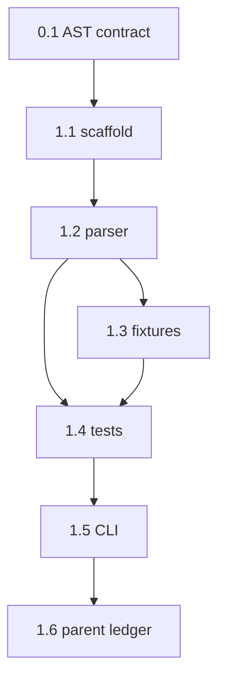

```text
Parent: /strategy/relay-master-plan
Track: A
Needs Mini: no
Blocked by: none
```

## How to use this document

This is **Relay child plan #1** (Track A). It is the only file that may grow the plan markdown schema. It does **not** implement the runner, Meridian CLI wrap, HTTP API, or UI.

Read [Relay — master plan](/strategy/relay-master-plan) **Locked decisions** and **Non-goals** first. Do not change those without editing the parent.

Work tasks **in order**. Subsequent agents will not have this chat.

<Warning>
**This file is the handoff.** If a choice is not in the [Decision log](#decision-log) or a task, it does not exist. Do not start Track B from this plan.
</Warning>

### Before you start (required)

1. Read this How-to, [Engineering conventions](#engineering-conventions-required), and the [Decision log](#decision-log).
2. Read parent [Plan markdown schema](/strategy/relay-master-plan#plan-markdown-schema). The example there is the happy-path fixture.
3. Skim the [Task status ledger](#task-status-ledger).

For every task:

1. Read **Context**, **Instructions**, and **As built** on tasks you depend on.
2. Implement only what that task describes.
3. Run **Evaluation criteria** before marking done.
4. **Edit this file** in the same PR ([Agent completion](#agent-completion)).

### Agent completion

<Warning>
When you finish, pause, or get blocked, edit this markdown file in the same PR. A task is not done if **Implementation notes** is still `_None yet._`. Also update the parent [Child plan ledger](/strategy/relay-master-plan#child-plan-ledger) when this plan is `done` / `blocked`.
</Warning>

1. Ledger row → `done` / `blocked` / `in_progress` (Notes: `doneAt`, pointer).
2. Task heading **Status** matches.
3. Evaluation checkboxes only for items you verified.
4. Replace **Implementation notes** with **As built** (template below).
5. Append [Handoff log](#handoff-log).
6. Schema or architecture forks → [Decision log](#decision-log) **and** the parent if a locked decision changed.

#### As built template

```md
**As built:**

| Concern | Landed |
| --- | --- |
| Files | `path` |
| Exports | names |
| Choice | fork you picked |
| Tests | what you ran |
| Follow-up | leftovers (or “none”) |
```

---

## Overall context

### What we are building

A **parser** in sibling `relay/` that turns a phased markdown plan into a typed AST Track B can run.

1. Fixture corpus (happy path, mixed gates, missing `verify`, invalid enum).
2. Parse YAML frontmatter + **phases** + **steps** + `verify` / `gate` / `agent` / `account` / `preview` / `cwd` / `branch` / `failover`.
3. Round-trip tests. CLI: `relay parse <file>`.

Output: `relay/parser`, `relay/fixtures/plans`, tests. No runner.

### What we are not building

- State machine, adapters, `relay/vc`, HTTP, web, phone
- Calling `meridian start` / `switch`
- Defaulting `branch` at parse time (kickoff does that; parser may leave it omitted)
- Inventing legs, batons, or other names for phases and steps

---

## Engineering conventions (required)

| Concern | Rule |
| --- | --- |
| Home | Sibling `relay/` at the workspace parent. Not under `Meridian-Mobile` or `Meridian/` |
| Runtime | Node 20, TypeScript, ESM |
| Tests | Vitest. No Mini, no network |
| Imports | Must not import Just Go / Meridian app runtime |
| Copy | Product **Relay**. Vocabulary **phase** and **step** |
| Schema | Enums and inheritance in [AST](#ast-contract). Do not add fields Track B does not need |
| Git | Do not `git checkout` Meridian/Events; this package is a new tree |

---

## Decision log

| Date | Decision |
| --- | --- |
| 2026-08-21 | Package: TypeScript + Vitest + `gray-matter` (YAML frontmatter). CLI bin name `relay`. |
| 2026-08-21 | Missing `verify` is a **warning**, not a parse error. Unknown enums / bad headings **fail**. |
| 2026-08-21 | Parser stores **declared** values. `resolvePlan()` applies inheritance (step ← phase ← plan) for consumers. Kickoff still overrides `preview` / `agent` / `account` / `branch`. |
| 2026-08-21 | Round-trip is **semantic** (`parse(stringify(ast))` equals AST), not byte-identical markdown. |
| 2026-08-21 | `failover` string `cursor:home, claude` → `[{ tool: "cursor", account: "home" }, { tool: "claude" }]`. |

---

## AST contract

Types live in `relay/src/parser/schema.ts` (names may match; fields must).

```text
tool:     cursor | claude | codex
preview:  expo | web | none
planGate: step-approve | phase-approve | full-handoff
phaseGate: auto | approve-before     # omit = inherit planGate
```

**Plan** (frontmatter + `#` title):

| Field | Required | Notes |
| --- | --- | --- |
| `title` | yes | First `#` heading |
| `preview` | yes | |
| `agent` | yes | |
| `gate` | yes | `planGate` |
| `account` | no | Named login for `agent` |
| `cwd` | no | Repo-relative path |
| `branch` | no | Git-safe: `[A-Za-z0-9._/-]+`, no `..`, no leading `/` or `-` |
| `failover` | no | List of `{ tool, account? }` |
| `machineId` | no | If present, same id rules as `RELAY_MACHINE_ID` (`relay-1`) |

**Phase** (`## Phase <n> — <title>`): optional `gate`, `cwd`, `preview`, `agent`, `account`. Must contain ≥1 step. `n` is 1-based and must match order.

**Step** (`### Step <n>.<m>`): `instruction:` required (literal block). `notes:` and `verify:` optional. `<n>` must match parent phase.

**Inheritance** (`resolvePlan`):

- Phase fills omitted `gate` / `cwd` / `preview` / `agent` / `account` from the plan.
- Phase `gate: auto` means no approval after the phase if `verify` passes.
- Phase `gate: approve-before` waits before the phase starts.
- Plan `gate: phase-approve` is the default when a phase omits `gate`.
- Steps do not have their own `gate`; `step-approve` on the **plan** means approve after each step.

**Parse result:** `{ plan, warnings[] }`. Warning codes: `missing-verify` (per step without `verify`).

**Parse errors** (throw or `ok: false` — pick one in 1.2 and keep it): missing `#` title, zero phases, phase with zero steps, heading mismatch, unknown enum, invalid `branch`, empty `instruction`.

---

## Task status ledger

| Task | Status | Notes |
| --- | --- | --- |
| 0.1 | done | doneAt 2026-08-21; confirmed against parent schema; no contract changes |
| 1.1 | done | doneAt 2026-08-21; `relay/` TypeScript package scaffolded |
| 1.2 | done | doneAt 2026-08-21; parser, stringify, inheritance, and structured errors landed |
| 1.3 | done | doneAt 2026-08-21; six-plan regression corpus added |
| 1.4 | done | doneAt 2026-08-21; fixture and round-trip Vitest coverage green |
| 1.5 | done | doneAt 2026-08-21; human/JSON parse CLI and binary checks green |
| 1.6 | done | doneAt 2026-08-21; parent Track A ledger closed |

---

## Execution order



1.3 and 1.4 may overlap once 1.2 exists; 1.4 must cover all fixtures.

---

## Phase 0 — Contract

### Task 0.1 — Confirm AST

**Status:** `done`

**Context:** The [AST contract](#ast-contract) is the schema. Track B will import it. Do not invent a second YAML format.

**Instructions:**

1. Treat [Decision log](#decision-log) and [AST contract](#ast-contract) as locked.
2. If you need a field the parent did not list, add a Decision log row **and** a sentence on the parent schema section in the same PR.
3. Do not implement code in this task.

**Evaluation criteria:**

- [x] No extra plan keys beyond the AST table without a Decision log row
- [x] Phases and steps keep those names in types and comments

**As built:**

| Concern | Landed |
| --- | --- |
| Files | `Meridian-Mintlify/strategy/relay-parser-plan.mdx` |
| Exports | none (contract confirmation only) |
| Choice | Accepted the Decision log and AST contract unchanged; no additional plan keys or vocabulary |
| Tests | Compared the child AST contract with the parent Plan markdown schema and locked decisions |
| Follow-up | Task 1.1 may scaffold the types using this confirmed contract |

---

## Phase 1 — Package + parser

### Task 1.1 — Scaffold `relay/`

**Status:** `done`

**Context:** `relay/` does not exist yet. This is a new package at the Meridian-Mono sibling root.

**Instructions:**

1. Create:

```text
relay/
  package.json          name: relay, private, bin.relay → dist or tsx entry
  tsconfig.json
  README.md             one paragraph + link to /strategy/relay-master-plan
  src/parser/schema.ts  types only (empty parsers ok)
  src/cli.ts            stub that prints usage and exits 1
```

2. Scripts: `"test": "vitest run"`, `"parse": "tsx src/cli.ts"`. Node 20 in `engines`.
3. README: product Relay; do not describe this as Meridian or Lab.
4. `.gitignore` `node_modules/` and `dist/` if you emit dist.

**Evaluation criteria:**

- [x] `cd relay && npm test` runs Vitest (zero tests is ok until 1.4)
- [x] No imports from `Meridian-Mobile` or `Meridian/backend`

**As built:**

| Concern | Landed |
| --- | --- |
| Files | `relay/package.json`, `relay/package-lock.json`, `relay/tsconfig.json`, `relay/vitest.config.ts`, `relay/.gitignore`, `relay/README.md`, `relay/src/parser/schema.ts`, `relay/src/cli.ts` |
| Exports | `Tool`, `Preview`, `PlanGate`, `PhaseGate`, `AgentRef`, `PlanStep`, `PlanPhase`, `Plan`, `ParseWarning`, `ParseResult` |
| Choice | ESM TypeScript package compiling to `dist/`; `relay` bin targets `dist/cli.js`; zero-test Vitest enabled until Task 1.4 |
| Tests | `npm test`; `npm run build`; `npm run parse` prints usage and exits 1; forbidden-import scan |
| Follow-up | Task 1.2 implements parsing, stringify, inheritance, and structured errors |

---

### Task 1.2 — Parse + stringify

**Status:** `done`

**Context:** Consumers need `parsePlanMarkdown(text, { sourcePath? })` and `stringifyPlan(plan)`.

**Instructions:**

1. Implement in `relay/src/parser/` (split files as you like).
2. YAML frontmatter via `gray-matter`. Body: `#` title, then `## Phase`, then `### Step` with `instruction` / `notes` / `verify` as markdown field blocks (`key: |` or `key:` single line).
3. Export `resolvePlan(plan)` for inheritance.
4. Export a structured error type (`RelayParseError` with `code` + `path`).
5. `stringifyPlan` must be good enough for semantic round-trip, not pretty-print contests.

**Evaluation criteria:**

- [x] Parent example markdown (happy fixture) parses
- [x] `resolvePlan` fills phase `cwd` from plan when omitted
- [x] Unknown `agent: bob` fails
- [x] Missing `verify` succeeds with `missing-verify` warning

**As built:**

| Concern | Landed |
| --- | --- |
| Files | `relay/src/parser/parser.ts`, `relay/src/parser/stringify.ts`, `relay/src/parser/resolve.ts`, `relay/src/parser/error.ts`, `relay/src/parser/index.ts`, `relay/src/parser/schema.ts`, `relay/src/parser/parser.test.ts`, `relay/package.json` |
| Exports | `parsePlanMarkdown`, `stringifyPlan`, `resolvePlan`, `RelayParseError`, parser schema/error types via `relay/parser` |
| Choice | Parse failures throw `RelayParseError` with `code` + semantic `path`; parser preserves declared values and `resolvePlan` returns cloned effective phases |
| Tests | `npm test` (11 passing); `npm run build`; compiled export smoke test; required parse-error cases covered inline |
| Follow-up | Task 1.3 promotes the inline happy path and other cases into the fixture corpus |

---

### Task 1.3 — Fixtures

**Status:** `done`

**Context:** Corpus lives in `relay/fixtures/plans/`. These are the regression set for 1.4.

**Instructions:**

Add at least:

| File | Intent |
| --- | --- |
| `happy.md` | Copy of the parent schema example (`crew invites`), with `instruction` / `notes` / `verify` filled with short placeholders |
| `mixed-gates.md` | Plan `gate: phase-approve`; phase 1 `gate: auto`; phase 2 `gate: approve-before`; one step each |
| `missing-verify.md` | Valid plan, one step has no `verify` |
| `inherit-cwd.md` | Plan `cwd: Meridian/backend`; phase omits cwd; step in that phase |
| `invalid-agent.md` | `agent: bob` — must fail |
| `invalid-heading.md` | A `##` that is not `Phase <n>` — must fail |

Keep files small. No secrets. `branch` on `happy.md` = `relay/crew-invites/20260821`.

**Evaluation criteria:**

- [x] Six files exist and match the table
- [x] Happy path uses **Phase** / **Step** headings, not other labels

**As built:**

| Concern | Landed |
| --- | --- |
| Files | `relay/fixtures/plans/happy.md`, `mixed-gates.md`, `missing-verify.md`, `inherit-cwd.md`, `invalid-agent.md`, `invalid-heading.md` |
| Exports | none (fixture corpus) |
| Choice | Kept fixtures minimal; happy mirrors the parent crew-invites example and uses the required branch and failover shorthand |
| Tests | Parser smoke check across all six fixtures; missing-verify warning check; inherited cwd check; fixture count and heading scan; `npm run build` |
| Follow-up | Task 1.4 converts fixture smoke coverage into the permanent Vitest suite |

---

### Task 1.4 — Tests

**Status:** `done`

**Context:** Vitest in `relay/src/parser/*.test.ts` or `relay/test/`.

**Instructions:**

1. Parse every fixture: happy / mixed / inherit succeed; invalid-* throw or `ok: false`.
2. `missing-verify.md` → warning `missing-verify`, `plan` still present.
3. Semantic round-trip on `happy.md` and `mixed-gates.md`.
4. `resolvePlan` on `inherit-cwd.md`: phase effective `cwd` is `Meridian/backend`.
5. Failover string on happy (if present) or a tiny inline string in a test: `cursor:home, claude` parses to two refs.
6. Branch `../etc` or `MER 123` rejected; `relay/crew-invites/20260821` accepted.

**Evaluation criteria:**

- [x] `cd relay && npm test` green
- [x] No skipped tests that hide a missing fixture

**As built:**

| Concern | Landed |
| --- | --- |
| Files | `relay/src/parser/fixtures.test.ts` |
| Exports | none (test coverage) |
| Choice | Kept parser unit/contract tests separate from fixture-corpus regression tests |
| Tests | `npm test` (24 passing across 2 files); `npm run build`; explicit skipped/todo test scan |
| Follow-up | Task 1.5 wires the tested parser into `relay parse` |

---

### Task 1.5 — `relay parse` CLI

**Status:** `done`

**Context:** Parent: `relay parse plans/foo.md`.

**Instructions:**

1. `src/cli.ts`: `relay parse <path>`. Optional `--json` prints `{ plan, warnings }` (resolved or declared — default **declared**; `--resolve` applies `resolvePlan`).
2. Human mode: title, phase count, step count, warnings on stderr; exit `0` on success-with-warnings, `1` on parse error.
3. `package.json` `"bin": { "relay": "…" }` so `npx relay parse …` works from `relay/`.
4. README: one usage example.

**Evaluation criteria:**

- [x] `npx relay parse fixtures/plans/happy.md` exits 0
- [x] `npx relay parse fixtures/plans/invalid-agent.md` exits 1
- [x] `--json` is valid JSON

**As built:**

| Concern | Landed |
| --- | --- |
| Files | `relay/src/cli.ts`, `relay/src/cli/run.ts`, `relay/src/cli/run.test.ts`, `relay/package.json`, `relay/README.md` |
| Exports | `runCli`, `CliIO`; package bin `relay` → `dist/cli.js` |
| Choice | Default output summarizes the declared plan; `--json` emits `{ plan, warnings }`; `--resolve` changes the emitted plan to inherited values; warnings remain successful and use stderr |
| Tests | `npm test` (29 passing); `npm run build`; literal `npx relay parse` happy exit 0; invalid-agent exit 1; JSON parsed by Node |
| Follow-up | Task 1.6 closes Track A in the parent ledger; no runner work started |

---

### Task 1.6 — Close Track A on the parent

**Status:** `done`

**Context:** Parent [agent completion](/strategy/relay-master-plan#agent-completion) requires the ledger update in the same PR.

**Instructions:**

1. Parent child plan ledger row **#1** → `done` + Notes with date and this Mintlify path.
2. Confirm this file’s ledger 0.1–1.5 are `done`.
3. Do not start `relay/runner`.

**Evaluation criteria:**

- [x] Parent row #1 is `done`
- [x] This plan’s tasks 0.1–1.5 are `done`
- [x] No runner / API / UI files added “for convenience”

**As built:**

| Concern | Landed |
| --- | --- |
| Files | `Meridian-Mintlify/strategy/relay-master-plan.mdx`, `Meridian-Mintlify/strategy/relay-parser-plan.mdx` |
| Exports | none (Track A closeout) |
| Choice | Closed parent child-plan row #1 without changing locked decisions or starting Track B |
| Tests | Confirmed child ledger 0.1–1.5 done; source-tree boundary scan; final `npm test` and `npm run build` |
| Follow-up | Track B begins in child plan #2; no runner, API, or UI files landed here |

---

## Out of scope / next plan

| Item | When |
| --- | --- |
| Runner + fake adapter + brief packer + `relay/vc` | [Child plan #2](/strategy/relay-runner-plan) |
| HTTP API | #3 |
| Web / phone | #4a / #4b |

---

## Success criteria (this plan)

| Signal | Target |
| --- | --- |
| Parse | Happy + mixed + inherit fixtures |
| Warn | Missing verify does not fail |
| Reject | Bad agent, bad heading, bad branch |
| CLI | `relay parse` on happy exits 0 |
| Boundary | `relay/` has no app-runtime imports |

---

## Handoff log

- 2026-08-21 — Task 0.1 complete. Confirmed the AST contract against the parent schema and locked decisions without changes. Next: Task 1.1 (`relay/` scaffold).
- 2026-08-21 — Task 1.1 complete. Scaffolded the Node/TypeScript package, AST types, CLI usage stub, and build/test configuration. Next: Task 1.2 (parse + stringify).
- 2026-08-21 — Task 1.2 complete. Added declared-plan parsing, semantic stringify, phase inheritance resolution, structured errors, warnings, and package exports. Next: Task 1.3 (fixtures).
- 2026-08-21 — Task 1.3 complete. Added and validated the six required plan fixtures covering happy path, mixed gates, warning behavior, cwd inheritance, invalid agent, and invalid heading. Next: Task 1.4 (tests).
- 2026-08-21 — Task 1.4 complete. Added permanent fixture parsing, warnings, semantic round-trip, inheritance, failover, and branch validation coverage; 24 tests pass with none skipped. Next: Task 1.5 (`relay parse` CLI).
- 2026-08-21 — Task 1.5 complete. Added the parse CLI with human, JSON, resolved, warning, and structured-error modes; 29 tests and all binary acceptance commands pass. Next: Task 1.6 (close Track A).
- 2026-08-21 — Task 1.6 complete. Closed Track A in the parent ledger after confirming tasks 0.1–1.5, final tests/build, and parser-only boundaries. Track A is done; next work belongs to child plan #2 (Track B).
