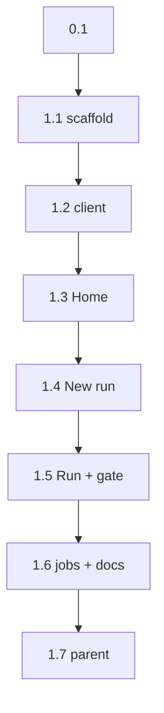

```text
Parent: /strategy/relay-master-plan
Track: E
Needs Mini: no
Blocked by: C
```

## How to use this document

This is **Relay child plan #4b** (Track E). It is the phone remote. Laptop is **#4a**, not this file. Push and Live Activities are **#9**, not this file.

Read [Relay — master plan](/strategy/relay-master-plan) Track E + [child #3](/strategy/relay-api-plan). Call the existing HTTP API. Do not add routes.

Work tasks **in order**. Subsequent agents will not have this chat.

<Warning>
**This file is the handoff.** If a choice is not in the [Decision log](#decision-log) or a task, it does not exist. Do not start Cursor adapters, jobs/promote, push, Live Activities, or an App Store listing from this plan.
</Warning>

### Before you start (required)

1. Read this How-to, [Engineering conventions](#engineering-conventions-required), and the [Decision log](#decision-log).
2. Read `relay/src/api/app.ts` and `GET /accounts` / `RunRecord` shapes. Skim [child #4a](/strategy/relay-web-plan) for the same four screens (phone is thinner, not a BoardUI port).
3. Read the phone visual target: [Lab console (dark)](https://www.figma.com/design/9VS0sCapxoA3crpmzupXnr/Just-GO---new?node-id=91-934). On-screen copy is **Relay**, not Lab.
4. Read `Meridian-Mobile/JUSTGO_STANDALONE.md` only as a **do-not-copy** list (bundle, scheme, Google clients).
5. Skim the [Task status ledger](#task-status-ledger).

For every task:

1. Read **Context**, **Instructions**, and **As built** on tasks you depend on.
2. Implement only what that task describes.
3. Run **Evaluation criteria** before marking done.
4. **Edit this file** in the same PR ([Agent completion](#agent-completion)).

### Agent completion

<Warning>
When you finish, pause, or get blocked, edit this markdown file in the same PR. A task is not done if **Implementation notes** is still `_None yet._`. Also update the parent [Child plan ledger](/strategy/relay-master-plan#child-plan-ledger) when this plan is `done` / `blocked`.
</Warning>

1. Ledger row → `done` / `blocked` / `in_progress`.
2. Task heading **Status** matches.
3. Evaluation checkboxes only for items you verified.
4. Replace **Implementation notes** with **As built**.
5. Append [Handoff log](#handoff-log).
6. Architecture forks → [Decision log](#decision-log) **and** the parent if a locked decision changed.

#### As built template

```md
**As built:**

| Concern | Landed |
| --- | --- |
| Files | `path` |
| Exports | names |
| Choice | fork you picked |
| Tests | what you ran |
| Follow-up | leftovers (or “none”) |
```

---

## Overall context

### What we are building

A **thin Expo dev client** at `relay-mobile/` that talks to `relay serve` (same Track C contract as the laptop):

1. **Home** — machine (switcher if more than one URL), usage rows per login, recent runs.
2. **New run** — `planPath`, optional branch / agent / account / preview / gate. POST `/runs`.
3. **Run** — status, phases/steps, last log lines, Stop.
4. **Gate sheet** — when `awaiting-approval`: Approve / Reject (note required) / dismiss.
5. **Jobs** — one screen that shows the API’s `501` honestly. No promote form.

On-screen name is **Relay**. Phone is a **remote**, not a second product. Visual target is the dark Lab console Figma (Geist, stone canvas, ink primary, color only on status). Adapt; do not pixel-chase.

### What we are not building

- Laptop / BoardUI (#4a)
- Cursor / Claude adapters (#5 / #7)
- Push actions or Live Activities (#9)
- Tailscale / launchd / MagicDNS (#6) — `EXPO_PUBLIC_RELAY_API_URL` is localhost / LAN for this plan
- Product Expo (Just Go / campus Metro) on the Mini
- App Store / TestFlight listing
- Google Sign-In, Just Go scrapbook, Meridian Go tabs
- Anything inside `Meridian-Mobile/`

---

## Engineering conventions (required)

| Concern | Rule |
| --- | --- |
| Home | `relay-mobile/` — sibling of `relay/` in this mono. **Not** under `Meridian-Mobile/` |
| Identity | Expo slug `relay`, bundle `app.relay`, scheme `relay://`. Not `com.meridian.mobile`, not `app.justgo` |
| Client | **Dev client** (`expo-dev-client`). Not Expo Go (evicts product preview later) |
| API | Same Track C paths as web. `EXPO_PUBLIC_RELAY_API_URL` (default `http://127.0.0.1:8787` for simulator) |
| Auth | Send `Authorization: Bearer` when `EXPO_PUBLIC_RELAY_BEARER` is set |
| Machines | `EXPO_PUBLIC_RELAY_MACHINES` JSON `[{ "id": "relay-1", "url": "<api origin>" }]`. One entry = hide the switcher |
| Copy | **Relay**. Phases and steps keep those words |
| UI kit | Phone-native (React Native). **Do not** import BoardUI, `relay/web`, or `Meridian-Mobile` |
| Google | **No** Sign-In. Never configure campus `…sp735jm…` or Just Go `…bv08ba76…` |
| EAS | New project only. Do **not** `eas init` over `meridian-mobile` or `just-go` |
| Tests | Jest + Testing Library (or the Expo default that lands). `npm test` in `relay/` must stay green |
| Jobs | Display `error.code === "not-implemented"`. Do not POST promote |

---

## Decision log

| Date | Decision |
| --- | --- |
| 2026-08-22 | New Expo app in `relay-mobile/`. Bundle `app.relay`, scheme `relay://`, slug `relay`. |
| 2026-08-22 | Dev client, not Expo Go. No App Store submission in this plan. |
| 2026-08-23 | New Run navigates as soon as Relay returns a durable queued record; the Run screen owns ongoing visibility. Awaiting gates retain automatic presentation but also expose an explicit, repeatable Review approval action after dismissal. |
| 2026-08-23 | Phase rows are inspectable controls. Gate review fetches the current run/log and explains what completed or will run next, verification, branch/agent/preview context, and recent activity before Approve or Reject. |
| 2026-08-22 | Routes: Home, New run, Run, Gate sheet (modal on Run), Jobs stub. Same API as #4a. |
| 2026-08-22 | New run requires `planPath`. Default preview `none`, agent `cursor`. Branch empty → server default. |
| 2026-08-22 | Run polls `GET /runs/:id` every 2s and `GET /runs/:id/log?after=` for a short tail (last ~40 lines). SSE not required. |
| 2026-08-22 | Gate sheet only when status is `awaiting-approval`. Stop also when `running`. Reject requires a note. |
| 2026-08-22 | Usage rows = `GET /accounts`. Vendor `unknown` is text, not a fake bar. |
| 2026-08-22 | No push, no Live Activity, no Face ID, no Google auth. |

---

## Screens

Visual intent: [Lab console](https://www.figma.com/design/9VS0sCapxoA3crpmzupXnr/Just-GO---new?node-id=91-934). Copy says **Relay**.

### Home

- Title **Relay**. `GET /machine` → id, idle, RAM free/total.
- Machine select if more than one configured URL.
- Usage rows: tool, account, attributed tokens/cost/duration, vendor remaining, last used.
- Run list: title (`plan.title`), status chip, branch, updatedAt. Tap → Run.
- Primary **New run**.

### New run

- Fields: planPath (required), branch, agent, account (from `/accounts`), preview, gate.
- Submit → `POST /runs` → navigate to Run.
- `400` / `409` shown as text.

### Run

- Header: title, status, branch, agent/account, machineId.
- Phase list from `resolved.phases` (number, title, gate). Highlight `phaseIndex` / `stepIndex`.
- Last log lines from poll.
- **Stop** while `running` or `awaiting-approval`.
- When `awaiting-approval`, present the **gate sheet** (do not hide Approve behind a buried menu).

### Gate sheet

- Copy: what is waiting (phase title + gate).
- **Approve** → `POST /runs/:id/approve`.
- **Reject** → note field required → `POST /runs/:id/reject`.
- Dismiss does not reject.

### Jobs stub

- `GET /jobs/:id` → show the `501` message. No second confirm.

---

## Task status ledger

| Task | Status | Notes |
| --- | --- | --- |
| 0.1 | done | Contract confirmed; no product code |
| 1.1 | done | Expo SDK 54 dev-client shell + identity |
| 1.2 | done | Typed HTTP client + machine env parsing |
| 1.3 | done | Machine health, usage, and recent runs |
| 1.4 | done | Validated machine-scoped kickoff form |
| 1.5 | done | Polling Run view + automatic Gate sheet |
| 1.6 | done | Honest Jobs 501 + device docs |
| 1.7 | done | Parent child 4b closed |

---

## Execution order



---

## Phase 0 — Contract

### Task 0.1 — Confirm phone contract

**Status:** `done`

**Instructions:**

1. Treat [Decision log](#decision-log) and [Screens](#screens) as locked.
2. Do not add GraphQL, a second resource model, or BoardUI.
3. No code.

**Evaluation criteria:**

- [x] Five surfaces only (Home, New run, Run, Gate sheet, Jobs)
- [x] Push / Live Activity stay out
- [x] App lives in `relay-mobile/`, not `Meridian-Mobile/`

**As built:**

| Concern | Landed |
| --- | --- |
| Files | `strategy/relay-phone-plan.mdx` |
| Exports | none (contract-only task) |
| Choice | Confirmed the five locked surfaces (Home, New run, Run, Gate sheet, Jobs), the existing Track C `RunRecord` resource model, the honest `501` Jobs response, and a new phone-native Expo dev client rooted at `relay-mobile/` |
| Tests | Manual contract review against the Track E screens, child #3 API contract, `relay/src/api/app.ts`, `RunRecord`, the thinner phone boundary in child #4a, and `Meridian-Mobile/JUSTGO_STANDALONE.md` |
| Follow-up | Task 1.1 should scaffold only the five surface shells in `relay-mobile/`; push, Live Activities, GraphQL, BoardUI, and all `Meridian-Mobile/` changes remain out of scope |

---

## Phase 1 — Shell

### Task 1.1 — Scaffold `relay-mobile`

**Status:** `done`

**Instructions:**

1. Expo (SDK 54 or current stable) TypeScript app in `relay-mobile/`. `expo-dev-client` installed. Scripts: `start`, `ios`, `android`, `test`.
2. `app.json` / `app.config`: name **Relay**, slug `relay`, `ios.bundleIdentifier` `app.relay`, `android.package` `app.relay`, scheme `relay`.
3. React Navigation (or Expo Router) with the screens as empty shells.
4. Dark theme tokens inspired by the Figma (background stone, primary ink/white, status color only). Geist or a close system face is fine. Do not import Just Go SCSS or BoardUI CSS.
5. `relay-mobile/README.md`: how to run the **dev client** against `RELAY_WORKSPACE=… npx relay serve`. Simulator URL `http://127.0.0.1:8787`.
6. Do not run `eas init` against an existing Meridian/Just Go project. A placeholder `eas.json` with a **new** slug is ok; submitting is not.

**Evaluation criteria:**

- [x] `app.relay` / `relay://` in config
- [x] No `com.meridian.mobile`, `app.justgo`, or Just Go Google client IDs in the tree
- [x] No import from `Meridian-Mobile` / `Meridian/frontend` / `relay/web`

**As built:**

| Concern | Landed |
| --- | --- |
| Files | `relay-mobile/app.json`, `relay-mobile/package.json`, `relay-mobile/package-lock.json`, `relay-mobile/App.tsx`, `relay-mobile/src/`, `relay-mobile/README.md` |
| Exports | `App`, `RootStackParamList`, `HomeScreen`, `NewRunScreen`, `RunScreen`, `GateSheetScreen`, `JobsScreen`, `ScreenShell`, `ActionButton`, `colors`, `spacing`, `radii` |
| Choice | Expo SDK 54 dev client with React Navigation native stack; five phone-native surface shells, with Gate sheet presented modally; dark stone/ink tokens adapted from the Lab console Figma |
| Tests | `npm test` (relay-mobile: 1 passed), `npm run typecheck`, `npx expo config --type public`, `npx expo install --check`, `npm test` in `relay/` (84 passed), and forbidden identity/import scan |
| Follow-up | Task 1.2 should add the typed HTTP client and configured machine list without changing navigation or importing server/product UI code |

---

### Task 1.2 — API client

**Status:** `done`

**Instructions:**

1. `relay-mobile/src/api.ts` (or equivalent): `health`, `machine`, `accounts`, `listRuns`, `createRun`, `getRun`, `getLog`, `approve`, `reject`, `stop`, `getJob`.
2. Base URL from `EXPO_PUBLIC_RELAY_API_URL`. Optional bearer header.
3. Typed to `RunRecord` — copy the fields you need (do not import `relay/src` into Metro).
4. Unit tests with mocked `fetch` for 200 / 401 / 409 / 501.

**Evaluation criteria:**

- [x] `createRun` POSTs `{ planPath, ...overrides }`
- [x] `getLog(id, after)` reads `{ offset, chunk }`

**As built:**

| Concern | Landed |
| --- | --- |
| Files | `relay-mobile/src/api.ts`, `relay-mobile/src/types.ts`, `relay-mobile/src/machines.ts`, `relay-mobile/src/__tests__/api.test.ts`, `relay-mobile/src/__tests__/machines.test.ts`, `relay-mobile/expo-env.d.ts`, `relay-mobile/README.md` |
| Exports | `health`, `machine`, `accounts`, `listRuns`, `createRun`, `getRun`, `getLog`, `approve`, `reject`, `stop`, `getJob`, `RelayApiError`, `parseRelayMachines`, `getRelayMachines`, `DEFAULT_RELAY_API_URL`, and copied Track C mobile types |
| Choice | Default API origin is `http://127.0.0.1:8787`; every request accepts a selected machine `baseUrl`, sends `EXPO_PUBLIC_RELAY_BEARER` when set, encodes IDs/query values, and preserves Track C status/code/message errors; machine JSON is normalized and malformed or duplicate entries fail with actionable copy |
| Tests | `npm test` (relay-mobile: 13 passed) covers 200, 401, 409, 501, create body/auth, log offset/chunk, action routes, response unwrapping, and machine parsing; `npm run typecheck`; iOS `npx expo export`; `npm test` in `relay/` (91 passed); forbidden import/identity/push scan |
| Follow-up | Task 1.3 should select one parsed machine URL, hide the switcher for a single entry, and load `machine`, `accounts`, and `listRuns` on mount/focus |

---

### Task 1.3 — Home

**Status:** `done`

**Instructions:**

1. Load machine, accounts, runs on focus / mount.
2. Usage rows + run list + New run CTA as in [Screens](#screens).
3. Idle / RAM visible.
4. Tests: two usage rows from mock accounts; run row navigates to that id.

**Evaluation criteria:**

- [x] Empty accounts → empty list, not a crash
- [x] Status chips for `awaiting-approval` / `done` / `failed` / `running`

**As built:**

| Concern | Landed |
| --- | --- |
| Files | `relay-mobile/src/screens/HomeScreen.tsx`, `relay-mobile/src/navigation/types.ts`, `relay-mobile/src/__tests__/HomeScreen.test.tsx`, `relay-mobile/src/__tests__/App.test.tsx` |
| Exports | `HomeScreen`; New run and Run navigation now carry the selected `machineId` / `baseUrl`, and the shared route types reserve the same metadata for Gate sheet and Jobs |
| Choice | `useFocusEffect` loads machine/accounts/runs in parallel for the selected machine; one configured machine hides the selector, multiple machines render native choice chips and reload against the chosen origin; the last successful dashboard remains visible during focus refreshes |
| Tests | `npm test` (relay-mobile: 16 passed) covers two usage rows, empty account/run states, idle/RAM, all required status chips, one-vs-many machine selection, selected-origin reloads, and run navigation with id/base URL; `npm run typecheck`; iOS `npx expo export`; `npm test` in `relay/` (95 passed); forbidden boundary scan |
| Follow-up | Task 1.4 should read `route.params.baseUrl`, load accounts for that machine, and POST the form to the same origin before navigating to Run with the machine params preserved |

---

### Task 1.4 — New run

**Status:** `done`

**Instructions:**

1. Form fields per [New run](#new-run).
2. Account picker from `/accounts` (value `tool` + `account`).
3. On 201, navigate to Run.
4. Test: submit calls `createRun` with `planPath`.

**Evaluation criteria:**

- [x] Cannot submit empty planPath
- [x] 409 mutex message visible

**As built:**

| Concern | Landed |
| --- | --- |
| Files | `relay-mobile/src/screens/NewRunScreen.tsx`, `relay-mobile/src/components/ActionButton.tsx`, `relay-mobile/src/__tests__/NewRunScreen.test.tsx`, `relay-mobile/src/__tests__/App.test.tsx` |
| Exports | `NewRunScreen`; `ActionButton` now renders a disabled visual state as well as the native disabled behavior |
| Choice | Loads accounts from `route.params.baseUrl`; defaults agent to `cursor` and preview to `none`; optional branch/gate/account fields are omitted when empty; choosing an account selects its tool as agent; successful create preserves machine id/base URL when navigating to Run |
| Tests | `npm test` (relay-mobile: 19 passed) covers required plan path, disabled empty submit, machine-scoped accounts, all selected create fields, successful Run navigation, and inline 409 conflict copy; `npm run typecheck`; iOS `npx expo export`; `npm test` in `relay/` (99 passed); forbidden boundary scan |
| Follow-up | Task 1.5 should read the preserved `runId` / `machineId` / `baseUrl`, poll that origin, and present Gate sheet automatically for `awaiting-approval` |

---

### Task 1.5 — Run + gate sheet

**Status:** `done`

**Instructions:**

1. Poll run + log. Keep `offset`. Show a short tail, not an infinite desktop log.
2. Phase list; current index highlighted.
3. Gate sheet when `awaiting-approval`. Approve / Reject / Stop wired. After action, refresh run.
4. Test: awaiting-approval shows Approve; pressing it calls the client. Reject disabled without a note.

**Evaluation criteria:**

- [x] Stop visible while `running` or `awaiting-approval`
- [x] Gate sheet is the approval UX (not a hidden button only)
- [x] No `expo-notifications` / Live Activity code

**As built:**

| Concern | Landed |
| --- | --- |
| Files | `relay-mobile/src/screens/RunScreen.tsx`, `relay-mobile/src/screens/GateSheetScreen.tsx`, `relay-mobile/src/navigation/types.ts`, `relay-mobile/src/__tests__/RunScreen.test.tsx` |
| Exports | `RunScreen`, `GateSheetScreen`; Gate sheet route params carry run/machine origin plus waiting phase title and gate |
| Choice | Run polls state and byte-offset logs every 2s only while focused, retains a rolling ~40-line text tail, highlights the current phase/step, and applies the Stop response immediately; each awaiting gate auto-presents once, while dismissal suppresses reopening for the same phase/step without rejecting |
| Tests | `npm test` (relay-mobile: 23 passed) covers automatic Gate presentation, approve refresh on focus return, required/trimmed reject note, dismiss without action, offset reuse, log trimming, and Stop for both running and awaiting states; `npm run typecheck`; iOS `npx expo export`; `npm test` in `relay/` (99 passed); forbidden push/SSE/product import scan |
| Follow-up | Task 1.6 should load the Jobs route from its preserved `baseUrl`, render the structured `501` message, and finish the environment/device README without adding promote or push behavior |

---

### Task 1.6 — Jobs stub + README

**Status:** `done`

**Instructions:**

1. Jobs screen fetches GET and shows `error.message`.
2. README: env vars, simulator vs device note (device needs the Mini/laptop LAN or Tailscale URL — do not implement Tailscale here), pair with `npx relay serve`.
3. Confirm `Meridian-Mobile/` was not modified.

**Evaluation criteria:**

- [x] 501 copy visible in a test
- [x] `cd relay && npm test` still green
- [x] No Just Go / campus Google client IDs

**As built:**

| Concern | Landed |
| --- | --- |
| Files | `relay-mobile/src/screens/JobsScreen.tsx`, `relay-mobile/src/screens/HomeScreen.tsx`, `relay-mobile/src/__tests__/JobsScreen.test.tsx`, `relay-mobile/README.md` |
| Exports | `JobsScreen`; Home now navigates to Jobs with the selected machine id/base URL and the stub probe id |
| Choice | Jobs calls `getJob("status")` on the selected origin and renders structured Relay status/code/message failures; it has no promote request or control; README documents all three Expo public variables plus iOS Simulator, Android Emulator, physical LAN, and future Tailscale origins without implementing networking |
| Tests | `npm test` (relay-mobile: 24 passed) renders `501 · not-implemented` and the API message while asserting no promote button; `npm run typecheck`; iOS `npx expo export`; `npm test` in `relay/` (99 passed); Google/push/promote boundary scan; clean `git status --short` in `Meridian-Mobile/` |
| Follow-up | Task 1.7 should only close child 4b in the parent ledger and confirm tasks 0.1–1.6 are done; do not start push, Live Activity, Tailscale, promote, or store work |

---

### Task 1.7 — Close 4b on the parent

**Status:** `done`

**Instructions:**

1. Parent ledger row **4b** → `done` + this Mintlify path.
2. This file’s 0.1–1.6 are `done`.
3. Do not start #9.

**Evaluation criteria:**

- [x] Parent 4b is `done`
- [x] No push / Live Activity / App Store work

**As built:**

| Concern | Landed |
| --- | --- |
| Files | `strategy/relay-phone-plan.mdx`, `strategy/relay-master-plan.mdx` |
| Exports | none (plan closure only) |
| Choice | Closed parent child 4b as `done` with its existing Mintlify path and `doneAt 2026-08-22`; left child #9 and all push, Live Activity, App Store, Tailscale, and promote work pending/out of scope |
| Tests | Manual ledger audit confirms tasks 0.1–1.7 are `done`, parent row 4b is `done`, and the source/config/package boundary scan contains no push, Live Activity, or App Store implementation |
| Follow-up | none for child 4b; future work stays in the separately gated parent children, especially #6 before #9 |

---

## Post-closeout operational UX refinement

**Status:** `done`

**As built:**

| Concern | Landed |
| --- | --- |
| Files | `relay/src/runner/run.ts`, `relay/src/api/app.ts`, focused runner/API tests; `relay-mobile/src/screens/NewRunScreen.tsx`, `RunScreen.tsx`, `GateSheetScreen.tsx`, navigation types, and screen tests |
| Exports | `enqueueRun`; existing `POST /runs`, run/log polling, and Gate sheet routes remain the public control plane |
| Choice | Return the persisted queued run immediately instead of holding the New Run form through branch/agent work. Show live run-stage copy and runner log transitions; keep gates auto-presented once but add a persistent Review approval button; make phases expandable and load current phase/step/verify/context/activity into every gate review. |
| Tests | Relay: 139 tests plus TypeScript build; phone: 26 tests plus strict typecheck; web: 17 tests plus production build. Coverage includes durable queued response, stop during branch alignment, queued-status explanation, repeatable gate reopening, gate detail context, and expandable step verification. |
| Follow-up | Physical-device smoke after syncing Relay and the phone bundle to `relay-1`; push, Live Activities, arbitrary shell/process controls, and planner work remain in their existing child plans. |

## Out of scope / next plan

| Item | When |
| --- | --- |
| Cursor adapter | [Child #5](/strategy/relay-cursor-plan) |
| Mini Tailscale URL on device | #6 |
| Push + Live Activity | #9 |
| Jobs + promote | #8 |

---

## Success criteria (this plan)

| Signal | Target |
| --- | --- |
| Loop | Simulator: new run → gate sheet approve → `done` against local `relay serve` (fake adapter is fine) |
| Home | Usage rows + run list |
| Identity | `app.relay` / `relay://` / dev client |
| Boundary | `Meridian-Mobile/` untouched; `relay/` API tests still green |

---

## Handoff log

- 2026-08-22 — Task 0.1 complete. Confirmed the phone contract as written: five surfaces only (Home, New run, Run, Gate sheet, Jobs), the existing Track C HTTP API and `RunRecord`, an honest `501` Jobs surface, and a separate `relay-mobile/` Expo dev client. Push, Live Activities, GraphQL, BoardUI, and `Meridian-Mobile/` changes remain out of scope. No product code or parent-plan changes were needed. Next: Task 1.1.
- 2026-08-22 — Task 1.1 complete. Added the standalone Expo SDK 54 dev-client scaffold in `relay-mobile/` with Relay identity (`app.relay`, `relay://`), React Navigation shells for the five locked surfaces, a modal Gate sheet, shared phone-native dark tokens adapted from the Lab console target, Jest coverage, and dev-client/API setup documentation. Verified Expo config/dependency compatibility, strict TypeScript, the mobile test, all 84 existing `relay/` tests, and the forbidden identity/import boundary. No EAS project was initialized. Next: Task 1.2.
- 2026-08-22 — Task 1.2 complete. Added copied Track C mobile types, the required HTTP methods, structured `RelayApiError`, simulator-default and per-machine API origins, optional bearer auth, and strict `EXPO_PUBLIC_RELAY_MACHINES` parsing. Mocked-fetch coverage verifies 200/401/409/501 responses, create body/auth, log polling offsets, encoded run actions, list unwrapping, and machine normalization/errors. Strict TypeScript, an iOS Metro export, all 13 mobile tests, all 91 current `relay/` tests, and the forbidden boundary scan pass. Next: Task 1.3.
- 2026-08-22 — Task 1.3 complete. Home now loads machine health, account usage, and recent runs on focus for the selected API origin; shows idle/busy and free/total RAM, honest `unknown` vendor usage, empty states, and status-colored run rows; and hides the machine selector for one entry while reloading for multi-machine choices. New run and run navigation preserve the selected machine id/base URL. Verified all 16 mobile tests, strict TypeScript, iOS Metro export, all 95 current `relay/` tests, and the forbidden boundary scan. Next: Task 1.4.
- 2026-08-22 — Task 1.4 complete. New run now provides the locked plan path, branch, agent, account, preview, and gate fields; loads account choices from the selected machine; blocks empty plan paths; trims and omits optional empty fields; submits to the selected API origin; and preserves machine metadata when navigating to the created Run. Inline API errors show 400/409 copy, with explicit 409 coverage. Verified all 19 mobile tests, strict TypeScript, iOS Metro export, all 99 current `relay/` tests, and the forbidden boundary scan. Next: Task 1.5.
- 2026-08-22 — Task 1.5 complete. Run now polls state and byte-offset logs every 2s while focused, keeps a short rolling log tail, renders status/header metadata and resolved phase/step progress, and exposes Stop while running or awaiting approval. Awaiting runs automatically present the native Gate sheet with phase/gate copy; Approve and note-required Reject call the selected origin and refresh on focus return; Dismiss performs no action and does not immediately reopen the same gate. Verified all 23 mobile tests, strict TypeScript, iOS Metro export, all 99 current `relay/` tests, and the forbidden push/SSE/product boundary scan. Next: Task 1.6.
- 2026-08-22 — Task 1.6 complete. Home now opens Jobs on the selected machine, and Jobs calls the existing GET stub and displays its structured `501 · not-implemented` code plus server message without a promote form or request. README now lists the API URL, bearer, and machine JSON variables; pairs the app with `npx relay serve`; and distinguishes iOS Simulator, Android Emulator, physical LAN, and future Tailscale origins without implementing Tailscale. Verified all 24 mobile tests, strict TypeScript, iOS Metro export, all 99 current `relay/` tests, forbidden Google/push/promote boundaries, and a clean `Meridian-Mobile/` worktree. Next: Task 1.7.
- 2026-08-22 — Task 1.7 complete. Audited tasks 0.1–1.6 as done, marked this closure task done, and updated the parent child-plan ledger row 4b to `done` with `doneAt 2026-08-22` and `/strategy/relay-phone-plan`. No code or locked architecture changed, and no push, Live Activity, App Store, Tailscale, or promote work was started. Child 4b / Track E phone shell is complete.
- 2026-08-22 — Post-close visual refinement. Reworked the five surfaces toward the supplied Cursor iOS references: removed the universal card and uppercase eyebrow, changed dashboard and phase cards into flat hairline-separated rows, replaced outlined status pills with colored dots, simplified selectors to quiet text treatments, and retained filled surfaces only for actions and text entry. The API, navigation, and locked five-surface scope are unchanged. Verified all 24 mobile tests, strict TypeScript, and an iOS Metro export.
- 2026-08-23 — Post-close operational UX refinement. Kickoff now returns a durable queued run immediately and moves branch/preview/agent visibility to the polled Run screen. Dismissed gates can always be reopened with Review approval; gate review shows the current phase/step, approval semantics, verification, run context, and recent activity; phase rows expand into step notes and verify commands. Verified 139 Relay tests/build, 26 phone tests/typecheck, and 17 web tests/build. Next: sync the Relay service and phone bundle to `relay-1` for a physical-device smoke.
