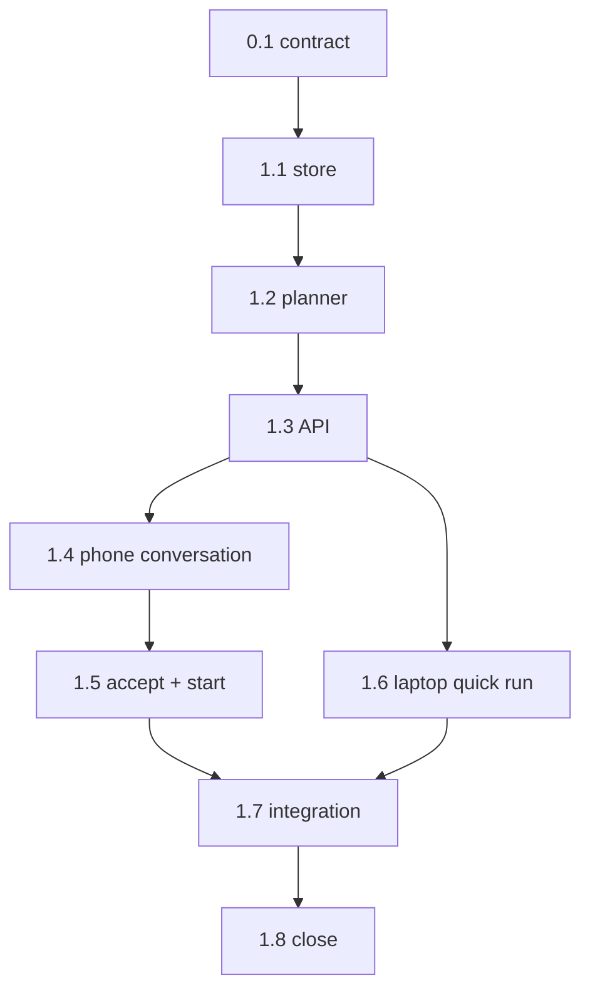

```text
Parent: /strategy/relay-master-plan
Track: H
Needs Mini: no for implementation; yes for phone/Tailscale acceptance
Blocked by: A, C, E, child #5; child #6 for real worker acceptance
```

## How to use this document

This is **Relay child plan #10**. It adds a structured planning workspace to the **phone** and a non-conversational paste/upload quick-run path to the existing laptop web console. It reuses the parser, inline runner input, Cursor adapter, control API, and phone shell.

Read [Relay — master plan](/strategy/relay-master-plan) **Structured planning**, **Plan markdown schema**, **Control API**, **Accounts**, and **Version control** first. Also read [child #1](/strategy/relay-parser-plan), [child #3](/strategy/relay-api-plan), [child #4a](/strategy/relay-web-plan), [child #4b](/strategy/relay-phone-plan), and [child #5](/strategy/relay-cursor-plan).

Work tasks **in order**. Subsequent agents will not have the product-alignment conversation that created this plan.

<Warning>
**Hard boundary:** Planning is conversational but not a free-form coding agent. The planner may inspect the selected product workspace read-only and propose typed plan revisions. It must not edit code, switch branches, publish without confirmation, auto-accept a revision, or add a laptop planning chat.
</Warning>

### Before you start (required)

1. Read this How-to, [Engineering conventions](#engineering-conventions-required), [Decision log](#decision-log), and [Task status ledger](#task-status-ledger).
2. Read `relay/src/parser/`, `relay/src/runner/types.ts`, `relay/src/runner/store.ts`, `relay/src/adapters/cursor.ts`, and `relay/src/api/app.ts`.
3. Read `relay-mobile/src/screens/NewRunScreen.tsx`, navigation/types, API client, machine configuration, and attachment-capable Expo dependencies already present.
4. Read `relay/web/src/` New run/API patterns. Keep BoardUI and the existing web visual contract.
5. Check current SDK versions before adding attachment/model behavior. Tests must inject the planner; no live Cursor request belongs in the suite.

### Agent completion

<Warning>
When a task finishes, pauses, or blocks, update this file in the same PR. A task is not done while its **Implementation notes** remain `_None yet._`. Update the parent ledger when this child becomes `done` or `blocked`.
</Warning>

1. Ledger row matches task status.
2. Evaluation checkboxes reflect commands actually run.
3. Replace **Implementation notes** with **As built**.
4. Record architecture forks in this Decision log and the parent.
5. Append the [Handoff log](#handoff-log).

---

## Overall context

### Product flow

```text
Choose product
  → describe goal + optional screenshots/text/plan attachment
  → durable read-only planning conversation
  → proposed structured revision + diff
  → Accept revision
  → confirm machine / branch / execution agent+account / gate / preview / optional publish
  → immutable inline run snapshot
```

The conversation and executable plan are separate artifacts. Cursor may explain, ask questions, and propose a revision, but only an explicitly accepted revision can start a run.

### Initial products

| Product | Initial repository context |
| --- | --- |
| Meridian full stack | `Meridian/`, `Events-Backend/` |
| Meridian web | `Meridian/frontend/`; planner may disclose supporting backend repos |
| Meridian backend | `Meridian/backend/`, `Events-Backend/` |
| Just Go mobile | `Meridian-Mobile/`; planner may disclose supporting backend repos |
| Campus mobile | `Meridian-Mobile/`; planner may disclose supporting backend repos |
| Relay | `relay/`, `relay-mobile/` |
| Documentation/strategy | `Meridian-Mintlify/` |

Product selection supplies the starting context, not an invisible hard boundary. If the planner proposes another repository, the plan preview must name it before acceptance.

### Laptop exception

The web console gets **Quick run**, not the planning workspace:

1. Paste plan Markdown or upload one plan file from the laptop.
2. Parse and show phases, steps, validation warnings, and errors before kickoff.
3. Confirm ordinary run options.
4. Submit the structured plan inline to the selected Mini.

No synchronized Git history or Mini-side `planPath` is required. Existing `planPath` kickoff remains compatible.

### What we are not building

- Laptop planning chat, draft editor, or attachment conversation
- A general Cursor chat or code-writing planning session
- Manual editing of plan Markdown on the phone
- Invisible plan changes or implicit acceptance
- A second plan schema or a separate execution engine
- Branch switching inside the planning agent
- Automatic push, PR, merge, deploy, or `meridian ship`
- Push delivery itself; child #9 may later notify when a response is ready

---

## Engineering conventions (required)

| Concern | Rule |
| --- | --- |
| Source of truth | Private `RELAY_DATA/drafts/`; never store secrets in draft JSON, transcript, attachment metadata, or revision Markdown |
| Plan type | Reuse parser `Plan` / `ResolvedPlan`; accepted revisions stringify to the existing Markdown schema |
| Draft identity | Stable draft ID, machine ID, product, planning agent/account, async state, timestamps, accepted revision ID |
| Revisions | Immutable revision records. New proposals never overwrite or auto-accept the prior revision |
| Attachments | Screenshot/image, text/Markdown, and plan files only in v1; copied into private draft storage with safe generated names |
| Planner access | Read-only repository inspection. No write tools, Git mutations, code formatting, dependency install, or process start |
| Concurrency | Multiple saved drafts; one active planning response per Mini. May coexist with a worker only while memory is healthy |
| Recovery | Persist user message before starting the response. Restart marks interrupted work recoverable and creates a fresh planner from transcript/context |
| Execution | `POST /runs` accepts an inline `Plan` or accepted draft revision; runner persists its own immutable `plan.md` snapshot |
| Publishing | Optional, confirmed repo/path, default proposal under `Meridian-Mintlify/strategy/`, local commit on aligned run branch, never push |
| Phone | New planning UI lives only in `relay-mobile/` for this child |
| Web | BoardUI Quick run paste/upload only; no conversation UI |
| Tests | Inject planner/reader/commit seams; temp dirs and in-memory API requests; no live Cursor, Mini, Tailscale, or Git remote |

---

## Decision log

| Date | Decision |
| --- | --- |
| 2026-08-23 | Planning UX ships on phone only. APIs remain client-neutral for a later web planning UI. |
| 2026-08-23 | Planner inspects selected product repositories read-only and may disclose additional affected repos in a proposal. |
| 2026-08-23 | One planning response may coexist with one worker when memory is healthy; critical pressure queues it. |
| 2026-08-23 | Every plan revision requires explicit **Accept revision**. Conversation never silently changes the executable plan. |
| 2026-08-23 | Drafts live in private Relay data. Execution snapshots an accepted revision inline; `planPath` is not required. |
| 2026-08-23 | Final confirmation covers machine, branch, execution agent/account, gate, preview, and optional publishing. |
| 2026-08-23 | Planning and execution may use different named accounts; usage is attributed separately. |
| 2026-08-23 | Screenshots/images, text/Markdown, and plan files are the initial attachment set. |
| 2026-08-23 | Planning is durable/asynchronous. Phone may disconnect; polling resumes it, and child #9 may add notifications later. |
| 2026-08-23 | Laptop Quick run accepts pasted/uploaded plans, previews parsing, and sends inline data. It does not add planning conversation. |
| 2026-08-23 | Optional publish proposes a location heavily defaulted to `Meridian-Mintlify/strategy/`, asks once, commits locally on the run branch, and never pushes. |
| 2026-08-23 | The phone planning surface is chat-first: a full-height transcript and fixed composer replace persistent status/action cards. Plan review appears contextually only after a valid Markdown revision exists. |
| 2026-08-23 | Relay persists only Cursor SDK-surfaced `thinking`, task, status, and allow-listed read-only tool activity. It sanitizes private values and exposes reconnectable long-poll updates; it never invents or claims access to hidden chain-of-thought. |
| 2026-08-23 | Live activity is visible while the planner works, then collapses to expandable duration/tool summaries. Chat send remains a composer action; revision acceptance and run kickoff stay explicit, separate plan actions. |

---

## Task status ledger

| Task | Status | Notes |
| --- | --- | --- |
| 0.1 | done | Contract locked; existing parser/runner/API/mobile/web seams named below; no code |
| 1.1 | done | Typed private draft store, safe attachments, restart recovery, and machine coordinator |
| 1.2 | done | Restricted Cursor planner, read-only product context, validated revisions, usage, and recovery |
| 1.3 | done | Authenticated draft API, exclusive kickoff sources, recovery, and local no-push publishing |
| 1.4 | done | Machine-scoped phone drafts, product/idea setup, attachments, durable conversation, and separate plan preview |
| 1.5 | done | Immutable phone revision review, explicit acceptance, compact kickoff confirmation, and Run transition |
| 1.6 | done | BoardUI path/paste/upload sources, shared validation preview, and inline Quick run kickoff |
| 1.7 | done | Offline draft-to-run integration, restart/memory recovery, publication, and security boundaries verified |
| 1.8 | done | Child #10 audited and closed; parent ledger updated |
| 2.1 | done | Post-close chat-first conversation and persisted Cursor activity refinement |

## Execution order



---

## Phase 0 — Contract

### Task 0.1 — Confirm planning contract

**Status:** `done`

**Instructions:**

1. Treat the Decision log and product flow as locked.
2. Confirm no task adds phone plan editing, laptop planner chat, code-writing planning tools, auto-acceptance, or a second plan schema.
3. Name exact existing parser/runner/API/mobile/web seams each implementation task will extend.
4. No product code.

**Evaluation criteria:**

- [x] Draft, revision, execution snapshot, and optional repository publication are distinct
- [x] Planner access is read-only and explicitly tested
- [x] Existing `planPath` clients remain compatible
- [x] Phone-only planner and laptop-only Quick run boundary is explicit
- [x] No code changed

**As built:**

- Contract confirmed with no product-code changes. A private mutable draft contains the durable conversation and points to immutable proposed revisions; only an explicitly accepted revision is executable. `relay/src/runner/store.ts#createRun` remains responsible for producing the run-owned immutable `runs/<id>/plan.md` snapshot. Optional publication is a separate, confirmed local repository write/commit and never replaces that snapshot or pushes.
- Locked planning boundaries: the planner is phone-only, conversational, and read-only; the laptop receives only BoardUI paste/upload Quick run. No task may add phone Markdown editing, laptop planner chat, code-writing planner capabilities, implicit revision acceptance, branch switching, or another plan schema. Task 1.2 must enforce read-only access both in capability construction and injected regression tests.
- Existing path kickoff remains a first-class compatible source. `POST /runs` will add inline `plan` and accepted-draft sources as an exclusive union alongside the current `planPath`; the current path resolution and runner behavior stay unchanged.

| Task | Existing seams to extend |
| --- | --- |
| 1.1 | Add `relay/src/planning/` using the atomic persistence conventions in `relay/src/runner/store.ts` (`relayDataDir`, temporary-file rename, restart loading) and the machine-scoped exclusion pattern in `relay/src/runner/mutex.ts`; keep planning response coordination separate from the run mutex. |
| 1.2 | Extend the injected Cursor/account seams in `relay/src/adapters/cursor.ts` (`CreateCursorAgent`, `resolveCursorApiKey`) and `relay/src/adapters/factory.ts`; validate every proposed full plan through `relay/src/parser/index.ts` (`parsePlanMarkdown`, `resolvePlan`, `stringifyPlan`) before storing a revision. |
| 1.3 | Extend `relay/src/api/app.ts` (`AppOptions`, request validation, bearer-protected routes, `POST /runs`) and `relay/src/runner/types.ts` / `relay/src/runner/store.ts` (`CreateRunInput`, `createRun`, inline snapshot writing). Reuse injected runner VC/Git dependencies for confirmed local publication; do not replace the existing start/runtime registry. |
| 1.4 | Extend `relay-mobile/src/navigation/types.ts`, `relay-mobile/src/api.ts`, `relay-mobile/src/types.ts`, `relay-mobile/src/machines.ts`, and the existing screen/component patterns under `relay-mobile/src/screens/` and `relay-mobile/src/components/`. Preserve the selected machine `baseUrl` through draft list, new draft, and conversation routes. |
| 1.5 | Extend the same mobile API/navigation types plus `relay-mobile/src/screens/RunScreen.tsx` and `relay-mobile/src/screens/GateSheetScreen.tsx` for accepted-revision kickoff and the existing run transition. Plan review/acceptance stays distinct from conversation and publication status stays distinct from run status. |
| 1.6 | Extend the BoardUI surface in `relay/web/src/pages/NewRunPage.tsx`, its `NewRunPage.test.tsx`, and the existing `relay/web/src/api.ts`, `types.ts`, and `machines.ts` seams. Keep path kickoff intact while paste/upload validates to the shared parser `Plan` and submits inline; do not add a web draft or chat route. |
| 1.7 | Compose the injected seams already exercised by `relay/src/api/app.test.ts`, runner/parser/adapter tests, `relay-mobile/src/__tests__/`, and `relay/web/src/` tests. Add explicit scans proving no planner write/Git/process capability, secret serialization, laptop chat, live vendor/network call, Git remote, or push. |

---

## Phase 1 — Drafts, planner, and clients

### Task 1.1 — Persist drafts, revisions, attachments, and async state

**Status:** `done`

**Instructions:**

1. Add typed draft/product/message/attachment/revision records under `relay/src/planning/` and export them through one index.
2. Persist atomically below `RELAY_DATA/drafts/<id>/`; copy attachments with generated names and record media type/size/original display name without trusting paths.
3. Support multiple drafts, one accepted revision, and async states such as `idle`, `queued`, `running`, `ready`, `failed`, and `recoverable`.
4. Add one per-machine planning-response coordinator that may coexist with a worker only when injected memory policy allows it.
5. Add temp-dir tests for atomicity, invalid records, attachment traversal/size/type rejection, concurrency, and restart state.

**Evaluation criteria:**

- [x] Immutable revisions and explicit accepted revision persist across restart
- [x] Multiple drafts do not bypass one-response coordination
- [x] Attachment paths cannot escape private draft storage
- [x] Secrets/content are not exposed by list summaries
- [x] Focused store/coordinator tests pass

**As built:**

- Added the exported `relay/src/planning/` module and `relay/planning` package entry. `types.ts` defines the seven locked products, messages, attachment metadata, immutable full-plan revisions, explicit accepted revision ID, content-free summaries, and `idle` / `queued` / `running` / `ready` / `failed` / `recoverable` response state.
- Added an atomic private draft store below `RELAY_DATA/drafts/<id>/state.json`. State files and copied attachment files use mode `0600`; created private directories use `0700`. Loads validate record shape, relationships, accepted revision existence, unique IDs, and generated relative attachment paths. Existing revisions cannot be removed or changed by later saves.
- Added safe attachment ingestion for the v1 image, text/Markdown, and plan types. It rejects path-bearing display names, unsupported kind/media-type pairs, non-files, oversized files, and persisted traversal paths; destinations use generated names within the draft attachment directory and never reuse the source path.
- Added create/load/list/save, message, attachment, revision, acceptance, response-state, and restart-recovery operations. List summaries expose counts and coordination metadata but omit goal text, transcript content, revision Markdown/plan content, attachment names/paths, and response errors. Restart converts interrupted `running` responses to `recoverable` without discarding queued drafts.
- Added `PlanningResponseCoordinator`, a per-machine FIFO with one active planning response across all drafts. It persists `queued` before work starts, emits lifecycle states, continues after failures, and allows coexistence with an active worker only when the injected memory policy returns true; callers notify it when resource conditions change.
- Verification: `npx vitest run src/planning/store.test.ts src/planning/coordinator.test.ts` (17 tests passed), `npm test` (21 files, 156 tests passed), and `npm run build` passed. A scoped scan confirmed the planning module adds no API, adapter/Cursor, network, process, Git, phone, or web implementation.

### Task 1.2 — Add the read-only structured Cursor planner

**Status:** `done`

**Instructions:**

1. Add an injected planning-agent seam that resolves the selected planning account through existing account configuration.
2. Give the planner product mapping, repo `AGENTS.md`/rules, safe read-only inventory/search/file-read tools, prior transcript, attachments, and current accepted/proposed plan.
3. Require a typed response containing conversational copy plus an optional full proposed `Plan`; parse/resolve/stringify it through existing Track A code before storing a revision.
4. Deny file writes, Git mutations, dependency/process commands, branch operations, and code formatting through both capability construction and regression scans.
5. Record planning usage separately from execution usage and recover an interrupted response with a new agent seeded from persisted context.

**Evaluation criteria:**

- [x] Injected planner can inspect fixtures but cannot write them
- [x] Invalid plan proposals become visible planner errors, not stored executable revisions
- [x] A proposal never changes `acceptedRevisionId`
- [x] Additional affected repositories appear in structured revision metadata
- [x] No live Cursor call runs in tests

**As built:**

- Added `ReadOnlyPlanningReader` with the locked seven-product repository mapping, bounded inventory and literal search, text-file reads, repository `AGENTS.md` / `CLAUDE.md` / Cursor-rule context, and private attachment reads by ID. Repository selection, canonical-path containment, traversal, symlink, binary, and size checks prevent inspection from escaping the selected product roots or draft storage.
- Added four Cursor custom tools only: `repository_inventory`, `repository_search`, `repository_read`, and `attachment_read`. The local Cursor agent is constructed with `tools: ["mcp"]`, empty ambient setting sources, sandboxing and auto-review enabled, and no built-in shell/read/edit/delete/task/web capability. Runtime stream auditing fails closed on any tool call outside the MCP/read-only allowlist.
- Added an injected `PlanningAgent` / `CreatePlanningAgent` seam and real `CursorPlanningAgent` wrapper. Selected Cursor accounts resolve through internal `accounts.json` configuration and `apiKeyEnv` without exposing key configuration through account summaries. Tests inject both the planning seam and SDK agent; no live Cursor request runs.
- Planner context is rebuilt from private persisted state for every response and includes the selected product/repositories, repository rules, goal, full prior transcript, attachment metadata/IDs without storage paths, accepted revision, latest proposed revision, and a recovery marker. A recoverable response creates a fresh agent, seeds it from that context, and labels the persisted assistant message recovered.
- Typed responses require conversational copy plus optional full `Plan`, summary, and affected-repository metadata. Full proposals are canonicalized and validated through `stringifyPlan` → `parsePlanMarkdown` → `resolvePlan` → `stringifyPlan` before `addRevision`; invalid proposals persist visible failed state and conversational copy but no executable revision. Adding a proposal never changes `acceptedRevisionId`.
- Added `planningUsage` on drafts, migrated pre-usage draft records to an empty list on load, and record Cursor account/tokens/cost/duration separately from runner execution usage, including responses whose plan proposal later fails validation. Credential text is redacted from persisted planner errors.
- Verification: `npx vitest run src/planning/reader.test.ts src/planning/planner.test.ts src/planning/cursor-planner.test.ts src/planning/store.test.ts src/planning/coordinator.test.ts src/api/accounts.test.ts` (6 files, 49 tests passed), `npm test` (24 files, 184 tests passed), and `npm run build` passed. Capability scans confirmed no filesystem-write/process-exec primitive in the reader/planner/SDK wrapper, exactly the restricted Cursor construction above, and no draft API, phone, or web implementation.

### Task 1.3 — Add draft API, inline kickoff, recovery, and publishing

**Status:** `done`

**Instructions:**

1. Add the parent-contract draft routes with bearer auth, structured errors, and machine-local storage.
2. Extend `POST /runs` to accept exactly one source: existing `planPath`, inline `plan`, or accepted draft revision. Preserve path behavior unchanged.
3. Validate/resolve inline data before acquiring the run mutex; persist the run's immutable `plan.md` snapshot exactly as the runner already does for inline `Plan` input.
4. Add final-confirmation/publish input. After VC alignment, write the accepted plan to the confirmed safe workspace path and commit locally; never push. Record a non-secret warning and continue from the run snapshot if publishing fails.
5. Add recovery behavior for queued/running planner responses and API tests for auth, conflict, invalid source combinations, accepted-revision requirement, and secret redaction.

**Evaluation criteria:**

- [x] Existing plan-path API tests remain green
- [x] Inline and accepted-draft starts produce equivalent run snapshots
- [x] Unaccepted/stale revision cannot start
- [x] Publish path is confirmed, workspace-contained, locally committed, and never pushed
- [x] Publish failure does not corrupt or replace the accepted run snapshot

**As built:**

- Added bearer-protected `GET/POST /drafts`, `GET /drafts/:id`, `POST /drafts/:id/messages`, `POST /drafts/:id/revisions/:revision/accept`, and `POST /drafts/:id/publish`. Creation forces the local machine ID; detailed responses omit private attachment storage paths; list responses remain content-free; validation, missing records/revisions, in-progress responses, and conflicts use structured error bodies.
- Message submission accepts existing attachment IDs plus bounded base64 image/text/plan attachment payloads, persists the user message before queueing, rejects a second response on the same draft, and uses one machine-local `PlanningResponseCoordinator`. Startup converts interrupted `running` responses to `recoverable`, requeues persisted `queued`/`recoverable` drafts with a fresh planner, and rechecks worker/memory availability after client polling requests.
- Extended `POST /runs` to require exactly one source: compatible `planPath`, inline `plan`, or `draftId` plus `revisionId`. Draft kickoff requires the exact current `acceptedRevisionId`; unaccepted and stale revisions return `409`. Inline and draft plans are canonicalized through the existing parser before `start`, while path resolution and existing path request behavior remain unchanged.
- Moved inline parser/resolve validation ahead of `run.lock` acquisition in `createRun`; path input still acquires the mutex before reading its source. Inline, accepted-draft, and canonical path inputs persist the same run-owned `plan.md` format, and client-supplied publication Markdown is ignored in favor of the validated source snapshot.
- Added optional confirmed publication input to kickoff plus the parent-contract draft publish route. Targets require a safe workspace repository and repository-relative `.md`/`.mdx` path. Standalone publication aligns the confirmed branch first; run publication executes only after the runner's existing VC alignment, writes the accepted snapshot, stages that exact path, and commits locally. No push command exists.
- Added persisted run publication state (`pending`, `published`, or `failed`). A Git/write failure records only the generic non-secret warning `Plan publication failed; execution is continuing from the immutable run snapshot`, leaves the accepted draft and run snapshot unchanged, and allows preview/agent execution to continue.
- Verification: `npx vitest run src/runner/store.test.ts src/runner/publish.test.ts src/api/planning.test.ts src/api/app.test.ts src/api/app.integration.test.ts` (5 files, 42 tests passed), `npm test` (26 files, 195 tests passed), and `npm run build` passed. Boundary scans found no push command and no phone/web implementation; existing path API coverage stayed green.

### Task 1.4 — Build phone product, idea, conversation, and attachment flow

**Status:** `done`

**Instructions:**

1. Add phone routes for draft list/new draft/conversation without changing the Relay bundle identity or importing product-app code.
2. New draft chooses one of the seven products, planning agent/account, goal, and optional screenshot/image, text/Markdown, or plan attachment.
3. Render durable conversation states, queued/running/recovered/error messages, attachment summaries, retry, and polling that survives leaving/reopening the screen.
4. Ordinary conversation never claims code was changed. Keep the structured plan preview visible as a separate surface/action.
5. Test machine scoping, account selection, attachment handling, disconnect/reopen, accessibility, and error states with mocked API calls.

**Evaluation criteria:**

- [x] All seven product choices are represented exactly once
- [x] Phone may leave/reopen without losing the pending message
- [x] Conversation and proposed plan are visually distinct
- [x] No plan Markdown editor or code-edit claim exists
- [x] Mobile tests and typecheck pass

**As built:**

- Added machine-scoped `Drafts`, `NewDraft`, and `DraftConversation` routes to the existing phone stack and a Planning entry on Home. Every draft list/create/load/message request carries the selected machine `baseUrl`; the Relay bundle configuration and product applications remain untouched.
- Added the seven locked product choices exactly once, a fixed read-only Cursor planning agent, selectable configured Cursor account, trimmed planning goal, and explicit copy that planning starts a conversation and does not change code. Non-Cursor accounts are not offered for planning.
- Added Expo SDK-compatible image, document, and file-system support for screenshot/image, `.txt`, Markdown, and `.mdx` plan attachments. Selected files are converted to bounded API payload shapes, summarized before send, removable, validated by kind/extension, and shown by safe display metadata in the transcript.
- Added durable draft listing and conversation polling. Re-entering a draft reloads its persisted messages and queued/running state from Relay; interrupted responses render as recoverable, recovered assistant messages are labeled, failures remain visible, and retry submits a new explicit message against persisted context.
- Initially kept conversation cards and the structured plan preview as distinct surfaces; the post-close Task 2.1 refinement supersedes the card layout with a chronological chat and contextual Review plan card. The preview still has no Markdown editor or code-writing action.
- Added mocked API and native-picker coverage for selected-machine routing, seven product choices, Cursor account selection/filtering, image/text/plan attachment conversion and validation, accessible controls/states, API errors, recoverable retry, and unmount/reopen restoration. Verification: `npm run typecheck` passed; `npm test` passed (9 suites, 37 tests). Boundary scans found no bundle-config change, product-app import, run/accept surface, or phone plan editor.

### Task 1.5 — Build structured plan review, acceptance, and run confirmation

**Status:** `done`

**Instructions:**

1. Render revision summary/diff plus expandable phases, steps, verification, gates, previews, cwd, agents/accounts, and affected repositories.
2. Require **Accept revision** before enabling execution. Keep earlier revisions accessible as history without letting them mutate the accepted revision.
3. Add one compact final confirmation for machine, branch, execution agent/account, gate, preview, and optional Save to repository proposal/path.
4. Start the accepted revision directly and navigate naturally into the existing Run phase/step screen; never expose a required copied file path.
5. Show publication status/warning separately from run status.

**Evaluation criteria:**

- [x] Proposed but unaccepted revision cannot execute
- [x] Planning and execution accounts may differ
- [x] Final confirmation includes every locked kickoff choice
- [x] Start transitions directly into the existing run experience
- [x] Publishing is optional and never implies push

**As built:**

- Added a dedicated machine-scoped `DraftReview` route reached from the conversation's separate structured-plan surface. It loads persisted draft revisions and accounts from the selected `baseUrl`, keeps every immutable revision accessible as history, identifies the accepted proposal, and never exposes a copied plan path as an execution prerequisite.
- Added structured revision review with proposal summary, affected repositories, changes from the prior revision, plan-level gate/preview/working-directory/agent/account metadata, and expandable phases and steps including phase overrides, notes, and verification commands. The screen renders plan structure and comparison, not a Markdown editor.
- Added the encoded revision-accept API call and made the compact execution confirmation inert until the selected revision is explicitly accepted. Selecting history does not alter any revision; acceptance changes only the draft's accepted revision ID through the existing API.
- Added one final confirmation containing machine, branch, execution agent/account, gate, preview, and optional **Save to repository** repository/path. Execution account choice is independent of the planning account. Publication is an explicitly confirmed local run option, defaults toward `Meridian-Mintlify/strategy/`, and states that Relay never pushes.
- Extended accepted-draft kickoff typing and submission through the existing `POST /runs` client. A successful response replaces the review route with the existing `Run` screen using the same machine ID and `baseUrl`; no required `planPath` is shown or sent.
- Added a separate publication card on the existing Run screen for `pending`, `published`, or `failed` publication state and warnings. Run status remains independently visible and publication copy does not imply execution failure or push.
- Added mocked coverage for revision history/diff/detail, acceptance gating, encoded accept requests, distinct planning/execution accounts, all confirmation choices, optional publication on/off, accepted-draft request bodies, Run navigation, and separate publication failure display. Verification: `npm test` passed (10 suites, 43 tests), `npm run typecheck` passed, and `git diff --check` passed. Boundary scans found no bundle change, product-app import, web surface, Git/process capability, or push implementation.

### Task 1.6 — Add laptop paste/upload Quick run

**Status:** `done`

**Instructions:**

1. Extend the existing BoardUI New run surface with Paste Markdown and Upload plan file inputs; keep existing path kickoff available.
2. Parse locally or through a validation endpoint and show title, phases, steps, warnings, and precise errors before submit.
3. Send the structured inline plan through the same API/final run options as phone execution.
4. Do not add drafts, conversation, planner attachments, manual plan editor, or a second web design system.
5. Add tests for paste/upload equivalence, invalid file/type/size, validation display, and successful inline navigation.

**Evaluation criteria:**

- [x] Laptop can start without Git synchronization or Mini-side path
- [x] Path kickoff remains available and unchanged
- [x] Paste/upload produce the same parsed plan
- [x] No web planning-chat surface landed
- [x] Web tests and build pass

**As built:**

- Extended the existing BoardUI New run card with three explicit plan sources: compatible Plan path, Paste Markdown, and Upload plan file. Path remains the default and submits the same trimmed `planPath` request and locked run-option defaults as before.
- Linked the web package to the existing `relay/parser` export and added a small Quick run adapter around `parsePlanMarkdown`; no second plan schema or parser was introduced. Paste and uploaded `.md`/`.mdx` files pass through the same parser and produce the same typed `Plan` object. Uploads are limited to 1 MB and rejected before reading when their extension or size is invalid.
- Added a pre-submit BoardUI validation surface showing plan title, phase and step counts, plan metadata, every phase and step, no-warning state, `missing-verify` warning paths, and precise shared-parser errors with source filename/path. Inline Start remains disabled until validation succeeds.
- Extended the web run-input union to submit either the unchanged `planPath` source or the validated inline `plan` through the existing `POST /runs` client. Branch, execution agent/account, gate, preview, machine scoping, and successful navigation to the existing Run route are shared across sources; no Mini-side plan file or Git synchronization is required for inline kickoff.
- Added optional confirmed Save to repository controls for inline plans only, defaulted toward `Meridian-Mintlify/strategy/<plan-title>.mdx`. The copy identifies a local commit on the run branch and explicitly says Relay never pushes; path kickoff remains unchanged and does not expose unsupported publication.
- Added deterministic coverage for pasted/uploaded plan equivalence, invalid extension and size, exact parser error locations, warning display, structured preview, unchanged path submission, inline request serialization, optional publication, and successful navigation. Verification: `npm test` passed (8 files, 24 tests), `npm run build` passed, and `git diff --check` passed. Vite reported a large-chunk advisory and the shared `gray-matter` package's eval advisory; neither failed the build.
- Boundary scans confirmed the New run slice contains no draft, conversation, planning-agent, product-app, or alternate-parser implementation, while compatible `planPath` coverage remains present.

### Task 1.7 — Verify integrated planning, recovery, and security boundaries

**Status:** `done`

**Instructions:**

1. Run an offline end-to-end flow: create draft, message injected planner, propose revision, accept, confirm, start inline fake run, gate, and complete.
2. Cover phone disconnect/reopen, API/Relay restart during planning, recovery with a new injected planner, worker coexistence, and critical-memory queueing.
3. Cover optional local publication success/failure with fake Meridian/Git exec and prove no push command occurs.
4. Run boundary scans for planner writes, secret serialization, laptop chat, raw paths, and live vendor/network use.
5. Run Relay, phone, and web focused/full tests and builds appropriate to touched packages.

**Evaluation criteria:**

- [x] Offline integrated draft-to-run flow passes
- [x] Recovery preserves transcript and labels the new planner response recovered
- [x] Worker/planner concurrency follows memory policy
- [x] No live Cursor, Git remote, Mini, Tailscale, or push call occurs
- [x] All touched package tests/builds pass

**As built:**

- Added an in-memory API integration flow using temp directories, an injected planning agent, fake adapter, fake preview supervisor, fake VC/shell/Git, and no live services. It creates a machine-local draft, persists a user message, produces and validates a full proposal, confirms the draft remains unaccepted, explicitly accepts the revision, and starts that accepted revision inline with a distinct execution agent/account.
- The same integration parks at the proposed `approve-before` gate, approves through the existing API, completes the fake run, and verifies the run-owned immutable `plan.md` snapshot. It also confirms optional publication happens from the accepted snapshot after fake VC alignment, writes the confirmed local strategy path, records published state, and emits no push command.
- Added API-restart recovery coverage beginning from a persisted `running` response. The restarted app marks and requeues it, creates exactly one fresh injected planner, supplies the intact prior transcript with `recovered: true`, reaches `ready`, and persists the new assistant response with its recovered label.
- Added API-level worker/memory coexistence coverage. With an injected active worker and critical-memory policy, the durable response remains `queued` and no planner starts; a later resource notification after memory becomes healthy releases the same queued response and completes it once. Existing coordinator coverage continues to prove per-machine serialization and lifecycle state ordering.
- Re-ran publication failure coverage proving execution completes from its immutable snapshot, publication records only the generic non-secret warning, and fake Git receives no push. Existing phone tests cover disconnect/unmount/reopen restoration and recoverable retry; the integrated API tests cover the Relay restart side of the same persisted contract.
- Explicit boundary scans confirmed the Cursor planner exposes only `tools: ["mcp"]` and the four read-only custom tools; the planner reader/capability files contain no write/process primitives; web Quick run contains no draft/conversation/planner route; phone/web public types contain no private `storedPath` or credential-key metadata; production planning/run paths contain no push command; and the offline integration contains no SDK construction, fetch, HTTP URL, Mini, or Tailscale call.
- Verification: focused planning/API/coordinator/publication tests passed (5 files, 22 tests); Relay `npm test` passed (27 files, 198 tests) and `npm run build` passed; mobile `npm test` passed (10 suites, 43 tests) and `npm run typecheck` passed; web `npm test` passed (8 files, 24 tests) and `npm run build` passed. `git diff --check` and all boundary scans passed. Web build advisories remain the non-failing shared `gray-matter` eval and Vite chunk-size notices recorded in Task 1.6.

### Task 1.8 — Close child #10

**Status:** `done`

**Instructions:**

1. Audit tasks 0.1–1.7, Evaluation criteria, As built tables, and boundary scans.
2. Update this ledger and append a final handoff.
3. Mark parent child #10 done with `doneAt` and this Mintlify path.
4. Do not begin checkpoint steering (#11), workspace/process controls (#12), or push (#9).

**Evaluation criteria:**

- [x] Child ledger and task statuses agree
- [x] Parent child #10 row is current
- [x] No adjacent-child implementation entered this closeout

**As built:**

- Audited tasks 0.1–1.7 against the child ledger, evaluation checkboxes, As built records, handoff entries, and recorded boundary scans. Every completed task is aligned and no implementation note remains open.
- Re-ran the Relay, phone, and web package suites and builds/typechecks, plus closeout consistency and boundary checks. The completed implementation remains green with 198 Relay tests, 43 mobile tests, and 24 web tests.
- Marked parent child #10 done with `doneAt 2026-08-23` and `/strategy/relay-planning-workspace-plan`, and updated its Related docs entry.
- This closeout changed documentation only. It did not begin checkpoint steering (#11), workspace/process controls (#12), or push delivery (#9).

---

## Phase 2 — Post-close chat-first refinement

### Task 2.1 — Make planning a live chat-first surface

**Status:** `done`

**Instructions:**

1. Replace the phone conversation's permanent status, conversation, plan-preview, and action sections with one chronological chat timeline and a fixed bottom composer modeled on Cursor Mobile interaction patterns without copying proprietary assets.
2. Keep ordinary message sending inside the composer. Do not render a large permanent **Send to planner** action. Render a compact **Review plan** attachment/action only after Relay has persisted a valid proposed Markdown revision; keep **Accept revision** and **Start run** in the separate review flow.
3. Consume the installed Cursor SDK `run.stream()` events. Persist an append-only, turn-associated activity feed for SDK-surfaced thinking, tasks, status, and allow-listed read-only tool calls. Never store tool arguments/results, credentials, private absolute paths, or fabricated reasoning.
4. Add a reconnectable authenticated long-poll draft-update route so an open phone chat sees activity promptly and can resume after sleep/network changes without relying on an in-memory socket session.
5. Show current activity inline while running, then collapse it into expandable summaries such as **Thought 8s**, **Searched repositories**, or **Read planning context**. Keep recovered/error states inside the transcript and preserve durable polling fallback semantics.
6. Add injected SDK/store/API/mobile tests. No live Cursor request, WebSocket dependency, phone Markdown editor, code-writing planner capability, implicit acceptance, or adjacent-child work.

**Evaluation criteria:**

- [x] Planning reads as a chat first, with one fixed composer and no permanent action dashboard
- [x] Plan review appears only when a valid persisted revision exists
- [x] Cursor-surfaced activity persists across API/phone reconnect and updates an open chat promptly
- [x] Activity storage excludes tool arguments/results, secrets, raw private paths, and hidden/invented reasoning
- [x] Acceptance and execution remain explicit separate actions
- [x] Relay and phone focused/full tests and builds/typechecks pass

**As built:**

- Rebuilt the phone conversation as one full-height chronological transcript with user bubbles, assistant responses, inline recoverable/error states, a fixed multiline composer, contextual attachment picker, and one send control. Removed the permanent planning action dashboard and large Send to planner action. Follow-up polish groups an entire turn's thinking into one evolving timed line, deduplicates and counts repeated tool/task summaries, suppresses generic status chatter, removes activity-card borders, and cross-fades newly surfaced live thought text.
- Added a compact Review plan card only when the draft contains a persisted valid revision. Acceptance and execution remain isolated in the existing immutable review/confirmation screen and still require explicit user actions.
- Added typed append-only turn activity to persisted drafts plus monotonic draft versions. The Cursor planner now records only SDK-surfaced thinking, task, status, and allow-listed read-only tool-call summaries; it discards tool arguments/results and sanitizes the API key, workspace path, control characters, and oversized detail before persistence.
- Added the authenticated `GET /drafts/:id/updates` long-poll route and phone cancellation/reconnect loop. Open conversations update as persisted activity arrives, resume from the last version after network/sleep changes, expand live detail by default, and retain manual collapse/expand control. The client normalizes pre-activity draft records and falls back to legacy polling while a Mini is still running the previous API build.
- Added injected store, planner, Cursor SDK, API, phone API, and planning-screen coverage. Boundary scans found no WebSocket dependency, production Send to planner control, serialized tool arguments/results, phone Markdown editor, implicit acceptance, or new planner write capability.
- Verification: Relay focused tests passed, full Relay tests passed (27 files, 203 tests), and `npm run build` passed. Full phone tests passed (10 suites, 48 tests), `npm run typecheck` passed, and both repositories passed `git diff --check`.

---

## Handoff log

- 2026-08-23 — Child #10 plan created from the approved product-alignment decisions. No code implemented. Next: Task 0.1 contract confirmation.
- 2026-08-23 — Task 0.1 complete. Locked the distinct draft/revision/run-snapshot/publication lifecycle, read-only phone planner and laptop Quick run boundaries, exclusive compatible `planPath`/inline/accepted-draft kickoff sources, and exact implementation seams. Documentation only; no product code changed. Next: Task 1.1 persistence and coordinator.
- 2026-08-23 — Task 1.1 complete. Added the typed private draft/revision/attachment store, atomic validated persistence, content-free summaries, restart recovery, and injected per-machine FIFO/memory policy with 17 focused and 156 full Relay tests passing. No planner, API, phone, web, publishing, or inline-kickoff work entered this slice. Next: Task 1.2 read-only structured Cursor planner.
- 2026-08-23 — Task 1.2 complete. Added the injected/restricted Cursor planner, safe product repository and attachment inspection, durable typed proposal validation, separate planning usage, and fresh-agent recovery with 49 focused and 184 full Relay tests passing. No live Cursor, writer, shell, Git mutation, dependency/process, branch, formatter, draft API, phone, or web surface entered this slice. Next: Task 1.3 draft API, inline kickoff, recovery, and optional publishing.
- 2026-08-23 — Task 1.3 complete. Added the authenticated draft resource routes, persisted planning recovery, exclusive compatible path/inline/accepted-draft kickoff, pre-mutex inline validation, and confirmed post-VC local publication with generic failure warnings and no push. Five focused files (42 tests) and all 195 Relay tests pass. No phone or web work entered this slice. Next: Task 1.4 phone product/idea/conversation and attachment flow.
- 2026-08-23 — Task 1.4 complete. Added machine-scoped phone draft list/new/conversation routes, all seven product choices, Cursor account selection, image/text/Markdown/plan attachments, durable polling/reopen recovery, retry, and a separate read-only structured plan preview. All 37 mobile tests and typecheck pass; bundle identity, product code, revision acceptance, execution, publication, and web surfaces remain unchanged. Next: Task 1.5 structured phone plan review, acceptance, and run confirmation.
- 2026-08-23 — Task 1.5 complete. Added immutable phone revision history/diff/detail, explicit acceptance gating, machine/branch/execution-agent/account/gate/preview confirmation, optional no-push repository publication, accepted-draft kickoff into the existing Run screen, and publication status separate from run status. All 43 mobile tests, typecheck, and boundary checks pass. No web Quick run or adjacent-task work entered this slice. Next: Task 1.6 laptop paste/upload Quick run.
- 2026-08-23 — Task 1.6 complete. Added BoardUI path/paste/upload source selection, shared Relay parser validation with phase/step/warning/error preview, inline plan kickoff with ordinary run options and optional no-push publication, and preserved path behavior. All 24 web tests, the production build, and boundary checks pass. No laptop draft, conversation, planner, or second schema landed. Next: Task 1.7 integrated recovery and security verification.
- 2026-08-23 — Task 1.7 complete. Added the fully offline draft/message/proposal/accept/publish/gated-run/completion integration, API-restart recovery with a fresh labeled planner response, and API-level critical-memory queue/release coverage. Relay 198 tests/build, mobile 43 tests/typecheck, web 24 tests/build, publication failure checks, and all security boundary scans pass with no live Cursor, Git remote, Mini, Tailscale, or push call. Next: Task 1.8 close child #10 and update the parent ledger.
- 2026-08-23 — Task 1.8 complete. Audited tasks 0.1–1.7, aligned the child ledger, task statuses, evaluations, As built records, handoffs, and boundary evidence, and re-ran all three package verification sets. Marked parent child #10 done with its completion date and Mintlify path. This was documentation-only closeout; no checkpoint steering (#11), workspace/process controls (#12), or push delivery (#9) implementation began. Child #10 is closed.
- 2026-08-23 — Post-close Task 2.1 complete. Replaced the phone planning dashboard with a chat-first transcript and fixed composer, made Review plan contextual to valid persisted revisions, and added sanitized append-only Cursor activity with authenticated versioned long-poll reconnect plus legacy-draft normalization. Relay passed 202 tests plus build; phone passed 47 tests plus typecheck. Acceptance/execution remain explicit and separate; no WebSocket, raw tool payload, hidden reasoning, planner write capability, or adjacent-child work was added.
- 2026-08-24 — Chat activity polish complete. One turn now renders one evolving timed Thought summary instead of one bordered row per SDK event; repeated tools/tasks are deduplicated and counted, generic status chatter is hidden, and live text cross-fades in place. A 100-event regression fixture renders one Thought line. All 48 phone tests and typecheck pass.
- 2026-08-24 — Malformed-proposal recovery hardened. Runtime shape validation now identifies the exact missing phase/step field before stringification, the Cursor prompt includes the complete required Relay Plan shape, and Retry carries the prior safe validation error into the repair turn. Relay passes 203 tests plus build; phone remains green at 48 tests plus typecheck.
