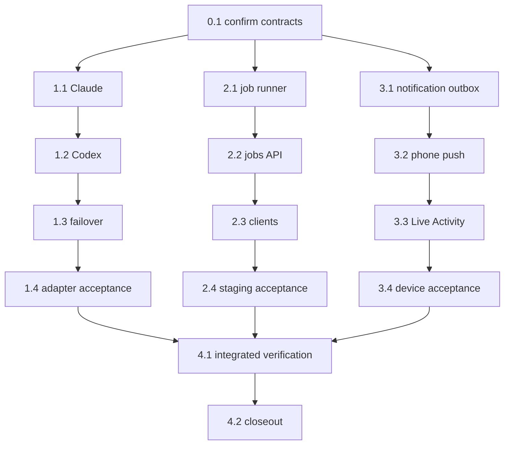

```text
Parent: /strategy/relay-master-plan
Track: B, E, F
Needs Mini: no for injected implementation; yes for live agent, staging, push, and physical-device acceptance
Blocked by: C, E, G and child #5 (all complete)
```

## How to use this document

This is **Relay child plan #7**. It absorbs the previously proposed children **#8** (job artifact + promote) and **#9** (push actions + Live Activity) before either began. The combined child has three independently landable phases:

1. Claude Code, Codex, ordered agent/account failover, and full planning/checkpoint interaction parity across Cursor, Claude, and Codex.
2. Bounded staging jobs, durable artifacts, and explicit promote.
3. Expo Push/APNs delivery and an iOS Live Activity for run status.

Read [Relay — master plan](/strategy/relay-master-plan), [child #3](/strategy/relay-api-plan), [child #4b](/strategy/relay-phone-plan), [child #5](/strategy/relay-cursor-plan), and [child #6](/strategy/relay-mini-ops-plan). Work the shared contract first; after that, the three phases may land independently, but tasks inside each phase stay ordered. Child #7 closes only after all three phases and the integrated closeout pass.

<Warning>
**Hard boundary:** no arbitrary shell endpoint, client-supplied executable or filesystem path, silent account rotation, Cursor-only planning/checkpoint capability, hidden fallback to Cursor for interaction, automatic second agent over a partially edited workspace, production discovery crawl, unattended promote, direct lock-screen mutation, App Store work, or changes inside `Meridian-Mobile`. Secrets, auth directories, staging credentials, APNs keys, and device tokens remain private machine state.
</Warning>

### Before you start (required)

1. Read this How-to, [Engineering conventions](#engineering-conventions-required), [Decision log](#decision-log), and [Task status ledger](#task-status-ledger).
2. Inspect the installed Claude and Codex CLI help plus current official non-interactive/structured-output documentation before fixing argv or event parsers.
3. Inspect the existing `AgentAdapter`, account summaries, runner/store/recovery, mutex, API, web/phone client, notification/deep-link, and Mini private-config seams.
4. For jobs, name and wrap the existing Pivot discovery/rehearsal/admin routes; do not create a second discovery implementation.
5. Keep automated verification offline through injected spawn, transport, clock, filesystem, process, and staging adapters.
6. Stop for explicit authorization before any live vendor login, staging mutation/promote, APNs credential install, native device build, or physical-phone acceptance.

### Agent completion

<Warning>
When a task finishes, pauses, or blocks, update this file in the same PR. A task is not done while its **Implementation notes** remain `_None yet._`. Update the parent ledger when this child becomes `done` or `blocked`.
</Warning>

1. Ledger row and task status agree.
2. Evaluation checkboxes reflect commands actually run.
3. Replace **Implementation notes** with **As built**.
4. Architecture forks update this Decision log and the parent.
5. Append the [Handoff log](#handoff-log).

---

## Overall context

### Phase 1 — agents and failover

Claude Code and Codex implement the existing execution `AgentAdapter` contract beside fake and Cursor. They must also implement the shared interactive-agent contract used by the planning workspace and checkpoint steering. Every agent interaction available through Relay—planning questions and answers, follow-up messages, structured revision proposals, read-only checkpoint questions, explicit checkpoint edit requests, steering context, and recovery—must work with Cursor, Claude, and Codex through the same client/API surface.

A plan or interactive session names its agent/account explicitly. Relay must not route a Claude or Codex interaction through Cursor behind the scenes. When a CLI has durable native session/resume support, the adapter may use it; otherwise Relay reconstructs a fresh bounded session from the persisted sanitized transcript, accepted plan/revision, workspace context, and checkpoint baseline. Vendor-specific events are normalized into the same safe transcript/activity model, and unsupported optional telemetry degrades honestly without removing the interaction itself.

A plan names a primary agent/account and an ordered `failover` list. Relay may move to the next candidate only when the current candidate is unavailable **before work starts**—for example missing configuration, missing executable, or preflight authentication failure. Once a candidate starts an editing session, exit/abort/verification failure is surfaced for recovery or human review; Relay does not stack another agent over unknown partial edits.

### Phase 2 — jobs and promote

Relay runs one bounded discovery or rehearsal job against staging under the existing machine mutex. It persists an artifact containing sources, jobs, stats, memory, and provenance. Promote is a separate, idempotent, human-confirmed replay through existing `/admin/pivot` registry/job seams. It never performs another crawl and never targets production discovery unattended.

### Phase 3 — push and Live Activity

The Mini emits durable notification events for actionable run/checkpoint/job state. Expo Push/APNs delivers them to the private Relay dev client. A notification opens the exact machine and screen; approval, rejection, checkpoint acceptance, and promote remain authenticated in-app actions. Polling stays functional. The iOS Live Activity shows status only and ends reliably at terminal state; Android degrades to ordinary push/polling.

### What we are not building

- Agent round-robin, load balancing, swarm execution, or automatic retries over partial code
- Vendor dashboard scraping, billing management, or copying active OAuth/config directories between machines
- A generic job scheduler, arbitrary backend invocation, production crawler, or new Pivot UI
- Phone promote in the first job slice; laptop web remains the promote home
- Public push service, notification-based bearer transport, direct destructive notification actions, or remote shell actions
- App Store distribution, a second mobile product, Android Live Activities, or changes to `Meridian-Mobile`

---

## Engineering conventions (required)

| Concern | Rule |
| --- | --- |
| Execution adapter | Reuse `start({ cwd, promptFiles })`, `wait()`, and `abort()`; extend shared output/usage types rather than branching the runner per vendor |
| Interactive adapter | One vendor-neutral planning/checkpoint session contract supports message/answer, structured revision proposals, explicit edit requests, streamed safe activity, abort, and recovery for Cursor, Claude, and Codex |
| Interaction parity | Any interaction exposed by the planning interface must be supported for every real agent type. Optional vendor telemetry may be `unknown`; the question/revision/edit interaction itself may not be Cursor-only |
| Session recovery | Prefer a verified native session ID when available; otherwise rebuild a fresh bounded session from persisted sanitized transcript/context. Never claim continuity that the vendor cannot provide |
| CLI execution | Spawn an explicit executable/argv without a shell; verify current CLI contracts in Task 0.1; inject spawn and event streams in tests |
| Accounts | Stable `tool:account` IDs resolve only machine-private env/config names; public account payloads never expose secret values or private roots |
| Failover | Ordered and explicit; pre-start availability only. Once editing starts, no automatic second agent |
| Transcripts | Persist bounded structured events and redacted stdout/stderr under the run; never log prompts containing secrets, tokens, or auth paths |
| Abort/recovery | Terminate only the owned process tree; persist attempt/start identity; restart must not replay a started step or duplicate a process |
| Job scope | Stable allowlisted job kind, city key, and bounded options only; no client paths, URLs, modules, executable names, or raw command input |
| Job ownership | Reuse the machine worker mutex/resource policy; a job and run/manual process cannot both own heavy work |
| Artifact | Versioned durable JSON in private `RELAY_DATA`; include inputs, provenance, sources, jobs, stats, memory, logs, and terminal/error metadata |
| Promote | Artifact-derived allowlist, exact typed city-key confirmation, idempotency key, existing admin seam, no re-crawl, no automatic retry after ambiguous response |
| Notifications | Persist event/outbox before delivery; stable event IDs, dedupe, bounded retry, receipts, token rotation, and injectable transport |
| Mobile | Changes live only in `relay-mobile`; selected `machineId`/`baseUrl` survives every deep link and screen transition |
| Notification actions | Tap/category action opens an authenticated review screen. Mutation still requires the existing in-app confirmation/gate contract |
| Live Activity | Status/progress only, one activity per run, explicit terminal end and stale timeout; no bearer, prompt, logs, or source content |
| Tests | Offline by default. Live CLI, staging, Mini, APNs, and physical-device checks are separately authorized acceptance checkpoints |

---

## Decision log

| Date | Decision |
| --- | --- |
| 2026-08-24 | Former children #8 and #9 are folded into child #7 before implementation. The three phases may land independently; the child closes after all three. |
| 2026-08-24 | Fake remains the explicit offline/test default and Cursor remains the established real adapter. Claude/Codex never silently substitute for a missing selection. |
| 2026-08-24 | Cursor, Claude, and Codex must all support every planning and checkpoint interaction through one vendor-neutral interface, including answering questions, proposing revisions, explicit checkpoint edits, steering, and recovery. No hidden Cursor fallback. |
| 2026-08-24 | Interactive recovery may use verified native resume support or deterministic transcript/context replay; the UI must label recovered sessions honestly and normalize vendor activity into one safe model. |
| 2026-08-24 | Failover is ordered candidate selection before editing begins. After a process starts work, failure parks/fails for review instead of launching another agent over partial edits. |
| 2026-08-24 | Job artifacts and notification outbox state live in private `RELAY_DATA` and recover across API/LaunchAgent restarts. |
| 2026-08-24 | Promote replays artifact-derived registry/jobs through existing Pivot admin seams, requires exact city-key confirmation, and never re-crawls. |
| 2026-08-24 | Notification actions navigate to the correct Relay review surface; approval/reject/accept/promote mutations remain explicit in-app operations. |
| 2026-08-24 | Polling remains a complete fallback. Live Activity is an iOS status surface, not a control surface. |

---

## Task status ledger

| Task | Status | Notes |
| --- | --- | --- |
| 0.1 | pending | Confirm current CLI, Pivot, notification, and native contracts; no code or live mutation |
| 1.1 | pending | Claude adapter and named accounts |
| 1.2 | pending | Codex adapter and named accounts |
| 1.3 | pending | Shared execution/interactive routing, parity, recovery, and ordered pre-start failover |
| 1.4 | pending | Offline adapter matrix and separately authorized live smoke |
| 2.1 | pending | Durable bounded-job runner and artifact store |
| 2.2 | pending | Authenticated jobs API and idempotent promote |
| 2.3 | pending | Web artifact/promote and phone read-only artifact surfaces |
| 2.4 | pending | Separately authorized staging acceptance and rollback |
| 3.1 | pending | Durable notification events, subscriptions, outbox, and sender |
| 3.2 | pending | Relay phone registration, categories, and deep links |
| 3.3 | pending | iOS Live Activity status lifecycle |
| 3.4 | pending | Separately authorized Mini/physical-phone acceptance and rollback |
| 4.1 | pending | Integrated recovery, concurrency, and security matrix |
| 4.2 | pending | Audit, parent closeout, and handoff |

## Execution order



---

## Phase 0 — Contract confirmation

### Task 0.1 — Confirm external and existing contracts

**Status:** `pending`

**Instructions:**

1. Inspect the installed `claude` and `codex` help plus official documentation for non-interactive invocation, multi-turn input, structured/streamed output, cwd, exit status, usage, cancellation, authentication, session identity, and resume behavior. Record exact supported argv/events; do not guess or pin a stale contract.
2. Name the existing execution adapter factory, planning agent, checkpoint session, account configuration, transcript/activity normalization, runner output/recovery, log redaction, and plan `failover` seams.
3. Define the vendor-neutral interactive contract and parity matrix for planning questions/answers, follow-ups, structured revision proposals, read-only checkpoint questions, explicit checkpoint edit requests, steering, abort, and recovery. For each CLI, record native-session versus transcript-replay recovery.
4. Name exact existing Pivot discovery/rehearsal functions and `/admin/pivot` registry/job routes used by run and promote. Record staging environment and idempotency boundaries.
5. Confirm the installed Expo SDK's notification plugin, permission, project/token, category, deep-link, native build, APNs, and Live Activity path. Record whether a maintained module or a small ActivityKit extension is required.
6. Confirm all live acceptance stop points, backup/rollback artifacts, and private configuration locations. Make no product-code change or live vendor/staging/device mutation.

**Evaluation criteria:**

- [ ] Exact current CLI contracts and parser fixtures are recorded
- [ ] One interaction-parity matrix covers Cursor, Claude, and Codex across planning and checkpoints
- [ ] Native resume versus transcript-replay recovery is explicit and honestly represented
- [ ] Existing Pivot functions/routes and staging-only boundary are named
- [ ] Expo/APNs/Live Activity implementation route and native-build impact are named
- [ ] No product code, live login, staging mutation, Mini configuration, or device build occurred

**Implementation notes:**

_None yet._

---

## Phase 1 — Claude, Codex, and failover

### Task 1.1 — Add Claude adapter and named accounts

**Status:** `pending`

**Instructions:**

1. Implement an injected `ClaudeAdapter` through the shared execution interface using only the Task 0.1 verified non-interactive structured-output contract.
2. Resolve named Claude accounts from private configuration names; validate executable/config/auth readiness without exposing paths or values publicly.
3. Stream redacted progress/log events, capture supported usage/duration, persist a vendor-neutral result plus Claude transcript artifacts, and implement owned-process abort.
4. Implement the Claude side of the shared interactive contract for planning questions/answers, follow-ups, revision proposals, checkpoint questions/edit requests, abort, and native-or-replayed recovery.
5. Add offline tests for execution success, multi-turn interaction, structured event fragmentation, stderr/nonzero exit, missing executable/config, abort, recovery, redaction, and unavailable usage.

**Evaluation criteria:**

- [ ] Claude conforms to the shared adapter lifecycle and output schema
- [ ] Claude supports every planning/checkpoint interaction in the parity matrix
- [ ] Named accounts remain private and public summaries contain no secrets/paths
- [ ] Abort and restart behavior cannot kill or duplicate an unrelated process
- [ ] Tests invoke no live Claude account

**Implementation notes:**

_None yet._

### Task 1.2 — Add Codex adapter and named accounts

**Status:** `pending`

**Instructions:**

1. Implement an injected `CodexAdapter` using only the Task 0.1 verified `codex exec` non-interactive structured-output contract.
2. Preserve Relay ownership of cwd, version-control alignment, approvals, verification, and recovery. Do not add cloud tasks, interactive TTY dependence, branch switching, or approval bypasses.
3. Resolve named Codex accounts from private configuration names without copying or exposing a live OAuth/config directory.
4. Implement the Codex side of the shared interactive contract for planning questions/answers, follow-ups, revision proposals, checkpoint questions/edit requests, abort, and native-or-replayed recovery.
5. Add the same structured output, usage, transcript, abort, error, recovery, redaction, and offline fixture coverage as Claude.

**Evaluation criteria:**

- [ ] Codex conforms to the shared lifecycle without a vendor-specific runner branch
- [ ] Codex supports every planning/checkpoint interaction in the parity matrix
- [ ] Relay retains cwd/VC/gate/verification ownership
- [ ] Named account configuration is private and safely reported as available/unavailable
- [ ] Tests invoke no live Codex account

**Implementation notes:**

_None yet._

### Task 1.3 — Unify execution and interactive routing with ordered pre-start failover

**Status:** `pending`

**Instructions:**

1. Extend execution and interactive adapter selection/factory support to fake, Cursor, Claude, and Codex while preserving existing defaults.
2. Route planning drafts and checkpoint sessions through the selected real agent/account using one API/client contract. Questions, follow-ups, revisions, explicit edits, steering, streamed activity, abort, and recovery must not branch at the UI or silently fall back to Cursor.
3. Normalize vendor events into the existing sanitized planning/checkpoint transcript and activity schema. Preserve vendor identity/account in durable state; represent unavailable optional telemetry as `unknown`.
4. Implement native-session or deterministic transcript/context replay recovery for every real agent. Recovered sessions must retain accepted revisions, checkpoint baseline/owned diff, and agent identity without replaying a completed mutation.
5. Build a stable candidate list from the primary `agent/account` and ordered plan `failover`; reject malformed or duplicate candidates deterministically.
6. Preflight candidates in order. Advance only for a classified pre-start availability failure and persist each redacted attempt/reason.
7. Mark the candidate as started before handing it editable work. After that boundary, exit/abort/verification failure parks or fails the run and never triggers another automatic candidate.
8. Attribute usage/transcripts to the selected candidate and ensure restart recovery neither repeats candidate selection over a started step nor spawns duplicates.

**Evaluation criteria:**

- [ ] Primary success does not touch failover candidates
- [ ] Cursor, Claude, and Codex pass the same planning/checkpoint interaction contract
- [ ] Agent identity is explicit end to end and no hidden Cursor fallback exists
- [ ] Native or replay recovery preserves transcript, accepted revision, baseline, and ownership honestly
- [ ] Missing account/executable/preflight auth advances in declared order
- [ ] Runtime or verification failure never launches a second editing agent
- [ ] Attempts, chosen account, usage, and recovery state are durable and redacted

**Implementation notes:**

_None yet._

### Task 1.4 — Verify adapter matrix and authorize live smoke separately

**Status:** `pending`

**Instructions:**

1. Run an offline matrix covering every adapter and account across execution plus planning questions/answers, follow-ups, revision proposal/acceptance, checkpoint questions, explicit checkpoint edits, steering, candidate exhaustion, structured logs, abort, verification, and restart recovery.
2. Scan API/log/artifact output for keys, tokens, private config roots, prompts marked secret, and bearer values.
3. Stop and request explicit authorization for live CLI smoke. If authorized, back up private config and run one harmless fixture task per configured CLI with bounded time/cost; do not use a production workspace.
4. Restore private configuration and prove the fixture workspace is clean. Live smoke is optional for landing injected implementation but required before declaring that vendor operational on the Mini.

**Evaluation criteria:**

- [ ] Offline adapter/failover/recovery matrix passes
- [ ] The same planning-interface tests pass for Cursor, Claude, and Codex without vendor-specific client behavior
- [ ] Secret and boundary scans pass
- [ ] No live call occurs without explicit authorization and bounded fixture scope
- [ ] Any authorized smoke records rollback and post-state without printing credentials

**Implementation notes:**

_None yet._

---

## Phase 2 — Bounded jobs and promote

### Task 2.1 — Add durable job runner and artifact store

**Status:** `pending`

**Instructions:**

1. Define versioned job request/state/artifact types with stable statuses, timestamps, machine/owner, city key, bounded inputs, provenance, sources, jobs, stats, memory, logs, usage, and terminal error metadata.
2. Add a durable private store under `RELAY_DATA` with atomic writes and restart-safe queued/running/terminal reconciliation.
3. Wrap the exact existing Pivot rehearsal/discovery seams named in Task 0.1 behind an injected job adapter. Do not rewrite discovery or accept arbitrary module/function/URL/path input.
4. Reuse the machine mutex/profile/memory policy so a job excludes runs, checkpoint editing, and manual previews. Add owned abort/cleanup and offline fixtures for success, failure, stop, restart, and corrupt/legacy records.

**Evaluation criteria:**

- [ ] Artifact contains the locked sources/jobs/stats/memory contract and provenance
- [ ] State survives restart without duplicating an ambiguous running job
- [ ] Only allowlisted job kinds and bounded values reach the adapter
- [ ] Heavy-work mutual exclusion and cleanup pass offline

**Implementation notes:**

_None yet._

### Task 2.2 — Add jobs API and idempotent promote

**Status:** `pending`

**Instructions:**

1. Replace honest `501` stubs with bearer-protected create/list/get/log/stop routes using stable job kinds and bounded request schemas.
2. Return artifact/status/log offsets without credentials, private absolute paths, raw environment values, or arbitrary backend response dumps.
3. Implement promote only for a successful promotable artifact. Require exact typed city key and an idempotency key; derive the allowlisted registry/job replay payload from the stored artifact.
4. Call only the Task 0.1 existing staging/admin seam. Do not crawl again. Treat timeouts/ambiguous responses as `promotion-unknown` requiring review, never blind retry.
5. Persist promotion attempt/result/audit metadata and cover auth, validation, conflict, idempotency, mismatch, partial/ambiguous response, and restart offline.

**Evaluation criteria:**

- [ ] Job routes are authenticated, bounded, durable, and client-neutral
- [ ] Promote requires successful artifact, exact city key, and idempotency
- [ ] Promote replays stored allowlisted data and performs no crawl
- [ ] Ambiguous mutation is reviewable and never automatically repeated

**Implementation notes:**

_None yet._

### Task 2.3 — Add web artifact/promote and phone artifact views

**Status:** `pending`

**Instructions:**

1. Replace the BoardUI web Job stub with start/status/log/artifact views for sources, jobs, stats, memory, provenance, errors, and promotion audit.
2. Keep promote on web first. Require an explicit confirmation view and exact typed city key; disable it unless the artifact is successful/promotable and surface unknown outcomes safely.
3. Replace the Relay phone `501` view with read-only job status/artifact/log and machine-aware deep-link support. Do not add phone promote in this task.
4. Add client tests for loading/empty/partial/failure/promotable/promoted/unknown states and ensure large JSON cannot freeze or expose private fields.

**Evaluation criteria:**

- [ ] Web uses existing BoardUI and exposes a deliberate typed-confirm promote flow
- [ ] Phone shows an honest read-only artifact on the selected machine
- [ ] Clients handle partial/unknown states and bounded logs
- [ ] No new discovery implementation or phone promote exists

**Implementation notes:**

_None yet._

### Task 2.4 — Run separately authorized staging acceptance and rollback

**Status:** `pending`

**Instructions:**

1. Stop for explicit staging authorization and confirm the exact test city, environment, bounds, expected source/job count, credentials, backup, and rollback.
2. Run rehearsal first, inspect the persisted artifact, restart Relay once, and prove job/artifact ownership recovers without duplicates.
3. Stop again before promote. If explicitly approved, promote only the reviewed artifact for the typed test city and verify idempotent replay through existing admin state.
4. Stop/clean job ownership, restore private configuration, preserve redacted acceptance evidence, and prove no production crawl or unrelated tenant mutation occurred.

**Evaluation criteria:**

- [ ] Rehearsal and any promote were separately authorized and bounded
- [ ] Artifact and restart recovery match offline contracts
- [ ] Promote, if run, is idempotent and does not re-crawl
- [ ] Rollback/post-state and staging-only boundary pass

**Implementation notes:**

_None yet._

---

## Phase 3 — Push notifications and Live Activity

### Task 3.1 — Add durable notification events, subscriptions, and outbox

**Status:** `pending`

**Instructions:**

1. Define versioned machine-scoped notification subscriptions and events for gate ready, checkpoint ready, run done/failed/stopped, job done/failed, and promotion outcome.
2. Persist device tokens privately and expose authenticated register/unregister rotation routes. Never return all tokens, include them in logs, or put the Relay bearer in notification data.
3. Persist outbox events before send with stable IDs, dedupe keys, bounded exponential retry, terminal/dead-letter state, receipts, and restart-safe reconciliation.
4. Add an injected Expo Push/APNs transport and emit only from durable state transitions. Polling and existing API behavior remain complete when push is unavailable.
5. Test token validation/rotation, duplicate transitions, retry/receipt failure, restart, redaction, and multi-machine routing offline.

**Evaluation criteria:**

- [ ] Durable transitions produce at most one logical notification event
- [ ] Tokens/outbox recover privately across restart and delivery failures
- [ ] No token, bearer, prompt, log content, or secret reaches public payloads
- [ ] Polling remains fully functional with sender disabled

**Implementation notes:**

_None yet._

### Task 3.2 — Add Relay phone registration, categories, and deep links

**Status:** `pending`

**Instructions:**

1. Configure notifications in `relay-mobile` only using the Task 0.1 verified Expo SDK/native-build contract. Ask permission in context; denial leaves polling intact.
2. Obtain/rotate the correct project/device token and register it only with the selected machine after authenticated consent. Unregister invalid/revoked tokens where supported.
3. Define categories/actions whose only effect is opening the exact machine Run, Gate, Checkpoint, or Job review screen. Existing authenticated in-app confirmation performs mutations.
4. Handle foreground/background/cold-start/deleted-machine/malformed/duplicate notification paths and display no secret or sensitive source/log text on the lock screen.
5. Add mocked mobile tests; do not install APNs credentials or build a physical device yet.

**Evaluation criteria:**

- [ ] Registration is explicit, machine-scoped, rotatable, and private
- [ ] Every notification opens the correct authenticated review surface
- [ ] Notification actions cannot directly approve, reject, edit, stop, or promote
- [ ] Denied/unavailable push falls back cleanly to polling

**Implementation notes:**

_None yet._

### Task 3.3 — Add iOS Live Activity status lifecycle

**Status:** `pending`

**Instructions:**

1. Implement the Task 0.1 chosen native route inside the private Relay app only. Keep the smallest status model: machine/run label, phase/step progress, state, gate indicator, and updated time.
2. Start at accepted/running work, update from durable state, and end on done/failed/stopped with a stale timeout. Reconcile app/Mini restarts without duplicate activities.
3. If remote ActivityKit updates are used, store push-to-start/update tokens privately with the same rotation/outbox discipline. Never embed bearer, account, prompt, logs, paths, or artifact content.
4. Make unsupported iOS/Android/simulator paths explicit no-ops with ordinary push/polling. Add reducer/payload/lifecycle tests and native config validation without a live credential/device.

**Evaluation criteria:**

- [ ] One minimal activity follows the run lifecycle and reliably ends
- [ ] Restart, stale, duplicate, unsupported-platform, and terminal paths are tested
- [ ] Activity payload contains status only and no control capability or secret
- [ ] No App Store, `Meridian-Mobile`, or Android native scope is introduced

**Implementation notes:**

_None yet._

### Task 3.4 — Run separately authorized Mini and physical-phone acceptance

**Status:** `pending`

**Instructions:**

1. Stop for explicit authorization. Back up private Relay env/subscriptions, native config/entitlements, and any APNs/Expo credentials without printing values; define rollback first.
2. Build/load the private Relay dev client on the physical iPhone, grant notification permission, and register against the selected Mini.
3. Exercise a controlled fake run through gate, checkpoint, done, failure, background, locked, cold-start, and Relay restart. Verify exactly-once navigation and no direct notification mutation.
4. Exercise Live Activity start/update/gate/terminal/stale/restart behavior and prove ordinary polling works with push disabled.
5. Remove test subscriptions/events/credentials as required, restore original private configuration, and preserve redacted acceptance evidence.

**Evaluation criteria:**

- [ ] Physical push and deep links work for foreground/background/locked/cold start
- [ ] Live Activity starts, updates, recovers, and ends without duplicates
- [ ] Push-disabled polling and restart recovery pass
- [ ] Private config/credentials/tokens are restored or intentionally retained with recorded consent

**Implementation notes:**

_None yet._

---

## Phase 4 — Integrated closeout

### Task 4.1 — Verify integrated recovery, concurrency, and security

**Status:** `pending`

**Instructions:**

1. Run one offline scenario where each real agent type answers a planning question, proposes a revision, answers a checkpoint question, and processes an explicit checkpoint edit through the same interface; then primary preflight fails, the declared fallback reaches a gate, a notification event is deduped, and restart recovers the gate without a second agent or notification.
2. Run one offline job scenario from bounded start through artifact, notification, typed-confirm promote, ambiguous-response handling, restart, and idempotent review.
3. Prove run/job/manual ownership conflicts and memory policy permit only the intended heavy owner.
4. Run Relay unit/integration/build/typecheck plus web and mobile suites. Scan for shell execution, arbitrary client paths/argv, secrets/tokens, production discovery, direct push mutation, `Meridian-Mobile`, and unrelated surface changes.
5. Record live acceptance separately; an unavailable external service must not invalidate deterministic implementation proof.

**Evaluation criteria:**

- [ ] Integrated adapter/gate/push/restart scenario passes without duplicates
- [ ] Planning and checkpoint interaction parity passes for Cursor, Claude, and Codex
- [ ] Integrated job/artifact/promote/restart scenario passes idempotently
- [ ] Heavy ownership, abort, redaction, and scope scans pass
- [ ] Relay, web, and mobile verification is green or every exception is recorded

**Implementation notes:**

_None yet._

### Task 4.2 — Audit and close child #7

**Status:** `pending`

**Instructions:**

1. Audit every task, evaluation checkbox, As built section, decision, test command, acceptance record, and rollback artifact.
2. Confirm no adjacent scope entered the child: round-robin/swarm, generic shell/job scheduler, production crawl, phone promote, direct lock-screen mutation, App Store work, or `Meridian-Mobile`.
3. Update the parent ledger: child #7 `done`; former #8/#9 remain `skipped` with the folded-into-#7 explanation and no claim that they were separately implemented.
4. Update related docs and append final handoff with exact commits, remaining operational credentials/acceptance, and rollback notes.

**Evaluation criteria:**

- [ ] Every completed task has checked evidence and As built notes
- [ ] Parent and child ledgers agree about combined scope
- [ ] Boundary audit and final verification pass
- [ ] Handoff distinguishes implemented, live-accepted, and still-operator-configured state

**Implementation notes:**

_None yet._

---

## Handoff log

| Date | Task | Result | Next |
| --- | --- | --- | --- |
| 2026-08-24 | Plan creation | Combined former children #7/#8/#9 into one independently gated child plan. No product code, live vendor call, staging mutation, Mini configuration, native build, or device action. | Execute Task 0.1 only. |
