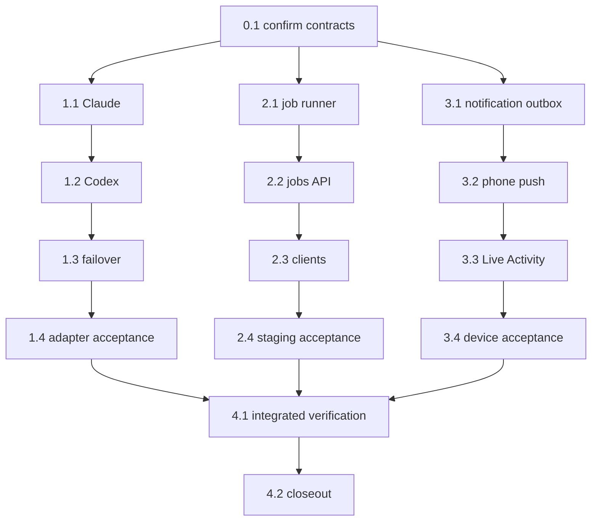

```text
Parent: /strategy/relay-master-plan
Track: B, E, F
Needs Mini: no for injected implementation; yes for live agent, staging, push, and physical-device acceptance
Blocked by: C, E, G and child #5 (all complete)
```

## How to use this document

This is **Relay child plan #7**. It absorbs the previously proposed children **#8** (job artifact + promote) and **#9** (push actions + Live Activity) before either began. The combined child has three independently landable phases:

1. Claude Code, Codex, ordered agent/account failover, and full planning/checkpoint interaction parity across Cursor, Claude, and Codex.
2. Bounded staging jobs, durable artifacts, and explicit promote.
3. Expo Push/APNs delivery and an iOS Live Activity for run status.

Read [Relay — master plan](/strategy/relay-master-plan), [child #3](/strategy/relay-api-plan), [child #4b](/strategy/relay-phone-plan), [child #5](/strategy/relay-cursor-plan), and [child #6](/strategy/relay-mini-ops-plan). Work the shared contract first; after that, the three phases may land independently, but tasks inside each phase stay ordered. Child #7 closes only after all three phases and the integrated closeout pass.

<Warning>
**Hard boundary:** no arbitrary shell endpoint, client-supplied executable or filesystem path, silent account rotation, Cursor-only planning/checkpoint capability, hidden fallback to Cursor for interaction, automatic second agent over a partially edited workspace, production discovery crawl, unattended promote, direct lock-screen mutation, App Store work, or changes inside `Meridian-Mobile`. Secrets, auth directories, staging credentials, APNs keys, and device tokens remain private machine state.
</Warning>

### Before you start (required)

1. Read this How-to, [Engineering conventions](#engineering-conventions-required), [Decision log](#decision-log), and [Task status ledger](#task-status-ledger).
2. Inspect the installed Claude and Codex CLI help plus current official non-interactive/structured-output documentation before fixing argv or event parsers.
3. Inspect the existing `AgentAdapter`, account summaries, runner/store/recovery, mutex, API, web/phone client, notification/deep-link, and Mini private-config seams.
4. For jobs, name and wrap the existing Pivot discovery/rehearsal/admin routes; do not create a second discovery implementation.
5. Keep automated verification offline through injected spawn, transport, clock, filesystem, process, and staging adapters.
6. Stop for explicit authorization before any live vendor login, staging mutation/promote, APNs credential install, native device build, or physical-phone acceptance.

### Agent completion

<Warning>
When a task finishes, pauses, or blocks, update this file in the same PR. A task is not done while its **Implementation notes** remain `_None yet._`. Update the parent ledger when this child becomes `done` or `blocked`.
</Warning>

1. Ledger row and task status agree.
2. Evaluation checkboxes reflect commands actually run.
3. Replace **Implementation notes** with **As built**.
4. Architecture forks update this Decision log and the parent.
5. Append the [Handoff log](#handoff-log).

---

## Overall context

### Phase 1 — agents and failover

Claude Code and Codex implement the existing execution `AgentAdapter` contract beside fake and Cursor. They must also implement the shared interactive-agent contract used by the planning workspace and checkpoint steering. Every agent interaction available through Relay—planning questions and answers, follow-up messages, structured revision proposals, read-only checkpoint questions, explicit checkpoint edit requests, steering context, and recovery—must work with Cursor, Claude, and Codex through the same client/API surface.

A plan or interactive session names its agent/account explicitly. Relay must not route a Claude or Codex interaction through Cursor behind the scenes. When a CLI has durable native session/resume support, the adapter may use it; otherwise Relay reconstructs a fresh bounded session from the persisted sanitized transcript, accepted plan/revision, workspace context, and checkpoint baseline. Vendor-specific events are normalized into the same safe transcript/activity model, and unsupported optional telemetry degrades honestly without removing the interaction itself.

A plan names a primary agent/account and an ordered `failover` list. Relay may move to the next candidate only when the current candidate is unavailable **before work starts**—for example missing configuration, missing executable, or preflight authentication failure. Once a candidate starts an editing session, exit/abort/verification failure is surfaced for recovery or human review; Relay does not stack another agent over unknown partial edits.

### Phase 2 — jobs and promote

Relay runs one bounded discovery or rehearsal job against staging under the existing machine mutex. It persists an artifact containing sources, jobs, stats, memory, and provenance. Promote is a separate, idempotent, human-confirmed replay through existing `/admin/pivot` registry/job seams. It never performs another crawl and never targets production discovery unattended.

### Phase 3 — push and Live Activity

The Mini emits durable notification events for actionable run/checkpoint/job state. Expo Push/APNs delivers them to the private Relay dev client. A notification opens the exact machine and screen; approval, rejection, checkpoint acceptance, and promote remain authenticated in-app actions. Polling stays functional. The iOS Live Activity shows status only and ends reliably at terminal state; Android degrades to ordinary push/polling.

### What we are not building

- Agent round-robin, load balancing, swarm execution, or automatic retries over partial code
- Vendor dashboard scraping, billing management, or copying active OAuth/config directories between machines
- A generic job scheduler, arbitrary backend invocation, production crawler, or new Pivot UI
- Phone promote in the first job slice; laptop web remains the promote home
- Public push service, notification-based bearer transport, direct destructive notification actions, or remote shell actions
- App Store distribution, a second mobile product, Android Live Activities, or changes to `Meridian-Mobile`

---

## Engineering conventions (required)

| Concern | Rule |
| --- | --- |
| Execution adapter | Reuse `start({ cwd, promptFiles })`, `wait()`, and `abort()`; extend shared output/usage types rather than branching the runner per vendor |
| Interactive adapter | One vendor-neutral planning/checkpoint session contract supports message/answer, structured revision proposals, explicit edit requests, streamed safe activity, abort, and recovery for Cursor, Claude, and Codex |
| Interaction parity | Any interaction exposed by the planning interface must be supported for every real agent type. Optional vendor telemetry may be `unknown`; the question/revision/edit interaction itself may not be Cursor-only |
| Session recovery | Prefer a verified native session ID when available; otherwise rebuild a fresh bounded session from persisted sanitized transcript/context. Never claim continuity that the vendor cannot provide |
| CLI execution | Spawn an explicit executable/argv without a shell; verify current CLI contracts in Task 0.1; inject spawn and event streams in tests |
| Accounts | Stable `tool:account` IDs resolve only machine-private env/config names; public account payloads never expose secret values or private roots |
| Failover | Ordered and explicit; pre-start availability only. Once editing starts, no automatic second agent |
| Transcripts | Persist bounded structured events and redacted stdout/stderr under the run; never log prompts containing secrets, tokens, or auth paths |
| Abort/recovery | Terminate only the owned process tree; persist attempt/start identity; restart must not replay a started step or duplicate a process |
| Job scope | Stable allowlisted job kind, city key, and bounded options only; no client paths, URLs, modules, executable names, or raw command input |
| Job ownership | Reuse the machine worker mutex/resource policy; a job and run/manual process cannot both own heavy work |
| Artifact | Versioned durable JSON in private `RELAY_DATA`; include inputs, provenance, sources, jobs, stats, memory, logs, and terminal/error metadata |
| Promote | Artifact-derived allowlist, exact typed city-key confirmation, idempotency key, existing admin seam, no re-crawl, no automatic retry after ambiguous response |
| Notifications | Persist event/outbox before delivery; stable event IDs, dedupe, bounded retry, receipts, token rotation, and injectable transport |
| Mobile | Changes live only in `relay-mobile`; selected `machineId`/`baseUrl` survives every deep link and screen transition |
| Notification actions | Tap/category action opens an authenticated review screen. Mutation still requires the existing in-app confirmation/gate contract |
| Live Activity | Status/progress only, one activity per run, explicit terminal end and stale timeout; no bearer, prompt, logs, or source content |
| Tests | Offline by default. Live CLI, staging, Mini, APNs, and physical-device checks are separately authorized acceptance checkpoints |

---

## Decision log

| Date | Decision |
| --- | --- |
| 2026-08-24 | Former children #8 and #9 are folded into child #7 before implementation. The three phases may land independently; the child closes after all three. |
| 2026-08-24 | Fake remains the explicit offline/test default and Cursor remains the established real adapter. Claude/Codex never silently substitute for a missing selection. |
| 2026-08-24 | Cursor, Claude, and Codex must all support every planning and checkpoint interaction through one vendor-neutral interface, including answering questions, proposing revisions, explicit checkpoint edits, steering, and recovery. No hidden Cursor fallback. |
| 2026-08-24 | Interactive recovery may use verified native resume support or deterministic transcript/context replay; the UI must label recovered sessions honestly and normalize vendor activity into one safe model. |
| 2026-08-24 | Failover is ordered candidate selection before editing begins. After a process starts work, failure parks/fails for review instead of launching another agent over partial edits. |
| 2026-08-24 | Job artifacts and notification outbox state live in private `RELAY_DATA` and recover across API/LaunchAgent restarts. |
| 2026-08-24 | Promote replays artifact-derived registry/jobs through existing Pivot admin seams, requires exact city-key confirmation, and never re-crawls. |
| 2026-08-24 | Notification actions navigate to the correct Relay review surface; approval/reject/accept/promote mutations remain explicit in-app operations. |
| 2026-08-24 | Polling remains a complete fallback. Live Activity is an iOS status surface, not a control surface. |
| 2026-08-24 | Task 0.1 locked Claude Code 2.1.220 `claude -p` stream-json as the Claude execution/interactive spawn. Codex is not installed on this machine; Task 1.2 must re-verify `codex exec --help` after an authorized install and must not invent flags. |
| 2026-08-24 | Claude and Codex may persist a verified native session/thread ID and resume it. Cursor planning/checkpoint recovery stays transcript/context replay. Recovered UI must stay labeled recovered and must not claim vendor continuity Cursor cannot provide. |
| 2026-08-24 | Task 1.1 keeps `POST /drafts` cursor-only. Claude planning/checkpoint work through existing draft/run agent fields and injected spawn; Task 1.3 opens client routing and failover. Checkpoint `usage.tool` is `Tool`, not hardcoded `"cursor"`. |
| 2026-08-24 | Task 1.2 implements Codex from the documented `codex exec` contract (`--json`, `--sandbox read-only|workspace-write`, `--output-schema` file, `-o`, `exec resume <thread_id>`, `--add-dir`). `codex` remains absent on PATH; live `codex exec --help` is Task 1.4. Do not pass `--last`, `--ephemeral`, `codex cloud`, `--sandbox danger-full-access`, `--dangerously-bypass-approvals-and-sandbox`, or `--full-auto`. |
| 2026-08-24 | Task 1.3 opens `POST /drafts` and the phone planner to cursor/claude/codex with no hidden Cursor fallback. Failover is `[primary, ...plan.failover]` unique by `tool`+`account`; duplicate failover entries fail parse. Advance only for `not configured` / `missing executable` / `missing ENV` before `start()`. After `selectedPhaseAgents` is persisted, abort/exit/verify never starts another candidate. `--adapter cursor|claude|codex` and `RELAY_ADAPTER` enable real routing without substituting a different vendor. |
| 2026-08-24 | Task 1.4 lands injected Phase 1 without live vendor smoke. Re-verified `claude` 2.1.220; `codex` still absent. Live fixture tasks stay blocked until explicit authorization plus RELAY_DATA backup. Existing `run.mutex` / GET `logPath` remain RELAY_DATA paths from earlier children; public planning/account/checkpoint payloads must not include secrets, bearer, or `apiKeyEnv`. |
| 2026-08-24 | Allowlisted job kinds: `discovery-rehearsal` (not promotable) and bounded staging `city-source-discovery`. Promote replays artifact rows through existing admin source/job functions and never calls discover/rehearse/crawl run routes. |
| 2026-08-24 | Push uses `expo-notifications` on the current Expo SDK 54 Relay dev client plus a new private EAS project for `app.relay`. Live Activities use a small ActivityKit extension in `relay-mobile`; first-party `expo-widgets` requires SDK 55+ and is out of this child. |
| 2026-08-24 | Task 2.1 job records are version 1 under `RELAY_DATA/jobs/<id>/{state,artifact,log}`. Statuses queued, running, and stopping hold `run.lock`; done, failed, and stopped release it. Restart fails ambiguous active jobs and best-effort stops the vendor run; it never starts a second Pivot job. HTTP create/list/promote stay 501 until Task 2.2. |
| 2026-08-24 | Task 2.2 jobs HTTP is bearer-protected create/list/get/log/stop/promote. Public payloads omit `mutex`, `logPath`, credentials, and private absolute paths. Promote requires `done` + `promotable` + exact `cityKey` + idempotency key, replays stored allowlisted rows only, and never crawls. Timeouts and ambiguous Pivot responses persist `promotion-unknown` with partial counts; later calls return that stored result and do not replay, including a different idempotency key. `persistOutcome` is exported for generic-site qualified replay only. Serve still does not default-wire Pivot adapter or promote `req` (Task 2.4). |
| 2026-08-24 | Task 2.3 web uses BoardUI for start/list/detail/log/artifact and typed-confirm promote (exact city key). Phone is read-only list/detail/log on the selected `machineId`/`baseUrl` with no promote/start/stop. Clients bound tables to 50 rows and logs to a tail, and strip `mutex`/`logPath`/credentials. React Navigation `relay://` linking remains Task 3.2. |
| 2026-08-24 | Task 2.4 live staging rehearsal/discovery/promote was not authorized and was not run. Exact test city, bounds, credentials, and RELAY_DATA backup remain operator-chosen at authorization. `relay serve` still does not default-wire Pivot `jobAdapter` / promote seams / `createReq`. Offline HTTP scenario covers rehearsal → restart without a second vendor start → idempotent promote with no crawl. |
| 2026-08-24 | Task 3.1 notification events, subscriptions, and outbox live under private `RELAY_DATA/notifications`. Register/rotate/unregister are bearer-protected and never return tokens. Outbox persists before send with stable IDs, per-transition dedupe, bounded exponential retry, receipts, and restart `sending` → `retrying`. Expo Push transport is injected; `relay serve` does not default-wire live Expo/APNs. Polling remains complete when the sender is disabled. |
| 2026-08-24 | Task 3.2 registers `expo-notifications` on the Relay phone only. Permission is requested from Enable alerts. Project id comes from `EXPO_PUBLIC_EAS_PROJECT_ID` (no `eas.json` / `eas init`). Categories are open-only. `relay://` and notification data resolve `baseUrl` from configured machines. Denied/unavailable keep polling. Live APNs/device remains Task 3.4. |
| 2026-08-24 | Task 3.3 Live Activities are a small ActivityKit widget extension in `relay-mobile` (config plugin + Swift status model). Phone polling starts/updates/ends one activity per run. No remote ActivityKit push tokens. Simulator, Android, and unavailable ActivityKit are explicit no-ops. Status/progress only; no lock-screen mutation. Native device build remains Task 3.4. |
| 2026-08-24 | Task 3.4 live Mini/physical-phone APNs, EAS project, native device build, and lock-screen acceptance were not authorized with credentials/backup and were not run. Offline HTTP + phone acceptance covers gate/checkpoint/done/failure, restart dedupe, push-disabled polling, open-only routing, and Live Activity start/update/end/stale. `relay serve` still does not wire live Expo/APNs. |
| 2026-08-24 | Task 4.1 is offline integrated proof only. Unavailable live CLI, staging, Mini, APNs, and device services do not invalidate the injected matrix. Live acceptance stays separately authorized. |
| 2026-08-24 | Task 4.2 closed combined child #7. Injected Claude/Codex/failover, jobs/promote, and push/Live Activity are done. Live CLI/staging/APNs/device remain operator-gated. Former #8/#9 stay skipped and were not separately implemented. |

---

## Task status ledger

| Task | Status | Notes |
| --- | --- | --- |
| 0.1 | done | 2026-08-24: CLI/adapter/Pivot/Expo contracts recorded; no product code or live mutation |
| 1.1 | done | 2026-08-24: injected ClaudeAdapter, named accounts, planning/checkpoint parity; offline tests only |
| 1.2 | done | 2026-08-24: injected CodexAdapter, named accounts, planning/checkpoint parity; CLI still absent; offline tests only |
| 1.3 | done | 2026-08-24: shared routing, POST /drafts all tools, ordered pre-start failover; offline tests only |
| 1.4 | done | 2026-08-24: offline adapter/failover/recovery matrix and secret scan; live CLI smoke not authorized |
| 2.1 | done | 2026-08-24: durable job runner, artifact store, injected Pivot adapter, mutex/recovery; offline tests only |
| 2.2 | done | 2026-08-24: bearer jobs API, idempotent artifact promote, persistOutcome export; offline tests only |
| 2.3 | done | 2026-08-24: web start/artifact/typed-confirm promote; phone read-only artifact; offline client tests |
| 2.4 | done | 2026-08-24: offline rehearsal/restart/promote scenario; live staging not authorized, not run |
| 3.1 | done | 2026-08-24: durable events/outbox/subscriptions, injected Expo transport; offline tests only |
| 3.2 | done | 2026-08-24: Relay phone registration, open-only categories, `relay://` linking; mocked tests only |
| 3.3 | done | 2026-08-24: ActivityKit status lifecycle, config plugin, mocked tests; no device build |
| 3.4 | done | 2026-08-24: offline push/Live Activity acceptance; live Mini/phone/APNs not authorized, not run |
| 4.1 | done | 2026-08-24: offline integrated adapter/job/ownership/scope matrix; live CLI/staging/APNs not authorized |
| 4.2 | done | 2026-08-24: child #7 closed; parent #7 done; former #8/#9 skipped not separately implemented |

## Execution order



---

## Phase 0 — Contract confirmation

### Task 0.1 — Confirm external and existing contracts

**Status:** `done`

**Instructions:**

1. Inspect the installed `claude` and `codex` help plus official documentation for non-interactive invocation, multi-turn input, structured/streamed output, cwd, exit status, usage, cancellation, authentication, session identity, and resume behavior. Record exact supported argv/events; do not guess or pin a stale contract.
2. Name the existing execution adapter factory, planning agent, checkpoint session, account configuration, transcript/activity normalization, runner output/recovery, log redaction, and plan `failover` seams.
3. Define the vendor-neutral interactive contract and parity matrix for planning questions/answers, follow-ups, structured revision proposals, read-only checkpoint questions, explicit checkpoint edit requests, steering, abort, and recovery. For each CLI, record native-session versus transcript-replay recovery.
4. Name exact existing Pivot discovery/rehearsal functions and `/admin/pivot` registry/job routes used by run and promote. Record staging environment and idempotency boundaries.
5. Confirm the installed Expo SDK's notification plugin, permission, project/token, category, deep-link, native build, APNs, and Live Activity path. Record whether a maintained module or a small ActivityKit extension is required.
6. Confirm all live acceptance stop points, backup/rollback artifacts, and private configuration locations. Make no product-code change or live vendor/staging/device mutation.

**Evaluation criteria:**

- [x] Exact current CLI contracts and parser fixtures are recorded
- [x] One interaction-parity matrix covers Cursor, Claude, and Codex across planning and checkpoints
- [x] Native resume versus transcript-replay recovery is explicit and honestly represented
- [x] Existing Pivot functions/routes and staging-only boundary are named
- [x] Expo/APNs/Live Activity implementation route and native-build impact are named
- [x] No product code, live login, staging mutation, Mini configuration, or device build occurred

**As built** (2026-08-24)

Inspected installed `claude` 2.1.220 at `~/.local/bin/claude`, official Claude headless/CLI docs, official Codex `exec` docs (CLI absent here), existing Relay adapter/planning/checkpoint/API/phone/web seams, Pivot discovery/rehearsal/admin routes, and Expo SDK 54 vs Live Activity options. No product code, live vendor login, staging write, Mini config, APNs install, or device build.

### 1. CLI contracts (parser fixtures for Tasks 1.1–1.2)

**Claude Code 2.1.220** — spawn `claude` with `shell: false`. There is no `--cwd`; set process `cwd` to the step workspace. Do not pass `--dangerously-skip-permissions`, `--bg`, or `--cloud`.

| Concern | Verified contract |
| --- | --- |
| Non-interactive | `-p` / `--print` plus prompt argv (or stdin, 10MB cap) |
| Structured stream | `--output-format stream-json --verbose`; add `--include-partial-messages` for token deltas |
| Final JSON | `--output-format json` result includes `result`, `session_id`, `total_cost_usd`, `usage`, `num_turns`, `duration_ms`; `--json-schema` puts validated output in `structured_output` |
| Multi-turn | Same process: `--input-format stream-json`. Later turn: `-p --resume <session_id>` (or `-r`). `--session-id <uuid>` pins a new session. `--no-session-persistence` forbids resume |
| Extra repos | `--add-dir <dir>` (must exist) |
| Permissions | Execution: `--permission-mode acceptEdits` (not bypass). Planning/read-only checkpoint: `--permission-mode dontAsk` and `--tools`/`--allowedTools` limited to read tools. Checkpoint edits: allow Edit, still deny Git/shell |
| Bare/auth | `--bare` for scripted runs: Anthropic auth is `ANTHROPIC_API_KEY` or `apiKeyHelper` via `--settings`; OAuth/keychain are not read. Named accounts map only to private env names. Preflight: executable present plus key-or-`claude auth status` (exit 0 logged in, 1 not). Never copy `~/.claude` |
| Exit / cancel | 0 success; non-zero failure (auth/invalid flag before start). SIGINT ends the turn; SIGTERM exits **143**, kills the Bash tree, leaves the turn unfinished. Adapter `abort()` must SIGTERM the owned process group only |
| Stream events to persist/normalize | `system`/`init` (session metadata, `capabilities`); `system`/`api_retry`; `assistant` / `user` (incl. `tool_use` / `tool_result`); `stream_event` with `event.delta.type === "text_delta"`; terminal `result`. Optional: `prompt_suggestion`, hook events. Ignore unknown types. Redact secrets/paths; drop tool args/results from public activity |

Execution argv shape:

```text
claude --bare -p --output-format stream-json --verbose --include-partial-messages
  --permission-mode acceptEdits --session-id <uuid-or-omit>
  [--resume <session_id>] [--add-dir <extra-repo> ...]
  <prompt>
```

Interactive/planning argv uses `--json-schema` matching `PlanningAgentResponse` / checkpoint answer shape, `--permission-mode dontAsk` (or Edit-only for explicit checkpoint edits), and the same stream-json parser.

**Codex** — `codex` is **not on PATH**. Do not install it in this task. Task 1.2 must run `codex exec --help` after authorized install and fail closed on drift. Official 2026 docs (`https://developers.openai.com/codex/noninteractive`, CLI reference):

| Concern | Documented contract (re-verify on install) |
| --- | --- |
| Non-interactive | `codex exec` / `codex e`; prompt argv or stdin (`codex exec -`) |
| Structured stream | `--json` → JSONL on stdout. Types: `thread.started` (`thread_id`), `turn.started`, `item.started` / `item.completed` (`command_execution`, `agent_message`, …), `turn.completed` (`usage.input_tokens`, `cached_input_tokens`, `output_tokens`, `reasoning_output_tokens`), `turn.failed`, `error`. Ignore unknown types |
| Structured final | `--output-schema <file>` plus `-o` / `--output-last-message <file>` |
| Multi-turn / resume | Persist `thread_id` from `thread.started`. Follow-up: `codex exec resume <thread_id>` (or `--last` only as a last-resort same-cwd operator tool, not Relay recovery). `--output-schema` is valid on resume. `--ephemeral` disables resume — do not use for interactive sessions |
| Cwd / sandbox | Spawn `cwd` = step workspace. Editing sessions: `--sandbox workspace-write`. Read-only planning/checkpoint questions: `--sandbox read-only`. Never `--sandbox danger-full-access` or `--dangerously-bypass-approvals-and-sandbox`. Do not use deprecated `--full-auto` in new code. Do not use `codex cloud` / TTY |
| Auth | `CODEX_API_KEY` is exec-only (named private env). Otherwise `codex login status` exit 0. Never copy `~/.codex` / `auth.json` |
| Usage | Token fields on `turn.completed`; cost may be `unknown` (`vendorRemaining` already uses that). Duration from adapter wall clock if the CLI omits it |
| Cancel | Terminate the owned `codex exec` process group; do not signal unrelated Codex daemons |

### 2. Existing Relay seams

| Seam | Location | Current behavior child #7 must extend |
| --- | --- | --- |
| Execution contract | `relay/src/adapters/types.ts` `AgentAdapter` | Unchanged `start({ cwd, promptFiles, account?, env? })` / `wait()` / `abort()`. Result `usage?: { tokens, costUsd, durationMs }` |
| Factory | `relay/src/adapters/factory.ts` `createAdapterFactory` | `AdapterSelection` is `"fake" \| "cursor"`. Non-cursor phases throw `` `${agent} adapter not implemented` ``. CLI `relay run` `--adapter` accepts only `cursor` (default fake) |
| Cursor execution | `relay/src/adapters/cursor.ts` | `@cursor/sdk` `Agent.create` + `send`/`wait`/`cancel`/`dispose`. Artifacts under `runDir/cursor/` |
| Fake | `relay/src/adapters/fake.ts` | Offline default |
| Accounts | `relay/src/api/accounts.ts` + `RELAY_DATA/accounts.json` | `{ tool, account, apiKeyEnv? }`. Public `GET /accounts` omits `apiKeyEnv` and secret values; `vendorRemaining: "unknown"` |
| Cursor key | `resolveCursorApiKey` | Named `apiKeyEnv` or `CURSOR_API_KEY`. Missing account/key is a pre-start error string (`cursor:name not configured` / `missing ENV`) — the failover pattern to reuse |
| Planning agent | `relay/src/planning/planner.ts` `PlanningAgent.respond(context, onActivity?)` | Vendor-neutral response `{ message, proposal?, usage }`. `executePlanningResponse` **rejects** non-cursor (`planning agent not implemented`). `POST /drafts` requires `planningAgent === "cursor"`. Phone `NewDraftScreen` filters Cursor accounts only |
| Cursor planner | `relay/src/planning/cursor-planner.ts` | Fresh `Agent.create` every turn; JSON prompt; activity kinds `tool` / `thinking` / `task` / `status`; redacts apiKey + workspace |
| Checkpoint session | `relay/src/checkpoint/conversation.ts` `CheckpointConversationManager.send` | Intents `question` \| `edit`. Throws `` `${agent} checkpoint agent not implemented` `` unless cursor. In-memory `LiveSession`; restart uses `recoverable` + full context pack replay |
| Checkpoint API | `relay/src/api/app.ts` | `GET/POST /runs/:id/checkpoint…` messages, verify, accept, discard, revision accept/reject; `POST /runs/:id/steer` |
| Activity/transcript | Planning `PlanDraftActivity`; checkpoint messages + `buildCheckpointContext` | Sanitize control chars, secrets, `RELAY_DATA`, workspace/repo paths. Tool args/results stay out of public activity |
| Runner | `relay/src/runner/run.ts` | `AdapterFactory` per step; `activeAdapter.abort()` on stop; `recoverRunRuntimes` + `resumeRun`; `assertFreshCheckpointResume` requires a factory (no reuse of a started adapter) |
| Mutex / heavy owner | `relay/src/runner/mutex.ts` `run.lock`; `ProcessActivity.type` already includes `"job"` | Jobs must take the same mutex/resource policy as runs, checkpoint editing, and heavy manuals |
| Logs | `runDir/log.txt` plus `safeText` in `app.ts` | Redact secrets and absolute paths |
| Failover | Parser `plan.failover` → `AgentRef[]`; stored on `RunRecord` / amendments | **Parsed and persisted only.** No candidate preflight, no ordered try, no attempt log. Duplicates are not rejected yet (Task 1.3) |
| Jobs API/UI | `GET /jobs/:id`, `POST /jobs/:id/promote` → 501; web `JobsPage`; phone `JobsScreen` | Honest stubs |

### 3. Vendor-neutral interactive contract and parity

Keep one client/API surface. Tasks 1.1–1.3 extend factory/planner/checkpoint routing; they must not add Cursor-only UI branches or silent Cursor fallback.

Required interactions (all three real agents):

| Interaction | Existing API / store | Agent must |
| --- | --- | --- |
| Planning question / answer / follow-up | `POST /drafts/:id/messages` → `PlanningAgent.respond` with full sanitized transcript | Return `message`; omit `proposal` when asking or incomplete |
| Structured revision | Same turn may include `proposal: { plan, summary?, affectedRepositories }` | Full Relay `Plan`, not a patch; validated by `validateProposedPlan` |
| Accept revision | `POST /drafts/:id/revisions/:id/accept` | Relay store only; agent is not invoked |
| Read-only checkpoint question | `POST /runs/:id/checkpoint/messages` `{ intent: "question" }` | Inspect-only tools; no writes |
| Explicit checkpoint edit | `{ intent: "edit" }` after ownership baseline | Bounded writes only; Relay owns diff/verify |
| Steering | `POST /runs/:id/steer` | Persist brief; next adapter start sees it; no second agent |
| Abort | run/checkpoint stop → `abort()` / dispose | Kill owned tree only |
| Recovery | `recovered: true` on assistant messages; checkpoint `recoverable` | See matrix |
| Optional telemetry | usage, thinking, tool labels | May be `unknown` / omitted; must not remove the interaction |

**Recovery matrix**

| Agent | Native session? | Relay recovery |
| --- | --- | --- |
| Cursor | No durable Relay-owned session ID. Each planning turn is a new SDK agent. Checkpoint holds a live SDK agent in process memory only | **Transcript/context replay.** Rebuild a fresh bounded session from sanitized transcript, accepted revision, workspace/checkpoint pack. Label recovered. Never claim Cursor resume |
| Claude | Yes: persist `session_id` from `result` / `system/init`. Resume with `-p --resume <id>` in the same machine project | **Native resume** when the ID exists and `claude auth`/key still work. If missing/unresumable, replay transcript like Cursor and keep `recovered: true` |
| Codex | Yes: persist `thread_id` from `thread.started`. Resume with `codex exec resume <thread_id>` | **Native resume** when the thread exists and is not ephemeral. Otherwise transcript replay, labeled recovered |

Pre-start failover (Task 1.3, not this task): ordered `[primary, ...plan.failover]` of `{ tool, account? }`. Advance only for missing executable, missing named account/env, or preflight auth failure **before** `start()` hands over an editable cwd. After `start()`, abort/exit/verify failure parks or fails.

### 4. Pivot jobs and promote

Wrap these functions; do not rewrite discovery.

| Job kind | Function | HTTP (auth: `verifyToken` + `requirePlatformAdmin`) | Promotable? |
| --- | --- | --- | --- |
| `discovery-rehearsal` | `startCitySourceDiscoveryRehearsal` in `Meridian/backend/services/pivotDiscoveryRehearsal.js` | `POST /admin/pivot/tenants/:tenantKey/sources/rehearse` | **No.** Fixture steps only; no registry/jobs/events |
| Poll/stop rehearsal or discovery | `getCitySourceDiscoveryRun`, `getLatestCitySourceDiscoveryRun`, `stopCitySourceDiscoveryRun` | `GET .../discovery-runs/latest`, `GET .../discovery-runs/:runId`, `POST .../discovery-runs/:runId/stop` | n/a |
| `city-source-discovery` | `startCitySourceDiscovery` / `discoverCitySources` in `pivotSourceDiscoveryService.js` | `POST .../sources/discover` (202). Optional preview: `GET .../sources/discovery-plan` → `previewCitySourceDiscovery` | **Yes**, only a successful bounded **staging** artifact |
| Busy lock | `refuseIfPipelineBusy` | Same 409-style busy payload as Pivot | Relay mutex is additional, not a replacement |

**Promote (no crawl):** derive allowlisted rows from the stored artifact, require exact typed city key + Relay idempotency key, then replay through:

- Sources: exported `persistBootstrappedSource`, `listCitySources`, `updateCitySource` (`GET/PATCH /admin/pivot/tenants/:tenantKey/sources`, `PATCH .../sources/:sourceId`)
- Jobs: `createCurationJob`, `updateCurationJob`, `listCurationJobs` (`POST/PATCH/GET/DELETE /admin/pivot/tenants/:tenantKey/curation-jobs`)
- `createCurationJob` is **not** HTTP-idempotent (always inserts). Relay must lookup by tenant+provider+url before create, persist promotion attempt/result, and treat timeout/ambiguous HTTP as `promotion-unknown` with no automatic retry
- Native Luma/Partiful registry upsert is `persistBootstrappedSource` (unique `tenantKey+host`). Generic-site qualified rows replay through a thin export of `persistOutcome` without changing discovery behavior. Promote never crawls to create those rows.

**Never call on promote:** `discoverCitySources`, `startCitySourceDiscovery`, `startCitySourceDiscoveryRehearsal`, `startCurationJobRun` (`POST .../curation-jobs/:jobId/run`), `startCurationBatch`, `executeCurationRun`.

**Staging boundary:** laptop/Mini glue targets the staging Meridian/Atlas environment via private operator config (connection/`req` used by the existing services), not production Firecrawl/discovery. Production crawl from the Mini or unattended Heroku is forbidden. Exact staging URI/app names stay out of git. `refuseIfPipelineBusy` plus Relay `run.lock` prevent overlapping heavy work. Test city and bounds are chosen only at Task 2.4 with explicit authorization.

### 5. Expo / APNs / Live Activity

`relay-mobile` is Expo **~54.0.0**, `expo-dev-client`, slug `relay`, bundle `app.relay`, scheme `relay`. There is **no** `eas.json`, **no** `expo-notifications`, **no** `NavigationContainer` linking, **no** APNs keys.

| Concern | Route |
| --- | --- |
| Push module | Maintained **`expo-notifications`** matching SDK 54. Config plugin in `app.json`. Permission in context; denial leaves polling. Native rebuild required |
| Project / token | New private EAS project for Relay only (never `meridian-mobile` / Just Go). `getExpoPushTokenAsync({ projectId })`. Register/rotate with the selected machine after auth. Tokens stay in private `RELAY_DATA`, never in logs or notification payloads |
| Categories | `setNotificationCategoryAsync` whose actions only foreground-open a screen. No destructive/auth-free mutation |
| Deep links | Add React Navigation linking for `relay://` preserving `machineId` + `baseUrl`. Targets: Run, Gate, Checkpoint (run+gate), Job. Cold start / background / deleted-machine / malformed must no-op safely |
| APNs | EAS credentials or Apple key on the Mini only at Task 3.4. Expo Push API as injected transport |
| Live Activity | **Small ActivityKit extension inside `relay-mobile`** (config plugin + Swift status model). First-party `expo-widgets` starts at SDK **55** (alpha) / **56** (stable) and is incompatible with SDK 54. Do not upgrade Expo, do not use `@bittingz/expo-widgets`, do not touch `Meridian-Mobile`. Unsupported iOS/Android/simulator = no-op + ordinary push/polling |
| Native-build impact | Plugin + entitlements + widget extension require a new private dev-client binary. App Store / second product remain out of scope |

### 6. Live stop points, backup, private config

**Do not run without a later explicit authorization:** live `claude`/`codex` login or fixture (1.4), staging discovery/rehearsal/promote (2.4), APNs/EAS credential install, native device build, physical-phone push/Live Activity (3.4).

| Location | Role |
| --- | --- |
| `RELAY_DATA` | Laptop default `relay/var`; Mini `~/Library/Application Support/Relay` (`relay/docs/mini-setup-runbook.md`). Mode 0700 dirs / 0600 files |
| `accounts.json` | Named `{ tool, account, apiKeyEnv }` only |
| Private `relay.env` | Mini `…/Relay/config/relay.env` from `relay/ops/relay.env.example`. Cursor key today; Claude/Codex keys as env **names** later |
| `profiles.json` | Preview catalog |
| `run.lock`, `runs/`, `drafts/`, future `jobs/`, `notifications/` | Durable worker state |
| `~/.claude`, `~/.codex` | Vendor private; never copy or log |
| Push/APNs | `add-machine.md` worksheet placeholder; install only at 3.4 |
| Backup/rollback | Before 1.4/2.4/3.4: copy `RELAY_DATA` + private env + accounts (0600) without printing values; restore after. Staging promote rollback is the typed city + existing admin state, not a second crawl |

**Verify:** `claude --help` / `--version` (2.1.220); `which codex` (not found); read-only inspection of Relay/Pivot/Expo sources and official Claude/Codex/Expo docs. No `git` product-file changes outside this plan.

**Handoff:** Task 1.1 implements `ClaudeAdapter` + interactive Claude using only the argv/events above, injected spawn, and named `apiKeyEnv`. Re-check `claude --help` if the binary is newer than 2.1.220.

---

## Phase 1 — Claude, Codex, and failover

### Task 1.1 — Add Claude adapter and named accounts

**Status:** `done`

**Instructions:**

1. Implement an injected `ClaudeAdapter` through the shared execution interface using only the Task 0.1 verified non-interactive structured-output contract.
2. Resolve named Claude accounts from private configuration names; validate executable/config/auth readiness without exposing paths or values publicly.
3. Stream redacted progress/log events, capture supported usage/duration, persist a vendor-neutral result plus Claude transcript artifacts, and implement owned-process abort.
4. Implement the Claude side of the shared interactive contract for planning questions/answers, follow-ups, revision proposals, checkpoint questions/edit requests, abort, and native-or-replayed recovery.
5. Add offline tests for execution success, multi-turn interaction, structured event fragmentation, stderr/nonzero exit, missing executable/config, abort, recovery, redaction, and unavailable usage.

**Evaluation criteria:**

- [x] Claude conforms to the shared adapter lifecycle and output schema
- [x] Claude supports every planning/checkpoint interaction in the parity matrix
- [x] Named accounts remain private and public summaries contain no secrets/paths
- [x] Abort and restart behavior cannot kill or duplicate an unrelated process
- [x] Tests invoke no live Claude account

**As built** (2026-08-24)

Injected `ClaudeAdapter` implements `AgentAdapter` (`start` / `wait` / `abort`) beside fake and Cursor. Factory routes `phase.agent === "claude"` through `resolveClaudeAccount` (`{ tool, account, apiKeyEnv }`, default `ANTHROPIC_API_KEY`, `RELAY_CLAUDE_EXECUTABLE`). Missing key/executable errors are `claude:max missing ANTHROPIC_API_KEY_MAX` / `claude:max missing executable` with no paths or values. Spawn is `shell: false`, process `cwd`, `--bare -p --output-format stream-json --verbose --include-partial-messages`. Execution: `--permission-mode acceptEdits`, tools `Read,Edit,Bash`. Abort SIGTERM the owned process group only and maps 143 → exit 130 with zeroed usage. Artifacts: `runDir/claude/{phase}-{step}.txt|.jsonl|.session.json`. JSONL omits tool args/results; logs redact secrets and filesystem paths. Unavailable usage is tokens/cost 0 plus wall-clock duration.

**Planning:** `ClaudePlanningAgent` uses `--json-schema` (`CLAUDE_PLANNING_JSON_SCHEMA`), `--tools Read`, `--permission-mode dontAsk`, `--add-dir` for repository roots. Session sidecar `drafts/<id>/claude-session.json`. Native `--resume` when the id exists; otherwise new `--session-id` and full sanitized transcript (`recovered: true` when the draft was recoverable). Unresumable resume retries once without `--resume`. `executePlanningResponse` allows `planningAgent === "cursor" | "claude"` and records `planningUsage.tool` from the draft agent. `POST /drafts` remains cursor-only until Task 1.3. Codex still throws `not implemented`.

**Checkpoint:** `CheckpointConversationManager` branches on phase/run agent `claude`. Questions: Read + `dontAsk`. Explicit edits: Read,Edit + `acceptEdits`, then `claimChangesSinceBaseline` so Relay owns the diff. Session sidecar `runs/<id>/checkpoints/<checkpointId>/claude-session.json`. Native resume when the id exists after restart; missing sidecar replays the context pack and still labels `recovered: true`. `dispose`/`close` kill only the owned spawn. `CheckpointUsage.tool` is `Tool`; assistant responses pass `tool: "claude" | "cursor"`. Checkpoint context artifacts now include `claude/` and `codex/` step transcripts as well as `cursor/` and `fake/`.

**Verify:** `cd relay && npm test && npm run build` — 304 tests, `tsc` clean. Every Claude test injects spawn; no live `claude` process, no `~/.claude` copy, no product change outside `relay/` plus this plan. Codex, failover, jobs, push, Live Activity, `POST /drafts` Claude, and live CLI smoke remain later tasks.

### Task 1.2 — Add Codex adapter and named accounts

**Status:** `done`

**Instructions:**

1. Implement an injected `CodexAdapter` using only the Task 0.1 verified `codex exec` non-interactive structured-output contract.
2. Preserve Relay ownership of cwd, version-control alignment, approvals, verification, and recovery. Do not add cloud tasks, interactive TTY dependence, branch switching, or approval bypasses.
3. Resolve named Codex accounts from private configuration names without copying or exposing a live OAuth/config directory.
4. Implement the Codex side of the shared interactive contract for planning questions/answers, follow-ups, revision proposals, checkpoint questions/edit requests, abort, and native-or-replayed recovery.
5. Add the same structured output, usage, transcript, abort, error, recovery, redaction, and offline fixture coverage as Claude.

**Evaluation criteria:**

- [x] Codex conforms to the shared lifecycle without a vendor-specific runner branch
- [x] Codex supports every planning/checkpoint interaction in the parity matrix
- [x] Relay retains cwd/VC/gate/verification ownership
- [x] Named account configuration is private and safely reported as available/unavailable
- [x] Tests invoke no live Codex account

**As built** (2026-08-24)

`codex` is still not on PATH (`which codex` / `codex exec --help` both fail). Implemented only flags from Task 0.1 plus current official `codex exec` CLI source: `exec --json --sandbox <read-only|workspace-write> [--model] [--output-schema FILE] [-o FILE] [--add-dir DIR ...] PROMPT`, and `exec resume <thread_id> ...`. Spawn `cwd` is the step/workspace root. Never `--sandbox danger-full-access`, `--dangerously-bypass-approvals-and-sandbox`, `--full-auto`, `--ephemeral`, `--last`, or `codex cloud`. `--ask-for-approval` is not passed after `exec` (upstream rejects that form). Named accounts: `{ tool: "codex", account, apiKeyEnv }` defaulting to `CODEX_API_KEY` / `RELAY_CODEX_EXECUTABLE`. Missing key/executable: `codex:work missing CODEX_API_KEY_WORK` / `codex:work missing executable` with no paths or values. Never copy `~/.codex`.

**Execution:** injected `CodexAdapter` on the shared `AgentAdapter` lifecycle. Sandbox `workspace-write`. JSONL types `thread.started` (`thread_id`), `turn.*`, `item.*`, `error`. Usage tokens from `turn.completed`; cost is `0` (CLI omits USD). Abort SIGTERM owned process group only (143 → 130, zeroed usage). Artifacts: `runDir/codex/{phase}-{step}.txt|.jsonl|.session.json|.last.txt`. Session sidecar `{ threadId }`. Public JSONL omits command/args/text.

**Planning / checkpoint:** `CodexPlanningAgent` and `CheckpointConversationManager` kind `codex`. Questions: `--sandbox read-only` + `--output-schema` (Relay-owned file). Edits: `--sandbox workspace-write`, then `claimChangesSinceBaseline`. Native `exec resume <thread_id>` when the sidecar exists; missing/unresumable replays the sanitized transcript/context pack and keeps `recovered: true`. `executePlanningResponse` allows `planningAgent === "codex"` and records `planningUsage.tool: "codex"`. `POST /drafts` remains cursor-only until Task 1.3. Relay still owns cwd, git alignment, gates, owned diffs, and verification.

**Verify:** `cd relay && npm test && npm run build` — 329 tests, `tsc` clean. Every Codex test injects spawn. Live `codex exec --help` drift check, failover, jobs, push, and `POST /drafts` Codex remain later tasks.

### Task 1.3 — Unify execution and interactive routing with ordered pre-start failover

**Status:** `done`

**Instructions:**

1. Extend execution and interactive adapter selection/factory support to fake, Cursor, Claude, and Codex while preserving existing defaults.
2. Route planning drafts and checkpoint sessions through the selected real agent/account using one API/client contract. Questions, follow-ups, revisions, explicit edits, steering, streamed activity, abort, and recovery must not branch at the UI or silently fall back to Cursor.
3. Normalize vendor events into the existing sanitized planning/checkpoint transcript and activity schema. Preserve vendor identity/account in durable state; represent unavailable optional telemetry as `unknown`.
4. Implement native-session or deterministic transcript/context replay recovery for every real agent. Recovered sessions must retain accepted revisions, checkpoint baseline/owned diff, and agent identity without replaying a completed mutation.
5. Build a stable candidate list from the primary `agent/account` and ordered plan `failover`; reject malformed or duplicate candidates deterministically.
6. Preflight candidates in order. Advance only for a classified pre-start availability failure and persist each redacted attempt/reason.
7. Mark the candidate as started before handing it editable work. After that boundary, exit/abort/verification failure parks or fails the run and never triggers another automatic candidate.
8. Attribute usage/transcripts to the selected candidate and ensure restart recovery neither repeats candidate selection over a started step nor spawns duplicates.

**Evaluation criteria:**

- [x] Primary success does not touch failover candidates
- [x] Cursor, Claude, and Codex pass the same planning/checkpoint interaction contract
- [x] Agent identity is explicit end to end and no hidden Cursor fallback exists
- [x] Native or replay recovery preserves transcript, accepted revision, baseline, and ownership honestly
- [x] Missing account/executable/preflight auth advances in declared order
- [x] Runtime or verification failure never launches a second editing agent
- [x] Attempts, chosen account, usage, and recovery state are durable and redacted

**As built** (2026-08-24)

CLI default remains fake. `--adapter cursor|claude|codex` and `RELAY_ADAPTER` with those values enable the real factory; phase `agent` still selects the vendor (no hidden Cursor substitution). Factory already routed fake/cursor/claude/codex.

**Client routing:** `POST /drafts` accepts `planningAgent` `cursor` \| `claude` \| `codex`. Phone `NewDraftScreen` picks among those tools and filters named accounts to the selected tool; conversation status names the chosen agent. Checkpoint sessions already follow the run's resolved phase agent, including after failover mutates that identity. No UI path silently sends a Claude/Codex draft or checkpoint through Cursor.

**Failover:** ordered unique `[phase primary, ...plan.failover]` keyed by `tool`+optional `account`. Duplicate entries inside `failover` fail parse (`invalid-field`). A later copy of the primary is skipped, not a plan error (phase-level agents may match a failover login). Adapter construction is the preflight. Advance only for `not configured`, `missing executable`, or `missing ENV`. Persist redacted `failoverAttempts` and `selectedPhaseAgents` on `state.json` and log `[failover] … unavailable|started` without paths or secret values. Mark the candidate started (and attach `activeAdapter`) before `start()`. After that, adapter exit, abort, and verification failure fail/park and never construct the next candidate. Later steps in the same phase reuse `selectedPhaseAgents` and do not re-preflight the primary. Usage and phase briefs use the selected agent (including `claude/` and `codex/` transcripts).

**Verify:** `cd relay && npm test && npm run build` — 342 tests, `tsc` clean. `cd relay-mobile && npm test && npm run typecheck` — 72 tests. No live Claude/Codex. Jobs, push, Live Activity, and Task 1.4 live smoke remain later.

### Task 1.4 — Verify adapter matrix and authorize live smoke separately

**Status:** `done`

**Instructions:**

1. Run an offline matrix covering every adapter and account across execution plus planning questions/answers, follow-ups, revision proposal/acceptance, checkpoint questions, explicit checkpoint edits, steering, candidate exhaustion, structured logs, abort, verification, and restart recovery.
2. Scan API/log/artifact output for keys, tokens, private config roots, prompts marked secret, and bearer values.
3. Stop and request explicit authorization for live CLI smoke. If authorized, back up private config and run one harmless fixture task per configured CLI with bounded time/cost; do not use a production workspace.
4. Restore private configuration and prove the fixture workspace is clean. Live smoke is optional for landing injected implementation but required before declaring that vendor operational on the Mini.

**Evaluation criteria:**

- [x] Offline adapter/failover/recovery matrix passes
- [x] The same planning-interface tests pass for Cursor, Claude, and Codex without vendor-specific client behavior
- [x] Secret and boundary scans pass
- [x] No live call occurs without explicit authorization and bounded fixture scope
- [x] Any authorized smoke records rollback and post-state without printing credentials — N/A: smoke not authorized, not run

**As built** (2026-08-24)

Offline matrix is `relay/src/api/adapter-matrix.integration.test.ts`: for cursor, claude, and codex, the same HTTP bodies run planning question → follow-up → revision → accept, then checkpoint question → explicit edit. Execution uses the fake adapter so each named account can park without a live CLI; failover coverage proves primary success never constructs later candidates, pre-start missing-executable exhaustion, and no second agent after a started failure. Abort, steering, verification/accept/discard, native-or-replayed recovery, and vendor JSONL parsers remain in the existing focused suites (`run.test`, `app.integration`, `steering.test`, `conversation*.test`, `claude-planner`/`codex-planner`, `resolution.test`).

Secret scan: public drafts, accounts, and checkpoint message payloads omit bearer, named key values, and `apiKeyEnv`. Run logs in the matrix omit those values. Pre-existing `run.mutex` and GET `/runs/:id` `logPath` are RELAY_DATA paths from earlier children; they are not new Phase 1 leaks. Tests inject spawn/`createAgent`; none call `defaultClaudeSpawn` / `defaultCodexSpawn` / live `Agent.create`. No `--sandbox danger-full-access`, `--dangerously-bypass-approvals-and-sandbox`, `--full-auto`, `--last`, or `codex cloud`.

CLI re-verify (read-only, not a fixture): `claude --version` is still **2.1.220** at `~/.local/bin/claude`. `codex` is still not on PATH (`codex exec --help` not re-runnable). **Live smoke was not authorized** and was not run. No RELAY_DATA backup/restore. Do not declare Claude or Codex operational on the Mini until an authorized bounded fixture plus rollback.

**Verify:** `cd relay && npm test && npm run build` — 351 tests, `tsc` clean. `cd relay-mobile && npm test && npm run typecheck` — 72 tests. `cd relay/web && npm test` — 24 tests. Jobs, promote, push, and Live Activity remain Phase 2–3.

## Phase 2 — Bounded jobs and promote

### Task 2.1 — Add durable job runner and artifact store

**Status:** `done`

**Instructions:**

1. Define versioned job request/state/artifact types with stable statuses, timestamps, machine/owner, city key, bounded inputs, provenance, sources, jobs, stats, memory, logs, usage, and terminal error metadata.
2. Add a durable private store under `RELAY_DATA` with atomic writes and restart-safe queued/running/terminal reconciliation.
3. Wrap the exact existing Pivot rehearsal/discovery seams named in Task 0.1 behind an injected job adapter. Do not rewrite discovery or accept arbitrary module/function/URL/path input.
4. Reuse the machine mutex/profile/memory policy so a job excludes runs, checkpoint editing, and manual previews. Add owned abort/cleanup and offline fixtures for success, failure, stop, restart, and corrupt/legacy records.

**Evaluation criteria:**

- [x] Artifact contains the locked sources/jobs/stats/memory contract and provenance
- [x] State survives restart without duplicating an ambiguous running job
- [x] Only allowlisted job kinds and bounded values reach the adapter
- [x] Heavy-work mutual exclusion and cleanup pass offline

**As built** (2026-08-24)

Durable jobs live in `relay/src/jobs` under private `RELAY_DATA/jobs/<id>/` as `state.json`, `artifact.json`, and `log.txt` (0700 dirs / 0600 files, atomic tmp+rename). Record/artifact version is 1. Statuses: `queued`, `running`, `stopping` hold the existing `run.lock`; `done`, `failed`, `stopped` release it. Mutex owner lookup now treats a job id in `run.lock` as active, so a job excludes runs, checkpoint editing (run must own the lock), and manuals (`processActivity.type === "job"`). Planning `workerActive` includes active jobs. Memory policy is the same 512MB / 5% gate as manuals and is injectable.

**Request bounds:** kinds `discovery-rehearsal` and `city-source-discovery` only. `cityKey` is a lowercase slug. Options allowlist is `tags`, `maxQueries`, `maxCandidates`, plus `minEvents`/`createJobs` for discovery. No client paths, URLs, modules, executables, `flow`, or slugs.

**Adapter:** injected `JobAdapter` (`start` / `poll` / `stop`). `PivotJobAdapter` wraps Task 0.1 seams `startCitySourceDiscoveryRehearsal`, `startCitySourceDiscovery`, `getCitySourceDiscoveryRun`, `stopCitySourceDiscoveryRun`, plus `listCitySources` / `listCurationJobs` for artifact rows. It never calls `discoverCitySources`. Rehearsal artifacts have empty sources/jobs and `promotable: false`. Successful discovery artifacts include mapped sources/jobs/stats plus staging provenance. Tests inject fake seams; `loadWorkspacePivotSeams` hardcodes the Meridian backend module paths from `RELAY_WORKSPACE` and is not invoked at serve time.

**Restart:** `recoverJobs` (wired on first API request) fails queued/running/stopping records with `interrupted`, best-effort `adapter.stop` when a vendor run id exists, and never calls `start` again. `GET /jobs/:id` and `POST /jobs/:id/promote` remain 501 until Task 2.2. No live staging, crawl, or promote.

**Verify:** `cd relay && npm test && npm run build` — 373 tests, `tsc` clean. Offline only.

### Task 2.2 — Add jobs API and idempotent promote

**Status:** `done`

**Instructions:**

1. Replace honest `501` stubs with bearer-protected create/list/get/log/stop routes using stable job kinds and bounded request schemas.
2. Return artifact/status/log offsets without credentials, private absolute paths, raw environment values, or arbitrary backend response dumps.
3. Implement promote only for a successful promotable artifact. Require exact typed city key and an idempotency key; derive the allowlisted registry/job replay payload from the stored artifact.
4. Call only the Task 0.1 existing staging/admin seam. Do not crawl again. Treat timeouts/ambiguous responses as `promotion-unknown` requiring review, never blind retry.
5. Persist promotion attempt/result/audit metadata and cover auth, validation, conflict, idempotency, mismatch, partial/ambiguous response, and restart offline.

**Evaluation criteria:**

- [x] Job routes are authenticated, bounded, durable, and client-neutral
- [x] Promote requires successful artifact, exact city key, and idempotency
- [x] Promote replays stored allowlisted data and performs no crawl
- [x] Ambiguous mutation is reviewable and never automatically repeated

**As built** (2026-08-24)

Bearer-protected jobs HTTP lives on the existing Relay API: `GET /jobs`, `POST /jobs` (`kind`, `cityKey`, optional bounded `options` only), `GET /jobs/:id`, `GET /jobs/:id/log?after=`, `POST /jobs/:id/stop` (empty body), `POST /jobs/:id/promote` (`cityKey`, `idempotencyKey` only). Extra fields are 400. Missing job adapter or promote seams is 503. Public job JSON is `Omit<JobRecord, "mutex">` plus `safeValue` redaction; list returns summaries with `promotable` false after `promoted` or `promotion-unknown`. Logs return `{ offset, chunk }` with redacted text. No `logPath`, credentials, private absolute paths, raw env, or backend dumps.

**Promote:** `promoteJob` in `relay/src/jobs/promote.ts`. Requires `status === "done"`, `artifact.provenance.promotable === true`, exact `cityKey` match, and idempotency key `/^[A-Za-z0-9._:-]{1,128}$/`. Rehearsal and non-promotable artifacts are `not-promotable`. Replay order: `listCurationJobs` then create-or-update by lowercase provider + exact URL (never duplicate insert) → native `luma`/`partiful` via `persistBootstrappedSource` (related curation job id when known) → `generic-site` qualified via exported `persistOutcome`. Skip filtered/rejected, non-allowlisted providers, and file/path URLs. **Never** calls `discoverCitySources`, `startCitySourceDiscovery`, `startCitySourceDiscoveryRehearsal`, `startCurationJobRun`, `startCurationBatch`, or `executeCurationRun`.

Timeouts (default 15s, injectable) and seam failures persist `promotion-unknown` with partial `jobsUpserted`/`sourcesUpserted`/`skipped` and attempt audit; HTTP maps that to 409 `{ error, job }`. After a terminal promotion (`promoted` or `promotion-unknown`), later `promoteJob` calls return the stored result and do not call seams, including a different idempotency key. In-flight `started` at API recover becomes `promotion-unknown` (`interrupted`) via `recoverPromotions`. `loadWorkspacePromoteSeams` hardcodes Pivot module paths and is not invoked at `relay serve` (still no default adapter/`req`; live staging is Task 2.4).

Thin Pivot export: `persistOutcome` is on `module.exports` in `pivotSourceDiscoveryService.js` for artifact replay only; discovery behavior is unchanged. Web `JobsPage` and phone remain 501 stubs (Task 2.3).

**Verify:** `cd relay && npm test && npm run build` — 382 tests, `tsc` clean. Offline only. No staging crawl or promote.

### Task 2.3 — Add web artifact/promote and phone artifact views

**Status:** `done`

**Instructions:**

1. Replace the BoardUI web Job stub with start/status/log/artifact views for sources, jobs, stats, memory, provenance, errors, and promotion audit.
2. Keep promote on web first. Require an explicit confirmation view and exact typed city key; disable it unless the artifact is successful/promotable and surface unknown outcomes safely.
3. Replace the Relay phone `501` view with read-only job status/artifact/log and machine-aware deep-link support. Do not add phone promote in this task.
4. Add client tests for loading/empty/partial/failure/promotable/promoted/unknown states and ensure large JSON cannot freeze or expose private fields.

**Evaluation criteria:**

- [x] Web uses existing BoardUI and exposes a deliberate typed-confirm promote flow
- [x] Phone shows an honest read-only artifact on the selected machine
- [x] Clients handle partial/unknown states and bounded logs
- [x] No new discovery implementation or phone promote exists

**As built** (2026-08-24)

Web: `/jobs` is start + list (`kind`, `cityKey`, optional `maxCandidates`). `/jobs/:id` polls status and a bounded log, renders sources/jobs/stats/memory/provenance/errors/promotion audit with BoardUI tables/badges/notifications, and Stop while queued/running/stopping. Promote is disabled until `done` + `promotable`. Confirm requires typing the exact city key; the client sends a generated idempotency key and does not crawl. `promotion-unknown` is shown as an error audit and Promote stays disabled (no automatic retry). Home lists recent jobs. Sidebar Jobs uses existing BoardUI nav. Public payloads drop `mutex`/`logPath`/credentials; tables cap at 50 rows; logs cap at 200 lines / 32KB.

Phone: Home opens Jobs on the selected `machineId`/`baseUrl` without the old `status` probe id. List is read-only; opening a row pushes the same Jobs route with that `jobId` so later `relay://` linking (Task 3.2) can land on the same screen. Detail polls artifact + log tail (40 lines). No start, stop, or promote. Large source lists show 50 of N. Failures still render structured status/code/message.

No new Pivot discovery implementation. `relay serve` still does not default-wire live promote seams (Task 2.4).

**Verify:** `cd relay/web && npm test && npx tsc -b` — 31 tests, `tsc` clean. `cd relay-mobile && npm test && npm run typecheck` — 77 tests, `tsc` clean. Offline only.

### Task 2.4 — Run separately authorized staging acceptance and rollback

**Status:** `done`

**Instructions:**

1. Stop for explicit staging authorization and confirm the exact test city, environment, bounds, expected source/job count, credentials, backup, and rollback.
2. Run rehearsal first, inspect the persisted artifact, restart Relay once, and prove job/artifact ownership recovers without duplicates.
3. Stop again before promote. If explicitly approved, promote only the reviewed artifact for the typed test city and verify idempotent replay through existing admin state.
4. Stop/clean job ownership, restore private configuration, preserve redacted acceptance evidence, and prove no production crawl or unrelated tenant mutation occurred.

**Evaluation criteria:**

- [x] Rehearsal and any promote were separately authorized and bounded — N/A live: not authorized, not run
- [x] Artifact and restart recovery match offline contracts
- [x] Promote, if run, is idempotent and does not re-crawl — offline yes; live N/A
- [x] Rollback/post-state and staging-only boundary pass — N/A live: no backup/restore; serve stays unwired; no production crawl

**As built** (2026-08-24)

Stopped for live authorization. Exact test city, staging URI, bounds, expected source/job count, credentials, and `RELAY_DATA` backup were **not** supplied. **Live rehearsal, discovery, and promote were not run.** No Mongo/Firecrawl/admin mutation. No RELAY_DATA copy/restore. `relay serve` still does not pass `jobAdapter`, `promoteSeams`, or `createPromoteReq` (asserted in `relay/src/cli/run.test.ts`). Do not declare staging jobs operational on the Mini until an authorized bounded rehearsal, optional typed-city promote, and rollback.

Offline acceptance is `relay/src/api/jobs.acceptance.test.ts`: injected adapter/seams only. HTTP rehearsal finishes `promotable: false` with empty sources/jobs; a new `createApp` on the same `RELAY_DATA` returns that job `done` and does not call `adapter.start` again; bounded discovery then promotes once; a second promote with the same idempotency key does not list/create again; `discoverCitySources` is never invoked. Public job JSON omits `mutex` and private data paths.

**Verify:** `cd relay && npm test && npm run build` — 383 tests, `tsc` clean. Offline only.

---

## Phase 3 — Push notifications and Live Activity

### Task 3.1 — Add durable notification events, subscriptions, and outbox

**Status:** `done`

**Instructions:**

1. Define versioned machine-scoped notification subscriptions and events for gate ready, checkpoint ready, run done/failed/stopped, job done/failed, and promotion outcome.
2. Persist device tokens privately and expose authenticated register/unregister rotation routes. Never return all tokens, include them in logs, or put the Relay bearer in notification data.
3. Persist outbox events before send with stable IDs, dedupe keys, bounded exponential retry, terminal/dead-letter state, receipts, and restart-safe reconciliation.
4. Add an injected Expo Push/APNs transport and emit only from durable state transitions. Polling and existing API behavior remain complete when push is unavailable.
5. Test token validation/rotation, duplicate transitions, retry/receipt failure, restart, redaction, and multi-machine routing offline.

**Evaluation criteria:**

- [x] Durable transitions produce at most one logical notification event
- [x] Tokens/outbox recover privately across restart and delivery failures
- [x] No token, bearer, prompt, log content, or secret reaches public payloads
- [x] Polling remains fully functional with sender disabled

**As built** (2026-08-24)

Durable notifications live in private `RELAY_DATA/notifications/` as `subscriptions.json` plus `outbox/<id>.json` (0700 dirs / 0600 files, atomic tmp+rename). Record version is 1. Kinds: `gate-ready`, `checkpoint-ready`, `run-done`, `run-failed`, `run-stopped`, `job-done`, `job-failed`, `promotion-outcome`. Dedupe keys are `run:<id>:gate-ready`, `run:<id>:checkpoint:<checkpointId>`, `run:<id>:terminal`, `job:<id>:terminal`, and `job:<id>:promotion`, so a repeated transition is one event. Payloads are status-only (`title`, `body`, `categoryId`, `data` with `kind`/`machineId`/`screen`/`eventId` plus run/job/checkpoint ids). No bearer, token, prompt, log, or source content.

**Subscriptions:** bearer-protected `POST /notifications/subscriptions` (`token`, `platform`, `installationId` only) registers or rotates by installation id. `GET` lists public summaries. `DELETE /notifications/subscriptions/:id` and `POST .../unregister` (`id` or `installationId`) remove the row. Tokens stay in private `subscriptions.json` and never appear in HTTP JSON. Invalid Expo tokens, platforms, path-like ids, and extra fields are 400. At most 16 active subscriptions per machine. `DeviceNotRegistered` disables that row and does not retry it.

**Outbox / sender:** persist `pending` before send. Drain marks `sending`, then `sent`, `retrying`, `dropped` (no matching local subscription), or `dead` after 8 bounded exponential attempts. Restart reconciles `sending` → `retrying` and never duplicates a logical event. Receipt errors retry the remaining deliveries only. Injected `NotificationTransport` / `createExpoPushTransport` posts to Expo Push send/receipts through injected `fetch`. `relay serve` still does not pass `notificationTransport` (live Expo/APNs is Task 3.4). Without a transport, events stay pending and existing run/job polling is unchanged.

**Emit seams:** runner park/fail/done/stop and checkpoint open; job terminal persist and promote/recover-promotion. API recover also reconciles parked gates/checkpoints then drains. Phone registration, categories, and `relay://` linking remain Task 3.2.

**Verify:** `cd relay && npm test && npm run build` — 397 tests, `tsc` clean. Offline only. No APNs credentials, EAS project, device token against Expo, or `Meridian-Mobile` change.

### Task 3.2 — Add Relay phone registration, categories, and deep links

**Status:** `done`

**Instructions:**

1. Configure notifications in `relay-mobile` only using the Task 0.1 verified Expo SDK/native-build contract. Ask permission in context; denial leaves polling intact.
2. Obtain/rotate the correct project/device token and register it only with the selected machine after authenticated consent. Unregister invalid/revoked tokens where supported.
3. Define categories/actions whose only effect is opening the exact machine Run, Gate, Checkpoint, or Job review screen. Existing authenticated in-app confirmation performs mutations.
4. Handle foreground/background/cold-start/deleted-machine/malformed/duplicate notification paths and display no secret or sensitive source/log text on the lock screen.
5. Add mocked mobile tests; do not install APNs credentials or build a physical device yet.

**Evaluation criteria:**

- [x] Registration is explicit, machine-scoped, rotatable, and private
- [x] Every notification opens the correct authenticated review surface
- [x] Notification actions cannot directly approve, reject, edit, stop, or promote
- [x] Denied/unavailable push falls back cleanly to polling

**As built** (2026-08-24)

Relay phone only (`relay-mobile`). `app.json` adds the SDK 54 `expo-notifications` plugin. No `eas.json`, no EAS `projectId` in git, no APNs keys, no `eas init`, and no `Meridian-Mobile` change. `getExpoPushTokenAsync` uses `EXPO_PUBLIC_EAS_PROJECT_ID` when present; missing project id is `{ kind: "unavailable" }` and does not register.

**Registration:** Home Alerts card. Enable asks notification permission in that context, then `POST /notifications/subscriptions` on the **selected** machine with `{ token, platform, installationId }` only. Prefs store `enabled`, `installationId`, and `machineId` — never the Expo token. Switching selected machine while alerts are on unregisters the previous Mini (`installationId`, never token) then registers the new one. Turn off alerts unregisters. Denied hides Enable and keeps the polling copy. Public list JSON has no token.

**Categories / routing:** `relay-run`, `relay-gate`, `relay-checkpoint`, `relay-job`, each with a single `open` action (`opensAppToForeground`, not destructive, no auth). Tap/open/`DEFAULT` navigates; `approve` / `reject` / `stop` / `promote` / `accept` / `edit` / `discard` no-op. Payloads with `token`/`bearer`/`authorization`/`apiKey`/`prompt`/`log` keys are ignored. `baseUrl` always comes from `getRelayMachines()` by `machineId`, never from the notification or URL. Duplicate `eventId` is ignored in-session. Gate and checkpoint open `Home → Run → GateSheet`; run opens `Home → Run`; job opens `Home → Jobs`. Listeners attach after `NavigationContainer` `onReady` so cold-start last-response is not dropped.

**Deep links:** `NavigationContainer` `linking` prefixes `relay://`. `relay://run|gate|checkpoint|job|jobs/<id>?machineId=` (hostname or path form) maps onto the same stacks. `bearer`/`token` query, unknown machine, and unknown path stay on Home. Non-`relay://` initial URLs (Expo packager) are ignored.

**Verify:** `cd relay-mobile && npm test && npm run typecheck` — 88 tests, `tsc` clean. Offline/mocked only. No APNs credential, native device build, or live Expo Push send.

### Task 3.3 — Add iOS Live Activity status lifecycle

**Status:** `done`

**Instructions:**

1. Implement the Task 0.1 chosen native route inside the private Relay app only. Keep the smallest status model: machine/run label, phase/step progress, state, gate indicator, and updated time.
2. Start at accepted/running work, update from durable state, and end on done/failed/stopped with a stale timeout. Reconcile app/Mini restarts without duplicate activities.
3. If remote ActivityKit updates are used, store push-to-start/update tokens privately with the same rotation/outbox discipline. Never embed bearer, account, prompt, logs, paths, or artifact content.
4. Make unsupported iOS/Android/simulator paths explicit no-ops with ordinary push/polling. Add reducer/payload/lifecycle tests and native config validation without a live credential/device.

**Evaluation criteria:**

- [x] One minimal activity follows the run lifecycle and reliably ends
- [x] Restart, stale, duplicate, unsupported-platform, and terminal paths are tested
- [x] Activity payload contains status only and no control capability or secret
- [x] No App Store, `Meridian-Mobile`, or Android native scope is introduced

**As built** (2026-08-24)

Relay phone only. Live Activities use a **small ActivityKit widget extension** inside `relay-mobile`, not `expo-widgets`, not `@bittingz/expo-widgets`, and not `Meridian-Mobile`. Expo stays on SDK 54.

**Status model:** version 1 payload is `machineId`/`machineLabel`, `runId`/`runLabel` (plan title only), `state`, `phase` (`title · Step N of M`), `progress` 0–1, `gate`, `updatedAt`, `staleAt`. No bearer, token, prompt, log, path, mutex, or step instruction. Widget UI is text + progress only; tap uses `relay://run/<id>?machineId=` (open review, no approve/reject/stop/promote).

**Lifecycle:** Home `listRuns` and Run polling call `reconcileLiveActivities`. Start on `running` / `awaiting-approval`. Update the existing ActivityKit id for that `runId` (restart-safe, no duplicate). End on `done` / `failed` / `stopped` (brief dismissal) or stale (30 minutes after `run.updatedAt`, immediate dismissal). Duplicate ids for the same run are ended. `ActivityContent.staleDate` is refreshed on start/update. Remote ActivityKit push-to-start/update is **not** used (`pushType: nil`); no push tokens are stored. Ordinary polling remains the source of truth.

**Unsupported paths:** Android has no native module. Simulator `isSupported` is false. Missing ActivityKit, iOS before 16.2, or authorization disabled no-ops. Host errors never fail run/home polling.

**Native config:** `app.json` sets `NSSupportsLiveActivities` and disables frequent updates. Plugin `plugins/relay-live-activity/withRelayLiveActivity` copies Swift sources into `ios/RelayLiveActivity/` and adds the widget extension target (`app.relay.RelayLiveActivity`, iOS 16.2, WidgetKit/SwiftUI/ActivityKit). iOS-only Expo module `modules/relay-live-activity` exposes start/update/end/list. No `eas.json`, APNs key, or device binary in this task.

**Verify:** `cd relay-mobile && npm test && npm run typecheck` — 95 tests, `tsc` clean. Offline/mocked only. No native device build, APNs credential, or live ActivityKit UI.

### Task 3.4 — Run separately authorized Mini and physical-phone acceptance

**Status:** `done`

**Instructions:**

1. Stop for explicit authorization. Back up private Relay env/subscriptions, native config/entitlements, and any APNs/Expo credentials without printing values; define rollback first.
2. Build/load the private Relay dev client on the physical iPhone, grant notification permission, and register against the selected Mini.
3. Exercise a controlled fake run through gate, checkpoint, done, failure, background, locked, cold-start, and Relay restart. Verify exactly-once navigation and no direct notification mutation.
4. Exercise Live Activity start/update/gate/terminal/stale/restart behavior and prove ordinary polling works with push disabled.
5. Remove test subscriptions/events/credentials as required, restore original private configuration, and preserve redacted acceptance evidence.

**Evaluation criteria:**

- [x] Physical push and deep links work for foreground/background/locked/cold start — N/A live: not authorized, not run
- [x] Live Activity starts, updates, recovers, and ends without duplicates — offline yes; live N/A
- [x] Push-disabled polling and restart recovery pass — offline yes
- [x] Private config/credentials/tokens are restored or intentionally retained with recorded consent — N/A live: no backup/restore; serve stays unwired; test subscription unregistered in the offline scenario

**As built** (2026-08-24)

Stopped for live authorization. `EXPO_PUBLIC_EAS_PROJECT_ID`, Expo token, APNs/EAS credentials, `eas.json`, `RELAY_DATA` backup, and a loaded private Relay dev-client binary were **not** supplied. **Live Mini push, physical-phone registration, lock-screen/Live Activity UI, and APNs credential install were not run.** No Expo Push send against `exp.host`, no `eas init`, no APNs key in git, no `Meridian-Mobile` change. `relay serve` still does not pass `notificationTransport` (asserted in `relay/src/cli/run.test.ts`). Do not declare push or Live Activities operational on a phone until an authorized private EAS project, APNs install, device build, backup, and rollback.

Offline Mini acceptance is `relay/src/api/notifications.acceptance.test.ts`: fake adapter only. Bearer register never returns the token. A gated fake run emits one pending `gate-ready`; polling `GET /runs/:id` still works with no transport. A new `createApp` on the same `RELAY_DATA` recovers that single pending event (no duplicate). Injected transport then delivers once; payloads are status-only (no bearer/token/approve/reject/promote/stop actions). Approve finishes `run-done`; a later parked run opens a checkpoint (`checkpoint-ready`); stop and a failing fake run emit terminal `run-stopped` / `run-failed`. DELETE unregisters the test subscription. Public run JSON omits the token and bearer.

Offline phone acceptance is `relay-mobile/src/__tests__/push.acceptance.test.ts`. Mini kinds route to GateSheet/Run with configured `baseUrl`. Approve/reject actions do not dispatch. Live Activity plans start → update (gate) → terminal/stale end, restart updates the existing id, and unsupported hosts no-op. Denied notification permission does not fetch or register a token.

**Verify:** `cd relay && npm test && npm run build` — 398 tests, `tsc` clean. `cd relay-mobile && npm test && npm run typecheck` — 96 tests, `tsc` clean. Offline only.

---

## Phase 4 — Integrated closeout

### Task 4.1 — Verify integrated recovery, concurrency, and security

**Status:** `done`

**Instructions:**

1. Run one offline scenario where each real agent type answers a planning question, proposes a revision, answers a checkpoint question, and processes an explicit checkpoint edit through the same interface; then primary preflight fails, the declared fallback reaches a gate, a notification event is deduped, and restart recovers the gate without a second agent or notification.
2. Run one offline job scenario from bounded start through artifact, notification, typed-confirm promote, ambiguous-response handling, restart, and idempotent review.
3. Prove run/job/manual ownership conflicts and memory policy permit only the intended heavy owner.
4. Run Relay unit/integration/build/typecheck plus web and mobile suites. Scan for shell execution, arbitrary client paths/argv, secrets/tokens, production discovery, direct push mutation, `Meridian-Mobile`, and unrelated surface changes.
5. Record live acceptance separately; an unavailable external service must not invalidate deterministic implementation proof.

**Evaluation criteria:**

- [x] Integrated adapter/gate/push/restart scenario passes without duplicates
- [x] Planning and checkpoint interaction parity passes for Cursor, Claude, and Codex
- [x] Integrated job/artifact/promote/restart scenario passes idempotently
- [x] Heavy ownership, abort, redaction, and scope scans pass
- [x] Relay, web, and mobile verification is green or every exception is recorded

**As built** (2026-08-24)

Offline matrix is `relay/src/api/integrated.acceptance.test.ts`. One HTTP scenario walks cursor, claude, and codex through the same planning question → revision accept and checkpoint question → explicit edit bodies, then a cursor primary `missing executable` failovers to claude, parks at a gate, emits one `gate-ready`, and a new `createApp` on the same `RELAY_DATA` recovers that gate without constructing another adapter or duplicating the event. Public payloads omit bearer, named key values, `apiKeyEnv`, and Expo tokens. Notification data is status-only (no approve/reject/promote/stop).

One job scenario starts bounded `city-source-discovery` (extra `executable`/`cwd`/`module` fields are 400), persists a staging-promotable artifact and one `job-done`, rejects a mismatched city key, times out an exact-city typed confirm into `promotion-unknown` plus one `promotion-outcome`, and after restart returns that stored unknown for a different idempotency key without listing/creating or calling `discoverCitySources`.

Ownership: a running job 409s a new run and campus manual (`process-conflict` job); owned stop releases the mutex; `memory-critical` blocks job and manual starts; a parked run 409s jobs and manuals; after approve, a new job can start. Client command/cwd/args on `/processes/:id/start` stay 400.

Scope scan: Claude/Codex spawn executable+argv without `shell: true` and without bypass/`--last`/`codex cloud`; `promote.ts` has no discovery/crawl/run seams; `relay serve` still omits `jobAdapter` / `promoteSeams` / `createPromoteReq` / `notificationTransport`; Relay phone open-only categories ignore mutating actions; `relay-mobile` does not depend on `Meridian-Mobile`. No product change outside the new test file plus this plan.

**Live acceptance was not authorized** and was not run. No RELAY_DATA backup/restore. Do not declare Claude/Codex, staging jobs, or push/Live Activities operational on the Mini until the earlier authorized live checkpoints plus rollback.

**Verify:** `cd relay && npm test && npm run build` — 403 tests, `tsc` clean. `cd relay/web && npm test && npx tsc -b` — 31 tests, `tsc` clean. `cd relay-mobile && npm test && npm run typecheck` — 96 tests, `tsc` clean. Offline only.

### Task 4.2 — Audit and close child #7

**Status:** `done`

**Instructions:**

1. Audit every task, evaluation checkbox, As built section, decision, test command, acceptance record, and rollback artifact.
2. Confirm no adjacent scope entered the child: round-robin/swarm, generic shell/job scheduler, production crawl, phone promote, direct lock-screen mutation, App Store work, or `Meridian-Mobile`.
3. Update the parent ledger: child #7 `done`; former #8/#9 remain `skipped` with the folded-into-#7 explanation and no claim that they were separately implemented.
4. Update related docs and append final handoff with exact commits, remaining operational credentials/acceptance, and rollback notes.

**Evaluation criteria:**

- [x] Every completed task has checked evidence and As built notes
- [x] Parent and child ledgers agree about combined scope
- [x] Boundary audit and final verification pass
- [x] Handoff distinguishes implemented, live-accepted, and still-operator-configured state

**As built** (2026-08-24)

Audited tasks 0.1–4.1: ledger status, task **Status**, evaluation checkboxes, and **As built** agree. Live 1.4/2.4/3.4 remaining N/A because those live checkpoints were not authorized and were not run. No `_None yet._` remains. Parent child #7 is `done` at `/strategy/relay-post-core-integrations-plan`. Former #8/#9 stay `skipped` (folded before implementation; not separately implemented).

**Boundary:** no round-robin/swarm, generic shell endpoint, client-supplied executable/path, production discovery crawl, phone promote, lock-screen mutation, App Store, `eas.json`/`eas init`, or `Meridian-Mobile` product change. Claude/Codex spawn executable+argv without `shell: true`. Promote never calls discover/rehearse/crawl run seams. `persistOutcome` is an additive Pivot export only. `relay serve` still omits live `jobAdapter` / `promoteSeams` / `createPromoteReq` / `notificationTransport`.

**Implemented (injected, offline-proved):** Cursor/Claude/Codex execution and planning/checkpoint parity; ordered pre-start failover; durable jobs/artifacts; bearer jobs HTTP and typed-confirm web promote; phone read-only jobs; durable notification outbox; Relay phone registration/open-only categories/`relay://`; iOS Live Activity status lifecycle.

**Live-accepted:** none of Claude/Codex Mini fixture, staging rehearsal/promote, or physical-phone APNs/Live Activity. Child #6 fake/Cursor Mini acceptance from 2026-08-23 is unchanged.

**Still operator-configured:** named Cursor/Claude/Codex env keys in private `relay.env` + `accounts.json` names only; `RELAY_ADAPTER`; optional Pivot adapter/`req`; optional Expo transport; private `EXPO_PUBLIC_EAS_PROJECT_ID`; APNs/EAS credentials; Relay dev-client rebuild; `RELAY_DATA` 0700/0600. Never copy `~/.claude` or `~/.codex`.

**Working trees at closeout** (implementation is not yet committed):

| Repo | HEAD | Child #7 product |
| --- | --- | --- |
| `relay` | `ce25dc20d6a284dd449fd30602b52e1197267180` | uncommitted adapters/jobs/notifications/API/web/docs |
| `relay-mobile` | `340c9d563d6e524f3ecd2be4ca2e89555596f8e1` | uncommitted push/Live Activity/phone jobs |
| `Meridian-Mintlify` | `a9cd64e44b1b1fe647700c99c7530bce8ea84aa5` | uncommitted child/parent/related Relay closeout. Same tree also has unrelated Just Go/Pivot docs this child did not author. |
| `Meridian` | `1727f7e70567a1eceeef412fd58eea0158a39cf2` | uncommitted `persistOutcome` export |

`Meridian-Mobile` local dirt is unrelated and was left untouched.

**Rollback:** discard or revert those working trees. Live Mini stays unchanged until an operator wires Pivot/Expo options and installs credentials. Restore private `RELAY_DATA` + `relay.env` (0600) if a later live checkpoint mutates them. Staging promote rollback is typed city + existing admin state, not a second crawl.

**Verify:** `cd relay && npm test && npm run build` — 403 tests, `tsc` clean. `cd relay/web && npm test && npx tsc -b` — 31 tests, `tsc` clean. `cd relay-mobile && npm test && npm run typecheck` — 96 tests, `tsc` clean. Offline only. Closeout re-run found an `ENOTEMPTY` race in `workspace-process.test.ts` after `POST /runs`; the test now waits for the parked run and retries temp-dir removal. No live CLI/staging/APNs.

---

## Handoff log

| Date | Task | Result | Next |
| --- | --- | --- | --- |
| 2026-08-24 | Plan creation | Combined former children #7/#8/#9 into one independently gated child plan. No product code, live vendor call, staging mutation, Mini configuration, native build, or device action. | Execute Task 0.1 only. |
| 2026-08-24 | 0.1 | Recorded Claude 2.1.220 `-p` stream-json, Codex `exec` docs (CLI not installed), existing adapter/planning/checkpoint/failover seams, Pivot rehearsal/discovery/admin promote functions, Expo 54 push + ActivityKit Live Activity route, and live-stop/backup locations. Documentation only. | Task 1.1 Claude adapter from this contract. |
| 2026-08-24 | 1.1 | Injected `ClaudeAdapter`, named accounts, Claude planning/checkpoint parity, native-or-replayed recovery, offline tests. `POST /drafts` still cursor-only. No live Claude. | Task 1.2 Codex adapter from the Task 0.1 `codex exec` contract after authorized CLI install. |
| 2026-08-24 | 1.2 | Injected `CodexAdapter`, named accounts, Codex planning/checkpoint parity, native-or-replayed recovery, offline tests. CLI still absent; no `--last`/`cloud`/bypass. `POST /drafts` still cursor-only. | Task 1.3 shared routing and ordered pre-start failover. Live `codex exec --help` at 1.4. |
| 2026-08-24 | 1.3 | Shared fake/Cursor/Claude/Codex routing. `POST /drafts` and phone planner accept all three tools with no Cursor fallback. Ordered pre-start failover with durable attempts/started identity; runtime/verify never starts a second agent. Offline tests only. | Task 1.4 offline adapter matrix and separately authorized live smoke. |
| 2026-08-24 | 1.4 | Offline matrix for cursor/claude/codex planning+checkpoint HTTP parity, execution/failover, and secret scan. `claude` 2.1.220; `codex` still absent. Live fixture smoke not authorized and not run. Phase 1 injected implementation landed. | Task 2.1 durable job runner, or authorized live CLI smoke if requested. |
| 2026-08-24 | 2.1 | Durable `RELAY_DATA/jobs` store, injected Pivot rehearsal/discovery adapter, mutex/memory exclusion, owned stop, restart fail-closed without duplicate vendor starts. Offline tests only. HTTP jobs/promote still 501. | Task 2.2 authenticated jobs API and idempotent promote. Staging acceptance remains 2.4. |
| 2026-08-24 | 2.2 | Bearer-protected jobs create/list/get/log/stop/promote. Idempotent artifact replay through existing admin seams plus exported `persistOutcome`. Timeouts persist `promotion-unknown` with no automatic retry. Offline tests only. Serve still unwired for live Pivot. | Task 2.3 web artifact/promote and phone read-only artifact views. Staging acceptance remains 2.4. |
| 2026-08-24 | 2.3 | BoardUI start/list/artifact/typed-confirm promote. Phone read-only list/detail/log on selected machine; no phone promote. Bounded tables/logs; private fields stripped. Offline client tests. | Task 2.4 separately authorized staging acceptance and rollback. |
| 2026-08-24 | 2.4 | Offline rehearsal/restart/idempotent-promote HTTP scenario. Live staging not authorized and not run. Serve still unwired for Pivot adapter/`req`. No RELAY_DATA backup. | Task 3.1 durable notification events, or authorized live staging if city/bounds/backup are supplied. |
| 2026-08-24 | 3.1 | Durable `RELAY_DATA/notifications` subscriptions and outbox. Bearer register/rotate/unregister never return tokens. Injected Expo transport; emit from durable run/job/checkpoint/promote transitions with dedupe, bounded retry, receipts, and restart recovery. Serve still unwired for live Expo/APNs. Offline tests only. | Task 3.2 Relay phone registration, categories, and deep links. Live APNs remains 3.4. |
| 2026-08-24 | 3.2 | Relay phone `expo-notifications` plugin, Enable-alerts permission, machine-scoped register/rotate/unregister, open-only categories, `relay://` linking with configured `baseUrl`. Mocked tests only. No `eas.json`, APNs, or device build. | Task 3.3 iOS Live Activity status lifecycle. Live APNs/physical phone remains 3.4. |
| 2026-08-24 | 3.3 | ActivityKit widget extension + iOS-only Expo module in `relay-mobile`. Status-only payload, one activity per run, terminal/stale/duplicate/restart reconcile from polling. Simulator/Android no-op. No remote push tokens, `eas.json`, or device build. | Task 3.4 separately authorized Mini/physical-phone push and Live Activity acceptance. |
| 2026-08-24 | 3.4 | Offline fake-run gate/checkpoint/done/failure, restart dedupe, push-disabled polling, open-only phone routing, and Live Activity lifecycle. Live APNs/EAS/device build not authorized and not run. Serve still unwired for Expo transport. No RELAY_DATA backup. | Task 4.1 integrated recovery, concurrency, and security matrix. |
| 2026-08-24 | 4.1 | Offline integrated adapter/gate/push/restart, job/promote/unknown/idempotent, ownership/memory, and scope scan. Relay 403 / web 31 / mobile 96. Live CLI/staging/APNs not authorized and not run. Serve still unwired. | Task 4.2 audit, parent closeout, and handoff. |
| 2026-08-24 | 4.2 | Combined child #7 closed. Parent #7 done; former #8/#9 skipped, not separately implemented. Product remains uncommitted in working trees (relay `ce25dc20`, relay-mobile `340c9d56`, Mintlify `a9cd64e4`, Meridian `1727f7e7` + persistOutcome). Live CLI/staging/APNs/device still operator-gated. Serve still unwired. | None for this child. Child #13 (Ask/Plan/Freeform) may start later; do not start it from this closeout. |
