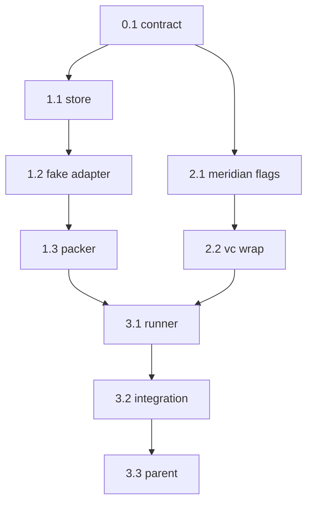

```text
Parent: /strategy/relay-master-plan
Track: B
Needs Mini: no
Blocked by: A
```

## How to use this document

This is **Relay child plan #2** (Track B). It implements the in-process runner Track C will expose over HTTP. It does **not** implement the control API, web, phone, or a real Cursor/Claude/Codex adapter.

Read [Relay — master plan](/strategy/relay-master-plan) **Locked decisions**, [Version control](/strategy/relay-master-plan#version-control), and [Accounts and usage](/strategy/relay-master-plan#accounts-and-usage) first. Import the parser from [child #1](/strategy/relay-parser-plan); do not fork the AST.

Work tasks **in order**. Subsequent agents will not have this chat.

<Warning>
**This file is the handoff.** If a choice is not in the [Decision log](#decision-log) or a task, it does not exist. Do not start Track C from this plan.
</Warning>

### Before you start (required)

1. Read this How-to, [Engineering conventions](#engineering-conventions-required), and the [Decision log](#decision-log).
2. Read parent Track B and Version control. Skim `relay/src/parser/index.ts` (`parsePlanMarkdown`, `resolvePlan`).
3. Skim the [Task status ledger](#task-status-ledger).

For every task:

1. Read **Context**, **Instructions**, and **As built** on tasks you depend on.
2. Implement only what that task describes.
3. Run **Evaluation criteria** before marking done.
4. **Edit this file** in the same PR ([Agent completion](#agent-completion)).

### Agent completion

<Warning>
When you finish, pause, or get blocked, edit this markdown file in the same PR. A task is not done if **Implementation notes** is still `_None yet._`. Also update the parent [Child plan ledger](/strategy/relay-master-plan#child-plan-ledger) when this plan is `done` / `blocked`.
</Warning>

1. Ledger row → `done` / `blocked` / `in_progress` (Notes: `doneAt`, pointer).
2. Task heading **Status** matches.
3. Evaluation checkboxes only for items you verified.
4. Replace **Implementation notes** with **As built**.
5. Append [Handoff log](#handoff-log).
6. Architecture forks → [Decision log](#decision-log) **and** the parent if a locked decision changed.

#### As built template

```md
**As built:**

| Concern | Landed |
| --- | --- |
| Files | `path` |
| Exports | names |
| Choice | fork you picked |
| Tests | what you ran |
| Follow-up | leftovers (or “none”) |
```

---

## Overall context

### What we are building

A **library runner** in `relay/` that:

1. Takes a parsed plan (or a markdown path).
2. Holds a **one-run mutex** on this machine.
3. Walks phases/steps with a **fake** agent adapter.
4. Persists `runs/<id>/state.json` so a process restart can resume a **gate**, not a mid-adapter call.
5. Writes `phase-N-brief.md` before the next phase.
6. Wraps `meridian start` / `switch` / `status` / `symlink` (and plain git for sibling repos). Does not reimplement checkout.

Success for this plan: one `phase-approve` loop with the fake adapter in a temp workspace, plus `approve-before` and `auto`.

### What we are not building

- HTTP (`relay/api`), web, phone, push
- Cursor / Claude / Codex adapters (child #5 / #7)
- `meridian ship` / `meridian sync`
- Planner-from-`goal` (no `planning` state)
- Preview supervisor (Metro/Vite) — record the chosen preview only
- Real `npm test` against the monorepo (fixture `verify` is `true` / `false` / `exit 0`)

---

## Engineering conventions (required)

| Concern | Rule |
| --- | --- |
| Home | Keep extending sibling `relay/`. Meridian CLI flags land in `Meridian/bin/meridian.js` |
| Runtime | Node 20, TypeScript, ESM, Vitest |
| Parser | `import { parsePlanMarkdown, resolvePlan } from "../parser/index.js"` (or package export). Do not copy types |
| Imports | Must not import Just Go / Meridian **app** runtime. Spawning `meridian` is allowed |
| Copy | Product **Relay**. Vocabulary **phase** and **step** |
| Git | Runner checks out; agents in later tracks must not. Tests use a temp dir + fake `meridian` |
| Mutex | One active run **per machine / process**. File lock under `RELAY_DATA` (default `relay/var/`) |

---

## Decision log

| Date | Decision |
| --- | --- |
| 2026-08-21 | States: `queued` → `running` → `awaiting-approval` → `failed` \| `done`. No `planning`. |
| 2026-08-21 | Kickoff is `planPath` or an already-parsed `Plan`. Kickoff may override `preview`, `agent`, `account`, `gate`, `branch`. Omitted `branch` → `relay/<slug>/<utc>` from the title. |
| 2026-08-21 | `machineId` from `RELAY_MACHINE_ID` or kickoff, default `relay-1`. Stored on the run; not used to hop boxes. |
| 2026-08-21 | Gates: `auto` continues after verify; `approve-before` waits **before** the phase; inherited `phase-approve` waits **after** the phase; plan `step-approve` waits after each step; `full-handoff` runs all phases then `done` (no ship). Missing `verify` cannot `auto` — force `awaiting-approval`. |
| 2026-08-21 | Adapter interface: `start({ cwd, promptFiles, account, env })`, `wait()` → `{ exitCode, usage? }`, `abort()`. Fake only in this plan. |
| 2026-08-21 | Fake usage: `{ tokens, costUsd, durationMs }` attributed to `tool:account`. Persist on the run; enough for later `GET /accounts`. |
| 2026-08-21 | VC: wrap existing CLI. Add `--yes` (no prompts; dirty → exit 1), `--any-branch` (skip `MER-*` regex), `--resume` on `start` if the branch exists remotely. Then `meridian symlink`. Tests inject `exec`. |
| 2026-08-21 | Sibling repos (`Meridian-Mobile`, `Meridian-Mintlify`, `relay`) use ordinary git with the **same branch name**. Tests no-op via injectable git. |
| 2026-08-21 | Phase-end commit: if dirty, `git add -A` + `git commit` in each dirty repo. Message `relay: phase <n> <title>`. Tests may no-op. |
| 2026-08-21 | Resume: if `state.json` is `awaiting-approval`, keep it. If `running`, mark `failed` (do not pretend the adapter is still live). |

---

## Contracts

### Run record (`runs/<id>/state.json`)

```text
id, machineId, status
planPath, plan (declared), resolved (resolvePlan after kickoff overrides)
branch, preview, agent, account, failover
phaseIndex, stepIndex
previewUrl?          # empty in this plan
mutex / createdAt / updatedAt
rejectNotes[]        # appended on reject
usage[]              # { tool, account?, tokens, costUsd, durationMs, at, phaseIndex }
lastVerify?
```

Also on disk:

| Path | Meaning |
| --- | --- |
| `runs/<id>/plan.md` | Copy of source markdown |
| `runs/<id>/log.txt` | Adapter + verify stdout |
| `runs/<id>/phase-N-brief.md` | Packer output |
| `runs/<id>/vc.json` | Recorded `meridian` / git argv (tests + fake exec) |

`RELAY_DATA` root defaults to `relay/var` (gitignored). Tests pass a temp dir.

### Adapter

```ts
start(input: {
  cwd: string;
  promptFiles: string[];
  account?: string;
  env?: Record<string, string>;
}): void;
wait(): Promise<{ exitCode: number; usage?: { tokens: number; costUsd: number; durationMs: number } }>;
abort(): void;
```

Fake adapter: write `runs/<id>/fake/<phase>-<step>.txt` with the instruction text; exit 0 unless the instruction is exactly `fail` or `RELAY_FAKE_EXIT=1`. Always emit usage (`tokens: 1` is fine).

### Packer (`phase-N-brief.md`)

Must include:

1. Phase title + what the fake adapter wrote.
2. Verify command + exit.
3. User reject notes (if any).
4. Literal: **branch already set — do not `git checkout`.**
5. `meridian status` snapshot when VC ran against a real/fake CLI; otherwise `(vc skipped)`.

Next phase `promptFiles` = `[plan slice or full plan.md, brief path]`. Do not invent chat history.

### VC wrapper

```text
ensureBranch({ branch, workspace })
  1. meridian status
  2. if branch exists locally or on remote:
       meridian switch <branch> --yes --any-branch
     else:
       meridian start <branch> --yes --any-branch
  3. meridian symlink
  4. siblingGitEnsure(branch) for Mobile / Mintlify / relay when those dirs exist
```

Never call `ship` or `sync`. Never `git checkout` inside `Meridian/` or `Events-Backend/`.

### Meridian CLI flags (task 2.1)

Add to **existing** `Meridian/bin/meridian.js` (do not rewrite git.js):

| Flag | Behavior |
| --- | --- |
| `--yes` | No readline. Collision without `--resume` → exit 1. Dirty → exit 1 (already true). |
| `--any-branch` | Skip `MER-*` validation; still require a git-safe name (`[A-Za-z0-9._/-]+`, no `..`, no leading `/` or `-`) — same rule as the Relay parser. |
| `--resume` | On `start`, if the branch exists on remote, checkout it (current interactive “Resume” path). |

Interactive `meridian start MER-123-Foo` without flags stays unchanged.

---

## Task status ledger

| Task | Status | Notes |
| --- | --- | --- |
| 0.1 | done | doneAt 2026-08-21; contract confirmed in this file |
| 1.1 | done | doneAt 2026-08-21; `relay/src/runner/` store + mutex + types |
| 1.2 | done | doneAt 2026-08-21; fake adapter + usage in `relay/src/adapters/` |
| 1.3 | done | doneAt 2026-08-21; phase brief packer in `relay/src/pack/` |
| 2.1 | done | doneAt 2026-08-21; Meridian CLI unattended flags + branch helper tests |
| 2.2 | done | doneAt 2026-08-21; Meridian + sibling git wrappers with recorded argv |
| 3.1 | done | doneAt 2026-08-21; state machine + gates + verify in `relay/src/runner/run.ts` |
| 3.2 | done | doneAt 2026-08-21; offline integration + `relay run` CLI |
| 3.3 | done | doneAt 2026-08-21; Track B closed on parent ledger |

---

## Execution order



1.x and 2.x are parallel after 0.1. 3.1 needs both.

---

## Phase 0 — Contract

### Task 0.1 — Confirm runner contract

**Status:** `done`

**Context:** Types in [Contracts](#contracts) are what Track C will HTTP-wrap. Do not add a second run JSON shape.

**Instructions:**

1. Treat [Decision log](#decision-log) and [Contracts](#contracts) as locked.
2. If you need a new `status` value, add a Decision log row and a sentence on the parent Track B list in the same PR.
3. No code in this task.

**Evaluation criteria:**

- [x] No extra run statuses beyond the decision log
- [x] Adapter has only `start` / `wait` / `abort`

**As built:**

| Concern | Landed |
| --- | --- |
| Files | `strategy/relay-runner-plan.mdx` |
| Exports | none (contract-only task) |
| Choice | Confirmed the locked run statuses and three-method adapter interface without changes |
| Tests | Manual contract review against the Decision log and Contracts sections |
| Follow-up | Task 1.1 may implement these types; it must not introduce another run JSON shape |

---

## Phase 1 — Store, fake adapter, packer

### Task 1.1 — Run store + mutex

**Status:** `done`

**Context:** Persistence is how a Mini reboot survives a gate.

**Instructions:**

1. Add `relay/src/runner/types.ts`, `store.ts`, `mutex.ts`.
2. `createRun` writes `runs/<id>/` (uuid or `ulid`). `loadRun` / `saveRun`.
3. Mutex: fail `createRun` if another run is `queued`, `running`, or `awaiting-approval`. `done` / `failed` release it.
4. `RELAY_DATA` + `RELAY_MACHINE_ID` with defaults above.
5. Gitignore `relay/var/`.
6. Unit tests on a temp data dir: create, reload, mutex conflict, resume `awaiting-approval` unchanged, resume `running` → `failed`.

**Evaluation criteria:**

- [x] Reloading `state.json` round-trips the record
- [x] Second `createRun` throws while one is active
- [x] `running` after “crash” becomes `failed`

**As built:**

| Concern | Landed |
| --- | --- |
| Files | `relay/src/runner/types.ts`, `store.ts`, `mutex.ts`, `index.ts`, `store.test.ts`; `relay/package.json`; `relay/.gitignore` |
| Exports | `createRun`, `loadRun`, `saveRun`, `resumeRun`, `relayDataDir`, `runDirectory`, `RunMutexError`, and runner contract types via `relay/runner` |
| Choice | Atomic `state.json` replacement plus exclusive `RELAY_DATA/run.lock`; `resumeRun` preserves gates and converts interrupted `running` runs to `failed` |
| Tests | `npm test` (34 passed, including 5 store/mutex tests); `npm run build` |
| Follow-up | Task 1.2 can consume `RunRecord` and `runDirectory`; no run shape fork needed |

---

### Task 1.2 — Fake adapter + usage

**Status:** `done`

**Context:** Enough to complete a gate loop without Cursor.

**Instructions:**

1. `relay/src/adapters/types.ts` + `fake.ts`.
2. Implement the adapter contract. Fake writes the instruction to `runs/<id>/fake/...` and appends stdout to `log.txt`.
3. Return fake usage every `wait()`.
4. `abort()` makes `wait()` resolve with a non-zero exit (or throw a typed abort).
5. Unit tests: success, `fail` instruction, usage shape, abort.

**Evaluation criteria:**

- [x] Instruction file exists after `wait()`
- [x] Usage object present on success
- [x] No network, no real agent CLI

**As built:**

| Concern | Landed |
| --- | --- |
| Files | `relay/src/adapters/types.ts`, `fake.ts`, `index.ts`, `fake.test.ts`; `relay/package.json` |
| Exports | `AgentAdapter`, adapter input/result/usage types, `FakeAdapter`, `createFakeAdapter`, `FakeAdapterOptions` via `relay/adapters` |
| Choice | Fake context is supplied at construction (`runDir`, phase, step, instruction); `start` retains the locked three-method contract and accepts only execution inputs |
| Tests | `npm test` (38 passed, including fake success, exact `fail`, forced exit, usage, logging, and abort); `npm run build` |
| Follow-up | `RELAY_FAKE_DELAY_MS` is available for Task 3.1 stop-during-wait coverage; otherwise none |

---

### Task 1.3 — Phase brief packer

**Status:** `done`

**Context:** Next phase gets files, not chat.

**Instructions:**

1. `relay/src/pack/brief.ts`: `writePhaseBrief({ runDir, phaseIndex, ... })` → `phase-N-brief.md`.
2. Include every bullet in [Packer](#contracts).
3. Unit test: snapshot or string contains `do not \`git checkout\`` and the verify exit.

**Evaluation criteria:**

- [x] Brief path is `runs/<id>/phase-1-brief.md` for phase 1
- [x] Reject note appears when provided

**As built:**

| Concern | Landed |
| --- | --- |
| Files | `relay/src/pack/brief.ts`, `index.ts`, `brief.test.ts`; `relay/package.json` |
| Exports | `writePhaseBrief`, `WritePhaseBriefInput`, `PhaseBriefVerify` via `relay/pack` |
| Choice | `phaseIndex` is zero-based like `RunRecord.phaseIndex`; generated filenames and headings are one-based for humans |
| Tests | `npm test` (40 passed, including phase-one path/content and reject-note/skipped-VC coverage); `npm run build` |
| Follow-up | Task 3.1 should pass the fake artifact contents as `adapterOutput` and the captured `meridian status` as `vcStatus` |

---

## Phase 2 — Version control

### Task 2.1 — Meridian CLI unattended flags

**Status:** `done`

**Context:** Today `meridian start` prompts on collision and rejects non-`MER-*` names. Relay cannot sit at a TTY and uses `relay/<slug>/<time>`.

**Instructions:**

1. In `Meridian/bin/meridian.js` (and usage text): `--yes`, `--any-branch`, `--resume` as in [Meridian CLI flags](#meridian-cli-flags-task-21).
2. `--any-branch` names must still be git-safe (reuse or copy the Relay parser rule).
3. Human default path unchanged when flags are absent.
4. Add a small test if the CLI already has one; otherwise a node script under `Meridian/bin` or document a manual command in As built. Prefer a unit-testable extract if `validateBranchName` can take a flag without a huge refactor.
5. Update [Meridian CLI](/meridian-cli) with a short “unattended / Relay” note — flags only, do not retitle that page.

**Evaluation criteria:**

- [x] `meridian start relay/foo/bar --yes --any-branch` would not die on the MER regex (dirty/workspace failures are ok in CI)
- [x] `meridian start not-a-ticket` without `--any-branch` still errors
- [x] No prompt functions called when `--yes` is set

**As built:**

| Concern | Landed |
| --- | --- |
| Files | `Meridian/bin/meridian.js`, `Meridian/bin/lib/branch-options.js`, `Meridian/bin/lib/branch-options.test.js`, `Meridian-Mintlify/meridian-cli.mdx` |
| Exports | `isGitSafeBranchName`, `isValidBranchName`, `collisionAction` from the internal CLI helper |
| Choice | `--any-branch` applies to `start` and `switch`; `--yes` aborts a remote collision unless `start --resume` is also present; flag-free interactive behavior is unchanged |
| Tests | `node --test bin/lib/branch-options.test.js`; `node --check bin/meridian.js`; manual CLI validation for legacy rejection and Relay-name acceptance through the dirty-tree guard |
| Follow-up | Task 2.2 can invoke `start` / `switch` with `--yes --any-branch`, adding `--resume` to `start` when it selects the remote-resume path |

---

### Task 2.2 — `relay/vc` wrapper

**Status:** `done`

**Context:** Relay must not reimplement checkout. Tests must not touch James’s real Meridian remotes.

**Instructions:**

1. `relay/src/vc/meridian.ts`: `ensureBranch` as in [VC wrapper](#vc-wrapper). Inject `exec(argv, cwd)`.
2. Default exec: `meridian` on PATH, `cwd` = `workspace/Meridian`, env `MERIDIAN_WORKSPACE=workspace`.
3. Record argv to `runs/<id>/vc.json` when a `runDir` is passed.
4. `relay/src/vc/sibling-git.ts`: if `Meridian-Mobile` (etc.) exists and is a git repo, create or switch the same branch. Inject git. Skip missing dirs.
5. Tests: fake exec captures `start` vs `switch` vs `symlink`; never emits `ship`. Sibling git no-op when dir missing.

**Evaluation criteria:**

- [x] Existing branch → `switch` + `symlink`, not `start`
- [x] New branch → `start` + `--yes` + `--any-branch` + `symlink`
- [x] No `git checkout` strings aimed at `Meridian/` in the wrapper source

**As built:**

| Concern | Landed |
| --- | --- |
| Files | `relay/src/vc/meridian.ts`, `sibling-git.ts`, `process.ts`, `record.ts`, `index.ts`, `meridian.test.ts`, `sibling-git.test.ts`; `relay/package.json` |
| Exports | `ensureBranch`, `siblingGitEnsure`, default executors/probe, command and input/result types via `relay/vc` |
| Choice | A read-only local/remote git probe selects Meridian `switch` vs `start`; Meridian still owns both-repo checkout. Siblings use `git switch`, tracking an existing `origin/<branch>` when present, and skip missing repos. |
| Tests | `npm test` (45 passed); `npm run build`; source scan confirmed no `git checkout` under `relay/src/vc/` |
| Follow-up | Task 3.1 should call `ensureBranch` once at kickoff and pass the run directory so both Meridian and sibling argv land in `vc.json` |

---

## Phase 3 — Runner loop

### Task 3.1 — State machine

**Status:** `done`

**Context:** This is the product loop. Use `resolvePlan` after applying kickoff overrides.

**Instructions:**

1. `relay/src/runner/run.ts` (names flexible):
   - `startRun({ dataDir, workspace, planPath, overrides, adapter, vc, git })`
   - `approve(id)`, `reject(id, note)`, `stop(id)`
2. On start: mutex, parse, default branch, `ensureBranch` (or record-only vc in tests), copy `plan.md`.
3. Walk phases/steps:
   - `approve-before` → persist `awaiting-approval` **before** `adapter.start`.
   - Else `adapter.start` with `cwd` = `workspace/<resolved.cwd>`, `promptFiles` = plan + latest brief (none on phase 1).
   - `wait()`. Non-zero → `failed`.
   - Run `verify` in that cwd via injectable `shell`. Non-zero → `failed`. Missing verify + would-be `auto` → `awaiting-approval`.
   - Append usage. Phase-end commit via injectable git (no-op ok).
   - Write brief. Then `auto` continues, `phase-approve` / `step-approve` → `awaiting-approval`.
4. `approve` resumes at the next step/phase with a **new** adapter session (new `start`).
5. `reject` appends the note and stays `awaiting-approval` (or re-runs the same step — pick one, log it: **default: stay parked until approve**).
6. `stop` → `abort()` + `failed`.
7. Unit tests for gate transitions with the fake adapter; vc/git/shell injected.

**Evaluation criteria:**

- [x] `mixed-gates.md`: phase 1 (`auto`) completes; run is `awaiting-approval` before phase 2
- [x] `approve` then fake phase 2 → `done`
- [x] `happy.md` phase 1 is `auto` (cwd backend) — same pattern
- [x] Brief for phase 1 exists before phase 2 starts
- [x] `stop` during fake `wait` ends `failed`

**As built:**

| Concern | Landed |
| --- | --- |
| Files | `relay/src/runner/run.ts`, `run.test.ts`, `index.ts` |
| Exports | `startRun`, `approve`, `reject`, `stop`, plus injectable adapter/VC/shell types via `relay/runner` |
| Choice | The persisted cursor uses `stepIndex === phase.steps.length` for a completed phase parked at a post-work gate. This keeps that approval distinct from a following phase's `approve-before`; reject stays parked until approve. |
| Tests | `npm test` (50 passed, including auto → approve-before → done, resolved cwd/brief ordering, reject, consecutive post/pre gates, and stop during fake wait); `npm run build` |
| Follow-up | Task 3.2 can wrap these library exports in the integration smoke and optional `relay run` command |

---

### Task 3.2 — Integration + `relay run`

**Status:** `done`

**Context:** Laptop smoke without HTTP.

**Instructions:**

1. Vitest integration: temp `RELAY_DATA` + temp workspace; fake meridian exec; `mixed-gates.md` full loop (`start` → auto → approve → done).
2. CLI: `relay run <plan> [--approve-all]` for tests only is optional; minimum is `relay run <plan>` that starts and prints `id` + `status` (will often sit at a gate). Prefer library-only if CLI fights `relay parse` — then a `relay/src/runner/cli.ts` invoked as `relay run`.
3. README: two lines on `relay run` or “library only until Track C”.
4. Parser tests still green (`npm test`).

**Evaluation criteria:**

- [x] Integration test green without network
- [x] `npm test` still includes the 29 parser tests
- [x] No `relay/api` or UI package

**As built:**

| Concern | Landed |
| --- | --- |
| Files | `relay/src/runner/integration.test.ts`, `runner/cli.ts`, `runner/cli.test.ts`, `cli/run.ts`, `cli.ts`, `README.md` |
| Exports | `runRunnerCli`, `RunnerCliIO`, `RunnerCliDependencies`; top-level CLI dispatch now accepts `relay run <plan> [--approve-all]` while retaining `relay parse` |
| Choice | `relay run` is an offline fake-adapter smoke command. It prints the persisted ID/status and stops at a gate by default; `--approve-all` repeatedly approves for unattended tests. No HTTP or UI surface was added. |
| Tests | `npm test` (54 passed, including 29 parser/parse-CLI tests and the fake-Meridian full loop); `npm run build`; compiled `relay parse` and invalid `relay run` smoke; API/UI source scan |
| Follow-up | Task 3.3 only: close Track B in the parent ledger; Track C owns HTTP controls |

---

### Task 3.3 — Close Track B on the parent

**Status:** `done`

**Context:** Parent agent-completion rule.

**Instructions:**

1. Parent ledger row **#2** → `done` + Notes with date and this Mintlify path.
2. This file’s 0.1–3.2 are `done`.
3. Do not start Hono/Fastify.

**Evaluation criteria:**

- [x] Parent row #2 is `done`
- [x] No HTTP server in `relay/`

**As built:**

| Concern | Landed |
| --- | --- |
| Files | `Meridian-Mintlify/strategy/relay-master-plan.mdx`, `strategy/relay-runner-plan.mdx` |
| Exports | none (plan closure only) |
| Choice | Closed child #2 / Track B without changing locked decisions or starting Track C |
| Tests | Confirmed tasks 0.1–3.2 are `done`; source/package scan found no HTTP server, Hono, or Fastify; `npm test` and `npm run build` remain green |
| Follow-up | Child #3 / Track C may now implement the HTTP API; it is not part of this plan |

---

## Out of scope / next plan

| Item | When |
| --- | --- |
| HTTP API + approve/stop/log | [Child #3](/strategy/relay-api-plan) |
| Web / phone | [Child #4a](/strategy/relay-web-plan) / [Child #4b](/strategy/relay-phone-plan) |
| Cursor adapter + real verify | [Child #5](/strategy/relay-cursor-plan) |
| Claude / Codex + failover | #7 |

---

## Success criteria (this plan)

| Signal | Target |
| --- | --- |
| Loop | Fake adapter + `mixed-gates` → gate → approve → `done` |
| Persist | Reload `awaiting-approval` after process exit |
| VC | Recorded `meridian start\|switch` + `symlink`; no `ship` |
| Flags | `--yes --any-branch` exist on the Meridian CLI |
| Boundary | No API/UI; parser still green |

---

## Handoff log

- 2026-08-21 — Task 0.1 complete. Confirmed the runner contract as written: statuses remain `queued`, `running`, `awaiting-approval`, `failed`, and `done`; the adapter surface remains `start` / `wait` / `abort`. No architecture or parent-plan changes were needed. Next: Task 1.1.
- 2026-08-21 — Task 1.1 complete. Added the persisted run record, atomic JSON store, one-run file mutex, terminal release, and restart recovery. Full Relay suite passes (34 tests). Next: Task 1.2.
- 2026-08-21 — Task 1.2 complete. Added the three-method adapter interface and offline fake adapter with instruction artifacts, log output, usage, deterministic failure, and abort support. Full Relay suite passes (38 tests). Next: Task 1.3.
- 2026-08-21 — Task 1.3 complete. Added the phase brief packer with adapter output, verify command/exit, reject notes, branch safety warning, and VC status/skipped context. Full Relay suite passes (40 tests). Next: Task 2.1.
- 2026-08-21 — Task 2.1 complete. Added git-safe `--any-branch` support to `start` / `switch`, non-prompting `--yes` collision handling, `start --resume`, CLI docs, and focused helper tests. Next: Task 2.2.
- 2026-08-21 — Task 2.2 complete. Added the injectable Meridian wrapper, read-only branch probe, sibling git alignment, combined `vc.json` command recording, and offline tests. Full Relay suite passes (45 tests). Next: Task 3.1.
- 2026-08-21 — Task 3.1 complete. Added the persisted runner loop, kickoff VC alignment, fresh per-step adapter sessions, verify/usage/phase commit/brief handling, distinct pre/post approval gates, parked rejection notes, and in-flight stop/abort. Full Relay suite passes (50 tests) and the TypeScript build is green. Next: Task 3.2.
- 2026-08-21 — Task 3.2 complete. Added the offline fake-Meridian integration loop, asynchronous `relay run` CLI dispatch with optional `--approve-all`, focused CLI tests, and README usage. Full Relay suite passes (54 tests), including all 29 parser/parse-CLI tests; build and compiled CLI smokes are green. Next: Task 3.3.
- 2026-08-21 — Task 3.3 complete. Marked child #2 / Track B done in the Relay master ledger, confirmed every child task is complete, and rechecked the no-HTTP boundary. Track B is closed; next work belongs to its separate child plans.
- 2026-08-22 — Post-close recovery hardening. Added instance-scoped runtime registries, persisted the VC status needed by later briefs, rehydrated `awaiting-approval` runs without rerunning branch setup, and converted interrupted `queued` / `running` runs to `failed` so the mutex is released. Cross-instance API coverage proves kickoff → gate → API restart → approve → done.
