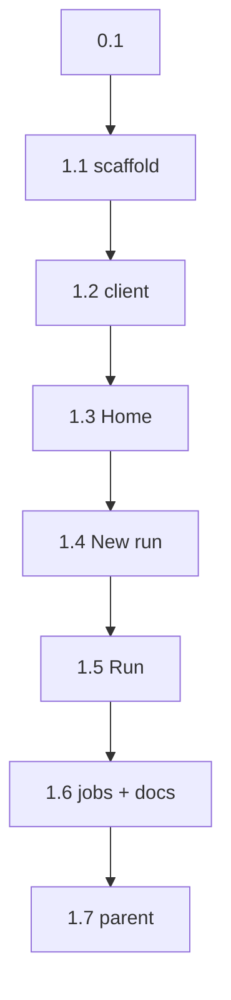

```text
Parent: /strategy/relay-master-plan
Track: D
Needs Mini: no
Blocked by: C
```

## How to use this document

This is **Relay child plan #4a** (Track D). It is the laptop console. Phone is **#4b**, not this file.

Read [Relay — master plan](/strategy/relay-master-plan) screens + [child #3](/strategy/relay-api-plan). Call the existing HTTP API. Do not add routes except CORS/proxy notes below.

Work tasks **in order**. Subsequent agents will not have this chat.

<Warning>
**This file is the handoff.** If a choice is not in the [Decision log](#decision-log), [BoardUI contract](#boardui-contract-required), or a task, it does not exist. Do not start Expo, Cursor adapters, or jobs/promote from this plan. Do not substitute shadcn / Geist / a hand-rolled kit for BoardUI.
</Warning>

### Before you start (required)

1. Read this How-to, [Engineering conventions](#engineering-conventions-required), and the [Decision log](#decision-log).
2. Read `relay/src/api/app.ts` and `GET /accounts` / `RunRecord` shapes.
3. Read [BoardUI](https://www.boardui.com/docs) + [Installation](https://www.boardui.com/docs/installation). Skim the component gallery for slugs before writing any UI.
4. Skim the [Task status ledger](#task-status-ledger).

For every task:

1. Read **Context**, **Instructions**, and **As built** on tasks you depend on.
2. Implement only what that task describes.
3. Run **Evaluation criteria** before marking done.
4. **Edit this file** in the same PR ([Agent completion](#agent-completion)).

### Agent completion

<Warning>
When you finish, pause, or get blocked, edit this markdown file in the same PR. A task is not done if **Implementation notes** is still `_None yet._`. Also update the parent [Child plan ledger](/strategy/relay-master-plan#child-plan-ledger) when this plan is `done` / `blocked`.
</Warning>

1. Ledger row → `done` / `blocked` / `in_progress`.
2. Task heading **Status** matches.
3. Evaluation checkboxes only for items you verified.
4. Replace **Implementation notes** with **As built**.
5. Append [Handoff log](#handoff-log).
6. Architecture forks → [Decision log](#decision-log) **and** the parent if a locked decision changed.

#### As built template

```md
**As built:**

| Concern | Landed |
| --- | --- |
| Files | `path` |
| Exports | names |
| Choice | fork you picked |
| Tests | what you ran |
| Follow-up | leftovers (or “none”) |
```

---

## Overall context

### What we are building

A **dense laptop UI** at `relay/web` that talks to `relay serve` (default `http://127.0.0.1:8787`):

1. **Home** — machine (switcher if more than one URL), usage rows per login, recent runs.
2. **New run** — `planPath`, optional branch / agent / account / preview / gate. POST `/runs`.
3. **Run** — status, phases/steps, log tail, Approve / Reject / Stop.
4. **Jobs** — one screen that shows the API’s `501` honestly. No promote form.

On-screen name is **Relay**. Visual system is **[BoardUI](https://www.boardui.com/)** (React + Tailwind v4, CLI-copied source). Dark mode via BoardUI’s `.dark` class. Do not invent a second look (no Geist-from-scratch, no shadcn, no hand-rolled button/input/table kit). Phone Figma is **#4b**, not this file.

### What we are not building

- Phone / Expo / Live Activities (#4b / #9)
- MSW (C exists; hit the real API or `createApp` in tests)
- Planner-from-goal
- Metro/Vite **product** preview supervisor
- Cursor / Claude adapters
- A second design system, or wrapping BoardUI so screens never import it

---

## Engineering conventions (required)

| Concern | Rule |
| --- | --- |
| Home | `relay/web/` Vite + React 19 + TypeScript + Tailwind v4 + **BoardUI**. Not inside `Meridian-Mobile` or `Meridian/frontend` |
| UI | Entire dashboard from BoardUI components + tokens. Custom files only when [BoardUI contract](#boardui-contract-required) allows it |
| API | Fetch the Track C contract. Vite **proxy** `/api` → `127.0.0.1:8787` so you do not need CORS for local |
| Auth | Send `Authorization: Bearer` when `VITE_RELAY_BEARER` is set |
| Machines | `VITE_RELAY_MACHINES` JSON `[{ "id": "relay-1", "url": "/api" }]`. One entry = hide the switcher |
| Copy | **Relay**. Phases and steps keep those words |
| Tests | Vitest + Testing Library for client helpers/screens. `npm test` in `relay/` must stay green |
| Jobs | Display `error.code === "not-implemented"`. Do not POST promote |

---

## Decision log

| Date | Decision |
| --- | --- |
| 2026-08-21 | Stack: Vite 6 + React 19 + TS in `relay/web`. Dev server proxies `/api` → `RELAY_API_ORIGIN` (default `http://127.0.0.1:8787`). |
| 2026-08-21 | No MSW. Component tests mock `fetch`. Optional Playwright later — not this plan. |
| 2026-08-21 | Routes: `/` Home, `/new` New run, `/runs/:id` Run, `/jobs/:id` stub. |
| 2026-08-21 | New run requires `planPath` (workspace-relative or absolute). Default preview `none`, agent `cursor`. Branch empty → server default. |
| 2026-08-21 | Run page polls `GET /runs/:id` every 1s and `GET /runs/:id/log?after=` for the log. SSE optional, not required. |
| 2026-08-21 | Approve / Reject / Stop only when status is `awaiting-approval` (Stop also when `running`). Reject requires a note field. |
| 2026-08-21 | Usage table = `GET /accounts`. Vendor column shows `unknown` as text, not a fake bar. |
| 2026-08-21 | **BoardUI is the laptop design system.** `npx boardui@latest init` in `relay/web`, then `npx boardui@latest add …`. Source is copied into the repo (not a runtime npm UI package). Screens compose BoardUI; custom components are the exception. See [BoardUI contract](#boardui-contract-required). |

---

## BoardUI contract (required)

BoardUI is **source, not a dependency**. The CLI writes tokens + components into `relay/web`. You own those files; do not re-skin them into a Cursor/Geist clone.

<Warning>
Every screen is a **composition of BoardUI components**. Do not start from a blank `div` + custom CSS and “make it look like BoardUI.” If a control exists in the gallery, use it. Custom React is allowed only for Relay glue (routes, fetch, polling, mapping API → BoardUI props).
</Warning>

### Install

From `relay/web` after the Vite app exists:

```bash
npx boardui@latest init
npx boardui@latest add button input select checkbox badge avatar tabs sidebar notification
```

Then **try** (may be Pro-gated; if the CLI refuses, skip that slug — do not fake it with another library):

```bash
npx boardui@latest add agent-progress data-table
```

Confirm slugs against [boardui.com/docs](https://www.boardui.com/docs) if `add` rejects a name. Import the stylesheet `init` prints (typically `@/styles/globals.css`). Keep the `@/` alias.

### Screen → BoardUI (use these, not a parallel kit)

| Surface | BoardUI first | Custom only if |
| --- | --- | --- |
| App chrome | `sidebar` (Home, New run; product title **Relay**) | No BoardUI sidebar slug after `add` — then a layout that still uses BoardUI buttons/badges, listed in As built |
| Home usage | `data-table` (or table block) | Pro `add` failed — token-styled `<table>`, **not** a new table package |
| Home runs | same table / row + `badge` for status | — |
| Machine / RAM | `badge` + BoardUI text tokens; `select` if more than one machine | — |
| New run | `input`, `select`, `checkbox` / tabs, primary `button` | — |
| Errors (`400`/`409`/`501`) | `notification` | — |
| Run phases | `agent-progress` (or closest progress/steps block) | Pro `add` failed — `badge` + BoardUI type utilities per phase row |
| Run actions | `button` (Approve primary, Reject / Stop secondary or danger) | — |
| Reject note | `input` | — |
| Log tail | BoardUI code / pre block if one exists | Otherwise a `<pre>` using BoardUI mono + semantic colors only |

### Custom components — allowed vs forbidden

**Allowed** (put under `relay/web/src/` as pages/hooks/api, not as a design kit):

- Route shells that **import** BoardUI
- `api.ts`, types, `useRunPoll`, machine-list env parse
- Mapping functions (`status → badge color`, `accounts → table rows`)

**Forbidden** unless the [Screen → BoardUI](#screen--boardui-use-these-not-a-parallel-kit) table already exhausted the gallery:

- Custom `Button`, `Input`, `Select`, `Badge`, `Modal`, `Card`, `Table`, `Sidebar`, `Progress`
- shadcn, Radix-from-scratch, MUI, Geist-as-the-system, hand-written `relay/web/src/ui/*` primitives
- Importing `Meridian/frontend` or Just Go styles

If you must add a Relay-only file (e.g. log tail), name it for the **domain** (`LogTail.tsx`), use BoardUI tokens/utilities, and list it under **As built → Choice**.

### Theme

- Class dark: put `.dark` on `html` (BoardUI default). Do not invent a second palette.
- Typography and color come from BoardUI `styles/theme.css` + `styles/typography.css`. Inter (or whatever `init` installs) is correct. **Do not add Geist to replace the system.**

---

## Screens

### Home

- Title **Relay** in the BoardUI sidebar / header. `GET /machine` → id, idle, RAM free/total (`badge` or stat treatment from BoardUI).
- Machine `select` if `VITE_RELAY_MACHINES.length > 1`.
- Usage **data-table**: tool, account, attributed tokens/cost/duration, vendor remaining, last used.
- Run **data-table** from `GET /runs`: title (`plan.title`), status `badge`, branch, updatedAt. Row / link → `/runs/:id`.
- Primary BoardUI **button** **New run**.

### New run

- BoardUI fields: planPath (required), branch, agent, account (from `/accounts`), preview, gate.
- Submit → `POST /runs` → navigate to `/runs/:id`.
- `400` / `409` as BoardUI `notification`, not a raw red `<p>` if the notification component landed.

### Run

- Header: title, status `badge`, branch, agent/account, machineId.
- Phase list from `resolved.phases` via **agent-progress** (number, title, gate). Highlight `phaseIndex` / `stepIndex`.
- Log: growing BoardUI code block or token-styled `<pre>` from poll.
- BoardUI actions: Approve, Reject (+ note `input`), Stop.
- Link to `/jobs/:id` only if we ever have a job id — omit if the run has none.

### Jobs stub

- `GET /jobs/:id` → BoardUI `notification` (or equivalent) with the `501` message. No second confirm.

---

## Task status ledger

| Task | Status | Notes |
| --- | --- | --- |
| 0.1 | done | Contract confirmed; no code |
| 1.1 | done | Vite + React + BoardUI scaffold |
| 1.2 | done | Typed API client + machine list |
| 1.3 | done | Live Home + BoardUI tables |
| 1.4 | done | BoardUI New run form |
| 1.5 | done | Run polling + gates |
| 1.6 | done | Jobs 501 + README |
| 1.7 | done | Parent child 4a closed |

---

## Execution order



---

## Phase 0 — Contract

### Task 0.1 — Confirm web contract

**Status:** `done`

**Instructions:**

1. Treat [Decision log](#decision-log), [BoardUI contract](#boardui-contract-required), and [Screens](#screens) as locked.
2. Do not add a GraphQL layer or a second resource model.
3. Do not substitute another component library.
4. No code.

**Evaluation criteria:**

- [x] Four routes only
- [x] Jobs stay stubbed
- [x] BoardUI is the only UI kit for this plan

**As built:**

| Concern | Landed |
| --- | --- |
| Files | `strategy/relay-web-plan.mdx` |
| Exports | none (contract-only task) |
| Choice | Confirmed the four locked routes (`/`, `/new`, `/runs/:id`, `/jobs/:id`), the existing Track C `RunRecord` resource model, the honest `501` jobs stub, and BoardUI as the sole laptop UI kit |
| Tests | Manual contract review against the parent Track D screens, child #3 API contract, `relay/src/api/app.ts`, `RunRecord`, and current BoardUI component/CLI documentation |
| Follow-up | Task 1.1 should scaffold only the four page shells and install copied BoardUI source; no GraphQL layer, alternate resource model, or second UI kit |

---

## Phase 1 — Console

### Task 1.1 — Scaffold `relay/web`

**Status:** `done`

**Instructions:**

1. Vite React-TS app in `relay/web` (React 19, Tailwind CSS v4, `@/*` alias). Scripts from `relay/web/package.json`: `dev`, `build`, `test`.
2. Proxy: `"/api" → http://127.0.0.1:8787` and **rewrite** strip `/api` (so `/api/health` → `/health`).
3. From `relay/web`: `npx boardui@latest init`, then the `add` commands in [BoardUI contract](#boardui-contract-required). Import the globals stylesheet. Put `.dark` on `html`.
4. React Router. Empty page shells that already use the BoardUI **sidebar** (or documented layout) and product title **Relay**. Do not add Geist as the type system.
5. Root `relay/README.md`: `npx relay serve` + `npm run dev` in `web/` + the BoardUI init/`add` note.

**Evaluation criteria:**

- [x] `cd relay/web && npm run build` succeeds
- [x] BoardUI `styles/` + at least `button` exist under `relay/web` (copied source)
- [x] No Geist-as-system, no shadcn, no import from `Meridian-Mobile` / `Meridian/frontend`

**As built:**

| Concern | Landed |
| --- | --- |
| Files | `relay/web/package.json`, `relay/web/package-lock.json`, `relay/web/index.html`, `relay/web/tsconfig*.json`, `relay/web/vite.config.ts`, `relay/web/src/App.tsx`, `relay/web/src/main.tsx`, copied `relay/web/components/`, `relay/web/styles/`, `relay/web/utils/`, `relay/README.md` |
| Exports | `App`, BoardUI `DashboardSidebar`, and the CLI-copied BoardUI component exports |
| Choice | Root-scoped `@/*` alias matches BoardUI's generated imports; four React Router shells compose the copied BoardUI sidebar/button/badge; `data-table` landed, while Pro-only `agent-progress` was skipped per contract |
| Tests | `cd relay/web && npm run build` (Vite 6.4.3, pass); `cd relay/web && npm test` (pass, no tests yet); `cd relay && npm test` (74 pass); forbidden UI/import scan (clean) |
| Follow-up | Task 1.2 should add the typed `/api` client and mocked-fetch tests without importing `relay/src` into Vite |

---

### Task 1.2 — API client

**Status:** `done`

**Instructions:**

1. `relay/web/src/api.ts`: `health`, `machine`, `accounts`, `listRuns`, `createRun`, `getRun`, `getLog`, `approve`, `reject`, `stop`, `setPreview`, `getJob`.
2. Base URL `/api`. Optional bearer header.
3. Typed to `RunRecord` — copy the fields you need into `relay/web/src/types.ts` (do not import `relay/src` into Vite unless you add a workspace alias; a small duplicate type is fine).
4. Unit tests with mocked `fetch` for 200 / 401 / 409 / 501.

**Evaluation criteria:**

- [x] `createRun` POSTs `{ planPath, ...overrides }`
- [x] `getLog(id, after)` reads `{ offset, chunk }`

**As built:**

| Concern | Landed |
| --- | --- |
| Files | `relay/web/src/api.ts`, `relay/web/src/api.test.ts`, `relay/web/src/types.ts`, `relay/web/src/machines.ts`, `relay/web/src/machines.test.ts`, `relay/web/src/vite-env.d.ts` |
| Exports | `health`, `machine`, `accounts`, `listRuns`, `createRun`, `getRun`, `getLog`, `approve`, `reject`, `stop`, `setPreview`, `getJob`, `RelayApiError`, `parseRelayMachines`, `getRelayMachines`, Track C web types |
| Choice | Named clients default to `/api`, accept a per-machine `baseUrl`, add `VITE_RELAY_BEARER` when present, encode path/query values, and preserve Track C status/code/message errors in `RelayApiError`; invalid or duplicate machine config fails with actionable copy |
| Tests | `cd relay/web && npm test` covers 200, create body/auth, log offset/chunk, 401, 409, 501, and machine parsing; `cd relay/web && npm run build` passes; root API/runner tests remain isolated by `relay/vitest.config.ts` added with Task 1.3 |
| Follow-up | Task 1.3 should select a `RelayMachine.url` for its three initial requests and render empty account/run arrays without treating them as errors |

---

### Task 1.3 — Home

**Status:** `done`

**Instructions:**

1. Load machine, accounts, runs on mount.
2. Usage table + run list + New run CTA as in [Screens](#screens), using BoardUI table / badge / button (see contract).
3. Idle / RAM visible on BoardUI badges or stat surfaces.
4. Tests: renders two usage rows from mock accounts; run link has `href` `/runs/abc`.

**Evaluation criteria:**

- [x] Empty accounts → empty table, not an error crash
- [x] Status chips are BoardUI `badge`s for `awaiting-approval` / `done` / `failed` / `running`
- [x] Home does not introduce a custom Button / Table primitive

**As built:**

| Concern | Landed |
| --- | --- |
| Files | `relay/web/src/pages/HomePage.tsx`, `relay/web/src/pages/HomePage.test.tsx`, `relay/web/src/App.tsx`, `relay/web/package.json`, `relay/web/package-lock.json`, `relay/vitest.config.ts` |
| Exports | `HomePage`, `RunStatusBadge` |
| Choice | Loads machine/accounts/runs together for the selected `RelayMachine.url`; uses the BoardUI `select` only for multiple machines, BoardUI badges for idle/RAM/status, and the copied BoardUI table block for Relay-specific usage/run rows rather than the registry's customer demo data |
| Tests | `cd relay/web && npm test` (11 pass, including two usage rows, `/runs/abc`, four status badges, and empty tables); `cd relay/web && npm run build` (pass); `cd relay && npm test` (74 pass) |
| Follow-up | Task 1.4 should reuse `getRelayMachines()` and the selected base URL pattern when loading accounts and creating a run |

---

### Task 1.4 — New run

**Status:** `done`

**Instructions:**

1. Form fields per [New run](#new-run) — BoardUI `input` / `select` / `checkbox` or tabs, not native unstyled controls if those components landed.
2. Account BoardUI `select` from `/accounts` (value `tool` + `account`).
3. On 201, `navigate(/runs/:id)`.
4. Test: submit calls `createRun` with `planPath`.

**Evaluation criteria:**

- [x] Cannot submit empty planPath
- [x] 409 mutex message visible (BoardUI `notification` if added)
- [x] No custom Input / Select components

**As built:**

| Concern | Landed |
| --- | --- |
| Files | `relay/web/src/pages/NewRunPage.tsx`, `relay/web/src/pages/NewRunPage.test.tsx`, `relay/web/src/App.tsx` |
| Exports | `NewRunPage` |
| Choice | BoardUI input/select/button/notification compose the form; defaults are agent `cursor`, preview `none`, server-generated branch, plan gate, and no account; account keys retain `tool` + `account`, selecting one syncs its tool into agent; requests use the selected machine URL |
| Tests | `cd relay/web && npm test` (13 pass, including empty plan disable, create payload, navigation, and 409 notification); `cd relay/web && npm run build` (pass); `cd relay && npm test` (74 pass); custom Input/Select scan (clean) |
| Follow-up | Task 1.5 should replace the remaining Run shell, poll with the same machine base URL pattern, and refresh immediately after gate actions |

---

### Task 1.5 — Run + gates

**Status:** `done`

**Instructions:**

1. Poll run + log. Append log chunks; keep `offset`.
2. Phase list via BoardUI `agent-progress` (or the fallback in the contract); current index highlighted.
3. Approve / Reject / Stop are BoardUI `button`s. After action, refresh run.
4. Test: awaiting-approval shows Approve; clicking it calls the client.

**Evaluation criteria:**

- [x] Stop visible while `running` or `awaiting-approval`
- [x] Reject disabled without a note
- [x] No custom Progress / Button kit; any `LogTail` is listed in As built

**As built:**

| Concern | Landed |
| --- | --- |
| Files | `relay/web/src/pages/RunPage.tsx`, `relay/web/src/pages/RunPage.test.tsx`, `relay/web/src/hooks/useRunPoll.ts`, `relay/web/src/hooks/useRunPoll.test.tsx`, `relay/web/src/components/LogTail.tsx`, `relay/web/src/App.tsx`, `relay/web/src/pages/HomePage.tsx`, `relay/web/src/pages/NewRunPage.tsx` |
| Exports | `RunPage`, `useRunPoll`, `LogTail` |
| Choice | One-second recursive polling prevents overlapping ticks, carries the byte offset, appends log chunks, and stops after terminal state; Pro-gated `agent-progress` uses the locked BoardUI badge/type phase-row fallback; non-default machine IDs persist in the run URL query |
| Tests | `cd relay/web && npm test` (16 pass, including offset append, awaiting actions, approval refresh, reject-note guard, running Stop, phase/log rendering); `cd relay/web && npm run build` (pass); `cd relay && npm test` (74 pass); custom Progress/Button scan (clean) |
| Follow-up | Task 1.6 should replace the final Jobs shell, show the Track C `501` message in BoardUI notification, and document the remaining environment variables |

---

### Task 1.6 — Jobs stub + README

**Status:** `done`

**Instructions:**

1. `/jobs/:id` fetches GET and shows `error.message` in a BoardUI `notification`.
2. README: env vars `VITE_RELAY_BEARER`, `VITE_RELAY_MACHINES`, how to pair with `RELAY_WORKSPACE=… npx relay serve`, and that the UI is BoardUI (`init` / `add`).
3. Do not add `relay-mobile/`.
4. In As built, list every **custom** UI file. If that list includes Button/Input/Table/Sidebar, the task is not done.

**Evaluation criteria:**

- [x] 501 copy visible in a component test
- [x] `cd relay && npm test` still green (API/runner)
- [x] Screens import BoardUI; custom UI files are domain glue only

**As built:**

| Concern | Landed |
| --- | --- |
| Files | `relay/web/src/pages/JobsPage.tsx`, `relay/web/src/pages/JobsPage.test.tsx`, `relay/web/src/App.tsx`, `relay/README.md` |
| Exports | `JobsPage` |
| Choice | Jobs performs only `GET /jobs/:id`, keeps the selected machine query, and renders the Track C `error.message` in BoardUI notification; there is no promote form or second confirmation |
| Custom UI files | `relay/web/src/main.tsx`; `relay/web/src/App.tsx`; `relay/web/src/pages/HomePage.tsx`; `relay/web/src/pages/NewRunPage.tsx`; `relay/web/src/pages/RunPage.tsx`; `relay/web/src/pages/JobsPage.tsx`; `relay/web/src/components/LogTail.tsx` — all bootstrap/domain glue; no custom Button/Input/Table/Sidebar |
| Tests | `cd relay/web && npm test` (17 pass, including exact 501 copy); `cd relay/web && npm run build` (pass); `cd relay && npm test` (74 pass); BoardUI import/custom-kit/mobile boundary audit (clean) |
| Follow-up | Task 1.7 should close child 4a in the parent ledger only; do not start Expo or add `relay-mobile/` |

---

### Task 1.7 — Close 4a on the parent

**Status:** `done`

**Instructions:**

1. Parent ledger row **4a** → `done` + this Mintlify path.
2. This file’s 0.1–1.6 are `done`.
3. Do not start Expo.

**Evaluation criteria:**

- [x] Parent 4a is `done`
- [x] No `relay-mobile/`

**As built:**

| Concern | Landed |
| --- | --- |
| Files | `strategy/relay-master-plan.mdx`, `strategy/relay-web-plan.mdx` |
| Exports | none (plan closure only) |
| Choice | Closed parent child 4a as `done` at `/strategy/relay-web-plan`; retained phone/Expo as separate pending child 4b |
| Tests | Verified child tasks 0.1–1.6 are `done`, parent 4a is `done`, the linked Mintlify path is present, and no `relay-mobile/` directory exists |
| Follow-up | none for Track D; do not infer authorization to start child 4b or Expo |

---

## Out of scope / next plan

| Item | When |
| --- | --- |
| Phone shell | [Child #4b](/strategy/relay-phone-plan) |
| Cursor adapter | [Child #5](/strategy/relay-cursor-plan) |
| Mini launchd + Tailscale serve | #6 (C is done; G can start in parallel) |
| Jobs + promote | #8 |

---

## Success criteria (this plan)

| Signal | Target |
| --- | --- |
| Loop | UI: new run (`mixed-gates.md`) → approve → `done` against local `relay serve` |
| Home | Usage rows + run list, BoardUI table + badges |
| UI | Dashboard composed from BoardUI; no second design system |
| Jobs | Honest 501 |
| Boundary | No phone app; `relay/` API tests still green |

---

## Handoff log

- 2026-08-21 — Task 0.1 complete. Confirmed the web console contract as written: four routes only, Track C remains the sole API/resource model, jobs remain an explicit `501` screen, and BoardUI remains the only laptop UI kit. No product code or parent-plan changes were needed. Next: Task 1.1.
- 2026-08-21 — Task 1.1 complete. Added the standalone React 19 / Vite 6 / Tailwind 4 console in `relay/web`, `/api` proxy rewrite, four routed BoardUI page shells, dark theme, copied BoardUI foundations/components, and local startup documentation. `data-table` is available; `agent-progress` was Pro-gated and remains on the documented BoardUI fallback path. Web build/test and all 74 Relay tests pass. Next: Task 1.2.
- 2026-08-21 — Task 1.2 complete. Added the typed Track C client, structured `RelayApiError`, optional bearer/base URL handling, encoded log polling, and validated `VITE_RELAY_MACHINES` parsing with a local proxy default. Mocked-fetch coverage includes 200/401/409/501 plus create/log contract checks; web build, 9 web tests, and all 83 root Relay tests pass. Next: Task 1.3.
- 2026-08-21 — Task 1.3 complete. Replaced the Home shell with live machine, account usage, and recent run loading; added the multi-machine BoardUI selector, idle/RAM badges, BoardUI usage/run tables, status badges, run links, notifications, and honest empty states. Testing Library coverage passes with 11 web tests; the web build and all 74 isolated Relay API/runner tests pass. Next: Task 1.4.
- 2026-08-21 — Task 1.4 complete. Replaced the New run shell with the BoardUI plan/branch/agent/account/preview/gate form, machine-aware account loading and run creation, locked defaults, required-path guard, `/runs/:id` navigation, and BoardUI API error notification. Web build, 13 web tests, and all 74 Relay API/runner tests pass. Next: Task 1.5.
- 2026-08-21 — Task 1.5 complete. Replaced the Run shell with machine-aware one-second run/log polling, byte-offset chunk append, BoardUI phase fallback and status metadata, auto-scrolling `LogTail`, and gated Approve/Reject/Stop actions with immediate refresh. Multi-machine links now retain machine identity. Web build, 16 web tests, and all 74 Relay tests pass. Next: Task 1.6.
- 2026-08-22 — Task 1.6 complete. Replaced the Jobs shell with the machine-aware `GET /jobs/:id` stub and exact Track C `501` message in BoardUI notification; completed bearer, machine-list, proxy, pairing, and BoardUI CLI documentation. Web build, 17 web tests, all 74 Relay tests, custom UI audit, and no-mobile boundary pass. Next: Task 1.7.
- 2026-08-22 — Task 1.7 complete. Closed Track D child 4a in the parent ledger with the completed `/strategy/relay-web-plan` path. All child tasks 0.1–1.7 are done, the no-mobile boundary remains intact, and child 4b/Expo was not started. Track D is complete.
