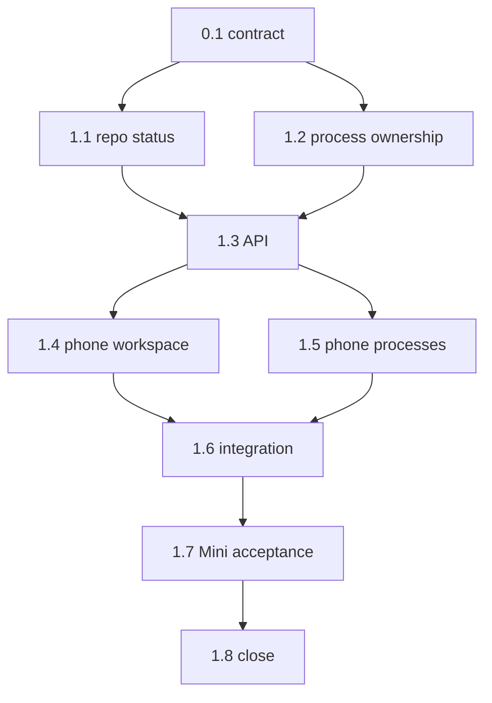

```text
Parent: /strategy/relay-master-plan
Track: J
Needs Mini: no for injected implementation; yes for real process acceptance
Blocked by: C, E, G
```

## How to use this document

This is **Relay child plan #12**. It adds two phone surfaces backed by the existing Mini control plane:

1. **Workspace** — read-only repository and Meridian-alignment state.
2. **Processes** — start/stop/open/log controls for Mini-configured Meridian Web, Just Go, and Campus profiles while the worker is idle.

Read [Relay — master plan](/strategy/relay-master-plan) **Mini role**, **Profiles**, **Version control**, **Workspace status**, **Manual processes**, and **Control API**; [child #3](/strategy/relay-api-plan), [child #4b](/strategy/relay-phone-plan), and [child #6](/strategy/relay-mini-ops-plan).

Work tasks **in order**. Subsequent agents will not have the product-alignment conversation that created this plan.

<Warning>
**Hard boundary:** No shell box, arbitrary executable/arguments from the client, phone profile editor, Git mutation, silent preview takeover, PID-only kill, or manual start while a run/checkpoint worker owns the machine. The phone invokes only saved Mini-side profiles.
</Warning>

### Before you start (required)

1. Read this How-to, [Engineering conventions](#engineering-conventions-required), [Decision log](#decision-log), and [Task status ledger](#task-status-ledger).
2. Read `relay/src/vc/`, runner mutex/store, machine/API routes, and the preview supervisor/config/reconcile implementation from child #6.
3. Read current private-profile documentation/examples; tracked files must remain placeholder-only.
4. Read Relay phone Home/Run/navigation/API patterns.
5. Keep tests offline with injected repository exec, process spawn, port/memory inspection, time, signals, and filesystem.

### Agent completion

<Warning>
When a task finishes, pauses, or blocks, update this file in the same PR. A task is not done while its **Implementation notes** remain `_None yet._`. Update the parent ledger when this child becomes `done` or `blocked`.
</Warning>

1. Ledger row matches task status.
2. Evaluation checkboxes reflect commands actually run.
3. Replace **Implementation notes** with **As built**.
4. Architecture forks update this Decision log and the parent.
5. Append the [Handoff log](#handoff-log).

---

## Overall context

### Workspace surface

For each configured repository, show:

- Repository/product label
- Current branch and short HEAD
- Clean/dirty state plus modified/untracked counts and optional file list/diff summary
- Ahead/behind when safely available from local refs
- Active run/checkpoint ownership
- Meridian/Events branch and symlink/lock alignment where applicable
- Last refresh and “files are changing” warning while a worker is active

This surface is read-only. It never fetches, pulls, switches, commits, pushes, discards, stashes, or repairs.

### Saved processes

The initial phone-visible process catalog is exactly:

| Profile | Purpose |
| --- | --- |
| Meridian Web | Start the configured Meridian frontend web preview and expose its URL |
| Just Go | Start the configured Just Go Expo/Metro development-client preview and expose its deep link/manifest URL |
| Campus | Start the configured campus Expo/Metro development-client preview and expose its deep link/manifest URL |

The Mini owns absolute cwd/command/argv/env-name/port/URL configuration. The phone may start, stop, inspect status/logs, and open a URL. It may not create or edit a profile.

### Ownership and conflicts

```text
worker/checkpoint active
  → Workspace allowed with changing-state warning
  → Manual Processes blocked
  → active Run screen may switch its own preview

worker idle
  → one manual saved process may start
  → another manual start requires an explicit switch/stop
  → new run reconciles/stops manual ownership before worker start
```

Process ownership must be stronger than PID existence: persist owner/session/profile/start identity, verify the spawned process, and stop only a matching owned child. Restart reconciliation fails safe without spawning duplicates or killing unrelated reused PIDs.

### What we are not building

- Raw shell, terminal emulator, SSH replacement, or arbitrary command execution
- Phone profile creation/editing, env secret entry, or executable/argument input
- Backend server or additional process profile in this first child
- Git mutations or remote operations
- A central process scheduler or queue
- Concurrent manual process and worker ownership
- Web Workspace/Processes UI in this child; APIs remain client-neutral

---

## Engineering conventions (required)

| Concern | Rule |
| --- | --- |
| Repo inventory | Machine-local configured roots only; resolve/canonicalize under `RELAY_WORKSPACE`; do not accept arbitrary client paths |
| Meridian state | Reuse `meridian status`/existing VC interpretation for Meridian + Events; plain read-only Git for sibling repos |
| Remote state | Ahead/behind uses existing local refs unless an explicit future action adds fetch; status never performs network access |
| Response paths | Prefer repo-relative names; do not expose secrets, env values, or unnecessary private absolute paths |
| Process config | Private Mini-side saved profiles with stable IDs and absolute argv/cwd; tracked examples remain placeholders |
| Process API | Profile ID only. Client never sends executable, cwd, args, or env values |
| Ownership | Generalize/reuse child #6 supervisor ownership and reconciliation. Do not add an unrelated daemon/process manager |
| Concurrency | Manual start blocked by active run, checkpoint editor, job, or critical memory. Run preview switch remains run-owned |
| Switching | One manual process at a time. Explicit switch/stop; never silently replace a run-owned preview |
| Logs | Persist bounded session log metadata and serve authenticated tails; redact configured secrets |
| Tests | Inject exec/spawn/kill/ports/memory; temp dirs; in-memory API; no real Mini/Tailscale/Metro/Vite in automated tests |

---

## Decision log

| Date | Decision |
| --- | --- |
| 2026-08-23 | Workspace is read-only: branch, HEAD, dirty/ahead-behind, files/diff summary, ownership, and Meridian alignment only. |
| 2026-08-23 | First UI ships on phone only; API remains client-neutral for a later web surface. |
| 2026-08-23 | Initial manual catalog is Meridian Web, Just Go, and Campus plus Stop/Open/Logs. No backend profile yet. |
| 2026-08-23 | Commands are saved/configured on the Mini. No shell, arbitrary argv, or phone profile editor. |
| 2026-08-23 | Block every manual process start while a worker/checkpoint editor is active. Run-owned preview switching remains available from Run. |
| 2026-08-23 | Workspace status remains available during work with an explicit changing-snapshot warning. |
| 2026-08-23 | One manual process at a time; ownership/restart reconciliation must not kill unrelated PID reuse or spawn duplicates. |

---

## Task status ledger

| Task | Status | Notes |
| --- | --- | --- |
| 0.1 | done | doneAt 2026-08-24; contract and existing implementation seams confirmed; no code or Mini mutation |
| 1.1 | done | doneAt 2026-08-24; configured inventory, local-only Git/Meridian status, ownership marker, and offline coverage |
| 1.2 | done | doneAt 2026-08-24; stable saved-profile schema and typed run/manual supervisor ownership |
| 1.3 | done | doneAt 2026-08-24; authenticated workspace/process routes, structured conflicts, and explicit run takeover |
| 1.4 | done | doneAt 2026-08-24; machine-scoped read-only Workspace screen, active-work polling, and partial-row coverage |
| 1.5 | done | doneAt 2026-08-24; saved-process catalog/actions, conflict blocking, bounded logs, and Run handoff |
| 1.6 | done | doneAt 2026-08-24; offline fixture/restart/ownership matrix and security boundaries verified |
| 1.7 | pending | Real Mini acceptance and operator docs |
| 1.8 | pending | Close child #12 and update parent ledger |

## Execution order



---

## Phase 0 — Contract

### Task 0.1 — Confirm workspace/process contract

**Status:** `done`

**Instructions:**

1. Treat the Decision log, saved catalog, and ownership/conflict flow as locked.
2. Name exact existing VC/API/supervisor/mobile seams for tasks 1.1–1.7.
3. Confirm no task adds Git mutations, arbitrary commands, client profile editing, concurrent manual/worker starts, or a web UI.
4. No product code or real process start.

**Evaluation criteria:**

- [x] Workspace is read-only and client paths are never accepted
- [x] Manual catalog is exactly Web, Just Go, and Campus
- [x] Worker blocks manual start; Run retains its own preview controls
- [x] No code or Mini mutation occurred

**As built:**

| Item | Result |
| --- | --- |
| Contract | Locked the read-only configured-repository inventory, the exact Meridian Web / Just Go / Campus catalog, profile-ID-only client input, one owned manual process, worker/manual mutual exclusion, and Run-owned preview switching. No task may add Git mutation, fetch, arbitrary executable/cwd/argv/env input, phone profile editing, concurrent manual/worker ownership, or a web UI. |
| Task 1.1 seams | Extend the read-only VC surface rooted at `relay/src/vc/index.ts`: reuse `MERIDIAN_REPOSITORIES`, `defaultMeridianExec`, and the existing Meridian interpretation for Meridian + Events; use injected `GitExec` / `defaultGitExec` process results for sibling status. Resolve only machine-configured roots beneath the server `RELAY_WORKSPACE`; no API request supplies a path. |
| Task 1.2 seams | Extend `relay/src/preview/config.ts`, `types.ts`, and `loadPreviewProfiles` for private saved profiles, then generalize the existing `PreviewSupervisor` / `createPreviewSupervisor` owner and persisted reconciliation in `relay/src/preview/supervisor.ts`. Preserve `FakePreviewSupervisor` and injected spawn/signal/process-inspector seams for offline tests. |
| Task 1.3 seams | Add bearer-protected routes to the existing Hono `createApp(options)` in `relay/src/api/app.ts`. Derive run ownership through `RunMutexError`, `mutexOwner`, `ACTIVE_RUN_STATUSES`, `listRuns`, and the per-app `RunRuntimeRegistry`; reuse the injected shared supervisor and its startup `reconcile` path rather than creating a second manager. |
| Tasks 1.4–1.5 seams | Extend `relay-mobile/src/api.ts` and copied types in `relay-mobile/src/types.ts`; preserve selected `machineId` / `baseUrl` through `RootStackParamList`, register screens in `relay-mobile/App.tsx`, follow `HomeScreen` focus/loading patterns, and link worker conflicts to the existing `RunScreen`. Processes accepts stable profile IDs only and never renders private command/config fields. |
| Task 1.6 seams | Reuse preview fixture children and injected exec/spawn/signal/process inspection, runner/API fakes and temp data directories, in-memory `createApp().request()`, and mocked mobile API/navigation tests. Boundary scans cover mutating Git/network fetch, arbitrary commands, path/env leakage, PID-only kill, duplicate children, and any `relay/web` UI change. |
| Task 1.7 seam and stop | Real acceptance resumes only after James explicitly authorizes Phase 2. It uses the existing private Mini profiles contract and `relay/docs/add-machine.md` operator/rollback workflow, then verifies through the authenticated phone surfaces. No real process was started and no Mini, profile, secret, or tracked placeholder was changed in Task 0.1. |
| Review | Inspected the locked Decision log and parent/child contracts plus the named VC, runner, API, preview, and mobile files/exports. Documentation-only contract confirmation; no automated product tests were required or run. |
| Follow-up | Task 1.1 may add configured repository inventory and read-only status only; Task 1.2 remains a separate subsequent slice. |

---

## Phase 1 — Services, API, and phone

### Task 1.1 — Add configured repository inventory and read-only status

**Status:** `done`

**Instructions:**

1. Add a machine-local repository descriptor config derived from known workspace siblings; no arbitrary client-supplied path.
2. Implement an injected status service using existing Meridian CLI/VC interpretation for Meridian + Events and read-only Git commands for siblings.
3. Return stable ID/label/relative root, branch, short HEAD, clean/dirty counts, safe file list/diff summary, ahead/behind from local refs, active owner, alignment, and timestamp.
4. Handle absent/non-Git repos and partial command failures per repository without failing the entire workspace response.
5. Add offline tests for clean/dirty/untracked/detached/ahead/behind/missing repos, Meridian misalignment, active worker, path containment, and redaction.

**Evaluation criteria:**

- [x] No status path performs fetch/pull/switch/commit/push/discard
- [x] Meridian/Events uses existing semantics rather than reimplemented alignment
- [x] Active work marks the response as changing
- [x] Private absolute paths and secrets are omitted where not required
- [x] Focused status tests pass

**As built:**

| Item | Result |
| --- | --- |
| Files | `Meridian/bin/meridian.js`; `relay/src/workspace/{config,status,types,index}.ts`; focused config/status tests; `relay/ops/repositories.example.json`; `relay/package.json` workspace export |
| Exports | `DEFAULT_REPOSITORIES`, `loadRepositoryConfig`, `RepositoryConfigError`, `getWorkspaceStatus`, `WorkspaceStatusOptions`, and workspace status/config types through `relay/workspace` |
| Inventory | Loads optional machine-local `RELAY_DATA/repositories.json`, otherwise derives the five known Meridian/Events/Mobile/docs/Relay siblings. Stable IDs, labels, relative roots, kinds, unique IDs, and canonical containment beneath `RELAY_WORKSPACE` are enforced; missing roots remain row-level results. |
| Status | Injected read-only Git probes return branch/detached HEAD, short SHA, dirty/untracked counts, a bounded 50-file safe list, local-upstream ahead/behind, active mutex owner, changing-snapshot marker, and refresh time. Missing, non-Git, and command-failing repositories do not fail other rows. Sensitive filenames and absolute paths are redacted. |
| Meridian alignment | Added `meridian status --json --local`, which reuses the CLI's existing lockfile, Events HEAD/origin-main, and `backend/events` symlink interpretation while suppressing its normal fetch. Relay invokes exactly this local JSON mode for Meridian + Events and overlays the interpreted branch/HEAD/clean/alignment result. Existing human `meridian status` behavior remains unchanged. |
| Tests | Focused workspace tests: 10 passing for defaults/private config, malformed/duplicate/traversal/symlink-escape rejection, clean/dirty/untracked/detached/ahead/behind/missing/non-Git/partial rows, Meridian misalignment, active worker, redaction, and forbidden Git commands. Full Relay suite: 248 passing; `npm run build`; `node --check ../Meridian/bin/meridian.js`; real read-only `meridian status --json --local` smoke; tracked workspace forbidden-command/surface scan. |
| Follow-up | Task 1.2 may extend the private saved-profile schema and shared supervisor ownership. No API route, mobile screen, process start, or web UI was added in Task 1.1. |

### Task 1.2 — Add saved process config and generalized ownership

**Status:** `done`

**Instructions:**

1. Extend the existing private profile contract to stable manual IDs for Meridian Web, Just Go, and Campus with absolute cwd/command/args, env-name references, port, URL/deep-link metadata, and resource class.
2. Generalize the child #6 supervisor owner from only a run ID to a typed run/manual owner while retaining one heavy child and existing run-preview API behavior.
3. Persist manual session/profile/owner/verified process identity/log/start time/URL and reconcile on restart without PID-only decisions.
4. Implement explicit manual start/switch/stop/status/log-tail operations; never silently take over run ownership.
5. Add injected fixture-process tests for start, switch, stop, crash, port conflict, PID reuse, stale metadata, API restart, and zero duplicate children.

**Evaluation criteria:**

- [x] Existing run preview supervisor tests/API behavior remain green
- [x] Client input selects a stable profile ID only
- [x] Restart reconciliation neither duplicates nor kills unrelated processes
- [x] One manual process/profile owns the supervisor at a time
- [x] Focused config/supervisor tests pass

**As built:**

| Item | Result |
| --- | --- |
| Files | `relay/src/preview/{types,config,supervisor,testing,index}.ts`; focused config/supervisor tests; placeholder-only `relay/ops/profiles.example.json` |
| Profile contract | Extended the existing private `RELAY_DATA/profiles.json` with an optional `manual` catalog whose only stable IDs are `meridian-web`, `just-go`, and `campus`. Each entry requires an absolute cwd contained by `RELAY_WORKSPACE`, absolute command, string argv, unique environment-variable names rather than values, port, typed web/deep-link/manifest URL metadata, and the single `heavy` resource class. Existing run `expo`/`web` profiles remain compatible. |
| Ownership | The one existing `PreviewSupervisor` now models typed run/manual ownership. Run metadata records a typed run owner while remaining backward-compatible with v1 records; manual metadata v2 persists session/profile/owner, verified PID/process group/command/start identity, safe log path, start/update time, port, URL metadata, and resource class. Run and manual starts reject the opposite owner instead of silently taking over. |
| Manual operations | Added redacted `manualProfiles()`, stable-ID-only `startManual` / `switchManual`, owned `stopManual`, status, and byte-offset bounded `tailManualLog`. Switching serializes through the existing supervisor operation queue, stops only the verified owned process group, attempts rollback after failed replacement, checks configured-port availability before spawn, passes only PATH plus explicitly named environment values, redacts configured values from served tails, and never invokes a shell. |
| Recovery | Restart reconciliation verifies PID, process group, command identity, and start time before adopting a persisted manual session without spawning a duplicate. Missing/crashed state clears safely; stale, malformed, or PID-reused state is discarded without signaling the ambiguous process. A parked run target receives an ownership conflict while manual ownership remains active. Legacy run-preview reconcile behavior remains green. |
| Tests | Focused preview config/supervisor suite: 40 passing, including exact catalog/config validation, start/switch/stop/crash, port conflict, run/manual exclusion, rollback-safe ownership, bounded/redacted logs, real fixture child, restart adoption, stale metadata, PID reuse, and zero duplicate children. Full Relay suite: 262 passing with one worker after the parallel run hit host temp-volume `ENOSPC`; `npm run build`; `git diff --check`; shell/process boundary scan. |
| Follow-up | Task 1.3 may expose authenticated client-neutral workspace/process routes and wire worker/checkpoint/job conflict policy. No API route, phone/web UI, real profile start, or Mini mutation was added in Task 1.2. |

### Task 1.3 — Add authenticated workspace/process API and conflicts

**Status:** `done`

**Instructions:**

1. Add the parent-contract workspace status and process list/start/stop/log routes to the existing bearer-protected API.
2. Derive worker/checkpoint/job activity from persisted/runtime ownership. Block manual starts with structured `409` details while any is active.
3. Check configured port/process ownership and memory policy before spawn. Never accept command/cwd/args/env values from request bodies.
4. Starting a run while a manual process owns the supervisor must reconcile/stop that owned manual session explicitly before VC/agent work; never leave both heavy profiles.
5. Add in-memory API tests for auth, catalog redaction, active-worker block, port/memory conflicts, idempotent stop, run takeover, and path/secret leakage.

**Evaluation criteria:**

- [x] All routes require the existing bearer when configured
- [x] Manual start is impossible while worker/checkpoint/job is active
- [x] API has no arbitrary command or Git mutation field
- [x] Run takeover is explicit, owned, and leaves no duplicate child
- [x] API tests pass

**As built:**

| Item | Result |
| --- | --- |
| Files | `relay/src/api/app.ts`; `relay/src/api/workspace-process.test.ts`; `relay/src/runner/run.ts`; manual-capable `relay/src/preview/testing.ts` fake |
| Routes | Added bearer-covered `GET /workspace/repos`, `GET /processes`, `POST /processes/:profile/start`, `POST /processes/:session/stop`, and `GET /processes/:session/log?after=` to the existing Hono `createApp`. Workspace uses the injected/default Task 1.1 status service. Process responses expose only stable catalog IDs, port, URL metadata, resource class, owned public status, and a session log URL—never command, cwd, argv, env names/values, private paths, or secrets. |
| Input boundary | Start selects a configured `meridian-web`, `just-go`, or `campus` ID from the route only; stop/log select the owned session ID. Start/stop bodies with any fields are rejected, so executable, cwd, args, env, force-kill, Git paths, and mutation inputs cannot enter the supervisor. Starting a different saved profile is the explicit switch action. |
| Conflict policy | Before spawn, the API derives active queued/running/awaiting-approval runs from the durable run store, upgrades an active checkpoint store owner to a structured checkpoint conflict, accepts the existing injectable future job-activity seam, checks an injectable/default critical-memory policy, then relies on the supervisor's configured-port and typed-ownership checks. `409` responses include structured worker/checkpoint/job/memory or port details. |
| Run takeover | `beginRun` now inspects the shared supervisor and explicitly calls `stopManual` with the exact owned session before the existing terminal-preview cleanup and before VC alignment. Ambiguous/reused PID protection remains inside the supervisor; a failed owned stop fails the run rather than allowing two heavy children. The normal queued API response remains unchanged while background setup performs the ordered takeover. |
| Recovery and status | API startup continues to reconcile the one supervisor before serving routes. A verified manual session is adopted without duplication; process list reports its session/status/log URL. Stop is idempotent once idle but refuses to stop a different active session. Log reads require the current owned session and retain bounded, redacted byte-offset semantics. |
| Tests | Focused API/app/runner suite: 36 passing. New in-memory coverage verifies bearer enforcement on every route, workspace response, exact redacted catalog, start/switch/log/idempotent stop, worker/checkpoint/injected-job blocks, critical-memory and port conflicts, arbitrary command/body rejection, path/secret exclusion, and manual-stop-before-VC run takeover with no remaining manual owner. Full Relay suite: 268 passing with one worker; `npm run build`; `git diff --check`; request-field/Git-mutation/client-surface boundary scans. |
| Follow-up | Task 1.4 may add the phone Workspace screen against `GET /workspace/repos`. Task 1.5 remains the separate phone Processes slice; no phone/web UI or Mini mutation was added here. |

### Task 1.4 — Build phone Workspace screen

**Status:** `done`

**Instructions:**

1. Add a phone Workspace route/list using existing machine selection and API client patterns.
2. Show repository label, branch/HEAD, clean/dirty counts, ahead/behind, active owner, and Meridian alignment; allow expanding a safe changed-file/diff summary.
3. While a worker is active, show a persistent “files are changing” warning and refresh/poll without presenting actions.
4. Handle missing repo/partial status errors per row and preserve other repositories.
5. Add mocked API/navigation/accessibility tests and a forbidden-action scan.

**Evaluation criteria:**

- [x] Screen contains no fetch/switch/commit/push/discard action
- [x] Active work warning is visible without hiding status
- [x] Partial failures do not blank the entire workspace
- [x] Machine scoping is preserved
- [x] Mobile tests and typecheck pass

**As built:**

| Item | Result |
| --- | --- |
| Files | `relay-mobile/App.tsx`; `src/{api,types}.ts`; `src/navigation/types.ts`; `src/screens/{HomeScreen,WorkspaceScreen}.tsx`; focused API, navigation, and Workspace tests |
| Navigation and scope | Registered a Home-accessible `Workspace` route and threads the selected `machineId` / `baseUrl` through navigation into `GET /workspace/repos`. The screen labels the selected machine and never accepts or constructs a repository path. |
| Repository state | Shows every configured repository independently with label, branch, short HEAD, clean or modified/untracked counts, local-ref ahead/behind, active owner, and Meridian lock/main/symlink alignment. Missing and partial repository errors render inside their row without removing healthy repositories. |
| Safe details | A per-repository accessible disclosure shows only the server-returned bounded changed-file status/path list and truncation notice. The screen has no Git mutation, fetch, shell, command, or repository-path input and exposes no process controls. |
| Active work | A persistent accessible “Files are changing” warning remains above the repository list while ownership is active, includes the safe owner marker, and polls the same machine every five seconds without hiding the last successful snapshot during refresh or error. |
| Tests | Added mocked API, app-navigation, accessibility/disclosure, partial-failure, machine-scoping, and active polling coverage. All 57 mobile tests pass across 11 suites; `npm run typecheck`; `git diff --check`; forbidden fetch/pull/switch/checkout/commit/push/discard/stash/reset, shell/command/argv/cwd/env scan of the Workspace screen. |
| Follow-up | Task 1.5 may add the separate phone Processes screen. No process start/stop/open/log UI, web UI, API/server change, Git mutation, real process, or Mini mutation was added in Task 1.4. |

### Task 1.5 — Build phone Processes screen

**Status:** `done`

**Instructions:**

1. Add a phone Processes route showing exactly the server catalog, current owner/profile, status, uptime, port, URL/deep link, and bounded logs.
2. Provide Start for idle saved profiles, explicit Switch/Stop for manual ownership, Open for returned URLs, and refresh/retry.
3. When a worker/checkpoint/job is active, disable starts and show the exact run/profile conflict. Link to the active Run so its own preview may switch there.
4. Do not render executable/cwd/args/env values, profile editing, shell input, or a force-kill action.
5. Add mocked tests for idle start, manual switch, stop, logs/open, worker block, port/memory errors, and accessibility.

**Evaluation criteria:**

- [x] Initial UI exposes Web, Just Go, and Campus only when configured
- [x] Worker conflict blocks rather than merely warns
- [x] Active run preview remains controlled from Run, not Processes
- [x] No command/profile editor or secret detail exists
- [x] Mobile tests and typecheck pass

**As built:**

| Item | Result |
| --- | --- |
| Files | `relay-mobile/App.tsx`; `src/{api,types}.ts`; `src/navigation/types.ts`; `src/screens/{HomeScreen,ProcessesScreen}.tsx`; focused API, navigation, actions, logs, conflicts, errors, and accessibility tests |
| Catalog and scope | Registered a Home-accessible `Processes` route and preserves the selected `machineId` / `baseUrl` for every request and Run handoff. The UI maps only server-returned stable `meridian-web`, `just-go`, and `campus` entries to Meridian Web, Just Go, and Campus; an unconfigured profile is absent rather than synthesized client-side. |
| Status and actions | Shows current idle/run/manual owner, active profile, running status, derived uptime, configured port, URL kind/value, and resource status. Idle profiles expose Start; a different profile under manual ownership exposes explicit Switch; the active manual profile exposes Stop and Open for the returned URL. Refresh/retry retain the last successful catalog. |
| Logs | Polls the active owned session log by byte offset every three seconds, honors the server's bounded chunks, and additionally caps rendered client log text at 64 KiB. Session changes reset the offset/tail and log failures remain local to the log panel. |
| Conflicts and Run ownership | Worker/checkpoint/job ownership renders a persistent structured blocking panel and disables every Start/Switch control. When a run ID is available, the panel links to the existing machine-scoped `Run` screen for run-owned preview controls; Processes never exposes run preview switching. Port, memory, and race-time structured conflicts render without dropping the catalog. |
| Security boundary | Client methods send stable profile/session IDs in encoded route segments and empty POST bodies. The copied public types omit executable, cwd, argv, env names/values, private paths, and secrets. There is no profile editor, shell/terminal input, arbitrary command, or force-kill action. |
| Tests | Added mocked idle start, manual switch/stop, byte-offset logs, returned-URL open, worker block/Run navigation, port and memory errors, structured conflict retention, machine scoping, empty configuration, and accessibility coverage. All 65 mobile tests pass across 12 suites; `npm run typecheck`; `git diff --check`; forbidden command/argv/args/cwd/env/secret/shell/terminal/force-kill/profile-editor/TextInput scan of the Processes screen. |
| Follow-up | Task 1.6 may run the broader offline recovery/conflict/security integration matrix. No integration sweep, API/server change, web UI, real saved process, Git mutation, or Mini mutation was added in Task 1.5. |

### Task 1.6 — Verify offline recovery, conflict, memory, and security

**Status:** `done`

**Instructions:**

1. Run injected end-to-end manual Web/Just Go/Campus start/status/log/open/switch/stop flows with fixture children.
2. Start a fake worker from each idle/manual state and prove reconciliation, worker blocking, run preview ownership, and zero duplicate children.
3. Restart API/Relay during each manual state; cover stale PID, reused PID, dead child, occupied port, and critical memory.
4. Run scans for mutating Git, network fetch, arbitrary command fields, raw shell, private env/path leakage, PID-only kill, and web UI scope.
5. Run all touched Relay/phone tests and builds.

**Evaluation criteria:**

- [x] Offline process/recovery matrix passes
- [x] Worker/manual ownership is mutually exclusive at every boundary
- [x] Workspace status remains available and read-only during worker activity
- [x] No real Metro, Vite, Mini, Tailscale, Git remote, or live vendor call occurs
- [x] All touched package tests/builds pass

**As built:**

| Item | Result |
| --- | --- |
| Files | `relay/src/preview/{supervisor,testing,supervisor.test}.ts`; `relay/src/api/workspace-process.test.ts`; existing Task 1.4/1.5 mobile integration coverage |
| Run ownership contract | Closed an integration-found status gap by returning the typed `{ type: "run", runId }` owner from both the real and fake shared supervisor whenever a run preview is active. Processes can now distinguish run ownership directly as well as through the durable activity conflict, while existing `runId`, profile, and preview behavior remains compatible. |
| Three-profile fixture matrix | Real local Node fixture children now exercise Meridian Web, Just Go, and Campus independently through configured profile-ID start, status/URL/port identity, stdout/stderr log tail, and owned stop. The in-memory authenticated API matrix starts Web, explicitly switches to Just Go and Campus, reads status and bounded logs after each transition, then stops and verifies idempotence and the exact stable-ID call sequence. Mobile coverage supplies the returned-URL Open action without making a live network or app call. |
| Worker and workspace matrix | An idle-state persisted fake worker blocks every configured manual profile with structured `409` ownership and zero manual spawn calls while `GET /workspace/repos` remains `200`, read-only, changing, and owner-marked. From manual ownership, fake run kickoff stops the exact session before VC/preview work, starts one run-owned Web preview, reports the typed run owner, and issues exactly one run-preview switch. |
| Restart and failure recovery | Parameterized restart coverage adopts each Web/Just Go/Campus manual session by verified PID/process group/command/start identity without a second spawn. Dead owned children clear metadata without signal or spawn; reused PID identity clears fail-safe without signal; crash cleanup, stale/ambiguous metadata, rollback, occupied port, critical memory, and bounded/redacted tails remain covered by the focused supervisor/API suites. |
| Security boundaries | Production scans confirm workspace status has no mutating Git command or network fetch; preview/API process paths have no `shell: true`, `exec`, or `execSync`; the phone Processes screen contains no command/argv/args/cwd/env/secret/shell/terminal/force-kill/profile-editor/TextInput surface; `relay/web` has no scoped change. Restart tests prove no PID-only signal decisions, and API tests prove arbitrary bodies/private config are rejected or omitted. |
| Verification | Focused supervisor/API matrix after the expanded real-fixture parameterization: 35 passing. Full Relay suite: 274 passing across 36 files with one worker; `npm run build`. Full phone suite: 65 passing across 12 suites; `npm run typecheck`. Both repositories pass `git diff --check` and the explicit security/scope scans. All execution used injected fakes, temp directories, in-memory Hono requests, and local Node fixture children only. |
| Follow-up and stop | Task 1.7 is the explicit Phase 2 Mini checkpoint and requires James's separate authorization. No real Metro, Vite, Mini, Tailscale, Git remote, vendor, saved profile, hostname, secret, or web UI was touched in Task 1.6. |

---

## Phase 2 — Mini acceptance and closeout

### Task 1.7 — Validate real saved processes on the Mini

**Status:** `pending`

**Instructions:**

1. Stop at the pre-Mini checkpoint until James explicitly authorizes Phase 2 with child #6 complete and the reviewed branch installed.
2. Back up private profile config; add separate saved Meridian Web, Just Go, and Campus entries without committing real hostnames, paths, IPs, or secrets.
3. From the physical phone on Tailscale, verify read-only repo state, idle manual starts one at a time, returned URL/deep link, logs, stop/port release, and memory.
4. Start a fake worker and prove Processes blocks while Workspace remains visible; switch the run-owned preview from Run; restart Relay and prove no duplicate process.
5. Update operator docs with placeholders/non-secret contract only and record rollback evidence.

**Evaluation criteria:**

- [ ] James explicitly authorized real Mini acceptance
- [ ] Web, Just Go, and Campus run one at a time and stop cleanly
- [ ] Worker block and run-owned preview behavior match the contract
- [ ] Restart leaves no duplicate/stale owned child
- [ ] No private value or secret entered Git history

**Implementation notes:**

_None yet._

### Task 1.8 — Close child #12

**Status:** `pending`

**Instructions:**

1. Audit tasks 0.1–1.7, Evaluation criteria, As built tables, offline boundaries, and Mini rollback evidence.
2. Update this ledger and append the final handoff.
3. Mark parent child #12 done with `doneAt` and this Mintlify path.
4. Do not begin push (#9), arbitrary processes, backend profile, web UI, or Git mutation work.

**Evaluation criteria:**

- [ ] Child ledger and task statuses agree
- [ ] Parent child #12 row is current
- [ ] No adjacent/unapproved surface entered closeout

**Implementation notes:**

_None yet._

---

## Handoff log

- 2026-08-23 — Child #12 plan created from the approved product-alignment decisions. No code or Mini mutation performed. Start Task 0.1 after the child #6 supervisor contract is complete/reviewed.
- 2026-08-24 — Task 0.1 complete. Confirmed the locked read-only workspace, exact three-profile saved-process catalog, worker/manual exclusion, and Run-owned preview contract; recorded the existing VC, runner, API, supervisor, recovery, and phone seams for Tasks 1.1–1.7. No product code, web UI, Git/Mini mutation, profile start, or parent-ledger change occurred. Next: Task 1.1 (configured repository inventory and read-only status).
- 2026-08-24 — Task 1.1 complete. Added canonical machine-local repository inventory and injected, partial-failure-safe read-only status with bounded/redacted changed files, local-ref ahead/behind, mutex ownership, and changing-snapshot markers. Meridian now exposes a stable `status --json --local` mode so Relay reuses its lock/symlink alignment semantics without fetching. Focused 10-test coverage, all 248 Relay tests, TypeScript build, CLI syntax/local smoke, and boundary scans pass. No API, process supervisor, phone, web UI, or Mini mutation entered this slice. Next: Task 1.2 (saved process schema and generalized supervisor ownership).
- 2026-08-24 — Task 1.2 complete. Extended the private profiles contract with exact Meridian Web/Just Go/Campus saved IDs and generalized the existing preview supervisor to mutually exclusive typed run/manual ownership with stable-ID start/switch/stop/status/log operations, port checks, persisted verified identity, restart adoption, crash cleanup, redacted tails, and PID-reuse-safe reconciliation. Focused 40-test coverage, all 262 Relay tests, the TypeScript build, and boundary checks pass; the full suite used one worker after the host temp volume rejected the parallel cache with `ENOSPC`. No API, client UI, real process, or Mini mutation entered this slice. Next: Task 1.3 (authenticated workspace/process API and conflicts).
- 2026-08-24 — Task 1.3 complete. Added bearer-protected workspace and saved-process catalog/start/stop/log routes with stable-ID-only inputs, redacted public responses, structured worker/checkpoint/job/memory/port conflicts, and idempotent owned-session stop. Run setup now explicitly stops the verified manual session before VC/preview/agent work, preserving one heavy child and PID-reuse safety. Focused 36-test coverage, all 268 Relay tests, the TypeScript build, and boundary scans pass. No phone/web UI, arbitrary command/Git mutation surface, real process, or Mini mutation entered this slice. Next: Task 1.4 (phone Workspace screen).
- 2026-08-24 — Task 1.4 complete. Added a machine-scoped read-only phone Workspace route with independent repository rows, branch/HEAD/dirty/ahead-behind/owner/Meridian alignment state, accessible bounded changed-file disclosure, partial-error preservation, and a persistent active-work warning with five-second polling. All 57 mobile tests, typecheck, diff check, and forbidden-action scans pass. No Processes UI, Git mutation, server/web change, real process, or Mini mutation entered this slice. Next: Task 1.5 (phone Processes screen).
- 2026-08-24 — Task 1.5 complete. Added a machine-scoped phone Processes route for the exact configured Meridian Web/Just Go/Campus catalog with current ownership/status/uptime/port/URL, stable-ID Start/Switch/Stop, active returned-URL Open, bounded byte-offset logs, refresh/retry, structured worker/checkpoint/job blocking, and a Run handoff for run-owned preview controls. All 65 mobile tests, typecheck, diff check, and forbidden command/config/editor scans pass. No 1.6 integration sweep, server/web change, real process, or Mini mutation entered this slice. Next: Task 1.6 (offline recovery, conflict, memory, and security integration).
- 2026-08-24 — Task 1.6 complete. Closed typed run-owner status, expanded real local fixture coverage across Web/Just Go/Campus, exercised the full in-memory API start/status/log/switch/stop sequence, proved idle-worker blocking with read-only Workspace availability, proved manual-to-run takeover with one run preview, and parameterized restart adoption with no duplicate spawn plus dead/reused PID fail-safe recovery. All 274 Relay tests and 65 phone tests, Relay build, phone typecheck, diff checks, and security/web-scope scans pass. No real Metro, Vite, Mini, Tailscale, remote Git/vendor call, or private value was used. Stop at the pre-Mini checkpoint; Task 1.7 requires James's explicit Phase 2 authorization.
